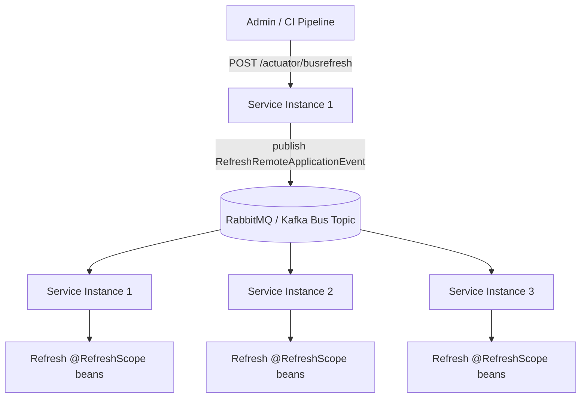
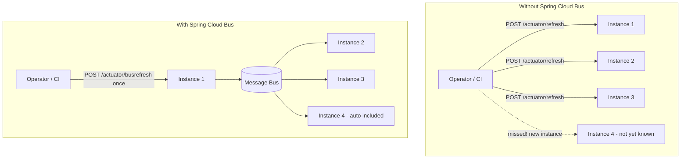
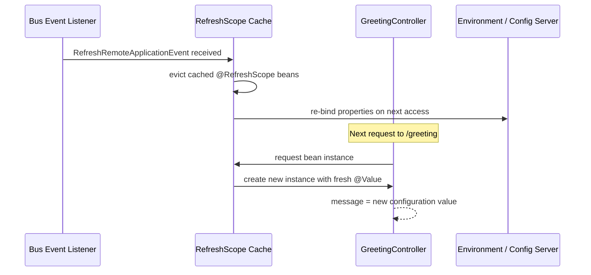
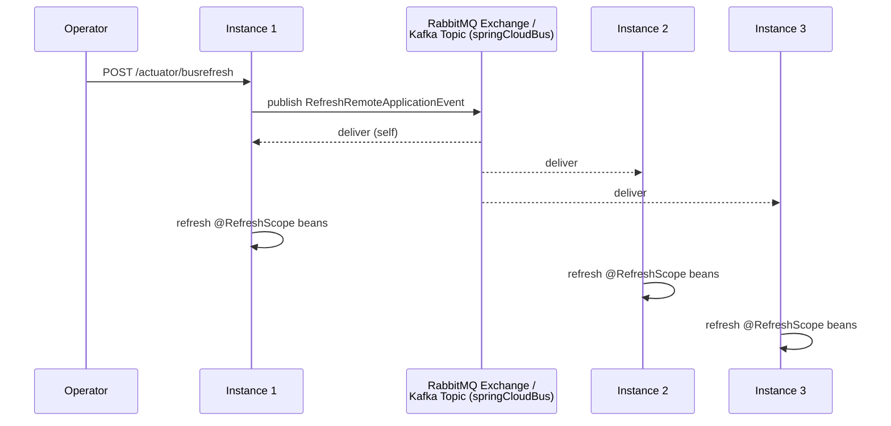
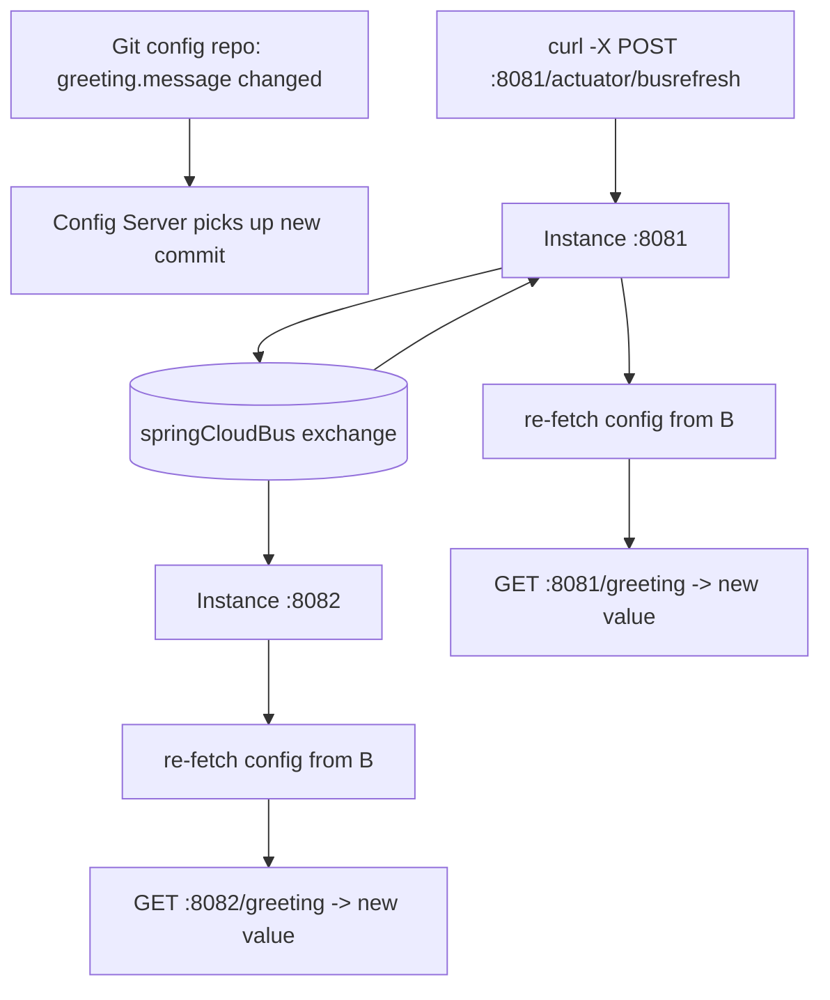

# Spring cloud bus


## Topics

- Spring Cloud Bus
- The Global Refresh Problem
- Add Spring Cloud Bus & Actuator Dependencies
- Enable the /busrefresh URL Endpoint
- Enable Config Refresh
- Use spring cloud Bus in a service
- Implement Spring Cloud Bus and RabbitMQ and Kafka
- Rabbit MQ Default Connection Details
- Change default Rabbit MQ Password
- Trying how Spring Cloud Bus Works

## Detailed Guide

### Spring Cloud Bus

Spring Cloud Bus links nodes of a distributed system with a lightweight message broker (RabbitMQ or Kafka), which can then be used to broadcast state changes (such as configuration changes) or other management instructions across all instances of a service, or across many different services, without the caller needing to know how many instances exist or where they are. It builds on top of Spring Cloud Stream, using it internally as the abstraction for publishing and consuming events on the broker.

Rather than each client polling a config server or being individually notified, Spring Cloud Bus lets you publish a single event (e.g. `RefreshRemoteApplicationEvent`) once, which the broker then fans out to every subscriber. Each application instance that has Spring Cloud Bus on its classpath automatically subscribes to a shared topic/exchange and reacts to events relevant to it.

Common use cases include broadcasting configuration refreshes (in conjunction with Spring Cloud Config), broadcasting environment changes, and propagating custom application events cluster-wide via `RemoteApplicationEvent` subclasses. It effectively turns a single HTTP call into a cluster-wide broadcast, solving coordination problems that would otherwise require calling every instance individually.



**Real-life scenario:** A platform team rotates a third-party API key stored in Git-backed Spring Cloud Config. Instead of restarting or individually pinging 20 running instances across 4 services, they call `/actuator/busrefresh` once on any single instance, and the Bus propagates the refresh event to all 20 instances via RabbitMQ within seconds.

### The Global Refresh Problem

Spring Cloud Config supports refreshing configuration at runtime via the `/actuator/refresh` endpoint combined with `@RefreshScope`-annotated beans, which re-initializes those beans with newly fetched configuration values. The problem is that `/actuator/refresh` only affects the single instance that receives the HTTP call — in a distributed system with many instances (and possibly many different services) using the same config, you would need to call `/actuator/refresh` on every single instance individually, which is operationally painful, error-prone, and doesn't scale as instances are added or removed dynamically.

This is "the global refresh problem": how do you refresh configuration consistently across an entire fleet of instances without manually enumerating and calling each one? Doing this manually also creates race conditions and partial-refresh states, where some instances have picked up the new configuration and others haven't, leading to inconsistent behavior across the cluster during the rollout window.

Spring Cloud Bus was created specifically to solve this: instead of calling `/actuator/refresh` N times, you call `/actuator/busrefresh` once, and the Bus's message-broker-based fan-out ensures every subscribed instance receives and processes the refresh event, converging the whole cluster to the new configuration near-simultaneously.



**Real-life scenario:** A team without Spring Cloud Bus manages configuration refresh with a shell script that curls `/actuator/refresh` against every known instance IP pulled from a service registry. This script breaks whenever new instances start mid-deployment (missing from the enumerated list) or when network partitions cause partial failures — exactly the pain Spring Cloud Bus eliminates.

### Add Spring Cloud Bus & Actuator Dependencies

To use Spring Cloud Bus you need the Bus starter for your chosen broker plus Spring Boot Actuator, which exposes the `/busrefresh` (and related) management endpoints. For RabbitMQ, add `spring-cloud-starter-bus-amqp`; for Kafka, add `spring-cloud-starter-bus-kafka`. Both pull in Spring Cloud Stream binder implementations under the hood, along with `spring-boot-starter-actuator` for the management endpoint infrastructure.

```xml
<dependencies>
    <dependency>
        <groupId>org.springframework.cloud</groupId>
        <artifactId>spring-cloud-starter-bus-amqp</artifactId>
    </dependency>
    <dependency>
        <groupId>org.springframework.boot</groupId>
        <artifactId>spring-boot-starter-actuator</artifactId>
    </dependency>
</dependencies>
```

```xml
<!-- Kafka alternative -->
<dependency>
    <groupId>org.springframework.cloud</groupId>
    <artifactId>spring-cloud-starter-bus-kafka</artifactId>
</dependency>
```

Once these dependencies are on the classpath, Spring Boot auto-configures the connection to the broker (using standard `spring.rabbitmq.*` or `spring.kafka.*` properties) and registers the Bus's event listeners and endpoints automatically — no extra Java configuration is typically required beyond providing broker connection details.

**Real-life scenario:** A team standardizing on RabbitMQ for messaging across their microservices adds `spring-cloud-starter-bus-amqp` to every service's `pom.xml`, reusing the same RabbitMQ cluster that already backs their existing event-driven messaging, avoiding the need to stand up a second broker just for config refresh.

### Enable the /busrefresh URL Endpoint

Spring Boot Actuator endpoints are not all exposed over HTTP by default — only `/health` and `/info` are exposed out of the box. To make `/actuator/busrefresh` callable, you must explicitly include `busrefresh` in `management.endpoints.web.exposure.include`.

```yaml
management:
  endpoints:
    web:
      exposure:
        include: busrefresh, health, info, refresh
```

Once exposed, sending an empty `POST` request to `/actuator/busrefresh` on any instance triggers that instance to publish a `RefreshRemoteApplicationEvent` onto the bus, which every subscribed instance (including the caller) then consumes to refresh their `@RefreshScope` beans.

```bash
curl -X POST http://localhost:8080/actuator/busrefresh
```

**Real-life scenario:** After adding Spring Cloud Bus, a team initially forgets to expose `busrefresh` in `management.endpoints.web.exposure.include` and gets a 404 when calling the endpoint — a common first-time setup mistake, since Actuator's secure-by-default posture hides all non-essential endpoints unless explicitly opted in.

### Enable Config Refresh

For the Bus's refresh event to actually update running beans, those beans must be annotated `@RefreshScope` (or the properties they read must be `@ConfigurationProperties`-bound classes, which Spring Cloud Config also refreshes automatically). `@RefreshScope` creates a scope where the bean is lazily recreated the next time it's accessed after a refresh event, picking up newly bound property values.

```java
@RestController
@RefreshScope
public class GreetingController {

    @Value("${greeting.message:Hello}")
    private String message;

    @GetMapping("/greeting")
    public String greet() {
        return message;
    }
}
```

Without `@RefreshScope`, a singleton bean's `@Value`-injected fields are only bound once at startup and will not change even if the underlying configuration source changes and a refresh event is fired — the refresh mechanism only re-initializes beans that are actually in the refresh scope.



**Real-life scenario:** A team wonders why their feature-flag value never updates despite calling `/actuator/busrefresh` successfully — the root cause is usually a plain `@Component` bean using `@Value` without `@RefreshScope`, so the field was bound once at startup and never re-read.

### Use spring cloud Bus in a service

Wiring a service into the Bus mainly involves adding the dependency, configuring broker connection properties, and exposing the refresh endpoint — application code rarely needs to interact with the Bus's APIs directly for the common configuration-refresh use case, since it's largely declarative.

```yaml
spring:
  application:
    name: order-service
  rabbitmq:
    host: localhost
    port: 5672
    username: guest
    password: guest
  cloud:
    config:
      uri: http://localhost:8888

management:
  endpoints:
    web:
      exposure:
        include: busrefresh
```

For more advanced use cases, a service can publish custom events onto the bus by autowiring `ApplicationEventPublisher` and publishing a `RemoteApplicationEvent` subclass, or listen for bus events with an `@EventListener` for `RemoteApplicationEvent`, enabling custom cluster-wide notifications beyond configuration refresh.

**Real-life scenario:** A microservices team relies purely on the declarative setup — dependency + RabbitMQ connection properties + exposed endpoint — needing zero custom Java code to get cluster-wide config refresh working across all their services.

### Implement Spring Cloud Bus and RabbitMQ and Kafka

Spring Cloud Bus supports both RabbitMQ (AMQP) and Kafka as the underlying transport, chosen by which starter you include (`spring-cloud-starter-bus-amqp` vs `spring-cloud-starter-bus-kafka`). Both work by publishing bus events onto a shared, well-known destination (an exchange for RabbitMQ, a topic for Kafka) that every instance's Spring Cloud Stream binder subscribes to.

```yaml
# RabbitMQ-based bus
spring:
  rabbitmq:
    host: localhost
    port: 5672
    username: guest
    password: guest
```

```yaml
# Kafka-based bus
spring:
  kafka:
    bootstrap-servers: localhost:9092
  cloud:
    stream:
      kafka:
        binder:
          brokers: localhost:9092
```



The choice of transport doesn't change the Bus programming model at all — `@RefreshScope`, `/actuator/busrefresh`, and custom `RemoteApplicationEvent`s work identically regardless of whether RabbitMQ or Kafka is the underlying broker, since Spring Cloud Stream abstracts the messaging details.

| Aspect | RabbitMQ (`spring-cloud-starter-bus-amqp`) | Kafka (`spring-cloud-starter-bus-kafka`) |
|---|---|---|
| Messaging model | Exchange/queue based (push, AMQP protocol) | Log-based topic (pull, partitioned) |
| Typical latency | Very low, near real-time fan-out | Low, slightly higher due to log/consumer-group model |
| Operational fit | Simple to run for lightweight pub/sub and RPC-style messaging | Best when already operating Kafka for event streaming/high-throughput pipelines |
| Message durability | Configurable (can be transient or persisted to disk) | Durable by design (log retention) |
| Best fit | Teams already using RabbitMQ, or wanting simple broker ops | Teams with an existing Kafka platform wanting to reuse it for Bus events |
| Scaling model | Scales via clustering/mirrored queues | Scales via partitions and consumer groups |

**Real-life scenario:** A company already running a Kafka cluster for its event-streaming pipelines chooses `spring-cloud-starter-bus-kafka` for Spring Cloud Bus so it doesn't need to operate a separate RabbitMQ cluster purely for configuration refresh.

### Rabbit MQ Default Connection Details

RabbitMQ ships with a default virtual host (`/`) and a default user `guest`/`guest`, which by default is only permitted to connect from `localhost` for security reasons. Spring Boot's auto-configuration for RabbitMQ reads `spring.rabbitmq.*` properties, defaulting to `localhost:5672` with `guest`/`guest` if nothing else is specified.

```yaml
spring:
  rabbitmq:
    host: localhost
    port: 5672
    username: guest
    password: guest
    virtual-host: /
```

The management UI is typically available on port 15672 (`http://localhost:15672`), separate from the AMQP protocol port 5672 used by applications to actually publish/consume messages, and is useful for inspecting exchanges, queues, and bindings that Spring Cloud Bus creates automatically.

**Real-life scenario:** A developer runs RabbitMQ locally via Docker (`docker run -p 5672:5672 -p 15672:15672 rabbitmq:3-management`) and uses the default `guest`/`guest` credentials purely for local development, while production environments always override these with secrets-managed credentials.

### Change default Rabbit MQ Password

Using the default `guest`/`guest` credentials in any non-local environment is a serious security risk — RabbitMQ's `guest` user is additionally restricted to connections from `localhost` by default specifically to discourage using it outside development. Changing the password (or, better, creating a dedicated application user and disabling/deleting `guest`) is a standard hardening step before deploying Spring Cloud Bus to any shared or production environment.

```bash
# Change the guest user's password
rabbitmqctl change_password guest new_secure_password

# Or, preferably, create a dedicated user with limited permissions
rabbitmqctl add_user order-service-user s3cur3P@ssw0rd
rabbitmqctl set_permissions -p / order-service-user ".*" ".*" ".*"
rabbitmqctl set_user_tags order-service-user management

# Delete the default guest account entirely in production
rabbitmqctl delete_user guest
```

Corresponding Spring configuration should then reference the new credentials, ideally injected via environment variables or a secrets manager rather than hardcoded in `application.yml`:

```yaml
spring:
  rabbitmq:
    host: rabbitmq.internal
    port: 5672
    username: ${RABBITMQ_USERNAME}
    password: ${RABBITMQ_PASSWORD}
```

**Real-life scenario:** A security audit flags a staging environment still using `guest`/`guest` for RabbitMQ, reachable from the internal network — the fix is rotating to a dedicated, least-privilege user with a strong password sourced from a secrets manager, and disabling the `guest` account.

### Trying how Spring Cloud Bus Works

Testing Spring Cloud Bus end-to-end typically involves starting a config server, a RabbitMQ (or Kafka) broker, and at least two instances of a client service pointed at the same config server and broker, then changing a value in the backing Git repository and calling `/actuator/busrefresh` on just one instance to observe both instances pick up the change.

```bash
# 1. Start RabbitMQ
docker run -d --name rabbitmq -p 5672:5672 -p 15672:15672 rabbitmq:3-management

# 2. Start two instances of the client service on different ports
java -jar order-service.jar --server.port=8081
java -jar order-service.jar --server.port=8082

# 3. Change config in the Git-backed config repo, then commit/push

# 4. Trigger a bus-wide refresh from just one instance
curl -X POST http://localhost:8081/actuator/busrefresh

# 5. Verify BOTH instances reflect the new value
curl http://localhost:8081/greeting
curl http://localhost:8082/greeting
```

Watching the RabbitMQ management UI's exchange/queue activity while triggering the refresh is a useful way to visually confirm the fan-out behavior — you should see the `springCloudBus` exchange deliver the event to each instance's auto-declared, uniquely-named queue.



**Real-life scenario:** During onboarding, a new engineer runs exactly this two-instance experiment locally to build intuition for how Spring Cloud Bus differs from a plain `/actuator/refresh` call, observing both instances update simultaneously from a single API call.

## Interview Questions & Answers

### Core Concepts

**Q: What problem does Spring Cloud Bus solve?**

It solves the "global refresh problem" — the need to propagate a state change (typically configuration refresh) to every instance of a distributed application without individually calling each instance. It links instances via a lightweight message broker so one event, published once, reaches all subscribed instances.

**Q: What is Spring Cloud Bus built on top of?**

It's built on Spring Cloud Stream, using its abstraction over message brokers (RabbitMQ or Kafka) to publish and consume `RemoteApplicationEvent`s across all connected application instances.

**Q: What is the difference between `/actuator/refresh` and `/actuator/busrefresh`?**

`/actuator/refresh` only refreshes `@RefreshScope` beans on the single instance that receives the call. `/actuator/busrefresh` publishes a `RefreshRemoteApplicationEvent` onto the message bus, which every subscribed instance across the cluster receives and reacts to, refreshing all of them.

### Setup & Configuration

**Q: What dependencies are required to use Spring Cloud Bus with RabbitMQ?**

`spring-cloud-starter-bus-amqp` (which pulls in the Spring Cloud Stream RabbitMQ binder) plus `spring-boot-starter-actuator` for the management endpoints, along with standard `spring.rabbitmq.*` connection properties.

**Q: Why does `/actuator/busrefresh` return 404 by default even with the Bus dependency on the classpath?**

Because Spring Boot Actuator only exposes `health` and `info` over HTTP by default; `busrefresh` must be explicitly added to `management.endpoints.web.exposure.include` to be reachable.

**Q: What annotation must a bean have for its `@Value`-injected fields to actually change after a bus refresh event?**

`@RefreshScope`. Without it, the bean is a normal singleton whose fields are bound once at startup and never re-evaluated, even if a refresh event fires successfully.

**Q: Can Spring Cloud Bus work with Kafka instead of RabbitMQ?**

Yes — swapping `spring-cloud-starter-bus-amqp` for `spring-cloud-starter-bus-kafka` (and configuring `spring.kafka.*`/binder properties) switches the transport to Kafka with no change to application-level refresh semantics.

### RabbitMQ Specifics

**Q: What are RabbitMQ's default credentials, and what restriction applies to them?**

`guest`/`guest`, restricted by default to only connect from `localhost`, specifically to prevent accidental unsecured exposure outside local development.

**Q: Why should the default `guest` account be changed or removed before production use?**

Because `guest`/`guest` is publicly documented and trivially guessable; leaving it active (especially if the localhost restriction is loosened) is a serious security risk allowing unauthorized access to the broker and, transitively, to bus-triggered application behavior like refresh events.

**Q: How would you rotate the RabbitMQ password used by a Spring Cloud Bus-enabled service with zero downtime?**

Create a new user (or update the password) in RabbitMQ, update `spring.rabbitmq.password` via an externalized property (env var/secrets manager), and perform a rolling restart of instances; using a config-driven credential rather than a hardcoded one avoids code changes for rotation.

### Behavior & Broader Understanding

**Q: What kind of event does calling `/actuator/busrefresh` actually publish?**

A `RefreshRemoteApplicationEvent`, a subtype of `RemoteApplicationEvent`, which is serialized and sent to the shared bus destination; every subscribed instance deserializes and handles it by refreshing its own `@RefreshScope` beans.

**Q: Besides configuration refresh, what else can Spring Cloud Bus be used for?**

Broadcasting arbitrary custom cluster-wide events by publishing custom `RemoteApplicationEvent` subclasses via `ApplicationEventPublisher`, useful for things like cache invalidation signals or feature-flag toggles across all instances, not just configuration changes.

**Q: Does Spring Cloud Bus guarantee all instances refresh at exactly the same instant?**

No — delivery is effectively "at the same time" from the broker's perspective but each instance processes the event independently and asynchronously, so there can be a small, typically sub-second window where instances are momentarily inconsistent during the rollout of a refresh.


## Resources