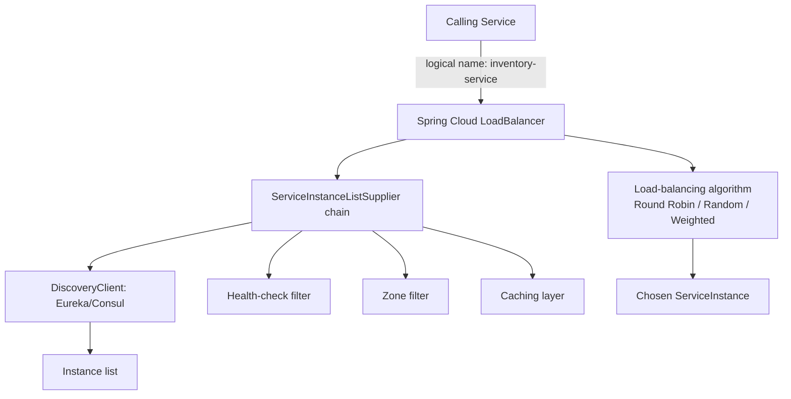
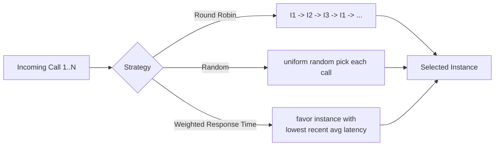
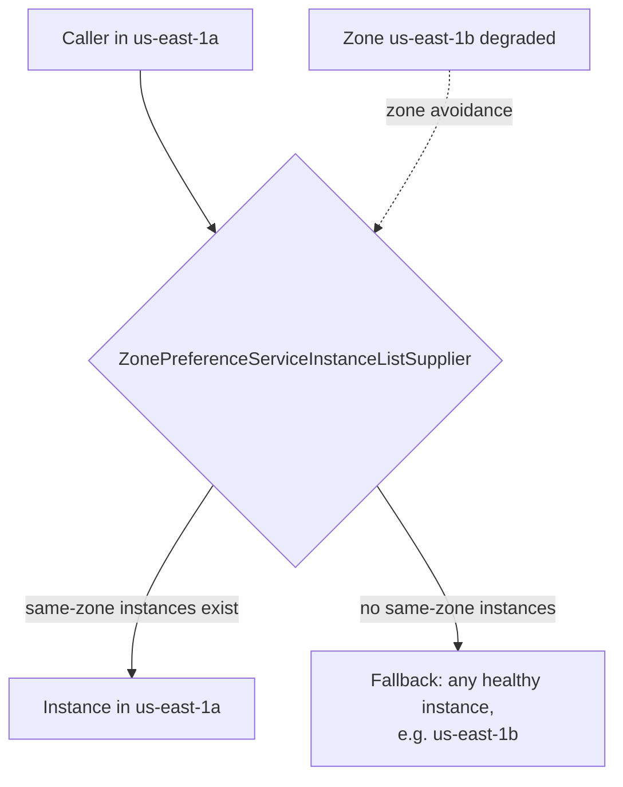
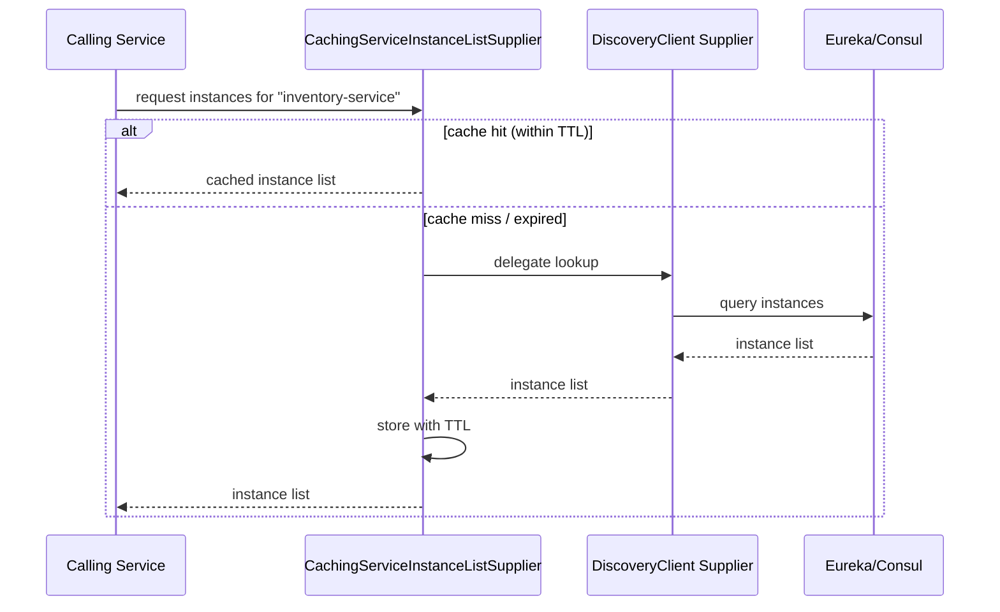
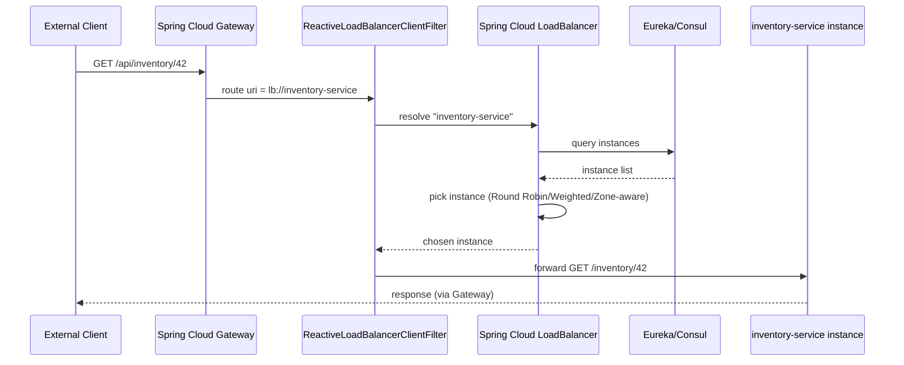

# Spring cloud Load Balancing

## Detailed Guide

### What is Spring Cloud LoadBalancer

Spring Cloud LoadBalancer is Spring Cloud's client-side load-balancing library, providing a pluggable, reactive-friendly abstraction for choosing which instance of a logical service to call when multiple instances are registered (typically via Eureka, Consul, or Zookeeper). It became the default load balancer for Spring Cloud starting with the Spring Cloud release train that deprecated Netflix Ribbon (Greenwich/Hoxton era, fully removed by 2020.0/Ilford), and is what powers `@LoadBalanced RestTemplate`, `WebClient.Builder`, `RestClient.Builder`, and Feign clients under the hood.

At its core, it exposes a `ReactiveLoadBalancer<ServiceInstance>` interface, built around a `ServiceInstanceListSupplier` chain that produces the candidate list of instances for a given service ID, and a load-balancing algorithm (by default, round-robin) that picks one from that list per request. The supplier chain is composable: you can layer health-check filtering, same-zone filtering, and caching on top of the base discovery-client-backed supplier.

Because it's built reactively (returning `Mono<Response<ServiceInstance>>`), it integrates cleanly with both blocking clients (`RestTemplate`, `RestClient`, via a blocking adapter) and fully reactive clients (`WebClient`), giving Spring Cloud a single, consistent load-balancing implementation across all supported HTTP clients.

```java
@Configuration
public class LoadBalancerConfig {

    @Bean
    @LoadBalanced
    public WebClient.Builder loadBalancedWebClientBuilder() {
        return WebClient.builder();
    }
}
```



**Real-life scenario:** A team building a new Spring Boot 3 microservice platform in 2024 uses Spring Cloud LoadBalancer by default (via `@LoadBalanced` builders) without ever needing to add or configure Netflix Ribbon, since it's the built-in, actively maintained option.

**Interview Q&A:**

**Q: What supplier abstraction produces the candidate instance list for a service ID?**
`ServiceInstanceListSupplier`, which can be composed with health-check filtering, zone preference, and caching layers on top of the base discovery-backed supplier.

**Q: Which annotation marks a builder bean so it resolves service names through Spring Cloud LoadBalancer?**
`@LoadBalanced`, applied to a `RestTemplate`, `RestClient.Builder`, or `WebClient.Builder` bean.

### Why should we use Spring Cloud LoadBalancer instead of Netflix Ribbon

Netflix Ribbon was the original client-side load balancer used throughout the Spring Cloud Netflix stack, but Netflix placed the entire Netflix OSS stack (Ribbon, Hystrix, Eureka 1.x server) into maintenance mode years ago, with no active development or new features. Spring Cloud LoadBalancer was created as a lightweight, actively maintained, framework-native replacement that doesn't depend on the legacy Netflix libraries.

Spring Cloud LoadBalancer is built with a reactive-first design and integrates natively with Spring Cloud's `DiscoveryClient` abstraction, whereas Ribbon predates reactive programming in Spring and required more configuration glue to integrate with non-Netflix discovery mechanisms. Since the Spring Cloud 2020.0 (Ilford) release train, Ribbon support has been fully removed from Spring Cloud, making Spring Cloud LoadBalancer the only supported option for new applications.

| Aspect | Netflix Ribbon | Spring Cloud LoadBalancer |
|---|---|---|
| Maintenance status | Deprecated / maintenance mode (Netflix OSS) | Actively maintained by Spring Cloud team |
| Programming model | Blocking, imperative | Reactive-first (`Mono`), works with both blocking and reactive clients |
| Spring Cloud support | Removed since 2020.0 (Ilford) release train | Default and only supported load balancer since Greenwich/Hoxton |
| Discovery integration | Netflix-specific integration points | Native `DiscoveryClient`/`ReactiveDiscoveryClient` integration |
| Extensibility | Rule-based (`IRule` implementations) | Composable `ServiceInstanceListSupplier` chain |
| Configuration | `<service>.ribbon.*` properties | `spring.cloud.loadbalancer.*` properties, `LoadBalancerClientConfiguration` beans |

**Real-life scenario:** A legacy Spring Cloud Greenwich application still using `spring-cloud-starter-netflix-ribbon` fails to compile after upgrading to Spring Boot 3 / Spring Cloud 2022.x, because Ribbon support was removed entirely — forcing (and validating) a migration to Spring Cloud LoadBalancer.

**Interview Q&A:**

**Q: What programming-model difference distinguishes Spring Cloud LoadBalancer from Ribbon?**
Spring Cloud LoadBalancer is reactive-first (returning `Mono<Response<ServiceInstance>>`), while Ribbon was built around blocking, imperative APIs predating Spring's reactive support.

**Q: What configuration prefix replaces Ribbon's `<service>.ribbon.*` properties?**
`spring.cloud.loadbalancer.*`, along with `LoadBalancerClientConfiguration`/`@LoadBalancerClient` beans for per-service customization.

### Custom Load Balancer Strategies (Round Robin, Random, Weighted Response Time)

Spring Cloud LoadBalancer ships with a `RoundRobinLoadBalancer` (the default) and a `RandomLoadBalancer` out of the box, and supports fully custom strategies by implementing `ReactorServiceInstanceLoadBalancer`. Round-robin cycles through the available instances in order, giving each an equal share of traffic over time; random selection picks an instance uniformly at random on each call, which avoids round-robin's strict ordering but can still produce uneven short-term distribution.

A weighted response-time strategy (not built in by default, but a common custom implementation pattern, and available historically in Netflix Ribbon as `WeightedResponseTimeRule`) favors instances that have recently responded faster, dynamically adjusting selection probability based on observed latency — useful when instances have heterogeneous performance (e.g. mixed instance sizes, or one instance under more load than others).

To register a custom strategy, you define a `@Configuration` class (not annotated `@Configuration` on the main application context — it must be a separate configuration class, per Spring Cloud LoadBalancer's `@LoadBalancerClient`/`@LoadBalancerClients` mechanism) and expose your custom `ReactorServiceInstanceLoadBalancer` bean.

```java
public class WeightedResponseTimeLoadBalancer implements ReactorServiceInstanceLoadBalancer {

    private final ObjectProvider<ServiceInstanceListSupplier> supplierProvider;
    private final ConcurrentHashMap<String, Double> avgResponseTimes = new ConcurrentHashMap<>();

    public WeightedResponseTimeLoadBalancer(ObjectProvider<ServiceInstanceListSupplier> supplierProvider) {
        this.supplierProvider = supplierProvider;
    }

    @Override
    public Mono<Response<ServiceInstance>> choose(Request request) {
        ServiceInstanceListSupplier supplier = supplierProvider.getIfAvailable();
        return supplier.get().next().map(instances -> {
            ServiceInstance chosen = instances.stream()
                .min(Comparator.comparingDouble(i ->
                    avgResponseTimes.getOrDefault(i.getInstanceId(), 0.0)))
                .orElseThrow();
            return new DefaultResponse(chosen);
        });
    }
}

// Not part of the main @SpringBootApplication component scan
@Configuration
public class CustomLoadBalancerConfiguration {

    @Bean
    public ReactorServiceInstanceLoadBalancer weightedResponseTimeLoadBalancer(
            Environment environment,
            LoadBalancerClientFactory factory) {
        String serviceId = factory.getName(environment);
        return new WeightedResponseTimeLoadBalancer(
            factory.getLazyProvider(serviceId, ServiceInstanceListSupplier.class));
    }
}

@LoadBalancerClient(name = "inventory-service", configuration = CustomLoadBalancerConfiguration.class)
@Configuration
public class InventoryClientConfig { }
```



| Strategy | Selection logic | Pros | Cons |
|---|---|---|---|
| Round Robin (default) | Cycles through instances in strict order | Simple, predictable, even long-run distribution | Ignores instance load/latency differences |
| Random | Picks uniformly at random each call | Simple, avoids strict-order bias, good with many instances | Short-term distribution can be uneven |
| Weighted Response Time | Weights selection by recent observed latency | Adapts to slow/overloaded instances automatically | More complex to implement/maintain, needs latency tracking |

**Real-life scenario:** A payment-service cluster has a mix of newly added smaller instances and older larger instances; the team implements a custom weighted response-time load balancer so traffic naturally shifts away from the smaller, slower instances without manual intervention.

**Interview Q&A:**

**Q: Why must a custom load-balancer bean live in a separate `@Configuration` class rather than the main auto-scanned application context?**
Because `@LoadBalancerClient`-referenced configurations are deliberately excluded from component scanning, preventing the custom bean from unintentionally overriding the default load balancer for every service instead of just the targeted one.

**Q: What is a downside of the weighted response-time strategy compared to round-robin or random?**
It requires tracking and maintaining recent latency statistics per instance, adding complexity and potential staleness or skew if response times fluctuate quickly.

### Zone Affinity and Zone Avoidance

Zone affinity is a load-balancing strategy that prefers routing requests to instances running in the same "zone" (e.g. the same availability zone or data center) as the calling instance, reducing cross-zone network latency and, in cloud environments, cross-zone data transfer costs. Spring Cloud LoadBalancer supports this via the `ZonePreferenceServiceInstanceListSupplier`, which filters the instance list to same-zone instances when available, but falls back to the full instance list if no same-zone instances exist (avoiding total unavailability just because a zone is temporarily empty).

Zone avoidance is the complementary concept: actively steering traffic away from a zone that is known to be degraded or unhealthy, even if some instances there are technically still reachable, to reduce the blast radius of a zone-level incident. The zone of an instance is typically set via `spring.cloud.loadbalancer.zone` on the server side (or equivalent metadata from the discovery client, e.g. Eureka's `metadata-map.zone`).

```yaml
# Instance-side configuration: declares which zone this instance belongs to
spring:
  cloud:
    loadbalancer:
      zone: us-east-1a
```

```java
@Configuration
@LoadBalancerClient(name = "inventory-service", configuration = ZoneAwareConfig.class)
public class ZoneAwareConfig {

    @Bean
    public ServiceInstanceListSupplier discoveryClientServiceInstanceListSupplier(
            ConfigurableApplicationContext context) {
        return ServiceInstanceListSupplier.builder()
            .withDiscoveryClient()
            .withZonePreference()
            .withHealthChecks()
            .build(context);
    }
}
```



**Real-life scenario:** A multi-AZ deployment on AWS uses zone affinity so that most traffic between services stays within the same availability zone, cutting inter-AZ data transfer costs and latency, while still failing over gracefully to another zone if the local zone's instances become unhealthy.

**Interview Q&A:**

**Q: How is an instance's zone typically declared?**
Via `spring.cloud.loadbalancer.zone` on the instance itself, or equivalent discovery-client metadata such as Eureka's `metadata-map.zone`.

**Q: What supplier implements zone-preference filtering in Spring Cloud LoadBalancer?**
`ZonePreferenceServiceInstanceListSupplier`, which prefers same-zone instances but falls back to the complete instance list when none exist locally.

### Caching Load Balancer Instances with Spring Cloud LoadBalancer

Fetching the full instance list from a discovery server (Eureka, Consul) on every single outgoing call would add unnecessary latency and load to the registry, especially at high request volumes. Spring Cloud LoadBalancer addresses this with a `CachingServiceInstanceListSupplier` decorator, which wraps the base discovery-backed supplier and caches the resolved instance list for a configurable TTL, refreshing it periodically rather than on every call.

By default, Spring Cloud LoadBalancer's caching support uses a `Caffeine`-backed cache when `spring-cloud-starter-loadbalancer` is present with Caffeine on the classpath (falling back to a simple in-memory cache otherwise). Cache TTL and capacity are configurable via `spring.cloud.loadbalancer.cache.*` properties.

```yaml
spring:
  cloud:
    loadbalancer:
      cache:
        enabled: true
        ttl: 35s
        capacity: 256
```

```java
@Configuration
public class CachingLoadBalancerConfig {

    @Bean
    public ServiceInstanceListSupplier discoveryClientServiceInstanceListSupplier(
            ConfigurableApplicationContext context) {
        return ServiceInstanceListSupplier.builder()
            .withDiscoveryClient()
            .withCaching()
            .build(context);
    }
}
```



**Real-life scenario:** During a load test simulating thousands of requests per second between two services, the team notices the Eureka server's CPU usage spike; enabling/tuning the load balancer's instance-list cache (`ttl`) dramatically reduces registry query load without meaningfully affecting how quickly new instances get picked up.

**Interview Q&A:**

**Q: What cache implementation does Spring Cloud LoadBalancer use by default when available on the classpath?**
A Caffeine-backed cache, falling back to a simple in-memory cache if Caffeine isn't present.

**Q: What two properties primarily control the load balancer's instance-list cache?**
`spring.cloud.loadbalancer.cache.ttl` (how long entries stay valid) and `spring.cloud.loadbalancer.cache.capacity` (maximum cache size).

### how Spring Cloud API Gateway Load Balancing works

Spring Cloud Gateway integrates directly with Spring Cloud LoadBalancer through the `lb://` URI scheme in route definitions. When a route's target URI is `lb://service-name`, the Gateway's `LoadBalancerClientFilter` (or `ReactiveLoadBalancerClientFilter`) intercepts the request, resolves `service-name` via Spring Cloud LoadBalancer/DiscoveryClient into a concrete instance, and forwards the request there — applying the exact same load-balancing algorithm, zone-preference, and caching behavior used by `@LoadBalanced WebClient`.

This means the Gateway itself doesn't need any separate load-balancing logic or configuration beyond declaring `lb://` routes; it reuses the same `ReactiveLoadBalancer` infrastructure as the rest of the Spring Cloud ecosystem, so global load-balancer settings (custom strategies, zone affinity, caching) automatically apply to gateway-routed traffic too.

```yaml
spring:
  cloud:
    gateway:
      routes:
        - id: inventory-route
          uri: lb://inventory-service
          predicates:
            - Path=/api/inventory/**
        - id: order-route
          uri: lb://order-service
          predicates:
            - Path=/api/orders/**
```



**Real-life scenario:** An API gateway fronting 15 microservices uses `lb://` routes for every service, so when the platform team scales `inventory-service` from 3 to 6 pods, the Gateway automatically starts routing to all 6 without any route configuration changes.

**Interview Q&A:**

**Q: What URI scheme triggers Spring Cloud LoadBalancer resolution in a Gateway route?**
The `lb://service-name` scheme, which the Gateway's load-balancer filter intercepts and resolves to a concrete instance.

**Q: Does the Gateway need its own separate load-balancing configuration distinct from the rest of the application?**
No — it reuses the same `ReactiveLoadBalancer`/`ServiceInstanceListSupplier` infrastructure, so global strategy, zone-affinity, and caching settings apply uniformly to Gateway-routed traffic.

## Interview Questions & Answers

### Fundamentals

**Q: What is Spring Cloud LoadBalancer, in one sentence?**

It's Spring Cloud's client-side, reactive-friendly load-balancing library that chooses which registered instance of a service to call, replacing Netflix Ribbon as the default in modern Spring Cloud applications.

**Q: What interface underpins Spring Cloud LoadBalancer's instance selection?**

`ReactiveLoadBalancer<ServiceInstance>`, along with `ServiceInstanceListSupplier`, which produces the candidate instance list that the chosen algorithm (round-robin, random, or custom) selects from.

**Q: Does Spring Cloud LoadBalancer work with blocking clients like `RestTemplate`, or only reactive ones?**

Both — while its core is reactive (`Mono`-based), it's used by blocking clients like `RestTemplate` and `RestClient` via an adapter (e.g. `BlockingLoadBalancerClient`), as well as directly by reactive `WebClient` calls.

### Ribbon vs Spring Cloud LoadBalancer

**Q: Why did Spring Cloud move away from Netflix Ribbon?**

Because Netflix placed Ribbon (along with the rest of Netflix OSS) into maintenance mode with no further active development, and Spring Cloud needed an actively maintained, reactive-friendly load balancer, leading to Spring Cloud LoadBalancer becoming the default and, since the 2020.0 release train, the only supported option.

**Q: If you have a Spring Cloud application still configured for Ribbon, what happens when you upgrade to a modern Spring Cloud release train?**

It will fail to build/run, since Ribbon support (`spring-cloud-starter-netflix-ribbon` and related auto-configuration) was fully removed starting with the 2020.0 (Ilford) release train — you must migrate to Spring Cloud LoadBalancer.

### Strategies

**Q: What is the default load-balancing strategy in Spring Cloud LoadBalancer?**

Round-robin, via `RoundRobinLoadBalancer`, which cycles through the available instances in order on successive calls.

**Q: How would you implement a custom load-balancing strategy, such as weighted response time?**

By implementing `ReactorServiceInstanceLoadBalancer` (choosing an instance from the `ServiceInstanceListSupplier`'s list based on your custom logic, e.g. tracked average response times) and registering it as a bean in a separate `@Configuration` class referenced via `@LoadBalancerClient(name = "...", configuration = ...)` — not in the main auto-scanned application configuration.

**Q: What's a key trade-off of random load-balancing compared to round-robin?**

Random selection avoids strict ordering bias and works well with a large number of instances, but can produce uneven short-term distribution (e.g. the same instance being picked several times in a row by chance), whereas round-robin guarantees strictly even distribution over each full cycle.

### Zone Affinity & Caching

**Q: What does zone affinity achieve, and what is the fallback behavior if no instances exist in the caller's zone?**

It prefers routing to instances in the same zone as the caller to reduce latency and cross-zone costs, via `ZonePreferenceServiceInstanceListSupplier`; if no same-zone instances are available, it falls back to the full instance list rather than failing outright.

**Q: Why does Spring Cloud LoadBalancer cache the resolved instance list, and how do you configure it?**

To avoid querying the discovery server (Eureka/Consul) on every single request, which would add latency and load under high traffic; caching is configured via `spring.cloud.loadbalancer.cache.*` properties (`enabled`, `ttl`, `capacity`) and implemented via `CachingServiceInstanceListSupplier`.

### API Gateway Integration

**Q: How does Spring Cloud Gateway use Spring Cloud LoadBalancer for its routes?**

By using the `lb://service-name` URI scheme in route definitions; the Gateway's load-balancer filter resolves the logical service name into a concrete instance via the same Spring Cloud LoadBalancer infrastructure used elsewhere, applying whatever strategy, zone-affinity, and caching configuration is in effect.

**Q: If you add zone-affinity configuration globally, does it automatically apply to Spring Cloud Gateway's `lb://` routes?**

Yes — because the Gateway reuses the standard `ReactiveLoadBalancer`/`ServiceInstanceListSupplier` chain, any globally configured strategy, zone preference, or caching behavior applies uniformly to Gateway-routed traffic as well as direct `WebClient`/`RestTemplate`/Feign calls.


## Other Resources

### Youtube

- [Client Side Load Balancing with Spring Cloud LoadBalancer | Spring Boot Microservices](https://www.youtube.com/watch?v=RuHO3_m6c6E)
- [Spring Cloud Load Balancer Tutorial | Ribbon Alternative | Microservices](https://www.youtube.com/watch?v=fFPEhPp3P4g)
- [Load Balancing in Microservices | Spring Boot | JavaTechie](https://www.youtube.com/watch?v=aTPiJZuqlcM)

### Medium

- [Spring Cloud LoadBalancer – Client-Side Load Balancing](https://www.baeldung.com/spring-cloud-load-balancer)
- [Microservices Load Balancing with Spring Cloud](https://medium.com/@bubu.tripathy/microservices-load-balancing-with-spring-cloud-b59cd832cd70)
