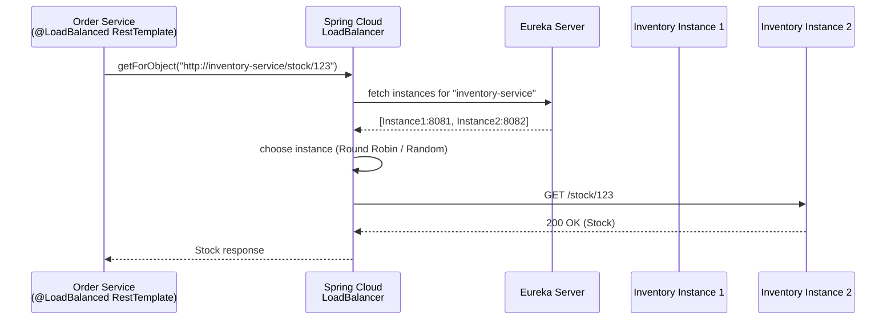
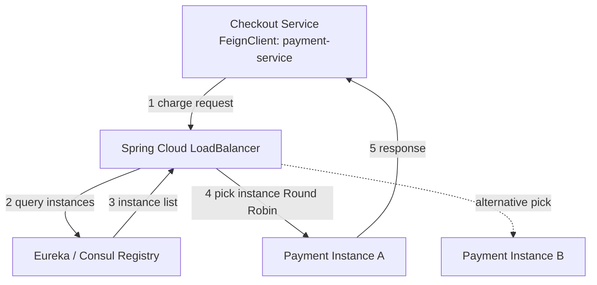
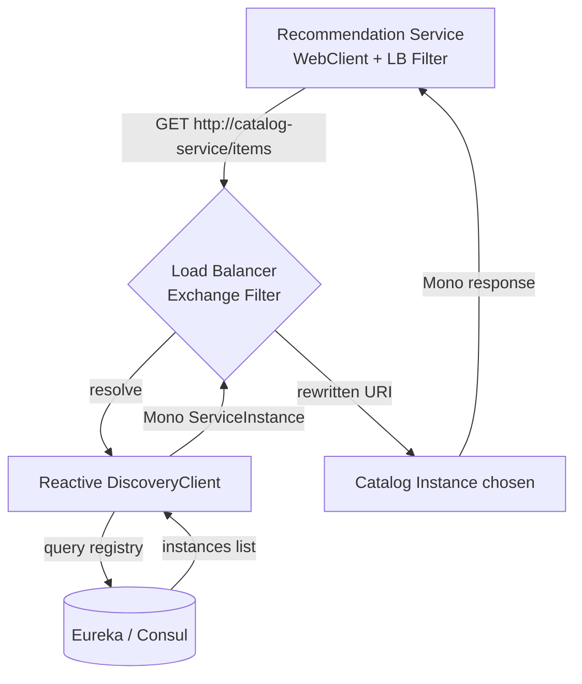
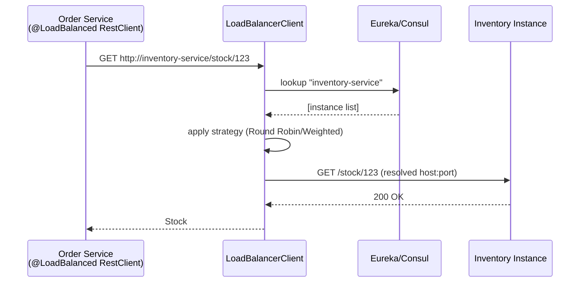
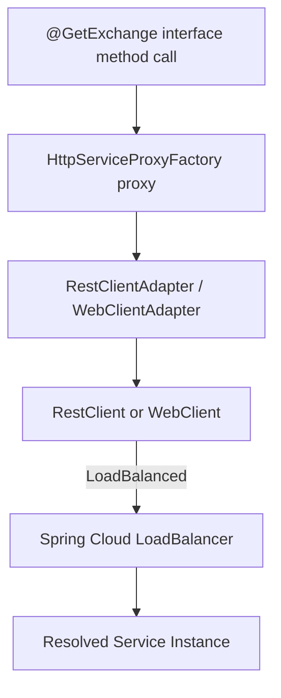

# Rest Client

## Detailed Guide

### Using Rest Template for Service Invocation

`RestTemplate` is Spring's original synchronous, blocking HTTP client, shipped in `spring-web` since the earliest versions of the framework. It follows the classic template method pattern: you call a high-level method such as `getForObject`, `postForEntity`, or `exchange`, and `RestTemplate` takes care of connection handling, message conversion (JSON/XML to Java objects via `HttpMessageConverter`s), and error handling, while you supply the URL, HTTP method, and body.

Even though `RestTemplate` has been in maintenance mode since Spring 5.0 (in favor of `WebClient` and later `RestClient`), it remains extremely common in existing codebases and is still fully supported. It is straightforward to use for simple request/response invocations between microservices and integrates well with `RestTemplateBuilder`, which Spring Boot auto-configures with sensible defaults (message converters, error handlers) and allows customizing timeouts, interceptors, and root URIs.

A typical usage pattern injects a `RestTemplate` bean into a service class and issues calls with either convenience methods (`getForObject`, `postForObject`) or the more flexible `exchange`/`execute` methods, which give full control over headers, HTTP method, and response type (including generic types via `ParameterizedTypeReference`).

```java
@Configuration
public class RestClientConfig {

    @Bean
    public RestTemplate restTemplate(RestTemplateBuilder builder) {
        return builder
            .setConnectTimeout(Duration.ofSeconds(2))
            .setReadTimeout(Duration.ofSeconds(5))
            .build();
    }
}

@Service
public class OrderClient {

    private final RestTemplate restTemplate;

    public OrderClient(RestTemplate restTemplate) {
        this.restTemplate = restTemplate;
    }

    public Order getOrder(Long id) {
        return restTemplate.getForObject("http://localhost:8081/orders/{id}", Order.class, id);
    }

    public Order createOrder(Order order) {
        return restTemplate.postForObject("http://localhost:8081/orders", order, Order.class);
    }

    public List<Order> getAllOrders() {
        ResponseEntity<List<Order>> response = restTemplate.exchange(
            "http://localhost:8081/orders",
            HttpMethod.GET,
            null,
            new ParameterizedTypeReference<List<Order>>() {}
        );
        return response.getBody();
    }
}
```

**Real-life scenario:** A legacy order-management service that has been running for years calls a payment service using a hardcoded URL and `RestTemplate`. It works fine for low-to-moderate traffic, but because it is blocking, each call ties up a thread for the full duration of the remote call, which becomes a scalability concern once traffic spikes during sales events.

**Interview Q&A:**

**Q: Which method would you use to get full control over headers and HTTP method with `RestTemplate`?**
`exchange()` (or `execute()`), which lets you specify the `HttpMethod`, an `HttpEntity` carrying headers/body, and the response type explicitly, unlike convenience methods such as `getForObject`.

**Q: What class handles converting Java objects to/from JSON in `RestTemplate`?**
`HttpMessageConverter` implementations (e.g. `MappingJackson2HttpMessageConverter`), which are auto-configured by `RestTemplateBuilder` based on the libraries present on the classpath.

### Rest Template with Load Balanced

When multiple instances of a downstream service are registered with a service registry (Eureka, Consul, etc.), you don't want to hardcode a single host and port. Spring Cloud LoadBalancer solves this by letting you annotate a `RestTemplate` bean with `@LoadBalanced`. This annotation instructs Spring Cloud to wrap the underlying `ClientHttpRequestFactory` with an interceptor that resolves a logical service ID (e.g. `order-service`) into an actual host:port pair chosen by the configured load-balancing algorithm before the request is sent.

Under the hood, `@LoadBalanced` triggers Spring Cloud's `LoadBalancerInterceptor`, which participates in the `RestTemplate` interceptor chain. Every outgoing request whose URI uses a service name instead of a real host is intercepted, a `ServiceInstance` is chosen via `ReactiveLoadBalancer.Factory`, and the request URI is rewritten with the concrete address before continuing down the chain.

This decouples client code entirely from network topology — the client only ever refers to logical service names, and Spring Cloud LoadBalancer takes care of instance selection, retries, and (optionally) caching of the instance list.

```java
@Configuration
public class LoadBalancedRestTemplateConfig {

    @Bean
    @LoadBalanced
    public RestTemplate loadBalancedRestTemplate(RestTemplateBuilder builder) {
        return builder.build();
    }
}

@Service
public class InventoryClient {

    private final RestTemplate restTemplate;

    public InventoryClient(@Qualifier("loadBalancedRestTemplate") RestTemplate restTemplate) {
        this.restTemplate = restTemplate;
    }

    public Stock checkStock(String sku) {
        // "inventory-service" is a logical name resolved by the load balancer
        return restTemplate.getForObject("http://inventory-service/stock/{sku}", Stock.class, sku);
    }
}
```

**Real-life scenario:** An e-commerce checkout service needs to call the inventory service, which runs as three replicas behind Eureka for high availability. Instead of pointing at one replica (a single point of failure), the checkout service uses a `@LoadBalanced RestTemplate` so requests are automatically spread across all healthy instances.

**Interview Q&A:**

**Q: Does `@LoadBalanced` have any effect if you call a hardcoded IP address instead of a service name?**
No — the `LoadBalancerInterceptor` only rewrites URIs whose host matches a registered logical service ID; a literal IP:port is sent through unchanged.

**Q: What happens if the load balancer can't find any healthy instance for the requested service ID?**
The call fails immediately with an exception (e.g. an `IllegalStateException`/`NotFound` style error from the load-balancer layer) before any HTTP request is attempted, since there is no concrete address to send it to.

### Rest Template with service discovery

Service discovery combines a service registry (Eureka, Consul, Zookeeper) with client-side load balancing so that a `RestTemplate` never needs to know real IP addresses. The service registry maintains a live list of instances per service ID, including health status; the `DiscoveryClient` abstraction lets any Spring Cloud component query that registry, and `@LoadBalanced RestTemplate` uses it transparently through the `ServiceInstanceListSupplier` chain.

In practice, once `spring-cloud-starter-netflix-eureka-client` (or the Consul/Zookeeper equivalent) is on the classpath and `eureka.client.service-url.defaultZone` is configured, each service instance registers itself on startup with a logical application name (`spring.application.name`). Any other service can then call it by that name, and Spring Cloud LoadBalancer resolves it to one of the currently registered, healthy instances.

This is the foundation of dynamic microservice topologies: instances can scale up/down, restart, or move hosts, and calling services adapt automatically without redeployment or configuration changes.

```yaml
# application.yml (both calling and called service)
spring:
  application:
    name: order-service

eureka:
  client:
    service-url:
      defaultZone: http://localhost:8761/eureka/
  instance:
    prefer-ip-address: true
```



**Real-life scenario:** During a Black Friday deployment, the platform team scales the inventory service from 2 to 8 pods using Kubernetes/Eureka registration. No code changes are needed in the calling services — they keep using `http://inventory-service/...` and the load balancer automatically discovers and includes the new pods.

**Interview Q&A:**

**Q: What Spring Cloud abstraction lets any component query the service registry uniformly?**
`DiscoveryClient`, which abstracts over Eureka, Consul, Zookeeper, etc., providing a common API for listing registered instances of a service ID.

**Q: How does a service instance register itself for discovery?**
On startup it registers under its `spring.application.name` as the service ID with the configured registry client (e.g. `eureka.client.service-url.defaultZone`), then sends periodic heartbeats to stay marked as healthy.

### Using Feign REST Client for Service Invocation

OpenFeign is a declarative HTTP client: instead of writing imperative code that builds requests and parses responses, you declare a Java interface annotated with `@FeignClient`, and Spring Cloud OpenFeign generates a dynamic proxy implementation at runtime. Method signatures map to HTTP calls via annotations like `@GetMapping`/`@PostMapping` (or Feign's native `@RequestLine`), making REST calls look like plain method invocations.

Feign integrates encoders/decoders (Jackson by default), supports custom error decoders, request interceptors (e.g. for propagating auth headers), and retry/circuit-breaker integration (Resilience4j). It significantly reduces boilerplate compared to `RestTemplate`, since there's no manual URL building, no manual response-type juggling — just an interface and Spring Cloud does the wiring.

To use it, you add `spring-cloud-starter-openfeign`, annotate a configuration/main class with `@EnableFeignClients`, and declare an interface per remote service.

```java
@EnableFeignClients
@SpringBootApplication
public class OrderServiceApplication { }

@FeignClient(name = "payment-service", url = "${payment.service.url}")
public interface PaymentClient {

    @PostMapping("/payments")
    PaymentResponse charge(@RequestBody PaymentRequest request);

    @GetMapping("/payments/{id}")
    PaymentResponse getPayment(@PathVariable("id") Long id);
}

@Service
public class CheckoutService {

    private final PaymentClient paymentClient;

    public CheckoutService(PaymentClient paymentClient) {
        this.paymentClient = paymentClient;
    }

    public PaymentResponse charge(PaymentRequest request) {
        return paymentClient.charge(request);
    }
}
```

**Real-life scenario:** A checkout service needs to talk to five different downstream services (payment, inventory, shipping, tax, notification). Writing five hand-rolled `RestTemplate` wrappers is repetitive and error-prone; five small `@FeignClient` interfaces keep the code declarative, consistent, and easy to test with `@MockBean`.

**Interview Q&A:**

**Q: What must you add to a Spring Boot application to enable Feign clients?**
The `spring-cloud-starter-openfeign` dependency plus an `@EnableFeignClients` annotation on a configuration or main application class.

**Q: How does Feign map an interface method to an actual HTTP request?**
Through mapping annotations like `@GetMapping`/`@PostMapping` (or Feign-native `@RequestLine`) on interface methods; Spring Cloud OpenFeign generates a dynamic proxy at runtime that turns each call into the corresponding HTTP request.

### Feign REST Client with Load Balanced

Feign clients are load-balanced by default when you omit the `url` attribute and instead specify only the logical service `name` in `@FeignClient`. Spring Cloud OpenFeign automatically wires in Spring Cloud LoadBalancer as the client-side load balancer, so calls to `@FeignClient(name = "inventory-service")` are transparently resolved to one of the registered instances — no `@LoadBalanced` annotation is needed here since it's the Feign client's default behavior when a service name (not a hardcoded URL) is used.

Internally, Feign's `Client` implementation is wrapped by a `FeignBlockingLoadBalancerClient` (for blocking Feign) which delegates instance resolution to the same `LoadBalancerClient`/`ReactiveLoadBalancer` infrastructure used by `RestTemplate` and `WebClient`. This means all three clients share a single, consistent load-balancing configuration (retry policy, health-check-based filtering, caching).

Because load balancing is automatic and declarative, teams often prefer Feign specifically to avoid manually configuring `@LoadBalanced` beans for every client.

```java
@FeignClient(name = "inventory-service")
public interface InventoryClient {

    @GetMapping("/stock/{sku}")
    Stock checkStock(@PathVariable("sku") String sku);
}
```

```properties
# application.properties
spring.cloud.loadbalancer.retry.enabled=true
spring.cloud.loadbalancer.configurations=health-check
```

**Real-life scenario:** A shipping-cost calculator service calls `inventory-service` and `warehouse-service` via Feign clients declared with just logical names. When the ops team adds two more warehouse-service pods for a regional expansion, the Feign calls automatically start including them — zero code or config change required in the calling service.

**Interview Q&A:**

**Q: What class wraps the Feign HTTP client to add load balancing?**
`FeignBlockingLoadBalancerClient`, which delegates instance selection to the same `LoadBalancerClient`/`ReactiveLoadBalancer` infrastructure used by `RestTemplate` and `WebClient`.

**Q: Do you need to add `@LoadBalanced` explicitly to a Feign client?**
No — load balancing is automatic whenever `@FeignClient` specifies a logical `name` instead of a hardcoded `url`; no separate annotation is required.

### Feign REST Client with service discovery

Feign clients rely on the same service discovery abstraction (`DiscoveryClient`) as `RestTemplate` and `WebClient`. When Eureka/Consul/Zookeeper is on the classpath, `@FeignClient(name = "service-id")` is resolved against the registry: Feign asks the load balancer for a healthy instance of `service-id`, and the load balancer asks the discovery client for the current instance list.

This layered design (`Feign -> LoadBalancer -> DiscoveryClient -> Registry`) is what allows Feign interfaces to remain free of any IP/port/host details. It also means all cross-cutting discovery features — health-check filtering, zone affinity, caching — apply equally to Feign as they do to `RestTemplate`/`WebClient`/`RestClient`.



**Real-life scenario:** A payment-service rollout uses a blue/green deployment; the old and new versions both register under the same service name in Consul. Feign clients calling `payment-service` continue to work uninterrupted as instances are swapped, since discovery re-resolves the instance list on every call (subject to caching TTL).

**Interview Q&A:**

**Q: What is the resolution chain when a Feign client calls a service by logical name?**
Feign -> Spring Cloud LoadBalancer -> `DiscoveryClient` -> service registry, with each layer adding no host/IP knowledge to the calling code.

**Q: Can stale instance data affect Feign calls during a rolling deployment?**
Yes — depending on the load balancer's instance-list caching TTL, newly registered or just-deregistered instances may take a short time to be reflected in subsequent Feign calls.

### Using WebClient for connecting different service

`WebClient` is Spring WebFlux's non-blocking, reactive HTTP client, introduced in Spring 5 as the long-term replacement for `RestTemplate`. It returns `Mono<T>`/`Flux<T>` publishers instead of blocking on the response, which means the calling thread is freed immediately and the actual I/O completes asynchronously, notifying subscribers via callbacks when data arrives.

`WebClient` is built with a fluent, chainable API (`webClient.get().uri(...).retrieve().bodyToMono(...)`), supports streaming responses (`Flux` for Server-Sent Events or chunked JSON), and integrates cleanly with reactive pipelines (`flatMap`, `zip`, `retryWhen`, etc.). It works fine in traditional Spring MVC applications too (you can just `.block()` when you need a synchronous result, though that partially defeats its purpose).

Because it doesn't hold a thread per in-flight request, `WebClient` scales significantly better than `RestTemplate` under high concurrency and I/O-bound workloads, at the cost of a steeper learning curve around reactive programming.

```java
@Configuration
public class WebClientConfig {

    @Bean
    public WebClient webClient(WebClient.Builder builder) {
        return builder
            .baseUrl("http://localhost:8081")
            .build();
    }
}

@Service
public class OrderWebClient {

    private final WebClient webClient;

    public OrderWebClient(WebClient webClient) {
        this.webClient = webClient;
    }

    public Mono<Order> getOrder(Long id) {
        return webClient.get()
            .uri("/orders/{id}", id)
            .retrieve()
            .bodyToMono(Order.class);
    }

    public Mono<Order> createOrder(Order order) {
        return webClient.post()
            .uri("/orders")
            .bodyValue(order)
            .retrieve()
            .bodyToMono(Order.class);
    }
}
```

**Real-life scenario:** A notification service must fan out a single event to email, SMS, and push-notification providers concurrently. Using `WebClient`, all three calls are fired non-blockingly and combined with `Mono.zip`, completing in roughly the time of the slowest single call instead of the sum of all three.

**Interview Q&A:**

**Q: What return types does `WebClient` use instead of blocking values?**
`Mono<T>` for a single asynchronous value and `Flux<T>` for a stream of values, both Project Reactor publishers.

**Q: Can `WebClient` be used inside a traditional (non-reactive) Spring MVC application?**
Yes, by calling `.block()` on the returned `Mono`/`Flux` when a synchronous result is needed — the call still executes non-blockingly under the hood, but the calling thread waits for completion.

### WebClient with Load Balanced

Just like `RestTemplate`, a `WebClient.Builder` bean can be annotated with `@LoadBalanced` so any `WebClient` built from it resolves logical service names through Spring Cloud LoadBalancer. Internally, this attaches a `ReactorLoadBalancerExchangeFilterFunction` as an `ExchangeFilterFunction` on the `WebClient`, which intercepts each request, resolves the service ID to a `ServiceInstance`, and rewrites the URI before the exchange is executed — all without blocking, since the load-balancer lookup itself is reactive (`Mono<ServiceInstance>`).

This is the reactive equivalent of the `LoadBalancerInterceptor` used by `RestTemplate`, preserving full non-blocking behavior end-to-end, which is important because mixing a blocking load-balancer lookup into a reactive pipeline would defeat the purpose of using `WebClient` in the first place.

```java
@Configuration
public class LoadBalancedWebClientConfig {

    @Bean
    @LoadBalanced
    public WebClient.Builder loadBalancedWebClientBuilder() {
        return WebClient.builder();
    }
}

@Service
public class InventoryReactiveClient {

    private final WebClient webClient;

    public InventoryReactiveClient(@LoadBalanced WebClient.Builder builder) {
        this.webClient = builder.build();
    }

    public Mono<Stock> checkStock(String sku) {
        return webClient.get()
            .uri("http://inventory-service/stock/{sku}", sku)
            .retrieve()
            .bodyToMono(Stock.class);
    }
}
```

**Real-life scenario:** A reactive recommendation service must call the reactive product-catalog service, which is horizontally scaled to 10 pods. Using a `@LoadBalanced WebClient.Builder` keeps the entire call chain non-blocking while spreading load evenly across all 10 pods.

**Interview Q&A:**

**Q: What `ExchangeFilterFunction` enables load balancing on `WebClient`?**
`ReactorLoadBalancerExchangeFilterFunction`, attached automatically when the `WebClient.Builder` bean is annotated `@LoadBalanced`.

**Q: Why must the load-balancer lookup itself be reactive for `WebClient`?**
Because a blocking lookup inserted into an otherwise non-blocking exchange would tie up a thread and undermine the scalability benefits `WebClient` is meant to provide.

### WebClient with service discovery

`WebClient` participates in service discovery the same way `RestTemplate` and Feign do: the `ReactorLoadBalancerExchangeFilterFunction` delegates to `ReactiveLoadBalancer.Factory`, which in turn queries the configured `ReactiveDiscoveryClient` (Eureka, Consul) for the live instance list of a logical service name embedded in the request URI (`http://service-id/path`).

Because the entire chain — HTTP call, load-balancer resolution, and discovery lookup — is reactive, `WebClient` with service discovery is well suited to reactive/WebFlux applications where you cannot afford to block a thread anywhere in the pipeline, including during service resolution.



**Real-life scenario:** A reactive API gateway built with Spring Cloud Gateway routes traffic to a reactive product service using `lb://product-service` URIs, relying on exactly this `WebClient` + discovery + load-balancer chain internally.

**Interview Q&A:**

**Q: What discovery client interface does the reactive load balancer use?**
`ReactiveDiscoveryClient`, the reactive counterpart of `DiscoveryClient`, exposing instance lookups as `Flux<ServiceInstance>` rather than a blocking list.

**Q: Where in Spring Cloud is the `WebClient` + load-balancer + discovery pattern most commonly used?**
In Spring Cloud Gateway, which routes requests using `lb://service-id` URIs resolved through exactly this reactive chain.

### Using Rest Client for connecting different service

`RestClient`, introduced in Spring Framework 6.1 (Spring Boot 3.2), is a modern synchronous HTTP client with a fluent, `WebClient`-style API but blocking execution semantics like `RestTemplate`. It was created to give teams who don't need reactive programming a clean, chainable API without adopting Project Reactor, while `RestTemplate` remains in maintenance mode.

`RestClient` reuses the same underlying HTTP infrastructure as `RestTemplate` (`ClientHttpRequestFactory`, message converters, `ClientHttpRequestInterceptor`), so migrating from `RestTemplate` to `RestClient` is straightforward, while offering a nicer, more discoverable fluent API (`.get().uri(...).retrieve().body(...)`) similar to `WebClient`'s.

It is the recommended default for new synchronous HTTP client code in Spring Boot 3.2+, replacing the historical advice to use `RestTemplate` for blocking calls.

```java
@Configuration
public class RestClientConfig {

    @Bean
    public RestClient restClient(RestClient.Builder builder) {
        return builder
            .baseUrl("http://localhost:8081")
            .build();
    }
}

@Service
public class OrderRestClient {

    private final RestClient restClient;

    public OrderRestClient(RestClient restClient) {
        this.restClient = restClient;
    }

    public Order getOrder(Long id) {
        return restClient.get()
            .uri("/orders/{id}", id)
            .retrieve()
            .body(Order.class);
    }

    public Order createOrder(Order order) {
        return restClient.post()
            .uri("/orders")
            .body(order)
            .retrieve()
            .body(Order.class);
    }
}
```

**Real-life scenario:** A team migrating a mature Spring Boot 2 application to Spring Boot 3.2 replaces `RestTemplate` calls with `RestClient` one service at a time, keeping the same blocking, MVC-friendly programming model while getting a more ergonomic, fluent call syntax and consistent error handling via `onStatus`.

**Interview Q&A:**

**Q: What Spring version introduced `RestClient`?**
Spring Framework 6.1, shipped as part of Spring Boot 3.2.

**Q: Does `RestClient` share underlying infrastructure with `RestTemplate`?**
Yes — it reuses `ClientHttpRequestFactory`, `HttpMessageConverter`s, and interceptors, so migrating between the two is mostly a change in call syntax, not underlying behavior.

### Rest Client with Load Balanced

Like `RestTemplate` and `WebClient.Builder`, a `RestClient.Builder` bean can be annotated `@LoadBalanced` so that `RestClient` instances built from it resolve logical service names through Spring Cloud LoadBalancer. Because `RestClient` is blocking, the load-balancer resolution here is synchronous, mirroring `RestTemplate`'s `LoadBalancerInterceptor` behavior but wired through `RestClient`'s interceptor mechanism.

This gives teams the same "call services by logical name" ergonomics they're used to from `RestTemplate`, but with `RestClient`'s more modern, fluent API — useful when migrating away from `RestTemplate` without introducing reactive types.

```java
@Configuration
public class LoadBalancedRestClientConfig {

    @Bean
    @LoadBalanced
    public RestClient.Builder loadBalancedRestClientBuilder() {
        return RestClient.builder();
    }
}

@Service
public class InventoryRestClient {

    private final RestClient restClient;

    public InventoryRestClient(@LoadBalanced RestClient.Builder builder) {
        this.restClient = builder.build();
    }

    public Stock checkStock(String sku) {
        return restClient.get()
            .uri("http://inventory-service/stock/{sku}", sku)
            .retrieve()
            .body(Stock.class);
    }
}
```

**Real-life scenario:** A recently modernized order service swaps its `@LoadBalanced RestTemplate` beans for `@LoadBalanced RestClient.Builder` beans during a Spring Boot 3.2 upgrade, gaining a cleaner call syntax while keeping identical load-balancing behavior in production.

**Interview Q&A:**

**Q: What bean type must be annotated `@LoadBalanced` to load-balance a `RestClient`?**
`RestClient.Builder`, not the `RestClient` itself — every `RestClient` built from that builder inherits the load-balancing behavior.

**Q: Is `RestClient`'s load-balancer resolution blocking or reactive?**
Blocking/synchronous, consistent with `RestClient`'s overall execution model, unlike `WebClient`'s reactive `ExchangeFilterFunction`-based resolution.

### Rest Client with service discovery

`RestClient` participates in service discovery exactly like `RestTemplate`: when `@LoadBalanced`, its interceptor consults `LoadBalancerClient`, which in turn queries the `DiscoveryClient` for the registered instances of the logical service name in the request URI. The resolved concrete host:port replaces the logical name before the request is executed.

Since `RestClient` is positioned as `RestTemplate`'s successor, Spring Cloud's discovery and load-balancing integration was designed to be a drop-in equivalent — application code and YAML configuration for Eureka/Consul do not need to change when migrating from `RestTemplate` to `RestClient`.



**Real-life scenario:** A platform standardizes all new microservices on `RestClient` for synchronous calls; because discovery/load-balancing wiring is identical to `RestTemplate`, existing Eureka configuration in `application.yml` needs no changes when new services adopt `RestClient`.

**Interview Q&A:**

**Q: What changes are needed in Eureka/Consul YAML when migrating from `RestTemplate` to `RestClient`?**
None — both share the same `DiscoveryClient` and `LoadBalancerClient` infrastructure, so existing discovery configuration applies unchanged.

**Q: What component actually rewrites the logical service name to a concrete host:port for `RestClient`?**
The load-balancer interceptor wired into the `RestClient.Builder`, using the `ServiceInstance` resolved by `LoadBalancerClient`.

### Declarative HTTP Interface Clients using @HttpExchange

Spring 6 introduced HTTP Interface clients: you declare a plain Java interface with methods annotated `@GetExchange`, `@PostExchange`, `@PutExchange`, `@DeleteExchange` (all meta-annotated with the general-purpose `@HttpExchange`), and Spring generates a runtime proxy backed by an actual HTTP client — typically a `RestClient` or `WebClient` — via `HttpServiceProxyFactory`. This gives you Feign-like declarative ergonomics using only core Spring (no OpenFeign dependency required).

You build the proxy by creating an `HttpServiceProxyFactory` from an adapter around a configured `RestClient` (blocking) or `WebClient` (reactive), then calling `.createClient(YourInterface.class)`. The resulting proxy can be registered as a Spring bean and injected anywhere, just like a `@FeignClient`.

This approach is attractive because it uses first-party Spring infrastructure exclusively, supports both blocking and reactive return types on the same abstraction, and gives fine-grained control since you configure the underlying `RestClient`/`WebClient` (timeouts, interceptors, base URL) yourself rather than relying on Feign's separate configuration model.

```java
public interface InventoryHttpClient {

    @GetExchange("/stock/{sku}")
    Stock checkStock(@PathVariable("sku") String sku);

    @PostExchange("/stock")
    Stock createStock(@RequestBody Stock stock);
}

@Configuration
public class HttpExchangeConfig {

    @Bean
    public InventoryHttpClient inventoryHttpClient(RestClient.Builder builder) {
        RestClient restClient = builder.baseUrl("http://inventory-service").build();
        HttpServiceProxyFactory factory = HttpServiceProxyFactory
            .builderFor(RestClientAdapter.create(restClient))
            .build();
        return factory.createClient(InventoryHttpClient.class);
    }
}
```



**Real-life scenario:** A team wants Feign-style declarative clients but is standardizing on core Spring (avoiding extra third-party abstractions); they define `@HttpExchange` interfaces backed by a `@LoadBalanced RestClient.Builder`, getting declarative calls plus load balancing without adding `spring-cloud-starter-openfeign`.

**Interview Q&A:**

**Q: What factory class builds the runtime proxy for an `@HttpExchange` interface?**
`HttpServiceProxyFactory`, created from an adapter (`RestClientAdapter` or `WebClientAdapter`) around a configured `RestClient` or `WebClient`.

**Q: Do you need OpenFeign on the classpath to use `@HttpExchange`?**
No — `@HttpExchange` is a core Spring Framework 6 feature requiring only `spring-web` (or `spring-webflux` for reactive use), with no separate Feign dependency.

### RestClient vs RestTemplate vs WebClient - When to Use What

Choosing between these three clients comes down to three questions: does the application already use reactive programming (Project Reactor/WebFlux)? Is a fluent, modern API desirable? And is this new code or an existing `RestTemplate` codebase being maintained? `RestTemplate` is blocking and imperative, still fully functional but in maintenance mode; `WebClient` is non-blocking/reactive and the right choice inside WebFlux applications or when high concurrency with limited threads matters; `RestClient` is blocking like `RestTemplate` but with `WebClient`'s fluent API, and is Spring's recommended default for new synchronous client code since Spring Boot 3.2.

| Aspect | RestTemplate | WebClient | RestClient |
|---|---|---|---|
| Execution model | Blocking / synchronous | Non-blocking / reactive (`Mono`/`Flux`) | Blocking / synchronous |
| API style | Traditional method calls (`getForObject`, `exchange`) | Fluent, chainable | Fluent, chainable (like WebClient) |
| Spring availability | Since Spring 3 (maintenance mode since 5.0) | Since Spring 5 (WebFlux) | Since Spring Framework 6.1 / Boot 3.2 |
| Dependency required | `spring-web` | `spring-webflux` | `spring-web` (no WebFlux needed) |
| Thread usage per call | Holds a thread for call duration | Frees thread while awaiting I/O | Holds a thread for call duration |
| Best use case | Legacy MVC apps, simple scripts | Reactive apps, high-concurrency I/O-bound calls, streaming | New synchronous MVC apps wanting modern ergonomics |
| Streaming support | No | Yes (`Flux`, SSE) | No |
| Load balancing | `@LoadBalanced RestTemplate` | `@LoadBalanced WebClient.Builder` | `@LoadBalanced RestClient.Builder` |
| Future direction | Maintenance mode, not recommended for new code | Actively developed, required for WebFlux | Actively developed, recommended default for blocking calls |

**Real-life scenario:** A platform team writing a new synchronous Spring MVC microservice in 2025 chooses `RestClient` over `RestTemplate` for its modern API while avoiding the complexity of reactive types; a separate high-throughput API gateway component, built on WebFlux, uses `WebClient` because it must handle tens of thousands of concurrent in-flight calls without exhausting the thread pool.

**Interview Q&A:**

**Q: If an application is already reactive (WebFlux), which client should it default to?**
`WebClient`, since it fits the reactive execution model end-to-end without introducing blocking calls that would exhaust the limited pool of event-loop threads.

**Q: Which client would a team building a brand-new blocking MVC service choose today, and why?**
`RestClient`, because it's Spring's recommended default for new synchronous client code, offering a modern fluent API while avoiding `RestTemplate`'s maintenance-mode status.

## Interview Questions & Answers

### RestTemplate

**Q: What is `RestTemplate` and why is it said to be in "maintenance mode"?**

`RestTemplate` is Spring's original synchronous HTTP client for making REST calls, built around template methods like `getForObject` and `exchange`. Since Spring 5.0, the Spring team has stated it will only receive minor changes and bug fixes going forward, with `WebClient` (and now `RestClient`) recommended for new code — but it remains fully supported and safe to use in existing applications.

**Q: What is `RestTemplateBuilder` and why should you prefer it over `new RestTemplate()`?**

`RestTemplateBuilder` is a Spring Boot auto-configured builder that applies sensible defaults (message converters matching what's on the classpath, error handlers) and provides a fluent way to set timeouts, interceptors, and a root URI. Using it instead of `new RestTemplate()` ensures Spring Boot's auto-configuration and any customizers registered as `RestTemplateCustomizer` beans are applied consistently.

**Q: How do you set connection and read timeouts on a `RestTemplate`?**

Via `RestTemplateBuilder.setConnectTimeout(Duration)` and `.setReadTimeout(Duration)` when building the bean, e.g. `builder.setConnectTimeout(Duration.ofSeconds(2)).setReadTimeout(Duration.ofSeconds(5)).build()`. Without explicit timeouts, `RestTemplate` may block indefinitely (or use very long platform defaults) waiting on a slow or unresponsive server.

**Q: What does `@LoadBalanced` do on a `RestTemplate` bean?**

It marks the bean so Spring Cloud LoadBalancer injects a `LoadBalancerInterceptor` into its interceptor chain. That interceptor intercepts requests whose host portion is a logical service name (not an IP), resolves it to a concrete `ServiceInstance` via the load balancer, and rewrites the request URI before it's actually sent.

### Feign

**Q: How does OpenFeign differ from `RestTemplate` in how you write client code?**

`RestTemplate` requires imperative code that builds requests and parses responses manually. Feign only requires declaring an interface annotated with `@FeignClient` and mapping annotations (`@GetMapping`, `@PostMapping`); Spring Cloud OpenFeign generates a dynamic proxy at runtime implementing the interface by making the corresponding HTTP calls.

**Q: Is a Feign client load-balanced by default?**

Yes — when a `@FeignClient` is declared with a logical service `name` (instead of a hardcoded `url`), Spring Cloud OpenFeign automatically wraps the underlying HTTP client with `FeignBlockingLoadBalancerClient`, which uses the same Spring Cloud LoadBalancer infrastructure as `RestTemplate`/`WebClient` to resolve and balance across instances.

**Q: How would you add a custom header (e.g. an auth token) to every Feign call?**

By registering a `RequestInterceptor` bean, e.g. implementing `apply(RequestTemplate template)` to call `template.header("Authorization", "Bearer " + token)`. Feign automatically applies all registered `RequestInterceptor` beans to outgoing requests.

**Q: How do you handle non-2xx responses from a Feign client?**

By implementing a custom `ErrorDecoder` bean, which inspects the response status/body and can translate it into a domain-specific exception, or by relying on Feign's default `FeignException` hierarchy which already differentiates by HTTP status code.

### WebClient

**Q: Why is `WebClient` non-blocking, and what does that mean for thread usage?**

`WebClient` is built on Reactor Netty (or another reactive HTTP client) and returns `Mono`/`Flux` publishers instead of blocking the calling thread. The calling thread is released immediately after subscribing; when the response arrives, a small number of event-loop threads handle it and notify downstream subscribers, meaning many concurrent requests can be in flight without holding a thread each.

**Q: What happens if you call `.block()` on a `Mono` returned by `WebClient` inside a servlet (MVC) controller thread?**

It converts the call into a blocking one, defeating much of `WebClient`'s benefit, but it's a legitimate way to use `WebClient` in traditional (non-reactive) MVC applications when you don't need full reactive composition — the request still executes non-blockingly internally, but the calling thread waits for the result.

**Q: How does `@LoadBalanced` work with `WebClient` differently than with `RestTemplate`?**

You annotate a `WebClient.Builder` bean (not the `WebClient` itself) with `@LoadBalanced`. Spring Cloud attaches a `ReactorLoadBalancerExchangeFilterFunction` — an `ExchangeFilterFunction` — that reactively resolves the logical service name to an instance, keeping the entire chain non-blocking, unlike `RestTemplate`'s synchronous interceptor.

**Q: Give an example of when `WebClient`'s streaming capability (returning `Flux`) is useful.**

Consuming Server-Sent Events (SSE) or a large, incrementally-produced JSON array from another service — `WebClient` can expose it as a `Flux<T>` that emits items as they arrive, letting the caller process a live/large stream without loading the whole payload into memory first.

### RestClient

**Q: What problem does `RestClient` (Spring Framework 6.1 / Boot 3.2) solve that `RestTemplate` and `WebClient` didn't?**

It provides a modern, fluent, `WebClient`-style API for teams that want ergonomic call syntax but do not need (or want) reactive programming and Project Reactor as a dependency. It reuses `RestTemplate`'s blocking infrastructure (`ClientHttpRequestFactory`, message converters) under a nicer API.

**Q: Is `RestClient` reactive?**

No — despite its fluent API resembling `WebClient`, `RestClient` executes calls synchronously/blockingly, the same execution model as `RestTemplate`.

**Q: How do you migrate a `@LoadBalanced RestTemplate` bean to `RestClient`?**

Replace the `@LoadBalanced RestTemplate` bean with a `@LoadBalanced RestClient.Builder` bean, then build `RestClient` instances from it (`builder.build()`); the discovery/load-balancing configuration (Eureka/Consul YAML) does not need to change, since both use the same underlying `LoadBalancerClient`.

### Declarative HTTP Interfaces (`@HttpExchange`)

**Q: What is `@HttpExchange` and how does it differ from `@FeignClient`?**

`@HttpExchange` (with its specializations `@GetExchange`, `@PostExchange`, etc.) is a core Spring Framework 6 annotation for declaring HTTP interface clients. Unlike `@FeignClient`, it requires no separate library (no `spring-cloud-starter-openfeign`) — you build the proxy yourself via `HttpServiceProxyFactory` backed by a `RestClient` or `WebClient`.

**Q: Can an `@HttpExchange` interface be backed by either a blocking or reactive client?**

Yes — the same interface style works whether the adapter wraps a `RestClient` (blocking, returns plain objects) or a `WebClient` (reactive, methods can return `Mono`/`Flux`), since `HttpServiceProxyFactory` abstracts over the underlying `HttpExchangeAdapter`.

**Q: How do you enable load balancing for an `@HttpExchange` client?**

By building the `HttpServiceProxyFactory` from a `RestClient` or `WebClient` that itself was built from a `@LoadBalanced` builder bean — load balancing is a property of the underlying client, not of the `@HttpExchange` annotation itself.

### RestClient vs RestTemplate vs WebClient

**Q: For a brand-new synchronous Spring Boot 3.2+ microservice, which client should you choose and why?**

`RestClient`, because it offers a modern fluent API without requiring reactive programming, and it's Spring's recommended default for new blocking HTTP client code, whereas `RestTemplate` is in maintenance mode.

**Q: When would you choose `WebClient` over `RestClient` even in a traditionally blocking application?**

When the application needs to make many concurrent outbound calls efficiently (e.g. fanning out to several downstream services) without exhausting a thread pool, or needs streaming support (SSE, chunked responses) — `WebClient`'s non-blocking model handles high concurrency far better than blocking clients.

**Q: Are `RestTemplate`, `WebClient`, and `RestClient` all compatible with Spring Cloud LoadBalancer and service discovery?**

Yes — all three support `@LoadBalanced` builder/bean annotations that resolve logical service names via the same `LoadBalancerClient`/`ReactiveLoadBalancer` infrastructure backed by `DiscoveryClient` implementations (Eureka, Consul, Zookeeper), so switching between them doesn't require changing discovery configuration.


## Resources

### Medium

- [Spring Cloud Interview Questions and Answers](https://medium.com/javaguides/spring-cloud-interview-questions-and-answers-c566883646eb)
- [Top 15 Spring Cloud Interview Questions with Answers](https://medium.com/javarevisited/top-15-spring-cloud-interview-questions-with-answers-619e5e1169e6)

- [Mastering RestClient in Spring Boot 3.2+: The Modern Way to Call REST APIs](https://medium.com/@smita.s.kothari/exploring-the-new-restclient-in-spring-boot-3-2-721e75d64a86)
- [How to Configure Global Settings for Spring RestClient](https://ibrahimgunduz34.medium.com/how-to-configure-global-settings-for-spring-restclient-620b10772e93)
- [Spring Boot RestClient: The Simple Guide Every Developer Needs](https://medium.com/@sarveshkhamkar321/spring-boot-restclient-the-simple-guide-every-developer-needs-4285014810bf)
- [Building a Modern Spring Boot REST Client with HTTP Interface](https://medium.com/@aniwangeamos/building-a-modern-spring-boot-rest-client-with-http-interface-2ed4b0a0044d)
- [Spring Boot 4 HTTP Interfaces & Declarative REST Clients with @HttpExchange — A Complete Guide](https://medium.com/@sibinraziya/spring-boot-4-http-interfaces-declarative-rest-clients-with-httpexchange-a-complete-guide-3e4dd2686a1f)
- [Spring Boot 3+: How to Use RestClient with @HttpExchange Annotation](https://medium.com/@vinodjagwani/spring-boot-3-how-to-use-restclient-with-httpexchange-annotation-4afc8c99e4b6)

