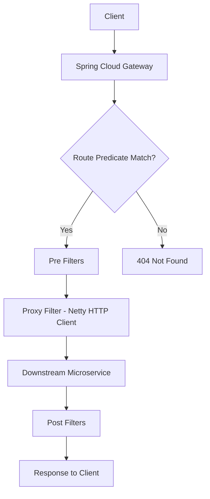
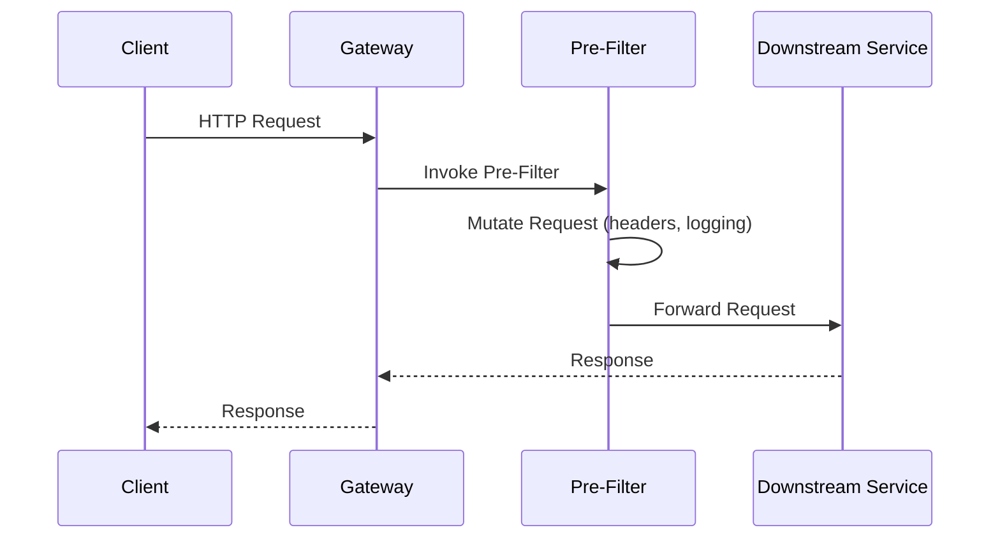
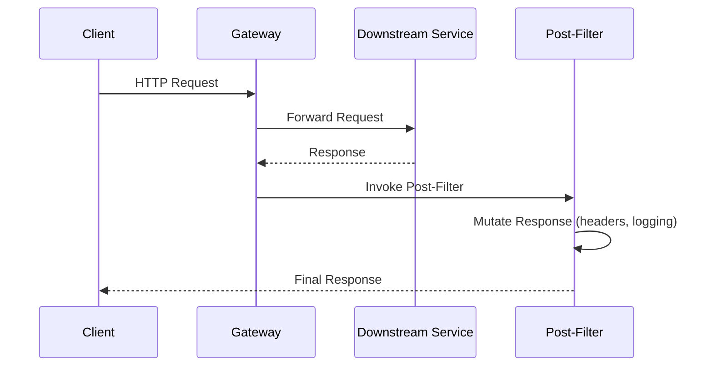
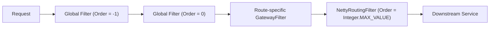
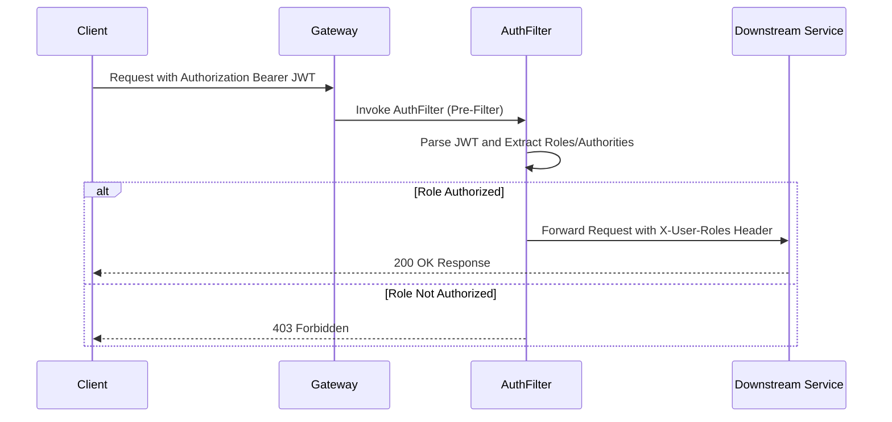
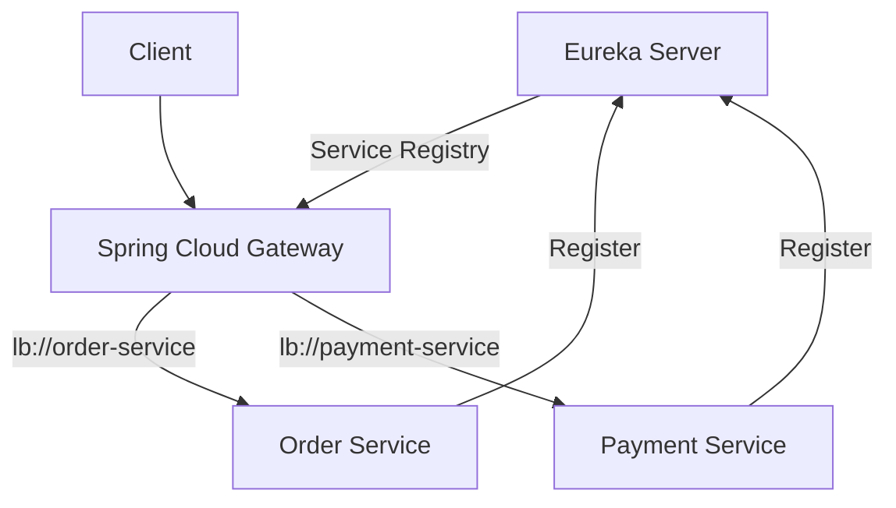
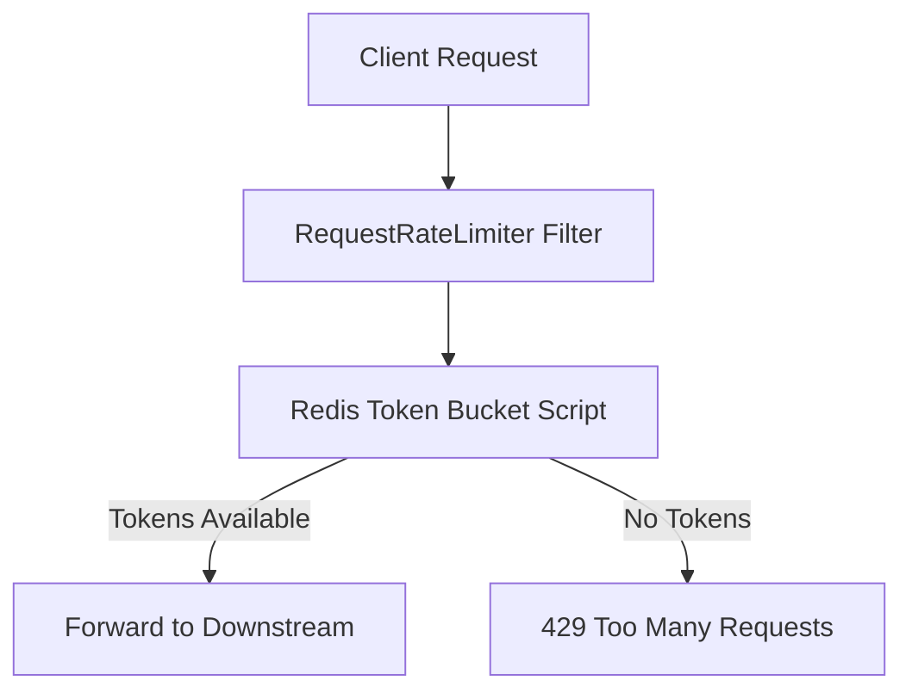
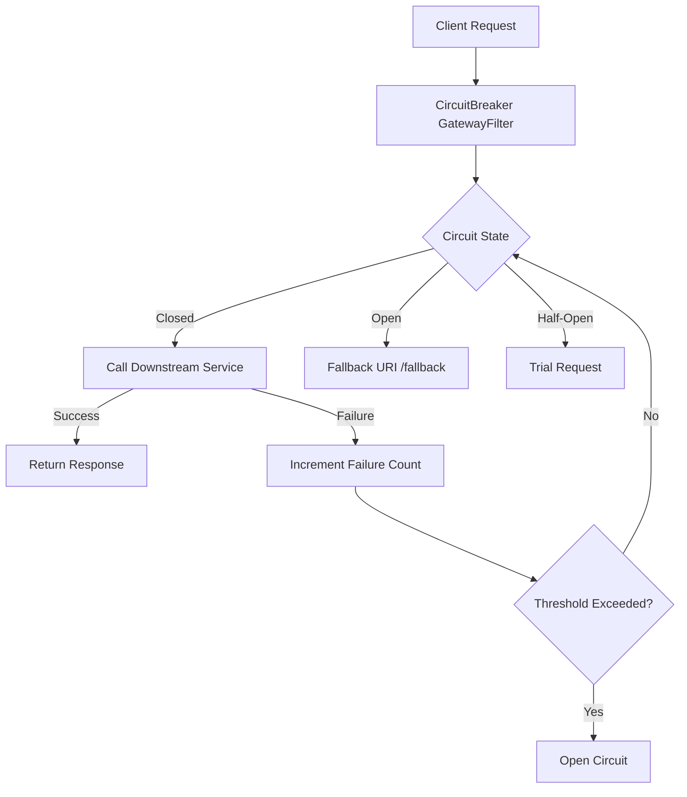

# Spring Cloud API Gateway


## Topics

- Explore Spring Cloud API Gateway and all its connfiguration
- Spring Spring Cloud API Gateway Reactive 
- Exploring Routes with Spring Cloud Gateway
- Automatic Mapping of API Gateway Routes
- Manually Configuring API Gateway Routes
- Automatic & Manual Routing in Spring Cloud API Gateway
- Trying how Spring Cloud API Gateway works
- Rewriting URL Path in Spring Cloud API Gateway
- Build-In Predicate Factories in Spring Cloud API Gateway
- Gateway Filters in Spring Cloud API Gateway
- Implementing Spring Cloud Gateway Logging Filter
- Introduction to Global Filters in Spring Cloud API Gateway
- Creating Global Pre Filter in Spring Cloud API Gateway
- Accessing Request Path and HTTP Headers
- Trying how Pre Filter Works
- Creating Global Post Filter in Spring Cloud API Gateway
- Trying how the Post Filter works
- Defining Filters in a Single Class
- Ordering Global Filters in Spring Cloud API Gateway
- how ordered filters work
- Reviewing Gateway Filter class
- Reading Roles and Authorities from JWT
- Sending Arguments(ROLE) to a Filter class
- Sending Arguments(Authority) to a Filter class
- Passing multiple roles and authorities as a single in-line argument
- Multiple arguments: Trying how it works
- Include error message in Response Body of Spring Cloud Gateway
- Problems with Spring Cloud Gateway
- Enabling Discovery Locator with Eureka for Spring Cloud Gateway
- Rate Limiting in Spring Cloud Gateway using Redis
- Configuring the RequestRateLimiter Gateway Filter
- Integrating Resilience4j Circuit Breaker Filter in Spring Cloud Gateway
- CORS Configuration in Spring Cloud Gateway


## Detailed Guide

### Explore Spring Cloud API Gateway and all its connfiguration

Spring Cloud Gateway is Spring's official replacement for Netflix Zuul, built directly on top of Spring WebFlux, Project Reactor, and Netty. It acts as the single entry point into a microservices architecture, sitting in front of downstream services and handling cross-cutting concerns such as routing, authentication, rate limiting, and observability so individual services don't have to. The core building blocks are **Routes** (an ID, a destination URI, a list of predicates, and a list of filters), **Predicates** (conditions that must match for a route to be used), and **Filters** (logic that modifies the request before it is proxied, or the response before it is returned to the client).

Configuration can be done declaratively in `application.yml`/`application.properties`, or programmatically using a `RouteLocator` bean in Java. Both approaches are equally valid; YAML is easier to read and version, while Java gives you full control (conditional logic, dynamic predicates, custom filter chaining). Spring Cloud Gateway auto-configures a `RouteLocatorBuilder`, a `RouteDefinitionLocator`, and the underlying Netty-based HTTP client used to proxy requests downstream.

Because the gateway is just another Spring Boot application, all the usual Spring Boot mechanisms apply: `@ConfigurationProperties`, profiles, Actuator endpoints (`/actuator/gateway/routes` is invaluable for inspecting the active route table at runtime), and Spring Cloud Config for centralized configuration across environments.

```yaml
spring:
  cloud:
    gateway:
      routes:
        - id: order-service-route
          uri: http://localhost:8081
          predicates:
            - Path=/api/orders/**
          filters:
            - StripPrefix=1
management:
  endpoints:
    web:
      exposure:
        include: gateway
```



**Real-life scenario:** A company exposes dozens of internal microservices (orders, payments, inventory) but wants clients to talk to a single public host, `api.company.com`. Spring Cloud Gateway is deployed as that single entry point, routing `/api/orders/**` to the order service and `/api/payments/**` to the payment service, while centrally enforcing authentication and logging for every request.

### Spring Spring Cloud API Gateway Reactive

Spring Cloud Gateway is a fully **reactive, non-blocking** gateway. Unlike the older Netflix Zuul 1.x (which was built on the Servlet API and used blocking I/O with a thread-per-request model), Spring Cloud Gateway runs on Spring WebFlux with Reactor Netty as the server and HTTP client. Requests and responses are represented as `Mono<Void>` and `Flux<DataBuffer>` streams, and filters compose reactively using operators like `.then()`, `.map()`, and `.flatMap()` instead of imperative method calls.

This reactive foundation means the gateway can handle a very large number of concurrent connections with a small, fixed-size event-loop thread pool, because threads are never blocked waiting on I/O (such as a slow downstream call). This is particularly valuable for a gateway, since by definition it multiplexes traffic to many backend services and needs to stay responsive even when one downstream service is slow.

The trade-off is a steeper learning curve: filters must be written in a non-blocking style, and blocking calls (e.g., JDBC, blocking HTTP clients) inside a filter can stall the event loop and degrade throughput for all requests. Any blocking operation must be offloaded to a bounded elastic scheduler (`Schedulers.boundedElastic()`).

| Aspect | Spring Cloud Gateway (Reactive) | Zuul 1.x (Servlet, Blocking) |
|---|---|---|
| Programming model | Reactive (WebFlux/Reactor) | Imperative (Servlet API) |
| Concurrency model | Event loop, non-blocking | Thread-per-request, blocking |
| Underlying server | Netty | Tomcat/Jetty |
| Scalability under load | High, fewer threads needed | Lower, threads exhausted under high concurrency |
| Learning curve | Steeper (reactive operators) | Simpler (traditional Java) |

### Exploring Routes with Spring Cloud Gateway

A **Route** is the fundamental unit of Spring Cloud Gateway's routing table. Each route has: a unique `id`, a target `uri` (which can be a static host or a `lb://service-name` for load-balanced, service-discovery-based routing), one or more `predicates` that must all evaluate to `true` for the route to match, and zero or more `filters` applied to matching requests. Routes are evaluated in order, and the first matching route wins, so route ordering matters when predicates overlap.

At startup, Spring Cloud Gateway builds an in-memory route table from all configured `RouteDefinitionLocator` beans (YAML-based `PropertiesRouteDefinitionLocator`, Java-based `RouteLocatorBuilder` beans, and, if enabled, the `DiscoveryClientRouteDefinitionLocator` for service-discovery-based routes). This table can be inspected and even refreshed at runtime through the Actuator Gateway endpoints.

```yaml
spring:
  cloud:
    gateway:
      routes:
        - id: payment-service
          uri: lb://payment-service
          predicates:
            - Path=/api/payments/**
            - Method=GET,POST
        - id: inventory-service
          uri: lb://inventory-service
          predicates:
            - Path=/api/inventory/**
```

### Automatic Mapping of API Gateway Routes

Automatic route mapping relies on the **Discovery Locator**, which introspects the service registry (Eureka, Consul, etc.) and creates one route per registered service automatically, typically reachable at `/<service-id>/**`. This is enabled with `spring.cloud.gateway.discovery.locator.enabled=true` and requires a `DiscoveryClient` implementation on the classpath (e.g., `spring-cloud-starter-netflix-eureka-client`).

This approach is extremely convenient in dynamic environments where services are added, removed, or scaled frequently, since there is no need to hand-write a route for every microservice — the gateway keeps the route table in sync with the registry automatically. It is covered in more depth later in the **Enabling Discovery Locator with Eureka** section.

```yaml
spring:
  cloud:
    gateway:
      discovery:
        locator:
          enabled: true
          lower-case-service-id: true
```

**Real-life scenario:** A platform team onboarding new microservices frequently doesn't want to modify the gateway's configuration for every new service. By enabling the discovery locator, any service that registers itself with Eureka using the name `order-service` is immediately reachable at `/order-service/**` without any gateway redeploy.

### Manually Configuring API Gateway Routes

Manual route configuration means explicitly declaring each route's `id`, `uri`, `predicates`, and `filters`, either in YAML or via a `RouteLocator` Java bean. This gives full, explicit control over path rewriting, filter chains, ordering, and predicate combinations, which is often required for anything beyond the simplest 1:1 path-to-service mapping.

```java
@Configuration
public class GatewayRouteConfig {

    @Bean
    public RouteLocator customRouteLocator(RouteLocatorBuilder builder) {
        return builder.routes()
                .route("order-service-route", r -> r
                        .path("/api/orders/**")
                        .filters(f -> f.stripPrefix(1))
                        .uri("lb://order-service"))
                .route("payment-service-route", r -> r
                        .path("/api/payments/**")
                        .uri("lb://payment-service"))
                .build();
    }
}
```

### Automatic & Manual Routing in Spring Cloud API Gateway

Automatic (discovery-based) and manual routing are not mutually exclusive — many real systems use both together: manual routes for services that need custom path rewriting, filters, or fine-grained predicates, and automatic discovery-locator routes as a catch-all for everything else. When both are enabled, manually defined routes take precedence if their predicates match first, since discovery-locator routes are typically appended after the explicitly configured ones.

| Aspect | Automatic (Discovery Locator) | Manual (YAML / Java) |
|---|---|---|
| Setup effort | Minimal, one flag to enable | Requires explicit config per service |
| Flexibility | Limited (default path pattern) | Full control over predicates/filters |
| Best for | Fast-moving, many microservices | Public APIs needing path rewriting, custom filters |
| Risk | Accidentally exposes internal services | Requires maintenance as services change |
| Typical use | Internal/admin routing | Public-facing gateway routes |

### Trying how Spring Cloud API Gateway works

To see the gateway in action end-to-end, start a downstream service (say, on port 8081), configure a simple route pointing to it, and start the gateway (typically on port 8080). A request to `http://localhost:8080/api/orders/1` is matched against the route table, the matching route's predicates confirm the path matches `/api/orders/**`, any configured filters run, and the request is proxied to the downstream service. The response then flows back through any response-side (post) filters before being returned to the client.

Actuator's `/actuator/gateway/routes` endpoint is the fastest way to verify what routes are actually active, which is especially useful when routes come from multiple sources (YAML plus discovery locator). Enabling `logging.level.org.springframework.cloud.gateway=TRACE` during development shows exactly which predicates matched and which filters ran for a given request, which is invaluable for debugging routing issues.

```bash
curl -v http://localhost:8080/api/orders/1
curl http://localhost:8080/actuator/gateway/routes
```

### Rewriting URL Path in Spring Cloud API Gateway

Clients often use a public path convention (e.g., `/api/orders/**`) that doesn't match the downstream service's actual internal path structure. The `RewritePath` filter (and the simpler `StripPrefix` filter) let the gateway translate the externally visible path into whatever path the backend service expects, without the backend needing any knowledge of the gateway's URL scheme.

`StripPrefix=1` simply removes the first N path segments, while `RewritePath` uses a regex with capture groups for arbitrary transformations, making it far more flexible for path shapes that aren't a simple prefix strip.

```yaml
spring:
  cloud:
    gateway:
      routes:
        - id: order-service-rewrite
          uri: lb://order-service
          predicates:
            - Path=/api/orders/**
          filters:
            - RewritePath=/api/orders/(?<segment>.*), /internal/v2/orders/${segment}
```

**Real-life scenario:** The public API contract is `/api/orders/{id}`, but the order service was recently re-versioned internally to expose `/internal/v2/orders/{id}`. Using `RewritePath`, the gateway keeps the public contract stable for existing API consumers while allowing the backend team to evolve their internal routes freely.

### Build-In Predicate Factories in Spring Cloud API Gateway

Spring Cloud Gateway ships with a rich set of built-in `RoutePredicateFactory` implementations that can be combined (implicitly ANDed) on a single route: `Path`, `Method`, `Header`, `Query`, `Cookie`, `Host`, `After`/`Before`/`Between` (time-based), `RemoteAddr` (client IP/CIDR), and `Weight` (for A/B or canary traffic splitting), among others. Predicates are pure functions of the incoming `ServerWebExchange` that return `true` or `false` — all of a route's predicates must match for the route to be selected.

Combining predicates enables precise routing rules, such as only routing `POST` requests with a specific header to a canary deployment, or only allowing traffic from an internal IP range to reach an admin route.

```yaml
spring:
  cloud:
    gateway:
      routes:
        - id: admin-route
          uri: lb://admin-service
          predicates:
            - Path=/api/admin/**
            - Method=GET,POST
            - Header=X-Internal-Request, true
            - RemoteAddr=10.0.0.0/24
```

### Gateway Filters in Spring Cloud API Gateway

**GatewayFilters** operate on a single route (as opposed to **GlobalFilters**, which apply to every route). They can modify the request before it's forwarded (e.g., `AddRequestHeader`, `StripPrefix`, `RewritePath`) or the response before it's returned (e.g., `AddResponseHeader`, `DedupeResponseHeader`). Spring Cloud Gateway ships dozens of built-in `GatewayFilterFactory` implementations, and custom ones can be created by implementing `GatewayFilter` or `GatewayFilterFactory`.

Filters within a route are applied in the order they are declared for the request phase, and in reverse order for the response phase, since each filter wraps the next one in the chain (the classic "filter chain"/decorator pattern applied reactively via `Mono` composition).

```java
@Component
public class CustomHeaderGatewayFilterFactory extends AbstractGatewayFilterFactory<CustomHeaderGatewayFilterFactory.Config> {

    public CustomHeaderGatewayFilterFactory() {
        super(Config.class);
    }

    @Override
    public GatewayFilter apply(Config config) {
        return (exchange, chain) -> {
            ServerHttpRequest request = exchange.getRequest().mutate()
                    .header("X-Gateway-Filter", config.getHeaderValue())
                    .build();
            return chain.filter(exchange.mutate().request(request).build());
        };
    }

    public static class Config {
        private String headerValue;
        public String getHeaderValue() { return headerValue; }
        public void setHeaderValue(String headerValue) { this.headerValue = headerValue; }
    }
}
```

### Implementing Spring Cloud Gateway Logging Filter

A logging `GatewayFilter` (or `GlobalFilter`) is one of the most common custom filters written for a gateway — it records the incoming request (method, path, headers) and, on the response side, the status code and latency, giving centralized visibility into every request flowing through the system without instrumenting every downstream service individually.

Because the gateway is reactive, logging must be hooked into the reactive chain using `.then()` so it executes after the downstream call completes, rather than blocking to wait for it.

```java
@Component
public class LoggingGatewayFilterFactory extends AbstractGatewayFilterFactory<Object> {

    private static final Logger log = LoggerFactory.getLogger(LoggingGatewayFilterFactory.class);

    @Override
    public GatewayFilter apply(Object config) {
        return (exchange, chain) -> {
            long start = System.currentTimeMillis();
            log.info("Incoming request: {} {}", exchange.getRequest().getMethod(), exchange.getRequest().getPath());
            return chain.filter(exchange).then(Mono.fromRunnable(() -> {
                long duration = System.currentTimeMillis() - start;
                log.info("Response status: {} in {} ms",
                        exchange.getResponse().getStatusCode(), duration);
            }));
        };
    }
}
```

**Real-life scenario:** An operations team needs a single place to capture request/response latency for every microservice for an SLA dashboard, without changing code in each of the 20+ downstream services. A logging filter at the gateway level captures this centrally for every request.

### Introduction to Global Filters in Spring Cloud API Gateway

**Global filters** (`GlobalFilter`) apply to *every* route automatically, unlike `GatewayFilter`s which must be explicitly attached to a route's filter list. They are ideal for cross-cutting concerns that should apply uniformly — authentication, correlation ID generation, centralized logging, or metrics — without having to repeat the same filter configuration on every single route.

Internally, Spring Cloud Gateway merges all `GlobalFilter` beans with each route's specific `GatewayFilter`s into a single sorted filter chain (sorted by `getOrder()` for filters that implement `Ordered`) before executing the request. This unified chain is what makes the pre/post filter model consistent whether a filter is global or route-specific.

```java
@Component
public class GlobalLoggingFilter implements GlobalFilter, Ordered {

    @Override
    public Mono<Void> filter(ServerWebExchange exchange, GatewayFilterChain chain) {
        System.out.println("Global Filter executing for: " + exchange.getRequest().getPath());
        return chain.filter(exchange);
    }

    @Override
    public int getOrder() {
        return -1;
    }
}
```

### Creating Global Pre Filter in Spring Cloud API Gateway

A **pre-filter** is logic that runs *before* the request is proxied to the downstream service. Common use cases include request validation, adding correlation/trace IDs, authentication/authorization checks, and request header manipulation. In the reactive filter chain, "pre" logic is simply code that executes before calling `chain.filter(exchange)`.

If a pre-filter determines the request should not proceed (e.g., failed authentication), it can short-circuit the chain entirely by setting the response status and returning `exchange.getResponse().setComplete()` instead of calling `chain.filter(...)`.

```java
@Component
public class PreGlobalFilter implements GlobalFilter, Ordered {

    @Override
    public Mono<Void> filter(ServerWebExchange exchange, GatewayFilterChain chain) {
        ServerHttpRequest mutatedRequest = exchange.getRequest().mutate()
                .header("X-Request-Start", String.valueOf(System.currentTimeMillis()))
                .build();
        // Pre-filter logic runs here, before chain.filter() forwards downstream
        return chain.filter(exchange.mutate().request(mutatedRequest).build());
    }

    @Override
    public int getOrder() {
        return -1;
    }
}
```



### Accessing Request Path and HTTP Headers

Inside any `GatewayFilter` or `GlobalFilter`, the current request is available via `exchange.getRequest()`, a `ServerHttpRequest`. From it you can read the path (`getPath()`), query parameters (`getQueryParams()`), and headers (`getHeaders()`). Because `ServerHttpRequest` is immutable, modifying it requires calling `.mutate()` to build a new request object and attaching it to a new exchange via `exchange.mutate().request(...).build()`.

This pattern — read, mutate, rebuild the exchange — is central to almost every custom filter, whether adding an auth header, rewriting a path dynamically, or stripping sensitive headers before forwarding to a downstream service.

```java
@Override
public Mono<Void> filter(ServerWebExchange exchange, GatewayFilterChain chain) {
    String path = exchange.getRequest().getPath().value();
    HttpHeaders headers = exchange.getRequest().getHeaders();
    String authHeader = headers.getFirst(HttpHeaders.AUTHORIZATION);

    System.out.println("Path: " + path + ", Authorization present: " + (authHeader != null));
    return chain.filter(exchange);
}
```

### Trying how Pre Filter Works

To verify a pre-filter is working, add a header or log statement inside it, then issue a request and confirm — either via logs or by inspecting the header at the downstream service — that the mutation happened before the request reached the backend. A common testing technique is to have the downstream service simply echo back all received headers so the injected header (e.g., `X-Request-Start`) is visible in the final response.

Because the reactive chain executes pre-filter code synchronously (or via composed `Mono`s) before `chain.filter(exchange)` runs, ordering issues are usually caused by multiple pre-filters having the same `getOrder()` value or an incorrect assumption about ascending vs. descending order.

### Creating Global Post Filter in Spring Cloud API Gateway

A **post-filter** runs *after* the downstream service has responded, but before the response reaches the client. This is where you'd add response headers, transform the response body, capture the final status code for metrics, or log completed request latency. In reactive style, post-filter logic is attached using `.then()` (or `.doOnSuccess()`/`.doFinally()`) on the `Mono<Void>` returned by `chain.filter(exchange)`, since there's no "after" callback in an imperative sense.

```java
@Component
public class PostGlobalFilter implements GlobalFilter, Ordered {

    @Override
    public Mono<Void> filter(ServerWebExchange exchange, GatewayFilterChain chain) {
        return chain.filter(exchange).then(Mono.fromRunnable(() -> {
            ServerHttpResponse response = exchange.getResponse();
            response.getHeaders().add("X-Response-Time",
                    String.valueOf(System.currentTimeMillis()));
        }));
    }

    @Override
    public int getOrder() {
        return 1;
    }
}
```



**Real-life scenario:** Security policy requires that no downstream service's internal server banner or version headers leak to external clients. A global post-filter strips sensitive response headers (e.g., `Server`, `X-Powered-By`) right before the response leaves the gateway, regardless of which backend produced them.

### Trying how the Post Filter works

Testing a post-filter is similar to testing a pre-filter, but you inspect the *response* rather than the request. A quick way is to call the route with `curl -v` and check the response headers for the value injected by the post-filter (e.g., `X-Response-Time`). If the header is missing, it's usually because `.then()` wasn't used correctly — modifying `exchange.getResponse()` must happen in a callback chained after `chain.filter(exchange)` completes, not before it.

Another common pitfall is that the response body has already been committed by the time some post-filters run, so header-only mutations are safe, but body rewriting typically requires wrapping the `ServerHttpResponseDecorator` before calling `chain.filter()`.

### Defining Filters in a Single Class

While `GlobalFilter`s are typically one class per concern, it's common in real projects to consolidate several related global filters (e.g., a combined pre+post logging/auth filter) into a single class implementing both the pre and post logic, since a `GlobalFilter.filter()` method can contain pre-logic, call `chain.filter(exchange)`, and then chain post-logic with `.then()` — all in one place.

```java
@Component
public class CombinedGlobalFilter implements GlobalFilter, Ordered {

    @Override
    public Mono<Void> filter(ServerWebExchange exchange, GatewayFilterChain chain) {
        // Pre-filter logic
        System.out.println("Pre-Filter: incoming request " + exchange.getRequest().getPath());

        return chain.filter(exchange).then(Mono.fromRunnable(() -> {
            // Post-filter logic
            System.out.println("Post-Filter: response status " + exchange.getResponse().getStatusCode());
        }));
    }

    @Override
    public int getOrder() {
        return 0;
    }
}
```

### Ordering Global Filters in Spring Cloud API Gateway

When multiple `GlobalFilter`s (and route-specific `GatewayFilter`s) are present, Spring Cloud Gateway needs a deterministic execution order. This is controlled by implementing the `Ordered` interface (or using the `@Order` annotation) and returning an integer from `getOrder()` — **lower values run first** on the request (pre) side, and correspondingly **last** on the response (post) side, because each filter wraps the next like layers of an onion.

Spring Cloud Gateway itself uses well-known internal filters with specific order values, e.g., `NettyRoutingFilter` runs with `Ordered.LOWEST_PRECEDENCE` (last, since it's the filter that actually performs the proxy call), so custom global filters are typically ordered somewhere in between using small integers like `-1`, `0`, `1`.

```java
@Component
public class OrderedGlobalFilter implements GlobalFilter, Ordered {

    @Override
    public Mono<Void> filter(ServerWebExchange exchange, GatewayFilterChain chain) {
        return chain.filter(exchange);
    }

    @Override
    public int getOrder() {
        return -100; // runs early on the request path
    }
}
```



### how ordered filters work

Internally, Spring Cloud Gateway collects all applicable filters for a request (global + route-specific), sorts them using `AnnotationAwareOrderComparator` (which respects both `Ordered.getOrder()` and `@Order`), and then builds a single reactive chain where each filter's `chain.filter(exchange)` call invokes the next filter in the sorted list. This means the **pre-filter portion** of each filter runs in ascending order of `getOrder()`, while the **post-filter portion** (code after `chain.filter()`) naturally unwinds in the *reverse* order, exactly like nested try/finally blocks or a stack.

A common mistake is assuming all pre-logic across all filters runs, then all post-logic runs in the same order — in reality, it strictly alternates per filter in a nested fashion: pre(A) → pre(B) → downstream call → post(B) → post(A).

### Reviewing Gateway Filter class

The `GatewayFilter` interface (`org.springframework.cloud.gateway.filter.GatewayFilter`) has a single functional method: `Mono<Void> filter(ServerWebExchange exchange, GatewayFilterChain chain)`. This is nearly identical in shape to `GlobalFilter`, the key difference being scope — a `GatewayFilter` is attached to specific routes (either directly or via a `GatewayFilterFactory` referenced by name in configuration), while a `GlobalFilter` automatically applies everywhere.

Most built-in filters (`AddRequestHeaderGatewayFilterFactory`, `StripPrefixGatewayFilterFactory`, `RewritePathGatewayFilterFactory`, etc.) extend `AbstractGatewayFilterFactory<Config>`, which handles binding YAML filter arguments to a strongly typed `Config` object and exposes an `apply(Config config)` method returning the actual `GatewayFilter` lambda.

| Aspect | `GatewayFilter` | `GlobalFilter` |
|---|---|---|
| Scope | Single route (must be attached) | Every route automatically |
| Configuration | Declared per-route in YAML/Java | Registered once as a Spring bean |
| Typical use | Route-specific behavior (rewrite, strip prefix) | Cross-cutting concerns (auth, logging, tracing) |
| Interface | `GatewayFilter` / `GatewayFilterFactory` | `GlobalFilter` |

### Reading Roles and Authorities from JWT

A very common gateway responsibility is centralized authorization: parsing an incoming JWT (typically from the `Authorization: Bearer <token>` header), validating its signature/expiry, and extracting roles or authorities from its claims (e.g., a `roles` or `scope` claim) — all *before* the request reaches any downstream service. This centralizes security logic in one place instead of duplicating JWT parsing across every microservice.

Since the gateway is reactive, JWT parsing is typically done synchronously inside the filter (JWT libraries like `jjwt` or Nimbus JOSE are CPU-bound, not I/O-bound, so they don't need to be offloaded to a separate scheduler) and then the extracted roles are attached as a request header or as an exchange attribute for downstream filters to use.

```java
@Component
public class JwtAuthenticationFilter implements GlobalFilter, Ordered {

    private final JwtParser jwtParser; // configured with signing key

    @Override
    public Mono<Void> filter(ServerWebExchange exchange, GatewayFilterChain chain) {
        String authHeader = exchange.getRequest().getHeaders().getFirst(HttpHeaders.AUTHORIZATION);
        if (authHeader == null || !authHeader.startsWith("Bearer ")) {
            exchange.getResponse().setStatusCode(HttpStatus.UNAUTHORIZED);
            return exchange.getResponse().setComplete();
        }

        String token = authHeader.substring(7);
        Claims claims = jwtParser.parseClaimsJws(token).getBody();
        List<String> roles = claims.get("roles", List.class);

        ServerHttpRequest mutatedRequest = exchange.getRequest().mutate()
                .header("X-User-Roles", String.join(",", roles))
                .build();

        return chain.filter(exchange.mutate().request(mutatedRequest).build());
    }

    @Override
    public int getOrder() {
        return -1;
    }
}
```



**Real-life scenario:** A banking application needs every microservice to trust that "the caller has role ADMIN" without each service re-implementing JWT validation. The gateway validates the JWT once, extracts roles, and forwards a trusted internal header (`X-User-Roles`) — downstream services only need to check that header, since network-level policies ensure they're only reachable through the gateway.

### Sending Arguments(ROLE) to a Filter class

Rather than hard-coding a required role inside a filter, Spring Cloud Gateway's `GatewayFilterFactory` mechanism allows arguments to be passed from route configuration, making the same filter class reusable across many routes with different required roles. This is done by defining a `Config` class with a `role` field and referencing it in YAML with named arguments.

```java
@Component
public class RoleAuthorizationGatewayFilterFactory
        extends AbstractGatewayFilterFactory<RoleAuthorizationGatewayFilterFactory.Config> {

    public RoleAuthorizationGatewayFilterFactory() {
        super(Config.class);
    }

    @Override
    public GatewayFilter apply(Config config) {
        return (exchange, chain) -> {
            String roles = exchange.getRequest().getHeaders().getFirst("X-User-Roles");
            if (roles == null || !roles.contains(config.getRole())) {
                exchange.getResponse().setStatusCode(HttpStatus.FORBIDDEN);
                return exchange.getResponse().setComplete();
            }
            return chain.filter(exchange);
        };
    }

    public static class Config {
        private String role;
        public String getRole() { return role; }
        public void setRole(String role) { this.role = role; }
    }
}
```

```yaml
spring:
  cloud:
    gateway:
      routes:
        - id: admin-only-route
          uri: lb://admin-service
          predicates:
            - Path=/api/admin/**
          filters:
            - RoleAuthorization=ADMIN
```

### Sending Arguments(Authority) to a Filter class

The same argument-passing pattern applies to authorities (fine-grained permissions, as opposed to broader roles). The `Config` class can hold an `authority` field, and the filter checks that the caller's extracted authorities (from the JWT, forwarded via a header or exchange attribute) contain the required value before allowing the request through.

```yaml
spring:
  cloud:
    gateway:
      routes:
        - id: order-write-route
          uri: lb://order-service
          predicates:
            - Path=/api/orders/**
            - Method=POST
          filters:
            - AuthorityAuthorization=ORDER_WRITE
```

```java
public static class Config {
    private String authority;
    public String getAuthority() { return authority; }
    public void setAuthority(String authority) { this.authority = authority; }
}
```

### Passing multiple roles and authorities as a single in-line argument

Some filters need to accept a *list* of acceptable roles/authorities rather than a single value — for example, a route accessible to either `ADMIN` or `MANAGER`. Spring Cloud Gateway's shorthand YAML filter syntax supports comma-separated values that get bound to a `List<String>` (or split manually inside the filter using `String.split(",")`), keeping the route configuration compact and in-line rather than requiring verbose expanded arguments syntax.

```yaml
spring:
  cloud:
    gateway:
      routes:
        - id: reports-route
          uri: lb://reporting-service
          predicates:
            - Path=/api/reports/**
          filters:
            - RoleAuthorization=ADMIN,MANAGER
```

```java
public static class Config {
    private List<String> roles;
    public List<String> getRoles() { return roles; }
    public void setRoles(List<String> roles) { this.roles = roles; }
}

@Override
public GatewayFilter apply(Config config) {
    return (exchange, chain) -> {
        String userRoles = exchange.getRequest().getHeaders().getFirst("X-User-Roles");
        boolean authorized = config.getRoles().stream()
                .anyMatch(role -> userRoles != null && userRoles.contains(role));
        if (!authorized) {
            exchange.getResponse().setStatusCode(HttpStatus.FORBIDDEN);
            return exchange.getResponse().setComplete();
        }
        return chain.filter(exchange);
    };
}
```

### Multiple arguments: Trying how it works

Testing multi-argument filters means issuing requests as users with different combinations of roles and confirming the expected outcome: a user with `ADMIN` or `MANAGER` should pass, while a user with neither should receive `403 Forbidden`. It's good practice to write a couple of `WebTestClient`-based integration tests directly against the gateway (using `@SpringBootTest` with a stubbed downstream service, e.g., via WireMock) rather than relying purely on manual `curl` testing, since filter argument binding bugs (typos in YAML filter names, wrong `Config` field names) are easy to introduce silently.

```java
@Test
void shouldAllowAdminRole() {
    webTestClient.get().uri("/api/reports/summary")
            .header("X-User-Roles", "ADMIN")
            .exchange()
            .expectStatus().isOk();
}

@Test
void shouldRejectUnauthorizedRole() {
    webTestClient.get().uri("/api/reports/summary")
            .header("X-User-Roles", "GUEST")
            .exchange()
            .expectStatus().isForbidden();
}
```

### Include error message in Response Body of Spring Cloud Gateway

By default, when a gateway filter short-circuits a request (e.g., `403 Forbidden`), the response body may be empty, which is unhelpful for API consumers. It's good practice to write a structured JSON error body (status, message, timestamp, path) directly onto the `ServerHttpResponse` using a `DataBufferFactory`, so failures are as self-explanatory to clients as a normal downstream error response would be.

```java
private Mono<Void> writeErrorResponse(ServerWebExchange exchange, HttpStatus status, String message) {
    ServerHttpResponse response = exchange.getResponse();
    response.setStatusCode(status);
    response.getHeaders().add(HttpHeaders.CONTENT_TYPE, MediaType.APPLICATION_JSON_VALUE);

    String body = String.format(
            "{\"status\":%d,\"error\":\"%s\",\"message\":\"%s\",\"path\":\"%s\"}",
            status.value(), status.getReasonPhrase(), message, exchange.getRequest().getPath().value());

    DataBuffer buffer = response.bufferFactory().wrap(body.getBytes(StandardCharsets.UTF_8));
    return response.writeWith(Mono.just(buffer));
}
```

**Real-life scenario:** A mobile app team integrating with the gateway's protected routes needs machine-readable error responses (not just an HTTP status code) so their app can display a meaningful message like "You don't have permission to view this report" instead of a generic failure screen.

### Problems with Spring Cloud Gateway

While powerful, Spring Cloud Gateway has real operational challenges teams should be aware of. Because it's fully reactive, any accidental blocking call inside a custom filter (a blocking JDBC lookup, a synchronous HTTP client, even excessive logging to a slow sink) can stall Netty's small event-loop thread pool and cause latency spikes or timeouts across *all* traffic through the gateway — not just the offending route. Debugging reactive stack traces is also harder than imperative code, since exceptions often surface far from where they originated.

Other known pain points include: the gateway becoming a single point of failure and a scalability bottleneck if not deployed with multiple replicas behind a load balancer; increased operational complexity from centralizing cross-cutting logic that must now be carefully tested (a bug in a global filter affects every route); WebSocket and Server-Sent Events support requiring extra care; and the discovery-locator's automatic routes potentially exposing internal-only services publicly if access isn't explicitly restricted. Additionally, the reactive programming model itself has a steeper learning curve for teams used to imperative Spring MVC code, increasing onboarding time and the risk of subtly incorrect filter implementations.

### Enabling Discovery Locator with Eureka for Spring Cloud Gateway

To automatically expose every service registered with Eureka as a gateway route, add `spring-cloud-starter-netflix-eureka-client` to the gateway's dependencies, enable the Eureka client, and set `spring.cloud.gateway.discovery.locator.enabled=true`. Once enabled, a service registered as `order-service` becomes reachable at `/order-service/**` (or lower-cased, depending on configuration), with the gateway performing client-side load balancing across all instances of that service via the `lb://` scheme under the hood.

```yaml
spring:
  application:
    name: api-gateway
  cloud:
    gateway:
      discovery:
        locator:
          enabled: true
          lower-case-service-id: true
eureka:
  client:
    service-url:
      defaultZone: http://localhost:8761/eureka/
```



**Real-life scenario:** In a rapidly scaling e-commerce platform, new microservices (recommendations, wishlist, reviews) are deployed weekly. Instead of updating the gateway's route configuration for every new service, the discovery locator automatically exposes each newly registered Eureka service, letting teams ship new services independently of gateway changes.

### Rate Limiting in Spring Cloud Gateway using Redis

Rate limiting protects downstream services from being overwhelmed by too many requests from a single client, IP, user, or API key. Spring Cloud Gateway ships a built-in `RequestRateLimiter` `GatewayFilterFactory` backed by **Redis**, implementing a token-bucket algorithm via a Lua script (`redis-rate-limiter` on the classpath, from `spring-cloud-starter-gateway` plus `spring-boot-starter-data-redis-reactive`). Redis is used specifically because rate-limit state must be shared and consistent across all gateway instances in a horizontally scaled deployment — an in-memory counter would reset per-instance and undercount the true global rate.

The token bucket is defined by a **replenish rate** (tokens added per second) and a **burst capacity** (maximum tokens the bucket can hold), allowing short bursts above the steady-state rate while still enforcing a long-term average limit. Each request consumes one (or more) tokens; if no tokens remain, the gateway immediately returns `429 Too Many Requests` without ever reaching the downstream service.



**Real-life scenario:** A public-facing weather API allows free-tier users 10 requests per second with short bursts up to 20, to prevent a single abusive client from degrading service for everyone else, while still allowing legitimate momentary traffic spikes (e.g., a page loading several widgets at once).

### Configuring the RequestRateLimiter Gateway Filter

The `RequestRateLimiter` filter is configured per-route with a `redis-rate-limiter.replenishRate`, `redis-rate-limiter.burstCapacity`, and a `key-resolver` bean (a `KeyResolver` implementation, e.g., resolving by user ID from a header, by API key, or by client IP) that determines *what* is being rate-limited — since limits are almost always per-caller, not global to the route.

```yaml
spring:
  cloud:
    gateway:
      routes:
        - id: weather-api-route
          uri: lb://weather-service
          predicates:
            - Path=/api/weather/**
          filters:
            - name: RequestRateLimiter
              args:
                redis-rate-limiter.replenishRate: 10
                redis-rate-limiter.burstCapacity: 20
                key-resolver: "#{@userKeyResolver}"
```

```java
@Configuration
public class RateLimiterConfig {

    @Bean
    public KeyResolver userKeyResolver() {
        return exchange -> Mono.justOrEmpty(
                exchange.getRequest().getHeaders().getFirst("X-User-Id"))
                .defaultIfEmpty("anonymous");
    }
}
```

| Aspect | Redis-backed Rate Limiter | In-Memory Rate Limiter |
|---|---|---|
| State sharing | Consistent across all gateway instances | Per-instance only, inconsistent when scaled |
| Accuracy at scale | High (centralized counter) | Low (each instance enforces its own limit) |
| Extra infrastructure | Requires a Redis deployment | None |
| Latency overhead | Small extra network round-trip | None |
| Best for | Multi-instance, production gateways | Single-instance, dev/test environments |

### Integrating Resilience4j Circuit Breaker Filter in Spring Cloud Gateway

Spring Cloud Gateway integrates with **Resilience4j** via the `spring-cloud-starter-circuitbreaker-reactor-resilience4j` dependency, exposing a `CircuitBreaker` `GatewayFilterFactory`. This wraps a route's downstream call with circuit-breaker semantics: if failures (timeouts, 5xx errors, exceptions) exceed a configured threshold within a sliding window, the circuit "opens" and subsequent calls are immediately redirected to a configured `fallbackUri` instead of hitting the (likely struggling) downstream service — protecting it from further load and giving it time to recover.

After a configured wait duration, the circuit transitions to "half-open" and allows a small number of trial requests through; if those succeed, the circuit closes again, and if they fail, it re-opens. This is strictly more resilient than a simple retry, since retries alone can amplify load on an already-struggling service, whereas a circuit breaker actively backs off.

```yaml
spring:
  cloud:
    gateway:
      routes:
        - id: order-service-cb-route
          uri: lb://order-service
          predicates:
            - Path=/api/orders/**
          filters:
            - name: CircuitBreaker
              args:
                name: orderServiceCircuitBreaker
                fallbackUri: forward:/fallback/orders
resilience4j:
  circuitbreaker:
    instances:
      orderServiceCircuitBreaker:
        sliding-window-size: 10
        failure-rate-threshold: 50
        wait-duration-in-open-state: 10s
        permitted-number-of-calls-in-half-open-state: 3
```

```java
@RestController
public class FallbackController {

    @GetMapping("/fallback/orders")
    public ResponseEntity<Map<String, String>> orderServiceFallback() {
        return ResponseEntity.status(HttpStatus.SERVICE_UNAVAILABLE)
                .body(Map.of("message", "Order service is temporarily unavailable. Please try again later."));
    }
}
```



| Aspect | Resilience4j Circuit Breaker | Plain Retry |
|---|---|---|
| Behavior under sustained failure | Stops calling downstream, uses fallback | Keeps retrying, can amplify load |
| Recovery detection | Automatic half-open trial requests | None built-in |
| Protects downstream service | Yes, actively backs off | No, can worsen an outage |
| Best combined with | Retry (for transient errors) + Timeout | Circuit Breaker (for sustained errors) |

### CORS Configuration in Spring Cloud Gateway

When browser-based clients (SPAs) call APIs through the gateway from a different origin, **CORS** (Cross-Origin Resource Sharing) must be configured — and it should be configured **once, at the gateway**, rather than duplicated across every downstream service, since the gateway is the single entry point the browser actually talks to. Spring Cloud Gateway supports global CORS configuration via `spring.cloud.gateway.globalcors`, as well as per-route CORS metadata.

A common mistake is configuring CORS on both the gateway *and* the downstream services, or configuring it inconsistently, which leads to confusing preflight (`OPTIONS`) failures. Configuring it centrally at the gateway keeps the CORS policy consistent for every route.

```yaml
spring:
  cloud:
    gateway:
      globalcors:
        cors-configurations:
          '[/**]':
            allowedOrigins: "https://app.company.com"
            allowedMethods:
              - GET
              - POST
              - PUT
              - DELETE
            allowedHeaders: "*"
            allowCredentials: true
            maxAge: 3600
```

```java
@Configuration
public class CorsConfig {

    @Bean
    public CorsWebFilter corsWebFilter() {
        CorsConfiguration config = new CorsConfiguration();
        config.setAllowedOrigins(List.of("https://app.company.com"));
        config.setAllowedMethods(List.of("GET", "POST", "PUT", "DELETE"));
        config.setAllowedHeaders(List.of("*"));
        config.setAllowCredentials(true);

        UrlBasedCorsConfigurationSource source = new UrlBasedCorsConfigurationSource();
        source.registerCorsConfiguration("/**", config);
        return new CorsWebFilter(source);
    }
}
```

**Real-life scenario:** A React single-page application hosted at `app.company.com` calls the gateway at `api.company.com`. Without correct CORS configuration at the gateway, the browser blocks every request at the preflight stage — configuring `globalcors` once at the gateway resolves this for all routes and all downstream services simultaneously.

## Interview Questions & Answers

### Routing & Predicates

**Q: What is Spring Cloud Gateway, and how does it differ from Netflix Zuul?**

Spring Cloud Gateway is Spring's reactive API gateway built on Spring WebFlux, Project Reactor, and Netty. Unlike Netflix Zuul 1.x, which is Servlet-based and blocking (thread-per-request), Spring Cloud Gateway is fully non-blocking, allowing it to handle high concurrency with a small, fixed thread pool. It's the officially recommended gateway for new Spring Cloud projects, since Zuul 1.x is effectively in maintenance mode.

**Q: What are the three core building blocks of Spring Cloud Gateway's routing model?**

Routes, Predicates, and Filters. A **Route** is defined by an ID, destination URI, predicates, and filters. **Predicates** are conditions (path, method, header, etc.) that must all match for a route to be selected. **Filters** modify the request before it's proxied and/or the response before it's returned to the client.

**Q: How does Spring Cloud Gateway decide which route to use for an incoming request?**

It evaluates routes in the order they appear in the route table and selects the *first* route whose predicates all evaluate to `true`. If no route matches, the gateway returns a 404. This means route ordering is significant whenever multiple routes could potentially match the same request.

**Q: What's the difference between automatic (discovery locator) and manual route configuration?**

Automatic routing uses the `DiscoveryClient`-backed locator to generate one route per registered service automatically (enabled via `spring.cloud.gateway.discovery.locator.enabled=true`), requiring minimal setup but offering limited customization. Manual routing means explicitly declaring routes (YAML or a `RouteLocator` bean), giving full control over predicates, filters, and path rewriting, at the cost of more configuration to maintain.

**Q: Name at least four built-in predicate factories in Spring Cloud Gateway.**

`Path`, `Method`, `Header`, `Query`, `Cookie`, `Host`, `RemoteAddr`, and the time-based `After`/`Before`/`Between` predicates are all built in. Multiple predicates on a route are implicitly ANDed together.

**Q: How would you rewrite a public-facing path to a different internal path at the gateway?**

Using the `RewritePath` filter with a regex and capture group, e.g., `RewritePath=/api/orders/(?<segment>.*), /internal/v2/orders/${segment}`. For simpler prefix removal, `StripPrefix=N` removes the first N path segments before forwarding.

**Q: How can you inspect the currently active route table at runtime?**

By exposing the Actuator Gateway endpoint (`management.endpoints.web.exposure.include=gateway`) and calling `GET /actuator/gateway/routes`, which lists every active route regardless of whether it came from YAML, a Java `RouteLocator`, or the discovery locator.

### Filters

**Q: What is the difference between a `GatewayFilter` and a `GlobalFilter`?**

A `GatewayFilter` is attached to a specific route and only runs for requests matching that route. A `GlobalFilter` is registered once as a Spring bean and automatically applies to *every* route. Internally, Spring Cloud Gateway merges both types into a single sorted filter chain per request.

**Q: How do you implement "pre" and "post" logic in a single reactive filter?**

Pre-filter logic is any code executed before calling `chain.filter(exchange)`. Post-filter logic is attached using `.then(Mono.fromRunnable(...))` (or similar reactive operators like `.doOnSuccess()`) chained after `chain.filter(exchange)`, since there's no imperative "after" callback in a reactive pipeline.

**Q: How is filter execution order determined when multiple global filters are present?**

By implementing the `Ordered` interface (or `@Order` annotation) and returning an integer from `getOrder()`. Lower values execute first on the request/pre side. Because each filter wraps the next filter in the chain, the post-filter logic naturally unwinds in *reverse* order — it behaves like nested try/finally blocks.

**Q: If Filter A has order -1 and Filter B has order 0, what is the execution sequence?**

pre(A) → pre(B) → downstream call → post(B) → post(A). The pre-logic runs in ascending order of `getOrder()`, and the post-logic runs in the exact reverse order.

**Q: How would you short-circuit a request in a filter (e.g., reject unauthorized requests) without calling the downstream service?**

Set the response status via `exchange.getResponse().setStatusCode(...)` and return `exchange.getResponse().setComplete()` instead of calling `chain.filter(exchange)`. This immediately completes the response without proxying to the backend.

**Q: Why must request/response objects be mutated via `.mutate()` rather than modified directly?**

`ServerHttpRequest` and `ServerHttpResponse` are immutable in the reactive stack. To change headers or other properties, you call `.mutate()` to build a new request/response object, then attach it via `exchange.mutate().request(newRequest).build()` before passing it further down the chain.

**Q: What real risk does writing a blocking call inside a gateway filter introduce?**

Since Spring Cloud Gateway runs on a small, fixed-size Netty event-loop thread pool, a blocking call (blocking JDBC, a synchronous HTTP client, `Thread.sleep`) inside a filter can stall an event-loop thread, which handles many concurrent connections — degrading latency or causing timeouts for *all* traffic through the gateway, not just the one request. Blocking work must be offloaded via `Schedulers.boundedElastic()`.

### Security & Rate Limiting

**Q: How would you implement centralized JWT-based authorization at the gateway?**

Write a `GlobalFilter` that reads the `Authorization: Bearer <token>` header, validates and parses the JWT (checking signature and expiry), extracts roles/authorities from its claims, and either forwards the request with a trusted internal header (e.g., `X-User-Roles`) for downstream services to consume, or short-circuits with `401`/`403` if validation fails or required roles are missing.

**Q: How can a custom `GatewayFilterFactory` accept configurable arguments like a required role?**

By extending `AbstractGatewayFilterFactory<Config>` with a nested `Config` class containing the desired fields (e.g., `role`), which Spring Cloud Gateway automatically binds from the filter's YAML arguments (e.g., `- RoleAuthorization=ADMIN`). The factory's `apply(Config config)` method then returns a `GatewayFilter` that uses `config.getRole()`.

**Q: Why is it good practice to write a structured JSON error body when a filter rejects a request?**

Because by default a short-circuited response (e.g., via `setComplete()`) may have no body, leaving API consumers with just an HTTP status code and no explanation. Writing a JSON body (status, message, path, timestamp) using the response's `DataBufferFactory` gives clients actionable, machine-readable error information consistent with how downstream services report errors.

**Q: How does Spring Cloud Gateway's Redis-backed `RequestRateLimiter` work internally?**

It implements a token-bucket algorithm executed atomically in Redis via a Lua script. Each route configures a `replenishRate` (tokens per second) and `burstCapacity` (max tokens), and a `KeyResolver` bean determines what's being limited (per user, per IP, per API key). Redis is required (rather than an in-memory counter) so the rate limit state is consistent across all horizontally scaled gateway instances.

**Q: What happens when a client exceeds their configured rate limit?**

The gateway immediately returns `HTTP 429 Too Many Requests` without ever forwarding the request to the downstream service, protecting the backend from excess load.

**Q: How does the Resilience4j circuit breaker filter improve resilience compared to plain retries?**

A circuit breaker tracks failure rates over a sliding window; once failures exceed a threshold, it "opens" and immediately routes calls to a fallback URI instead of hitting a struggling downstream service, actively reducing load on it. Plain retries, in contrast, keep hitting the same failing service and can *amplify* load during an outage. After a wait duration, the circuit breaker allows limited "half-open" trial calls to check for recovery before fully closing again.

**Q: How do you configure a fallback response when the circuit breaker opens?**

By setting `fallbackUri` in the `CircuitBreaker` filter's arguments (e.g., `forward:/fallback/orders`), pointing to a local controller endpoint on the gateway itself that returns a graceful degraded response (e.g., `503` with an explanatory message) instead of propagating the downstream failure to the client.

**Q: Why should CORS be configured at the gateway rather than in each downstream microservice?**

Because the browser's CORS preflight and origin checks are enforced against whichever server the browser directly communicates with — which, in a gateway architecture, is the gateway itself. Configuring CORS once via `spring.cloud.gateway.globalcors` keeps the policy consistent for every route and avoids duplicated, potentially inconsistent CORS configuration scattered across many services.

**Q: What are some known operational problems or limitations of Spring Cloud Gateway?**

Its fully reactive nature means any accidental blocking call inside a custom filter can stall the shared event-loop threads and degrade latency for all traffic, not just one route. It can become a single point of failure or throughput bottleneck if not deployed with multiple replicas behind a load balancer. Reactive stack traces are harder to debug than imperative code. WebSocket/SSE routes need special handling. And enabling the discovery locator can inadvertently expose internal-only services publicly if access isn't explicitly restricted.

**Q: How would you enable automatic routing for all services registered in Eureka?**

Add the Eureka client dependency, configure `eureka.client.service-url.defaultZone`, and set `spring.cloud.gateway.discovery.locator.enabled=true` (optionally with `lower-case-service-id: true`). Each registered service (e.g., `order-service`) then becomes automatically reachable at `/order-service/**`, load-balanced across all its instances via `lb://`.

**Q: In a route combining both a JWT authorization filter and a rate limiter, what order would you apply them in, and why?**

The JWT authorization filter should generally run first (lower order value / earlier), so unauthenticated or unauthorized requests are rejected with `401`/`403` before consuming rate-limit tokens. Otherwise, unauthenticated traffic could exhaust a legitimate user's rate limit budget, or rate-limiting could be applied per-anonymous-caller instead of per-authenticated-user if the `KeyResolver` depends on data the auth filter extracts.

**Q: Why is it important to strip or validate certain headers (e.g., `X-User-Roles`) at the gateway before trusting them downstream?**

Because if downstream services blindly trust a header like `X-User-Roles` as proof of authorization, a malicious client could set that header directly if they can bypass the gateway or reach the service directly. The gateway must ensure such trust-boundary headers are always overwritten/stripped from the original client request and only set by the gateway's own validated JWT parsing logic, combined with network policies that prevent direct access to backend services.


## Resources

### Youtube

- [Building an API Gateway in Java with Spring Cloud Gateway](https://www.youtube.com/watch?v=EKoq98KqvrI)
- [API Gateways with Spring Cloud Gateway | Job App | Spring Boot REST API to Microservices | Video #13](https://www.youtube.com/watch?v=ZZllBwDd2ds)
- [Spring Cloud Gateway Tutorial | API Gateway Pattern | Microservices](https://www.youtube.com/watch?v=1vjOv_f9L8I)
- [API Gateway Pattern | Spring Cloud Gateway | Microservices Architecture](https://www.youtube.com/watch?v=fqgPYpPkb1s)

### Medium

- [Spring Cloud Gateway – Getting Started](https://www.baeldung.com/spring-cloud-gateway)
- [Exploring the New Spring Cloud Gateway](https://www.baeldung.com/spring-5-cloud-hystrix-gateway)
- [API Gateway Pattern with Spring Cloud Gateway](https://medium.com/@bhuwankc/api-gateway-pattern-with-spring-cloud-gateway-db5060ac1e36)
