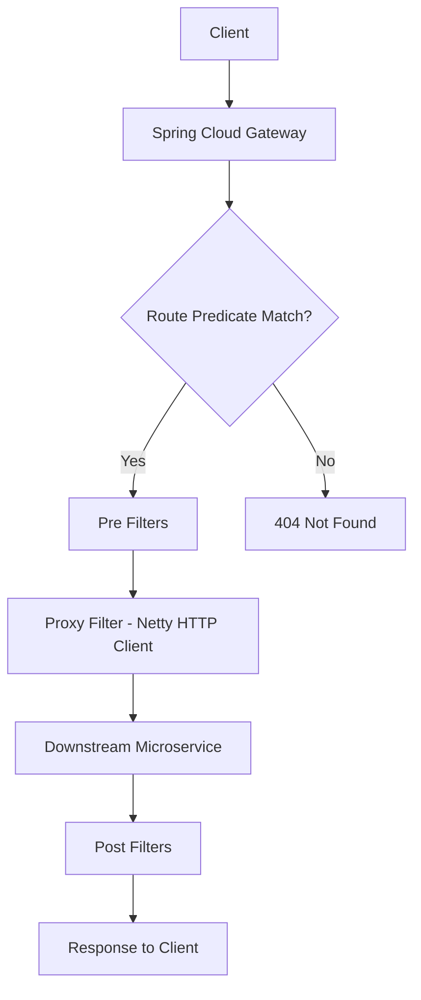
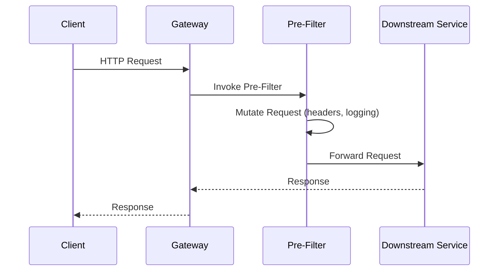
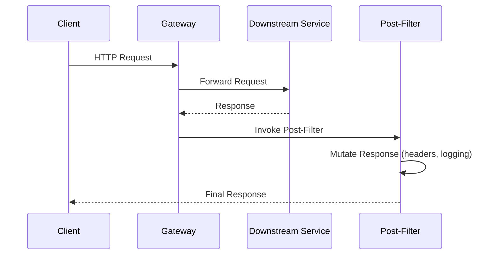
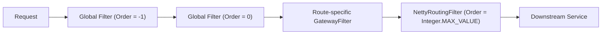
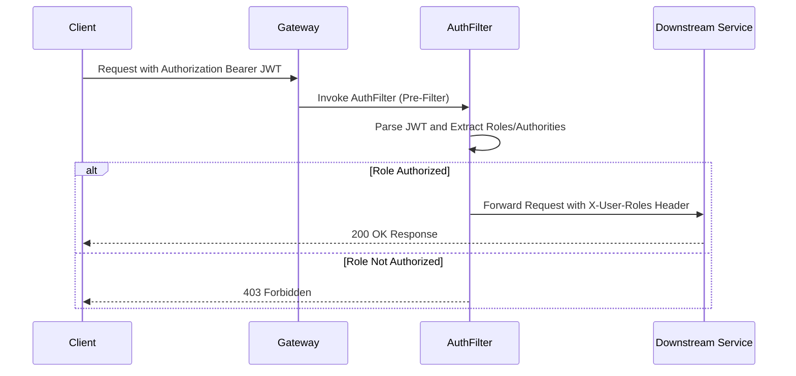
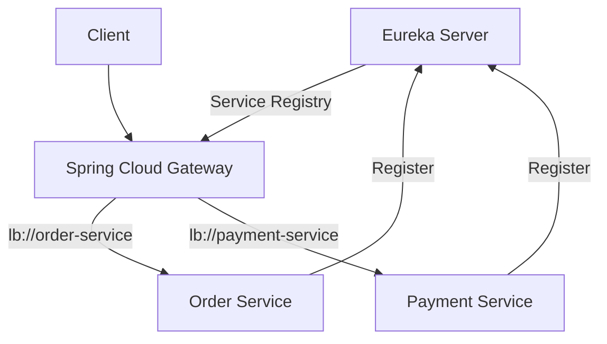
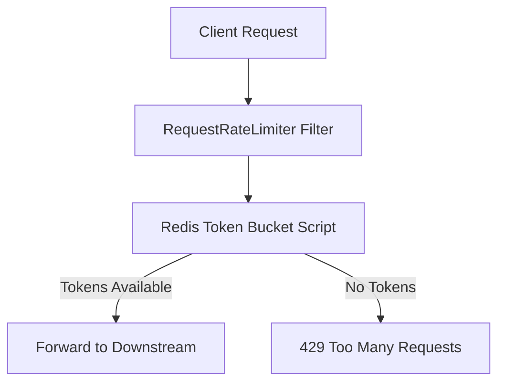
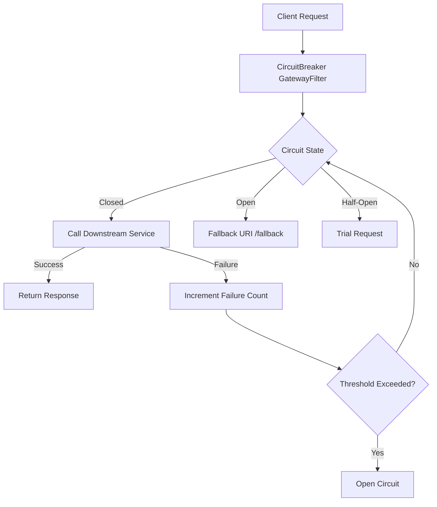

# Spring Cloud API Gateway

## Detailed Guide

### Explore Spring Cloud API Gateway and all its connfiguration

Spring Cloud Gateway is Spring's official replacement for Netflix Zuul, built directly on top of Spring WebFlux, Project Reactor, and Netty. It acts as the single entry point into a microservices architecture, sitting in front of downstream services and handling cross-cutting concerns such as routing, authentication, rate limiting, and observability so individual services don't have to. The core building blocks are **Routes** (an ID, a destination URI, a list of predicates, and a list of filters), **Predicates** (conditions that must match for a route to be used), and **Filters** (logic that modifies the request before it is proxied, or the response before it is returned to the client).

Configuration can be done declaratively in `application.yml`/`application.properties`, or programmatically using a `RouteLocator` bean in Java. Both approaches are equally valid; YAML is easier to read and version, while Java gives you full control (conditional logic, dynamic predicates, custom filter chaining). Spring Cloud Gateway auto-configures a `RouteLocatorBuilder`, a `RouteDefinitionLocator`, and the underlying Netty-based HTTP client used to proxy requests downstream.

Because the gateway is just another Spring Boot application, all the usual Spring Boot mechanisms apply: `@ConfigurationProperties`, profiles, Actuator endpoints (`/actuator/gateway/routes` is invaluable for inspecting the active route table at runtime), and Spring Cloud Config for centralized configuration across environments.

```yaml
spring:
  cloud:
    gateway:
      routes:
        - id: order-service-route
          uri: http://localhost:8081
          predicates:
            - Path=/api/orders/**
          filters:
            - StripPrefix=1
management:
  endpoints:
    web:
      exposure:
        include: gateway
```



**Real-life scenario:** A company exposes dozens of internal microservices (orders, payments, inventory) but wants clients to talk to a single public host, `api.company.com`. Spring Cloud Gateway is deployed as that single entry point, routing `/api/orders/**` to the order service and `/api/payments/**` to the payment service, while centrally enforcing authentication and logging for every request.

Internally, the three most important auto-configured beans are `GatewayAutoConfiguration` (wires up the route locators and the `FilteringWebHandler`), `RouteDefinitionRouteLocator` (converts declarative `RouteDefinition`s into executable `Route`s by resolving predicate/filter factories by name), and `NettyRoutingFilter` (the terminal filter that actually issues the proxied HTTP call via the Reactor Netty `HttpClient`). Understanding this pipeline is important when troubleshooting, because a misconfigured route often fails silently at one of these three stages rather than throwing an obvious exception.

```bash
# Verify the gateway starter is on the classpath and the app started on the expected port
curl -s http://localhost:8080/actuator/health
```

**Interview Q&A:**

**Q: What three Spring Boot dependencies are typically required to build a Spring Cloud Gateway application?**
`spring-cloud-starter-gateway` (the gateway itself, which transitively pulls in WebFlux and Reactor Netty), `spring-boot-starter-actuator` (for the `/actuator/gateway/*` management endpoints), and a service-discovery client such as `spring-cloud-starter-netflix-eureka-client` if dynamic routing is needed.

**Q: Can Spring Cloud Gateway coexist with `spring-boot-starter-web` in the same application?**
No — `spring-cloud-starter-gateway` requires the reactive WebFlux stack, and including `spring-boot-starter-web` (Servlet-based, Tomcat) on the classpath alongside it causes Spring Boot to fail auto-configuration or start the wrong web server type, since the two are mutually exclusive embedded server models.

### Spring Spring Cloud API Gateway Reactive

Spring Cloud Gateway is a fully **reactive, non-blocking** gateway. Unlike the older Netflix Zuul 1.x (which was built on the Servlet API and used blocking I/O with a thread-per-request model), Spring Cloud Gateway runs on Spring WebFlux with Reactor Netty as the server and HTTP client. Requests and responses are represented as `Mono<Void>` and `Flux<DataBuffer>` streams, and filters compose reactively using operators like `.then()`, `.map()`, and `.flatMap()` instead of imperative method calls.

This reactive foundation means the gateway can handle a very large number of concurrent connections with a small, fixed-size event-loop thread pool, because threads are never blocked waiting on I/O (such as a slow downstream call). This is particularly valuable for a gateway, since by definition it multiplexes traffic to many backend services and needs to stay responsive even when one downstream service is slow.

The trade-off is a steeper learning curve: filters must be written in a non-blocking style, and blocking calls (e.g., JDBC, blocking HTTP clients) inside a filter can stall the event loop and degrade throughput for all requests. Any blocking operation must be offloaded to a bounded elastic scheduler (`Schedulers.boundedElastic()`).

| Aspect | Spring Cloud Gateway (Reactive) | Zuul 1.x (Servlet, Blocking) |
|---|---|---|
| Programming model | Reactive (WebFlux/Reactor) | Imperative (Servlet API) |
| Concurrency model | Event loop, non-blocking | Thread-per-request, blocking |
| Underlying server | Netty | Tomcat/Jetty |
| Scalability under load | High, fewer threads needed | Lower, threads exhausted under high concurrency |
| Learning curve | Steeper (reactive operators) | Simpler (traditional Java) |

By default, Reactor Netty sizes the event-loop group to the number of available CPU cores (`Runtime.getRuntime().availableProcessors()`), which is usually sufficient since event-loop threads are never blocked waiting on I/O. Connection pooling and timeouts can be tuned explicitly when needed:

```yaml
spring:
  cloud:
    gateway:
      httpclient:
        connect-timeout: 2000
        response-timeout: 5s
        pool:
          max-connections: 500
          max-idle-time: 15s
```

```java
// Offloading a blocking call from inside a reactive filter
return Mono.fromCallable(() -> legacyBlockingAuditClient.record(exchange.getRequest().getPath().value()))
        .subscribeOn(Schedulers.boundedElastic())
        .then(chain.filter(exchange));
```

**Interview Q&A:**

**Q: Why can't you simply call a blocking repository method directly inside a `GlobalFilter`?**
Because the filter executes on one of a small, fixed number of Netty event-loop threads; blocking that thread (e.g., on a JDBC call) prevents it from servicing any other in-flight request until the call returns, which can cause cascading latency across the entire gateway under load.

**Q: What operator/scheduler should wrap a blocking call inside a reactive filter?**
`Mono.fromCallable(...).subscribeOn(Schedulers.boundedElastic())`, which moves the blocking work onto a dedicated elastic thread pool designed for exactly this purpose, keeping the event-loop threads free.

**Q: How does Reactor Netty typically size its event-loop thread pool by default?**
It defaults to the number of available CPU cores, which is normally sufficient because event-loop threads only ever do non-blocking work; it can be overridden with `reactor.netty.ioWorkerCount` if needed.

### Exploring Routes with Spring Cloud Gateway

A **Route** is the fundamental unit of Spring Cloud Gateway's routing table. Each route has: a unique `id`, a target `uri` (which can be a static host or a `lb://service-name` for load-balanced, service-discovery-based routing), one or more `predicates` that must all evaluate to `true` for the route to match, and zero or more `filters` applied to matching requests. Routes are evaluated in order, and the first matching route wins, so route ordering matters when predicates overlap.

At startup, Spring Cloud Gateway builds an in-memory route table from all configured `RouteDefinitionLocator` beans (YAML-based `PropertiesRouteDefinitionLocator`, Java-based `RouteLocatorBuilder` beans, and, if enabled, the `DiscoveryClientRouteDefinitionLocator` for service-discovery-based routes). This table can be inspected and even refreshed at runtime through the Actuator Gateway endpoints.

```yaml
spring:
  cloud:
    gateway:
      routes:
        - id: payment-service
          uri: lb://payment-service
          predicates:
            - Path=/api/payments/**
            - Method=GET,POST
        - id: inventory-service
          uri: lb://inventory-service
          predicates:
            - Path=/api/inventory/**
```

Each `Route` is ultimately represented internally as an immutable `org.springframework.cloud.gateway.route.Route` object holding an `AsyncPredicate<ServerWebExchange>` (the combined predicate chain) and an ordered `List<GatewayFilter>`. The `RouteLocator` returned by `RouteLocatorBuilder.routes()` is itself a reactive `Flux<Route>`, meaning route resolution can, in principle, be backed by a reactive data source, not just static YAML.

```java
@Bean
public RouteLocator dynamicRoutes(RouteLocatorBuilder builder) {
    return builder.routes()
            .route("catalog-service", r -> r
                    .path("/api/catalog/**")
                    .and().method(HttpMethod.GET)
                    .uri("lb://catalog-service"))
            .build();
}
```

```bash
# Confirm the route table contains the expected id and predicates
curl -s http://localhost:8080/actuator/gateway/routes
```

**Interview Q&A:**

**Q: What happens if two routes in the table have overlapping predicates that both match an incoming request?**
The first matching route in evaluation order wins; the second route is never considered for that request, which is why route ordering (declaration order in YAML, or `.route()` call order in Java) matters whenever predicates could overlap.

**Q: What does the `lb://` URI scheme signify in a route definition?**
It tells the gateway to resolve the destination via client-side load balancing through Spring Cloud LoadBalancer against a logical service name registered in the discovery client, rather than calling a fixed host/port directly.

### Automatic Mapping of API Gateway Routes

Automatic route mapping relies on the **Discovery Locator**, which introspects the service registry (Eureka, Consul, etc.) and creates one route per registered service automatically, typically reachable at `/<service-id>/**`. This is enabled with `spring.cloud.gateway.discovery.locator.enabled=true` and requires a `DiscoveryClient` implementation on the classpath (e.g., `spring-cloud-starter-netflix-eureka-client`).

This approach is extremely convenient in dynamic environments where services are added, removed, or scaled frequently, since there is no need to hand-write a route for every microservice — the gateway keeps the route table in sync with the registry automatically. It is covered in more depth later in the **Enabling Discovery Locator with Eureka** section.

```yaml
spring:
  cloud:
    gateway:
      discovery:
        locator:
          enabled: true
          lower-case-service-id: true
```

**Real-life scenario:** A platform team onboarding new microservices frequently doesn't want to modify the gateway's configuration for every new service. By enabling the discovery locator, any service that registers itself with Eureka using the name `order-service` is immediately reachable at `/order-service/**` without any gateway redeploy.

Internally, `DiscoveryLocatorProperties` drives a SpEL-based `RouteDefinitionLocator` (`DiscoveryClientRouteDefinitionLocator`) that polls the `DiscoveryClient` for the current list of service instances and regenerates route definitions from a configurable template. By default it also attaches a path predicate and rewrite filter so `/order-service/api/orders` correctly maps to `/api/orders` on the actual instance.

```yaml
spring:
  cloud:
    gateway:
      discovery:
        locator:
          enabled: true
          lower-case-service-id: true
```

```bash
# List every service currently exposed via the discovery locator
curl -s http://localhost:8080/actuator/gateway/routes | grep discovery
```

**Interview Q&A:**

**Q: Which Spring bean is responsible for polling the discovery client and generating routes automatically?**
`DiscoveryClientRouteDefinitionLocator`, configured through `DiscoveryLocatorProperties`; it regenerates the route table whenever the underlying `DiscoveryClient` reports changes to the registered service instances.

**Q: What's a security risk of enabling the discovery locator without further restrictions?**
Every service registered in the discovery registry becomes automatically reachable through the gateway, which can unintentionally expose internal-only services (e.g., an internal admin or batch service) to external clients unless additional route-level security or an allow-list is applied.

### Manually Configuring API Gateway Routes

Manual route configuration means explicitly declaring each route's `id`, `uri`, `predicates`, and `filters`, either in YAML or via a `RouteLocator` Java bean. This gives full, explicit control over path rewriting, filter chains, ordering, and predicate combinations, which is often required for anything beyond the simplest 1:1 path-to-service mapping.

```java
@Configuration
public class GatewayRouteConfig {

    @Bean
    public RouteLocator customRouteLocator(RouteLocatorBuilder builder) {
        return builder.routes()
                .route("order-service-route", r -> r
                        .path("/api/orders/**")
                        .filters(f -> f.stripPrefix(1))
                        .uri("lb://order-service"))
                .route("payment-service-route", r -> r
                        .path("/api/payments/**")
                        .uri("lb://payment-service"))
                .build();
    }
}
```

The fluent `RouteLocatorBuilder` DSL supports composing predicates with `.and()`, `.or()`, and `.negate()`, which is far more expressive than the flat, implicitly-ANDed list of predicates available in YAML. This makes Java configuration the better choice when routing logic needs boolean combinations beyond a simple AND, such as "match this path AND (this header OR that query param)".

```java
@Bean
public RouteLocator complexRouteLocator(RouteLocatorBuilder builder) {
    return builder.routes()
            .route("canary-route", r -> r
                    .path("/api/orders/**")
                    .and(r.header("X-Canary", "true").or(r.query("canary", "true")))
                    .filters(f -> f.addRequestHeader("X-Routed-By", "canary-rule"))
                    .uri("lb://order-service-canary"))
            .build();
}
```

**Interview Q&A:**

**Q: What advantage does the Java `RouteLocatorBuilder` DSL have over YAML for predicate logic?**
It supports explicit boolean composition via `.and()`, `.or()`, and `.negate()`, allowing predicate expressions beyond the flat, implicitly-ANDed list that YAML configuration supports.

**Q: When would you prefer manual Java route configuration over YAML?**
When routing decisions require conditional/dynamic logic, boolean predicate combinations (OR/NOT), or programmatic construction of routes from an external source, none of which map cleanly onto static YAML.

### Automatic & Manual Routing in Spring Cloud API Gateway

Automatic (discovery-based) and manual routing are not mutually exclusive — many real systems use both together: manual routes for services that need custom path rewriting, filters, or fine-grained predicates, and automatic discovery-locator routes as a catch-all for everything else. When both are enabled, manually defined routes take precedence if their predicates match first, since discovery-locator routes are typically appended after the explicitly configured ones.

| Aspect | Automatic (Discovery Locator) | Manual (YAML / Java) |
|---|---|---|
| Setup effort | Minimal, one flag to enable | Requires explicit config per service |
| Flexibility | Limited (default path pattern) | Full control over predicates/filters |
| Best for | Fast-moving, many microservices | Public APIs needing path rewriting, custom filters |
| Risk | Accidentally exposes internal services | Requires maintenance as services change |
| Typical use | Internal/admin routing | Public-facing gateway routes |

A practical hybrid pattern is to give manual routes distinctive, non-overlapping paths from the discovery locator's generated `/<service-id>/**` pattern (e.g., manual routes live under `/api/**`, while the discovery locator's routes remain under `/internal/<service-id>/**` for admin/debugging use only, restricted by network policy).

```yaml
spring:
  cloud:
    gateway:
      discovery:
        locator:
          enabled: true
      routes:
        - id: public-orders-api
          uri: lb://order-service
          predicates:
            - Path=/api/orders/**
```

**Interview Q&A:**

**Q: In a hybrid setup, which routes take precedence — manually declared ones or discovery-locator-generated ones?**
Manually declared routes are added to the route table first and are evaluated before the discovery locator's generated routes, so they take precedence whenever their predicates match.

**Q: How can you prevent the discovery locator's automatic routes from colliding with your curated public API paths?**
By designing the discovery locator's generated path pattern (e.g., `/internal/<service-id>/**`) to be distinct from the manually curated public paths (e.g., `/api/**`), and restricting the internal pattern with network-level policies or gateway-level filters.

### Trying how Spring Cloud API Gateway works

To see the gateway in action end-to-end, start a downstream service (say, on port 8081), configure a simple route pointing to it, and start the gateway (typically on port 8080). A request to `http://localhost:8080/api/orders/1` is matched against the route table, the matching route's predicates confirm the path matches `/api/orders/**`, any configured filters run, and the request is proxied to the downstream service. The response then flows back through any response-side (post) filters before being returned to the client.

Actuator's `/actuator/gateway/routes` endpoint is the fastest way to verify what routes are actually active, which is especially useful when routes come from multiple sources (YAML plus discovery locator). Enabling `logging.level.org.springframework.cloud.gateway=TRACE` during development shows exactly which predicates matched and which filters ran for a given request, which is invaluable for debugging routing issues.

```bash
curl -v http://localhost:8080/api/orders/1
curl http://localhost:8080/actuator/gateway/routes
```

A second useful diagnostic is the `/actuator/gateway/routes/{id}` endpoint (returns a single route's full definition) and, in Spring Cloud Gateway 3.x+, POSTing to `/actuator/gateway/refresh` to force the route table to be rebuilt after a configuration change without restarting the whole application — handy when routes are backed by Spring Cloud Config and updated via a `/actuator/refresh`-triggered `RefreshRoutesEvent`.

```bash
# Inspect a single route definition and force a route table refresh
curl -s http://localhost:8080/actuator/gateway/routes/order-service-route
curl -X POST http://localhost:8080/actuator/gateway/refresh
```

**Interview Q&A:**

**Q: How do you force Spring Cloud Gateway to rebuild its route table without restarting the application?**
By sending a `POST` request to the `/actuator/gateway/refresh` endpoint, which publishes a `RefreshRoutesEvent` that causes all `RouteDefinitionLocator`s to be re-queried and the route table rebuilt in place.

**Q: What logging setting is most useful for debugging why a request didn't match the expected route?**
Setting `logging.level.org.springframework.cloud.gateway=TRACE`, which logs each predicate evaluation and filter execution for every incoming request, making it clear exactly why a route did or didn't match.

### Rewriting URL Path in Spring Cloud API Gateway

Clients often use a public path convention (e.g., `/api/orders/**`) that doesn't match the downstream service's actual internal path structure. The `RewritePath` filter (and the simpler `StripPrefix` filter) let the gateway translate the externally visible path into whatever path the backend service expects, without the backend needing any knowledge of the gateway's URL scheme.

`StripPrefix=1` simply removes the first N path segments, while `RewritePath` uses a regex with capture groups for arbitrary transformations, making it far more flexible for path shapes that aren't a simple prefix strip.

```yaml
spring:
  cloud:
    gateway:
      routes:
        - id: order-service-rewrite
          uri: lb://order-service
          predicates:
            - Path=/api/orders/**
          filters:
            - RewritePath=/api/orders/(?<segment>.*), /internal/v2/orders/${segment}
```

**Real-life scenario:** The public API contract is `/api/orders/{id}`, but the order service was recently re-versioned internally to expose `/internal/v2/orders/{id}`. Using `RewritePath`, the gateway keeps the public contract stable for existing API consumers while allowing the backend team to evolve their internal routes freely.

A subtlety worth knowing: `RewritePath` (and `StripPrefix`) only rewrite the *path* the proxied request is sent with — they do not change the path predicate matching, and they do not rewrite `Location` headers in redirect responses coming back from the downstream service, which can cause a client to be redirected to the internal, non-gateway-facing URL unless a `DedupeResponseHeader`/response-rewriting filter or a `RemoveLocationResponseHeader`-style filter is added alongside it.

```java
@Bean
public RouteLocator rewriteRouteLocator(RouteLocatorBuilder builder) {
    return builder.routes()
            .route("orders-rewrite", r -> r
                    .path("/api/orders/**")
                    .filters(f -> f.rewritePath("/api/orders/(?<segment>.*)", "/internal/v2/orders/${segment}"))
                    .uri("lb://order-service"))
            .build();
}
```

**Interview Q&A:**

**Q: What is the difference between `StripPrefix` and `RewritePath`?**
`StripPrefix=N` removes the first N path segments unconditionally, while `RewritePath` uses a regex with named capture groups to perform arbitrary path transformations, making it suitable for cases where the internal path shape isn't a simple prefix removal.

**Q: Why might a client be redirected to an internal-only URL even though `RewritePath` is configured correctly?**
Because `RewritePath` only rewrites the outgoing request path, not `Location` headers on redirect responses coming back from the downstream service; those headers may still reference the internal path unless explicitly rewritten by an additional response filter.

### Build-In Predicate Factories in Spring Cloud API Gateway

Spring Cloud Gateway ships with a rich set of built-in `RoutePredicateFactory` implementations that can be combined (implicitly ANDed) on a single route: `Path`, `Method`, `Header`, `Query`, `Cookie`, `Host`, `After`/`Before`/`Between` (time-based), `RemoteAddr` (client IP/CIDR), and `Weight` (for A/B or canary traffic splitting), among others. Predicates are pure functions of the incoming `ServerWebExchange` that return `true` or `false` — all of a route's predicates must match for the route to be selected.

Combining predicates enables precise routing rules, such as only routing `POST` requests with a specific header to a canary deployment, or only allowing traffic from an internal IP range to reach an admin route.

```yaml
spring:
  cloud:
    gateway:
      routes:
        - id: admin-route
          uri: lb://admin-service
          predicates:
            - Path=/api/admin/**
            - Method=GET,POST
            - Header=X-Internal-Request, true
            - RemoteAddr=10.0.0.0/24
```

The same predicates can be composed programmatically using the `RouteLocatorBuilder` DSL, which is often clearer for complex combinations, and also supports the `Weight` predicate for percentage-based canary/A-B traffic splitting across two routes sharing the same weight group.

```java
@Bean
public RouteLocator weightedRouteLocator(RouteLocatorBuilder builder) {
    return builder.routes()
            .route("orders-v1", r -> r.path("/api/orders/**")
                    .and().weight("orders-group", 80)
                    .uri("lb://order-service-v1"))
            .route("orders-v2-canary", r -> r.path("/api/orders/**")
                    .and().weight("orders-group", 20)
                    .uri("lb://order-service-v2"))
            .build();
}
```

**Interview Q&A:**

**Q: How would you route 20% of traffic to a canary version of a service using built-in predicates?**
Using the `Weight` predicate on two routes sharing the same group name, with weight values (e.g., 80 and 20) that determine the relative percentage of traffic each route receives — Spring Cloud Gateway handles the random distribution internally.

**Q: Are multiple predicates on the same route combined with AND or OR by default?**
AND — all predicates listed on a route must evaluate to `true` for that route to be selected; to express OR logic, you must use the Java `RouteLocatorBuilder` DSL's `.or()` method instead of the flat YAML list.

### Gateway Filters in Spring Cloud API Gateway

**GatewayFilters** operate on a single route (as opposed to **GlobalFilters**, which apply to every route). They can modify the request before it's forwarded (e.g., `AddRequestHeader`, `StripPrefix`, `RewritePath`) or the response before it's returned (e.g., `AddResponseHeader`, `DedupeResponseHeader`). Spring Cloud Gateway ships dozens of built-in `GatewayFilterFactory` implementations, and custom ones can be created by implementing `GatewayFilter` or `GatewayFilterFactory`.

Filters within a route are applied in the order they are declared for the request phase, and in reverse order for the response phase, since each filter wraps the next one in the chain (the classic "filter chain"/decorator pattern applied reactively via `Mono` composition).

```java
@Component
public class CustomHeaderGatewayFilterFactory extends AbstractGatewayFilterFactory<CustomHeaderGatewayFilterFactory.Config> {

    public CustomHeaderGatewayFilterFactory() {
        super(Config.class);
    }

    @Override
    public GatewayFilter apply(Config config) {
        return (exchange, chain) -> {
            ServerHttpRequest request = exchange.getRequest().mutate()
                    .header("X-Gateway-Filter", config.getHeaderValue())
                    .build();
            return chain.filter(exchange.mutate().request(request).build());
        };
    }

    public static class Config {
        private String headerValue;
        public String getHeaderValue() { return headerValue; }
        public void setHeaderValue(String headerValue) { this.headerValue = headerValue; }
    }
}
```

By convention, a class named `XyzGatewayFilterFactory` is referenced in YAML shorthand simply as `Xyz` (the `GatewayFilterFactory` suffix is stripped automatically), which is why `StripPrefix`, `RewritePath`, and `AddRequestHeader` work as filter names without the full class name. The shorthand `- Xyz=arg1,arg2` syntax binds positional arguments to the `Config` class's fields in declaration order, while the expanded `name`/`args` map syntax binds by field name, which is required when a `Config` class has more than a couple of fields or when clarity matters more than brevity.

```yaml
spring:
  cloud:
    gateway:
      routes:
        - id: custom-header-route
          uri: lb://order-service
          predicates:
            - Path=/api/orders/**
          filters:
            - name: CustomHeader
              args:
                headerValue: gateway-v1
```

**Interview Q&A:**

**Q: How does Spring Cloud Gateway resolve the YAML filter name `StripPrefix` to a Java class?**
It looks up a bean of type `GatewayFilterFactory` whose simple class name, with the `GatewayFilterFactory` suffix stripped, matches the name (case-insensitively) — so `StripPrefixGatewayFilterFactory` is referenced simply as `StripPrefix`.

**Q: When should you use the expanded `name`/`args` YAML syntax instead of the shorthand `- Xyz=arg1,arg2` form?**
When the filter's `Config` class has several fields, when argument order isn't obvious, or when readability/maintainability matters more than terseness — the expanded form binds arguments explicitly by field name rather than position.

### Implementing Spring Cloud Gateway Logging Filter

A logging `GatewayFilter` (or `GlobalFilter`) is one of the most common custom filters written for a gateway — it records the incoming request (method, path, headers) and, on the response side, the status code and latency, giving centralized visibility into every request flowing through the system without instrumenting every downstream service individually.

Because the gateway is reactive, logging must be hooked into the reactive chain using `.then()` so it executes after the downstream call completes, rather than blocking to wait for it.

```java
@Component
public class LoggingGatewayFilterFactory extends AbstractGatewayFilterFactory<Object> {

    private static final Logger log = LoggerFactory.getLogger(LoggingGatewayFilterFactory.class);

    @Override
    public GatewayFilter apply(Object config) {
        return (exchange, chain) -> {
            long start = System.currentTimeMillis();
            log.info("Incoming request: {} {}", exchange.getRequest().getMethod(), exchange.getRequest().getPath());
            return chain.filter(exchange).then(Mono.fromRunnable(() -> {
                long duration = System.currentTimeMillis() - start;
                log.info("Response status: {} in {} ms",
                        exchange.getResponse().getStatusCode(), duration);
            }));
        };
    }
}
```

**Real-life scenario:** An operations team needs a single place to capture request/response latency for every microservice for an SLA dashboard, without changing code in each of the 20+ downstream services. A logging filter at the gateway level captures this centrally for every request.

For production use, printing to stdout via a raw `Logger` is usually not enough — teams typically emit structured (JSON) log lines including a correlation/trace ID so log aggregation tools (ELK, Splunk) can join gateway logs with downstream service logs for the same request. Adding a Micrometer `Timer` alongside the log statement also feeds the same latency data into `/actuator/metrics` and any connected observability backend (Prometheus, Grafana).

```java
@Component
public class MetricsLoggingGatewayFilterFactory extends AbstractGatewayFilterFactory<Object> {

    private final MeterRegistry meterRegistry;

    public MetricsLoggingGatewayFilterFactory(MeterRegistry meterRegistry) {
        this.meterRegistry = meterRegistry;
    }

    @Override
    public GatewayFilter apply(Object config) {
        return (exchange, chain) -> {
            Timer.Sample sample = Timer.start(meterRegistry);
            return chain.filter(exchange).then(Mono.fromRunnable(() ->
                    sample.stop(meterRegistry.timer("gateway.request.duration",
                            "route", exchange.getRequest().getPath().value()))));
        };
    }
}
```

**Interview Q&A:**

**Q: Why should gateway request logs include a correlation/trace ID?**
So a single client request can be traced across the gateway log and every downstream service's logs by joining on that shared ID, which is essential for diagnosing issues in a distributed system where one request fans out across multiple services.

**Q: Besides plain logging, what else is commonly captured in a gateway filter for observability?**
Latency and status-code metrics via Micrometer (e.g., a `Timer` per route), which feed into `/actuator/metrics` and downstream observability backends like Prometheus/Grafana for dashboards and alerting.

### Introduction to Global Filters in Spring Cloud API Gateway

**Global filters** (`GlobalFilter`) apply to *every* route automatically, unlike `GatewayFilter`s which must be explicitly attached to a route's filter list. They are ideal for cross-cutting concerns that should apply uniformly — authentication, correlation ID generation, centralized logging, or metrics — without having to repeat the same filter configuration on every single route.

Internally, Spring Cloud Gateway merges all `GlobalFilter` beans with each route's specific `GatewayFilter`s into a single sorted filter chain (sorted by `getOrder()` for filters that implement `Ordered`) before executing the request. This unified chain is what makes the pre/post filter model consistent whether a filter is global or route-specific.

```java
@Component
public class GlobalLoggingFilter implements GlobalFilter, Ordered {

    @Override
    public Mono<Void> filter(ServerWebExchange exchange, GatewayFilterChain chain) {
        System.out.println("Global Filter executing for: " + exchange.getRequest().getPath());
        return chain.filter(exchange);
    }

    @Override
    public int getOrder() {
        return -1;
    }
}
```

Any `GlobalFilter` bean discovered in the application context is automatically registered — there's no additional configuration step required, which is both convenient and a source of surprises: adding a new `@Component`-annotated `GlobalFilter` anywhere in the codebase silently changes behavior for *every* route in the application, so global filters deserve extra scrutiny in code review compared to route-specific filters.

**Interview Q&A:**

**Q: Do you need to register a `GlobalFilter` anywhere explicitly, such as in `application.yml`?**
No — any Spring bean implementing `GlobalFilter` is automatically discovered and applied to every route; simply declaring it as a `@Component` (or `@Bean`) is sufficient.

**Q: What is a practical risk of overusing global filters?**
Since a global filter runs for every route automatically, a bug or unintended side effect in one global filter can silently affect all traffic through the gateway, making them riskier to change than a filter scoped to a single route.

### Creating Global Pre Filter in Spring Cloud API Gateway

A **pre-filter** is logic that runs *before* the request is proxied to the downstream service. Common use cases include request validation, adding correlation/trace IDs, authentication/authorization checks, and request header manipulation. In the reactive filter chain, "pre" logic is simply code that executes before calling `chain.filter(exchange)`.

If a pre-filter determines the request should not proceed (e.g., failed authentication), it can short-circuit the chain entirely by setting the response status and returning `exchange.getResponse().setComplete()` instead of calling `chain.filter(...)`.

```java
@Component
public class PreGlobalFilter implements GlobalFilter, Ordered {

    @Override
    public Mono<Void> filter(ServerWebExchange exchange, GatewayFilterChain chain) {
        ServerHttpRequest mutatedRequest = exchange.getRequest().mutate()
                .header("X-Request-Start", String.valueOf(System.currentTimeMillis()))
                .build();
        // Pre-filter logic runs here, before chain.filter() forwards downstream
        return chain.filter(exchange.mutate().request(mutatedRequest).build());
    }

    @Override
    public int getOrder() {
        return -1;
    }
}
```



A pre-filter can also short-circuit the entire chain instead of forwarding, which is the mechanism used by authentication/authorization filters: instead of calling `chain.filter(...)`, the filter sets a status code directly on the response and calls `exchange.getResponse().setComplete()`, guaranteeing the downstream service is never invoked for a rejected request.

```java
@Component
public class ApiKeyPreFilter implements GlobalFilter, Ordered {

    @Override
    public Mono<Void> filter(ServerWebExchange exchange, GatewayFilterChain chain) {
        String apiKey = exchange.getRequest().getHeaders().getFirst("X-Api-Key");
        if (apiKey == null || apiKey.isBlank()) {
            exchange.getResponse().setStatusCode(HttpStatus.UNAUTHORIZED);
            return exchange.getResponse().setComplete();
        }
        return chain.filter(exchange);
    }

    @Override
    public int getOrder() {
        return -2;
    }
}
```

**Interview Q&A:**

**Q: What are two typical responsibilities of a pre-filter?**
Request validation/authentication (e.g., checking an API key or JWT before forwarding) and request enrichment (e.g., adding a correlation ID or timing header) — both must happen before `chain.filter(exchange)` is invoked.

**Q: How does a pre-filter prevent a request from ever reaching the downstream service?**
By not calling `chain.filter(exchange)` at all, and instead setting a status code on `exchange.getResponse()` and calling `exchange.getResponse().setComplete()`, which finalizes the response immediately.

### Accessing Request Path and HTTP Headers

Inside any `GatewayFilter` or `GlobalFilter`, the current request is available via `exchange.getRequest()`, a `ServerHttpRequest`. From it you can read the path (`getPath()`), query parameters (`getQueryParams()`), and headers (`getHeaders()`). Because `ServerHttpRequest` is immutable, modifying it requires calling `.mutate()` to build a new request object and attaching it to a new exchange via `exchange.mutate().request(...).build()`.

This pattern — read, mutate, rebuild the exchange — is central to almost every custom filter, whether adding an auth header, rewriting a path dynamically, or stripping sensitive headers before forwarding to a downstream service.

```java
@Override
public Mono<Void> filter(ServerWebExchange exchange, GatewayFilterChain chain) {
    String path = exchange.getRequest().getPath().value();
    HttpHeaders headers = exchange.getRequest().getHeaders();
    String authHeader = headers.getFirst(HttpHeaders.AUTHORIZATION);

    System.out.println("Path: " + path + ", Authorization present: " + (authHeader != null));
    return chain.filter(exchange);
}
```

Query parameters are similarly accessible via `exchange.getRequest().getQueryParams()` (a `MultiValueMap<String, String>`), and route-specific URI template variables (captured by predicates like `Path=/api/orders/{id}`) are retrievable through `ServerWebExchangeUtils.getUriTemplateVariables(exchange)`. Response-side access follows the same immutable pattern via `exchange.getResponse()`, but header mutations there must occur *after* `chain.filter(exchange)` resolves, not before.

```java
// Reading a path variable captured by a route predicate, e.g. Path=/api/orders/{id}
Map<String, String> uriVariables = ServerWebExchangeUtils.getUriTemplateVariables(exchange);
String orderId = uriVariables.get("id");
```

**Interview Q&A:**

**Q: Why must you call `.mutate()` instead of directly setting a header on `exchange.getRequest()`?**
`ServerHttpRequest` is an immutable value object in the reactive stack; `.mutate()` builds a new request instance with the desired changes, which must then be attached to a new exchange via `exchange.mutate().request(...).build()` before being passed further down the chain.

**Q: How can a filter read a path variable captured by a route's `Path` predicate (e.g., the `{id}` in `/api/orders/{id}`)?**
Via `ServerWebExchangeUtils.getUriTemplateVariables(exchange)`, which returns a map of the named template variables captured during predicate matching.

### Trying how Pre Filter Works

To verify a pre-filter is working, add a header or log statement inside it, then issue a request and confirm — either via logs or by inspecting the header at the downstream service — that the mutation happened before the request reached the backend. A common testing technique is to have the downstream service simply echo back all received headers so the injected header (e.g., `X-Request-Start`) is visible in the final response.

Because the reactive chain executes pre-filter code synchronously (or via composed `Mono`s) before `chain.filter(exchange)` runs, ordering issues are usually caused by multiple pre-filters having the same `getOrder()` value or an incorrect assumption about ascending vs. descending order.

A reliable way to test pre-filters in isolation, without a full downstream service, is `WebTestClient` bound directly to the filter's `RouteLocator`/`WebFilter` chain, or a lightweight WireMock stub standing in for the downstream service so the header injected by the filter can be asserted deterministically in a unit/integration test rather than a manual `curl` call.

```java
@SpringBootTest(webEnvironment = SpringBootTest.WebEnvironment.RANDOM_PORT)
class PreFilterIntegrationTest {

    @Autowired
    private WebTestClient webTestClient;

    @Test
    void shouldInjectRequestStartHeader() {
        webTestClient.get().uri("/api/orders/1")
                .exchange()
                .expectStatus().isOk()
                .expectHeader().exists("X-Request-Start");
    }
}
```

**Interview Q&A:**

**Q: What's a common mistake that causes a pre-filter's header injection to appear "missing" downstream?**
Mutating `exchange.getRequest()` directly instead of using `.mutate()` and rebuilding the exchange — since the original request is immutable, changes made without rebuilding the exchange are silently discarded.

**Q: How can you verify a pre-filter's behavior without manually calling `curl`?**
With a `WebTestClient`-based Spring Boot integration test (`@SpringBootTest`) asserting on the response/headers, optionally combined with a WireMock stub standing in for the downstream service.

### Creating Global Post Filter in Spring Cloud API Gateway

A **post-filter** runs *after* the downstream service has responded, but before the response reaches the client. This is where you'd add response headers, transform the response body, capture the final status code for metrics, or log completed request latency. In reactive style, post-filter logic is attached using `.then()` (or `.doOnSuccess()`/`.doFinally()`) on the `Mono<Void>` returned by `chain.filter(exchange)`, since there's no "after" callback in an imperative sense.

```java
@Component
public class PostGlobalFilter implements GlobalFilter, Ordered {

    @Override
    public Mono<Void> filter(ServerWebExchange exchange, GatewayFilterChain chain) {
        return chain.filter(exchange).then(Mono.fromRunnable(() -> {
            ServerHttpResponse response = exchange.getResponse();
            response.getHeaders().add("X-Response-Time",
                    String.valueOf(System.currentTimeMillis()));
        }));
    }

    @Override
    public int getOrder() {
        return 1;
    }
}
```



**Real-life scenario:** Security policy requires that no downstream service's internal server banner or version headers leak to external clients. A global post-filter strips sensitive response headers (e.g., `Server`, `X-Powered-By`) right before the response leaves the gateway, regardless of which backend produced them.

Because `.then()` only signals completion (it discards the value), post-filters that need to *inspect* the outcome (success vs. error, status code) commonly use `.doOnSuccess()` combined with `.doOnError()`, or wrap the returned `Mono<Void>` with `.doFinally(signalType -> ...)` to guarantee cleanup/logging logic runs regardless of whether the downstream call succeeded, failed, or was cancelled.

```java
@Component
public class ResponseStatusMetricsFilter implements GlobalFilter, Ordered {

    @Override
    public Mono<Void> filter(ServerWebExchange exchange, GatewayFilterChain chain) {
        return chain.filter(exchange)
                .doFinally(signalType -> {
                    HttpStatusCode status = exchange.getResponse().getStatusCode();
                    System.out.printf("Route %s completed with status %s (%s)%n",
                            exchange.getRequest().getPath(), status, signalType);
                });
    }

    @Override
    public int getOrder() {
        return 2;
    }
}
```

**Interview Q&A:**

**Q: What's the difference between using `.then()` and `.doFinally()` for post-filter logic?**
`.then()` runs the follow-up action only after successful completion of the upstream `Mono`, whereas `.doFinally(SignalType -> ...)` runs regardless of whether the chain completed successfully, errored, or was cancelled, making it more suitable for guaranteed cleanup/logging logic.

**Q: Why can't a post-filter simply return a new value from `chain.filter(exchange)` the way a normal method would return a value?**
`chain.filter(exchange)` returns `Mono<Void>` — there's no value to transform, only a completion signal, so post-processing must be attached via side-effecting operators like `.then()`, `.doOnSuccess()`, or `.doFinally()` rather than `.map()`.

### Trying how the Post Filter works

Testing a post-filter is similar to testing a pre-filter, but you inspect the *response* rather than the request. A quick way is to call the route with `curl -v` and check the response headers for the value injected by the post-filter (e.g., `X-Response-Time`). If the header is missing, it's usually because `.then()` wasn't used correctly — modifying `exchange.getResponse()` must happen in a callback chained after `chain.filter(exchange)` completes, not before it.

Another common pitfall is that the response body has already been committed by the time some post-filters run, so header-only mutations are safe, but body rewriting typically requires wrapping the `ServerHttpResponseDecorator` before calling `chain.filter()`.

```java
// Rewriting the response body requires decorating the response BEFORE calling chain.filter()
ServerHttpResponseDecorator decoratedResponse = new ServerHttpResponseDecorator(exchange.getResponse()) {
    @Override
    public Mono<Void> writeWith(Publisher<? extends DataBuffer> body) {
        // transform / inspect the body Flux here before delegating to super.writeWith(...)
        return super.writeWith(body);
    }
};
return chain.filter(exchange.mutate().response(decoratedResponse).build());
```

**Interview Q&A:**

**Q: Why can't you simply mutate response headers after `chain.filter(exchange)` completes if you need to rewrite the response body?**
By the time `chain.filter(exchange)` completes, the response body has typically already started or finished being written; rewriting the body requires wrapping the response with a `ServerHttpResponseDecorator` *before* calling `chain.filter()`, so the decorator can intercept the `writeWith()` call.

**Q: What's a quick way to confirm a post-filter successfully added a response header?**
`curl -v` against the route and inspect the response headers for the injected value (e.g., `X-Response-Time`); if it's missing, the mutation was likely applied before `chain.filter(exchange)` resolved instead of in a `.then()`/`.doFinally()` callback.

### Defining Filters in a Single Class

While `GlobalFilter`s are typically one class per concern, it's common in real projects to consolidate several related global filters (e.g., a combined pre+post logging/auth filter) into a single class implementing both the pre and post logic, since a `GlobalFilter.filter()` method can contain pre-logic, call `chain.filter(exchange)`, and then chain post-logic with `.then()` — all in one place.

```java
@Component
public class CombinedGlobalFilter implements GlobalFilter, Ordered {

    @Override
    public Mono<Void> filter(ServerWebExchange exchange, GatewayFilterChain chain) {
        // Pre-filter logic
        System.out.println("Pre-Filter: incoming request " + exchange.getRequest().getPath());

        return chain.filter(exchange).then(Mono.fromRunnable(() -> {
            // Post-filter logic
            System.out.println("Post-Filter: response status " + exchange.getResponse().getStatusCode());
        }));
    }

    @Override
    public int getOrder() {
        return 0;
    }
}
```

**Real-life scenario:** A team wants a single audit filter that logs both the incoming request and the final response status/latency for every call through the gateway, rather than maintaining two separate filter classes whose ordering must be kept in sync manually — combining pre and post logic in one class guarantees the pairing never drifts apart during refactoring.

**Interview Q&A:**

**Q: What's the main benefit of combining pre and post logic into a single `GlobalFilter` class?**
It guarantees the pre/post logic pair stays together and can't drift out of sync (e.g., during refactoring or reordering), and keeps a single, easy-to-reason-about `getOrder()` value governing both halves of the behavior.

**Q: In a combined pre/post filter, in what order do the two halves execute relative to `chain.filter(exchange)`?**
The pre-logic (code before `chain.filter(exchange)`) always runs first, then the downstream call proceeds, and finally the post-logic (chained via `.then(...)`) runs after the downstream response is received.

### Ordering Global Filters in Spring Cloud API Gateway

When multiple `GlobalFilter`s (and route-specific `GatewayFilter`s) are present, Spring Cloud Gateway needs a deterministic execution order. This is controlled by implementing the `Ordered` interface (or using the `@Order` annotation) and returning an integer from `getOrder()` — **lower values run first** on the request (pre) side, and correspondingly **last** on the response (post) side, because each filter wraps the next like layers of an onion.

Spring Cloud Gateway itself uses well-known internal filters with specific order values, e.g., `NettyRoutingFilter` runs with `Ordered.LOWEST_PRECEDENCE` (last, since it's the filter that actually performs the proxy call), so custom global filters are typically ordered somewhere in between using small integers like `-1`, `0`, `1`.

```java
@Component
public class OrderedGlobalFilter implements GlobalFilter, Ordered {

    @Override
    public Mono<Void> filter(ServerWebExchange exchange, GatewayFilterChain chain) {
        return chain.filter(exchange);
    }

    @Override
    public int getOrder() {
        return -100; // runs early on the request path
    }
}
```



Spring Cloud Gateway also defines several other well-known ordered filters worth knowing: `RouteToRequestUrlFilter` (order 10000) resolves the route's URI onto the exchange, `WeightCalculatorWebFilter` (order -1) computes weighted-routing decisions early, and `ForwardRoutingFilter`/`NettyRoutingFilter` sit at `Ordered.LOWEST_PRECEDENCE` since they perform the actual proxy call and must run only after every other filter has had a chance to modify the request.

```java
@Component
@Order(Ordered.HIGHEST_PRECEDENCE)
public class FirstFilter implements GlobalFilter {
    @Override
    public Mono<Void> filter(ServerWebExchange exchange, GatewayFilterChain chain) {
        return chain.filter(exchange);
    }
}
```

**Interview Q&A:**

**Q: Where does the built-in `NettyRoutingFilter` sit in the filter ordering, and why?**
At (or very near) `Ordered.LOWEST_PRECEDENCE`, i.e., last on the request/pre side, because it's the filter that actually performs the proxied HTTP call to the downstream service — every other filter must get a chance to modify the request first.

**Q: What two mechanisms can be used to control a `GlobalFilter`'s order?**
Implementing the `Ordered` interface's `getOrder()` method, or annotating the class with `@Order(...)`; both are respected by the `AnnotationAwareOrderComparator` used internally to sort the combined filter chain.

### how ordered filters work

Internally, Spring Cloud Gateway collects all applicable filters for a request (global + route-specific), sorts them using `AnnotationAwareOrderComparator` (which respects both `Ordered.getOrder()` and `@Order`), and then builds a single reactive chain where each filter's `chain.filter(exchange)` call invokes the next filter in the sorted list. This means the **pre-filter portion** of each filter runs in ascending order of `getOrder()`, while the **post-filter portion** (code after `chain.filter()`) naturally unwinds in the *reverse* order, exactly like nested try/finally blocks or a stack.

A common mistake is assuming all pre-logic across all filters runs, then all post-logic runs in the same order — in reality, it strictly alternates per filter in a nested fashion: pre(A) → pre(B) → downstream call → post(B) → post(A).

This nesting behavior falls directly out of how the reactive chain is *constructed*, not executed imperatively: each filter's `apply`/`filter` method wraps the *next* filter's `Mono` inside its own, so calling `.subscribe()` on the outermost `Mono` triggers the whole nested structure to unwind exactly like recursive function calls returning in reverse order.

```java
// Conceptual illustration of the nested Mono composition Spring Cloud Gateway builds
Mono<Void> chain = filterA.filter(exchange, ex ->
        filterB.filter(ex, ex2 ->
                nettyRoutingFilter.filter(ex2, terminalHandler)));
```

**Interview Q&A:**

**Q: Why does post-filter logic run in the reverse order of pre-filter logic?**
Because each filter wraps the next filter's `Mono` inside its own composition; when the innermost (terminal, e.g., `NettyRoutingFilter`) `Mono` completes, control unwinds back up through each wrapping filter in reverse, executing their post-logic like a stack unwinding.

**Q: What class does Spring Cloud Gateway use internally to sort filters by their `getOrder()`/`@Order` value?**
`AnnotationAwareOrderComparator`, the same general-purpose Spring ordering comparator used elsewhere in the framework, which respects both the `Ordered` interface and the `@Order` annotation.

### Reviewing Gateway Filter class

The `GatewayFilter` interface (`org.springframework.cloud.gateway.filter.GatewayFilter`) has a single functional method: `Mono<Void> filter(ServerWebExchange exchange, GatewayFilterChain chain)`. This is nearly identical in shape to `GlobalFilter`, the key difference being scope — a `GatewayFilter` is attached to specific routes (either directly or via a `GatewayFilterFactory` referenced by name in configuration), while a `GlobalFilter` automatically applies everywhere.

Most built-in filters (`AddRequestHeaderGatewayFilterFactory`, `StripPrefixGatewayFilterFactory`, `RewritePathGatewayFilterFactory`, etc.) extend `AbstractGatewayFilterFactory<Config>`, which handles binding YAML filter arguments to a strongly typed `Config` object and exposes an `apply(Config config)` method returning the actual `GatewayFilter` lambda.

| Aspect | `GatewayFilter` | `GlobalFilter` |
|---|---|---|
| Scope | Single route (must be attached) | Every route automatically |
| Configuration | Declared per-route in YAML/Java | Registered once as a Spring bean |
| Typical use | Route-specific behavior (rewrite, strip prefix) | Cross-cutting concerns (auth, logging, tracing) |
| Interface | `GatewayFilter` / `GatewayFilterFactory` | `GlobalFilter` |

A subtle but important detail: `GatewayFilter`s created via a `GatewayFilterFactory` are internally wrapped as `OrderedGatewayFilter` when merged into the combined chain (with their order derived from their position in the route's `filters:` list, unless explicitly overridden), which is how Spring Cloud Gateway achieves a single, consistently ordered chain mixing both route-specific and global filters.

```java
// A minimal custom GatewayFilter implemented without a factory, attached directly in Java
GatewayFilter timingFilter = (exchange, chain) -> {
    long start = System.nanoTime();
    return chain.filter(exchange).then(Mono.fromRunnable(() ->
            System.out.println("Took " + (System.nanoTime() - start) / 1_000_000 + "ms")));
};
```

**Interview Q&A:**

**Q: How does Spring Cloud Gateway assign an order to a route-specific `GatewayFilter` declared in YAML?**
By its position in the route's `filters:` list — filters are wrapped as `OrderedGatewayFilter` with an order derived from list index, unless an explicit order is set programmatically.

**Q: Can a `GatewayFilter` be attached directly in Java without going through a `GatewayFilterFactory`?**
Yes — since `GatewayFilter` is a simple functional interface (`Mono<Void> filter(exchange, chain)`), a lambda can be passed directly to `.filters(f -> f.filter(myGatewayFilter))` in the `RouteLocatorBuilder` DSL without needing a full factory class.

### Reading Roles and Authorities from JWT

A very common gateway responsibility is centralized authorization: parsing an incoming JWT (typically from the `Authorization: Bearer <token>` header), validating its signature/expiry, and extracting roles or authorities from its claims (e.g., a `roles` or `scope` claim) — all *before* the request reaches any downstream service. This centralizes security logic in one place instead of duplicating JWT parsing across every microservice.

Since the gateway is reactive, JWT parsing is typically done synchronously inside the filter (JWT libraries like `jjwt` or Nimbus JOSE are CPU-bound, not I/O-bound, so they don't need to be offloaded to a separate scheduler) and then the extracted roles are attached as a request header or as an exchange attribute for downstream filters to use.

```java
@Component
public class JwtAuthenticationFilter implements GlobalFilter, Ordered {

    private final JwtParser jwtParser; // configured with signing key

    @Override
    public Mono<Void> filter(ServerWebExchange exchange, GatewayFilterChain chain) {
        String authHeader = exchange.getRequest().getHeaders().getFirst(HttpHeaders.AUTHORIZATION);
        if (authHeader == null || !authHeader.startsWith("Bearer ")) {
            exchange.getResponse().setStatusCode(HttpStatus.UNAUTHORIZED);
            return exchange.getResponse().setComplete();
        }

        String token = authHeader.substring(7);
        Claims claims = jwtParser.parseClaimsJws(token).getBody();
        List<String> roles = claims.get("roles", List.class);

        ServerHttpRequest mutatedRequest = exchange.getRequest().mutate()
                .header("X-User-Roles", String.join(",", roles))
                .build();

        return chain.filter(exchange.mutate().request(mutatedRequest).build());
    }

    @Override
    public int getOrder() {
        return -1;
    }
}
```



**Real-life scenario:** A banking application needs every microservice to trust that "the caller has role ADMIN" without each service re-implementing JWT validation. The gateway validates the JWT once, extracts roles, and forwards a trusted internal header (`X-User-Roles`) — downstream services only need to check that header, since network-level policies ensure they're only reachable through the gateway.

In production, JWT signature validation should use a proper library (Nimbus JOSE + JWT, or Spring Security's `ReactiveJwtDecoder`) rather than manual parsing, and should validate the `exp` (expiry), `iss` (issuer), and `aud` (audience) claims in addition to the signature, to guard against expired, forged, or misdirected tokens. Spring Security's reactive OAuth2 Resource Server support (`spring-security-oauth2-resource-server`) can be layered directly onto the gateway as a `SecurityWebFilterChain`, which is generally preferable to a fully hand-rolled `GlobalFilter` for anything beyond a prototype.

```java
@Bean
SecurityWebFilterChain springSecurityFilterChain(ServerHttpSecurity http) {
    return http
            .authorizeExchange(exchanges -> exchanges
                    .pathMatchers("/api/admin/**").hasRole("ADMIN")
                    .anyExchange().authenticated())
            .oauth2ResourceServer(oauth2 -> oauth2.jwt(Customizer.withDefaults()))
            .build();
}
```

**Interview Q&A:**

**Q: Why is it preferable to use Spring Security's reactive OAuth2 Resource Server support over a fully hand-rolled JWT filter?**
It correctly validates signature, expiry, issuer, and audience claims out of the box, integrates with `authorizeExchange` for declarative path-based authorization, and has been hardened against common JWT validation pitfalls that a hand-rolled filter could easily get wrong.

**Q: Besides the signature, what other JWT claims should a gateway validate before trusting a token?**
`exp` (expiry, to reject expired tokens), `iss` (issuer, to ensure the token was issued by the expected authority), and `aud` (audience, to ensure the token was intended for this API) at minimum.

### Sending Arguments(ROLE) to a Filter class

Rather than hard-coding a required role inside a filter, Spring Cloud Gateway's `GatewayFilterFactory` mechanism allows arguments to be passed from route configuration, making the same filter class reusable across many routes with different required roles. This is done by defining a `Config` class with a `role` field and referencing it in YAML with named arguments.

```java
@Component
public class RoleAuthorizationGatewayFilterFactory
        extends AbstractGatewayFilterFactory<RoleAuthorizationGatewayFilterFactory.Config> {

    public RoleAuthorizationGatewayFilterFactory() {
        super(Config.class);
    }

    @Override
    public GatewayFilter apply(Config config) {
        return (exchange, chain) -> {
            String roles = exchange.getRequest().getHeaders().getFirst("X-User-Roles");
            if (roles == null || !roles.contains(config.getRole())) {
                exchange.getResponse().setStatusCode(HttpStatus.FORBIDDEN);
                return exchange.getResponse().setComplete();
            }
            return chain.filter(exchange);
        };
    }

    public static class Config {
        private String role;
        public String getRole() { return role; }
        public void setRole(String role) { this.role = role; }
    }
}
```

```yaml
spring:
  cloud:
    gateway:
      routes:
        - id: admin-only-route
          uri: lb://admin-service
          predicates:
            - Path=/api/admin/**
          filters:
            - RoleAuthorization=ADMIN
```

Because `Config` fields are bound by Spring's data binder (the same mechanism used for `@ConfigurationProperties`), the shorthand form `- RoleAuthorization=ADMIN` binds positionally to the *first* declared field in `Config`; if `Config` had multiple fields, the expanded `name`/`args` form would be required to bind `role` unambiguously by name instead of position.

```yaml
filters:
  - name: RoleAuthorization
    args:
      role: ADMIN
```

**Interview Q&A:**

**Q: How does Spring Cloud Gateway bind the shorthand argument `ADMIN` in `- RoleAuthorization=ADMIN` to the filter's `Config.role` field?**
Through Spring's standard data-binding mechanism, matching the argument positionally to the first declared field on the `Config` class — the same underlying binder used for `@ConfigurationProperties`.

**Q: What is the main benefit of making a filter's required role configurable via `Config` rather than hard-coded?**
It allows a single reusable `GatewayFilterFactory` implementation to be applied to many different routes, each requiring a different role, without writing a separate filter class per role.

### Sending Arguments(Authority) to a Filter class

The same argument-passing pattern applies to authorities (fine-grained permissions, as opposed to broader roles). The `Config` class can hold an `authority` field, and the filter checks that the caller's extracted authorities (from the JWT, forwarded via a header or exchange attribute) contain the required value before allowing the request through.

```yaml
spring:
  cloud:
    gateway:
      routes:
        - id: order-write-route
          uri: lb://order-service
          predicates:
            - Path=/api/orders/**
            - Method=POST
          filters:
            - AuthorityAuthorization=ORDER_WRITE
```

```java
public static class Config {
    private String authority;
    public String getAuthority() { return authority; }
    public void setAuthority(String authority) { this.authority = authority; }
}
```

In practice, "roles" and "authorities" are often modeled with the same underlying mechanism (a `List<String>` extracted from a JWT claim) but represent different granularities: roles are typically coarse groupings (`ADMIN`, `USER`), while authorities are fine-grained permissions tied to specific actions (`ORDER_WRITE`, `ORDER_READ`). A well-designed authorization filter often checks authorities rather than roles directly, since permission checks tend to be more precise and less prone to role-explosion as the system grows.

```java
@Override
public GatewayFilter apply(Config config) {
    return (exchange, chain) -> {
        String authorities = exchange.getRequest().getHeaders().getFirst("X-User-Authorities");
        if (authorities == null || !authorities.contains(config.getAuthority())) {
            exchange.getResponse().setStatusCode(HttpStatus.FORBIDDEN);
            return exchange.getResponse().setComplete();
        }
        return chain.filter(exchange);
    };
}
```

**Interview Q&A:**

**Q: What's the practical difference between checking a "role" versus an "authority" in an authorization filter?**
Roles are typically coarse-grained groupings of users (e.g., `ADMIN`), while authorities are fine-grained permissions tied to specific actions (e.g., `ORDER_WRITE`); checking authorities scales better as the permission model grows more detailed.

**Q: How would you reuse the same filter class to check either roles or authorities depending on the route?**
By parameterizing the `Config` class with the claim/header name to check (or providing two separate but structurally similar factories), so the same underlying comparison logic can be applied against either `X-User-Roles` or `X-User-Authorities` depending on how the filter is configured per route.

### Passing multiple roles and authorities as a single in-line argument

Some filters need to accept a *list* of acceptable roles/authorities rather than a single value — for example, a route accessible to either `ADMIN` or `MANAGER`. Spring Cloud Gateway's shorthand YAML filter syntax supports comma-separated values that get bound to a `List<String>` (or split manually inside the filter using `String.split(",")`), keeping the route configuration compact and in-line rather than requiring verbose expanded arguments syntax.

```yaml
spring:
  cloud:
    gateway:
      routes:
        - id: reports-route
          uri: lb://reporting-service
          predicates:
            - Path=/api/reports/**
          filters:
            - RoleAuthorization=ADMIN,MANAGER
```

```java
public static class Config {
    private List<String> roles;
    public List<String> getRoles() { return roles; }
    public void setRoles(List<String> roles) { this.roles = roles; }
}

@Override
public GatewayFilter apply(Config config) {
    return (exchange, chain) -> {
        String userRoles = exchange.getRequest().getHeaders().getFirst("X-User-Roles");
        boolean authorized = config.getRoles().stream()
                .anyMatch(role -> userRoles != null && userRoles.contains(role));
        if (!authorized) {
            exchange.getResponse().setStatusCode(HttpStatus.FORBIDDEN);
            return exchange.getResponse().setComplete();
        }
        return chain.filter(exchange);
    };
}
```

A subtlety with the shorthand comma-separated syntax: Spring's data binder can bind a comma-separated string directly to a `List<String>` field automatically (via `StringToCollectionConverter`), so no manual `String.split(",")` is actually required in the filter code — it's only needed if the argument is bound to a plain `String` field instead of a `List<String>`.

```yaml
filters:
  - name: RoleAuthorization
    args:
      roles: ADMIN,MANAGER,SUPPORT
```

**Interview Q&A:**

**Q: Does Spring Cloud Gateway automatically convert a comma-separated shorthand argument into a `List<String>`?**
Yes — if the `Config` field is typed as `List<String>`, Spring's data binder (`StringToCollectionConverter`) performs the conversion automatically; manual splitting is only needed if the field is a plain `String`.

**Q: What HTTP status should a filter return when none of the required roles are present, and why?**
`403 Forbidden`, since the caller is authenticated but not authorized for the resource — this is distinct from `401 Unauthorized`, which should be reserved for missing or invalid credentials.

### Multiple arguments: Trying how it works

Testing multi-argument filters means issuing requests as users with different combinations of roles and confirming the expected outcome: a user with `ADMIN` or `MANAGER` should pass, while a user with neither should receive `403 Forbidden`. It's good practice to write a couple of `WebTestClient`-based integration tests directly against the gateway (using `@SpringBootTest` with a stubbed downstream service, e.g., via WireMock) rather than relying purely on manual `curl` testing, since filter argument binding bugs (typos in YAML filter names, wrong `Config` field names) are easy to introduce silently.

```java
@Test
void shouldAllowAdminRole() {
    webTestClient.get().uri("/api/reports/summary")
            .header("X-User-Roles", "ADMIN")
            .exchange()
            .expectStatus().isOk();
}

@Test
void shouldRejectUnauthorizedRole() {
    webTestClient.get().uri("/api/reports/summary")
            .header("X-User-Roles", "GUEST")
            .exchange()
            .expectStatus().isForbidden();
}
```

Beyond functional tests, it's worth adding a dedicated test for the filter's argument-binding itself — e.g., asserting that `- RoleAuthorization=ADMIN,MANAGER` correctly populates `Config.getRoles()` with exactly two entries — since a typo in the YAML filter name or a mismatched `Config` field name fails *silently* at startup (the filter is simply skipped or defaults to an empty config) rather than throwing a clear error.

```java
@Test
void shouldRejectWhenNoRolesHeaderPresent() {
    webTestClient.get().uri("/api/reports/summary")
            .exchange()
            .expectStatus().isForbidden();
}
```

**Interview Q&A:**

**Q: Why is a missing `X-User-Roles` header a good edge case to explicitly test?**
Because it verifies the filter fails safely (denies access) rather than throwing a `NullPointerException` or, worse, defaulting to allowing the request when no role information is present.

**Q: What's a risk of a typo in a filter name like `- RoleAuthorizationn=ADMIN` in YAML?**
Spring Cloud Gateway may silently skip the unrecognized filter (or fail route creation at startup with a not-always-obvious error) rather than throwing a clear compile-time error, which is why explicit route/filter-binding tests are valuable.

### Include error message in Response Body of Spring Cloud Gateway

By default, when a gateway filter short-circuits a request (e.g., `403 Forbidden`), the response body may be empty, which is unhelpful for API consumers. It's good practice to write a structured JSON error body (status, message, timestamp, path) directly onto the `ServerHttpResponse` using a `DataBufferFactory`, so failures are as self-explanatory to clients as a normal downstream error response would be.

```java
private Mono<Void> writeErrorResponse(ServerWebExchange exchange, HttpStatus status, String message) {
    ServerHttpResponse response = exchange.getResponse();
    response.setStatusCode(status);
    response.getHeaders().add(HttpHeaders.CONTENT_TYPE, MediaType.APPLICATION_JSON_VALUE);

    String body = String.format(
            "{\"status\":%d,\"error\":\"%s\",\"message\":\"%s\",\"path\":\"%s\"}",
            status.value(), status.getReasonPhrase(), message, exchange.getRequest().getPath().value());

    DataBuffer buffer = response.bufferFactory().wrap(body.getBytes(StandardCharsets.UTF_8));
    return response.writeWith(Mono.just(buffer));
}
```

**Real-life scenario:** A mobile app team integrating with the gateway's protected routes needs machine-readable error responses (not just an HTTP status code) so their app can display a meaningful message like "You don't have permission to view this report" instead of a generic failure screen.

For consistency, many teams standardize this into a shared utility (e.g., a `GatewayErrorResponseWriter` bean injected into every custom filter) so all rejected requests across every filter return the same JSON error shape — matching the shape used by the RFC 7807 "Problem Details" convention (`type`, `title`, `status`, `detail`, `instance`) makes it consistent with error responses the downstream services themselves might already produce via Spring's `ProblemDetail` support.

```java
@Component
public class GatewayErrorResponseWriter {

    public Mono<Void> write(ServerWebExchange exchange, HttpStatus status, String detail) {
        ServerHttpResponse response = exchange.getResponse();
        response.setStatusCode(status);
        response.getHeaders().add(HttpHeaders.CONTENT_TYPE, MediaType.APPLICATION_PROBLEM_JSON_VALUE);

        String body = String.format(
                "{\"type\":\"about:blank\",\"title\":\"%s\",\"status\":%d,\"detail\":\"%s\",\"instance\":\"%s\"}",
                status.getReasonPhrase(), status.value(), detail, exchange.getRequest().getPath().value());

        DataBuffer buffer = response.bufferFactory().wrap(body.getBytes(StandardCharsets.UTF_8));
        return response.writeWith(Mono.just(buffer));
    }
}
```

**Interview Q&A:**

**Q: Why is `MediaType.APPLICATION_PROBLEM_JSON_VALUE` (`application/problem+json`) sometimes preferred over plain `application/json` for gateway error bodies?**
It signals to clients that the body follows the RFC 7807 "Problem Details" structured error convention, which is increasingly standard across Spring APIs (via `ProblemDetail`) and makes gateway-generated errors indistinguishable in shape from downstream service errors.

**Q: What must you set on the response before writing the error body's `DataBuffer`?**
The status code (`response.setStatusCode(...)`) and the `Content-Type` header, both of which must be set before calling `response.writeWith(...)`, since headers can no longer be modified once the body starts being written.

### Problems with Spring Cloud Gateway

While powerful, Spring Cloud Gateway has real operational challenges teams should be aware of. Because it's fully reactive, any accidental blocking call inside a custom filter (a blocking JDBC lookup, a synchronous HTTP client, even excessive logging to a slow sink) can stall Netty's small event-loop thread pool and cause latency spikes or timeouts across *all* traffic through the gateway — not just the offending route. Debugging reactive stack traces is also harder than imperative code, since exceptions often surface far from where they originated.

Other known pain points include: the gateway becoming a single point of failure and a scalability bottleneck if not deployed with multiple replicas behind a load balancer; increased operational complexity from centralizing cross-cutting logic that must now be carefully tested (a bug in a global filter affects every route); WebSocket and Server-Sent Events support requiring extra care; and the discovery-locator's automatic routes potentially exposing internal-only services publicly if access isn't explicitly restricted. Additionally, the reactive programming model itself has a steeper learning curve for teams used to imperative Spring MVC code, increasing onboarding time and the risk of subtly incorrect filter implementations.

A practical mitigation checklist that shows up repeatedly in production incident retrospectives: always run at least 2-3 gateway replicas behind a load balancer with health checks pointed at `/actuator/health`; set explicit `connect-timeout`/`response-timeout` on the `httpclient` so a single hung downstream call can't tie up connections indefinitely; add BlockHound (`io.projectreactor.tools:blockhound`) in non-production test runs to automatically detect accidental blocking calls inside reactive filters; and enable distributed tracing (Micrometer Tracing + Zipkin/OpenTelemetry) so a single request can be followed end-to-end across gateway and downstream services.

```xml
<dependency>
    <groupId>io.projectreactor.tools</groupId>
    <artifactId>blockhound</artifactId>
    <version>1.0.8.RELEASE</version>
    <scope>test</scope>
</dependency>
```

**Interview Q&A:**

**Q: How can you automatically detect accidental blocking calls in a reactive gateway filter during testing?**
By adding BlockHound to the test classpath, which instruments the JVM to throw an exception whenever a blocking call (e.g., `Thread.sleep`, blocking JDBC) is made from a Reactor/Netty event-loop thread, catching the issue in CI before it reaches production.

**Q: Why is deploying a single Spring Cloud Gateway instance risky in production?**
It becomes both a single point of failure (any crash takes down all routed traffic) and a throughput bottleneck; production deployments should run multiple replicas behind a load balancer with health checks.

### Enabling Discovery Locator with Eureka for Spring Cloud Gateway

To automatically expose every service registered with Eureka as a gateway route, add `spring-cloud-starter-netflix-eureka-client` to the gateway's dependencies, enable the Eureka client, and set `spring.cloud.gateway.discovery.locator.enabled=true`. Once enabled, a service registered as `order-service` becomes reachable at `/order-service/**` (or lower-cased, depending on configuration), with the gateway performing client-side load balancing across all instances of that service via the `lb://` scheme under the hood.

```yaml
spring:
  application:
    name: api-gateway
  cloud:
    gateway:
      discovery:
        locator:
          enabled: true
          lower-case-service-id: true
eureka:
  client:
    service-url:
      defaultZone: http://localhost:8761/eureka/
```



**Real-life scenario:** In a rapidly scaling e-commerce platform, new microservices (recommendations, wishlist, reviews) are deployed weekly. Instead of updating the gateway's route configuration for every new service, the discovery locator automatically exposes each newly registered Eureka service, letting teams ship new services independently of gateway changes.

The discovery locator polls the `DiscoveryClient` on a fixed interval (governed by the underlying registry client, e.g., Eureka's client refresh interval, typically 30s by default), so newly registered services don't appear in the gateway's route table *instantly* — there is an inherent propagation delay to be aware of when demoing or testing a freshly deployed service through the gateway. Combining the discovery locator with a `Path` predicate template restricted to a safe prefix (e.g., only exposing services whose ID starts with `public-`) is a common way to limit the blast radius of automatic exposure.

```yaml
spring:
  cloud:
    gateway:
      discovery:
        locator:
          enabled: true
          include-expression: "serviceId.startsWith('public-')"
```

**Interview Q&A:**

**Q: Is a newly registered Eureka service immediately reachable through the discovery locator?**
Not instantly — the locator relies on the `DiscoveryClient`'s periodic refresh (e.g., Eureka's default ~30s client refresh interval), so there's a short propagation delay before a new service appears in the gateway's route table.

**Q: How can you restrict the discovery locator to only expose a subset of registered services?**
Using `spring.cloud.gateway.discovery.locator.include-expression`, a SpEL expression evaluated against each service ID (e.g., `serviceId.startsWith('public-')`), so only services matching a safe naming convention are automatically routed.

### Rate Limiting in Spring Cloud Gateway using Redis

Rate limiting protects downstream services from being overwhelmed by too many requests from a single client, IP, user, or API key. Spring Cloud Gateway ships a built-in `RequestRateLimiter` `GatewayFilterFactory` backed by **Redis**, implementing a token-bucket algorithm via a Lua script (`redis-rate-limiter` on the classpath, from `spring-cloud-starter-gateway` plus `spring-boot-starter-data-redis-reactive`). Redis is used specifically because rate-limit state must be shared and consistent across all gateway instances in a horizontally scaled deployment — an in-memory counter would reset per-instance and undercount the true global rate.

The token bucket is defined by a **replenish rate** (tokens added per second) and a **burst capacity** (maximum tokens the bucket can hold), allowing short bursts above the steady-state rate while still enforcing a long-term average limit. Each request consumes one (or more) tokens; if no tokens remain, the gateway immediately returns `429 Too Many Requests` without ever reaching the downstream service.



**Real-life scenario:** A public-facing weather API allows free-tier users 10 requests per second with short bursts up to 20, to prevent a single abusive client from degrading service for everyone else, while still allowing legitimate momentary traffic spikes (e.g., a page loading several widgets at once).

Internally, the filter executes a Lua script (`request_rate_limiter.lua`, bundled with Spring Cloud Gateway) atomically against Redis using `EVALSHA`, implementing the token-bucket refill logic entirely server-side so there's no race condition between reading the current token count and decrementing it, even under heavy concurrent load from multiple gateway instances. The `requestedTokens` argument (defaulting to 1) can be increased for endpoints that should count as "more expensive" than a typical request, such as a bulk export endpoint.

```bash
# Confirm Redis is reachable and reset a specific rate-limit key during testing
redis-cli PING
redis-cli DEL request_rate_limiter.{anonymous}.tokens request_rate_limiter.{anonymous}.timestamp
```

**Interview Q&A:**

**Q: Why does Spring Cloud Gateway execute the token-bucket logic as a Lua script inside Redis rather than in the gateway's own JVM?**
Because Redis executes Lua scripts atomically, eliminating race conditions between reading and updating the token count when many gateway instances check/decrement the same key concurrently — a check-then-decrement done in application code would be subject to lost updates.

**Q: What HTTP status is returned when a client exceeds their token bucket's capacity?**
`429 Too Many Requests`, returned immediately by the gateway without the request ever reaching the downstream service.

### Configuring the RequestRateLimiter Gateway Filter

The `RequestRateLimiter` filter is configured per-route with a `redis-rate-limiter.replenishRate`, `redis-rate-limiter.burstCapacity`, and a `key-resolver` bean (a `KeyResolver` implementation, e.g., resolving by user ID from a header, by API key, or by client IP) that determines *what* is being rate-limited — since limits are almost always per-caller, not global to the route.

```yaml
spring:
  cloud:
    gateway:
      routes:
        - id: weather-api-route
          uri: lb://weather-service
          predicates:
            - Path=/api/weather/**
          filters:
            - name: RequestRateLimiter
              args:
                redis-rate-limiter.replenishRate: 10
                redis-rate-limiter.burstCapacity: 20
                key-resolver: "#{@userKeyResolver}"
```

```java
@Configuration
public class RateLimiterConfig {

    @Bean
    public KeyResolver userKeyResolver() {
        return exchange -> Mono.justOrEmpty(
                exchange.getRequest().getHeaders().getFirst("X-User-Id"))
                .defaultIfEmpty("anonymous");
    }
}
```

| Aspect | Redis-backed Rate Limiter | In-Memory Rate Limiter |
|---|---|---|
| State sharing | Consistent across all gateway instances | Per-instance only, inconsistent when scaled |
| Accuracy at scale | High (centralized counter) | Low (each instance enforces its own limit) |
| Extra infrastructure | Requires a Redis deployment | None |
| Latency overhead | Small extra network round-trip | None |
| Best for | Multi-instance, production gateways | Single-instance, dev/test environments |

If no `key-resolver` bean is defined, or if the resolved key is empty, Spring Cloud Gateway's default behavior (`spring.cloud.gateway.redis-rate-limiter.include-headers`, plus `deny-empty-key`/`empty-key-status-code` properties) determines whether the request is denied or allowed through un-throttled — a frequently missed configuration detail that can silently disable rate limiting for anonymous traffic if not set deliberately.

```yaml
spring:
  cloud:
    gateway:
      redis-rate-limiter:
        include-headers: true
      routes:
        - id: weather-api-route
          filters:
            - name: RequestRateLimiter
              args:
                redis-rate-limiter.replenishRate: 10
                redis-rate-limiter.burstCapacity: 20
                redis-rate-limiter.requestedTokens: 1
                key-resolver: "#{@userKeyResolver}"
```

**Interview Q&A:**

**Q: What happens if a route configures `RequestRateLimiter` but no `KeyResolver` bean resolves to a non-empty key?**
By default the gateway denies the request (`deny-empty-key: true`, returning `HTTP 403` by default via `empty-key-status-code`), though this is configurable to instead allow the request through un-throttled — an easy detail to overlook when wiring up rate limiting for anonymous traffic.

**Q: What response headers can the `RequestRateLimiter` filter add, and how do you enable them?**
Setting `spring.cloud.gateway.redis-rate-limiter.include-headers: true` adds `X-RateLimit-Remaining`, `X-RateLimit-Burst-Capacity`, and `X-RateLimit-Replenish-Rate` headers to the response, letting clients see their current quota status.

### Integrating Resilience4j Circuit Breaker Filter in Spring Cloud Gateway

Spring Cloud Gateway integrates with **Resilience4j** via the `spring-cloud-starter-circuitbreaker-reactor-resilience4j` dependency, exposing a `CircuitBreaker` `GatewayFilterFactory`. This wraps a route's downstream call with circuit-breaker semantics: if failures (timeouts, 5xx errors, exceptions) exceed a configured threshold within a sliding window, the circuit "opens" and subsequent calls are immediately redirected to a configured `fallbackUri` instead of hitting the (likely struggling) downstream service — protecting it from further load and giving it time to recover.

After a configured wait duration, the circuit transitions to "half-open" and allows a small number of trial requests through; if those succeed, the circuit closes again, and if they fail, it re-opens. This is strictly more resilient than a simple retry, since retries alone can amplify load on an already-struggling service, whereas a circuit breaker actively backs off.

```yaml
spring:
  cloud:
    gateway:
      routes:
        - id: order-service-cb-route
          uri: lb://order-service
          predicates:
            - Path=/api/orders/**
          filters:
            - name: CircuitBreaker
              args:
                name: orderServiceCircuitBreaker
                fallbackUri: forward:/fallback/orders
resilience4j:
  circuitbreaker:
    instances:
      orderServiceCircuitBreaker:
        sliding-window-size: 10
        failure-rate-threshold: 50
        wait-duration-in-open-state: 10s
        permitted-number-of-calls-in-half-open-state: 3
```

```java
@RestController
public class FallbackController {

    @GetMapping("/fallback/orders")
    public ResponseEntity<Map<String, String>> orderServiceFallback() {
        return ResponseEntity.status(HttpStatus.SERVICE_UNAVAILABLE)
                .body(Map.of("message", "Order service is temporarily unavailable. Please try again later."));
    }
}
```



| Aspect | Resilience4j Circuit Breaker | Plain Retry |
|---|---|---|
| Behavior under sustained failure | Stops calling downstream, uses fallback | Keeps retrying, can amplify load |
| Recovery detection | Automatic half-open trial requests | None built-in |
| Protects downstream service | Yes, actively backs off | No, can worsen an outage |
| Best combined with | Retry (for transient errors) + Timeout | Circuit Breaker (for sustained errors) |

The `CircuitBreaker` filter can also be combined with a `Retry` filter on the same route, but ordering matters: `Retry` should generally be configured to retry only *before* the circuit opens (transient blips), while the circuit breaker guards against sustained failure — configuring both without care can cause retries to be attempted against an already-open circuit, wasting time before falling back. Spring Cloud Gateway also supports a per-route `TimeLimiter` (via Resilience4j) so a slow-but-technically-successful downstream call doesn't hang indefinitely before the circuit breaker even gets a chance to count it as a failure.

```yaml
resilience4j:
  timelimiter:
    instances:
      orderServiceCircuitBreaker:
        timeout-duration: 3s
  circuitbreaker:
    instances:
      orderServiceCircuitBreaker:
        sliding-window-type: COUNT_BASED
        minimum-number-of-calls: 5
```

**Interview Q&A:**

**Q: What Resilience4j component ensures a slow downstream call doesn't hang indefinitely before the circuit breaker can react?**
The `TimeLimiter`, configured with `resilience4j.timelimiter.instances.<name>.timeout-duration`, which cancels the call after the configured duration and counts it as a failure toward the circuit breaker's failure rate.

**Q: What's a risk of combining `Retry` and `CircuitBreaker` filters on the same route without careful configuration?**
Retries can keep hitting an already-struggling (or already-open) circuit, adding latency and load right when the system needs to back off fastest; retry attempts should generally be limited to transient errors and bounded so they don't undermine the circuit breaker's protective effect.

### CORS Configuration in Spring Cloud Gateway

When browser-based clients (SPAs) call APIs through the gateway from a different origin, **CORS** (Cross-Origin Resource Sharing) must be configured — and it should be configured **once, at the gateway**, rather than duplicated across every downstream service, since the gateway is the single entry point the browser actually talks to. Spring Cloud Gateway supports global CORS configuration via `spring.cloud.gateway.globalcors`, as well as per-route CORS metadata.

A common mistake is configuring CORS on both the gateway *and* the downstream services, or configuring it inconsistently, which leads to confusing preflight (`OPTIONS`) failures. Configuring it centrally at the gateway keeps the CORS policy consistent for every route.

```yaml
spring:
  cloud:
    gateway:
      globalcors:
        cors-configurations:
          '[/**]':
            allowedOrigins: "https://app.company.com"
            allowedMethods:
              - GET
              - POST
              - PUT
              - DELETE
            allowedHeaders: "*"
            allowCredentials: true
            maxAge: 3600
```

```java
@Configuration
public class CorsConfig {

    @Bean
    public CorsWebFilter corsWebFilter() {
        CorsConfiguration config = new CorsConfiguration();
        config.setAllowedOrigins(List.of("https://app.company.com"));
        config.setAllowedMethods(List.of("GET", "POST", "PUT", "DELETE"));
        config.setAllowedHeaders(List.of("*"));
        config.setAllowCredentials(true);

        UrlBasedCorsConfigurationSource source = new UrlBasedCorsConfigurationSource();
        source.registerCorsConfiguration("/**", config);
        return new CorsWebFilter(source);
    }
}
```

**Real-life scenario:** A React single-page application hosted at `app.company.com` calls the gateway at `api.company.com`. Without correct CORS configuration at the gateway, the browser blocks every request at the preflight stage — configuring `globalcors` once at the gateway resolves this for all routes and all downstream services simultaneously.

Setting `allowedOrigins: "*"` together with `allowCredentials: true` is invalid per the CORS specification and is rejected at startup by Spring's `CorsConfiguration` validation — when credentials (cookies, `Authorization` headers) are allowed, an explicit, non-wildcard origin list (or `allowedOriginPatterns` for dynamic subdomain matching) must be used instead. This is a frequent source of confusing gateway startup failures for teams migrating from a permissive `*` origin policy.

```yaml
spring:
  cloud:
    gateway:
      globalcors:
        cors-configurations:
          '[/**]':
            allowedOriginPatterns: "https://*.company.com"
            allowedMethods: "*"
            allowCredentials: true
```

**Interview Q&A:**

**Q: Why does Spring reject a CORS configuration with `allowedOrigins: "*"` combined with `allowCredentials: true`?**
Because the CORS specification forbids combining a wildcard origin with credentialed requests (it would allow any site to make authenticated cross-origin calls) — Spring's `CorsConfiguration` validates this combination and throws an `IllegalArgumentException` at startup rather than allowing an insecure configuration.

**Q: How would you allow any subdomain of `company.com` while still supporting credentials?**
Use `allowedOriginPatterns` (e.g., `https://*.company.com`) instead of `allowedOrigins`, since origin *patterns* support wildcard matching and are compatible with `allowCredentials: true`, unlike the plain wildcard `allowedOrigins: "*"`.

## Interview Questions & Answers

### Routing & Predicates

**Q: What is Spring Cloud Gateway, and how does it differ from Netflix Zuul?**

Spring Cloud Gateway is Spring's reactive API gateway built on Spring WebFlux, Project Reactor, and Netty. Unlike Netflix Zuul 1.x, which is Servlet-based and blocking (thread-per-request), Spring Cloud Gateway is fully non-blocking, allowing it to handle high concurrency with a small, fixed thread pool. It's the officially recommended gateway for new Spring Cloud projects, since Zuul 1.x is effectively in maintenance mode.

**Q: What are the three core building blocks of Spring Cloud Gateway's routing model?**

Routes, Predicates, and Filters. A **Route** is defined by an ID, destination URI, predicates, and filters. **Predicates** are conditions (path, method, header, etc.) that must all match for a route to be selected. **Filters** modify the request before it's proxied and/or the response before it's returned to the client.

**Q: How does Spring Cloud Gateway decide which route to use for an incoming request?**

It evaluates routes in the order they appear in the route table and selects the *first* route whose predicates all evaluate to `true`. If no route matches, the gateway returns a 404. This means route ordering is significant whenever multiple routes could potentially match the same request.

**Q: What's the difference between automatic (discovery locator) and manual route configuration?**

Automatic routing uses the `DiscoveryClient`-backed locator to generate one route per registered service automatically (enabled via `spring.cloud.gateway.discovery.locator.enabled=true`), requiring minimal setup but offering limited customization. Manual routing means explicitly declaring routes (YAML or a `RouteLocator` bean), giving full control over predicates, filters, and path rewriting, at the cost of more configuration to maintain.

**Q: Name at least four built-in predicate factories in Spring Cloud Gateway.**

`Path`, `Method`, `Header`, `Query`, `Cookie`, `Host`, `RemoteAddr`, and the time-based `After`/`Before`/`Between` predicates are all built in. Multiple predicates on a route are implicitly ANDed together.

**Q: How would you rewrite a public-facing path to a different internal path at the gateway?**

Using the `RewritePath` filter with a regex and capture group, e.g., `RewritePath=/api/orders/(?<segment>.*), /internal/v2/orders/${segment}`. For simpler prefix removal, `StripPrefix=N` removes the first N path segments before forwarding.

**Q: How can you inspect the currently active route table at runtime?**

By exposing the Actuator Gateway endpoint (`management.endpoints.web.exposure.include=gateway`) and calling `GET /actuator/gateway/routes`, which lists every active route regardless of whether it came from YAML, a Java `RouteLocator`, or the discovery locator.

### Filters

**Q: What is the difference between a `GatewayFilter` and a `GlobalFilter`?**

A `GatewayFilter` is attached to a specific route and only runs for requests matching that route. A `GlobalFilter` is registered once as a Spring bean and automatically applies to *every* route. Internally, Spring Cloud Gateway merges both types into a single sorted filter chain per request.

**Q: How do you implement "pre" and "post" logic in a single reactive filter?**

Pre-filter logic is any code executed before calling `chain.filter(exchange)`. Post-filter logic is attached using `.then(Mono.fromRunnable(...))` (or similar reactive operators like `.doOnSuccess()`) chained after `chain.filter(exchange)`, since there's no imperative "after" callback in a reactive pipeline.

**Q: How is filter execution order determined when multiple global filters are present?**

By implementing the `Ordered` interface (or `@Order` annotation) and returning an integer from `getOrder()`. Lower values execute first on the request/pre side. Because each filter wraps the next filter in the chain, the post-filter logic naturally unwinds in *reverse* order — it behaves like nested try/finally blocks.

**Q: If Filter A has order -1 and Filter B has order 0, what is the execution sequence?**

pre(A) → pre(B) → downstream call → post(B) → post(A). The pre-logic runs in ascending order of `getOrder()`, and the post-logic runs in the exact reverse order.

**Q: How would you short-circuit a request in a filter (e.g., reject unauthorized requests) without calling the downstream service?**

Set the response status via `exchange.getResponse().setStatusCode(...)` and return `exchange.getResponse().setComplete()` instead of calling `chain.filter(exchange)`. This immediately completes the response without proxying to the backend.

**Q: Why must request/response objects be mutated via `.mutate()` rather than modified directly?**

`ServerHttpRequest` and `ServerHttpResponse` are immutable in the reactive stack. To change headers or other properties, you call `.mutate()` to build a new request/response object, then attach it via `exchange.mutate().request(newRequest).build()` before passing it further down the chain.

**Q: What real risk does writing a blocking call inside a gateway filter introduce?**

Since Spring Cloud Gateway runs on a small, fixed-size Netty event-loop thread pool, a blocking call (blocking JDBC, a synchronous HTTP client, `Thread.sleep`) inside a filter can stall an event-loop thread, which handles many concurrent connections — degrading latency or causing timeouts for *all* traffic through the gateway, not just the one request. Blocking work must be offloaded via `Schedulers.boundedElastic()`.

### Security & Rate Limiting

**Q: How would you implement centralized JWT-based authorization at the gateway?**

Write a `GlobalFilter` that reads the `Authorization: Bearer <token>` header, validates and parses the JWT (checking signature and expiry), extracts roles/authorities from its claims, and either forwards the request with a trusted internal header (e.g., `X-User-Roles`) for downstream services to consume, or short-circuits with `401`/`403` if validation fails or required roles are missing.

**Q: How can a custom `GatewayFilterFactory` accept configurable arguments like a required role?**

By extending `AbstractGatewayFilterFactory<Config>` with a nested `Config` class containing the desired fields (e.g., `role`), which Spring Cloud Gateway automatically binds from the filter's YAML arguments (e.g., `- RoleAuthorization=ADMIN`). The factory's `apply(Config config)` method then returns a `GatewayFilter` that uses `config.getRole()`.

**Q: Why is it good practice to write a structured JSON error body when a filter rejects a request?**

Because by default a short-circuited response (e.g., via `setComplete()`) may have no body, leaving API consumers with just an HTTP status code and no explanation. Writing a JSON body (status, message, path, timestamp) using the response's `DataBufferFactory` gives clients actionable, machine-readable error information consistent with how downstream services report errors.

**Q: How does Spring Cloud Gateway's Redis-backed `RequestRateLimiter` work internally?**

It implements a token-bucket algorithm executed atomically in Redis via a Lua script. Each route configures a `replenishRate` (tokens per second) and `burstCapacity` (max tokens), and a `KeyResolver` bean determines what's being limited (per user, per IP, per API key). Redis is required (rather than an in-memory counter) so the rate limit state is consistent across all horizontally scaled gateway instances.

**Q: What happens when a client exceeds their configured rate limit?**

The gateway immediately returns `HTTP 429 Too Many Requests` without ever forwarding the request to the downstream service, protecting the backend from excess load.

**Q: How does the Resilience4j circuit breaker filter improve resilience compared to plain retries?**

A circuit breaker tracks failure rates over a sliding window; once failures exceed a threshold, it "opens" and immediately routes calls to a fallback URI instead of hitting a struggling downstream service, actively reducing load on it. Plain retries, in contrast, keep hitting the same failing service and can *amplify* load during an outage. After a wait duration, the circuit breaker allows limited "half-open" trial calls to check for recovery before fully closing again.

**Q: How do you configure a fallback response when the circuit breaker opens?**

By setting `fallbackUri` in the `CircuitBreaker` filter's arguments (e.g., `forward:/fallback/orders`), pointing to a local controller endpoint on the gateway itself that returns a graceful degraded response (e.g., `503` with an explanatory message) instead of propagating the downstream failure to the client.

**Q: Why should CORS be configured at the gateway rather than in each downstream microservice?**

Because the browser's CORS preflight and origin checks are enforced against whichever server the browser directly communicates with — which, in a gateway architecture, is the gateway itself. Configuring CORS once via `spring.cloud.gateway.globalcors` keeps the policy consistent for every route and avoids duplicated, potentially inconsistent CORS configuration scattered across many services.

**Q: What are some known operational problems or limitations of Spring Cloud Gateway?**

Its fully reactive nature means any accidental blocking call inside a custom filter can stall the shared event-loop threads and degrade latency for all traffic, not just one route. It can become a single point of failure or throughput bottleneck if not deployed with multiple replicas behind a load balancer. Reactive stack traces are harder to debug than imperative code. WebSocket/SSE routes need special handling. And enabling the discovery locator can inadvertently expose internal-only services publicly if access isn't explicitly restricted.

**Q: How would you enable automatic routing for all services registered in Eureka?**

Add the Eureka client dependency, configure `eureka.client.service-url.defaultZone`, and set `spring.cloud.gateway.discovery.locator.enabled=true` (optionally with `lower-case-service-id: true`). Each registered service (e.g., `order-service`) then becomes automatically reachable at `/order-service/**`, load-balanced across all its instances via `lb://`.

**Q: In a route combining both a JWT authorization filter and a rate limiter, what order would you apply them in, and why?**

The JWT authorization filter should generally run first (lower order value / earlier), so unauthenticated or unauthorized requests are rejected with `401`/`403` before consuming rate-limit tokens. Otherwise, unauthenticated traffic could exhaust a legitimate user's rate limit budget, or rate-limiting could be applied per-anonymous-caller instead of per-authenticated-user if the `KeyResolver` depends on data the auth filter extracts.

**Q: Why is it important to strip or validate certain headers (e.g., `X-User-Roles`) at the gateway before trusting them downstream?**

Because if downstream services blindly trust a header like `X-User-Roles` as proof of authorization, a malicious client could set that header directly if they can bypass the gateway or reach the service directly. The gateway must ensure such trust-boundary headers are always overwritten/stripped from the original client request and only set by the gateway's own validated JWT parsing logic, combined with network policies that prevent direct access to backend services.


## Resources

### Youtube

- [Building an API Gateway in Java with Spring Cloud Gateway](https://www.youtube.com/watch?v=EKoq98KqvrI)
- [API Gateways with Spring Cloud Gateway | Job App | Spring Boot REST API to Microservices | Video #13](https://www.youtube.com/watch?v=ZZllBwDd2ds)
- [Spring Cloud Gateway Tutorial | API Gateway Pattern | Microservices](https://www.youtube.com/watch?v=1vjOv_f9L8I)
- [API Gateway Pattern | Spring Cloud Gateway | Microservices Architecture](https://www.youtube.com/watch?v=fqgPYpPkb1s)

### Medium

- [Spring Cloud Gateway – Getting Started](https://www.baeldung.com/spring-cloud-gateway)
- [Exploring the New Spring Cloud Gateway](https://www.baeldung.com/spring-5-cloud-hystrix-gateway)
- [API Gateway Pattern with Spring Cloud Gateway](https://medium.com/@bhuwankc/api-gateway-pattern-with-spring-cloud-gateway-db5060ac1e36)
