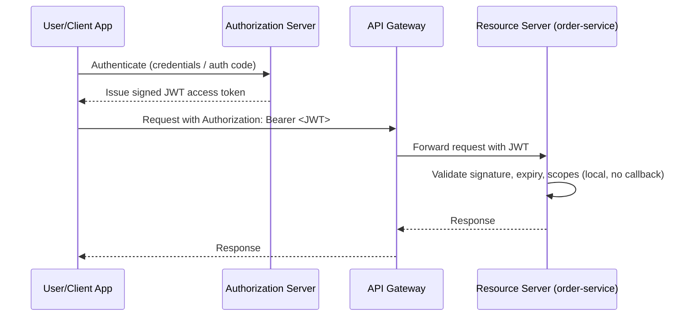
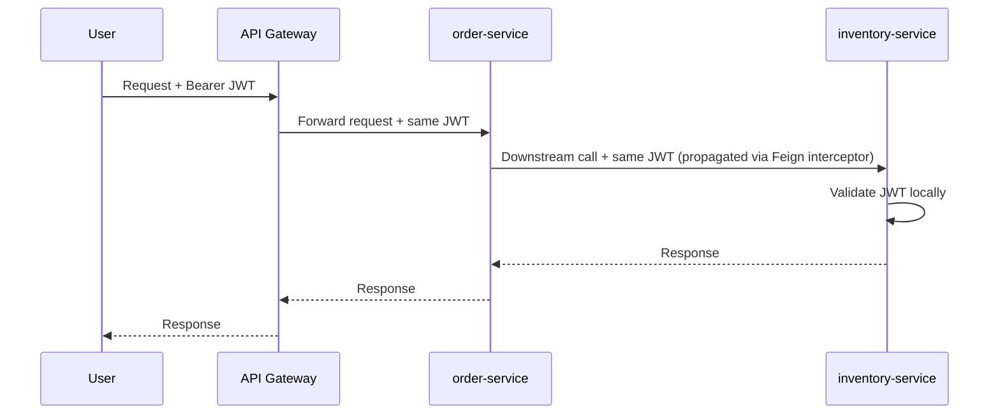
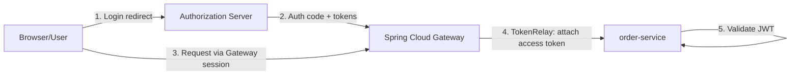
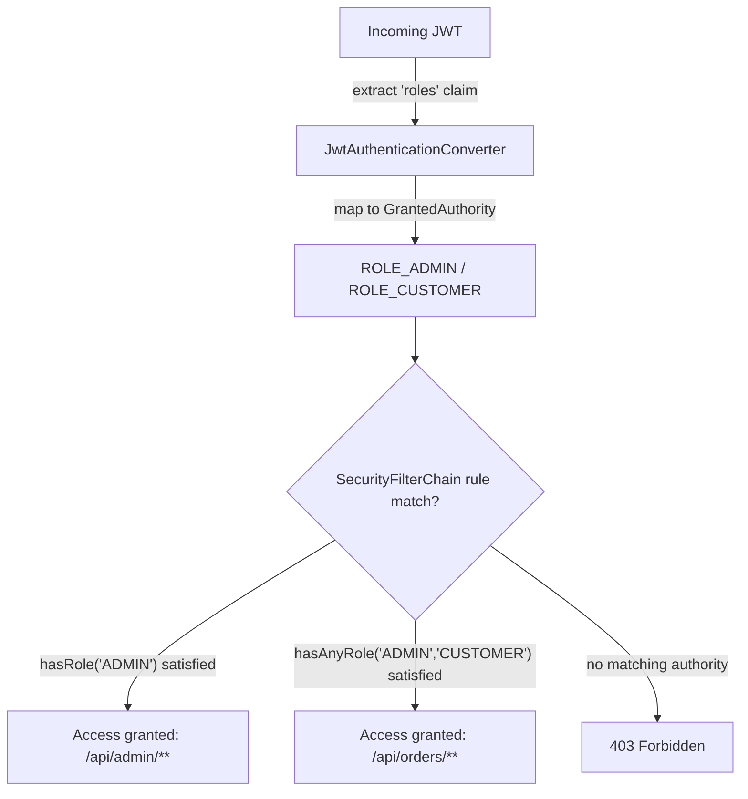

# Spring Cloud Security

## Detailed Guide

### Securing Microservices with OAuth2 and JWT

OAuth2 is an authorization framework, and in Spring Cloud microservices it's almost always paired with JWT (JSON Web Tokens) as the bearer token format. Instead of each microservice maintaining its own user database and session state, a central Authorization Server issues signed JWTs after authenticating a user or client, and every downstream microservice trusts and validates that token independently without calling back to a central session store. This makes the architecture stateless and horizontally scalable, since any instance of any service can validate a token on its own using the issuer's public signing key.

A JWT carries claims — subject (who), issued-at/expiry (when), scopes/authorities (what they can do), and issuer (who vended it) — all cryptographically signed so tampering is detectable. Microservices only need the authorization server's public key (or a JWKS endpoint URL) to verify signatures; they never need the authorization server's private key or a live connection to it for every request, which is what makes JWT validation fast and resilient to authorization server downtime for already-issued, still-valid tokens.

**Real-life scenario:** A mobile app authenticates once against the authorization server and receives a JWT access token; every subsequent call to `order-service`, `inventory-service`, or `payment-service` includes that same token in the `Authorization: Bearer <token>` header, and each service independently verifies it without a network round trip back to the authorization server.



| Approach | State | Scalability | Revocation |
|---|---|---|---|
| Server-side sessions | Stateful (shared session store) | Requires sticky sessions or shared cache | Immediate (delete session) |
| JWT / OAuth2 bearer tokens | Stateless | Scales horizontally with no shared state | Harder — needs short expiry + refresh tokens or a blocklist |

**Interview Q&A:**

**Q: Why don't resource servers need the authorization server's private key?**
JWTs are signed with asymmetric cryptography (typically RS256); the authorization server keeps the private key to sign tokens, while resource servers only need the public key (via JWKS) to verify signatures, so no shared secret is ever distributed.

**Q: What's the practical downside of stateless JWTs compared to server-side sessions?**
Revocation is harder — since there's no central session to delete, a compromised token stays valid until it naturally expires unless the system adds extra machinery like short expiries with refresh tokens or a token blocklist.

### Setting up an Authorization Server for Microservices

Spring Authorization Server is the officially supported project for building an OAuth2/OIDC-compliant authorization server within the Spring ecosystem, replacing the deprecated Spring Security OAuth. It issues access tokens (JWTs), supports standard grant types (authorization code, client credentials, refresh token), and exposes the discovery metadata (`/.well-known/openid-configuration`) and JWKS endpoint (`/oauth2/jwks`) that resource servers use to validate tokens.

Setting one up means registering `RegisteredClient` definitions (client ID/secret, allowed grant types, redirect URIs, scopes) and configuring a `JWKSource` backed by an RSA key pair so issued tokens are signed and verifiable. In a microservices platform, this authorization server is typically a single dedicated service that every other service and the API gateway depend on for authentication, but none of them depend on it for every single request thanks to stateless JWT validation.

```java
@Configuration
public class AuthorizationServerConfig {

    @Bean
    public RegisteredClientRepository registeredClientRepository() {
        RegisteredClient registeredClient = RegisteredClient.withId(UUID.randomUUID().toString())
            .clientId("order-service-client")
            .clientSecret("{noop}secret")
            .authorizationGrantType(AuthorizationGrantType.CLIENT_CREDENTIALS)
            .scope("order.read")
            .scope("order.write")
            .build();
        return new InMemoryRegisteredClientRepository(registeredClient);
    }
}
```

```yaml
server:
  port: 9000

spring:
  security:
    oauth2:
      authorizationserver:
        issuer: http://auth-server:9000
```

**Real-life scenario:** A platform team stands up a single Spring Authorization Server instance that every microservice and the front-end SPA authenticate against, centralizing user credential storage and token issuance so individual teams never build their own login logic.

**Interview Q&A:**

**Q: What replaced the deprecated Spring Security OAuth project for building an authorization server?**
Spring Authorization Server, which is the officially supported project for issuing OAuth2/OIDC-compliant tokens within the Spring ecosystem.

**Q: What endpoints does a Spring Authorization Server expose that resource servers rely on?**
The OIDC discovery metadata endpoint (`/.well-known/openid-configuration`) and the JWKS endpoint (`/oauth2/jwks`), which resource servers use to discover the issuer's configuration and public signing keys respectively.

### Configuring Resource Servers to Validate JWT Tokens

Any microservice that receives requests carrying a bearer token and needs to protect its endpoints is a "resource server." Spring Security's OAuth2 Resource Server support (`spring-boot-starter-oauth2-resource-server`) handles JWT validation declaratively: given the authorization server's `issuer-uri` or `jwk-set-uri`, Spring Security automatically fetches (and caches) the public signing keys, validates the token's signature and expiry on every request, and populates the security context with the token's claims/authorities.

This is almost entirely configuration-driven — a resource server typically needs only a `SecurityFilterChain` bean specifying which endpoints require which scopes/authorities, plus the issuer URI, without hand-rolling any token-parsing logic.

```yaml
spring:
  security:
    oauth2:
      resourceserver:
        jwt:
          issuer-uri: http://auth-server:9000
```

```java
@Configuration
@EnableWebSecurity
public class ResourceServerConfig {

    @Bean
    public SecurityFilterChain filterChain(HttpSecurity http) throws Exception {
        http
            .authorizeHttpRequests(auth -> auth
                .requestMatchers(HttpMethod.GET, "/api/orders/**").hasAuthority("SCOPE_order.read")
                .requestMatchers(HttpMethod.POST, "/api/orders/**").hasAuthority("SCOPE_order.write")
                .anyRequest().authenticated())
            .oauth2ResourceServer(oauth2 -> oauth2.jwt(Customizer.withDefaults()));
        return http.build();
    }
}
```

**Real-life scenario:** `order-service` requires `SCOPE_order.write` to accept a new order; a JWT issued to a read-only reporting client that only has `SCOPE_order.read` is rejected with a `403 Forbidden` automatically, with zero custom authorization code written in `order-service` itself.

**Interview Q&A:**

**Q: What configuration is minimally required for a Spring Boot service to act as an OAuth2 resource server?**
The `spring-boot-starter-oauth2-resource-server` dependency plus `spring.security.oauth2.resourceserver.jwt.issuer-uri` pointing at the authorization server — Spring Security auto-configures JWKS key fetching, caching, and signature/expiry validation from that.

**Q: How does Spring Security map JWT scopes to authorities by default?**
Each value in the token's `scope`/`scp` claim is prefixed with `SCOPE_` and exposed as a `GrantedAuthority`, so a scope of `order.read` becomes the authority `SCOPE_order.read` usable in `hasAuthority()` checks.

### Propagating JWT Tokens Between Microservices

In a chained call scenario — say an API gateway calls `order-service`, which in turn calls `inventory-service` — the original caller's identity and authorization context need to flow through every hop, not just the first one. Without propagation, `inventory-service` would have no idea who the original user was or whether they were authorized, and each service would need its own (likely inconsistent) way of re-establishing trust.

The common pattern is to forward the same bearer token (or a re-issued, scoped-down token) on each downstream call. Spring's `RestTemplate`/`WebClient` interceptors or a Feign `RequestInterceptor` can extract the incoming JWT from the current request's security context and attach it as the `Authorization` header on the outgoing call, so `inventory-service` sees the same token and validates it exactly the same way as if it had been called directly.

```java
@Component
public class JwtPropagationInterceptor implements RequestInterceptor {

    @Override
    public void apply(RequestTemplate template) {
        Authentication authentication = SecurityContextHolder.getContext().getAuthentication();
        if (authentication instanceof JwtAuthenticationToken jwtAuth) {
            String token = jwtAuth.getToken().getTokenValue();
            template.header(HttpHeaders.AUTHORIZATION, "Bearer " + token);
        }
    }
}
```



**Real-life scenario:** A fraud-check step inside `order-service` calls `customer-service` to fetch risk signals; propagating the original JWT lets `customer-service` apply the same per-user authorization rules (e.g., data residency restrictions tied to the user's region) instead of trusting an unauthenticated internal call.

**Interview Q&A:**

**Q: What happens if a downstream service call in a chain doesn't propagate the original JWT?**
The downstream service has no way to know who the original caller was or what they're authorized to do, so it either has to trust the call blindly (a security gap) or reject it outright as unauthenticated.

**Q: How does a Feign client automatically attach the current request's JWT to an outgoing call?**
A `RequestInterceptor` bean reads the `Authentication` from `SecurityContextHolder`, extracts the `JwtAuthenticationToken`'s token value, and sets it as the `Authorization: Bearer` header on the outgoing `RequestTemplate`.

### TokenRelay Filter in Spring Cloud Gateway

Spring Cloud Gateway's `TokenRelay` filter automates the propagation pattern specifically for gateway-to-backend hops. When a user authenticates at the gateway via OAuth2 Login, the gateway holds an access token (and refresh token) in its OAuth2 client registration; the `TokenRelay` filter extracts that access token from the current user's session and forwards it as the `Authorization: Bearer` header on the proxied request to downstream services, without any custom filter code.

This is configured per-route (or globally) in the gateway's route definitions, and it depends on the gateway being set up as an OAuth2 client (not just a resource server), since it needs to hold onto the user's token from the login flow to relay it onward.

```yaml
spring:
  cloud:
    gateway:
      routes:
        - id: order-service-route
          uri: lb://order-service
          predicates:
            - Path=/api/orders/**
          filters:
            - TokenRelay=
  security:
    oauth2:
      client:
        registration:
          gateway-client:
            provider: auth-server
            client-id: gateway-client
            client-secret: "${GATEWAY_CLIENT_SECRET}"
            authorization-grant-type: authorization_code
            scope: openid,order.read,order.write
        provider:
          auth-server:
            issuer-uri: http://auth-server:9000
```



**Real-life scenario:** A server-rendered web application logs users in through the gateway's OAuth2 Login flow; every API call the browser makes through the gateway automatically carries the logged-in user's access token to backend services via `TokenRelay`, with no manual token handling in the frontend.

**Interview Q&A:**

**Q: What must the gateway be configured as for `TokenRelay=` to have a token available to forward?**
An OAuth2 client (with `spring.security.oauth2.client.registration`/`provider` configured), because it needs to complete the OAuth2 Login flow and hold the resulting access token in the user's session before it can relay it.

**Q: Is `TokenRelay` applied per-route or globally in Spring Cloud Gateway?**
It can be either — it's commonly added as a filter on specific route definitions, but it can also be configured as a default filter applied to all routes if every backend needs the relayed token.

### Role-Based Access Control Across Microservices

RBAC in a JWT-secured microservices system is typically implemented by encoding roles or scopes as claims in the token (e.g., a `roles` claim or `scope`/`authorities` claim), and each resource server maps those claims to Spring Security `GrantedAuthority` objects using a `JwtAuthenticationConverter`. Authorization rules are then expressed declaratively with `hasRole()`/`hasAuthority()` in the `SecurityFilterChain`, consistently across every service, since they all derive their authorities from the same token claims.

The key design decision is *where* roles are centrally managed — usually in the authorization server (or an upstream identity provider), which embeds them into the token at issuance time, so no individual microservice needs its own user-role database. This keeps authorization consistent across every service, but it also means role changes require issuing a new token (existing tokens keep their old roles until they expire).

```java
@Bean
public JwtAuthenticationConverter jwtAuthenticationConverter() {
    JwtGrantedAuthoritiesConverter authoritiesConverter = new JwtGrantedAuthoritiesConverter();
    authoritiesConverter.setAuthoritiesClaimName("roles");
    authoritiesConverter.setAuthorityPrefix("ROLE_");

    JwtAuthenticationConverter converter = new JwtAuthenticationConverter();
    converter.setJwtGrantedAuthoritiesConverter(authoritiesConverter);
    return converter;
}
```

```java
@Bean
public SecurityFilterChain filterChain(HttpSecurity http) throws Exception {
    http.authorizeHttpRequests(auth -> auth
            .requestMatchers("/api/admin/**").hasRole("ADMIN")
            .requestMatchers("/api/orders/**").hasAnyRole("ADMIN", "CUSTOMER")
            .anyRequest().authenticated())
        .oauth2ResourceServer(oauth2 -> oauth2.jwt(jwt -> jwt.jwtAuthenticationConverter(jwtAuthenticationConverter())));
    return http.build();
}
```



**Real-life scenario:** A support engineer's token carries `roles: ["SUPPORT"]`, granting read-only access to `order-service` and `customer-service` endpoints across the platform, while a `roles: ["ADMIN"]` token unlocks refund and account-deletion endpoints — all enforced consistently by each service reading the same claim.

**Interview Q&A:**

**Q: What Spring Security component maps a custom JWT claim (like `roles`) into `GrantedAuthority` objects?**
`JwtGrantedAuthoritiesConverter`, configured with `setAuthoritiesClaimName("roles")` and typically an `ROLE_` prefix, wired into a `JwtAuthenticationConverter` used by the OAuth2 resource server configuration.

**Q: Why is centralizing roles in the authorization server's issued token preferable to each microservice maintaining its own role table?**
It guarantees every service applies authorization consistently from a single source of truth, avoiding drift between services that might otherwise disagree about what a given user is allowed to do.

### Securing Actuator Endpoints Across Microservices

Actuator endpoints (`/actuator/env`, `/actuator/heapdump`, `/actuator/shutdown`, etc.) expose sensitive operational data and dangerous operations, so leaving them unauthenticated is a serious security gap — `/actuator/env` alone can leak database passwords and API keys from configuration properties. In an OAuth2/JWT-secured microservices setup, Actuator endpoints should be included in the same `SecurityFilterChain` rules as business endpoints, typically requiring a distinct `ACTUATOR` or `ADMIN` scope/role rather than being open to any authenticated user.

A common pattern is to expose only safe, read-only endpoints (`/actuator/health`, `/actuator/info`) publicly or to a load balancer/Kubernetes liveness probe, while locking down everything else behind authentication, and often binding the full Actuator endpoint set to a separate management port that isn't even reachable from outside the cluster network.

```yaml
management:
  server:
    port: 9001
  endpoints:
    web:
      exposure:
        include: health,info
  endpoint:
    health:
      probes:
        enabled: true
```

```java
@Bean
public SecurityFilterChain actuatorSecurityFilterChain(HttpSecurity http) throws Exception {
    http
        .securityMatcher(EndpointRequest.toAnyEndpoint())
        .authorizeHttpRequests(auth -> auth
            .requestMatchers(EndpointRequest.to("health", "info")).permitAll()
            .anyRequest().hasAuthority("SCOPE_actuator.admin"))
        .oauth2ResourceServer(oauth2 -> oauth2.jwt(Customizer.withDefaults()));
    return http.build();
}
```

| Exposure Strategy | Risk | Typical Use |
|---|---|---|
| All endpoints open, no auth | High — leaks secrets, allows shutdown/heapdump | Never in production |
| Health/info public, rest authenticated | Low-moderate | Common for k8s probes + admin access |
| Separate management port, network-isolated | Lowest | Preferred for internal-only Actuator access in production clusters |

**Real-life scenario:** A penetration test flags that `/actuator/env` is publicly reachable and reveals the production database password in plaintext; moving Actuator to a separate, network-isolated management port and requiring an `actuator.admin` scope closes the finding.

**Interview Q&A:**

**Q: Why should `/actuator/env` and `/actuator/heapdump` never be exposed without authentication?**
Both can leak highly sensitive data — `/actuator/env` reveals resolved configuration properties including secrets, and `/actuator/heapdump` can expose in-memory data such as session tokens or decrypted credentials.

**Q: What is the benefit of binding Actuator to a separate management port?**
It lets operational endpoints be reachable only from an internal network (e.g., not exposed by the Kubernetes Service or ingress), so even a misconfigured authorization rule doesn't expose them to the public internet.

## Interview Questions & Answers

### OAuth2, JWT, and Authorization Server Basics

**Q: Why is JWT well-suited to securing microservices compared to server-side sessions?**

JWTs are self-contained and stateless — any service can verify a token's signature and claims locally using the issuer's public key, without a shared session store or a callback to a central authentication service on every request, which enables horizontal scaling.

**Q: What is the difference between an authorization server and a resource server in this model?**

The authorization server authenticates users/clients and issues signed tokens (e.g., Spring Authorization Server). A resource server is any microservice that accepts those tokens on incoming requests and validates them locally to decide whether to allow access.

**Q: What claims are typically found in a JWT access token, and why do they matter?**

Common claims include `sub` (subject/user), `iss` (issuer), `exp`/`iat` (expiry/issued-at), and `scope`/`authorities` (permissions granted). Resource servers use `iss` to know which key to validate against, `exp` to reject expired tokens, and `scope` to enforce authorization decisions.

**Q: Why don't resource servers need to call the authorization server on every request to validate a token?**

Because the token is signed asymmetrically — the resource server only needs the authorization server's public key (fetched once from its JWKS endpoint and cached) to verify the signature locally, making validation fast and resilient to authorization server downtime.

### Token Propagation and Gateway Security

**Q: Why is JWT propagation needed for chained microservice calls, and how is it typically implemented?**

Without propagation, a downstream service in a call chain has no way to know the original caller's identity or authorization scopes. It's typically implemented by extracting the current request's bearer token from the security context and re-attaching it as the `Authorization` header on outgoing Feign/`WebClient` calls via an interceptor.

**Q: What does the `TokenRelay` filter in Spring Cloud Gateway do?**

It automatically forwards the OAuth2 access token that the gateway obtained during a user's login (via OAuth2 Login) as the `Authorization: Bearer` header on proxied requests to downstream services, eliminating the need for custom token-forwarding filter code.

**Q: What prerequisite must the gateway satisfy for `TokenRelay` to work?**

The gateway must be configured as an OAuth2 client (with a client registration and provider pointing at the authorization server), not merely a resource server, since it needs to hold and manage the user's tokens obtained during the login flow in order to relay them.

**Q: What happens to `TokenRelay` if the user's access token expires mid-session?**

Spring Cloud Gateway's OAuth2 client support can use the associated refresh token to silently obtain a new access token, provided refresh tokens were requested and the client is configured to use them, so the user isn't forced to re-authenticate for every expired token.

### RBAC and Actuator Security

**Q: How is role-based access control typically implemented across multiple resource servers sharing one authorization server?**

Roles or scopes are embedded as claims in the JWT at issuance time (e.g., a `roles` claim), and each resource server uses a `JwtAuthenticationConverter` to map those claims into Spring Security `GrantedAuthority` objects, then applies `hasRole()`/`hasAuthority()` rules consistently, since every service reads from the same claim structure.

**Q: What is a limitation of encoding roles directly in a JWT rather than checking a live database?**

If a user's role changes (e.g., they're demoted or an admin privilege is revoked), the change won't take effect until the currently issued token expires and a new one is issued, since the token is self-contained and not re-validated against a live source per request.

**Q: Why are unsecured Actuator endpoints considered a serious vulnerability?**

Endpoints like `/actuator/env` and `/actuator/heapdump` can leak secrets (database passwords, API keys) embedded in configuration, and `/actuator/shutdown` can let an attacker take a service offline — all without needing to breach the application's actual business logic.

**Q: What's a recommended pattern for securing Actuator endpoints in a Kubernetes-deployed microservice?**

Expose only `/actuator/health` and `/actuator/info` (needed for liveness/readiness probes) either unauthenticated or on an internal network, and put the full Actuator endpoint set on a separate management port that's not exposed outside the cluster, in addition to requiring authentication for anything beyond health/info.

**Q: Can the same `SecurityFilterChain` mechanism used for business endpoints also protect Actuator endpoints?**

Yes — a dedicated `SecurityFilterChain` bean can use `EndpointRequest.toAnyEndpoint()` as its request matcher and apply the same OAuth2 resource server JWT validation and scope-based authorization rules used elsewhere in the service.


## Resources

