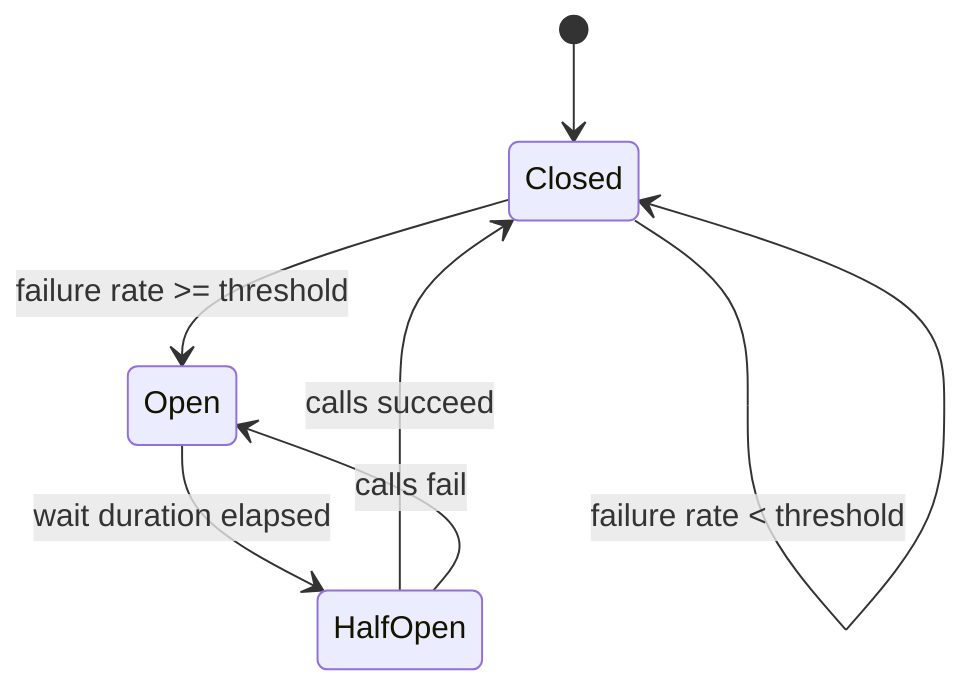
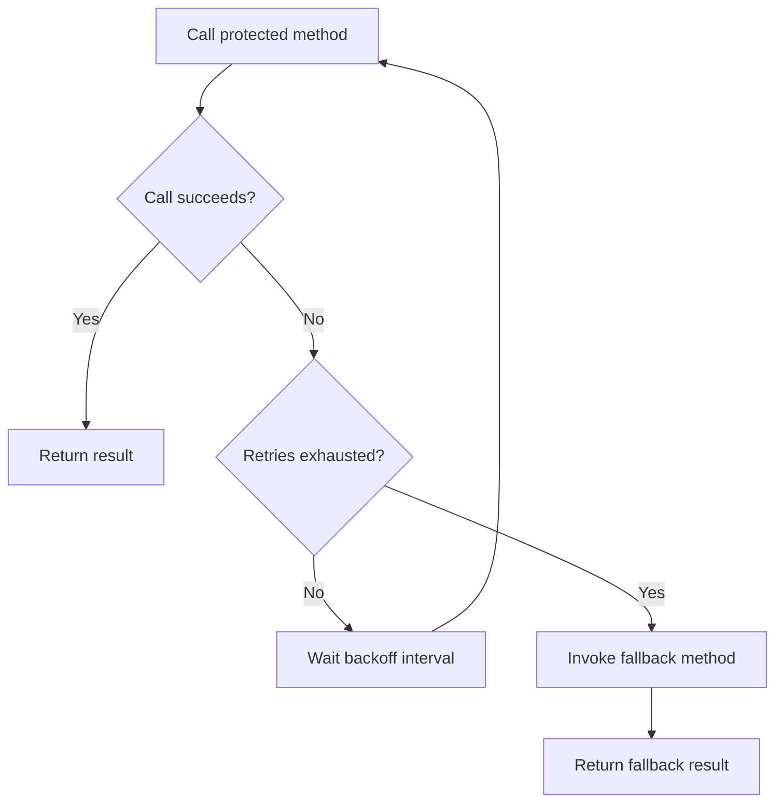
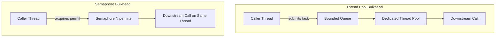
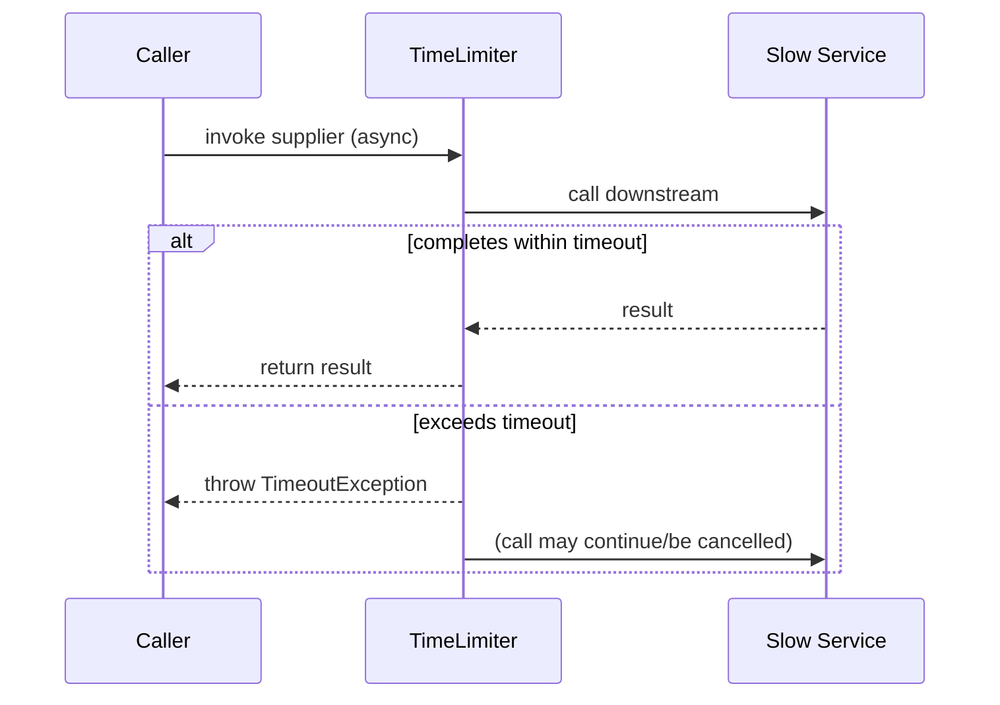
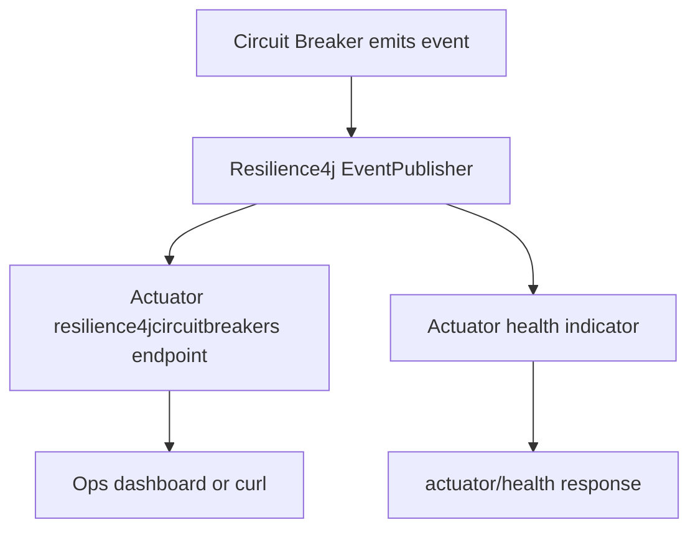
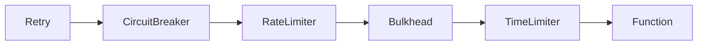

# Circuit Breakers and Resilience4j

## Detailed Guide

### Getting started with Circuit Breaker - Resilience4j

Resilience4j is a lightweight, modular fault-tolerance library designed for Java 8+ and functional programming, built as a spiritual successor to Netflix Hystrix (which is now in maintenance mode). Unlike Hystrix, which bundled every resilience concern into a single monolithic dependency, Resilience4j splits each pattern into its own module — `resilience4j-circuitbreaker`, `resilience4j-retry`, `resilience4j-ratelimiter`, `resilience4j-bulkhead`, `resilience4j-timelimiter` — so you only pull in what you need. The core idea of the Circuit Breaker pattern is to prevent a client from repeatedly calling a downstream service that is known to be failing, giving the failing service time to recover and protecting the caller from cascading failures and resource exhaustion (thread starvation, connection pool depletion, etc.).

A circuit breaker wraps a "protected" function call and tracks the outcome of each call in a sliding window (count-based or time-based). When the failure rate (or slow-call rate) crosses a configured threshold, the circuit "trips" and moves from `CLOSED` to `OPEN`. While `OPEN`, calls are rejected immediately with a `CallNotPermittedException` without even attempting the downstream call — this is the key mechanism that gives the failing dependency breathing room. After a configured wait duration, the breaker transitions to `HALF_OPEN` and allows a limited number of trial calls through; if those succeed, the breaker closes again, otherwise it reopens.

In Spring Boot, Resilience4j integrates via the `resilience4j-spring-boot3` starter (for Spring Boot 3.x) which auto-configures AOP aspects, actuator endpoints, and Micrometer metrics binding. The most common usage style is annotation-driven — decorating a Spring bean method with `@CircuitBreaker(name = "...")` — although a lower-level, fully programmatic API using `CircuitBreakerRegistry` and `CircuitBreaker.decorateSupplier(...)` is also available for non-Spring or highly custom use cases.

**Real-life scenario:** An e-commerce checkout service calls a third-party payment gateway. During a payment provider outage, without a circuit breaker every checkout request would hang for the full HTTP timeout (say 30s) waiting on a dead dependency, exhausting the checkout service's thread pool and taking down checkout entirely for all customers — even those whose orders don't need immediate payment confirmation. With a circuit breaker, after a handful of failures the breaker opens, subsequent calls fail fast in milliseconds, and the checkout service can immediately show "payment temporarily unavailable, please retry" while its own threads stay free to serve other requests.



**Interview Q&A:**

**Q: Why did Resilience4j replace Hystrix as the preferred circuit breaker library for Spring Boot?**
Hystrix entered maintenance mode with no new features, while Resilience4j is modular (separate artifacts per pattern), lightweight, built on functional interfaces, and has first-class Spring Boot 3 support.

**Q: What exception is thrown when a call is rejected while the circuit is `OPEN`?**
`CallNotPermittedException` is thrown immediately, without ever attempting the downstream call.

### Adding Resilience4j to Spring Boot Microservice

Integrating Resilience4j into a Spring Boot microservice starts with adding the Spring Boot starter dependency, which wires up auto-configuration, AOP proxies, and actuator health/metrics contributors automatically. For Maven:

```xml
<dependency>
    <groupId>io.github.resilience4j</groupId>
    <artifactId>resilience4j-spring-boot3</artifactId>
    <version>2.2.0</version>
</dependency>
<dependency>
    <groupId>org.springframework.boot</groupId>
    <artifactId>spring-boot-starter-aop</artifactId>
</dependency>
<dependency>
    <groupId>org.springframework.boot</groupId>
    <artifactId>spring-boot-starter-actuator</artifactId>
</dependency>
```

The `spring-boot-starter-aop` dependency is required because Resilience4j's annotations (`@CircuitBreaker`, `@Retry`, `@RateLimiter`, `@Bulkhead`, `@TimeLimiter`) are implemented as Spring AOP aspects that wrap the annotated method in a proxy. Without AOP on the classpath, the annotations are silently ignored and calls pass straight through unprotected — a very common gotcha for teams new to the library.

Once the dependency is present, each resilience "instance" (circuit breaker, retry, etc.) is identified by a `name` that you choose, and configured either in `application.yml` under `resilience4j.circuitbreaker.instances.<name>` or programmatically by registering a custom `CircuitBreakerConfig` bean. A minimal working example is a service method annotated with `@CircuitBreaker`, backed by default configuration, that will start using Resilience4j's `CLOSED` state and default 50% failure-rate threshold immediately with zero extra code:

```java
@Service
public class InventoryClient {

    private final RestTemplate restTemplate;

    public InventoryClient(RestTemplate restTemplate) {
        this.restTemplate = restTemplate;
    }

    @CircuitBreaker(name = "inventoryService", fallbackMethod = "fallbackInventory")
    public InventoryResponse checkStock(String sku) {
        return restTemplate.getForObject("/inventory/{sku}", InventoryResponse.class, sku);
    }

    private InventoryResponse fallbackInventory(String sku, Throwable throwable) {
        return InventoryResponse.unknown(sku);
    }
}
```

**Real-life scenario:** A team migrating from a monolith to microservices adds `resilience4j-spring-boot3` to their order service so that every outbound call to the inventory, pricing, and shipping microservices is wrapped in its own named circuit breaker — allowing pricing service instability to be isolated from shipping availability, instead of one flaky dependency degrading the entire order flow.

**Interview Q&A:**

**Q: What happens if you add `@CircuitBreaker` but forget `spring-boot-starter-aop`?**
The annotation is silently ignored because there's no AOP proxy to intercept calls, so the method executes completely unprotected with no warnings raised.

**Q: How is a Resilience4j "instance" identified across the codebase and configuration?**
By a developer-chosen name string (e.g., `name = "inventoryService"`), which links the annotation on the method to the matching `resilience4j.circuitbreaker.instances.<name>` config block.

### Circuit Breaker Features of Resilience4j

Resilience4j's `CircuitBreaker` module offers a rich feature set beyond the basic open/closed mechanism. It supports both **count-based** sliding windows (e.g., "look at the last 100 calls") and **time-based** sliding windows (e.g., "look at calls in the last 10 seconds"), configurable independently of the minimum number of calls required before the failure rate is even calculated (`minimumNumberOfCalls`). It also tracks a separate **slow call rate** — calls that complete successfully but exceed a configured `slowCallDurationThreshold` — so that a dependency which is technically "succeeding" but has degraded to unacceptable latency can still trip the breaker.

Other notable features include: automatic transition from `OPEN` to `HALF_OPEN` after a wait duration, or manual transitions via `transitionToOpenState()` for operational overrides; a `DISABLED`, `FORCED_OPEN`, and `METRICS_ONLY` state for testing and canary rollouts; an `ignoreExceptions` / `recordExceptions` list so that business exceptions (like a validation `4xx`) don't count as circuit-breaker failures while infrastructure exceptions (`5xx`, timeouts) do; and a rich `EventPublisher` that lets you subscribe to `onStateTransition`, `onCallNotPermitted`, `onError`, and `onSuccess` events for logging or alerting.

Resilience4j also supports combining a circuit breaker with the other modules (retry, rate limiter, bulkhead, time limiter) on the same method, in a well-defined aspect order, so you can build a comprehensive resilience strategy — for example, retrying a call a few times, but only within a bulkhead-limited pool of concurrent attempts, all guarded by an overarching circuit breaker.

```java
CircuitBreakerConfig config = CircuitBreakerConfig.custom()
    .failureRateThreshold(50)
    .slowCallRateThreshold(80)
    .slowCallDurationThreshold(Duration.ofSeconds(2))
    .slidingWindowType(CircuitBreakerConfig.SlidingWindowType.COUNT_BASED)
    .slidingWindowSize(20)
    .minimumNumberOfCalls(10)
    .waitDurationInOpenState(Duration.ofSeconds(30))
    .permittedNumberOfCallsInHalfOpenState(5)
    .recordExceptions(IOException.class, TimeoutException.class)
    .ignoreExceptions(BusinessValidationException.class)
    .build();

CircuitBreakerRegistry registry = CircuitBreakerRegistry.of(config);
CircuitBreaker circuitBreaker = registry.circuitBreaker("inventoryService");

Supplier<InventoryResponse> decorated =
    CircuitBreaker.decorateSupplier(circuitBreaker, () -> inventoryClient.checkStock("SKU-1"));
```

| Feature | Purpose |
| --- | --- |
| Count-based sliding window | Trip based on last N calls, regardless of elapsed time |
| Time-based sliding window | Trip based on calls within last N seconds |
| Slow call rate threshold | Treat "successful but slow" calls as failures |
| `recordExceptions` / `ignoreExceptions` | Fine-tune which exceptions count toward failure rate |
| Manual state transitions | Force `OPEN`/`CLOSED`/`DISABLED` for ops/testing |

**Interview Q&A:**

**Q: What's the purpose of the `METRICS_ONLY` state?**
It lets a circuit breaker record metrics and evaluate what it *would* do without actually rejecting calls, useful for canary-testing a new configuration in production before enforcing it.

**Q: How does `ignoreExceptions` differ from `recordExceptions` in effect?**
`recordExceptions` explicitly whitelists which exceptions count toward the failure rate (everything else is ignored), while `ignoreExceptions` blacklists specific exceptions from counting while everything else is recorded by default.

### Resilience4j - Retry and Fallback Methods

The Retry module automatically re-invokes a failed operation a configured number of times before giving up, which is useful for transient failures such as brief network blips, momentary service overload, or optimistic-locking conflicts. Resilience4j's `@Retry` annotation (or the programmatic `Retry` API) supports a fixed `maxAttempts`, configurable `waitDuration` between attempts, and pluggable backoff strategies — most notably `IntervalFunction.ofExponentialBackoff(...)`, which increases the wait time after each failed attempt to avoid hammering an already-struggling dependency (a technique often combined with jitter to avoid thundering-herd retries across many client instances).

A **fallback method** is a separate mechanism, usable together with any Resilience4j annotation (`@Retry`, `@CircuitBreaker`, `@RateLimiter`, `@Bulkhead`, `@TimeLimiter`), that provides an alternative code path to execute when the primary method ultimately throws an exception the resilience policy could not resolve — e.g., retries exhausted, or the circuit is open. The fallback method must have the same return type and the same parameter list as the original method, plus one extra final parameter of type `Throwable` (or a specific exception subtype) capturing the failure cause. Spring locates the fallback by name via reflection on the same bean, so it must be a method (public or private) within the same class.

It's important to understand the interaction: retry happens *first*, transparently, inside the aspect chain; only after all retry attempts are exhausted does control fall through to the fallback. This means a method annotated with both `@Retry` and a `fallbackMethod` will silently retry N times, and only surface the fallback value to the caller if every attempt fails — the caller is never aware retries happened unless it inspects logs or metrics.

```java
@Service
public class PricingClient {

    @Retry(name = "pricingService", fallbackMethod = "fallbackPrice")
    public PriceResponse getPrice(String sku) {
        return restTemplate.getForObject("/pricing/{sku}", PriceResponse.class, sku);
    }

    private PriceResponse fallbackPrice(String sku, Throwable throwable) {
        return PriceResponse.cached(sku);
    }
}
```

```yaml
resilience4j:
  retry:
    instances:
      pricingService:
        max-attempts: 3
        wait-duration: 500ms
        enable-exponential-backoff: true
        exponential-backoff-multiplier: 2
        retry-exceptions:
          - java.io.IOException
          - org.springframework.web.client.ResourceAccessException
        ignore-exceptions:
          - com.example.BusinessValidationException
```

**Real-life scenario:** A mobile banking app calls a balance-inquiry microservice that occasionally times out due to brief database failover events lasting under a second. Instead of surfacing an error to the user immediately, the client retries twice with a short exponential backoff, and only falls back to displaying a "last known balance" cached value if all three attempts fail — dramatically improving perceived reliability without any user-visible errors for transient blips.



**Interview Q&A:**

**Q: Does the caller know if retries happened before a fallback result is returned?**
Not unless it inspects logs, metrics, or actuator retry events — the retry aspect is fully transparent, so the caller only ever observes the final fallback result or the eventual successful outcome.

**Q: What must match between a fallback method and its original method's signature?**
The return type and parameter list must be identical, with the fallback adding exactly one extra trailing parameter of type `Throwable` (or a subtype) to receive the failure cause.

### Rate Limiting and BulkHead Features of Resilience4j

The **Rate Limiter** module restricts the number of calls permitted to a protected function within a given time period (a "refresh period"), rejecting or blocking excess calls once the limit is reached. This protects downstream services from being overwhelmed, and is typically used to enforce a self-imposed quota — for example, respecting a third-party API's rate limit of "100 requests per minute" so your service never gets throttled or banned by that provider. Configuration revolves around three properties: `limitForPeriod` (how many calls are allowed), `limitRefreshPeriod` (how often the limit resets), and `timeoutDuration` (how long a call will wait for a permit before failing with `RequestNotPermitted`).

The **Bulkhead** module, named after ship-hull bulkheads that contain flooding to one compartment, limits the number of *concurrent* calls to a protected function so that a slow or overloaded dependency cannot consume unlimited resources and starve unrelated calls elsewhere in the application. Resilience4j offers two bulkhead implementations: a **semaphore-based** bulkhead (a simple counting semaphore limiting concurrent calls on the caller's own thread) and a **thread-pool-based** bulkhead (which executes calls asynchronously on a dedicated, bounded thread pool with its own queue) — covered in depth in the next topic.

Both rate limiting and bulkheading are commonly combined with a circuit breaker: the rate limiter prevents self-inflicted overload, the bulkhead contains concurrency-related resource exhaustion, and the circuit breaker reacts to the failures that do occur. All three can be stacked on a single method using multiple annotations simultaneously.

```java
@Service
public class ExternalApiClient {

    @RateLimiter(name = "externalApi")
    @Bulkhead(name = "externalApi")
    public ApiResponse callThirdParty(String query) {
        return webClient.get().uri("/search?q={q}", query)
                .retrieve()
                .bodyToMono(ApiResponse.class)
                .block();
    }
}
```

```yaml
resilience4j:
  ratelimiter:
    instances:
      externalApi:
        limit-for-period: 100
        limit-refresh-period: 60s
        timeout-duration: 0s
  bulkhead:
    instances:
      externalApi:
        max-concurrent-calls: 10
        max-wait-duration: 0s
```

**Real-life scenario:** A weather-data aggregator calls a free-tier third-party weather API capped at 100 requests/minute. A rate limiter enforces that cap application-wide so the service is never banned for exceeding quota, while a bulkhead ensures that even if hundreds of internal requests arrive simultaneously, only a handful concurrently reach the outbound HTTP client, protecting the connection pool from exhaustion.

**Interview Q&A:**

**Q: What does `timeoutDuration` control in a Rate Limiter?**
How long a call will wait for an available permit before failing with `RequestNotPermitted`, rather than failing immediately the instant the limit is reached.

**Q: Why combine Rate Limiter and Bulkhead rather than relying on just one?**
Rate Limiter throttles the total call rate over time (protecting against quota breaches), while Bulkhead caps concurrent in-flight calls (protecting against resource exhaustion) — they guard against different, complementary failure modes.

### Bulkhead Pattern - Thread Pool vs Semaphore Isolation

Resilience4j provides two distinct bulkhead implementations, and choosing between them is one of the most consequential resilience decisions in a Spring Boot service. The **`SemaphoreBulkhead`** limits concurrency by acquiring a permit from a `java.util.concurrent.Semaphore` before executing the call *on the calling thread itself*. If no permit is available within `maxWaitDuration`, the call fails fast with a `BulkheadFullException`. This approach has very low overhead (no thread hand-off, no separate executor) but has a critical limitation: it cannot enforce a timeout on a call that is already executing, because it runs on the caller's thread — a hung downstream call will block that thread indefinitely regardless of the bulkhead.

The **`ThreadPoolBulkhead`** instead submits the call as a task to a dedicated, bounded `ExecutorService` with its own queue, decoupling execution from the caller's thread. This means the caller can time out and move on (e.g., the web request thread) even if the downstream call itself is still stuck, and it naturally combines with `@TimeLimiter` to cap execution time. The tradeoff is higher overhead (thread context switching, queueing latency) and a differently shaped API — annotated methods must return `CompletionStage`/`CompletableFuture` rather than a plain value, since execution is inherently asynchronous.

Choosing between them depends on your workload: use **semaphore bulkheads** for lightweight, fast, synchronous calls where you mainly want to cap concurrency without added latency; use **thread-pool bulkheads** when you need true isolation from a slow or blocking dependency, especially when paired with a time limiter, or when the calling code is already reactive/asynchronous.

```java
// Semaphore bulkhead — synchronous, runs on caller's thread
@Bulkhead(name = "reportService", type = Bulkhead.Type.SEMAPHORE)
public ReportResponse generateReport(String reportId) {
    return reportClient.generate(reportId);
}

// Thread-pool bulkhead — asynchronous, runs on dedicated executor
@Bulkhead(name = "reportService", type = Bulkhead.Type.THREADPOOL)
public CompletableFuture<ReportResponse> generateReportAsync(String reportId) {
    return CompletableFuture.supplyAsync(() -> reportClient.generate(reportId));
}
```

```yaml
resilience4j:
  bulkhead:
    instances:
      reportService:
        max-concurrent-calls: 20
        max-wait-duration: 10ms
  thread-pool-bulkhead:
    instances:
      reportService:
        max-thread-pool-size: 4
        core-thread-pool-size: 2
        queue-capacity: 20
```



| Aspect | Semaphore Bulkhead | Thread Pool Bulkhead |
| --- | --- | --- |
| Execution thread | Caller's own thread | Dedicated executor thread |
| Return type | Plain value (`T`) | `CompletableFuture<T>` / `CompletionStage<T>` |
| Overhead | Very low | Higher (context switch, queueing) |
| Can be combined with `@TimeLimiter` to abort a hung call | No — caller thread still blocks | Yes — caller thread returns even if task hangs |
| Best for | Fast, synchronous, low-risk calls | Slow, potentially blocking, or unreliable dependencies |
| Queue support | No queue, only permits | Bounded queue for pending tasks |

**Real-life scenario:** A document-processing service calls a legacy SOAP-based tax calculation system known to occasionally hang for minutes under load. Using a semaphore bulkhead alone would leave caller threads stuck if a hang occurred; switching to a thread-pool bulkhead combined with a `@TimeLimiter` lets the web-request thread return a "processing" response immediately while the tax call is abandoned server-side after a strict timeout, keeping the web tier responsive.

**Interview Q&A:**

**Q: Why must a thread-pool-bulkhead-annotated method return `CompletableFuture`?**
Because execution is submitted to a separate executor and runs asynchronously, so the method must return a future-like type for the caller to observe completion rather than a plain synchronous value.

**Q: What's a downside of the thread pool bulkhead compared to the semaphore bulkhead?**
Higher overhead from thread hand-off and queueing latency, plus added complexity from requiring asynchronous return types to propagate throughout the call chain.

### Time Limiter in Resilience4j

The **Time Limiter** module enforces a maximum execution time on an asynchronous operation (one returning `CompletableFuture` or `CompletionStage`), throwing a `TimeoutException` if the operation does not complete within the configured `timeoutDuration`. Unlike a plain client-side HTTP timeout, the time limiter operates at the application code level and works with any asynchronous supplier, not just HTTP calls — making it useful for wrapping database queries, message processing, or any long-running computation that has been made asynchronous.

Because `@TimeLimiter` requires an asynchronous return type, it is most naturally combined with the `ThreadPoolBulkhead` (also asynchronous) rather than the semaphore bulkhead. A common and powerful combination is `@TimeLimiter` + `@Bulkhead(type = THREADPOOL)` + `@CircuitBreaker`: the bulkhead isolates concurrent executions to a bounded pool, the time limiter caps how long any single execution is allowed to run, and the circuit breaker reacts to the resulting timeouts/failures by tripping open once they become frequent. It's worth noting that Resilience4j's time limiter cancels the underlying `Future` by default (`cancelRunningFuture: true`), but this only *requests* cancellation — it does not forcibly stop a thread that ignores interruption, so genuinely un-interruptible blocking calls can still tie up a thread-pool thread even after the caller receives a `TimeoutException`.

```java
@Service
public class ReportService {

    @TimeLimiter(name = "reportService")
    @Bulkhead(name = "reportService", type = Bulkhead.Type.THREADPOOL)
    @CircuitBreaker(name = "reportService", fallbackMethod = "fallbackReport")
    public CompletableFuture<ReportResponse> generateReport(String reportId) {
        return CompletableFuture.supplyAsync(() -> reportClient.generate(reportId));
    }

    private CompletableFuture<ReportResponse> fallbackReport(String reportId, Throwable t) {
        return CompletableFuture.completedFuture(ReportResponse.unavailable(reportId));
    }
}
```

```yaml
resilience4j:
  timelimiter:
    instances:
      reportService:
        timeout-duration: 2s
        cancel-running-future: true
```

**Real-life scenario:** A search aggregation service fans out to five downstream search providers concurrently and must respond within 800ms regardless of how slow any single provider is. Each provider call is wrapped in its own `@TimeLimiter` set to 700ms, so a single slow provider is abandoned and excluded from the aggregated result rather than delaying the whole response to the end user.



**Interview Q&A:**

**Q: Can `@TimeLimiter` be applied to a synchronous method?**
No — it only works with asynchronous return types like `CompletableFuture` or `CompletionStage`, since it needs a future-like handle to cancel/time out against.

**Q: Why might a thread continue running after a `TimeLimiter` times out?**
Because `cancelRunningFuture` only requests cooperative cancellation; a task that doesn't check for interruption or performs an uninterruptible blocking call keeps its thread occupied regardless of the timeout.

### Circuit Breaker configuration properties

Resilience4j circuit breakers are typically configured declaratively in `application.yml` under `resilience4j.circuitbreaker`, either as a shared `default` configuration inherited by all instances, or per-instance overrides. The most commonly tuned properties are: `failureRateThreshold` (percentage of failed calls that trips the breaker, default 50%), `slowCallRateThreshold` and `slowCallDurationThreshold` (for latency-based tripping), `slidingWindowType` and `slidingWindowSize` (how many recent calls/seconds are analyzed), `minimumNumberOfCalls` (minimum sample size before the failure rate is evaluated — prevents tripping on a tiny, statistically insignificant sample), `waitDurationInOpenState` (how long the breaker stays open before trying half-open), and `permittedNumberOfCallsInHalfOpenState`.

Using the `configs.default` block lets teams establish sane baseline resilience settings once and only override what differs per dependency — for example, a payment gateway might need a stricter `failureRateThreshold` and longer `waitDurationInOpenState` than an internal, low-risk lookup service.

```yaml
resilience4j:
  circuitbreaker:
    configs:
      default:
        register-health-indicator: true
        sliding-window-type: COUNT_BASED
        sliding-window-size: 50
        minimum-number-of-calls: 10
        failure-rate-threshold: 50
        slow-call-rate-threshold: 80
        slow-call-duration-threshold: 2s
        wait-duration-in-open-state: 30s
        permitted-number-of-calls-in-half-open-state: 5
        automatic-transition-from-open-to-half-open-enabled: true
    instances:
      paymentService:
        base-config: default
        failure-rate-threshold: 30
        wait-duration-in-open-state: 60s
      inventoryService:
        base-config: default
```

| Property | Meaning |
| --- | --- |
| `failureRateThreshold` | % of failed calls to trip the breaker |
| `slidingWindowSize` / `slidingWindowType` | Sample size and measurement strategy (count vs time based) |
| `minimumNumberOfCalls` | Minimum calls before failure rate is evaluated |
| `waitDurationInOpenState` | Time spent `OPEN` before trying `HALF_OPEN` |
| `permittedNumberOfCallsInHalfOpenState` | Trial calls allowed while `HALF_OPEN` |

**Real-life scenario:** A platform team defines a strict `default` circuit breaker configuration in a shared Spring Boot starter used across dozens of internal microservices, ensuring every team gets sensible resilience defaults out of the box, while individual teams only override `failureRateThreshold` or `waitDurationInOpenState` for the specific characteristics of their own downstream dependencies.

**Interview Q&A:**

**Q: What's the benefit of using `configs.default` with `base-config: default` per instance?**
It centralizes baseline resilience settings in one place, avoiding duplication across dozens of instances while still allowing targeted overrides for dependencies with different risk profiles.

**Q: If `failureRateThreshold` and `slowCallRateThreshold` are both configured, are they independent?**
Yes — a call is judged both on whether it errored (counts toward failure rate) and, if it succeeded, whether it exceeded `slowCallDurationThreshold` (counts toward slow-call rate); breaching either threshold can trip the breaker.

### Actuator /health Endpoint

Spring Boot Actuator's `/actuator/health` endpoint aggregates the health of all registered `HealthIndicator` beans into a single up/down status. When `resilience4j-spring-boot3` is on the classpath and `register-health-indicator: true` is set for a circuit breaker instance, Resilience4j contributes a health indicator named after the circuit breaker that reports `UP` when the breaker is `CLOSED` or `HALF_OPEN`, and by default still reports `UP` even when `OPEN` (since an open circuit is a deliberate self-protective state, not necessarily an indication the whole application is unhealthy) — this behavior can be tuned via `management.health.circuitbreakers.enabled` and downstream health-status mapping.

By default, `/actuator/health` returns a minimal `{"status": "UP"}` unless `management.endpoint.health.show-details` is set to `always` or `when-authorized`, in which case the response includes a breakdown per indicator (including each named circuit breaker) with its individual status and details such as failure rate and current state.

```yaml
management:
  endpoint:
    health:
      show-details: always
  health:
    circuitbreakers:
      enabled: true
```

```bash
curl -s http://localhost:8080/actuator/health | jq
# {
#   "status": "UP",
#   "components": {
#     "circuitBreakers": {
#       "status": "UP",
#       "details": {
#         "inventoryService": { "status": "UP", "details": { "state": "CLOSED", "failureRate": "12.5%" } }
#       }
#     }
#   }
# }
```

**Real-life scenario:** A Kubernetes readiness/liveness probe hits `/actuator/health` to decide whether to keep routing traffic to a pod; because Resilience4j reports circuit breaker health as part of the aggregate, an operations team can see at a glance in their monitoring dashboard whether a pod's dependencies are degraded, without needing a separate custom health check for every downstream integration.

**Interview Q&A:**

**Q: Does an `OPEN` circuit breaker automatically make `/actuator/health` report `DOWN`?**
No, by default an `OPEN` breaker still reports `UP` since it's considered a deliberate self-protective state rather than an application failure; this mapping can be customized if desired.

**Q: What setting controls whether the health response includes per-indicator details?**
`management.endpoint.health.show-details`, set to `always` or `when-authorized` to expose the breakdown instead of just the minimal top-level status.

### Configure Access to Actuator endpoints

By default, Spring Boot Actuator exposes only `/health` and `/info` over HTTP; every other endpoint, including Resilience4j-specific ones like `/actuator/circuitbreakers`, `/actuator/circuitbreakerevents`, `/actuator/retryevents`, and `/actuator/ratelimiterevents`, must be explicitly opted into via `management.endpoints.web.exposure.include`. This is a deliberate security default — actuator endpoints can leak sensitive operational details (bean names, config values, live metrics) and some (like `/shutdown`) can even mutate application state, so blanket exposure is discouraged in production.

Teams typically expose a curated list of endpoints rather than `*` (which exposes everything), and further restrict access at the network layer (a separate management port, firewall rules, or an API gateway) and/or via Spring Security so only authenticated operators or internal monitoring systems can reach them. Combining `include`/`exclude` lists with a dedicated `management.server.port` is a common production pattern: it lets internal tooling scrape metrics on a port not exposed to the public internet at all.

```yaml
management:
  server:
    port: 9001
  endpoints:
    web:
      exposure:
        include: health, info, circuitbreakers, circuitbreakerevents, retryevents, ratelimiterevents, metrics, prometheus
      base-path: /actuator
  endpoint:
    health:
      show-details: when-authorized
```

```bash
# Verify only the intended endpoints are reachable
curl -s http://localhost:9001/actuator | jq '._links | keys'
```

**Real-life scenario:** A financial-services company runs a security audit and discovers that `management.endpoints.web.exposure.include: "*"` had accidentally exposed the `/actuator/env` endpoint (which can reveal environment variables, including secrets) on the public internet; the fix was to explicitly whitelist only the endpoints actually needed by monitoring tooling and move the actuator port behind an internal-only network policy.

**Interview Q&A:**

**Q: Why shouldn't you set `management.endpoints.web.exposure.include` to `"*"` in production?**
It exposes every actuator endpoint, some of which reveal sensitive details (env vars, config, beans) or can mutate state (like `/shutdown`), creating unnecessary attack surface.

**Q: What's a common defense-in-depth practice alongside curating exposed endpoints?**
Running actuator on a separate `management.server.port` not reachable from the public internet, combined with Spring Security or network policies restricting access to internal operators/tools.

### Monitoring Circuit Breaker events in Actuator

Resilience4j publishes a rolling, in-memory event log for each protected resource, exposed via actuator at `/actuator/circuitbreakerevents` (and a per-instance variant like `/actuator/circuitbreakerevents/{name}`). Each event captures the type (`STATE_TRANSITION`, `ERROR`, `SUCCESS`, `NOT_PERMITTED`, `IGNORED_ERROR`), the circuit breaker name, and a timestamp — giving operators visibility into exactly when and why a breaker tripped, without needing to correlate raw application logs.

Beyond the actuator event endpoints, Resilience4j integrates with Micrometer to publish gauges and counters (`resilience4j_circuitbreaker_state`, `resilience4j_circuitbreaker_calls`, `resilience4j_circuitbreaker_failure_rate`, etc.) that flow into `/actuator/prometheus` and from there into Grafana dashboards, enabling alerting rules such as "page on-call if any circuit breaker has been OPEN for more than 5 minutes." Programmatically, you can also subscribe directly to a `CircuitBreaker`'s `EventPublisher` for custom logging or business-specific alerting logic.

```java
CircuitBreaker circuitBreaker = registry.circuitBreaker("inventoryService");
circuitBreaker.getEventPublisher()
    .onStateTransition(event ->
        log.warn("Circuit breaker {} transitioned {} -> {}",
            event.getCircuitBreakerName(),
            event.getStateTransition().getFromState(),
            event.getStateTransition().getToState()))
    .onCallNotPermitted(event ->
        log.warn("Call rejected — circuit breaker {} is OPEN", event.getCircuitBreakerName()));
```

```bash
curl -s http://localhost:8080/actuator/circuitbreakerevents/inventoryService | jq '.circuitBreakerEvents[-1]'
```



**Real-life scenario:** An SRE team wires Resilience4j's Micrometer metrics into an existing Grafana + Prometheus stack and creates an alert rule that pages the on-call engineer the moment any circuit breaker's state gauge reports `OPEN` for longer than five minutes, turning what used to be a customer-reported outage into a proactive, automatically-detected incident.

**Interview Q&A:**

**Q: What event types appear in the `/actuator/circuitbreakerevents` log?**
`STATE_TRANSITION`, `ERROR`, `SUCCESS`, `NOT_PERMITTED`, and `IGNORED_ERROR`, each timestamped and tied to a specific circuit breaker instance.

**Q: How would you set up alerting beyond just viewing actuator events manually?**
By scraping Resilience4j's Micrometer metrics (e.g., `resilience4j_circuitbreaker_state`) via `/actuator/prometheus` into Prometheus/Grafana and defining alert rules such as paging when a breaker stays `OPEN` beyond a threshold duration.

### @Retry annotation in Resilience4j

The `@Retry` annotation is Resilience4j's declarative, AOP-based way to add retry behavior to any Spring-managed bean method without writing manual retry loops. Applying `@Retry(name = "serviceName")` to a method causes the Spring AOP proxy to intercept calls, and on failure, re-invoke the underlying method according to the named configuration's `maxAttempts` and `waitDuration`/backoff settings — completely transparently to the caller. It supports both synchronous return types and `CompletableFuture`/reactive return types (via the separate `resilience4j-reactor` or `resilience4j-rxjava3` modules for `Mono`/`Flux`/`Single`).

Two lesser-known but important capabilities are `retryExceptions`/`ignoreExceptions` (controlling exactly which thrown types trigger a retry — for instance, retrying `IOException` but never retrying a `400 Bad Request` client error since retrying won't help) and a **retry-on-result** predicate (`resultPredicate` in the programmatic API, or a custom `IntervalBiFunction`), which lets you retry not just on exceptions but on a "successful" return value that represents a business-level failure, such as an HTTP 200 response body containing `{"status": "PENDING"}` when you expect `"COMPLETED"`.

```java
@Service
public class OrderStatusClient {

    @Retry(name = "orderStatus")
    public OrderStatusResponse fetchStatus(String orderId) {
        return restTemplate.getForObject("/orders/{id}/status", OrderStatusResponse.class, orderId);
    }
}
```

```java
RetryConfig config = RetryConfig.<OrderStatusResponse>custom()
    .maxAttempts(5)
    .waitDuration(Duration.ofMillis(300))
    .retryOnResult(response -> "PENDING".equals(response.getStatus()))
    .retryExceptions(IOException.class)
    .build();
```

**Real-life scenario:** A logistics service polls a carrier's shipment-tracking API which occasionally returns a transient `"PROCESSING"` placeholder body with a 200 OK status instead of a real error. Using a retry-on-result predicate, the client automatically retries until a definitive status is returned, rather than treating the placeholder response as a final (and incorrect) answer.

**Interview Q&A:**

**Q: How can Retry react to a "successful" response that's actually a business failure?**
Via a retry-on-result predicate (`resultPredicate`/`retryOnResult`), which retries when the returned value itself indicates an incomplete or unacceptable outcome, not just when an exception is thrown.

**Q: Which Resilience4j modules add reactive (`Mono`/`Flux`) support for `@Retry`?**
`resilience4j-reactor` and `resilience4j-rxjava3`, which extend retry (and other) decorators to reactive stream types.

### Aspect Order in Resilience4j

When multiple Resilience4j annotations are stacked on the same method (e.g., `@Retry`, `@CircuitBreaker`, `@RateLimiter`, `@Bulkhead`, `@TimeLimiter` all together), the order in which their AOP aspects wrap the underlying call matters enormously, because it determines which pattern "sees" the effects of the others. Resilience4j's Spring integration applies a fixed default order — from outermost to innermost: **Retry → CircuitBreaker → RateLimiter → Bulkhead → TimeLimiter → the actual function call**. This means Retry is the outermost aspect: it can trigger multiple attempts, each of which passes through the circuit breaker, rate limiter, bulkhead, and time limiter in turn.

This ordering has important practical consequences. Because `CircuitBreaker` sits inside `Retry`, every retried attempt is itself subject to the circuit breaker — so if the breaker opens partway through a retry sequence, subsequent attempts fail fast with `CallNotPermittedException` rather than continuing to hit a downstream service. Because `Bulkhead` sits inside `RateLimiter`, the rate limiter throttles the *rate* of attempts before they even compete for a bulkhead permit. The order can be customized via the `resilience4j.<module>.instances.<name>.order` or globally via Spring properties, but doing so is rare and should only be done with a clear understanding of the interaction effects — for example, putting `CircuitBreaker` outside `Retry` would mean the breaker sees only the *final* outcome of a whole retry sequence rather than each individual failure, changing its failure-rate statistics significantly.



```java
@Retry(name = "backend", fallbackMethod = "fallback")
@CircuitBreaker(name = "backend")
@RateLimiter(name = "backend")
@Bulkhead(name = "backend")
@TimeLimiter(name = "backend")
public CompletableFuture<Response> callBackend() {
    return CompletableFuture.supplyAsync(() -> backendClient.call());
}
```

**Real-life scenario:** A team debugging why their circuit breaker's failure rate metric looked "too good" during an incident discovered that they had mistakenly assumed `CircuitBreaker` executed before `Retry`; once they understood the actual default order (`Retry` outermost), they realized each retried attempt was independently counted by the circuit breaker — explaining why the breaker tripped much sooner than expected under sustained failures, since 3 retries per logical call meant 3x the failure events feeding the sliding window.

**Interview Q&A:**

**Q: If you wanted `CircuitBreaker` to see only the final outcome of a full retry sequence, what would you need to change?**
You'd need to customize the default aspect order so `CircuitBreaker` wraps outside `Retry`, though this is rare and significantly changes failure-rate statistics compared to the default nesting.

**Q: Which aspect is innermost by default, right next to the actual function call?**
`TimeLimiter`, meaning it directly wraps the real invocation, with `Bulkhead`, `RateLimiter`, `CircuitBreaker`, and `Retry` layered around it from inside out.

### Resilience4j Retry configuration properties

Retry instances are configured under `resilience4j.retry` in `application.yml`, mirroring the shared `configs.default` + per-instance override pattern used by the circuit breaker module. Key properties include `maxAttempts` (total attempts including the first, so `maxAttempts: 3` means 1 initial call + 2 retries), `waitDuration` (base delay between attempts), `enableExponentialBackoff`/`exponentialBackoffMultiplier` or `enableRandomizedWait`/`randomizedWaitFactor` (for jittered backoff to avoid synchronized retry storms across many instances), and `retryExceptions`/`ignoreExceptions` to scope which failures are retryable.

A frequently overlooked but critical property is `failAfterMaxAttempts` combined with how retries interact with a fallback method — when all attempts are exhausted, the last exception is what gets passed to the fallback method's final `Throwable` parameter, so logging inside the fallback should be aware it's seeing the *last* failure, not necessarily representative of every attempt's failure mode.

```yaml
resilience4j:
  retry:
    configs:
      default:
        max-attempts: 3
        wait-duration: 500ms
        enable-exponential-backoff: true
        exponential-backoff-multiplier: 2
        enable-randomized-wait: true
        randomized-wait-factor: 0.5
        retry-exceptions:
          - java.io.IOException
          - java.util.concurrent.TimeoutException
        ignore-exceptions:
          - com.example.exception.BusinessValidationException
    instances:
      pricingService:
        base-config: default
      orderStatus:
        base-config: default
        max-attempts: 5
```

| Property | Meaning |
| --- | --- |
| `maxAttempts` | Total attempts, including the first call |
| `waitDuration` | Base delay between attempts |
| `enableExponentialBackoff` / `exponentialBackoffMultiplier` | Growing delay to reduce load on a struggling dependency |
| `enableRandomizedWait` / `randomizedWaitFactor` | Adds jitter to avoid synchronized retry storms |
| `retryExceptions` / `ignoreExceptions` | Which exception types are (or aren't) retryable |

**Real-life scenario:** During a regional cloud outage, dozens of service instances all experiencing the same downstream failure would, without jitter, retry in near-perfect synchrony every 500ms — creating repeated load spikes on the recovering dependency. Enabling `enable-randomized-wait` spreads those retries out over a window, smoothing the load pattern and giving the recovering service a realistic chance to stabilize.

**Interview Q&A:**

**Q: If `maxAttempts` is set to 3, how many total calls does that allow?**
Three total — the initial call plus two retries, not three retries after the initial call.

**Q: Why enable both exponential backoff and randomized wait together?**
Exponential backoff grows the delay after each failure to reduce load on a struggling dependency, while randomized jitter prevents many client instances from retrying in synchronized bursts, smoothing overall retry traffic.

### Trying how it works Resilience4j Retry works

Understanding Resilience4j Retry hands-on is best done by writing a small test harness that forces failures and observes attempt counts, timing, and final outcomes. A common approach is to use an `AtomicInteger` counter inside a test double to fail N times before succeeding, then assert both the total number of invocations and the elapsed time to confirm backoff behavior is applied as configured.

Registering an event listener on the `Retry` instance during such a test is invaluable for understanding *exactly* what Resilience4j is doing internally on each attempt — logging `onRetry`, `onSuccess`, and `onError` events reveals the precise sequence: attempt 1 fails → wait → attempt 2 fails → wait longer (if exponential backoff) → attempt 3 succeeds → `onSuccess` fires with the final result. This kind of experimentation is highly recommended before shipping any non-default retry configuration to production, since subtle misconfigurations (like retrying non-idempotent operations, causing duplicate side effects) are far easier to catch in a fast local test than in production traffic.

```java
@Test
void retriesUntilSuccess() {
    AtomicInteger attempts = new AtomicInteger(0);
    RetryConfig config = RetryConfig.custom()
        .maxAttempts(3)
        .waitDuration(Duration.ofMillis(100))
        .build();
    Retry retry = Retry.of("test", config);

    retry.getEventPublisher()
        .onRetry(e -> System.out.println("Retry attempt #" + e.getNumberOfRetryAttempts()))
        .onSuccess(e -> System.out.println("Succeeded after " + e.getNumberOfRetryAttempts() + " retries"));

    Supplier<String> flakySupplier = () -> {
        if (attempts.incrementAndGet() < 3) {
            throw new RuntimeException("Transient failure #" + attempts.get());
        }
        return "OK";
    };

    String result = Retry.decorateSupplier(retry, flakySupplier).get();

    assertEquals("OK", result);
    assertEquals(3, attempts.get());
}
```

**Real-life scenario:** Before rolling out a new `maxAttempts: 5` retry policy for a non-idempotent "charge customer" endpoint, an engineer writes exactly this kind of local test and discovers that retries would cause duplicate charges on transient network errors after the payment had actually succeeded server-side — leading the team to add an idempotency key to the request instead of blindly increasing retry attempts.

**Interview Q&A:**

**Q: Why register an event listener during retry testing instead of just checking the final result?**
It reveals the exact sequence of `onRetry`/`onError`/`onSuccess` events per attempt, confirming both the attempt count and that backoff timing behaves as configured — details a simple pass/fail assertion wouldn't show.

**Q: What kind of bug can hands-on retry testing catch before production?**
Misconfigured retries on non-idempotent operations, where retrying after an ambiguous failure (the request succeeded server-side but the response was lost) causes duplicate side effects like double charges.

## Interview Questions & Answers

### Circuit Breaker Fundamentals

**Q: What problem does the Circuit Breaker pattern solve?**

It prevents a client application from repeatedly calling a downstream dependency that is failing or degraded, avoiding cascading failures, resource exhaustion (thread pool/connection pool starvation), and wasted latency on calls that are very likely to fail. By failing fast once a failure threshold is crossed, it gives the failing dependency time to recover and keeps the calling application responsive.

**Q: What are the states of a Resilience4j circuit breaker, and how does it transition between them?**

The core states are `CLOSED` (calls pass through normally, failures are tracked), `OPEN` (calls are rejected immediately with `CallNotPermittedException`), and `HALF_OPEN` (a limited number of trial calls are permitted to test recovery). It transitions `CLOSED → OPEN` when the failure rate or slow-call rate crosses the configured threshold over the sliding window; `OPEN → HALF_OPEN` after `waitDurationInOpenState` elapses; and from `HALF_OPEN` either back to `CLOSED` (if trial calls succeed) or back to `OPEN` (if they fail). There are also two special states, `DISABLED` and `FORCED_OPEN`, used for testing and operational overrides.

**Q: What is the difference between a count-based and a time-based sliding window?**

A count-based window evaluates the failure rate over the last N calls regardless of how much time they span (e.g., last 100 calls). A time-based window evaluates the failure rate over calls that occurred within the last N seconds, regardless of how many calls that includes. Count-based is simpler and more predictable for low-traffic services; time-based better reflects "recent" behavior for high-traffic services where a fixed call count might span very different real-world durations.

**Q: Why does Resilience4j require a `minimumNumberOfCalls` before evaluating the failure rate?**

To avoid tripping the breaker on a statistically insignificant sample — for example, without a minimum, two failed calls out of two total calls would be a 100% failure rate and immediately open the circuit, even though two calls is far too small a sample to conclude the dependency is actually unhealthy.

**Q: What happens when a call is made while the circuit breaker is `OPEN`?**

The call is rejected immediately without ever reaching the protected code — Resilience4j throws a `CallNotPermittedException` (or invokes the fallback method if one is configured), so the caller fails fast instead of waiting on a call that is very likely to fail or time out.

**Q: How does Resilience4j distinguish a "slow" successful call from a normal one, and why does that matter?**

Via `slowCallDurationThreshold` and `slowCallRateThreshold` — any call exceeding the duration threshold is counted as "slow," and if the proportion of slow calls exceeds the rate threshold, the breaker trips even though those calls technically returned successfully. This matters because a dependency that has degraded to unacceptably high latency is often just as harmful to the calling system as one throwing outright errors (e.g., it still consumes threads and connections for longer).

### Retry, Fallback, and Aspect Ordering

**Q: What's the difference between Retry and a fallback method in Resilience4j?**

Retry automatically re-attempts the *same* operation up to `maxAttempts` times when it fails, hoping a subsequent attempt succeeds. A fallback method provides an *alternative* code path/result to return when the primary operation ultimately fails (after retries, or due to an open circuit, etc.) — it doesn't re-attempt the original call, it substitutes a different outcome such as a cached value or default response.

**Q: In what order do Retry and Fallback execute relative to each other?**

Retry executes first and is transparent to the caller: the annotated method is invoked repeatedly according to the retry configuration. Only if all retry attempts are exhausted does the aspect chain fall through to the fallback method, which then receives the final exception as its last parameter.

**Q: What is the default aspect ordering when multiple Resilience4j annotations are combined on one method?**

From outermost to innermost: `Retry → CircuitBreaker → RateLimiter → Bulkhead → TimeLimiter →` the actual function. This means every retried attempt individually passes through the circuit breaker, rate limiter, bulkhead, and time limiter.

**Q: Why does the default aspect order matter for circuit breaker statistics?**

Because `CircuitBreaker` is nested inside `Retry`, each individual retry attempt is recorded as a separate call in the circuit breaker's sliding window. A single logical operation that retries 3 times before failing contributes 3 failure events to the breaker, not 1 — which can cause the breaker to trip faster than expected if this interaction isn't accounted for when choosing `failureRateThreshold` and `slidingWindowSize`.

**Q: Can you configure a fallback method's signature arbitrarily?**

No — the fallback method must return the same type as the original method and accept the same parameter list, plus exactly one additional final parameter of type `Throwable` (or a more specific exception type it wants to handle). Spring resolves it via reflection, so a signature mismatch means the fallback silently won't be applied and the original exception propagates instead.

**Q: What kinds of exceptions should typically be excluded from retry (via `ignoreExceptions`)?**

Business/validation exceptions that indicate the request itself was invalid (e.g., HTTP 400 Bad Request, a domain validation error) should be ignored, since retrying won't change the outcome — you'd just be wasting time and load. Only exceptions likely caused by transient conditions (I/O errors, timeouts, 5xx server errors) should be retryable.

**Q: What risk does retrying introduce for non-idempotent operations, and how can it be mitigated?**

Retrying a non-idempotent operation (like "charge a customer" or "create an order") can cause the same side effect to happen multiple times if the original call actually succeeded server-side but the response was lost before the client saw it (e.g., a network blip after the server processed the request). This is typically mitigated with an idempotency key sent with the request, so the server can detect and safely ignore duplicate attempts.

### Rate Limiter, Bulkhead, and Time Limiter

**Q: What does the Rate Limiter module protect against, and how is it configured?**

It caps how many calls are permitted within a refresh period, protecting a downstream dependency (or a third-party API with its own imposed quota) from being overwhelmed by too many requests. It's configured with `limitForPeriod` (allowed calls per period), `limitRefreshPeriod` (how often the counter resets), and `timeoutDuration` (how long a call will wait for a permit before failing).

**Q: What's the difference between the Semaphore Bulkhead and the Thread Pool Bulkhead?**

The Semaphore Bulkhead limits concurrency using a counting semaphore and executes calls synchronously on the caller's own thread — low overhead but unable to enforce a timeout on an already-executing call. The Thread Pool Bulkhead executes calls asynchronously on a dedicated, bounded executor with its own queue, decoupling execution from the caller's thread, which allows the caller to give up (via a `TimeLimiter`) even if the downstream call is still hung — at the cost of extra thread hand-off overhead and requiring an async (`CompletableFuture`) return type.

**Q: Why can't a Semaphore Bulkhead be combined effectively with a Time Limiter?**

Because the semaphore bulkhead runs the protected call synchronously on the caller's own thread, there is no separate thread to "give back" control to if the call hangs — the caller thread itself would remain blocked regardless of any configured timeout. Time limiting requires the asynchronous execution model that the Thread Pool Bulkhead provides.

**Q: What does the Time Limiter's `cancelRunningFuture` setting actually do?**

When true (the default), Resilience4j requests cancellation of the underlying `Future` once the timeout elapses. However, this is a cooperative cancellation signal — if the running task doesn't check for interruption or is performing an uninterruptible blocking operation, the underlying thread may continue running even though the caller has already received a `TimeoutException`.

**Q: When would you choose to combine Rate Limiter and Bulkhead on the same method?**

When you need to protect against two different risks simultaneously: the Rate Limiter caps the overall call *rate* over time (preventing self-inflicted overload of a downstream service or breach of an external quota), while the Bulkhead caps *concurrent* in-flight calls (preventing resource exhaustion from too many simultaneous slow calls). They address complementary failure modes and are commonly combined.

### Configuration, Actuator, and Monitoring

**Q: What Spring Boot dependency is required for Resilience4j's annotations to actually work, and why?**

`spring-boot-starter-aop` — Resilience4j's `@CircuitBreaker`, `@Retry`, `@RateLimiter`, `@Bulkhead`, and `@TimeLimiter` annotations are implemented as Spring AOP aspects that proxy the annotated bean method. Without AOP support on the classpath, the annotations are effectively ignored and the method executes completely unprotected.

**Q: How do you expose Resilience4j's actuator endpoints, and why aren't they available by default?**

By adding their IDs (e.g., `circuitbreakers`, `circuitbreakerevents`, `retryevents`) to `management.endpoints.web.exposure.include`. They aren't exposed by default (only `health` and `info` are) because actuator endpoints can reveal sensitive operational details or internal state, so Spring Boot requires explicit opt-in as a security-conscious default.

**Q: How does a Resilience4j circuit breaker integrate with the Actuator `/health` endpoint?**

When `register-health-indicator: true` is set for a circuit breaker instance, Resilience4j contributes a named `HealthIndicator` that reports the breaker's status as part of the aggregated `/actuator/health` response, visible in detail when `management.endpoint.health.show-details` is set to `always` or `when-authorized`.

**Q: How would you monitor circuit breaker state transitions in production?**

Via `/actuator/circuitbreakerevents` for a rolling in-memory event log, and more robustly via Micrometer metrics (e.g., `resilience4j_circuitbreaker_state`) exposed through `/actuator/prometheus`, scraped by Prometheus and visualized/alerted on in Grafana — enabling alerts such as paging on-call when a breaker remains `OPEN` beyond an acceptable threshold.

**Q: What's a good production practice for defining Resilience4j configuration across many instances?**

Define a shared `configs.default` block with sensible baseline settings (failure rate threshold, sliding window, wait duration, etc.), then have individual named instances reference it via `base-config: default` and only override the specific properties that differ for that dependency's risk profile — avoiding config duplication while still allowing per-dependency tuning.


## Resources


### Medium

- [How to Build Your Own Circuit Breaker in Spring Boot – and Really Understand Resilience4j](https://www.freecodecamp.org/news/how-to-build-your-own-circuit-breaker-in-spring-boot-and-really-understand-resilience4j/#heading-custom-breaker-vs-resilience4j)
- [Guide to Resilience4j With Spring Boot](https://www.baeldung.com/spring-boot-resilience4j)

- [Implementing Circuit Breaker with Resilience4j in Spring Boot](https://medium.com/@mustafa_ciminli/implementing-circuit-breaker-with-resilience4j-in-spring-boot-fe8cc9b43e89)


### Youtube

- [Master Microservices Resiliency in one shot | CricuitBreaker Pattern | Retry Pattern [Hindi]](https://www.youtube.com/watch?v=HxZy6XxRU00)

- [Resilience4j Tutorial with Spring Boot | Circuit Breaker, Retry, Rate Limiter](https://www.youtube.com/watch?v=9AXAUlp3DBw)

- [Spring Boot 3 | Circuit Breakers using Resilience4J | Microservices Resiliency Primer](https://www.youtube.com/watch?v=3-ChrD3Zosg)
- [Timeout Pattern | Resilience4J TimeLimiter with Spring Boot | Microservices Architecture Pattern](https://www.youtube.com/watch?v=5qqHbBhgcXo)

- [Microservice | Resilience4J Circuit Breaker Implementation on Spring Boot | JavaTechie](https://www.youtube.com/watch?v=b6R4dElDtRc)
- [Microservice | Resilience4J Retry Module Implementation With Spring Boot | JavaTechie](https://www.youtube.com/watch?v=Z4CSGsOLb1c)

- [Spring Boot Resilience4j Tutorial: Circuit Breaker & Retry Implementation](https://www.youtube.com/watch?v=4sL00jc5BPc)
- [Resilience4J Circuit Breaker Pattern | Microservice Implementation | Spring Boot | [REST Example]](https://www.youtube.com/watch?v=omxt2Ps_zg4)
