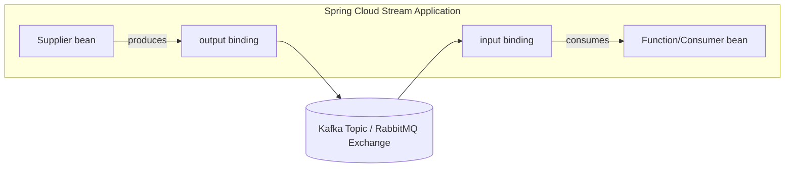
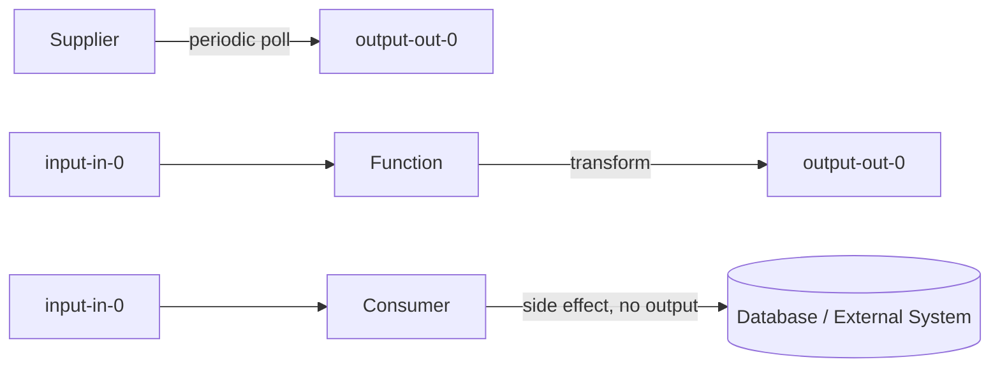
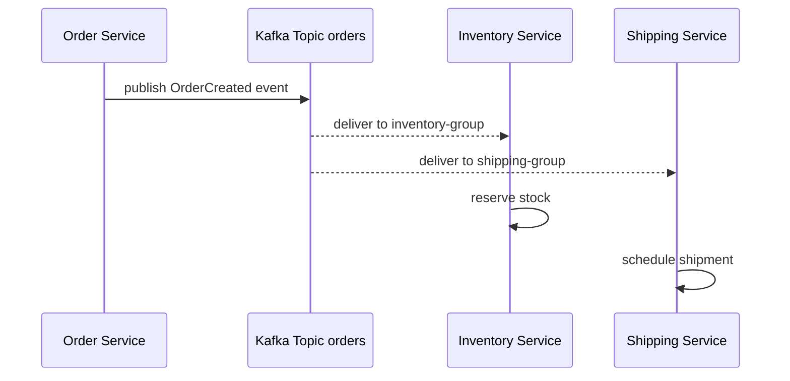
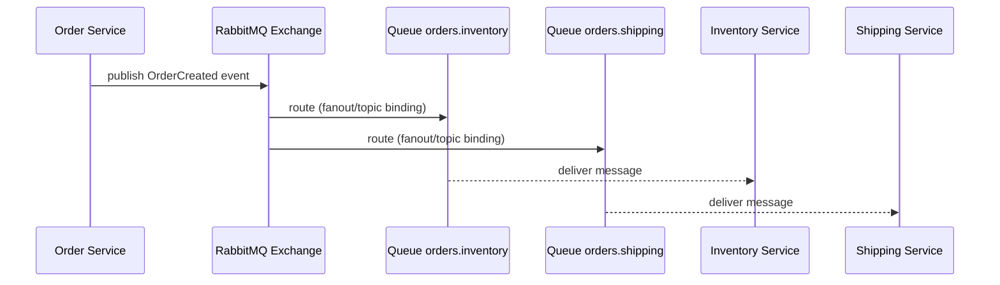
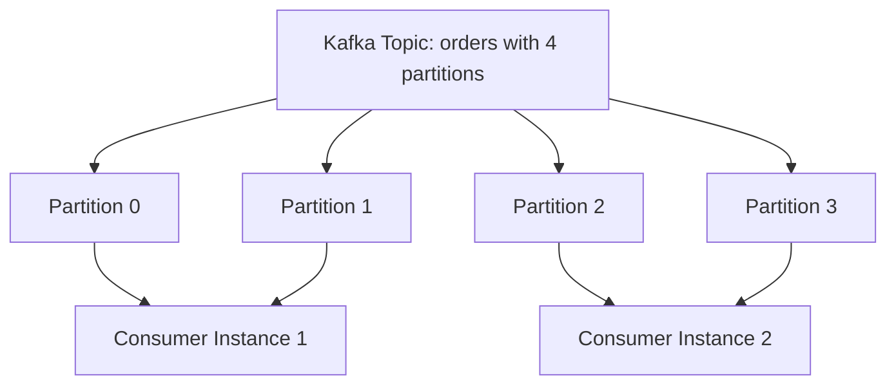
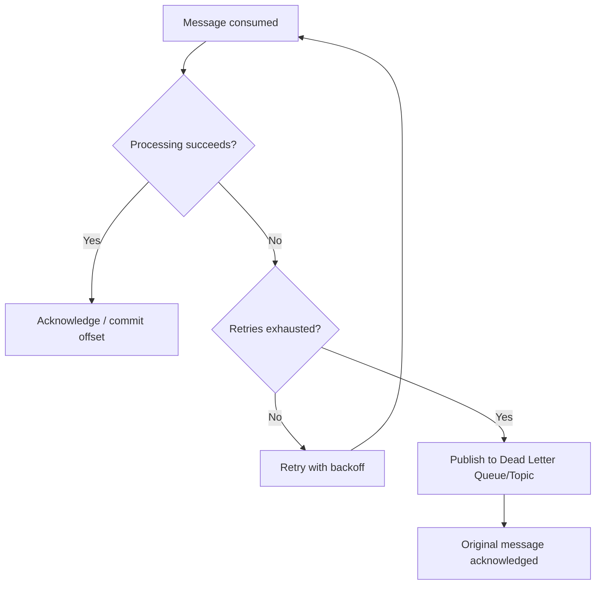

# Spring Cloud Messaging


## Topics

- Introduction to Spring Cloud Stream
- Spring Cloud Stream Binders (Kafka and RabbitMQ)
- Functional Programming Model with Supplier, Function and Consumer
- Configuring Bindings and Destinations
- Event-Driven Microservices with Spring Cloud Stream and Kafka
- Event-Driven Microservices with Spring Cloud Stream and RabbitMQ
- Consumer Groups and Partitioning
- Error Handling and Dead Letter Queues in Spring Cloud Stream


## Detailed Guide

### Introduction to Spring Cloud Stream

Spring Cloud Stream is a framework for building message-driven microservices on top of messaging middleware such as Apache Kafka and RabbitMQ, without requiring application code to depend directly on broker-specific APIs. It provides a thin, consistent abstraction — the "binding" — over the underlying messaging system, so business logic is written purely in terms of standard Java functional interfaces (`Supplier`, `Function`, `Consumer`) and simple POJOs, while the actual wiring to topics/exchanges, partitions, serialization, and consumer groups is handled declaratively through configuration.

At its core, Spring Cloud Stream separates three concerns: **binders** (broker-specific integration modules, e.g. `spring-cloud-stream-binder-kafka` or `spring-cloud-stream-binder-rabbit`), **bindings** (the logical input/output channels your application code interacts with, named `<functionName>-in-0` / `<functionName>-out-0` by convention), and **the application's business logic** (plain functional beans that know nothing about Kafka or RabbitMQ). This separation means the same business logic can, in principle, be repointed from Kafka to RabbitMQ (or vice versa) purely through configuration and a dependency swap, without touching application code.

This design directly addresses a common pain point in message-driven architectures: tightly coupling business logic to a specific broker's client API makes it hard to test in isolation, hard to swap brokers later, and encourages leaking infrastructure concerns (offsets, acknowledgments, connection management) into domain code. Spring Cloud Stream's functional model, introduced as the recommended approach starting with Spring Cloud Stream 3.x, lets you write and unit-test a `Function<Order, ShippingRequest>` with zero messaging imports, then let the framework's auto-configuration bind it to real infrastructure at runtime.

**Real-life scenario:** A retail company initially builds its order-processing pipeline on RabbitMQ, but as event volume grows into the millions of events per day and they need stronger ordering and replay guarantees, they migrate the messaging backbone to Kafka. Because their business logic was written as plain `Function` beans against Spring Cloud Stream's abstraction rather than raw RabbitMQ `Channel`/`AmqpTemplate` calls, the migration is largely a matter of swapping the binder dependency and updating YAML configuration, not rewriting business logic.



### Spring Cloud Stream Binders (Kafka and RabbitMQ)

A **binder** is the pluggable integration layer that connects Spring Cloud Stream's abstract bindings to a concrete messaging system. Spring Cloud Stream ships official binder implementations for Apache Kafka (`spring-cloud-stream-binder-kafka`), Kafka Streams (`spring-cloud-stream-binder-kafka-streams`), and RabbitMQ (`spring-cloud-stream-binder-rabbit`), each translating the generic binding model into broker-specific concepts — topics and partitions for Kafka, exchanges and queues for RabbitMQ.

Adding a binder to the classpath (via its Maven/Gradle dependency) is typically all that's needed for Spring Boot's auto-configuration to activate that binder; if multiple binders are present, you must explicitly specify which binder each binding uses via `spring.cloud.stream.bindings.<binding>.binder`. Each binder also exposes broker-specific extended configuration properties under `spring.cloud.stream.kafka.bindings.*` or `spring.cloud.stream.rabbit.bindings.*` for fine-tuning things like Kafka partition count/replication factor or RabbitMQ exchange type and durability.

Binders also implement broker-appropriate defaults for reliability semantics — the Kafka binder integrates with consumer group offset commits and supports exactly-once-ish processing patterns via transactional producers, while the RabbitMQ binder integrates with AMQP acknowledgments, retry, and its native dead-letter-exchange mechanism. Understanding these binder-specific behaviors is essential once you move past "hello world" examples into production reliability tuning.

```xml
<dependency>
    <groupId>org.springframework.cloud</groupId>
    <artifactId>spring-cloud-stream-binder-kafka</artifactId>
</dependency>
```

```yaml
spring:
  cloud:
    stream:
      bindings:
        processOrder-in-0:
          destination: orders
          binder: kafka
        processOrder-out-0:
          destination: shipping-requests
          binder: kafka
```

**Real-life scenario:** A platform team standardizes on Kafka for high-throughput event streams (clickstream analytics) but keeps RabbitMQ for lower-volume, latency-sensitive command messages (like "cancel order now"); by running both binders side by side in the same Spring Cloud Stream application and assigning each binding to the appropriate binder, they get the right messaging semantics for each use case within a single codebase.

### Functional Programming Model with Supplier/Function/Consumer

Since Spring Cloud Stream 3.x, the recommended (and now dominant) programming model is the **functional model**, where business logic is expressed as standard `java.util.function` beans: a `Supplier<T>` produces outbound messages (a source, typically polled periodically), a `Function<T, R>` consumes an inbound message and produces an outbound one (a processor), and a `Consumer<T>` consumes an inbound message with no output (a sink). Spring Cloud Stream's `spring-cloud-function` integration automatically detects these beans and binds them to input/output destinations based on naming conventions and the `spring.cloud.function.definition` property.

This model replaced the older, now-deprecated **annotation-based model** (`@EnableBinding`, `@StreamListener`, `@Input`/`@Output`), which required significantly more boilerplate — custom binding interfaces, explicit channel declarations, and imperative `@StreamListener`-annotated methods. The functional model is preferred because it's simpler, more testable (a `Function<Order, ShippingRequest>` bean can be unit tested by just calling `apply()` directly with no Spring context or broker needed), and aligns Spring Cloud Stream with the broader `java.util.function` ecosystem used elsewhere in Spring (e.g., Spring Cloud Function, AWS Lambda adapters).

For a single functional bean, Spring Cloud Stream infers the binding names automatically (`<beanName>-in-0`, `<beanName>-out-0`); when multiple functional beans are present, `spring.cloud.function.definition` explicitly lists which ones are active, and composed functions can even be chained together using pipe syntax (e.g., `enrichOrder|validateOrder`).

```java
@Configuration
public class OrderStreamConfig {

    @Bean
    public Function<Order, ShippingRequest> processOrder() {
        return order -> new ShippingRequest(order.getId(), order.getAddress());
    }

    @Bean
    public Consumer<ShippingRequest> logShipment() {
        return request -> log.info("Shipment requested: {}", request);
    }

    @Bean
    public Supplier<HeartbeatEvent> heartbeat() {
        return () -> new HeartbeatEvent(Instant.now());
    }
}
```

```yaml
spring:
  cloud:
    function:
      definition: processOrder;logShipment;heartbeat
```



**Real-life scenario:** A team migrating a legacy `@StreamListener`-based service to modern Spring Cloud Stream rewrites each listener method as a plain `Function` or `Consumer` bean, immediately gaining the ability to write fast unit tests (calling `.apply()`/`.accept()` directly) that previously required spinning up an embedded Kafka broker just to exercise business logic.

### Configuring Bindings and Destinations

Every functional bean is exposed through a named **binding** — `<functionName>-in-0` for the first input argument, `<functionName>-out-0` for the return value (with `-in-1`, `-out-1`, etc. for additional arguments in multi-input/output functions). Configuration under `spring.cloud.stream.bindings.<bindingName>` maps each logical binding to a physical **destination** — a Kafka topic name or a RabbitMQ exchange name — decoupling the Java-level function name from the actual infrastructure resource name, which can differ per environment (e.g., `orders-dev` vs `orders-prod`).

Beyond the destination, binding configuration controls content-type conversion (`content-type: application/json` triggers automatic (de)serialization via Spring's message converters), consumer-specific settings (`group`, `concurrency`, `partitioned`), and producer-specific settings (`partition-key-expression`, `partition-count`). A `group` on a consumer binding is what identifies it as part of a Kafka consumer group (or a RabbitMQ competing-consumer queue) — omitting it results in each application instance getting its own anonymous, non-load-balanced subscription (effectively a fan-out rather than a shared work queue).

Destinations can also be shared across multiple bindings — for instance, two different functions in two different applications can both bind to the same `orders` destination, one producing and one consuming, without either needing to know about the other's existence, which is the essence of how Spring Cloud Stream decouples producers and consumers into independently deployable services.

```yaml
spring:
  cloud:
    stream:
      bindings:
        processOrder-in-0:
          destination: orders
          group: order-processing-group
          content-type: application/json
        processOrder-out-0:
          destination: shipping-requests
          content-type: application/json
          producer:
            partition-key-expression: payload.customerId
            partition-count: 4
```

**Real-life scenario:** A platform runs identical application code across `dev`, `staging`, and `prod` environments but each environment uses differently-named Kafka topics (`orders-dev`, `orders-staging`, `orders`) to avoid cross-environment data leakage; because the destination is externalized to configuration rather than hardcoded in the `Function` bean, the same JAR is deployed unchanged across all three environments with only environment-specific YAML/properties differing.

### Event-Driven Microservices with Spring Cloud Stream and Kafka

Using Kafka as the binder, Spring Cloud Stream builds event-driven microservices around Kafka's core strengths: durable, ordered, partitioned logs that support multiple independent consumer groups replaying the same topic at their own pace. A typical pattern has one service publish domain events (e.g., `OrderCreated`) to a topic via a `Supplier` or the output side of a `Function`, while multiple independent downstream services — each in its own consumer group — subscribe to the same topic to react to that event in their own bounded context (inventory reservation, shipping scheduling, analytics, notifications), without the publisher needing any awareness of its consumers.

This achieves genuine decoupling: new consumers can be added later by simply subscribing to the existing topic with a new consumer group, without any changes to the publishing service, and because Kafka retains messages for a configurable retention period, new consumers can even replay historical events rather than only seeing messages published after they came online. The Kafka binder also integrates with Spring Cloud Stream's partitioning support, so events with the same partition key (e.g., customer ID or order ID) are guaranteed to land in the same partition and be processed in order by the same consumer instance.

```java
@Bean
public Function<OrderCreatedEvent, Void> handleOrderCreated() {
    return event -> {
        inventoryService.reserveStock(event.getOrderId(), event.getItems());
        return null;
    };
}
```

```yaml
spring:
  cloud:
    stream:
      kafka:
        binder:
          brokers: localhost:9092
      bindings:
        handleOrderCreated-in-0:
          destination: orders
          group: inventory-service
          consumer:
            concurrency: 3
```



**Real-life scenario:** An e-commerce platform publishes a single `OrderCreated` event to Kafka, and over time adds a fraud-detection service, a loyalty-points service, and a recommendation-engine service — each simply subscribing to the same topic with its own consumer group — without ever modifying the original order service, demonstrating how Kafka-backed Spring Cloud Stream enables organic growth of an event-driven architecture.

### Event-Driven Microservices with Spring Cloud Stream and RabbitMQ

Using RabbitMQ as the binder, Spring Cloud Stream maps its abstractions onto AMQP concepts: a producer binding publishes to an **exchange**, and each consumer binding (identified by a `group`) causes the binder to declare and bind a dedicated, durable **queue** to that exchange. Unlike Kafka's log-based model where every consumer group independently tracks its own read position over a shared log, RabbitMQ queues hold messages until they are consumed and acknowledged — multiple consumer instances within the same group compete for messages from the same queue (classic point-to-point load balancing), while separate groups each get their own independent queue bound to the same exchange (fan-out to multiple subscribers).

This makes RabbitMQ a natural fit for event-driven microservices that need lower-latency delivery, flexible routing (via topic/direct/fanout exchanges and routing keys), or per-message acknowledgment semantics with fine-grained retry/redelivery control — at the cost of not natively supporting Kafka-style replay of historical messages once they've been consumed and acknowledged. Spring Cloud Stream's RabbitMQ binder also supports request/reply patterns and exposes AMQP-specific producer/consumer properties (routing key expressions, exchange type, queue TTL, prefetch count) via `spring.cloud.stream.rabbit.bindings.*`.

```yaml
spring:
  cloud:
    stream:
      rabbit:
        bindings:
          handleOrderCreated-in-0:
            consumer:
              exchange-type: topic
              binding-routing-key: order.created
      bindings:
        handleOrderCreated-in-0:
          destination: orders-exchange
          group: inventory-service
        handleOrderCreated-out-0:
          destination: shipping-exchange
```



**Real-life scenario:** A ride-hailing platform uses RabbitMQ for driver-dispatch events because it needs sub-second delivery latency and flexible topic-based routing keys (`ride.requested.city.nyc`) to route requests to region-specific dispatcher services, prioritizing low-latency point-to-point delivery over Kafka's replay/retention capabilities which aren't needed for this ephemeral, real-time workload.

| Aspect | Kafka | RabbitMQ |
| --- | --- | --- |
| Model | Durable, partitioned log | Queue-based message broker (AMQP) |
| Message replay | Yes, by resetting consumer offsets within retention | No, once acknowledged and consumed |
| Ordering guarantee | Per-partition ordering | Per-queue ordering (single consumer) |
| Routing flexibility | Simple (topic + partition) | Rich (direct/topic/fanout/headers exchanges, routing keys) |
| Fan-out to many independent consumers | Native via consumer groups on shared log | Requires separate queue per consumer group bound to exchange |
| Best for | High-throughput event streaming, replay, analytics | Low-latency commands, flexible routing, RPC-style messaging |

### Consumer Groups and Partitioning

A **consumer group** identifies a logical set of application instances that jointly and competitively process messages from a destination, so that each message is delivered to exactly one instance within the group (not to every instance). This is what enables horizontal scaling of a stateless consumer: run 3 instances of the same service, all in the same `group`, and Spring Cloud Stream (via the underlying binder) ensures work is spread across them rather than each instance redundantly processing every message. Instances in *different* groups, by contrast, each receive their own independent copy of every message — this is the mechanism that enables the fan-out patterns described earlier.

**Partitioning** works alongside consumer groups to provide ordered, sticky processing: messages are assigned to a partition based on a partition key (via `partitionKeyExpression` or a custom `PartitionKeyExtractorStrategy`), and Spring Cloud Stream guarantees that all messages with the same key always land in the same partition, and that a given partition is only ever consumed by one instance within a consumer group at a time. This is essential when processing order matters — e.g., all events for a given customer ID must be processed in the order they were published, which requires them to always route to the same partition and hence the same consumer instance.

On Kafka, partitioning maps directly onto native Kafka topic partitions and consumer group rebalancing. On RabbitMQ, which has no native partition concept, Spring Cloud Stream simulates partitioning by creating multiple physical queues (one per partition) and using a routing key derived from the partition index to ensure a message with a given key always reaches the same queue.

```yaml
spring:
  cloud:
    stream:
      bindings:
        processOrder-in-0:
          destination: orders
          group: order-processing-group
          consumer:
            partitioned: true
            concurrency: 2
        processOrder-out-0:
          destination: orders
          producer:
            partition-key-expression: payload.customerId
            partition-count: 4
```



**Real-life scenario:** A payments platform must guarantee that all transactions for a given account are processed strictly in order to avoid balance-calculation race conditions. By partitioning the Kafka topic on `accountId` and running multiple consumer instances in the same group, the platform scales horizontally to handle high transaction volume while still guaranteeing that any single account's transactions are always handled sequentially by the same consumer instance.

### Error Handling and Dead Letter Queues in Spring Cloud Stream

When message processing fails, Spring Cloud Stream provides a layered error-handling strategy. At the innermost layer, a binding can configure retry (`consumer.max-attempts`, `back-off-initial-interval`, `back-off-multiplier`) so transient failures are retried locally before being considered a permanent failure. If retries are exhausted (or disabled), the message is routed to an **error channel** (`<destination>.<group>.errors`) that application code can subscribe to for custom handling, or — more commonly in production — automatically republished to a **Dead Letter Queue (DLQ)** so it isn't lost and can be inspected or reprocessed later.

On RabbitMQ, enabling `republish-to-dlq: true` (alongside `auto-bind-dlq: true`) causes the binder to automatically declare a `<queue>.dlq` queue and republish failed messages to it after retries are exhausted, preserving the original message headers plus additional diagnostic headers (`x-exception-message`, `x-exception-stacktrace`) describing why it failed. On Kafka, the binder supports a similar `enableDlq`/`dlqName` mechanism that republishes failed records to a dedicated Kafka DLQ topic, and Spring Cloud Stream can also integrate with Spring Kafka's `DeadLetterPublishingRecoverer` for finer control over retry/DLQ behavior at the listener-container level.

Choosing between relying on automatic DLQ republishing versus writing custom error-channel handling logic is an important design decision: automatic DLQ is simple, requires no code, and is sufficient when failed messages just need to be parked for manual/automated reprocessing later; custom error handling is needed when a failure should trigger an immediate compensating action (e.g., alerting, partial rollback, or routing to a different recovery flow) rather than just being stored for later.

```yaml
spring:
  cloud:
    stream:
      rabbit:
        bindings:
          processOrder-in-0:
            consumer:
              auto-bind-dlq: true
              republish-to-dlq: true
              republish-deliver-mode: PERSISTENT
      bindings:
        processOrder-in-0:
          destination: orders
          group: order-processing-group
          consumer:
            max-attempts: 3
            back-off-initial-interval: 1000
            back-off-multiplier: 2.0
```

```yaml
spring:
  cloud:
    stream:
      kafka:
        bindings:
          processOrder-in-0:
            consumer:
              enable-dlq: true
              dlq-name: orders.DLQ
              dlq-partitions: 1
```

```java
@Bean
public Function<Order, ShippingRequest> processOrder() {
    return order -> {
        if (order.getItems().isEmpty()) {
            throw new IllegalStateException("Order has no items: " + order.getId());
        }
        return new ShippingRequest(order.getId(), order.getAddress());
    };
}

@ServiceActivator(inputChannel = "processOrder-in-0.order-processing-group.errors")
public void handleError(ErrorMessage errorMessage) {
    log.error("Failed to process message, routing handled by DLQ", errorMessage.getPayload());
}
```



| Approach | Advantages | Disadvantages |
| --- | --- | --- |
| Automatic DLQ republish (`republishToDlq` / `enableDlq`) | Zero code, consistent behavior, preserves original message + diagnostic headers | No immediate compensating action; failures only surface when someone inspects the DLQ |
| Custom error-channel handling | Enables immediate alerting, compensation logic, or conditional routing | Requires custom code per binding; risk of inconsistent handling across teams/services |

**Real-life scenario:** An order-processing service occasionally receives malformed order payloads from an upstream system due to a schema mismatch. Rather than losing these messages or blocking the whole consumer group on a poison-pill message, the team enables `auto-bind-dlq`/`enable-dlq` so malformed messages are automatically diverted to a DLQ after 3 retry attempts, allowing the main pipeline to keep flowing while an on-call engineer periodically reviews and reprocesses the DLQ's contents once the upstream schema issue is fixed.

## Interview Questions & Answers

### Core Concepts and Functional Model

**Q: What problem does Spring Cloud Stream solve?**

It lets developers build message-driven microservices using a consistent, broker-agnostic programming model (functional beans: `Supplier`, `Function`, `Consumer`), while the framework handles the actual integration with a specific messaging middleware (Kafka, RabbitMQ) through a pluggable "binder." This avoids tightly coupling business logic to a specific broker's client API and makes messaging code far easier to unit test.

**Q: What are the three core `java.util.function` interfaces used in Spring Cloud Stream's functional model, and what does each represent?**

`Supplier<T>` represents a source that produces outbound messages (e.g., periodically polled). `Function<T, R>` represents a processor that consumes an inbound message and produces a transformed outbound message. `Consumer<T>` represents a sink that consumes an inbound message with no further output, typically performing a side effect like persisting to a database.

**Q: How does Spring Cloud Stream know which binding names to use for a functional bean?**

By convention: for a bean named `processOrder`, the input binding is `processOrder-in-0` and the output binding is `processOrder-out-0` (with additional numeric suffixes for multi-arg functions). When multiple functional beans exist in the same application, `spring.cloud.function.definition` explicitly declares which ones are active bindings.

**Q: What replaced the older `@EnableBinding`/`@StreamListener` annotation-based model, and why?**

The functional programming model (plain `Supplier`/`Function`/`Consumer` beans) replaced it starting with Spring Cloud Stream 3.x, because it requires less boilerplate (no custom binding interfaces or explicit channel declarations) and is significantly easier to unit test — a `Function` bean can be tested by simply calling `.apply()` without any Spring context or embedded broker.

**Q: What is a "binder" in Spring Cloud Stream?**

A binder is the pluggable integration module that connects Spring Cloud Stream's abstract input/output bindings to a specific messaging middleware, translating generic concepts into broker-specific ones (e.g., Kafka topics/partitions or RabbitMQ exchanges/queues). Official binders exist for Kafka, Kafka Streams, and RabbitMQ.

### Binders, Bindings, and Destinations

**Q: What's the difference between a "binding" and a "destination" in Spring Cloud Stream?**

A binding is the logical, application-level input/output channel tied to a functional bean (e.g., `processOrder-in-0`). A destination is the actual physical resource in the broker (a Kafka topic name or RabbitMQ exchange name) that the binding is mapped to via configuration. This indirection lets the same code point at differently-named infrastructure per environment.

**Q: How would you run both a Kafka binder and a RabbitMQ binder in the same application?**

Add both binder dependencies to the classpath, then explicitly specify which binder each binding should use via `spring.cloud.stream.bindings.<bindingName>.binder`, since Spring Cloud Stream can't infer the correct binder automatically when more than one is present.

**Q: What happens if you don't set a `group` on a consumer binding?**

Without a `group`, the binding is treated as an anonymous, non-durable subscription — each application instance gets its own independent view of the destination (effectively fan-out), rather than participating in load-balanced, competing consumption alongside other instances. This means scaling out instances without a group results in duplicate processing rather than shared work.

**Q: Why might you choose Kafka over RabbitMQ (or vice versa) as your Spring Cloud Stream binder?**

Kafka is preferred for high-throughput event streaming, when message replay/reprocessing from history is needed, and when strict per-partition ordering at scale matters (e.g., analytics, event sourcing). RabbitMQ is preferred for lower-latency command-style messaging, flexible routing via exchanges/routing keys, and scenarios needing fine-grained per-message acknowledgment without needing durable replay of already-consumed messages.

### Consumer Groups and Partitioning

**Q: What is the purpose of a consumer group in Spring Cloud Stream?**

It identifies a set of application instances that should share the work of consuming a destination — Spring Cloud Stream (via the binder) ensures each message is delivered to only one instance within the group, enabling horizontal scaling of stateless consumers without duplicate processing.

**Q: How does partitioning interact with consumer groups to guarantee ordering?**

Partitioning assigns messages to a specific partition based on a key (e.g., customer ID), and guarantees all messages with the same key always land in the same partition; within a consumer group, a given partition is only ever consumed by one instance at a time. Together, this ensures all messages for a given key are processed in order by a single, consistent consumer instance, even as the group scales horizontally.

**Q: How does Spring Cloud Stream simulate partitioning on RabbitMQ, which has no native partition concept?**

It creates multiple physical queues — one per partition — and uses a routing key derived from the computed partition index to ensure messages with the same partition key always route to the same queue, effectively emulating Kafka-style sticky partition assignment on top of AMQP.

**Q: What configuration property determines which partition a message is routed to on the producer side?**

`spring.cloud.stream.bindings.<binding>.producer.partition-key-expression` (a SpEL expression evaluated against the outbound message, e.g. `payload.customerId`), combined with `partition-count` specifying how many partitions/queues exist.

### Error Handling and Dead Letter Queues

**Q: What is a Dead Letter Queue (DLQ) and why is it useful in Spring Cloud Stream?**

A DLQ is a separate destination where messages that repeatedly fail processing are routed after retries are exhausted, rather than being silently dropped or endlessly blocking the consumer. It preserves failed messages (often with diagnostic headers explaining the failure) for later manual inspection, reprocessing, or alerting, without stalling the main processing pipeline.

**Q: How do you enable automatic DLQ routing on the RabbitMQ binder?**

By setting `spring.cloud.stream.rabbit.bindings.<binding>.consumer.auto-bind-dlq: true` (to have the binder declare the DLQ infrastructure) together with `republish-to-dlq: true` (to actually republish failed messages there after retries are exhausted).

**Q: How do you enable a Dead Letter Queue with the Kafka binder?**

By setting `spring.cloud.stream.kafka.bindings.<binding>.consumer.enable-dlq: true`, optionally specifying `dlq-name` to control the target topic name; failed records (after local retry attempts are exhausted) are republished to that dedicated Kafka DLQ topic.

**Q: What configuration properties control local retry behavior before a message is considered permanently failed?**

`spring.cloud.stream.bindings.<binding>.consumer.max-attempts` (total attempts), `back-off-initial-interval` (initial delay), and `back-off-multiplier` (how the delay grows between attempts) — these apply local, in-process retries before the message is escalated to the error channel / DLQ.

**Q: When would you prefer custom error-channel handling over automatic DLQ republishing?**

When a failure needs to trigger an immediate compensating action — such as alerting an on-call engineer, rolling back a partially-completed transaction, or routing the message to an alternate recovery flow — rather than simply parking the message for later manual reprocessing, which is all automatic DLQ republishing provides on its own.

**Q: What additional information does RabbitMQ's `republishToDlq` mechanism attach to a dead-lettered message?**

It preserves the original message headers and adds diagnostic headers such as `x-exception-message` and `x-exception-stacktrace`, describing exactly why the message failed processing — useful for triaging DLQ contents without needing to correlate against application logs separately.


## Resources

### Youtube

- [Spring Cloud Stream with RabbitMQ | Message-Driven Microservices](https://www.youtube.com/watch?v=vNFgsHjA504)
- [Spring Cloud Stream with Apache Kafka | Event-Driven Microservices](https://www.youtube.com/watch?v=_gQaygjm_hg)
- [Spring Boot Microservices – Event-Driven Architecture with RabbitMQ | JavaTechie](https://www.youtube.com/watch?v=o4qCdBR4gUM)

### Medium

- [Spring Cloud Stream – Reference Documentation](https://docs.spring.io/spring-cloud-stream/docs/current/reference/html/)
- [Event-Driven Microservices with Spring Cloud Stream and Kafka](https://www.baeldung.com/spring-cloud-stream)
- [Spring Cloud Stream with RabbitMQ](https://medium.com/@ankithahjprakash/spring-cloud-stream-with-rabbitmq-3b2b8b2b8b2b)
