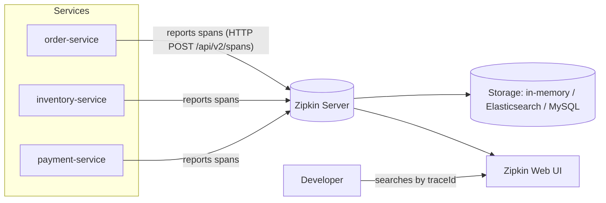
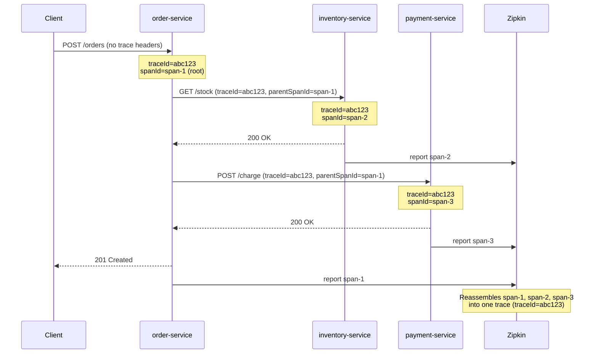
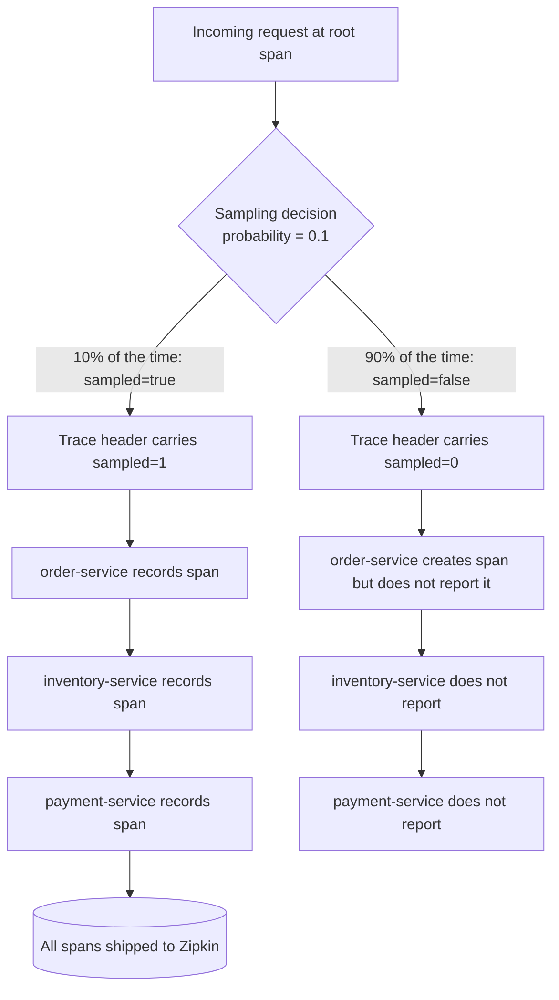
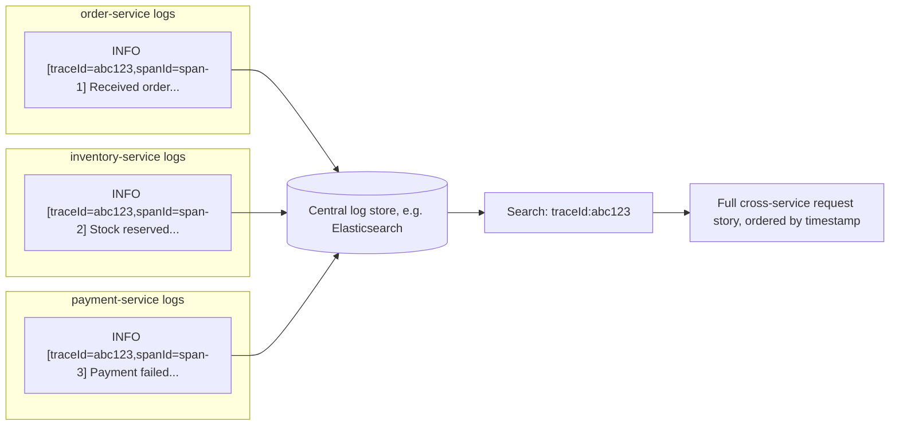
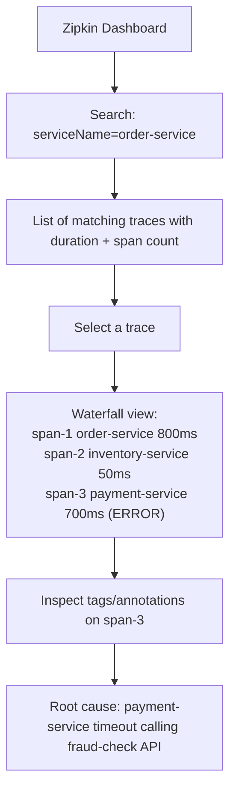

# Distributed Tracing


## Topics

- Need For Distributed Tracing
- Distributed Tracing with Spring Sleuth
- Introduction To Zipkin
- Setting Up Zipkin
- Exploring Zipkin Traces
- What is Micrometer Tracing
- Introduction to Distributed Tracing with Micrometer and Zipkin
- Add Micrometer and Zipkin dependencies
- Set up Micrometer Tracing
- Micrometer Tracing Sampling Probability
- Logging TraceId and SpanId
- Configure Micrometer to work with Feign
- View traces in Zipkin Dashboard


## Detailed Guide

### Need For Distributed Tracing

In a monolithic application, tracing a request's journey is trivial — everything happens inside a single process, and a single log file usually tells the whole story. Once an application is decomposed into microservices, a single user request may fan out across a dozen services, each running in its own process, container, or even data center. When something goes wrong — a slow checkout, a failed payment, a timeout — the question "what actually happened to this request?" becomes very hard to answer by grepping through independent log files scattered across dozens of hosts.

Distributed tracing solves this by assigning a unique identifier (a **trace ID**) to a request the moment it enters the system, and propagating that identifier through every subsequent call — HTTP, messaging, gRPC — so that every service involved in handling the request stamps its logs and telemetry with the same trace ID. Each individual unit of work within a service (or each hop between services) is recorded as a **span**, with its own span ID, start/end timestamps, and metadata (tags). Collecting and visualizing these spans lets engineers reconstruct the full path of a request, see exactly where time was spent, and pinpoint the service or downstream call that failed or was slow.

Without distributed tracing, engineers are forced to manually correlate timestamps and request parameters across independent, unstructured logs — a slow and error-prone process, especially under production pressure. With tracing in place, one trace ID can be pasted into a tracing UI (like Zipkin) to see a waterfall diagram of every hop the request took, how long each one took, and which one threw an exception.

**Real-life scenario:** An e-commerce platform's "place order" flow touches the `order-service`, `inventory-service`, `payment-service`, and `notification-service`. Customers report that checkout "sometimes takes 8 seconds." Without tracing, the on-call engineer must guess which service is slow by manually cross-referencing logs by approximate timestamp across four different log streams. With distributed tracing enabled, the engineer instead searches Zipkin for a slow trace and immediately sees a waterfall chart showing that 6 of the 8 seconds were spent waiting on a downstream call from `payment-service` to a third-party fraud-check API — pinpointing the bottleneck in seconds instead of hours.

### Distributed Tracing with Spring Sleuth

Spring Cloud Sleuth was, for years, the standard way to add distributed tracing to Spring Boot applications. Adding the `spring-cloud-starter-sleuth` dependency automatically instrumented common integration points — `RestTemplate`, `WebClient`, Feign clients, messaging channels (Kafka, RabbitMQ), and the servlet filter chain — so that every incoming and outgoing request was tagged with a trace ID and span ID with zero manual wiring. Sleuth also injected `traceId` and `spanId` into the SLF4J **MDC** (Mapped Diagnostic Context), so ordinary log statements automatically included tracing identifiers without any code changes, and it shipped span data to a tracer backend such as Zipkin.

Under the hood, Sleuth was built on top of the **Brave** tracer library. It handled context propagation across thread boundaries (important for async and reactive code), sampling decisions, and B3 header propagation (`X-B3-TraceId`, `X-B3-SpanId`) between services.

However, **Spring Cloud Sleuth is now legacy and in maintenance mode.** As of Spring Boot 3 and Spring Cloud 2022.0 (Kilburn), the tracing responsibilities that Sleuth used to own were absorbed directly into **Micrometer Tracing**, a first-class part of the core Micrometer project (the same project that powers Spring Boot Actuator metrics). This is one of the most important recent shifts in the Spring ecosystem for interview purposes: new applications should use Micrometer Tracing, not Sleuth.

| Aspect | Spring Cloud Sleuth (legacy) | Micrometer Tracing (current) |
|---|---|---|
| Status | Deprecated / maintenance mode, no new features | Actively developed, standard for Spring Boot 3+ |
| Spring Boot compatibility | Spring Boot 2.x | Spring Boot 3.x |
| Underlying tracer | Brave (bundled directly) | Pluggable bridge: Brave **or** OpenTelemetry |
| Dependency | `spring-cloud-starter-sleuth` | `micrometer-tracing-bridge-brave` / `-otel` + `io.zipkin.reporter2:zipkin-reporter-brave` |
| Integration | Spring Cloud ecosystem specific | Part of core Micrometer, framework-agnostic |
| Log MDC injection | Automatic via Sleuth | Automatic via Micrometer Tracing + Logback/Log4j2 integration |
| Config prefix | `spring.sleuth.*` | `management.tracing.*` |
| Future investment | None — feature frozen | Primary tracing investment across Spring portfolio |

**Real-life scenario:** A team maintaining a Spring Boot 2.7 codebase relies on `spring.sleuth.sampler.probability`. When they migrate to Spring Boot 3, the Sleuth starter no longer exists on the classpath; tracing silently stops working until they realize the configuration must move to `management.tracing.sampling.probability` and the dependency must switch to `micrometer-tracing-bridge-brave`. This migration gotcha is a very common real-world (and interview) trap.

### Introduction To Zipkin

**Zipkin** is an open-source distributed tracing system originally created at Twitter. It has three logical responsibilities: **collecting** spans reported by instrumented applications, **storing** them (in-memory, MySQL, Elasticsearch, or Cassandra), and **displaying** them through a web UI and HTTP API for querying and visualizing traces. Applications don't talk to each other about tracing directly — each service independently reports its spans to Zipkin, and Zipkin reassembles them into a full trace using the shared trace ID.

Zipkin defines a simple, well-known data model: a `Span` has a trace ID, a span ID, an optional parent span ID (to reconstruct the call tree), a name, start/end timestamps, and key-value annotations/tags. Because this model is simple and widely adopted, many tracer implementations (Brave, OpenTelemetry) can report to Zipkin natively, which is why it remains a popular choice even though newer tracing backends exist (Jaeger, Tempo, vendor APM tools).



**Real-life scenario:** A platform team standardizes on Zipkin as the single tracing backend for 40+ microservices written in both Spring Boot and Node.js, because both ecosystems have mature libraries that speak the Zipkin span format, letting them view traces that cross language boundaries in one unified UI.

### Setting Up Zipkin

The fastest way to run Zipkin locally or in a dev environment is via the official Docker image. It starts an in-memory Zipkin server exposing the collector API and web UI on port 9411.

```bash
docker run -d -p 9411:9411 --name zipkin openzipkin/zipkin

# Verify it's up
curl -s http://localhost:9411/health | jq
```

For production use, Zipkin should be configured with a persistent storage backend instead of the default in-memory store, for example Elasticsearch:

```bash
docker run -d -p 9411:9411 \
  -e STORAGE_TYPE=elasticsearch \
  -e ES_HOSTS=http://elasticsearch:9200 \
  --name zipkin \
  openzipkin/zipkin
```

Once the container is running, the UI is available at `http://localhost:9411/zipkin`. Applications simply need to be configured with this URL as their tracing endpoint (covered later in **Set up Micrometer Tracing**) and traces will begin appearing automatically as requests flow through the system.

**Real-life scenario:** A local `docker-compose.yaml` used for development spins up Zipkin alongside the application's own services, so every engineer can inspect traces on `localhost:9411` without needing access to a shared staging tracing backend.

### Exploring Zipkin Traces

Once traces start flowing into Zipkin, the web UI lets you search for them by service name, span name, tags, duration, or time range. Selecting a trace opens a **waterfall view**: a horizontal timeline where each span is drawn as a bar, nested under its parent span, showing exactly how long each hop took relative to the others. This view immediately reveals whether time was spent in the service itself (CPU-bound work) or waiting on a downstream call (network-bound work).

Each span in the detail view exposes its tags (e.g. `http.method`, `http.status_code`, `http.url`), timing annotations, and the service/host that produced it. Zipkin also offers a **dependency graph** view, aggregating many traces over time into a diagram of which services call which, and how often — extremely useful for understanding the real (as opposed to documented) topology of a microservices system, and for spotting unexpected or accidental dependencies.

Filtering is a key practical skill: searching by `minDuration` quickly surfaces the slowest requests in a time window, while filtering by `error` tags surfaces failed traces, both of which are the first steps of most production incident investigations involving tracing data.

**Real-life scenario:** During an incident where `payment-service` is intermittently timing out, an SRE filters Zipkin by service name `payment-service` and `minDuration=5s`, immediately gets a list of the slowest traces from the last 15 minutes, and opens one to see the exact downstream call (a legacy SOAP gateway) responsible for the latency spike.

### What is Micrometer Tracing

**Micrometer Tracing** is a tracing facade added to the core Micrometer project, providing a vendor-neutral API for creating spans, adding tags, and propagating trace context — conceptually mirroring what Micrometer already does for metrics. Instead of coupling application code directly to a specific tracer implementation, Micrometer Tracing sits behind a small abstraction (`Tracer`, `Span`, `ScopedSpan`) and delegates the actual work to a pluggable **bridge**: either `micrometer-tracing-bridge-brave` (using the Brave tracer, the same engine Sleuth used) or `micrometer-tracing-bridge-otel` (using the OpenTelemetry SDK).

This is the direct, actively-maintained replacement for Spring Cloud Sleuth starting with Spring Boot 3. Spring Boot's autoconfiguration wires up Micrometer Tracing automatically as soon as the bridge and a reporter (like the Zipkin reporter) are on the classpath — instrumenting Spring MVC, WebClient, RestTemplate, Feign, and messaging integrations with trace and span propagation, and injecting `traceId`/`spanId` into the logging MDC, all without Sleuth.

Because Micrometer Tracing is bridge-based, the same application code (and the same `Tracer` API calls) can report to Zipkin via Brave today and switch to an OpenTelemetry Collector / Jaeger backend tomorrow by swapping a single dependency — no application code changes required. This vendor neutrality is one of the main design goals and a common interview talking point.

**Real-life scenario:** A company standardizing on OpenTelemetry as an org-wide observability contract can adopt `micrometer-tracing-bridge-otel` in their Spring Boot services and export traces to an OTel Collector feeding Jaeger, while a different business unit still on Brave/Zipkin uses `micrometer-tracing-bridge-brave` — both write identical `Tracer` application code.

### Introduction to Distributed Tracing with Micrometer and Zipkin

Combining Micrometer Tracing with Zipkin gives a complete, production-ready tracing pipeline: Micrometer Tracing (via the Brave bridge) creates and propagates spans throughout each Spring Boot application, and the Zipkin reporter (`zipkin-reporter-brave`) periodically ships finished spans to a Zipkin server, where they are stored and visualized.

The propagation mechanism works through HTTP headers. When Service A calls Service B, the outgoing request carries a `traceparent` (W3C format) or `X-B3-*` headers identifying the trace ID, the current span ID (which becomes the parent span ID for Service B's new span), and the sampling decision. Service B's Micrometer Tracing instrumentation reads these headers, creates a new child span sharing the same trace ID, and processes the request — repeating the pattern for every subsequent hop.



**Real-life scenario:** An engineer debugging a checkout failure searches Zipkin for `traceId=abc123` (copied from an error log line) and sees the full three-span tree above in one screen, immediately identifying that `payment-service`'s span carries an error tag while the others succeeded.

### Add Micrometer and Zipkin dependencies

To enable Micrometer Tracing with Zipkin reporting in a Spring Boot 3 application, three dependencies are typically required: the Actuator (which hosts the tracing autoconfiguration), a Micrometer Tracing bridge, and the Zipkin reporter.

```xml
<!-- Maven (pom.xml) -->
<dependencies>
    <dependency>
        <groupId>org.springframework.boot</groupId>
        <artifactId>spring-boot-starter-actuator</artifactId>
    </dependency>
    <dependency>
        <groupId>io.micrometer</groupId>
        <artifactId>micrometer-tracing-bridge-brave</artifactId>
    </dependency>
    <dependency>
        <groupId>io.zipkin.reporter2</groupId>
        <artifactId>zipkin-reporter-brave</artifactId>
    </dependency>
</dependencies>
```

```groovy
// Gradle (build.gradle)
dependencies {
    implementation 'org.springframework.boot:spring-boot-starter-actuator'
    implementation 'io.micrometer:micrometer-tracing-bridge-brave'
    implementation 'io.zipkin.reporter2:zipkin-reporter-brave'
}
```

If OpenTelemetry is preferred instead of Brave, `micrometer-tracing-bridge-brave` is swapped for `micrometer-tracing-bridge-otel`, and `zipkin-reporter-brave` for `io.opentelemetry:opentelemetry-exporter-zipkin` (OTel can still export in Zipkin's wire format).

**Real-life scenario:** A team following an older tutorial adds only `spring-boot-starter-actuator` and wonders why no traces appear in Zipkin — the missing piece is almost always the tracing bridge and/or the Zipkin reporter dependency, since Actuator alone only provides the tracing *autoconfiguration hook*, not an actual tracer implementation.

### Set up Micrometer Tracing

With the dependencies in place, Micrometer Tracing needs to be told where to send spans and, optionally, tuned via a handful of `management.tracing.*` and `management.zipkin.tracing.*` properties. The most important property is the Zipkin endpoint, which tells the reporter where the Zipkin server's collector API is listening.

```yaml
# application.yml
management:
  tracing:
    enabled: true
    sampling:
      probability: 1.0   # trace 100% of requests (see next topic for production guidance)
  zipkin:
    tracing:
      endpoint: http://localhost:9411/api/v2/spans
spring:
  application:
    name: order-service   # shown as the "local service name" in Zipkin traces
```

```properties
# application.properties equivalent
management.tracing.enabled=true
management.tracing.sampling.probability=1.0
management.zipkin.tracing.endpoint=http://localhost:9411/api/v2/spans
spring.application.name=order-service
```

Once configured, no further code is required for basic tracing — Spring Boot's autoconfiguration instruments incoming servlet requests, outgoing `RestTemplate`/`WebClient` calls, and scheduled/async tasks automatically. `spring.application.name` is important: it becomes the "local service name" attached to every span, which is exactly what lets Zipkin group and label spans by microservice in the dependency graph and search filters.

**Real-life scenario:** After adding these properties to three services sharing the same Zipkin instance but forgetting to set a distinct `spring.application.name` in one of them, all of that service's spans show up in Zipkin labeled `application`, making the dependency graph confusing until the property is corrected.

### Micrometer Tracing Sampling Probability

Tracing every single request in a high-throughput production system is expensive — each recorded span consumes memory, network bandwidth to ship to Zipkin, and storage in the tracing backend. **Sampling** controls what fraction of traces are actually recorded and reported, via `management.tracing.sampling.probability`, a value between `0.0` (trace nothing) and `1.0` (trace everything).

The sampling decision is made once, at the root span (the very first service to handle the request), and that decision is propagated to every downstream service through the trace context headers — this is called **head-based sampling**. It guarantees that a trace is either recorded completely across all services, or not at all; you never end up with a partial trace missing some of its spans because a different sampling decision was made mid-chain.

```yaml
management:
  tracing:
    sampling:
      probability: 0.1   # sample 10% of requests — common production setting
```

| Sampling probability | Trade-off |
|---|---|
| `1.0` (100%) | Full visibility into every request; simplest for debugging low-traffic or dev/staging environments; can overwhelm the tracing backend and add measurable overhead at high production request volumes. |
| `0.1`–`0.25` (10–25%) | Good balance for medium-traffic production services; enough traces to spot patterns and catch rare errors statistically, while keeping storage/network costs manageable. |
| `0.01` or lower (≤1%) | Appropriate for very high-throughput services (thousands of req/s); still captures a statistically meaningful sample, but individual failing requests may not be captured unless combined with error-based/tail sampling. |

Many real systems combine probability-based sampling with rate limiting (a maximum spans/second cap) or move to **tail-based sampling** at a collector level (e.g. always keep traces containing an error, regardless of the initial probability), but that requires an intermediary like an OpenTelemetry Collector rather than plain head-based sampling.



**Real-life scenario:** A team sets `probability: 1.0` in production "just to be safe" and later finds their Zipkin storage cluster (Elasticsearch) growing by hundreds of gigabytes a day and their services' p99 latency degrading measurably; dropping to `0.05` resolves both symptoms while still catching enough traces for effective debugging.

### Logging TraceId and SpanId

One of the most immediately useful side effects of Micrometer Tracing is that it automatically injects the current `traceId` and `spanId` into SLF4J's MDC for every log statement emitted while a span is active. This means ordinary `log.info(...)` calls, without any code changes, gain tracing context — which is enormously valuable once logs are aggregated centrally (e.g. in an ELK stack), because it becomes possible to search all log lines across every microservice for a single `traceId` and reconstruct the full story of a request purely from logs, even without opening Zipkin.

To make these values appear in log output, the log pattern must reference the MDC keys `traceId` and `spanId` explicitly (Spring Boot's default console pattern already includes them when Micrometer Tracing is on the classpath, shown as `[order-service,traceId,spanId]`).

```xml
<!-- logback-spring.xml -->
<configuration>
    <include resource="org/springframework/boot/logging/logback/defaults.xml"/>

    <appender name="CONSOLE" class="ch.qos.logback.core.ConsoleAppender">
        <encoder>
            <pattern>
                %d{yyyy-MM-dd HH:mm:ss.SSS} [%thread] %-5level %logger{36} [traceId=%X{traceId:-},spanId=%X{spanId:-}] - %msg%n
            </pattern>
        </encoder>
    </appender>

    <root level="INFO">
        <appender-ref ref="CONSOLE"/>
    </root>
</configuration>
```

```java
@RestController
@RequiredArgsConstructor
public class OrderController {

    private static final Logger log = LoggerFactory.getLogger(OrderController.class);
    private final Tracer tracer;

    @PostMapping("/orders")
    public ResponseEntity<OrderResponse> placeOrder(@RequestBody OrderRequest request) {
        // traceId/spanId are already in MDC here — no manual code needed for basic logging
        log.info("Received order placement request for customer {}", request.customerId());

        // Programmatic span access, e.g. to add a custom tag
        Span currentSpan = tracer.currentSpan();
        if (currentSpan != null) {
            currentSpan.tag("customer.id", request.customerId());
        }

        OrderResponse response = processOrder(request);
        log.info("Order {} placed successfully", response.orderId());
        return ResponseEntity.ok(response);
    }
}
```



**Real-life scenario:** An SRE searches the centralized ELK log store for `traceId:abc123` (copied from a customer support ticket referencing an error message) and instantly sees log lines from all three services involved in that request, in chronological order, without needing to know in advance which services were even part of the call chain.

### Configure Micrometer to work with Feign

Feign, the declarative HTTP client commonly used for service-to-service calls in Spring Cloud applications, is automatically instrumented by Micrometer Tracing when both `spring-cloud-starter-openfeign` and the tracing bridge are present on the classpath — no manual header propagation code is required. Spring Cloud's Feign autoconfiguration registers a tracing-aware `Client` delegate that wraps each outgoing Feign request, injecting the current trace context (trace ID, parent span ID, sampling flag) as outbound headers before the request is sent, and starting/finishing a client span around the call.

```yaml
# application.yml
spring:
  cloud:
    openfeign:
      client:
        config:
          default:
            connectTimeout: 5000
            readTimeout: 5000
management:
  tracing:
    enabled: true
  zipkin:
    tracing:
      endpoint: http://localhost:9411/api/v2/spans
```

```java
@FeignClient(name = "inventory-service", url = "${services.inventory.url}")
public interface InventoryClient {

    @GetMapping("/api/inventory/{sku}")
    StockResponse checkStock(@PathVariable("sku") String sku);
}

@Service
@RequiredArgsConstructor
public class OrderService {

    private static final Logger log = LoggerFactory.getLogger(OrderService.class);
    private final InventoryClient inventoryClient;

    public StockResponse verifyStock(String sku) {
        log.info("Calling inventory-service to check stock for sku {}", sku);
        // Trace headers (traceId, parent spanId, sampled flag) are added automatically
        // by Micrometer Tracing's Feign instrumentation — no manual propagation needed.
        return inventoryClient.checkStock(sku);
    }
}
```

If a custom `feign.Client` or `RequestInterceptor` is used, care must be taken not to bypass or overwrite the trace headers that the tracing-aware client would otherwise add — a common source of "broken traces" bugs is a custom interceptor stripping unknown headers before the request goes out.

**Real-life scenario:** A team adds a custom Feign `RequestInterceptor` that rebuilds the request headers from scratch for an internal auth token, accidentally dropping the `traceparent`/`X-B3-*` headers in the process; traces then appear "broken" in Zipkin, with each service's spans forming their own disconnected root trace instead of one connected trace — a classic distributed tracing debugging exercise.

### View traces in Zipkin Dashboard

With tracing configured end-to-end, the Zipkin dashboard (`http://localhost:9411/zipkin`) becomes the primary tool for inspecting request flow. The landing page allows searching by service name, span name, duration, and tags; results are listed as a set of traces with their total duration and number of spans, sorted by recency by default.

```bash
# Query the Zipkin HTTP API directly (useful for scripting/automation)
curl -s "http://localhost:9411/api/v2/traces?serviceName=order-service&limit=5" | jq

# Fetch one specific trace by ID
curl -s "http://localhost:9411/api/v2/trace/abc123" | jq
```

Clicking into a trace shows the waterfall view described earlier, along with a **dependency graph** tab (aggregated across all traces) that visualizes which services call which, and how frequently — often revealing undocumented or unexpected dependencies in a system.



**Real-life scenario:** During a postmortem, an engineer exports the dependency graph for the last 24 hours from Zipkin and discovers that `notification-service` is being called synchronously and directly by `payment-service` — a dependency nobody remembered existed — explaining why notification outages had been causing checkout failures.

## Interview Questions & Answers

### Tracing Fundamentals

**Q: What problem does distributed tracing solve that centralized logging alone cannot?**

Centralized logging aggregates log lines but doesn't inherently correlate them across services for a single logical request. Distributed tracing assigns a shared trace ID (and per-hop span IDs) that is propagated across every service boundary a request crosses, letting engineers reconstruct the complete, ordered path and timing of a request across many independently-deployed services — something plain logs can only approximate through manual timestamp correlation.

**Q: What is the difference between a trace and a span?**

A trace represents the entire end-to-end journey of one request across all services, identified by a single trace ID. A span represents one unit of work within that trace — typically one hop, one method call, or one service's handling of the request — identified by its own span ID and, except for the root span, a parent span ID linking it back into the trace's call tree.

**Q: How is a trace ID propagated from one microservice to another?**

The tracing library (Micrometer Tracing via Brave or OpenTelemetry) injects trace context into outgoing request headers — either the W3C `traceparent` header or the older B3 headers (`X-B3-TraceId`, `X-B3-SpanId`, `X-B3-Sampled`). The receiving service's instrumentation reads these headers, joins the existing trace as a new child span instead of starting a brand-new trace, and repeats the propagation for its own downstream calls.

**Q: What is a span tag, and why would you add a custom one?**

A tag is a key-value metadata pair attached to a span (e.g. `http.status_code=500`, `customer.id=12345`). Custom tags let engineers enrich spans with business-relevant context (customer ID, order ID, feature flag value) so that traces can later be filtered or explained in terms meaningful to the domain, not just low-level HTTP details.

### Spring Cloud Sleuth vs Micrometer Tracing

**Q: Why was Spring Cloud Sleuth replaced by Micrometer Tracing?**

Sleuth was tightly coupled to the Spring Cloud release train and to Brave specifically. Micrometer Tracing moved tracing into the core, framework-agnostic Micrometer project (the same one behind Actuator metrics) and made the underlying tracer pluggable (Brave or OpenTelemetry) via bridges. This aligned tracing's architecture with metrics, reduced duplication, and gave teams a vendor-neutral API. As of Spring Boot 3 / Spring Cloud 2022.0, Sleuth is legacy and receives no new features.

**Q: If migrating a Spring Boot 2 application using Sleuth to Spring Boot 3, what needs to change?**

The `spring-cloud-starter-sleuth` dependency must be removed and replaced with a Micrometer Tracing bridge (`micrometer-tracing-bridge-brave` or `-otel`) plus a reporter dependency (e.g. `zipkin-reporter-brave`). Configuration properties must move from the `spring.sleuth.*` namespace to `management.tracing.*` and `management.zipkin.tracing.*` (e.g. `spring.sleuth.sampler.probability` becomes `management.tracing.sampling.probability`).

**Q: Can Micrometer Tracing use a tracer other than Brave?**

Yes — that pluggability is one of its core design goals. Swapping `micrometer-tracing-bridge-brave` for `micrometer-tracing-bridge-otel` switches the underlying engine to the OpenTelemetry SDK, with no application code changes required, since application code only ever talks to Micrometer's own `Tracer`/`Span` abstractions.

**Q: Does Micrometer Tracing still support B3 propagation headers for compatibility with older Sleuth-based services?**

Yes, when using the Brave bridge, B3 propagation is supported and can be configured, which is important during incremental migrations where some services still run older Sleuth-based code while others have moved to Micrometer Tracing — both can be configured to speak the same B3 header format so traces remain connected across the migration boundary.

### Zipkin

**Q: What are Zipkin's three main responsibilities?**

Collecting spans reported by instrumented applications (via its HTTP collector API), storing them (in-memory for development, or a persistent backend like Elasticsearch, MySQL, or Cassandra for production), and providing a UI/API to query, visualize, and analyze traces.

**Q: Why might in-memory storage be unsuitable for a production Zipkin deployment?**

In-memory storage loses all trace data on restart and has a fixed capacity, causing older traces to be evicted as new ones arrive; it's convenient for local development but unsuitable for production where trace data needs to be durable and queryable over longer retention windows, hence the recommendation to back Zipkin with Elasticsearch or another persistent store in real deployments.

**Q: What is the Zipkin dependency graph, and what is it useful for?**

It's a view, aggregated across many traces, showing which services call which and how often. It's useful for validating actual runtime service topology against documented architecture, spotting unexpected or accidental dependencies, and understanding blast radius before making a change to a shared service.

**Q: How does an application actually get its spans into Zipkin?**

The application's tracer (via the Zipkin reporter dependency) periodically batches finished spans and POSTs them to Zipkin's collector endpoint, typically `http://<zipkin-host>:9411/api/v2/spans`, configured in Spring Boot via `management.zipkin.tracing.endpoint`.

### Sampling & Configuration

**Q: What does `management.tracing.sampling.probability` control, and what are the trade-offs of setting it to `1.0`?**

It controls what fraction of traces are recorded and reported to the tracing backend (`1.0` = 100%, `0.0` = none). Setting it to `1.0` guarantees full visibility, but in high-throughput production systems it can meaningfully increase overhead, network egress, and tracing-backend storage costs — most production deployments instead pick a much lower value (often 1–25%) or add tail-based sampling.

**Q: What is head-based sampling, and why does it matter for consistency of traces?**

Head-based sampling means the sampling decision (trace or don't trace) is made once at the root span and propagated downstream via trace context headers, so every service in the chain honors the same decision. This guarantees a trace is either captured in full across all hops, or not captured at all — avoiding partially-recorded, inconsistent traces.

**Q: What Spring Boot property configures the Zipkin endpoint that spans are reported to?**

`management.zipkin.tracing.endpoint`, typically set to `http://<zipkin-host>:9411/api/v2/spans`.

**Q: Why is `spring.application.name` important for tracing, even though it isn't a tracing-specific property?**

It becomes the "local service name" attached to every span the application produces, which Zipkin uses to label spans in the UI, group them by service in searches, and build the dependency graph — without a distinct name, spans from different services can't be told apart in Zipkin.

### Log Correlation & Feign

**Q: How does Micrometer Tracing make application logs more useful for debugging distributed requests?**

It automatically injects the current `traceId` and `spanId` into the SLF4J MDC for the duration of a span, so any log statement emitted during that span picks up those identifiers (if the log pattern references `%X{traceId}`/`%X{spanId}`) without any manual code changes — enabling engineers to search a centralized log aggregator for a single trace ID and see the full cross-service log trail for that request.

**Q: Does using Feign clients require manual trace header propagation code?**

No — when both `spring-cloud-starter-openfeign` and a Micrometer Tracing bridge are on the classpath, Spring Cloud's Feign autoconfiguration registers a tracing-aware HTTP client wrapper that automatically injects trace context headers into every outgoing Feign call, and creates a client span around it, with zero manual wiring required.

**Q: What is a realistic way a custom Feign `RequestInterceptor` can break tracing, and how would you notice it?**

If a custom interceptor rebuilds or overwrites request headers wholesale (e.g. to inject an auth token) instead of adding to the existing header set, it can strip the `traceparent`/`X-B3-*` headers the tracing client added. This would be noticed in Zipkin as traces "breaking" mid-chain — each downstream service starting a brand-new root trace instead of continuing the original one.

**Q: How would you verify, from the command line, that spans for a given service are actually reaching Zipkin?**

By querying Zipkin's HTTP API directly, e.g. `curl "http://localhost:9411/api/v2/traces?serviceName=order-service&limit=5"`, which returns recent traces reported under that service name — useful for confirming end-to-end wiring without relying on the UI, e.g. in a CI smoke test.


## Resources

### Youtube

- [Distributed Tracing with Spring Boot 3, Micrometer and Zipkin | Microservices Observability](https://www.youtube.com/watch?v=XHBdPgr21Yc)
- [Spring Boot Microservices – Distributed Tracing with Zipkin and Sleuth | JavaTechie](https://www.youtube.com/watch?v=gPKJkY2t7d4)
- [Distributed Tracing with OpenTelemetry and Zipkin | Spring Boot 3 Microservices](https://www.youtube.com/watch?v=S9BKTM7FFMU)

### Medium

- [Distributed Tracing in Spring Boot 3 with Micrometer Tracing and Zipkin](https://www.baeldung.com/spring-boot-3-observability)
- [Spring Cloud Sleuth – Distributed Tracing](https://www.baeldung.com/spring-cloud-sleuth-single-application)
- [Microservices Distributed Tracing with Spring Boot and Zipkin](https://medium.com/@bubu.tripathy/distributed-tracing-in-microservices-using-spring-cloud-sleuth-and-zipkin-17e60b813b88)
