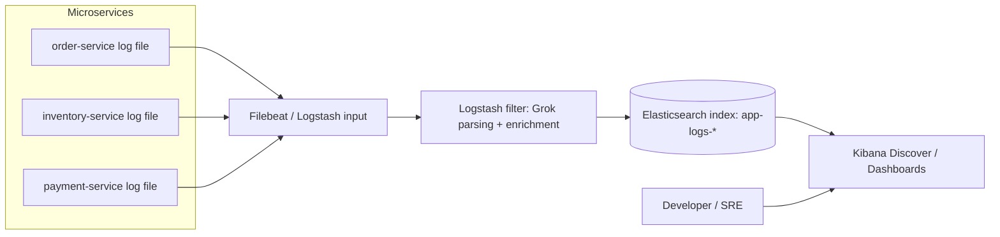
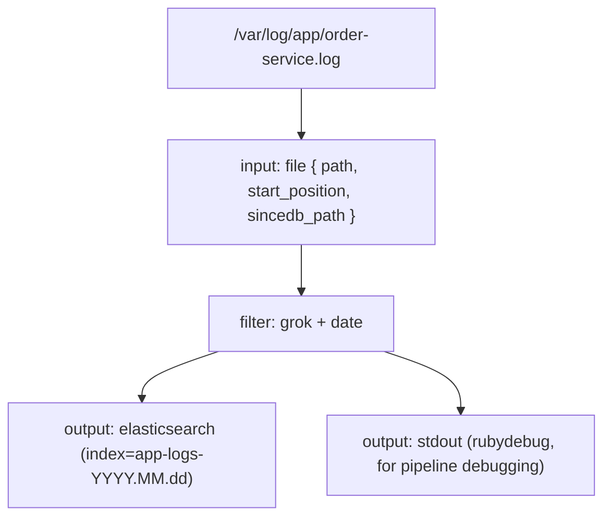
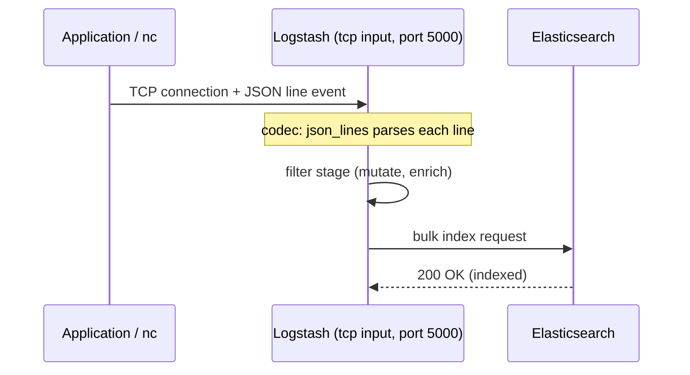
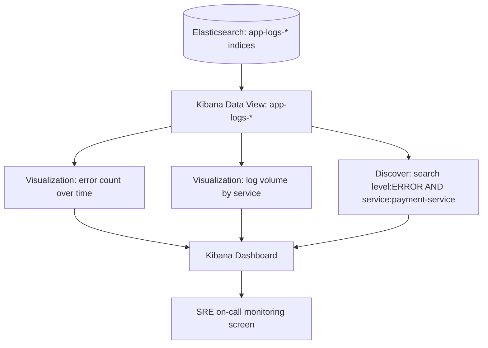
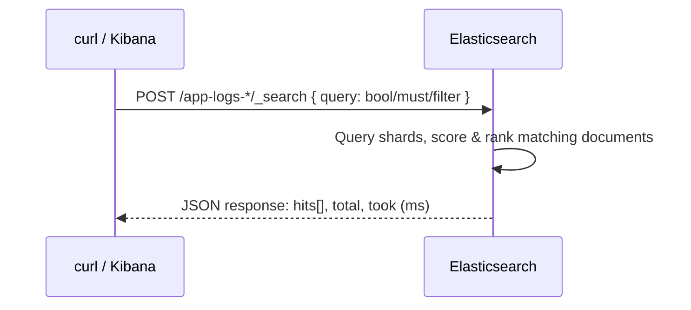

# Log Aggregation With ELK


## Topics

- Configuring ELK Stack
- Setting up And Launching Kibana And Elastic Search
- Exploring Log stash
- Exploring Logstash Filters
- Configuring Logstash And Reading Logs
- Exploring Logstash Grok
- Reading Events Through TCP Socket
- Configure Microservices to Log into a File
- Configure Logstash to Read Log Files
- Visualizing Log Aggregation With Kibana
- Download and Run Elasticsearch with Security Enabled
- Configure Elasticsearch Security in Logstash
- Run Search Query in Elasticsearch

## Detailed Guide

### Configuring ELK Stack

The **ELK Stack** — Elasticsearch, Logstash, and Kibana (with **Beats**, particularly Filebeat, often added as lightweight shippers, making the acronym "Elastic Stack") — is the most widely used open-source solution for centralized log aggregation, search, and visualization. Each component has a distinct responsibility: **Logstash** (or a Beat) collects and parses raw log data from many sources, transforming unstructured text lines into structured JSON events; **Elasticsearch** indexes and stores those structured events, making them searchable at scale via a powerful query DSL; and **Kibana** provides the web UI for searching, filtering, and visualizing that data with dashboards, charts, and saved searches.

Configuring the stack means wiring these three pieces together correctly: Logstash (or Filebeat) needs an **input** (where logs come from — a file, a TCP socket, a message queue), a **filter** chain (how to parse and enrich the raw log lines, most commonly with Grok patterns), and an **output** (where structured events go — normally Elasticsearch). Kibana then needs an **index pattern** pointed at the Elasticsearch indices that Logstash writes into, after which dashboards and visualizations can be built on top of the indexed fields.

In a typical microservices deployment, every service instance writes its logs to a file (or stdout, captured by a container log driver). Logstash instances (or lightweight Filebeat agents on each host, forwarding to a central Logstash) tail these files, parse each line into a structured document (extracting fields like timestamp, log level, service name, trace ID, message), and bulk-index the documents into Elasticsearch under a time-based index naming convention (e.g. `app-logs-2026.08.02`). Engineers then use Kibana's Discover view or dashboards to search and visualize logs from all services in one place, instead of SSH-ing into individual hosts.



**Real-life scenario:** A platform team standardizes log aggregation across 25 microservices by deploying Filebeat as a sidecar in every pod, all shipping to a shared Logstash cluster that enriches and indexes into Elasticsearch, giving every engineer a single Kibana dashboard to search logs across the entire fleet instead of relying on `kubectl logs` per pod.

### Setting up And Launching Kibana And Elastic Search

Elasticsearch and Kibana are typically run as separate services that must be started in the right order: Elasticsearch first (since Kibana depends on it being reachable), followed by Kibana pointed at the Elasticsearch URL. For local development, Docker is the simplest way to get both running quickly.

```bash
# Create a dedicated network so the containers can resolve each other by name
docker network create elastic

# Start Elasticsearch (single-node, security disabled for local dev simplicity)
docker run -d --name elasticsearch --net elastic \
  -p 9200:9200 -p 9300:9300 \
  -e "discovery.type=single-node" \
  -e "xpack.security.enabled=false" \
  -e "ES_JAVA_OPTS=-Xms512m -Xmx512m" \
  docker.elastic.co/elasticsearch/elasticsearch:8.13.4

# Verify it started correctly
curl -s http://localhost:9200

# Start Kibana, pointed at Elasticsearch
docker run -d --name kibana --net elastic \
  -p 5601:5601 \
  -e "ELASTICSEARCH_HOSTS=http://elasticsearch:9200" \
  docker.elastic.co/kibana/kibana:8.13.4
```

Once both containers report healthy, Kibana is reachable at `http://localhost:5601` and will prompt for an Elasticsearch connection (already satisfied by the `ELASTICSEARCH_HOSTS` environment variable above). From here, index patterns can be created once Logstash starts writing documents into Elasticsearch.

**Real-life scenario:** A developer setting up a local reproduction environment for a bug uses this exact two-container Docker setup (security disabled, single node) to get a fully working Elasticsearch + Kibana pair running in under a minute, without needing the full production-grade, security-enabled cluster.

### Exploring Log stash

**Logstash** is a server-side data processing pipeline that ingests data from multiple sources simultaneously, transforms it, and forwards it to one or more destinations ("stashes"), most commonly Elasticsearch. Its configuration is built around exactly three pipeline stages, always in this order: **input** (defines where events come from), **filter** (defines how events are parsed, enriched, or dropped), and **output** (defines where processed events are sent).

Logstash pipelines are defined in a `.conf` file using its own configuration language, and pipelines can chain multiple filters together (e.g. `grok` to parse a log line, then `date` to fix the timestamp field, then `mutate` to rename or drop fields) before the event reaches the output stage. Logstash is written in JRuby and runs on the JVM, so it benefits from being co-located with adequate memory (it can be memory-hungry when processing large filter chains at high throughput), which is why many architectures put a lightweight Beat (Filebeat) directly on each application host to do the initial log shipping, forwarding to a smaller number of centralized Logstash instances that do the heavier parsing.

```bash
# Run Logstash via Docker, mounting a custom pipeline config
docker run -d --name logstash \
  --net elastic \
  -v $(pwd)/logstash.conf:/usr/share/logstash/pipeline/logstash.conf \
  docker.elastic.co/logstash/logstash:8.13.4
```

**Real-life scenario:** A team initially points Filebeat directly at Elasticsearch for simplicity, but later introduces a Logstash tier once they need to parse multi-line stack traces and enrich events with a lookup table (mapping internal service IDs to human-readable names) — logic that's a natural fit for Logstash's filter stage but awkward to do in Filebeat alone.

### Exploring Logstash Filters

The **filter** stage is where Logstash does its real work: transforming semi-structured or unstructured text into well-defined fields. The most commonly used filter plugins are `grok` (pattern-based text parsing, covered in depth in the next topic), `date` (parsing a timestamp string into the event's `@timestamp` field, replacing the time Logstash received the event with the time the log line was actually generated), `mutate` (renaming, removing, converting the type of, or lowercasing/uppercasing fields), `json` (parsing a field that already contains a JSON string into structured sub-fields), and `geoip` (enriching an IP address field with geographic location data).

Filters run in the order they are declared and can be conditionally applied using `if`/`else` blocks based on tags or field values — for example, applying a different Grok pattern depending on which application produced the log line (distinguished by a `type` or `service` field set at the input stage).

```yaml
filter {
  if [fields][service] == "order-service" {
    grok {
      match => { "message" => "%{TIMESTAMP_ISO8601:log_timestamp} \[%{DATA:thread}\] %{LOGLEVEL:level} %{DATA:logger} \[traceId=%{DATA:traceId},spanId=%{DATA:spanId}\] - %{GREEDYDATA:log_message}" }
    }
    date {
      match => [ "log_timestamp", "yyyy-MM-dd HH:mm:ss.SSS" ]
      target => "@timestamp"
    }
    mutate {
      remove_field => [ "log_timestamp" ]
      convert => { "level" => "string" }
    }
  }
}
```

**Real-life scenario:** After enabling the `date` filter to use the log line's own embedded timestamp instead of Logstash's ingestion time, a team notices that logs delayed by a slow network link (or replayed from an old file during an incident investigation) are now correctly ordered by *when they actually happened* in Kibana, rather than by when Logstash happened to process them.

### Configuring Logstash And Reading Logs

A complete Logstash pipeline configuration file has three top-level blocks. A minimal but realistic example reading application logs from a file and writing to Elasticsearch looks like this:

```yaml
# logstash.conf
input {
  file {
    path => "/var/log/app/*.log"
    start_position => "beginning"
    sincedb_path => "/dev/null"   # dev-only: always reread from the start
  }
}

filter {
  grok {
    match => { "message" => "%{TIMESTAMP_ISO8601:log_timestamp} \[%{DATA:thread}\] %{LOGLEVEL:level} %{DATA:logger} \[traceId=%{DATA:traceId},spanId=%{DATA:spanId}\] - %{GREEDYDATA:log_message}" }
  }
  date {
    match => [ "log_timestamp", "yyyy-MM-dd HH:mm:ss.SSS" ]
    target => "@timestamp"
  }
}

output {
  elasticsearch {
    hosts => ["http://elasticsearch:9200"]
    index => "app-logs-%{+YYYY.MM.dd}"
  }
  stdout { codec => rubydebug }   # useful for debugging the pipeline itself
}
```

The `sincedb_path` setting controls where Logstash's `file` input tracks its read offset for each monitored file, so that restarting Logstash doesn't reprocess the entire file from scratch (setting it to `/dev/null`, as above, is a common development trick to force full re-reads, but should never be used in production). The `stdout { codec => rubydebug }` output is a very common debugging technique — running it alongside the real Elasticsearch output prints every parsed event to the console in a readable format, making it easy to verify the Grok pattern is extracting fields correctly before trusting the pipeline in production.



**Real-life scenario:** During initial pipeline development, an engineer temporarily disables the Elasticsearch output and relies solely on `stdout { codec => rubydebug }` to iterate quickly on a tricky Grok pattern for a legacy application's inconsistent log format, only re-enabling the Elasticsearch output once every field extracts cleanly.

### Exploring Logstash Grok

**Grok** is Logstash's pattern-matching filter for turning unstructured text (like a typical application log line) into named fields, using a library of predefined patterns (`%{TIMESTAMP_ISO8601}`, `%{LOGLEVEL}`, `%{IP}`, `%{WORD}`, `%{GREEDYDATA}`, etc.) built on top of regular expressions. A Grok pattern is written as `%{PATTERN:field_name}`, where `PATTERN` is a named regex and `field_name` is the key the extracted value will be stored under in the resulting structured event.

Grok is powerful but has a well-known weakness: complex patterns with many named captures can become slow and hard to maintain, especially with greedy patterns like `%{GREEDYDATA}` combined with backtracking-heavy constructs — a poorly written Grok pattern can become a performance bottleneck or even catastrophically slow ("Grok pattern that never returns") on certain malformed input. The [Grok Debugger](https://grokdebugger.com) tool (and Kibana's own Grok Debugger under Dev Tools) is commonly used to iteratively build and test patterns against sample log lines before deploying them.

```yaml
filter {
  grok {
    match => {
      "message" => "%{TIMESTAMP_ISO8601:log_timestamp}\s+\[%{DATA:thread}\]\s+%{LOGLEVEL:level}\s+%{DATA:logger}\s+\[traceId=%{DATA:traceId},spanId=%{DATA:spanId}\]\s+-\s+%{GREEDYDATA:log_message}"
    }
    # Multiple patterns can be tried in order until one matches (useful for mixed log formats)
    break_on_match => true
  }
}
```

| Approach | Pros | Cons |
|---|---|---|
| Grok parsing of plain-text logs | Works with existing log formats without changing application code; flexible; huge library of built-in patterns | Regex-based and can be slow/fragile; breaks silently if log format changes; harder to maintain complex patterns |
| Structured JSON logging at the source (e.g. Logback JSON encoder) | Fast and reliable parsing (Logstash `json` filter, no regex); resilient to field additions; less pipeline maintenance | Requires changing application logging configuration; JSON logs are less human-readable when read directly on disk |

**Real-life scenario:** A team migrates their highest-volume service from a plain-text log format parsed with an increasingly complex, slow Grok pattern to structured JSON logging (using Logback's `logstash-logback-encoder`), replacing the fragile `grok` filter with a trivial `json` filter and immediately cutting Logstash CPU usage on that pipeline significantly.

### Reading Events Through TCP Socket

Besides tailing files, Logstash can ingest events directly over the network using the `tcp` input plugin, which opens a TCP port and treats each incoming line (or a configured codec's framing) as one event. This is useful for applications that push logs directly over the network (e.g. via a `SocketAppender` or a custom log shipper) rather than writing to a local file, and it's also a very convenient way to manually test a Logstash filter chain during development.

```yaml
# logstash.conf
input {
  tcp {
    port => 5000
    codec => json_lines   # each line is a complete JSON document
  }
}

filter {
  # events already structured via json_lines; minimal extra filtering needed
  mutate {
    add_field => { "ingested_via" => "tcp-socket" }
  }
}

output {
  elasticsearch {
    hosts => ["http://elasticsearch:9200"]
    index => "app-logs-tcp-%{+YYYY.MM.dd}"
  }
}
```

```bash
# Manually send a test event to the Logstash TCP input using netcat
echo '{"level":"INFO","service":"order-service","message":"Order 4821 created","traceId":"abc123"}' | nc localhost 5000

# Send several lines from a file, one event per line
nc localhost 5000 < sample-events.jsonl
```



**Real-life scenario:** During a live incident, an engineer needs to inject a handful of synthetic log events to verify that a newly deployed Logstash filter chain correctly tags events with a `severity` field, and does so quickly with `echo '{...}' | nc localhost 5000` rather than waiting for a real application to produce matching log lines.

### Configure Microservices to Log into a File

Before Logstash (or Filebeat) can ingest application logs, the application itself must reliably write logs to a file (or stdout, in containerized deployments where the container runtime captures stdout to a log file automatically). For Spring Boot applications, this is normally configured through Logback (the default logging framework), specifying a `FileAppender` (or `RollingFileAppender` for log rotation) alongside the console appender.

```xml
<!-- logback-spring.xml -->
<configuration>
    <include resource="org/springframework/boot/logging/logback/defaults.xml"/>

    <property name="LOG_FILE" value="/var/log/app/order-service.log"/>

    <appender name="FILE" class="ch.qos.logback.core.rolling.RollingFileAppender">
        <file>${LOG_FILE}</file>
        <rollingPolicy class="ch.qos.logback.core.rolling.TimeBasedRollingPolicy">
            <fileNamePattern>${LOG_FILE}.%d{yyyy-MM-dd}.%i.gz</fileNamePattern>
            <maxFileSize>100MB</maxFileSize>
            <maxHistory>14</maxHistory>
        </rollingPolicy>
        <encoder>
            <pattern>%d{yyyy-MM-dd HH:mm:ss.SSS} [%thread] %-5level %logger{36} [traceId=%X{traceId:-},spanId=%X{spanId:-}] - %msg%n</pattern>
        </encoder>
    </appender>

    <root level="INFO">
        <appender-ref ref="FILE"/>
        <appender-ref ref="CONSOLE"/>
    </root>
</configuration>
```

Rolling the file by size and time (as above) prevents any single log file from growing unbounded and gives Logstash's `file` input predictable file names to watch. In Kubernetes deployments, it's more common to log to stdout only and let the container runtime + a node-level Filebeat DaemonSet handle collection, since writing to an in-container file complicates volume management; the choice between "log to file, Logstash reads it" and "log to stdout, Filebeat/Fluentd reads container logs" is a common real-world architecture decision.

**Real-life scenario:** A team running on Kubernetes initially configures `RollingFileAppender` writing inside each pod's ephemeral filesystem, then loses all logs whenever a pod is rescheduled; they switch to logging to stdout only, letting a Filebeat DaemonSet collect container log files from the node's Docker/containerd log directory instead, decoupling log retention from pod lifecycle.

### Configure Logstash to Read Log Files

Once application log files exist on disk (or are mounted into the Logstash container/host), Logstash's `file` input plugin needs to be pointed at them, including handling multi-line events (like Java stack traces, which span many physical lines but represent a single logical log event).

```yaml
# logstash.conf
input {
  file {
    path => "/var/log/app/order-service.log"
    start_position => "beginning"
    sincedb_path => "/usr/share/logstash/data/sincedb-order-service"

    codec => multiline {
      # A new event starts only on a line beginning with a timestamp;
      # anything else (like a stack trace continuation) is appended to the previous event.
      pattern => "^%{TIMESTAMP_ISO8601}"
      negate => true
      what => "previous"
    }
  }
}

filter {
  grok {
    match => { "message" => "%{TIMESTAMP_ISO8601:log_timestamp} \[%{DATA:thread}\] %{LOGLEVEL:level} %{DATA:logger} \[traceId=%{DATA:traceId},spanId=%{DATA:spanId}\] - %{GREEDYDATA:log_message}" }
  }
}

output {
  elasticsearch {
    hosts => ["http://elasticsearch:9200"]
    index => "app-logs-%{+YYYY.MM.dd}"
  }
}
```

The `sincedb_path` file is what allows Logstash to resume reading exactly where it left off after a restart, tracking a byte offset per monitored file — without it (or with it pointed at `/dev/null`), Logstash would either miss new lines appended between restarts or reprocess entire files, both of which cause real production data-quality problems if not configured deliberately.

**Real-life scenario:** Without the `multiline` codec configured, a team's Kibana dashboard shows a Java exception stack trace as dozens of separate, out-of-order "log events" — one per line of the stack trace — cluttering search results; adding the multiline codec collapses each exception back into a single coherent event matching what actually happened in the application.

### Visualizing Log Aggregation With Kibana

Once Elasticsearch holds indexed log documents, Kibana is used to explore and visualize them. The first step is always creating a **data view** (formerly called an "index pattern") that tells Kibana which Elasticsearch indices to query — typically a wildcard like `app-logs-*` so that new daily indices are automatically included without reconfiguring anything.

The **Discover** view is the primary tool for ad-hoc log search: a search bar (supporting Kibana Query Language, KQL) lets engineers filter by any indexed field — `level: ERROR`, `service: "payment-service"`, `traceId: "abc123"` — combined with a time range picker, showing matching log documents in a scrollable, expandable list. Beyond ad-hoc search, Kibana's **Visualize** and **Dashboard** features let teams build persistent charts (error count over time, top 10 services by log volume, a pie chart of log levels) and combine them into a single dashboard for at-a-glance system health monitoring, often the "second screen" SREs keep open during on-call rotations.



**Real-life scenario:** An SRE team builds a Kibana dashboard combining a time-series chart of `ERROR`-level log counts per service with a saved search filtered to `level: ERROR AND NOT message: "expected timeout"`, giving them an at-a-glance early warning signal for new production issues that they check first thing during every on-call handoff.

### Download and Run Elasticsearch with Security Enabled

Production Elasticsearch clusters should always run with **security enabled** (`xpack.security.enabled=true`), which activates authentication (username/password, API keys, or SSO), role-based access control, and TLS encryption for transport and HTTP traffic — all of which are disabled by default in quick local dev setups (as shown earlier with `xpack.security.enabled=false`) purely for convenience.

```bash
# Run a security-enabled single-node Elasticsearch (recent Elastic Stack versions
# enable security by default, but shown explicitly here for clarity)
docker run -d --name elasticsearch --net elastic \
  -p 9200:9200 -p 9300:9300 \
  -e "discovery.type=single-node" \
  -e "xpack.security.enabled=true" \
  -e "ELASTIC_PASSWORD=ChangeMe123!" \
  -e "ES_JAVA_OPTS=-Xms512m -Xmx512m" \
  docker.elastic.co/elasticsearch/elasticsearch:8.13.4

# Wait for startup, then authenticate against the secured API
curl -s -u elastic:ChangeMe123! https://localhost:9200 --cacert http_ca.crt
```

With security enabled, every client — Kibana, Logstash, curl, application code — must present valid credentials (or a certificate) to talk to Elasticsearch. Recent Elastic Stack versions (8.x) enable security by default and auto-generate a CA certificate and the `elastic` superuser password on first startup, printing them to the container logs, which must then be securely stored and distributed to Kibana/Logstash configuration.

| Configuration | Advantages | Disadvantages |
|---|---|---|
| Security disabled (`xpack.security.enabled=false`) | Zero-friction local development; no certificates or credentials to manage; faster to get started | No authentication or encryption at all; anyone with network access can read/write/delete any data; unacceptable for production or any environment with sensitive data |
| Security enabled (`xpack.security.enabled=true`) | Authentication, role-based authorization, and TLS encryption in transit; required for compliance and any production deployment | Additional setup complexity (certificates, credentials must be distributed to every client); slight performance overhead from TLS; misconfiguration can lock out legitimate clients |

**Real-life scenario:** A company's initial proof-of-concept Elasticsearch cluster is deployed with security disabled "temporarily" for a demo, then accidentally left reachable from the internet with no authentication — a well-known real-world class of data breach — reinforcing why security-enabled configuration should be the default even for early-stage internal tooling.

### Configure Elasticsearch Security in Logstash

Once Elasticsearch requires authentication, every Logstash output block writing to it must supply valid credentials, and the Elasticsearch output plugin must be configured to trust Elasticsearch's TLS certificate.

```yaml
# logstash.conf
output {
  elasticsearch {
    hosts => ["https://elasticsearch:9200"]
    user => "logstash_writer"
    password => "${LOGSTASH_ES_PASSWORD}"   # sourced from Logstash keystore / env var
    ssl_enabled => true
    ssl_certificate_authorities => ["/usr/share/logstash/config/certs/http_ca.crt"]
    index => "app-logs-%{+YYYY.MM.dd}"
  }
}
```

Rather than hardcoding the password in the pipeline file (a plaintext credential checked into config), production deployments store secrets in the **Logstash keystore** (`bin/logstash-keystore add LOGSTASH_ES_PASSWORD`) and reference them with the `${LOGSTASH_ES_PASSWORD}` syntax shown above, which Logstash resolves at startup without the secret ever appearing in the pipeline file itself. It's also best practice to create a dedicated, least-privilege Elasticsearch role (e.g. `logstash_writer`, permitted only to create/write indices matching `app-logs-*`) rather than using the `elastic` superuser account from Logstash.

**Real-life scenario:** A security review flags that a Logstash pipeline is authenticating to Elasticsearch using the `elastic` superuser account with its password committed in plaintext to a config repository; remediation involves creating a scoped `logstash_writer` role limited to the relevant index pattern and moving the password into the Logstash keystore.

### Run Search Query in Elasticsearch

Elasticsearch exposes a rich **Query DSL** over its REST API for searching indexed documents. The `_search` endpoint accepts a JSON body describing the query (full-text match, term filters, ranges, boolean combinations) and returns matching documents ranked by relevance score (or filtered with no scoring, for exact filters).

```bash
# Simple full-text search for an error message across all app-logs indices
curl -s -X GET "http://localhost:9200/app-logs-*/_search" \
  -H "Content-Type: application/json" \
  -d '{
    "query": {
      "match": { "log_message": "payment declined" }
    },
    "size": 20,
    "sort": [ { "@timestamp": "desc" } ]
  }'

# Combine an exact filter (traceId) with a range filter (last hour) using bool/must
curl -s -X GET "http://localhost:9200/app-logs-*/_search" \
  -H "Content-Type: application/json" \
  -d '{
    "query": {
      "bool": {
        "must": [
          { "term": { "traceId.keyword": "abc123" } }
        ],
        "filter": [
          { "range": { "@timestamp": { "gte": "now-1h" } } }
        ]
      }
    }
  }'
```

The `match` query performs analyzed, full-text search (tokenizing and scoring), while `term` performs an exact, non-analyzed match — a very common Elasticsearch gotcha is using `term` against a text field expecting an exact string match, when the field was analyzed at index time and no longer exists in its original exact form; this is why fields like `traceId` and `service` are usually mapped as `keyword` (or queried via the automatically-generated `.keyword` sub-field) specifically to support exact-match filtering and aggregations.



**Real-life scenario:** An engineer investigating a spike in failed payments runs a `bool` query combining a `term` filter on `level.keyword: "ERROR"`, a `match` on `log_message` for "declined", and a time range filter for the last hour, getting a precise, ranked list of the exact log documents relevant to the incident directly from Elasticsearch — the same query Kibana's Discover view builds automatically behind its search bar.

## Interview Questions & Answers

### ELK Stack Components

**Q: What are the three core components of the ELK stack, and what does each one do?**

Elasticsearch stores and indexes structured log documents and provides a search/query engine over them; Logstash (or a lightweight Beat) collects raw logs from various sources and transforms them into structured events via an input/filter/output pipeline; Kibana provides the web UI for searching, filtering, and visualizing the data stored in Elasticsearch through dashboards and saved searches.

**Q: What is the difference between Logstash and Filebeat, and when would you use one over the other?**

Filebeat is a lightweight, low-resource log shipper designed to run on every application host (or as a Kubernetes DaemonSet) and simply forward log lines onward, with minimal parsing capability. Logstash is a heavier, JVM-based processing pipeline capable of complex parsing (Grok, multiline handling, enrichment, conditional routing). A common production pattern uses Filebeat on each host to ship raw logs cheaply, forwarding to a smaller, centralized tier of Logstash instances that do the CPU-intensive parsing and enrichment.

**Q: Why is ELK/Elastic Stack useful in a microservices architecture specifically?**

Microservices split what used to be one application's logs across many independently deployed processes and hosts. Centralizing all of those logs into one searchable store (Elasticsearch), tagged with metadata like service name and (when combined with distributed tracing) trace ID, lets engineers search and correlate logs across the entire system from one place, instead of manually inspecting logs host-by-host or container-by-container.

**Q: What is an Elasticsearch index, and how are log indices typically named?**

An index is Elasticsearch's logical grouping of documents, roughly analogous to a database table. Log data is typically indexed into time-based indices (e.g. `app-logs-2026.08.02`), one per day, using an index naming pattern with a date suffix — this makes it easy to apply retention policies (deleting old daily indices) and keeps individual indices from growing unbounded.

### Logstash Filters & Grok

**Q: What are the three stages of a Logstash pipeline, and can any be omitted?**

Input, filter, and output. Input and output are mandatory (a pipeline needs somewhere to read from and write to); filter is technically optional (a pipeline can pass events through unmodified) but is where nearly all the useful parsing and enrichment work happens in practice.

**Q: What does a Grok pattern like `%{TIMESTAMP_ISO8601:log_timestamp}` actually do?**

`TIMESTAMP_ISO8601` is a named, predefined regular expression bundled with Logstash that matches ISO-8601 formatted timestamps; the `:log_timestamp` part tells Grok to capture whatever that pattern matches and store it in a new field called `log_timestamp` on the resulting structured event.

**Q: What is a practical downside of relying heavily on Grok for parsing, and how can it be mitigated?**

Complex Grok patterns (especially ones using greedy captures like `%{GREEDYDATA}` combined with many alternations) can be slow and are prone to silently breaking if the underlying log format changes even slightly. It can be mitigated by moving to structured logging at the source (e.g. JSON logs via a Logback JSON encoder) and replacing the `grok` filter with the much simpler, faster `json` filter.

**Q: Why would you use a `date` filter in a Logstash pipeline?**

By default, Elasticsearch documents get an `@timestamp` value equal to when Logstash processed the event, not when the log line was actually generated. The `date` filter parses a timestamp already present in the log line (e.g. captured by Grok into a `log_timestamp` field) and overwrites `@timestamp` with that value, so events are correctly ordered by when they actually happened, which matters especially for delayed or replayed log ingestion.

**Q: What problem does the `multiline` codec solve?**

Some log events (most notably Java stack traces) span multiple physical lines but represent one logical event. Without a multiline codec, each line would be ingested as a separate, disconnected event. The `multiline` codec uses a pattern (e.g. "a new event only starts on a line beginning with a timestamp") to merge continuation lines back into the single event they belong to.

### TCP Input & File-Based Ingestion

**Q: How can Logstash ingest logs without reading them from a file?**

Via the `tcp` input plugin (or `udp`, `http`, and various message-queue inputs like Kafka), which opens a network listener and treats incoming data (e.g. one JSON document per line, using the `json_lines` codec) as events, without needing an intermediate log file at all.

**Q: What is `sincedb_path` used for in the Logstash `file` input, and what happens if it's misconfigured?**

It tracks the read offset (per monitored file) so Logstash can resume exactly where it left off after a restart, instead of either missing newly appended lines or reprocessing a file's entire contents. Pointing it at `/dev/null` (a common development trick) forces Logstash to reread the whole file from the beginning every restart — fine for development, but would cause massive duplicate ingestion in production.

**Q: What is a quick way to manually test a Logstash pipeline's TCP input without writing a full test application?**

Piping a manually crafted JSON line into `nc` (netcat) pointed at the configured TCP port, e.g. `echo '{"level":"INFO","message":"test"}' | nc localhost 5000`, lets you send a synthetic event straight into the pipeline to verify filters and outputs behave as expected.

**Q: Why might an application log to stdout rather than to a file, and how does that affect log aggregation architecture?**

In containerized (especially Kubernetes) deployments, writing to stdout lets the container runtime handle log file management on the node, decoupling log persistence from the container/pod's own (often ephemeral) filesystem. A node-level Filebeat DaemonSet then reads the container runtime's log files directly, rather than Logstash needing to read a file from inside each individual container.

### Elasticsearch Security & Queries

**Q: What does enabling `xpack.security.enabled` actually add to an Elasticsearch cluster?**

Authentication (requiring valid credentials or certificates for every request), role-based access control (limiting which indices/operations a given user or service account can perform), and TLS encryption for both HTTP and inter-node transport traffic — none of which exist by default when security is disabled.

**Q: How should a Logstash pipeline authenticate to a security-enabled Elasticsearch cluster without hardcoding a plaintext password in the config file?**

By storing the credential in the Logstash keystore (via `bin/logstash-keystore add`) and referencing it in the pipeline config with `${VARIABLE_NAME}` syntax, which Logstash resolves securely at startup, rather than writing the password directly into the `.conf` file.

**Q: What is the difference between a `match` query and a `term` query in Elasticsearch, and why does it matter?**

`match` performs full-text, analyzed search — tokenizing the query and the field's indexed content and scoring by relevance — appropriate for free-text fields like a log message. `term` performs an exact, non-analyzed match against the field's raw indexed value, appropriate for fields like `traceId` or `service` that must match exactly; using `term` against an analyzed text field (rather than its `keyword` sub-field) is a very common source of "my exact-match query returns nothing" bugs.

**Q: How would you find all log events for a specific trace ID within the last hour using Elasticsearch's Query DSL?**

With a `bool` query combining a `term` filter on the `traceId.keyword` field for the exact trace ID and a `range` filter on `@timestamp` with `gte: "now-1h"`, submitted to the relevant index's `_search` endpoint — exactly the kind of query Kibana's Discover view constructs automatically from its search bar and time picker.


## Resources

