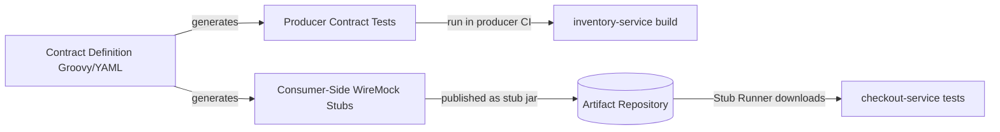
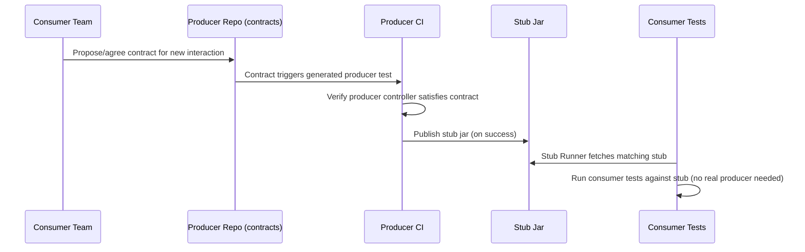
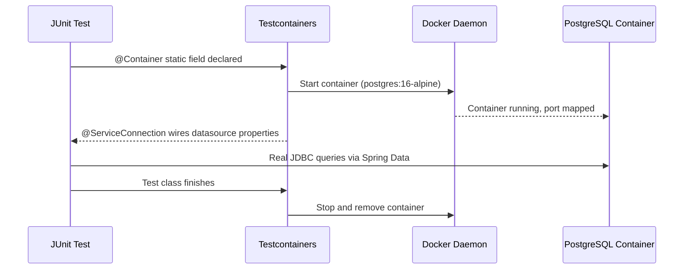

# Testing


## Topics

- Introduction to Spring Cloud Contract
- Consumer-Driven Contract Testing
- Writing Contract Definitions (Groovy/YAML)
- Stub Runner for Consumer-Side Tests
- Testing Microservices with WireMock and MockMvc
- Integration Testing Microservices with Testcontainers

## Detailed Guide

### Introduction to Spring Cloud Contract

Spring Cloud Contract is a framework for consumer-driven contract testing that lets a service provider (producer) and its consumers verify their API compatibility without either side needing to stand up the other's full application during tests. A "contract" is a formal, machine-readable definition of a single request/response interaction — written in Groovy DSL or YAML — that describes what a consumer expects from a producer's endpoint.

From each contract, Spring Cloud Contract generates two artifacts: on the producer side, it generates JUnit test classes that verify the actual controller/service implementation satisfies every contract (failing the build if the real behavior diverges); on the consumer side, it generates WireMock stub mappings packaged as a "stub jar" that consumers can pull in and run against locally, standing in for the real producer without any network dependency on it. This closes the gap between fast-but-unrealistic unit tests (with hand-written mocks that silently drift from reality) and slow-but-realistic full end-to-end tests.

**Real-life scenario:** `inventory-service` (producer) and `checkout-service` (consumer) integrate via a `GET /api/inventory/{sku}` endpoint; instead of `checkout-service`'s tests hand-rolling a mock response that might silently go stale, both teams rely on a shared contract — `inventory-service`'s CI fails if it breaks the contract, and `checkout-service` tests against a stub generated from the very same contract.



### Consumer-Driven Contract Testing

In consumer-driven contract testing, the *consumer's* expectations drive what gets tested and verified on the producer side, rather than the producer unilaterally deciding what its API looks like and hoping consumers cope. In Spring Cloud Contract's flow, contracts conventionally live in the producer's codebase (in `src/test/resources/contracts`), but they express what consumers actually rely on — so any planned producer change that would break a contract is caught by the producer's own build, before it ever reaches a shared environment.

This approach avoids two common failure modes: producers unknowingly breaking consumers with a "safe-looking" refactor, and integration issues only being discovered in a shared staging environment (or worse, production) long after the responsible commit was merged. Because each contract is small and focused on one interaction, contract tests run in seconds as part of the normal build, unlike full end-to-end tests that require multiple live services.



| Testing Style | Speed | Realism | Failure Feedback Location |
|---|---|---|---|
| Hand-written mocks | Fast | Low — can silently drift from real API | Consumer only, late (production) |
| Consumer-driven contract tests | Fast | High — verified against real producer code | Producer build (before merge) |
| Full end-to-end tests | Slow | Highest | Shared environment, often late |

**Real-life scenario:** When `inventory-service`'s team renames a JSON field from `stockCount` to `availableQuantity`, their own contract test suite fails immediately in CI because the existing contract still expects `stockCount`, forcing a conversation with the consumer team before the breaking change ships.

### Writing Contract Definitions (Groovy/YAML)

Contracts can be written in Spring Cloud Contract's Groovy DSL or in plain YAML, and both compile down to the same internal contract model. A contract specifies a `request` (HTTP method, URL/path, optional body, headers) and the expected `response` (status code, body, headers), often using matchers (like `anyNonBlankString()`, regex patterns, or fixed values) so the contract can validate structure/type without over-constraining exact values that might legitimately vary (like timestamps or generated IDs).

Groovy DSL contracts are more expressive (supporting programmatic matchers and helper methods), while YAML contracts are simpler to read for teams less familiar with Groovy and fit naturally into a YAML-heavy Spring ecosystem. Both live under `src/test/resources/contracts` in the producer project, typically organized into subfolders per API area, and the Spring Cloud Contract Maven/Gradle plugin discovers and processes every contract file during the build.

```groovy
// src/test/resources/contracts/inventory/shouldReturnStockForSku.groovy
Contract.make {
    request {
        method GET()
        url '/api/inventory/ABC123'
    }
    response {
        status 200
        headers {
            contentType(applicationJson())
        }
        body([
            sku: 'ABC123',
            availableQuantity: 42
        ])
    }
}
```

```yaml
# src/test/resources/contracts/inventory/shouldReturnStockForSku.yml
request:
  method: GET
  url: /api/inventory/ABC123
response:
  status: 200
  headers:
    Content-Type: application/json
  body:
    sku: ABC123
    availableQuantity: 42
```

**Real-life scenario:** A team writing a contract for a `POST /api/orders` endpoint uses a regex matcher for the generated `orderId` field (since its exact value can't be predicted) while asserting fixed values for fields like `status: "CREATED"`, keeping the contract meaningful without being needlessly brittle.

### Stub Runner for Consumer-Side Tests

Stub Runner is the Spring Cloud Contract component that consumers use to obtain and run the WireMock stubs generated from a producer's contracts, without pulling in or starting the actual producer application. Given a coordinate like `groupId:artifactId:version:stubs`, Stub Runner downloads the stub jar from a Maven/Gradle repository (or resolves it from a local `.m2` during development), starts an embedded WireMock server pre-loaded with the stub mappings, and exposes it on a random or configured port that the consumer's test can point at instead of a real network dependency.

This lets consumer test suites run fully offline and deterministically — no shared test environment, no flaky network calls to a real `inventory-service` instance, and no risk of the "real" service being down or in an inconsistent state during a test run. `@AutoConfigureStubRunner` is the typical annotation used in a Spring Boot test class to wire this in declaratively.

```java
@SpringBootTest
@AutoConfigureStubRunner(
    ids = "com.example:inventory-service:+:stubs:8090",
    stubsMode = StubRunnerProperties.StubsMode.LOCAL
)
class CheckoutServiceContractIT {

    @Autowired
    private InventoryClient inventoryClient;

    @Test
    void shouldFetchStockFromInventoryStub() {
        InventoryResponse response = inventoryClient.getStock("ABC123");
        assertThat(response.getAvailableQuantity()).isEqualTo(42);
    }
}
```

```bash
# Running Stub Runner as a standalone server (e.g., for manual/exploratory testing)
java -jar stub-runner-boot.jar \
  --stubrunner.ids=com.example:inventory-service:+:stubs:8090 \
  --stubrunner.repositoryRoot=https://repo.example.com/artifactory/libs-release
```

**Real-life scenario:** `checkout-service`'s CI pipeline runs its full contract test suite against `inventory-service`'s latest published stub jar on every build, catching integration drift within minutes, without needing `inventory-service`, its database, or any shared staging environment to be running.

### Testing Microservices with WireMock and MockMvc

WireMock is a general-purpose HTTP mocking library that lets tests stub out an external HTTP dependency by defining request-matching rules and canned responses, independent of Spring Cloud Contract. It's commonly combined with `MockMvc` (Spring's in-container-free way of testing `@Controller`/`@RestController` classes) to write focused integration tests: `MockMvc` exercises the real Spring MVC dispatching, argument resolution, and serialization logic for the service under test, while WireMock stands in for any downstream HTTP service that test needs to call.

This combination is especially useful when a team doesn't (yet) have Spring Cloud Contract set up with a producer, or needs to simulate specific edge cases — timeouts, 500 errors, malformed JSON — that would be awkward to coordinate as a formal shared contract. The trade-off is that hand-written WireMock stubs can drift from the real producer's actual behavior over time, since nothing enforces that the stub matches the producer's real contract.

```java
@SpringBootTest
@AutoConfigureMockMvc
@AutoConfigureWireMock(port = 0)
class OrderControllerWireMockTest {

    @Autowired
    private MockMvc mockMvc;

    @Test
    void shouldCreateOrderWhenInventoryAvailable() throws Exception {
        stubFor(get(urlEqualTo("/api/inventory/ABC123"))
            .willReturn(aResponse()
                .withStatus(200)
                .withHeader("Content-Type", "application/json")
                .withBody("{\"sku\":\"ABC123\",\"availableQuantity\":42}")));

        mockMvc.perform(post("/api/orders")
                .contentType(MediaType.APPLICATION_JSON)
                .content("{\"sku\":\"ABC123\",\"quantity\":1}"))
            .andExpect(status().isCreated());
    }
}
```

| Approach | Coupled to Real Producer? | Setup Effort | Best For |
|---|---|---|---|
| Hand-written WireMock stubs | No — can drift silently | Low | Simulating edge cases, error scenarios, early-stage projects |
| Spring Cloud Contract stubs (Stub Runner) | Yes — generated from real contracts | Moderate (requires contract authoring) | Ongoing consumer-producer compatibility guarantees |
| Testcontainers (real dependency) | Fully — actual service/database | Higher (needs image, slower startup) | Verifying true integration behavior, e.g., SQL dialects |

**Real-life scenario:** A team wants to verify `order-service` correctly returns a `503` and retries when `inventory-service` times out; WireMock can easily simulate a fixed delay or connection reset for that specific test case, which would be awkward to reliably reproduce with a live dependency.

### Integration Testing Microservices with Testcontainers

Testcontainers is a Java library that spins up real, disposable Docker containers (databases, message brokers, even other microservices) for the duration of a test, then tears them down automatically afterward. Unlike WireMock or Spring Cloud Contract stubs — which simulate a dependency's HTTP behavior — Testcontainers runs the *actual* dependency (e.g., a real PostgreSQL or Kafka instance), catching classes of bugs that mocking can never catch: SQL dialect quirks, actual transaction/locking behavior, real serialization formats, or subtle differences between an H2 in-memory database and production PostgreSQL.

Spring Boot 3.1+ has first-class support via `@ServiceConnection` and `@Testcontainers`/`@Container` (JUnit 5 extension), which automatically wires datasource/broker connection properties from the running container into the Spring context — no manual `@DynamicPropertySource` boilerplate needed for common cases. This makes integration tests that are both realistic and fast enough to run routinely in CI, at the cost of needing a Docker daemon available in the test environment.

```java
@SpringBootTest
@Testcontainers
class OrderRepositoryIntegrationTest {

    @Container
    @ServiceConnection
    static PostgreSQLContainer<?> postgres = new PostgreSQLContainer<>("postgres:16-alpine");

    @Autowired
    private OrderRepository orderRepository;

    @Test
    void shouldPersistAndRetrieveOrder() {
        Order saved = orderRepository.save(new Order("ABC123", 1));
        assertThat(orderRepository.findById(saved.getId())).isPresent();
    }
}
```

```yaml
# build.gradle / pom.xml dependency (test scope)
# org.springframework.boot:spring-boot-testcontainers
# org.testcontainers:postgresql
# org.testcontainers:junit-jupiter
```



**Real-life scenario:** A subtle bug where a repository query relies on PostgreSQL-specific `ON CONFLICT` upsert syntax passes against an H2 in-memory database in tests but fails in production; switching that test to Testcontainers with a real `postgres` image catches the incompatibility before it ever reaches production.

## Interview Questions & Answers

### Contracts and Consumer-Driven Testing

**Q: What problem does Spring Cloud Contract solve that hand-written mocks don't?**

Hand-written mocks can silently drift from a producer's real behavior over time since nothing enforces they stay in sync. Spring Cloud Contract generates both the producer-side verification tests and the consumer-side stubs from the same contract, so any divergence fails the producer's build immediately.

**Q: What are the two artifacts generated from a single Spring Cloud Contract definition?**

Producer-side generated JUnit test classes that verify the real controller/service satisfies the contract, and a consumer-side "stub jar" containing WireMock stub mappings that consumers can run against without the real producer.

**Q: What does "consumer-driven" mean in consumer-driven contract testing?**

It means the contracts express what consumers actually rely on, and the producer's own build is responsible for verifying it hasn't broken any of those expectations — shifting the responsibility (and the fast feedback) to the producer side rather than discovering breakage later on the consumer or in a shared environment.

**Q: In what format can Spring Cloud Contract contracts be written?**

Either Groovy DSL (more expressive, supports programmatic matchers) or plain YAML (simpler, doesn't require Groovy familiarity). Both compile to the same internal contract model and produce identical generated tests/stubs.

**Q: Why would a contract use a matcher like a regex instead of asserting an exact value?**

Some response fields (like generated IDs or timestamps) are inherently non-deterministic between test runs, so asserting an exact value would make the contract unnecessarily brittle. Matchers validate structure/format/type without over-constraining values that legitimately vary.

### Stub Runner and WireMock

**Q: What does Stub Runner do, and why is it useful for consumer tests?**

It downloads a producer's published stub jar (by Maven/Gradle coordinates) and starts an embedded WireMock server pre-loaded with those stub mappings, letting consumer tests run fully offline and deterministically without needing the real producer application running anywhere.

**Q: What Spring Boot test annotation is commonly used to enable Stub Runner in a test class?**

`@AutoConfigureStubRunner`, typically combined with `@SpringBootTest`, specifying the stub coordinates (`groupId:artifactId:version:classifier:port`) and stub resolution mode (e.g., `LOCAL` for local Maven repo, `REMOTE` for a remote artifact repository).

**Q: How does testing with WireMock directly differ from testing with Spring Cloud Contract-generated stubs?**

Hand-written WireMock stubs are defined manually by the consumer team and can drift from the producer's real API over time since nothing enforces they match. Spring Cloud Contract stubs are generated from contracts verified against the producer's actual implementation, so they can't silently diverge without failing the producer's build.

**Q: Why might a team still choose hand-written WireMock stubs over Spring Cloud Contract stubs for some tests?**

To simulate specific edge cases — timeouts, malformed responses, 500 errors, slow responses — that would be awkward or unnecessary to formalize as a shared contract, especially for negative-path/error-handling tests that aren't really about the "happy path" contract between two teams.

**Q: What is the role of `MockMvc` in a Spring Boot integration test that also uses WireMock?**

`MockMvc` exercises the real Spring MVC dispatcher servlet behavior (routing, argument resolution, validation, serialization) for the controller under test without starting a full HTTP server, while WireMock simultaneously stands in for any downstream HTTP dependency that controller calls.

### Testcontainers and Test Strategy

**Q: What class of bugs can Testcontainers catch that WireMock or hand-written mocks cannot?**

Bugs caused by differences between a simulated dependency and the real one — SQL dialect incompatibilities, actual transaction/locking semantics, real message broker serialization formats — since Testcontainers runs the actual dependency (e.g., real PostgreSQL) in a disposable Docker container rather than simulating its API surface.

**Q: What does the `@ServiceConnection` annotation do in a Spring Boot Testcontainers setup?**

It automatically wires the running container's connection details (JDBC URL, credentials, broker addresses, etc.) into the Spring application context as the relevant datasource/connection properties, removing the need for manual `@DynamicPropertySource` boilerplate for common container types.

**Q: What is a practical trade-off of using Testcontainers compared to WireMock or in-memory databases like H2?**

Testcontainers requires a Docker daemon available wherever tests run (including CI runners) and containers take longer to start than an in-memory fake, so tests are slower and have an extra infrastructure dependency — but they trade that cost for much higher fidelity to production behavior.

**Q: When would you choose Testcontainers over Spring Cloud Contract's Stub Runner for testing a dependency?**

Testcontainers is the right choice when the dependency is a data store, message broker, or other non-HTTP-contract-shaped system where the goal is verifying real interaction semantics (like actual SQL behavior). Stub Runner is the right choice when the dependency is another microservice whose HTTP contract needs to be verified for compatibility, without running the real service.


## Resources

### Youtube

- [Testing Microservices with Spring Boot and Spring Cloud Contract | Consumer-Driven Contracts](https://www.youtube.com/watch?v=MD09g7BIwjE)
- [Spring Boot Microservices Testing with WireMock and MockMvc | JavaTechie](https://www.youtube.com/watch?v=3IxSFKKjzwA)
- [Contract Testing with Spring Cloud Contract | Microservices](https://www.youtube.com/watch?v=sAAklvxmPmk)

### Medium

- [Spring Cloud Contract – Consumer-Driven Contracts](https://www.baeldung.com/spring-cloud-contract)
- [Testing Microservices with Spring Boot – Integration, Contract and End-to-End Tests](https://medium.com/@bubu.tripathy/testing-microservices-with-spring-boot-e3ee49a1b3b5)
- [A Guide to Spring Cloud Contract](https://www.baeldung.com/spring-cloud-contract)
