# Database Management System (DBMS)

## Database Fundamentals

### What is a DBMS?

A Database Management System (DBMS) is software that provides a systematic way to create, store, retrieve, update, and manage data. It sits between applications and the physical data, offering abstraction, concurrency control, integrity enforcement, and security, so applications don't need to manage raw files directly. Popular examples include MySQL, PostgreSQL, Oracle, SQL Server, and MongoDB.

- **Advantages**: data abstraction, reduced redundancy, concurrent access control, enforced integrity/security, backup and recovery support.
- **Disadvantages**: cost of licensing/hardware, complexity to administer, performance overhead compared to raw file access.

### Types of Databases (Relational vs NoSQL)

Relational databases (RDBMS) organize data into tables with fixed schemas and relationships enforced via keys, using SQL for querying (e.g., PostgreSQL, MySQL). NoSQL databases store data in flexible formats — documents, key-value pairs, wide-column, or graphs — and are designed for horizontal scalability and schema flexibility (e.g., MongoDB, Cassandra, Redis, Neo4j).

| Aspect | Relational (SQL) | NoSQL |
|---|---|---|
| Schema | Fixed, predefined | Dynamic/flexible |
| Scaling | Vertical (mostly) | Horizontal |
| Consistency | Strong (ACID) | Often eventual (BASE) |
| Query language | SQL | Varies (API/JSON queries) |
| Best fit | Structured, relational data | Unstructured/semi-structured, high-volume data |

### Database Architecture (1-tier, 2-tier, 3-tier)

Database architecture describes how the database, application logic, and presentation layer are distributed across systems. A 1-tier architecture runs the DB and application on the same machine (e.g., local development databases). A 2-tier (client-server) architecture has the client directly communicating with the database server. A 3-tier architecture introduces a middle application/business-logic layer between the client and the database, improving scalability, security, and separation of concerns.

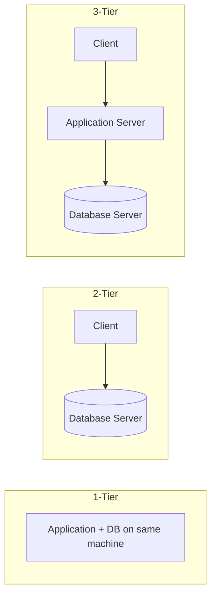

### Database Components

A DBMS is made up of several core components: the **query processor** (parses and optimizes SQL), the **storage manager** (handles data files, indexes, and buffers), the **transaction manager** (ensures ACID properties), and the **catalog/metadata manager** (stores schema information). Together these components translate high-level SQL statements into efficient, safe, and durable operations on disk.

### Database Users and Roles

Different classes of users interact with a DBMS: **database administrators (DBAs)** manage security, backups, and performance; **application developers** write programs that access the database; **end users** interact through applications without knowing SQL; and **sophisticated users** (analysts) write ad-hoc queries directly. Roles and privileges (e.g., `GRANT`, `REVOKE`) control what each user or group can do.

```sql
-- Create a role and grant read-only access
CREATE ROLE analyst;
GRANT SELECT ON employees TO analyst;
GRANT analyst TO 'jane';
```

### Database Instances vs Databases

A **database** is the persistent collection of data and its schema stored on disk. An **instance** is the snapshot of that data at a given moment in time, or (in systems like Oracle) the set of running processes and memory structures (background processes, buffer cache, SGA) that manage access to the database files. In simpler terms: the database is the data; the instance is the running software plus in-memory state operating on that data.

### Data Models (Relational Model)

A data model defines how data is logically structured, related, and manipulated. The **relational model**, proposed by E.F. Codd, represents data as a collection of relations (tables), each a set of tuples (rows) with attributes (columns), with relationships expressed through shared key values rather than physical pointers. Its mathematical foundation (relational algebra/calculus) makes it predictable and well-suited to declarative querying via SQL. Other data models include hierarchical, network, object-oriented, and document models.

### OLTP vs OLAP

**OLTP (Online Transaction Processing)** systems handle high volumes of short, frequent read/write transactions — e.g., order entry, banking transfers — and prioritize consistency and speed of individual operations. **OLAP (Online Analytical Processing)** systems handle complex, read-heavy analytical queries over large historical datasets — e.g., data warehouses used for reporting and business intelligence — prioritizing throughput on aggregations over many rows.

| Aspect | OLTP | OLAP |
|---|---|---|
| Purpose | Day-to-day transactions | Analysis & reporting |
| Query type | Simple, short | Complex, long-running |
| Data volume per query | Small | Large (aggregations) |
| Schema | Normalized | Denormalized/star schema |
| Example | E-commerce checkout | Sales trend dashboard |

### Interview Questions

- **Q: What is the difference between a file system and a DBMS?**
  A: A file system stores raw, unstructured data with no built-in concurrency control, integrity enforcement, or query capability; a DBMS adds structure, ACID transactions, security, and a query language on top of the data.
- **Q: When would you choose NoSQL over a relational database?**
  A: When the schema is highly variable, horizontal scalability across many nodes is required, or the workload favors availability/partition tolerance over strict consistency (e.g., large-scale document or event storage).
- **Q: Why is a 3-tier architecture generally preferred for enterprise applications?**
  A: It decouples presentation, business logic, and data layers, enabling independent scaling, better security (DB not directly exposed to clients), and easier maintenance.
- **Q: What is the role of the query processor in a DBMS?**
  A: It parses SQL, validates it against the schema, generates an optimized execution plan, and hands it off to the storage engine for execution.
- **Q: Explain the difference between a database instance and a database.**
  A: The database is the persisted data and schema on disk; the instance is the running memory structures and background processes that manage access to that data at a point in time.
- **Q: Why does the relational model use keys instead of physical pointers to represent relationships?**
  A: Keys provide logical, value-based relationships that are independent of physical storage, making the model resilient to reorganization and easier to reason about declaratively.
- **Q: Give a real-world example each of OLTP and OLAP.**
  A: OLTP: an ATM withdrawal updating an account balance instantly. OLAP: a quarterly sales report aggregating millions of transactions across regions.
- **Q: Can a single database serve both OLTP and OLAP workloads well?**
  A: Generally no — their access patterns conflict (many small writes vs. large scans), so organizations typically replicate OLTP data into a separate OLAP/warehouse system (via ETL) for analytics.

## Relational Database Concepts

### Tables

A table (or relation) is the fundamental storage structure in a relational database — a two-dimensional grid of rows and columns representing a set of entities of the same type (e.g., `employees`, `orders`). Each table has a fixed set of named columns with defined data types, and each row represents a single record conforming to that structure.

```sql
CREATE TABLE employees (
    id INT PRIMARY KEY,
    name VARCHAR(100) NOT NULL,
    department_id INT
);
```

### Rows (Tuples)

A row, also called a tuple, is a single record in a table — an ordered set of attribute values, one per column. In relational theory, a table is technically a *set* of tuples, meaning duplicate rows shouldn't exist without a distinguishing key, although real-world RDBMS implementations allow duplicates unless constraints prevent it.

### Columns (Attributes)

A column (or attribute) defines a named property shared by every row in a table, along with its data type and constraints (e.g., `NOT NULL`, `UNIQUE`). Columns give tables their structure and determine what kind of data can be stored — for example, `name VARCHAR(100)` or `hire_date DATE`.

### Domains

A domain is the set of all valid, atomic values that an attribute is allowed to take — essentially the data type plus any additional constraints (e.g., `age` must be an integer between 0 and 150). Domains enforce data integrity by rejecting values outside the permitted range or format at the column level.

```sql
ALTER TABLE employees
ADD CONSTRAINT chk_age CHECK (age BETWEEN 18 AND 65);
```

### Keys Overview

Keys are attributes (or sets of attributes) used to uniquely identify rows and to establish relationships between tables. They include primary keys, candidate keys, foreign keys, and others — covered in detail in the "Database Keys" section. Keys are central to enforcing entity and referential integrity in a relational schema.

### Relationships

A relationship represents how rows in one table are associated with rows in another, typically implemented via foreign keys referencing a primary key. Relationships are what let relational databases avoid duplicating data — e.g., an `orders` table references a `customers` table rather than repeating customer details on every order. (Full cardinality types are covered in the "Relationships" section.)

### Cardinality

Cardinality describes the number of related instances between two entities in a relationship — one-to-one, one-to-many, or many-to-many. It also has a second meaning at the column level: the number of distinct values in a column relative to the total rows (e.g., a `gender` column has low cardinality; an `email` column has high cardinality), which matters for indexing strategy.

### Degree of a Relation

The degree of a relation is the number of attributes (columns) it contains. For example, a table with columns `id`, `name`, and `email` has degree 3. This is distinct from the **cardinality of a relation**, which refers to the number of tuples (rows) currently in the table.

### Schema vs Instance

The **schema** is the structural blueprint of the database — table definitions, columns, types, and constraints — and changes infrequently. The **instance** is the actual data present in the database at a specific moment in time, which changes constantly as rows are inserted, updated, or deleted. Think of the schema as the class definition and the instance as the current set of objects.

### Metadata

Metadata is "data about data" — information describing the structure, constraints, and relationships of the database itself, stored in the **system catalog** (or data dictionary). It includes table/column definitions, index information, user privileges, and constraints, and is queried through views like `INFORMATION_SCHEMA` in most SQL databases.

```sql
SELECT table_name, column_name, data_type
FROM information_schema.columns
WHERE table_name = 'employees';
```

### Interview Questions

- **Q: What is the difference between a table's schema and its instance?**
  A: The schema is the fixed structural definition (columns, types, constraints); the instance is the actual set of rows present at a given moment, which changes with every DML operation.
- **Q: What's the difference between the degree and cardinality of a relation?**
  A: Degree is the number of columns (attributes); cardinality is the number of rows (tuples) currently stored.
- **Q: Why does column cardinality matter for performance?**
  A: Low-cardinality columns (e.g., booleans) generally benefit less from B-tree indexes since they don't narrow down search results much, while high-cardinality columns (e.g., unique IDs) index very effectively.
- **Q: What is a domain constraint, and how is it enforced in SQL?**
  A: A domain constraint restricts the valid values an attribute can hold; it's enforced via column data types, `CHECK` constraints, and `NOT NULL`/`UNIQUE` clauses.
- **Q: Why is a table considered a "set" of tuples in relational theory, and how does this differ from real-world RDBMS behavior?**
  A: Relational theory disallows duplicate tuples in a set; but most RDBMS implementations permit duplicate rows unless a primary key or unique constraint explicitly forbids them.
- **Q: How would you find all foreign key relationships involving a given table?**
  A: Query the database's metadata/catalog views, e.g., `information_schema.key_column_usage` and `information_schema.table_constraints` in MySQL/Postgres.
- **Q: What's the difference between a relationship and a foreign key?**
  A: A relationship is the logical association between two entities/tables; a foreign key is the physical/implementation mechanism used to enforce that relationship at the database level.
- **Q: Give an example of where metadata would be used in an application.**
  A: An ORM (e.g., Hibernate) reads table/column metadata at startup to map Java classes to database tables automatically.

## Database Keys

### Primary Key

A primary key is a column (or set of columns) chosen to uniquely identify each row in a table. It must be unique and cannot contain `NULL` values, and a table can have only one primary key (though it may be composite). The DBMS typically creates a unique index automatically on the primary key to enforce this constraint efficiently.

```sql
CREATE TABLE employees (
    id INT PRIMARY KEY,
    name VARCHAR(100)
);
```

### Candidate Key

A candidate key is any minimal set of attributes that could qualify as the primary key — i.e., it uniquely identifies rows and contains no redundant attributes. A table may have multiple candidate keys (e.g., `employee_id` and `ssn` could both uniquely identify an employee), and one of them is chosen as the primary key; the rest become alternate keys.

### Super Key

A super key is any set of attributes that uniquely identifies a row, but unlike a candidate key, it may contain extra, redundant attributes. Every candidate key is a super key, but not every super key is a candidate key (only the *minimal* super keys are candidate keys).

| Key Type | Unique? | Minimal? | Example |
|---|---|---|---|
| Super Key | Yes | Not necessarily | `{id, name}` |
| Candidate Key | Yes | Yes | `{id}` |

### Alternate Key

An alternate key is a candidate key that was **not** chosen as the primary key. If a table has `employee_id` and `email` as candidate keys and `employee_id` is selected as the primary key, then `email` becomes an alternate key — still enforced as unique but not the main identifier.

### Composite Key

A composite key (or compound key) is a primary key made up of two or more columns that together uniquely identify a row, even though no single column does so alone. It's common in junction/associative tables that resolve many-to-many relationships.

```sql
CREATE TABLE enrollments (
    student_id INT,
    course_id INT,
    PRIMARY KEY (student_id, course_id)
);
```

### Foreign Key

A foreign key is a column (or set of columns) in one table that references the primary key (or a unique key) of another table, establishing a link between the two. It enforces **referential integrity** — you cannot insert a foreign key value that doesn't exist in the referenced table, and depending on configuration, deleting a referenced row can cascade, restrict, or nullify dependent rows.

```sql
CREATE TABLE orders (
    id INT PRIMARY KEY,
    customer_id INT,
    FOREIGN KEY (customer_id) REFERENCES customers(id)
        ON DELETE CASCADE
);
```

### Natural Key

A natural key is an identifier that has inherent business meaning and exists independently of the database (e.g., a Social Security Number, an ISBN, or an email address). Because natural keys can sometimes change or aren't guaranteed unique across all edge cases, many designs prefer surrogate keys instead.

### Surrogate Key

A surrogate key is an artificially generated identifier with no business meaning — typically an auto-incrementing integer or a UUID — used purely to uniquely identify rows. Surrogate keys are stable (never change even if business data changes) and simplify joins, which is why they're the most common primary key choice in practice.

- **Advantages**: stable, simple, performant for joins/indexing, insulated from business rule changes.
- **Disadvantages**: carries no business meaning, requires an extra uniqueness check (natural key) if business-level duplicates must still be prevented.

### Unique Key

A unique key constraint ensures all values in a column (or column set) are distinct across the table, similar to a primary key, but a table can have multiple unique keys and they **do** allow a single `NULL` value (behavior varies slightly by RDBMS). It's commonly used for attributes like `email` that must be unique but aren't the main identifier.

```sql
ALTER TABLE users
ADD CONSTRAINT uq_email UNIQUE (email);
```

### Interview Questions

- **Q: What is the difference between a primary key and a unique key?**
  A: Both enforce uniqueness, but a table can have only one primary key (which disallows `NULL`), while it can have multiple unique keys (which typically allow one `NULL` value).
- **Q: What is the difference between a candidate key and a super key?**
  A: A candidate key is a minimal unique identifier (no redundant attributes); a super key is any unique identifier, which may include extra unnecessary attributes.
- **Q: Why would you use a composite key instead of a single-column key?**
  A: When no single attribute uniquely identifies a row, but a combination does — e.g., in a many-to-many junction table like `enrollments(student_id, course_id)`.
- **Q: Why prefer a surrogate key over a natural key as a primary key?**
  A: Surrogate keys are immutable and simple (e.g., auto-increment IDs), avoiding problems when natural keys change over time (e.g., a person's email or phone number) or turn out not to be truly unique.
- **Q: What happens if you try to insert a foreign key value that doesn't exist in the parent table?**
  A: The database raises a referential integrity violation error and rejects the insert, unless the constraint is deferred or disabled.
- **Q: What does `ON DELETE CASCADE` do on a foreign key?**
  A: It automatically deletes dependent rows in the child table when the referenced row in the parent table is deleted.
- **Q: Can a foreign key reference a non-primary-key column?**
  A: Yes, as long as the referenced column has a unique constraint or unique index.
- **Q: If a table has both `employee_id` and `ssn` as candidate keys, and `employee_id` is chosen as primary key, what is `ssn` called?**
  A: An alternate key.
- **Q: Is every candidate key also a super key?**
  A: Yes — every candidate key is a super key, but not every super key is a candidate key, since super keys can contain redundant attributes.

## Relationships

### One-to-One (1:1)

In a one-to-one relationship, each row in Table A relates to exactly one row in Table B, and vice versa. It's typically implemented by placing a unique (and often foreign key) column in one of the tables. Common uses include splitting sensitive or optional data into a separate table — e.g., `users` and `user_profiles`.

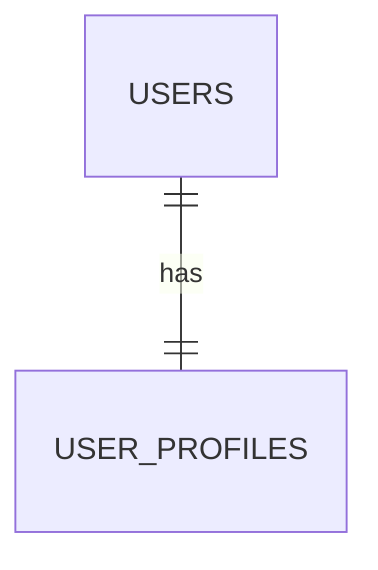

```sql
CREATE TABLE user_profiles (
    user_id INT PRIMARY KEY,
    bio TEXT,
    FOREIGN KEY (user_id) REFERENCES users(id)
);
```

### One-to-Many (1:N)

A one-to-many relationship means a single row in Table A can relate to multiple rows in Table B, but each row in Table B relates to only one row in Table A. This is the most common relational relationship — e.g., one `customer` can have many `orders`, but each order belongs to exactly one customer. It's implemented by placing the foreign key on the "many" side.

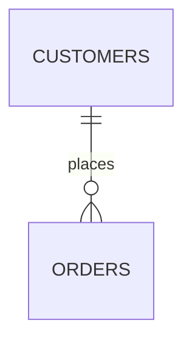

### Many-to-One (N:1)

Many-to-one is simply the one-to-many relationship viewed from the opposite side — many rows in Table B reference a single row in Table A. For example, "many orders belong to one customer" is the same physical relationship as "one customer has many orders"; only the perspective changes.

### Many-to-Many (M:N)

In a many-to-many relationship, multiple rows in Table A can relate to multiple rows in Table B. Since relational databases can't directly express M:N with foreign keys alone, a **junction (associative) table** is introduced, holding foreign keys to both tables (often as a composite primary key). Example: `students` and `courses`, linked via an `enrollments` table.

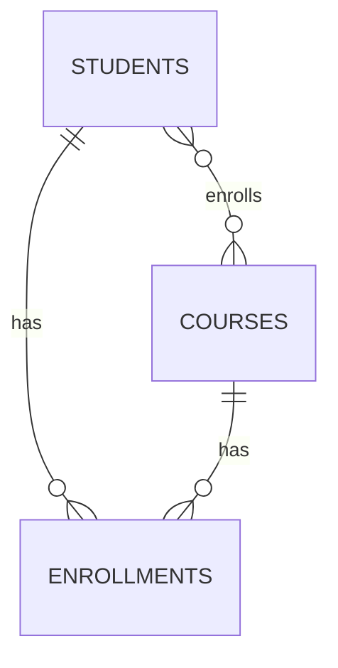

```sql
CREATE TABLE enrollments (
    student_id INT,
    course_id INT,
    PRIMARY KEY (student_id, course_id),
    FOREIGN KEY (student_id) REFERENCES students(id),
    FOREIGN KEY (course_id) REFERENCES courses(id)
);
```

| Relationship | Implementation |
|---|---|
| 1:1 | Unique FK on either table |
| 1:N | FK on the "many" side |
| M:N | Junction table with composite key |

### Self Referencing Relationships

A self-referencing (recursive) relationship occurs when a table has a foreign key that references its own primary key. A classic example is an `employees` table with a `manager_id` column referencing `employees.id`, modeling an organizational hierarchy.

```sql
CREATE TABLE employees (
    id INT PRIMARY KEY,
    name VARCHAR(100),
    manager_id INT,
    FOREIGN KEY (manager_id) REFERENCES employees(id)
);
```

### Identifying vs Non-Identifying Relationships

In an **identifying relationship**, the child entity's primary key includes the foreign key from the parent — meaning the child cannot exist, or be uniquely identified, without the parent (e.g., `order_items` depends on `orders`). In a **non-identifying relationship**, the foreign key is just a regular (non-key) column in the child table — the child has its own independent primary key and can conceptually exist without a specific parent row (though referential integrity may still require a valid reference), e.g., an `employee` referencing a `department`.

### Interview Questions

- **Q: How do you implement a one-to-one relationship in a relational schema?**
  A: Add a foreign key column in one table that also has a unique constraint (or make it the primary key of that table), ensuring at most one matching row on each side.
- **Q: Why can't many-to-many relationships be modeled with a simple foreign key?**
  A: A single foreign key column can only reference one row on the "one" side, so it can't express multiple associations in both directions; a junction table is needed to hold pairs of foreign keys.
- **Q: What's the difference between one-to-many and many-to-one?**
  A: They describe the same relationship from opposite viewpoints — 1:N from the parent's perspective is N:1 from the child's perspective.
- **Q: Give a real-world example of a self-referencing relationship.**
  A: An `employees` table where each row has a `manager_id` pointing to another row in the same table, modeling reporting hierarchy.
- **Q: What is a junction table, and what should its primary key typically be?**
  A: A table that resolves a many-to-many relationship by storing foreign keys to both related tables; its primary key is typically a composite of those two foreign keys.
- **Q: What's the difference between an identifying and non-identifying relationship?**
  A: In an identifying relationship, the child's primary key incorporates the parent's key (child can't be uniquely identified without the parent); in a non-identifying relationship, the foreign key is a normal attribute and the child has its own independent primary key.
- **Q: How would you model "a book can have multiple authors, and an author can write multiple books"?**
  A: A many-to-many relationship via a junction table, e.g., `book_authors(book_id, author_id)`.
- **Q: In a 1:N relationship between `departments` and `employees`, which table holds the foreign key?**
  A: The `employees` table (the "many" side) holds a `department_id` foreign key referencing `departments`.

## Entity Relationship (ER) Modeling

### Entities

An entity is a real-world object or concept that can be distinctly identified and stored as data — e.g., a `Student`, `Product`, or `Order`. In an ER diagram, entities are typically drawn as rectangles, and they become tables when the model is translated into a relational schema. An **entity set** is a collection of similar entities (e.g., all students).

### Attributes

Attributes are properties that describe an entity — e.g., a `Student` entity might have `student_id`, `name`, and `date_of_birth` attributes. Attributes can be **simple** (atomic, like `age`), **composite** (divisible, like `address` → street/city/zip), **single-valued** (`ssn`), **multi-valued** (`phone_numbers`), or **derived** (computed from another attribute, like `age` derived from `date_of_birth`).

### Relationships

In ER modeling, a relationship represents an association between two or more entities — e.g., a `Student` **enrolls in** a `Course`. Relationships are drawn as diamonds connecting related entities and can themselves carry attributes (e.g., `enrollment_date` on the enrolls relationship), which get resolved into columns on the junction table during logical design.

### Weak Entities

A weak entity is an entity that cannot be uniquely identified by its own attributes alone and depends on a related **identifying (owner) entity** for identification — it borrows part of its primary key (a partial key plus the owner's key). For example, a `Dependent` entity might only be identifiable in combination with the `Employee` it belongs to.

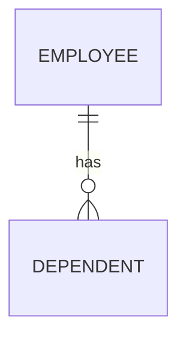

### Strong Entities

A strong entity has its own primary key and can be uniquely identified independently of any other entity — e.g., `Employee` with `employee_id` as its key. Most entities in a typical schema are strong entities; weak entities are the exception, used only when an entity's existence is inherently tied to another.

### Participation Constraints

Participation constraints specify whether every entity instance in an entity set must participate in a relationship. **Total participation** (double line in ER diagrams) means every entity instance must be involved in the relationship (e.g., every `Dependent` must be linked to an `Employee`). **Partial participation** (single line) means participation is optional (e.g., not every `Employee` needs to manage a project).

### Cardinality Constraints

Cardinality constraints in ER modeling specify the numeric limits on how entity instances relate through a relationship — expressed as 1:1, 1:N, or M:N (as covered in the "Relationships" section). They're often annotated on ER diagram connectors using notations like `(1,1)`, `(0,N)`, or crow's foot symbols to indicate minimum and maximum participation.

### ER Diagrams

An ER diagram (ERD) is a visual representation of entities, their attributes, and the relationships between them, used during the conceptual/logical design phase before creating the physical database schema. Rectangles represent entities, ellipses represent attributes, and diamonds represent relationships (in Chen notation), while "crow's foot" notation is a common alternative for showing cardinality directly on the connecting lines.

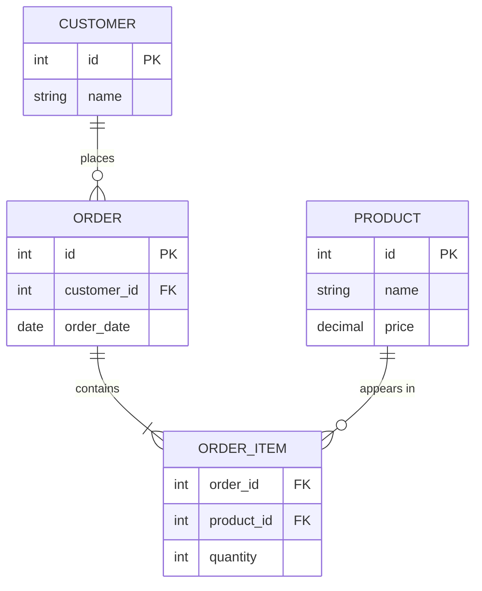

### Enhanced ER (EER) Concepts

Enhanced ER (EER) modeling extends basic ER concepts with object-oriented ideas to handle more complex scenarios: **generalization** (combining lower-level entities into a higher-level one, e.g., `Car` and `Truck` → `Vehicle`), **specialization** (the reverse — splitting a higher-level entity into specialized subtypes, e.g., `Employee` → `Manager`, `Engineer`), and **aggregation** (treating a relationship itself as a higher-level entity so it can participate in further relationships). These constructs help model inheritance-like hierarchies before mapping them to relational tables.

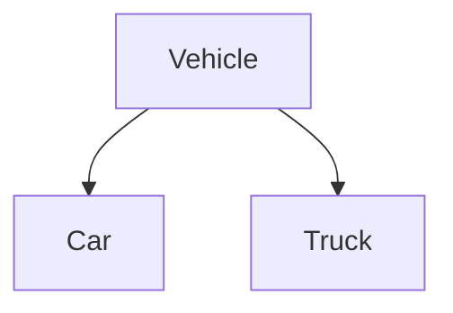

### Interview Questions

- **Q: What is the difference between a strong entity and a weak entity?**
  A: A strong entity has its own primary key and can be identified independently; a weak entity lacks a full primary key of its own and relies on a partial key combined with the identifying owner entity's key.
- **Q: What does "total participation" mean in an ER diagram, and how is it shown?**
  A: It means every instance of an entity must participate in the relationship; it's shown using a double line connecting the entity to the relationship diamond.
- **Q: What is a derived attribute? Give an example.**
  A: An attribute whose value can be computed from other stored attributes rather than stored directly — e.g., `age` derived from `date_of_birth`.
- **Q: How would you translate a weak entity into a relational table?**
  A: Create a table for the weak entity whose primary key is a composite of the owner entity's foreign key plus the weak entity's partial key.
- **Q: Explain generalization vs. specialization in EER modeling.**
  A: Generalization is a bottom-up process combining common attributes of multiple entities into a single higher-level entity; specialization is top-down, splitting a general entity into more specific subtypes with additional attributes.
- **Q: How is a many-to-many relationship with its own attributes handled in ER modeling and its relational translation?**
  A: The relationship is modeled as a diamond with its own attributes (e.g., `enrollment_date`), and it translates into a junction table containing both foreign keys plus columns for those relationship attributes.
- **Q: What's the difference between an entity and an entity set?**
  A: An entity is a single instance (e.g., one specific student); an entity set is the collection of all such instances of the same type (e.g., all students).
- **Q: How do you represent a composite attribute in an ER diagram?**
  A: As an oval attribute node connected to sub-oval nodes representing its components — e.g., `Address` connecting to `Street`, `City`, and `Zip`.
- **Q: Why might a database designer choose aggregation in EER modeling?**
  A: To let a relationship (e.g., an employee working on a project) itself participate in another relationship (e.g., that assignment being reviewed by a manager), which basic ER relationships cannot directly express.

## Normalization

### Data Redundancy

Data redundancy occurs when the same piece of data is stored in multiple places within a database. It typically arises from poor schema design where related facts (e.g., a customer's address) are duplicated across many rows instead of being stored once and referenced. Redundancy wastes storage and, more importantly, creates a risk that copies of the same fact drift out of sync.

**Disadvantages**

- Wasted disk space and larger backups/indexes.
- Increased risk of inconsistent data when one copy is updated but others are not.
- More I/O needed to keep duplicate copies in sync.

### Update Anomalies

An update anomaly happens when a change to a single fact requires updating multiple rows because that fact is duplicated. If even one of those rows is missed, the database ends up with contradictory data for what should be a single fact.

For example, if a `student_course` table repeats `instructor_email` on every row for a course, changing the instructor's email requires updating every row for that course — missing one row leaves stale data.

### Insertion Anomalies

An insertion anomaly occurs when it is impossible to add a new fact to the database without also supplying unrelated data, usually because two independent facts are combined into one table. For example, if `course` details only exist inside a `student_enrollment` table, a new course cannot be recorded until at least one student enrolls in it.

### Deletion Anomalies

A deletion anomaly occurs when removing a row unintentionally destroys other useful information that happened to be stored in that same row. For example, if the only student enrolled in a course drops it and their row is deleted, information about the course itself (e.g., its title or credits) may be lost along with it.

### Functional Dependency

A functional dependency `A → B` means that for any two rows, if the values of attribute (or attribute set) `A` are equal, the values of `B` must also be equal — `B` is fully determined by `A`. Functional dependencies are the foundation used to define and detect normal forms.

```sql
-- Example: employee_id determines employee_name and department_id
-- employee_id -> employee_name
-- employee_id -> department_id
SELECT employee_id, employee_name, department_id FROM employee;
```

### Partial Dependency

A partial dependency exists when a non-prime attribute (one not part of any candidate key) depends on only *part* of a composite candidate key, rather than the whole key. This is only possible when the primary key has more than one column, and it is the specific defect that Second Normal Form (2NF) eliminates.

### Transitive Dependency

A transitive dependency exists when a non-prime attribute depends on another non-prime attribute, rather than depending directly on the candidate key (i.e., `Key → A → B`, so `Key → B` only indirectly). Third Normal Form (3NF) removes transitive dependencies.

### 1NF

First Normal Form requires that every column hold a single, atomic value (no repeating groups or arrays) and that each row be uniquely identifiable. A table storing a comma-separated list of phone numbers in one column violates 1NF.

```sql
-- Violates 1NF: phones column holds multiple values
-- customer(id, name, phones)  -- phones = '555-1111,555-2222'

-- 1NF fix: one phone per row
-- customer_phone(customer_id, phone)
```

### 2NF

Second Normal Form requires the table to be in 1NF and have no partial dependencies — every non-prime attribute must depend on the *entire* composite primary key, not just part of it.

```sql
-- Violates 2NF (composite key: order_id + product_id)
-- order_item(order_id, product_id, product_name, quantity)
-- product_name depends only on product_id, not the full key

-- 2NF fix: split out the partial dependency
-- product(product_id, product_name)
-- order_item(order_id, product_id, quantity)
```

### 3NF

Third Normal Form requires the table to be in 2NF and have no transitive dependencies — every non-key attribute must depend directly on the primary key, not on another non-key attribute.

```sql
-- Violates 3NF: zip_code -> city, so city is transitively dependent on employee_id
-- employee(employee_id, zip_code, city)

-- 3NF fix
-- employee(employee_id, zip_code)
-- zip_lookup(zip_code, city)
```

### BCNF

Boyce-Codd Normal Form is a stricter version of 3NF: for every non-trivial functional dependency `A → B`, `A` must be a superkey. It resolves anomalies that can remain in 3NF when a table has multiple overlapping candidate keys.

**Differences: 1NF vs 2NF vs 3NF vs BCNF**

| Normal Form | Requirement | Eliminates |
|---|---|---|
| 1NF | Atomic column values, unique rows | Repeating groups |
| 2NF | 1NF + no partial dependency | Partial dependency on composite key |
| 3NF | 2NF + no transitive dependency | Transitive dependency between non-key attributes |
| BCNF | Every determinant is a candidate key | Anomalies from overlapping candidate keys |

### 4NF (Overview)

Fourth Normal Form builds on BCNF by eliminating multivalued dependencies — cases where one attribute has multiple independent values unrelated to another multivalued attribute in the same table (e.g., an employee's skills and the languages they speak stored in one table, producing a cross-product of rows). The fix is to split the independent multivalued facts into separate tables.

### 5NF (Overview)

Fifth Normal Form (Project-Join Normal Form) addresses join dependencies: a table should not be decomposable into smaller tables that, when joined back together, could reconstruct extra spurious rows not implied by the candidate keys. It matters mainly for tables modeling complex many-to-many-to-many relationships and is rarely a practical concern outside advanced schema design.

### Denormalization

Denormalization is the deliberate introduction of redundancy into a normalized schema, typically to improve read performance by reducing the number of joins needed for common queries (e.g., in reporting or analytics systems).

**Advantages**

- Fewer joins, faster reads for read-heavy workloads.
- Simpler queries for reporting/analytics.

**Disadvantages**

- Reintroduces update anomalies and redundancy risk.
- More complex write logic to keep duplicated data consistent.
- Larger storage footprint.

### Interview Questions

- **Q: Why is normalization important in database design?**
  A: It removes redundancy and prevents update, insertion, and deletion anomalies by ensuring each fact is stored in exactly one place, at the cost of requiring more joins for reads.
- **Q: Given `Order(order_id, product_id, product_name, customer_id, customer_name)`, normalize this table to 3NF.**
  A: Split into `Order(order_id, product_id, customer_id)`, `Product(product_id, product_name)`, and `Customer(customer_id, customer_name)` — `product_name` and `customer_name` are transitively/partially dependent, not on the full order key.
- **Q: What is the difference between a partial dependency and a transitive dependency?**
  A: A partial dependency is a non-key attribute depending on part of a composite key; a transitive dependency is a non-key attribute depending on another non-key attribute rather than the key directly.
- **Q: Can a table be in 3NF but not in BCNF?**
  A: Yes — this happens when a table has multiple overlapping candidate keys and a determinant of a dependency is a candidate key but not a superkey; 3NF permits this, BCNF does not.
- **Q: Why would you deliberately denormalize a database?**
  A: To optimize read-heavy workloads (e.g., dashboards, reporting) by avoiding expensive joins, accepting some redundancy and write complexity in exchange for query speed.
- **Q: What is an insertion anomaly? Give an example.**
  A: It's the inability to insert a fact without an unrelated fact also being present, e.g., not being able to add a new department until at least one employee is assigned to it, if department and employee data are combined in one table.
- **Q: How do you detect functional dependencies in a real schema?**
  A: By analyzing business rules and data — checking whether, for any two rows with the same value of `A`, `B` is always the same. It's typically inferred from domain requirements rather than derived purely from sample data.
- **Q: When would 4NF or 5NF actually matter in practice?**
  A: When a table stores multiple independent multivalued facts (4NF) or complex many-to-many-to-many relationships that could produce spurious joins (5NF) — otherwise most production schemas stop at 3NF/BCNF for practicality.

## Constraints

### Entity Integrity

Entity integrity ensures that every row in a table can be uniquely identified — enforced by requiring a primary key to be both unique and non-null. Without entity integrity, there would be no reliable way to distinguish one record from another or reference it from other tables.

```sql
CREATE TABLE employee (
    employee_id INT PRIMARY KEY,  -- unique and NOT NULL by definition
    name VARCHAR(100) NOT NULL
);
```

### Referential Integrity

Referential integrity ensures that a foreign key value in one table always matches an existing primary key value in the referenced table (or is null, if allowed). It prevents "orphan" rows that point to non-existent parent records.

```sql
CREATE TABLE department (
    department_id INT PRIMARY KEY,
    name VARCHAR(100)
);

CREATE TABLE employee (
    employee_id INT PRIMARY KEY,
    department_id INT,
    FOREIGN KEY (department_id) REFERENCES department(department_id)
);
```

### Domain Constraints

A domain constraint restricts the set of valid values a column can hold, based on its data type, length, format, or range (e.g., `age` must be an integer between 0 and 150). It's the most basic form of data validation, enforced at the column level.

### Check Constraints

A `CHECK` constraint enforces a custom boolean condition on column values, rejecting any insert or update that violates it. It's useful for business rules that go beyond simple data types.

```sql
CREATE TABLE product (
    product_id INT PRIMARY KEY,
    price DECIMAL(10,2) CHECK (price > 0),
    discount_pct INT CHECK (discount_pct BETWEEN 0 AND 100)
);
```

### Unique Constraints

A `UNIQUE` constraint ensures no two rows have the same value in a column (or column combination), while — unlike a primary key — still allowing a single null value (in most databases) and permitting multiple unique constraints per table.

```sql
CREATE TABLE user_account (
    id INT PRIMARY KEY,
    email VARCHAR(255) UNIQUE
);
```

### Not Null Constraints

A `NOT NULL` constraint requires that a column always have a value, preventing missing/unknown data for fields that are mandatory for the record to make sense (e.g., a user's `email`).

### Default Constraints

A `DEFAULT` constraint supplies an automatic value for a column when no value is explicitly provided on insert, reducing boilerplate and ensuring sensible baseline values (e.g., `created_at` defaulting to the current timestamp).

```sql
CREATE TABLE orders (
    order_id INT PRIMARY KEY,
    status VARCHAR(20) DEFAULT 'PENDING',
    created_at TIMESTAMP DEFAULT CURRENT_TIMESTAMP
);
```

### Referential Actions (On Delete/On Update Cascade)

Referential actions define what happens to dependent (child) rows when the referenced (parent) row is updated or deleted, keeping referential integrity intact automatically instead of leaving orphaned rows or blocking the operation.

```sql
CREATE TABLE employee (
    employee_id INT PRIMARY KEY,
    department_id INT,
    FOREIGN KEY (department_id) REFERENCES department(department_id)
        ON DELETE CASCADE
        ON UPDATE CASCADE
);
```

**Differences: Referential Actions**

| Action | Effect on child rows when parent is deleted/updated |
|---|---|
| `CASCADE` | Child rows are deleted/updated to match the parent change |
| `SET NULL` | Foreign key column in child rows is set to `NULL` |
| `SET DEFAULT` | Foreign key column in child rows is set to its default value |
| `RESTRICT` | Parent change is blocked if matching child rows exist |
| `NO ACTION` | Similar to `RESTRICT`; checked at end of statement/transaction (DB-dependent) |

### Interview Questions

- **Q: What is the difference between a primary key and a unique constraint?**
  A: A primary key uniquely identifies each row, disallows nulls, and a table can have only one; a unique constraint also enforces uniqueness but may allow a null value and a table can have multiple unique constraints.
- **Q: How does referential integrity prevent orphan records?**
  A: By requiring every foreign key value to match an existing primary key in the parent table (or be null), the database rejects inserts/updates that would reference a non-existent parent row.
- **Q: When would you use `ON DELETE SET NULL` instead of `ON DELETE CASCADE`?**
  A: When the child record should still exist after the parent is deleted, but the relationship should be cleared — e.g., an `employee.manager_id` should become null rather than deleting the employee when a manager is removed.
- **Q: Can a CHECK constraint reference another table?**
  A: No, standard `CHECK` constraints can only evaluate expressions using columns within the same row/table; cross-table validation requires triggers or application logic.
- **Q: What's the difference between a domain constraint and a check constraint?**
  A: A domain constraint is the basic type/format/range restriction inherent to a column's data type; a check constraint is a custom boolean rule you explicitly define for more specific business logic.
- **Q: Why might `NOT NULL` and `DEFAULT` be used together on the same column?**
  A: To guarantee the column always has a meaningful value: `DEFAULT` supplies a value automatically when none is given, and `NOT NULL` guards against explicit null values being inserted.
- **Q: What happens if you try to delete a parent row with `ON DELETE RESTRICT` and matching child rows exist?**
  A: The delete is rejected by the database with a constraint violation error, and the parent row remains until the child rows are removed or re-pointed first.

## Transactions

### What is a Transaction?

A transaction is a sequence of one or more database operations (reads/writes) that is treated as a single logical unit of work — either all of its effects are applied, or none are. Transactions let applications group related changes (e.g., debiting one account and crediting another) so the database never ends up in a partially-updated, inconsistent state.

**Real-life scenario:** Transferring $100 from Account A to Account B involves two updates (debit A, credit B). Wrapping both in a transaction guarantees that if the credit fails after the debit succeeds, the debit is undone too — money is never lost or duplicated.

### Transaction Lifecycle

A transaction begins with a `BEGIN`/`START TRANSACTION` statement, executes a series of reads/writes, and ends either by committing (making changes permanent) or rolling back (discarding changes). Along the way it may pass through intermediate states as the database validates and applies its changes.

```sql
START TRANSACTION;
UPDATE account SET balance = balance - 100 WHERE account_id = 'A';
UPDATE account SET balance = balance + 100 WHERE account_id = 'B';
COMMIT;
```

### Transaction States

A transaction moves through a well-defined set of states from start to finish, tracked internally by the database's transaction manager.

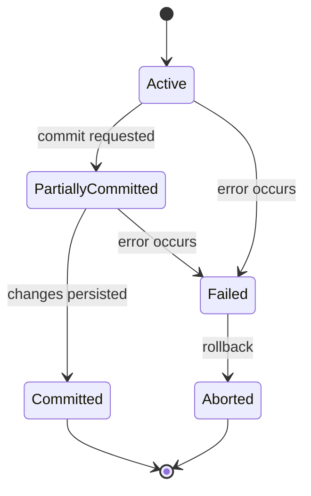

- **Active** – the transaction is executing its operations.
- **Partially Committed** – the last operation has executed, but changes are not yet durably persisted.
- **Committed** – all changes have been durably saved.
- **Failed** – an error prevented the transaction from continuing normally.
- **Aborted** – the transaction was rolled back, and the database restored to its pre-transaction state.

### ACID Properties

ACID is the set of guarantees a database transaction must provide to be considered reliable.

**Real-life scenario:** In the bank transfer example above, ACID guarantees: the transfer either fully happens or not at all (Atomicity), the total money in the system stays correct (Consistency), concurrent transfers don't interfere with each other's intermediate state (Isolation), and once confirmed, the transfer survives a crash (Durability).

| Property | Guarantee |
|---|---|
| Atomicity | All operations in the transaction succeed, or none are applied |
| Consistency | The database moves from one valid state to another, preserving all rules/constraints |
| Isolation | Concurrent transactions don't see each other's uncommitted intermediate state |
| Durability | Once committed, changes survive crashes/power loss |

### Transaction Failures

A transaction can fail for several reasons: a logical/application error (e.g., a constraint violation), a system crash, a disk/hardware failure, or a deadlock that forces the database to abort one of the competing transactions. In all cases, the database must roll back the failed transaction's partial changes to preserve atomicity and consistency.

### Commit

`COMMIT` finalizes a transaction, making all of its changes permanent and visible to other transactions. Once committed, the changes are durable and cannot be undone by a rollback.

```sql
START TRANSACTION;
INSERT INTO orders (order_id, status) VALUES (101, 'CREATED');
COMMIT;  -- changes are now permanent
```

### Rollback

`ROLLBACK` undoes all changes made during the current transaction, restoring the database to the state it was in before the transaction began. It's used both explicitly (application logic detects a problem) and implicitly (the database aborts the transaction due to an error or deadlock).

```sql
START TRANSACTION;
UPDATE account SET balance = balance - 100 WHERE account_id = 'A';
-- error detected: insufficient funds check fails in application logic
ROLLBACK;  -- the debit above is undone
```

### Savepoints

A savepoint is a named marker within a transaction that allows a partial rollback to that point, without discarding the entire transaction. It's useful for handling recoverable errors partway through a long transaction.

```sql
START TRANSACTION;
UPDATE account SET balance = balance - 100 WHERE account_id = 'A';
SAVEPOINT after_debit;
UPDATE account SET balance = balance + 100 WHERE account_id = 'C'; -- wrong account
ROLLBACK TO after_debit;  -- undo only the bad credit, keep the debit
UPDATE account SET balance = balance + 100 WHERE account_id = 'B'; -- correct account
COMMIT;
```

### Interview Questions

- **Q: What are the ACID properties, and why do they matter?**
  A: Atomicity, Consistency, Isolation, and Durability — they guarantee that transactions are reliable: fully applied or not at all, keep the database valid, don't interfere with each other, and survive crashes once committed.
- **Q: What's the difference between COMMIT and ROLLBACK?**
  A: `COMMIT` permanently saves all changes made in the transaction; `ROLLBACK` discards them, restoring the pre-transaction state.
- **Q: Give a real-world example that shows why atomicity is necessary.**
  A: A bank transfer that debits one account and credits another — if the credit fails after the debit succeeds without atomicity, money would simply disappear.
- **Q: What is a savepoint used for?**
  A: To roll back only part of a transaction (back to a named marker) without discarding all the work done earlier in that transaction.
- **Q: Can a transaction be rolled back after it has been committed?**
  A: No — once committed, changes are durable and permanent; a separate compensating transaction would be needed to reverse the effect.
- **Q: What causes a transaction to fail, and what does the database do about it?**
  A: Causes include constraint violations, application errors, system crashes, and deadlocks; the database rolls back the transaction's partial changes to keep the database consistent.
- **Q: Why is isolation important when multiple transactions run concurrently?**
  A: Without isolation, one transaction could read another's uncommitted, potentially-to-be-rolled-back changes, leading to incorrect results (dirty reads, lost updates, etc.).

## Concurrency Control

### Concurrent Transactions

Concurrent transactions are multiple transactions executing at (or near) the same time against a shared database. Concurrency improves throughput and resource utilization, but without proper control it can lead to anomalies like lost updates, dirty reads, and inconsistent results — which is why databases use locking, isolation levels, and MVCC to manage it.

### Lost Update Problem

The lost update problem occurs when two transactions read the same value, then both write back an updated value based on what they read — the second write overwrites the first, silently discarding one of the updates.

**Real-life scenario:** Two customers try to book the last seat on a flight at the same time. Both read "1 seat available," both proceed to book, and both writes succeed sequentially — the seat gets oversold because neither transaction saw the other's update.

```sql
-- Transaction 1                      -- Transaction 2
SELECT seats_available FROM flight    SELECT seats_available FROM flight
WHERE flight_id = 1;  -- reads 1      WHERE flight_id = 1;  -- reads 1
UPDATE flight SET seats_available = 0 UPDATE flight SET seats_available = 0
WHERE flight_id = 1;                  WHERE flight_id = 1;
-- Both bookings succeed; one seat oversold
```

### Dirty Read

A dirty read occurs when a transaction reads data written by another transaction that has not yet committed. If the writing transaction later rolls back, the reader has used data that never actually existed in the database.

### Non-Repeatable Read

A non-repeatable read occurs when a transaction reads the same row twice and gets different values, because another transaction updated and committed a change to that row in between the two reads.

### Phantom Read

A phantom read occurs when a transaction re-runs a query with a filter condition and gets a different *set of rows* than before, because another transaction inserted or deleted rows matching that condition in between.

**Differences: Dirty Read vs Non-Repeatable Read vs Phantom Read**

| Anomaly | What changes between two reads | Cause |
|---|---|---|
| Dirty Read | Reads uncommitted data from another transaction | Reading before the writer commits |
| Non-Repeatable Read | Same row's value changes | Another transaction updates and commits that row |
| Phantom Read | The set of rows matching a query changes | Another transaction inserts/deletes matching rows |

### Isolation Levels

Isolation levels control the trade-off between consistency and concurrency by determining which of the above anomalies are allowed to occur.

| Isolation Level | Dirty Read | Non-Repeatable Read | Phantom Read |
|---|---|---|---|
| Read Uncommitted | Possible | Possible | Possible |
| Read Committed | Prevented | Possible | Possible |
| Repeatable Read | Prevented | Prevented | Possible (varies by DB) |
| Serializable | Prevented | Prevented | Prevented |

```sql
SET TRANSACTION ISOLATION LEVEL READ COMMITTED;
START TRANSACTION;
SELECT balance FROM account WHERE account_id = 'A';
COMMIT;
```

### Locking

Locking is a concurrency control mechanism where a transaction acquires a lock on a data item before accessing it, preventing other transactions from making conflicting accesses until the lock is released. Locks are the primary tool pessimistic concurrency control uses to enforce isolation.

### Shared Locks

A shared (S) lock is acquired for reading a data item, and multiple transactions can hold a shared lock on the same item simultaneously — reads don't block other reads.

### Exclusive Locks

An exclusive (X) lock is acquired for writing a data item, and no other transaction can hold any lock (shared or exclusive) on that item while it's held — writes block all other reads and writes on that item.

**Differences: Shared Lock vs Exclusive Lock**

| Aspect | Shared Lock (S) | Exclusive Lock (X) |
|---|---|---|
| Purpose | Reading data | Writing data |
| Compatibility | Multiple shared locks allowed together | Blocks all other locks |
| Typical use | `SELECT` | `UPDATE`, `DELETE`, `INSERT` |

```sql
-- Pessimistic locking: acquire an exclusive lock on the row before updating
START TRANSACTION;
SELECT * FROM account WHERE account_id = 'A' FOR UPDATE;
UPDATE account SET balance = balance - 100 WHERE account_id = 'A';
COMMIT;
```

### Optimistic Locking

Optimistic locking assumes conflicts are rare: transactions proceed without acquiring locks, and instead a version number (or timestamp) is checked at commit time — if the row changed since it was read, the update is rejected and must be retried.

```sql
UPDATE account
SET balance = balance - 100, version = version + 1
WHERE account_id = 'A' AND version = 5;
-- if 0 rows affected, another transaction updated it first; retry
```

### Pessimistic Locking

Pessimistic locking assumes conflicts are likely: a transaction acquires a lock on data before working with it, blocking other transactions from conflicting access until it's done (e.g., `SELECT ... FOR UPDATE`).

**Differences: Optimistic vs Pessimistic Locking**

| Aspect | Optimistic Locking | Pessimistic Locking |
|---|---|---|
| Assumption | Conflicts are rare | Conflicts are common |
| Mechanism | Version/timestamp check at commit | Locks acquired up front |
| Concurrency | Higher (no blocking while reading) | Lower (readers/writers may block) |
| Failure mode | Retry on conflict at commit time | Blocks/waits, or deadlocks |
| Best for | Low-contention, high-read workloads | High-contention, write-heavy workloads |

### Deadlocks

A deadlock occurs when two or more transactions are each waiting for a lock held by the other, so none of them can ever proceed. The database must detect this cycle and forcibly abort one of the transactions (the "victim") to break it.

**Real-life scenario:** Transaction 1 locks Account A and then wants to lock Account B; Transaction 2 has already locked Account B and wants to lock Account A. Each waits forever for the other to release its lock.

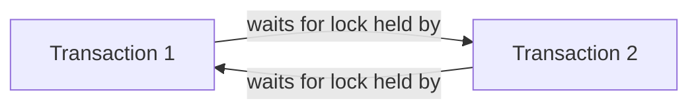

### Deadlock Prevention

Deadlock prevention avoids deadlocks before they happen, typically by imposing a strict ordering on how locks are acquired (e.g., always lock accounts in ascending `account_id` order) or by using timeouts/wait-die schemes based on transaction age.

### Deadlock Detection

Deadlock detection lets deadlocks occur but periodically checks for cycles in a wait-for graph of transactions blocked on each other's locks; when a cycle is found, the database aborts one transaction (rolls it back) to let the others proceed.

### Multiversion Concurrency Control (MVCC)

MVCC allows readers and writers to avoid blocking each other by keeping multiple versions of a row: each transaction sees a consistent snapshot of the data as of when it started (or as of each statement), while writers create new row versions rather than overwriting in place. This is how databases like PostgreSQL and MySQL/InnoDB provide high concurrency without readers blocking writers.

**Advantages**

- Readers never block writers and vice versa, improving concurrency.
- Provides consistent snapshots for repeatable-read/serializable isolation without heavy locking.

**Disadvantages**

- Requires storing multiple row versions, increasing storage and requiring periodic cleanup (e.g., PostgreSQL's `VACUUM`).
- Write-write conflicts still need to be resolved (e.g., via optimistic checks or locks).

### Interview Questions

- **Q: What is the difference between a dirty read and a non-repeatable read?**
  A: A dirty read sees another transaction's uncommitted data; a non-repeatable read sees a row change value between two reads within the same transaction because the other transaction committed in between.
- **Q: Describe a real deadlock scenario and how you would prevent it.**
  A: Transaction 1 locks Account A then waits for Account B, while Transaction 2 locks Account B then waits for Account A — a circular wait. Prevention: always acquire locks in a consistent global order (e.g., by ascending account ID) so a cycle can't form.
- **Q: What's the difference between optimistic and pessimistic locking, and when would you choose each?**
  A: Optimistic locking checks for conflicts at commit time using a version column, best for low-contention reads; pessimistic locking acquires locks upfront, best for high-contention writes where retries would be costly.
- **Q: How does MVCC allow readers and writers to avoid blocking each other?**
  A: By keeping multiple versions of each row, readers see a consistent snapshot from when their transaction/statement began while writers create new versions, so reads never need to wait for writes to finish.
- **Q: What isolation level would you choose to prevent phantom reads, and what's the trade-off?**
  A: Serializable, since it prevents dirty reads, non-repeatable reads, and phantom reads — the trade-off is reduced concurrency due to more locking/serialization overhead.
- **Q: What is the lost update problem, and how can it be prevented?**
  A: It's when two transactions read the same value and both write back an update, causing one update to silently overwrite the other; it can be prevented with pessimistic locking (`SELECT ... FOR UPDATE`) or optimistic locking with version checks.
- **Q: What's the difference between deadlock prevention and deadlock detection?**
  A: Prevention avoids deadlocks proactively (e.g., strict lock ordering); detection allows them to occur but periodically scans for wait-for cycles and aborts a transaction to resolve it.
- **Q: Can a shared lock and an exclusive lock be held on the same row at the same time?**
  A: No — an exclusive lock is incompatible with any other lock (shared or exclusive) on the same item; only multiple shared locks can coexist.
- **Q: Why might repeatable read still allow phantom reads in some databases?**
  A: Because repeatable read guarantees that already-read *rows* won't change, but doesn't necessarily lock the range of rows a query could match, so newly inserted rows matching the query's filter can still appear (implementation-dependent; some databases like PostgreSQL prevent phantoms at this level via snapshot isolation).
- **Q: How would you handle a high-contention "seat booking" feature to avoid overselling?**
  A: Use pessimistic locking (`SELECT ... FOR UPDATE`) on the seat/inventory row during booking, or optimistic locking with a version/quantity check on update, combined with a unique constraint to guarantee at most one booking per seat.

## Indexing

### What is an Index?

A database index is an auxiliary data structure that stores a sorted (or otherwise organized) reference to rows in a table, allowing the database engine to locate rows without scanning the entire table. It works much like the index at the back of a book: instead of reading every page to find a topic, you look up the topic in the index and jump straight to the relevant page. Indexes speed up `SELECT` queries with `WHERE`, `JOIN`, `ORDER BY`, and `GROUP BY` clauses, but they add overhead to `INSERT`, `UPDATE`, and `DELETE` operations because the index must be maintained alongside the table.

```sql
-- Without an index, this scans every row in the table
SELECT * FROM employees WHERE last_name = 'Smith';

-- Creating an index speeds up the lookup above
CREATE INDEX idx_employees_last_name ON employees (last_name);
```

### Clustered Index

A clustered index determines the physical storage order of rows in a table — the table data itself is stored in the order of the index key. Because the data rows and the index are physically the same structure, a table can have only **one** clustered index (typically on the primary key). Lookups by the clustered key are extremely fast since the leaf nodes of the index *are* the data pages.

```sql
-- In most RDBMS (e.g., SQL Server), the primary key creates a clustered index by default
CREATE TABLE orders (
    order_id INT PRIMARY KEY,   -- clustered index on order_id
    customer_id INT,
    order_date DATE
);
```

### Non-Clustered Index

A non-clustered index is a separate structure from the actual table data. It stores the indexed column(s) plus a pointer (row locator, such as a row ID or the clustered key) back to the actual row. A table can have **many** non-clustered indexes. Because an extra lookup step ("bookmark lookup") is needed to fetch the full row, non-clustered indexes are typically slightly slower than clustered indexes for retrieving entire rows, but they are ideal for supporting varied query patterns on non-primary-key columns.

```sql
CREATE INDEX idx_orders_customer_id ON orders (customer_id);
```

**Differences: Clustered vs Non-Clustered Index**

| Aspect | Clustered Index | Non-Clustered Index |
|---|---|---|
| Data storage | Table rows physically sorted by index key | Separate structure with pointers to rows |
| Count per table | One | Many |
| Lookup speed | Faster (data is the index) | Slightly slower (extra row lookup) |
| Storage overhead | None extra (reorders existing data) | Additional storage for the index structure |
| Typical use | Primary key / range queries | Secondary search columns, foreign keys |

### Composite Index

A composite (or compound) index is built on two or more columns, in a specific order. The column order matters: the index is most effective for queries that filter on a leading prefix of the indexed columns (similar to how a phone book sorted by last name then first name only helps you search by last name alone, or by last name + first name, but not by first name alone).

```sql
CREATE INDEX idx_orders_customer_date ON orders (customer_id, order_date);

-- Uses the index efficiently (leading column)
SELECT * FROM orders WHERE customer_id = 42;

-- Uses the index fully (both columns, in order)
SELECT * FROM orders WHERE customer_id = 42 AND order_date = '2026-01-01';

-- Cannot use this index effectively (skips leading column)
SELECT * FROM orders WHERE order_date = '2026-01-01';
```

### Covering Index

A covering index is an index that contains **all** the columns needed to satisfy a query, so the database engine can answer the query directly from the index without accessing the underlying table (no bookmark lookup). This is a key performance technique for read-heavy, latency-sensitive queries.

```sql
-- Query only needs customer_id, order_date, and status
SELECT customer_id, order_date, status
FROM orders
WHERE customer_id = 42;

-- This index "covers" the query above — no table access needed
CREATE INDEX idx_orders_covering ON orders (customer_id, order_date, status);
```

### Unique Index

A unique index enforces that no two rows have the same value(s) in the indexed column(s), while also providing the performance benefits of a regular index. Primary keys automatically get a unique index; `UNIQUE` constraints on other columns create one explicitly. NULLs are typically allowed (and, depending on the database, multiple NULLs may or may not be considered duplicates).

```sql
CREATE UNIQUE INDEX idx_users_email ON users (email);
```

### B-Tree Index

The B-Tree (balanced tree) is the default and most common index structure used by relational databases (e.g., MySQL InnoDB, PostgreSQL). It keeps data sorted and balanced so that all leaf nodes are at the same depth, guaranteeing $O(\log n)$ lookup, insert, and delete performance. B-Trees are well suited for range queries (`BETWEEN`, `<`, `>`, `ORDER BY`) because leaf nodes are typically linked, allowing efficient sequential scans once the starting point is found.

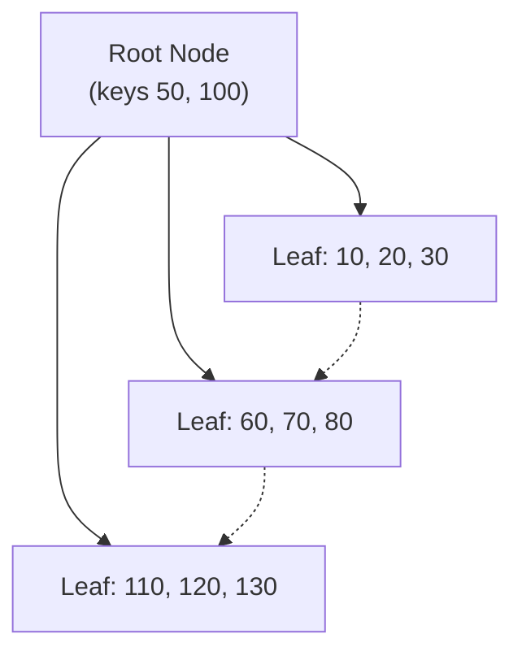

### Hash Index

A hash index applies a hash function to the indexed column's value to compute a bucket location, giving average $O(1)$ lookup time for exact-match equality queries (`=`). Hash indexes do **not** support range queries, ordering, or partial-key matches on composite indexes, since hashing destroys the natural ordering of values.

**Differences: B-Tree vs Hash Index**

| Aspect | B-Tree Index | Hash Index |
|---|---|---|
| Equality lookups (`=`) | Fast ($O(\log n)$) | Fast (average $O(1)$) |
| Range queries (`<`, `>`, `BETWEEN`) | Supported | Not supported |
| Sorted output (`ORDER BY`) | Supported directly | Not supported |
| Typical use | General-purpose, default in most RDBMS | In-memory tables, exact-match lookups |

### Index Selectivity

Selectivity is the ratio of distinct values in a column to the total number of rows: $\text{selectivity} = \frac{\text{distinct values}}{\text{total rows}}$. A column with high selectivity (e.g., an email or SSN column, close to 1.0) is an excellent index candidate because each lookup filters out most rows. A column with low selectivity (e.g., a `boolean` "is_active" flag, close to 0) provides little benefit from indexing, since a query would still need to scan a large fraction of the table.

### Advantages and Trade-offs of Indexes

- **Advantages**
  - Dramatically faster `SELECT`, `JOIN`, `ORDER BY`, and `GROUP BY` performance on large tables.
  - Enables efficient enforcement of uniqueness constraints.
  - Can eliminate the need to read table data at all (covering indexes).
- **Disadvantages**
  - Extra storage space for each index maintained.
  - Slower `INSERT`/`UPDATE`/`DELETE` because indexes must be updated too.
  - Over-indexing can confuse the query optimizer and increase maintenance (rebuilds/statistics updates).

### Full-Text Index

A full-text index is a specialized index designed for searching natural-language text within large text columns, supporting word-based searches, relevance ranking, and linguistic features like stemming and stop-word removal — capabilities a standard B-Tree index cannot provide efficiently. It is used when queries need to find rows containing specific words or phrases anywhere within a large text blob, rather than matching an exact or prefix value.

```sql
-- MySQL example
CREATE FULLTEXT INDEX idx_articles_body ON articles (body);

SELECT * FROM articles
WHERE MATCH(body) AGAINST ('database indexing' IN NATURAL LANGUAGE MODE);
```

### Interview Questions

- **Q: What is the difference between a clustered and a non-clustered index?**
  A: A clustered index physically orders the table's rows by the index key (only one per table), while a non-clustered index is a separate structure with pointers back to the rows (a table can have many).
- **Q: Why can a table have only one clustered index but multiple non-clustered indexes?**
  A: The clustered index defines the physical row order on disk, and rows can only be physically sorted one way at a time; non-clustered indexes are independent structures that merely reference rows, so many can coexist.
- **Q: What is a covering index and why is it useful?**
  A: It's an index that includes all columns a query needs, so the engine can answer the query from the index alone without a costly lookup into the base table.
- **Q: When would you choose a hash index over a B-Tree index?**
  A: When the workload is purely equality lookups (no range queries or sorting needed) and you want average O(1) lookup time, such as an in-memory key-value lookup table.
- **Q: What is index selectivity and why does it matter?**
  A: It's the ratio of distinct values to total rows; high-selectivity columns benefit greatly from indexing while low-selectivity columns (e.g., a boolean flag) gain little, since the index still returns a large fraction of rows.
- **Q: Why can too many indexes hurt performance?**
  A: Every write operation (`INSERT`/`UPDATE`/`DELETE`) must update every affected index, increasing write latency, storage usage, and lock contention.
- **Q: Given `CREATE INDEX idx (a, b, c)`, which queries benefit from this composite index?**
  A: Queries filtering on `a`, on `a AND b`, or on `a AND b AND c` benefit (leftmost prefix rule); a query filtering only on `b` or `c` generally cannot use this index efficiently.
- **Q: How does a full-text index differ from a standard B-Tree index on a VARCHAR column?**
  A: A full-text index tokenizes text into words and supports relevance-ranked natural-language search anywhere within the text, while a B-Tree index only efficiently supports exact-match or prefix (`LIKE 'abc%'`) searches.
- **Q: What is a unique index and how does it differ from a `UNIQUE` constraint?**
  A: A unique index enforces no duplicate values while also speeding up lookups; a `UNIQUE` constraint is the logical rule, which the database typically implements internally by creating a unique index.

## Database Storage

### Pages

A page is the fundamental unit of storage that a database reads from and writes to disk, typically a fixed size such as 8 KB (PostgreSQL, SQL Server) or 16 KB (MySQL InnoDB default). Rather than reading a single row, the database always reads/writes a whole page, which contains one or more rows plus metadata (headers, free space information, row pointers). Pages are cached in a buffer pool in memory to minimize disk I/O.

### Blocks

A block is the operating system's or storage device's fundamental unit of I/O (e.g., 4 KB on many filesystems). Databases align their page size to be a multiple of the OS block size for I/O efficiency, so that a single disk read/write operation transfers a whole number of blocks without wasted or fragmented I/O.

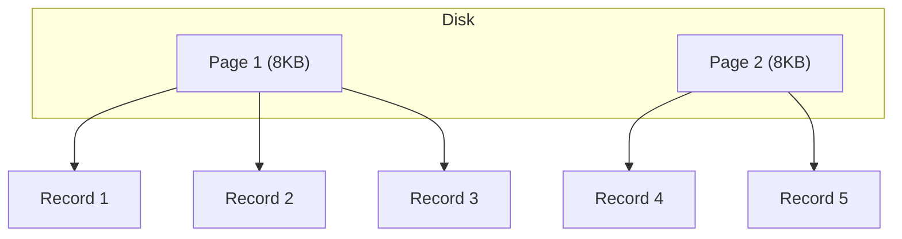

### Records

A record (or tuple/row) is a single unit of data stored within a page, representing one row of a table. Each record typically consists of a header (metadata like null bitmaps, length information) followed by the actual column values, serialized according to the table's schema.

### Heap Files

A heap file is an unordered collection of records stored in no particular order — new rows are simply appended wherever free space exists (or at the end of the file). Heap storage offers fast inserts since the engine doesn't need to maintain any ordering, but lookups require a full table scan unless supported by a separate index.

- **Advantages**
  - Very fast inserts (no reordering needed).
  - Simple to implement and manage.
- **Disadvantages**
  - Slow point/range lookups without an index (full scan required).
  - Can suffer from fragmentation as rows are deleted and reinserted.

### Clustered Storage

Clustered storage physically stores table rows sorted according to a key (usually the primary key), so that rows with nearby key values are physically adjacent on disk. This is the storage model used when a table has a clustered index — it makes range scans on the clustering key very fast since related rows are read together in fewer I/O operations.

### Row-Oriented Storage

In row-oriented (row-store) storage, all columns of a single row are stored contiguously on disk/in a page. This layout is efficient for transactional (OLTP) workloads that read or write entire rows at a time — e.g., fetching a full customer record or inserting a new order.

### Column-Oriented Storage (Overview)

In column-oriented (columnar) storage, values from the same column across all rows are stored contiguously instead. This layout is highly efficient for analytical (OLAP) workloads that scan a few columns across millions of rows (e.g., `SUM(amount)` over a sales table), because only the needed columns are read from disk, and similar values compress very well together.

**Differences: Row-Oriented vs Column-Oriented Storage**

| Aspect | Row-Oriented | Column-Oriented |
|---|---|---|
| Physical layout | Full row stored together | Each column stored together |
| Best for | OLTP (frequent row reads/writes) | OLAP (aggregations over few columns) |
| Read efficiency | Reads entire row even if few columns needed | Reads only the columns queried |
| Write efficiency | Fast single-row inserts/updates | Slower single-row writes (scattered across column files) |
| Compression | Less effective (mixed data types per page) | Very effective (similar values grouped) |
| Examples | PostgreSQL, MySQL (default) | Amazon Redshift, ClickHouse, Apache Parquet |

### Interview Questions

- **Q: What is the relationship between a page and a block?**
  A: A page is the database's logical unit of I/O, while a block is the OS/disk's physical unit of I/O; database page sizes are chosen as multiples of the block size for efficient, aligned disk access.
- **Q: Why do databases read/write whole pages instead of individual rows?**
  A: Disk I/O is far more efficient in fixed-size chunks; reading a whole page amortizes the cost of a disk seek/transfer across multiple rows and enables effective buffer pool caching.
- **Q: What is a heap file and what is its main drawback?**
  A: An unordered collection of rows appended without any sort order; its main drawback is that queries without a supporting index require a full table scan.
- **Q: When would you choose column-oriented storage over row-oriented storage?**
  A: When workloads are analytical — aggregating or scanning a small number of columns across huge numbers of rows (e.g., data warehousing, BI dashboards) — column storage minimizes I/O and compresses better.
- **Q: Why is column-oriented storage generally slower for single-row inserts?**
  A: Because each column of the new row must be appended to a different physical column file/segment, requiring multiple scattered writes instead of one contiguous write.
- **Q: How does clustered storage improve range query performance?**
  A: Because rows are physically sorted by the clustering key, a range query can read a contiguous sequence of pages instead of jumping around the disk to find scattered rows.
- **Q: What's stored in a database "record" besides the column values?**
  A: A header containing metadata such as null bitmaps, variable-length column offsets, and row versioning/transaction information used for concurrency control.
- **Q: Why might a heap table become fragmented over time?**
  A: As rows are deleted and new rows of different sizes are inserted into the freed space, the physical layout becomes non-contiguous and scattered, hurting sequential scan performance.

## SQL and Query Languages

### Query Languages Overview (DDL, DML, DCL, TCL)

SQL commands are grouped into four sublanguages based on their purpose:

| Category | Full Name | Purpose | Example Commands |
|---|---|---|---|
| DDL | Data Definition Language | Defines/alters schema structure | `CREATE`, `ALTER`, `DROP`, `TRUNCATE` |
| DML | Data Manipulation Language | Manipulates data within tables | `SELECT`, `INSERT`, `UPDATE`, `DELETE` |
| DCL | Data Control Language | Manages access/permissions | `GRANT`, `REVOKE` |
| TCL | Transaction Control Language | Manages transaction boundaries | `COMMIT`, `ROLLBACK`, `SAVEPOINT` |

```sql
-- DDL
CREATE TABLE products (id INT PRIMARY KEY, name VARCHAR(100));

-- DML
INSERT INTO products (id, name) VALUES (1, 'Widget');

-- DCL
GRANT SELECT ON products TO reporting_user;

-- TCL
BEGIN;
UPDATE products SET name = 'Gadget' WHERE id = 1;
COMMIT;
```

### Joins Overview (Inner, Outer, Cross, Self)

A join combines rows from two or more tables based on a related column. **Inner join** returns only rows with matches in both tables. **Outer joins** (`LEFT`, `RIGHT`, `FULL`) return matched rows plus unmatched rows from one or both sides, filling in `NULL` for missing columns. **Cross join** returns the Cartesian product of both tables (every row paired with every row). **Self join** joins a table to itself, typically to compare rows within the same table (e.g., an employee-to-manager relationship).

```sql
-- INNER JOIN: only customers who have orders
SELECT c.name, o.order_id
FROM customers c
INNER JOIN orders o ON c.id = o.customer_id;

-- LEFT OUTER JOIN: all customers, with NULLs for those without orders
SELECT c.name, o.order_id
FROM customers c
LEFT JOIN orders o ON c.id = o.customer_id;

-- SELF JOIN: employees and their managers
SELECT e.name AS employee, m.name AS manager
FROM employees e
LEFT JOIN employees m ON e.manager_id = m.id;
```

**Differences: Inner vs Outer vs Cross vs Self Join**

| Join Type | Returns | Unmatched Rows |
|---|---|---|
| Inner | Only matching rows from both tables | Excluded |
| Left Outer | All rows from left table + matches from right | Right side `NULL`-filled |
| Right Outer | All rows from right table + matches from left | Left side `NULL`-filled |
| Full Outer | All rows from both tables | Both sides `NULL`-filled where unmatched |
| Cross | Cartesian product (every row × every row) | N/A (no join condition) |
| Self | Table joined with itself via an alias | Depends on join type used |

### Set Operations (Union, Intersect, Except)

Set operations combine the results of two or more `SELECT` queries that must have the same number of columns with compatible types. `UNION` returns all distinct rows from either query (`UNION ALL` keeps duplicates). `INTERSECT` returns only rows present in both result sets. `EXCEPT` (or `MINUS` in some databases) returns rows in the first query that are not in the second.

```sql
SELECT city FROM customers
UNION
SELECT city FROM suppliers;

SELECT customer_id FROM orders_2025
INTERSECT
SELECT customer_id FROM orders_2026;

SELECT customer_id FROM all_customers
EXCEPT
SELECT customer_id FROM churned_customers;
```

### Subqueries

A subquery is a query nested inside another query, used in the `SELECT`, `FROM`, or `WHERE` clause. Subqueries can be **scalar** (return one value), **row/column** (return a list), or **correlated** (reference a column from the outer query, re-evaluated per outer row).

```sql
-- Subquery in WHERE clause
SELECT name FROM employees
WHERE salary > (SELECT AVG(salary) FROM employees);

-- Correlated subquery
SELECT e.name FROM employees e
WHERE EXISTS (
    SELECT 1 FROM orders o WHERE o.employee_id = e.id
);
```

### Views

A view is a virtual table defined by a stored `SELECT` query — it does not store data itself (unless it's a materialized view) but presents data dynamically from the underlying tables each time it's queried. Views are useful for simplifying complex queries, enforcing security by restricting visible columns/rows, and providing a stable interface even if underlying tables change.

```sql
CREATE VIEW active_customers AS
SELECT id, name, email
FROM customers
WHERE status = 'ACTIVE';

SELECT * FROM active_customers;
```

- **Advantages**
  - Simplifies repeated complex queries and hides join/filter logic.
  - Can restrict access to sensitive columns/rows for security.
- **Disadvantages**
  - Regular views add query overhead (re-executed each time, no stored data).
  - Can be harder to debug/optimize when nested many layers deep.

### Stored Procedures

A stored procedure is a precompiled, named block of SQL (and often procedural logic like loops and conditionals) stored in the database and invoked by name. Stored procedures reduce network round-trips, allow reuse of business logic across applications, and can improve performance since the execution plan may be cached.

```sql
CREATE PROCEDURE GetOrdersByCustomer (IN cust_id INT)
BEGIN
    SELECT * FROM orders WHERE customer_id = cust_id;
END;

CALL GetOrdersByCustomer(42);
```

### Triggers

A trigger is a piece of procedural code that automatically executes in response to a specific event (`INSERT`, `UPDATE`, `DELETE`) on a table, either `BEFORE` or `AFTER` the event. Triggers are commonly used for auditing, enforcing complex business rules, and maintaining derived/denormalized data automatically.

```sql
CREATE TRIGGER trg_audit_salary_update
AFTER UPDATE ON employees
FOR EACH ROW
BEGIN
    INSERT INTO salary_audit (employee_id, old_salary, new_salary, changed_at)
    VALUES (OLD.id, OLD.salary, NEW.salary, NOW());
END;
```

### Cursors

A cursor is a database object that allows row-by-row, sequential processing of a result set — useful when logic must operate on one row at a time (e.g., complex procedural transformations) rather than as a set. Cursors are generally discouraged for routine data processing because set-based SQL operations are far more efficient.

```sql
DECLARE cur CURSOR FOR SELECT id, salary FROM employees;
OPEN cur;
FETCH NEXT FROM cur INTO @id, @salary;
WHILE @@FETCH_STATUS = 0
BEGIN
    -- process one row at a time
    FETCH NEXT FROM cur INTO @id, @salary;
END;
CLOSE cur;
DEALLOCATE cur;
```

- **Advantages**
  - Enables row-by-row procedural logic when set-based SQL can't easily express it.
- **Disadvantages**
  - Much slower than set-based operations due to per-row overhead.
  - Holds locks/resources longer, potentially reducing concurrency.

**Differences: Stored Procedure vs Trigger vs View**

| Aspect | Stored Procedure | Trigger | View |
|---|---|---|---|
| Invocation | Explicitly called (`CALL`/`EXEC`) | Automatically fired by an event | Queried like a table (`SELECT`) |
| Purpose | Encapsulate reusable logic/operations | React to data changes automatically | Present a simplified/virtual dataset |
| Can modify data | Yes | Yes | Generally no (unless updatable view) |
| Returns a result set | Optional | No | Yes (always) |

### Interview Questions

- **Q: Write a query using an INNER JOIN and explain when a covering index would help.**
  A: `SELECT c.name, o.order_id FROM customers c INNER JOIN orders o ON c.id = o.customer_id;` — a covering index on `orders(customer_id, order_id)` would let the engine satisfy the join's needs directly from the index without touching the `orders` table data, speeding up the join significantly.
- **Q: What is the difference between `UNION` and `UNION ALL`?**
  A: `UNION` removes duplicate rows from the combined result (requiring a sort/dedup step), while `UNION ALL` keeps all rows including duplicates and is faster since no deduplication occurs.
- **Q: What is a correlated subquery, and why can it be slow?**
  A: A subquery that references a column from the outer query, causing it to be logically re-evaluated for every row of the outer query, which can be expensive without proper indexing.
- **Q: When would you use a LEFT JOIN instead of an INNER JOIN?**
  A: When you need all rows from the left table regardless of whether a match exists in the right table, e.g., listing all customers including those with zero orders.
- **Q: What's the difference between a view and a materialized view?**
  A: A regular view stores only the query definition and is re-executed on each access, while a materialized view stores the actual computed result physically and must be refreshed periodically.
- **Q: Why are cursors generally discouraged in SQL?**
  A: They process rows one at a time, losing the performance benefits of set-based operations and often holding locks longer, hurting throughput and concurrency compared to equivalent set-based queries.
- **Q: What is the difference between DDL and DML commands?**
  A: DDL commands (`CREATE`, `ALTER`, `DROP`) define or modify the schema structure, while DML commands (`SELECT`, `INSERT`, `UPDATE`, `DELETE`) manipulate the actual data within that structure.
- **Q: When would a trigger be a better choice than adding logic in application code?**
  A: When the rule must be enforced consistently regardless of which application or client modifies the data (e.g., auditing every change to a table), since the trigger runs at the database level.
- **Q: How does a self join work, and give an example use case.**
  A: It joins a table to itself using aliases to treat it as two logical tables, commonly used for hierarchical data such as matching employees to their managers within the same `employees` table.
- **Q: What does `EXCEPT` (or `MINUS`) return?**
  A: All rows returned by the first query that do not appear in the second query's result set.

## Query Processing (Conceptual)

### Query Parsing

Parsing is the first stage of query processing: the database's parser checks the SQL statement for correct syntax and validates that referenced tables, columns, and functions actually exist and that the user has appropriate permissions. The output is an internal representation (a parse tree / query tree) that later stages operate on rather than raw text.

### Query Optimization

The query optimizer takes the parsed query and determines the most efficient way to execute it, evaluating alternative strategies such as which indexes to use, the join order, and the join algorithm (nested loop, hash join, merge join). Because the number of possible execution strategies grows combinatorially with the number of joined tables, the optimizer uses heuristics and cost estimates rather than exhaustively evaluating every plan.

### Execution Plan

An execution plan (or query plan) is the concrete, ordered sequence of physical operations (table scans, index seeks, joins, sorts, aggregations) the database engine will perform to execute a query. Developers can inspect it using `EXPLAIN` (PostgreSQL, MySQL) or `EXPLAIN ANALYZE` to diagnose slow queries and verify whether indexes are actually being used.

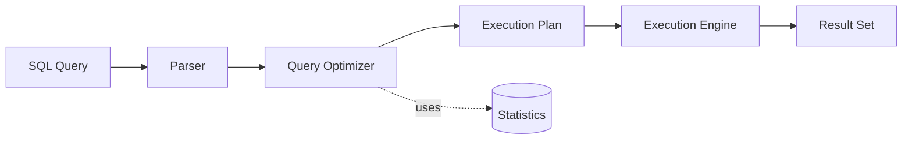

```sql
EXPLAIN ANALYZE
SELECT * FROM orders WHERE customer_id = 42;
```

### Cost-Based Optimization

Cost-Based Optimization (CBO) chooses among candidate execution plans by estimating each plan's "cost" — typically a weighted combination of estimated disk I/O, CPU usage, and memory — and selecting the lowest-cost plan. This is in contrast to older rule-based optimizers that applied fixed heuristics regardless of actual data distribution; CBO relies heavily on accurate table/index statistics to make good estimates.

### Statistics

Statistics are metadata the database maintains about tables and indexes — row counts, distinct value counts, data distribution histograms, and average row size — used by the cost-based optimizer to estimate how many rows a step in a plan will produce. Stale or missing statistics (e.g., after a bulk data load without an update) can cause the optimizer to pick a poor plan, so databases provide commands like `ANALYZE` (PostgreSQL) or `UPDATE STATISTICS` (SQL Server) to refresh them.

### Interview Questions

- **Q: What are the main stages a SQL query goes through before execution?**
  A: Parsing (syntax/semantic validation) → query optimization (choosing a plan) → execution plan generation → execution by the engine, returning the result set.
- **Q: What is the difference between `EXPLAIN` and `EXPLAIN ANALYZE`?**
  A: `EXPLAIN` shows the estimated execution plan without running the query, while `EXPLAIN ANALYZE` actually executes the query and reports real timing and row counts alongside the plan.
- **Q: Why can stale statistics cause slow queries even with the right indexes in place?**
  A: The optimizer relies on statistics to estimate row counts and selectivity; if stats are outdated, it may misjudge which index or join strategy is cheapest, picking an inefficient plan despite a good index existing.
- **Q: What is cost-based optimization and what factors typically make up the 'cost'?**
  A: An approach where the optimizer estimates and compares the resource cost (I/O, CPU, memory) of multiple candidate plans and picks the cheapest one, rather than relying purely on fixed rules.
- **Q: What would you check first if a query that used to be fast suddenly becomes slow?**
  A: Check the execution plan for changes (e.g., index no longer used, table scan appearing) and verify whether table statistics are outdated, especially after large data changes.
- **Q: Why might the query optimizer choose a full table scan over an available index?**
  A: If the optimizer estimates (via statistics) that the query will return a large fraction of the table's rows, a sequential scan can be cheaper than many random index lookups.
- **Q: What is the difference between a nested loop join and a hash join, at a conceptual level?**
  A: A nested loop join iterates one table's rows and searches the other table for matches per row (efficient for small/indexed inputs), while a hash join builds an in-memory hash table from one input and probes it with the other (efficient for large, unsorted inputs without indexes).
- **Q: Why does the number of possible execution plans grow so quickly with more joined tables?**
  A: Because the optimizer must consider different join orders, join algorithms, and access paths for each table, and the number of possible join orderings grows factorially with the number of tables.

## Database Design

### Requirement Analysis

Requirement analysis is the initial phase of database design where the designer gathers business needs from stakeholders — what data must be stored, how it will be used, expected volume/growth, and query patterns. Poor requirement analysis is one of the most common root causes of database designs that fail to scale or meet business needs later on.

### Conceptual Design

Conceptual design produces a high-level, technology-independent model of the data, typically an Entity-Relationship (ER) diagram identifying entities, attributes, and relationships (one-to-one, one-to-many, many-to-many) without worrying about how it will be implemented in a specific DBMS. This model is meant to be understandable by both technical and non-technical stakeholders.

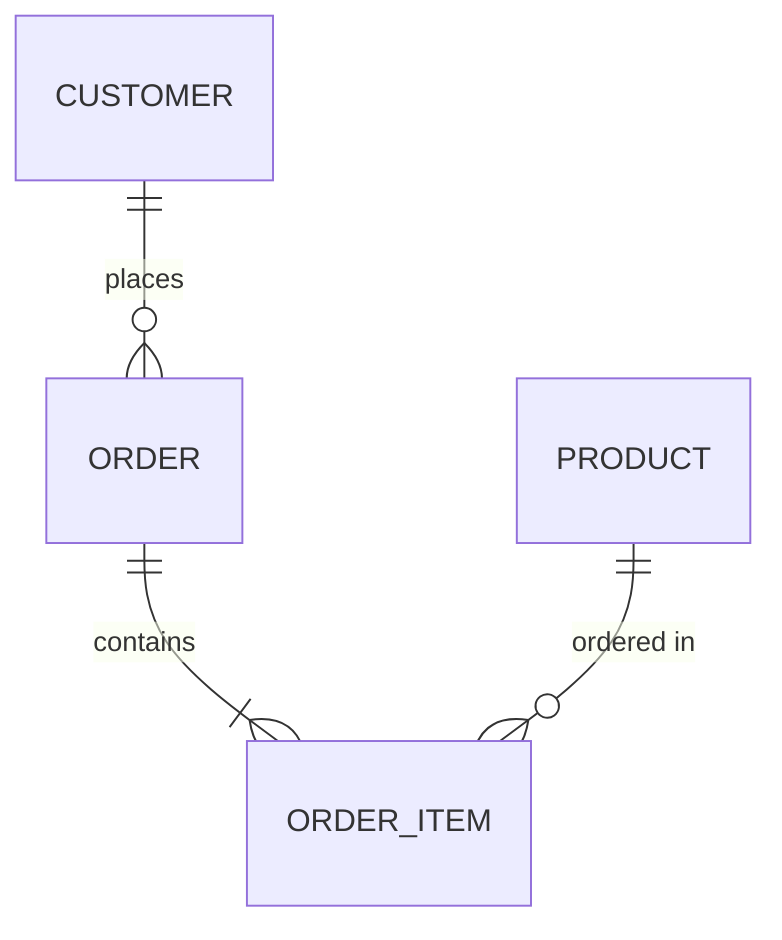

### Logical Design

Logical design translates the conceptual ER model into a structured schema — typically relational tables, columns, data types, primary/foreign keys, and constraints — while remaining independent of any specific database product. Normalization (1NF, 2NF, 3NF, BCNF) is applied at this stage to eliminate redundancy and update anomalies.

### Physical Design

Physical design determines how the logical schema is actually implemented and stored on a specific DBMS: choice of indexes, partitioning strategy, storage engine, file organization, and denormalization decisions made for performance. This stage is where trade-offs between normalization (data integrity) and performance (query speed) are made concretely.

### Schema Design Best Practices

- Normalize to at least 3NF to avoid update/insert/delete anomalies, then selectively denormalize only where performance profiling justifies it.
- Choose appropriate data types and constraints (`NOT NULL`, `CHECK`, foreign keys) to enforce integrity at the database level rather than relying solely on application code.
- Use surrogate keys (auto-increment/UUID) for primary keys when natural keys are unstable, composite, or may change.
- Index foreign key columns, since joins and cascading deletes commonly filter on them.
- Plan for growth: consider partitioning/sharding strategy and archival policy before the table grows too large to migrate easily.

### Interview Questions

- **Q: What are the main phases of database design, in order?**
  A: Requirement analysis → conceptual design (ER model) → logical design (normalized relational schema) → physical design (indexes, partitioning, storage-specific decisions).
- **Q: What is the difference between conceptual and logical design?**
  A: Conceptual design is a technology-independent, high-level model of entities and relationships (e.g., an ER diagram), while logical design translates that model into a concrete relational schema with tables, columns, and normalization applied.
- **Q: Why might a designer intentionally denormalize a schema during physical design?**
  A: To improve read performance for specific, frequent queries (e.g., avoiding expensive joins) at the cost of some data redundancy and more complex update logic.
- **Q: What could go wrong if requirement analysis is skipped or done poorly?**
  A: The resulting schema may not support required query patterns or scale, leading to costly redesigns, migrations, or workarounds later in the project.
- **Q: Why should foreign key columns typically be indexed?**
  A: Because joins, and cascading updates/deletes on the referenced table, frequently filter or look up rows by the foreign key column, and without an index this requires a full scan of the child table.
- **Q: What is a surrogate key and when would you prefer it over a natural key?**
  A: A surrogate key is an artificial identifier (e.g., auto-increment integer or UUID) with no business meaning; it's preferred when natural keys are composite, unstable, or subject to change, since changing a primary key value is disruptive.
- **Q: How does normalization relate to database design phases?**
  A: Normalization rules (1NF–BCNF) are primarily applied during logical design to structure the relational schema and prevent data anomalies, before physical performance considerations are layered on top.

## Database Performance Concepts

### Database Bottlenecks

A bottleneck is any resource or operation that limits the overall throughput of a database system — even if every other component is fast, the system as a whole is only as fast as its slowest constraint. Common bottlenecks include CPU saturation from complex query plans, disk I/O contention, lock contention on hot rows/tables, insufficient memory causing excessive disk reads, network latency between app and DB, and poorly designed indexes causing full table scans. Identifying bottlenecks typically involves query execution plans, slow query logs, and monitoring tools (CPU, I/O wait, lock wait times).

- **Advantages of identifying bottlenecks early:** targeted fixes, better capacity planning, predictable scaling
- **Disadvantages of ignoring them:** cascading slowdowns, timeouts, poor user experience under load

### Connection Management

Connection management refers to how an application opens, uses, and closes connections to the database. Each connection consumes server-side resources (memory, file handles, sometimes a dedicated process/thread), so uncontrolled connection creation can exhaust database limits and degrade performance. Proper connection management includes closing/releasing connections promptly, setting timeouts, and avoiding one-connection-per-request patterns without pooling.

### Connection Pooling (Concept)

Connection pooling maintains a pre-initialized set of reusable database connections that application threads borrow and return, instead of opening a new physical connection for every request. This avoids the overhead of TCP handshake, authentication, and session setup on every query, dramatically improving throughput under concurrent load.

```yaml
# Example: HikariCP connection pool configuration
spring:
  datasource:
    hikari:
      maximum-pool-size: 20
      minimum-idle: 5
      connection-timeout: 30000
      idle-timeout: 600000
      max-lifetime: 1800000
```

- **Advantages:** reduced connection setup overhead, controlled resource usage, better handling of traffic spikes
- **Disadvantages:** pool sizing is non-trivial (too small causes waiting, too large exhausts DB resources), stale/leaked connections can silently reduce pool capacity

### Caching Basics

Caching stores frequently accessed data in a faster storage layer (in-memory, closer to the application) to avoid repeated expensive database round-trips. Caches can live at multiple layers: application-level (e.g., local in-process cache), distributed cache (e.g., Redis/Memcached), or database-level (query cache, buffer pool). The main challenge is cache invalidation — ensuring cached data doesn't go stale when the underlying data changes.

- **Advantages:** lower latency, reduced database load, better scalability for read-heavy workloads
- **Disadvantages:** risk of serving stale data, added architectural complexity, cache invalidation bugs

### Read vs Write Performance

Read and write operations have different performance characteristics and often require different optimization strategies. Reads can be scaled horizontally via replicas and caching since they don't mutate state, while writes are harder to scale because they must maintain consistency and are typically bound to a single primary node (in traditional RDBMS setups). Indexes speed up reads but slow down writes (since indexes must be updated on every insert/update/delete), representing a classic trade-off.

| Aspect | Reads | Writes |
|---|---|---|
| Scalability | Easy (replicas, caching) | Harder (single source of truth) |
| Impact of indexes | Faster lookups | Slower due to index maintenance |
| Consistency concern | Can tolerate staleness (replicas) | Must be strongly consistent |

### Bulk Operations

Bulk operations perform inserts, updates, or deletes on many rows in a single statement or batch, rather than issuing one statement per row. Databases can optimize bulk operations internally (single transaction log entry, fewer round trips, batched index updates), making them far more efficient than row-by-row processing from the application.

```sql
-- Bulk insert example
INSERT INTO orders (customer_id, amount, status)
VALUES
  (101, 250.00, 'PENDING'),
  (102, 99.50, 'PENDING'),
  (103, 430.75, 'PENDING');
```

- **Advantages:** fewer network round-trips, reduced transaction overhead, better throughput
- **Disadvantages:** larger transactions can hold locks longer, harder to handle partial failures gracefully

### Batch Processing

Batch processing groups a large number of operations to be executed together, often on a schedule (e.g., nightly jobs), rather than processing each item immediately as it arrives. This is common for ETL jobs, report generation, and reconciliation tasks. Batch size tuning matters: too large a batch risks long transactions and memory pressure; too small negates the efficiency gains.

- **Advantages:** efficient resource utilization, predictable load windows, simpler error recovery (retry failed batch)
- **Disadvantages:** not suitable for real-time requirements, potential for large resource spikes during batch windows

### Interview Questions

- **Q: How would you diagnose a database performance bottleneck in production?**
  A: Check slow query logs and execution plans first, then monitor CPU/I/O/lock wait metrics, and correlate spikes with recent deploys or traffic patterns; use `EXPLAIN ANALYZE` to see if queries are doing full scans or missing indexes.
- **Q: Why is connection pooling important, and what happens if the pool size is misconfigured?**
  A: It reuses expensive-to-create connections; too small a pool causes request queuing/timeouts under load, too large a pool can exhaust the database's max connection limit and degrade server performance.
- **Q: What's the trade-off between adding more indexes and write performance?**
  A: Indexes speed up reads but every write must also update each index, increasing write latency and storage — indexes should be added based on actual query patterns, not preemptively.
- **Q: When would you choose caching over adding a read replica?**
  A: Caching is better for frequently-read, rarely-changing data with tolerable staleness (e.g., product catalog); read replicas are better when you need full relational query capability with near-real-time consistency.
- **Q: How do bulk operations improve performance compared to row-by-row processing?**
  A: They reduce network round trips and transaction/log overhead by batching many rows into fewer statements, letting the database optimize execution as a set operation.
- **Q: What risks come with very large batch or bulk transactions?**
  A: Long-held locks blocking other transactions, increased rollback segment/log usage, and larger blast radius if a failure occurs mid-batch.
- **Q: How would you design a system to handle a sudden spike in read traffic without touching write capacity?**
  A: Introduce caching (e.g., Redis) in front of the DB and/or add read replicas to offload SELECT queries from the primary, keeping writes isolated to the primary node.

## Database Security

### Authentication

Authentication verifies the identity of a user or application connecting to the database — confirming "who you are" via credentials such as passwords, certificates, tokens, or integrated identity providers (LDAP, Active Directory, OAuth). Strong authentication (e.g., multi-factor, certificate-based) reduces the risk of unauthorized access even if credentials leak.

### Authorization

Authorization determines "what an authenticated user is allowed to do" — controlling access to specific databases, tables, columns, or operations. It's typically enforced through a permission model (roles/privileges) evaluated after authentication succeeds. Authentication and authorization are distinct: you can be authenticated (identity confirmed) but not authorized to perform a given action.

### Roles

A role is a named collection of privileges that can be granted to users or other roles, simplifying permission management at scale. Instead of granting the same set of privileges to every user individually, you assign a role once and manage permissions centrally by updating the role.

```sql
-- Create a role and grant it to a user
CREATE ROLE read_only;
GRANT SELECT ON ALL TABLES IN SCHEMA public TO read_only;
GRANT read_only TO analyst_user;
```

- **Advantages:** centralized permission management, easier onboarding/offboarding, consistent access policies
- **Disadvantages:** role explosion if not designed carefully, can obscure exactly which privileges a user effectively has

### Privileges

Privileges are specific permissions to perform an action on a database object — e.g., `SELECT`, `INSERT`, `UPDATE`, `DELETE`, `EXECUTE`, or administrative privileges like `CREATE` or `DROP`. Following the principle of least privilege — granting only what's necessary — reduces the attack surface and limits the blast radius of a compromised account.

```sql
GRANT SELECT, INSERT ON orders TO app_user;
REVOKE DELETE ON orders FROM app_user;
```

### Encryption at Rest

Encryption at rest protects data stored on disk (data files, backups, logs) by encrypting it so that anyone with raw filesystem or storage access cannot read the data without the decryption key. This is typically implemented via transparent data encryption (TDE) at the storage engine level or disk/volume-level encryption.

### Encryption in Transit

Encryption in transit protects data as it moves across the network between client and database (or between replicas), typically using TLS/SSL. This prevents man-in-the-middle attacks and eavesdropping on credentials or sensitive data while in flight.

| Aspect | Encryption at Rest | Encryption in Transit |
|---|---|---|
| Protects against | Physical disk theft, unauthorized filesystem access | Network eavesdropping, MITM attacks |
| Typical mechanism | TDE, disk/volume encryption | TLS/SSL |
| Performance impact | Minimal (hardware-accelerated) | Slight handshake/connection overhead |
| Covers | Data files, backups, logs | Data on the wire |

### Auditing

Auditing records who accessed or modified what data and when, providing a trail for compliance (e.g., SOC 2, HIPAA, PCI-DSS) and forensic investigation after a security incident. Audit logs typically capture login attempts, privilege changes, and DML/DDL statements, and should themselves be protected from tampering.

- **Advantages:** compliance support, forensic traceability, deterrent against misuse
- **Disadvantages:** storage overhead for audit logs, potential performance impact if auditing is overly verbose

### SQL Injection (Overview)

SQL injection is an attack where untrusted input is concatenated directly into a SQL query, allowing an attacker to alter the query's logic — potentially exfiltrating data, bypassing authentication, or modifying/deleting records. The primary defense is using parameterized queries/prepared statements instead of string concatenation, along with input validation and least-privilege database accounts.

```sql
-- Vulnerable: string concatenation
-- "SELECT * FROM users WHERE username = '" + input + "'"
-- If input is:  ' OR '1'='1
-- Resulting query becomes: SELECT * FROM users WHERE username = '' OR '1'='1'

-- Safe: parameterized query
SELECT * FROM users WHERE username = ?;
```

### Interview Questions

- **Q: What is the difference between authentication and authorization?**
  A: Authentication verifies identity ("who are you"), while authorization determines what actions that verified identity is permitted to perform ("what can you do").
- **Q: Why are roles preferred over granting privileges directly to individual users?**
  A: Roles centralize privilege management — updating a role's permissions automatically applies to every user assigned that role, simplifying audits and reducing inconsistent access.
- **Q: How does encryption at rest differ from encryption in transit, and do you need both?**
  A: Encryption at rest protects stored data from unauthorized disk/storage access, while encryption in transit protects data moving across the network; most secure systems need both since they defend against different attack vectors.
- **Q: How would you prevent SQL injection in an application?**
  A: Always use parameterized queries or prepared statements (never string-concatenate user input into SQL), validate/sanitize input, and run the database account with least-privilege permissions.
- **Q: What is the principle of least privilege and why does it matter for database security?**
  A: Granting only the minimum permissions necessary for a user or service to perform its function, which limits the damage possible if credentials are compromised.
- **Q: What would you look for in a database audit log after a suspected breach?**
  A: Unusual login times/locations, failed authentication attempts, privilege escalation events, and unexpected DML/DDL activity on sensitive tables.
- **Q: A junior developer suggests storing passwords in plain text "since the database is encrypted at rest anyway." Why is this insufficient?**
  A: Encryption at rest only protects against raw disk access; anyone with valid database query access (or an SQL injection exploit) would still see plaintext passwords — passwords should be hashed with a strong algorithm (e.g., bcrypt) regardless of disk encryption.

## Backup and Recovery

### Full Backup

A full backup captures the entire database — all data files, schema, and typically enough metadata to restore the database to a standalone, consistent state. It's the simplest recovery method (one file/set to restore from) but the most time- and storage-intensive to create repeatedly.

```bash
# Example: full backup with pg_dump
pg_dump -U postgres -F c -f full_backup.dump mydatabase
```

### Incremental Backup

An incremental backup captures only the data that has changed since the **last backup of any type** (full or incremental). This makes incremental backups fast and small, but restoring requires the last full backup plus every incremental backup taken since, applied in sequence.

### Differential Backup

A differential backup captures all changes made since the **last full backup** (not since the last differential). This means differential backups grow larger over time until the next full backup, but restoring only requires the last full backup plus the single most recent differential.

| Aspect | Full | Incremental | Differential |
|---|---|---|---|
| Captures | Entire database | Changes since last backup (any type) | Changes since last full backup |
| Backup size/time | Largest | Smallest | Medium, grows until next full |
| Restore complexity | Simplest (1 file) | Most complex (full + all incrementals in order) | Moderate (full + latest differential) |
| Restore speed | Fast | Slowest | Faster than incremental |

### Point-in-Time Recovery

Point-in-time recovery (PITR) restores a database to a specific moment in time (e.g., just before an accidental `DROP TABLE`), rather than only to the moment of the last backup. It works by combining a base backup with the transaction/write-ahead log replayed up to the desired timestamp.

```bash
# Conceptual PITR flow with PostgreSQL
# 1. Restore base backup
# 2. Configure recovery_target_time in postgresql.conf / recovery.conf
recovery_target_time = '2026-08-01 14:30:00'
```

- **Advantages:** precise recovery from human error or corruption, minimizes data loss window
- **Disadvantages:** requires continuous log archiving (storage/operational overhead), replay time can be long for large logs

### Crash Recovery

Crash recovery is the automatic process a database performs on restart after an unexpected shutdown (power loss, crash) to restore the database to a consistent state. It typically uses the write-ahead log to redo committed transactions that weren't yet flushed to disk and undo uncommitted transactions that were partially applied.

### Write-Ahead Logging (WAL)

WAL is a technique where changes to data are first recorded in a durable log before being applied to the actual data files. This guarantees durability and enables crash recovery — since even if the database crashes before writing changes to disk, the log can be replayed to reconstruct the correct state.

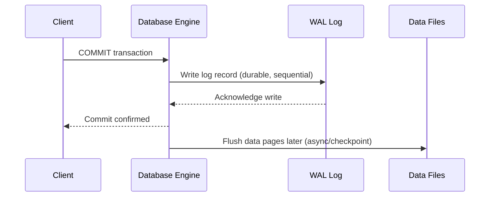

- **Advantages:** durability guarantee without requiring every data page write to be synchronous, faster commits (sequential log writes vs random data writes), enables crash recovery and replication
- **Disadvantages:** additional storage for logs, log management/archiving complexity

### Recovery Models

A recovery model defines how much transaction log history a database retains and how it's used for recovery — common models include Simple (minimal logging, no PITR, log space reused quickly), Full (all transactions logged, supports PITR, requires log backups), and Bulk-Logged (minimal logging for bulk operations, otherwise like Full). Choosing a recovery model is a trade-off between storage/performance overhead and recovery granularity.

- **Advantages of Full recovery model:** point-in-time recovery, minimal data loss
- **Disadvantages of Full recovery model:** requires regular log backups or the log file grows unbounded

### Interview Questions

- **Q: What's the difference between an incremental and a differential backup?**
  A: Incremental backs up changes since the last backup of any kind (chained, smaller each time), while differential backs up all changes since the last full backup (grows over time but simpler to restore).
- **Q: If you need the fastest possible restore time, which backup strategy would you choose and why?**
  A: Full backups restore fastest since only one file is needed; if using incremental/differential strategies for storage efficiency, differential offers a faster restore than incremental since only two backups (full + latest differential) are needed.
- **Q: How does point-in-time recovery work?**
  A: It restores a base backup and then replays the write-ahead log up to a specific timestamp, allowing recovery to a moment just before a problematic event like accidental data deletion.
- **Q: Why is write-ahead logging important for durability?**
  A: By writing changes to a durable log before applying them to data files, the database guarantees committed transactions survive a crash — recovery simply replays the log rather than relying on data files always being fully up to date.
- **Q: What happens during crash recovery when the database restarts unexpectedly?**
  A: The engine reads the WAL, redoes committed transactions not yet flushed to disk, and undoes any uncommitted/partial transactions, bringing the database back to a consistent state.
- **Q: An engineer accidentally runs `DELETE FROM orders` without a WHERE clause at 2:15 PM. How would you recover the data?**
  A: Use point-in-time recovery — restore the most recent base backup and replay the WAL/transaction log up to just before 2:15 PM, then validate and cut over.
- **Q: What's the trade-off of choosing the Simple recovery model over Full?**
  A: Simple has lower log storage/management overhead but sacrifices point-in-time recovery — you can only restore to the last full/differential backup, not to an arbitrary moment.
- **Q: Why might a full backup every night still not be sufficient for a critical production database?**
  A: A full nightly backup only allows recovery to the last backup point, potentially losing up to a day's data on failure; combining it with continuous WAL archiving enables point-in-time recovery to minimize data loss.

## Database Scalability

### Vertical Scaling

Vertical scaling (scaling up) increases capacity by adding more resources — CPU, RAM, faster disks — to a single existing server. It's simple to implement (no application changes) but has a hard ceiling (hardware limits) and typically requires downtime to apply, plus the single node remains a single point of failure.

### Horizontal Scaling

Horizontal scaling (scaling out) increases capacity by adding more servers/nodes and distributing load across them. It offers near-limitless scalability and improved fault tolerance, but requires the application/database to support data distribution (replication, sharding) and handle the added complexity of coordination between nodes.

| Aspect | Vertical Scaling | Horizontal Scaling |
|---|---|---|
| Approach | Bigger single machine | More machines |
| Ceiling | Hardware limit | Practically unlimited |
| Complexity | Low (no app changes) | Higher (distribution, consistency) |
| Fault tolerance | Single point of failure | Can tolerate node failures |
| Downtime to scale | Often required | Can often be done without downtime |

### Replication

Replication maintains copies of the same data on multiple database nodes, keeping them synchronized so that reads (and sometimes failover writes) can be served from more than one place. Replication can be synchronous (all replicas confirm before commit — strong consistency, higher latency) or asynchronous (primary commits immediately, replicas catch up — lower latency, risk of replica lag/data loss on failover).

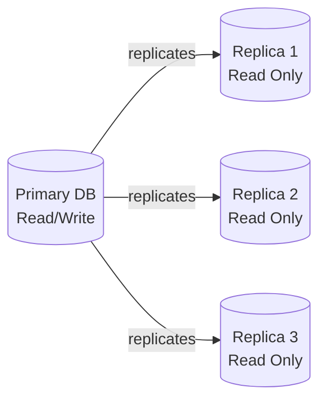

- **Advantages:** improved read throughput, high availability/failover capability, geographic distribution for lower latency
- **Disadvantages:** replication lag can cause stale reads, added operational complexity, write throughput still limited by primary

### Read Replicas

Read replicas are replicated copies of a database used specifically to offload read (SELECT) traffic from the primary node, which continues handling all writes. This is a common pattern for read-heavy applications like e-commerce catalogs, where product browsing traffic vastly outweighs order-write traffic.

**Real-life scenario:** An e-commerce site during a flash sale has thousands of users browsing products (reads) but comparatively few completing checkout (writes). By routing product search/browse queries to read replicas and sending only checkout/order writes to the primary, the primary stays responsive under heavy read load.

### Sharding (Overview)

Sharding splits a dataset horizontally across multiple independent database instances (shards), where each shard holds a subset of the rows, typically partitioned by a shard key (e.g., customer ID range or hash). Unlike replication, shards do not each hold the full dataset — together they hold the complete data, enabling both storage and write-throughput scaling.

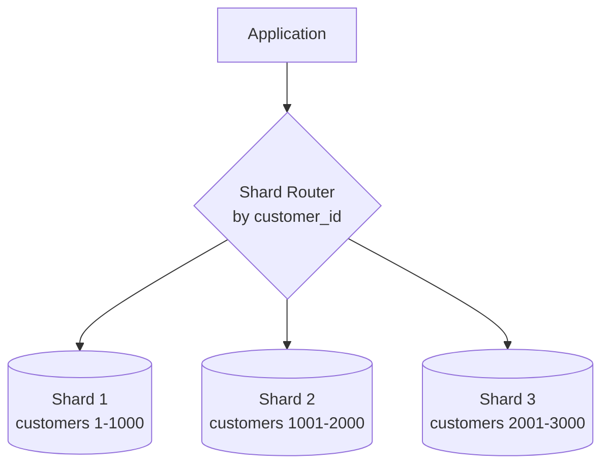

- **Advantages:** scales both storage and write throughput, smaller indexes/datasets per node improve performance
- **Disadvantages:** cross-shard queries/joins are complex and slow, rebalancing shards is operationally difficult, transactions spanning shards require distributed transaction coordination

### Partitioning (Overview)

Partitioning divides a large table into smaller, more manageable pieces (partitions), typically within a single database instance, based on a partition key such as date range, list, or hash. Unlike sharding, partitioning usually doesn't distribute data across separate servers — it's a way to improve query performance and manageability (e.g., dropping an old partition instead of deleting rows) within one database.

| Aspect | Sharding | Partitioning |
|---|---|---|
| Scope | Across multiple servers/instances | Usually within a single database instance |
| Goal | Scale storage/throughput horizontally | Improve query performance & manageability |
| Query routing | Application/router must know shard location | Handled transparently by the database engine |
| Complexity | High (cross-shard joins, rebalancing) | Lower (still one logical database) |

### Interview Questions

- **Q: What is the fundamental difference between vertical and horizontal scaling?**
  A: Vertical scaling adds more resources to a single machine, while horizontal scaling adds more machines and distributes load/data across them; horizontal scaling offers a higher ceiling but more complexity.
- **Q: When would you introduce read replicas versus sharding?**
  A: Read replicas solve read-heavy scaling where the full dataset still fits on one primary node and writes are moderate; sharding is needed when the dataset or write throughput itself is too large for a single node.
- **Q: What is the risk of asynchronous replication in a failover scenario?**
  A: Because replicas may lag behind the primary, a failover to a replica can lose the most recent uncommitted-to-replica writes, causing data loss or inconsistency.
- **Q: How is sharding different from partitioning?**
  A: Sharding distributes data across multiple separate database servers/instances, while partitioning splits a table into smaller pieces typically within a single database instance for manageability and performance.
- **Q: Design scenario: An e-commerce platform's product catalog reads are 100x more frequent than order writes. How would you scale this?**
  A: Add read replicas for the catalog/browse queries and route all writes (orders, inventory updates) to the primary, potentially adding caching in front of the replicas for further read scaling.
- **Q: What challenges arise when querying across multiple shards?**
  A: Joins and aggregations across shards require scatter-gather queries, application-level merging, and can't rely on database-native joins, making cross-shard queries slower and more complex than single-node queries.
- **Q: Why can't you simply add unlimited RAM/CPU as a permanent scaling strategy?**
  A: Vertical scaling hits physical/hardware ceilings and cost inefficiencies, and a single node remains a single point of failure regardless of its size.
- **Q: What is replication lag and how can it affect application behavior?**
  A: Replication lag is the delay between a write on the primary and its propagation to replicas; applications reading from a replica right after a write on the primary may see stale data (a "read-your-own-write" consistency problem).

## Distributed Databases

### Distributed Database Basics

A distributed database spans multiple physical nodes (often across different machines, racks, or geographic regions) while presenting a logical view to applications, as opposed to a single-node database. Key challenges unique to distributed systems include network partitions, clock synchronization, coordinating consistency across nodes, and handling partial failures gracefully.

- **Advantages:** high availability, fault tolerance, geographic scalability, no single point of failure
- **Disadvantages:** increased complexity, network latency between nodes, harder to reason about consistency and debugging

### CAP Theorem

The CAP theorem states that a distributed system can only guarantee two of the following three properties simultaneously during a network partition: **C**onsistency (every read receives the most recent write), **A**vailability (every request receives a non-error response), and **P**artition tolerance (the system continues operating despite network partitions). Since network partitions are unavoidable in real distributed systems, the practical choice is really between CP (consistent but may reject requests during a partition) and AP (available but may return stale data during a partition).

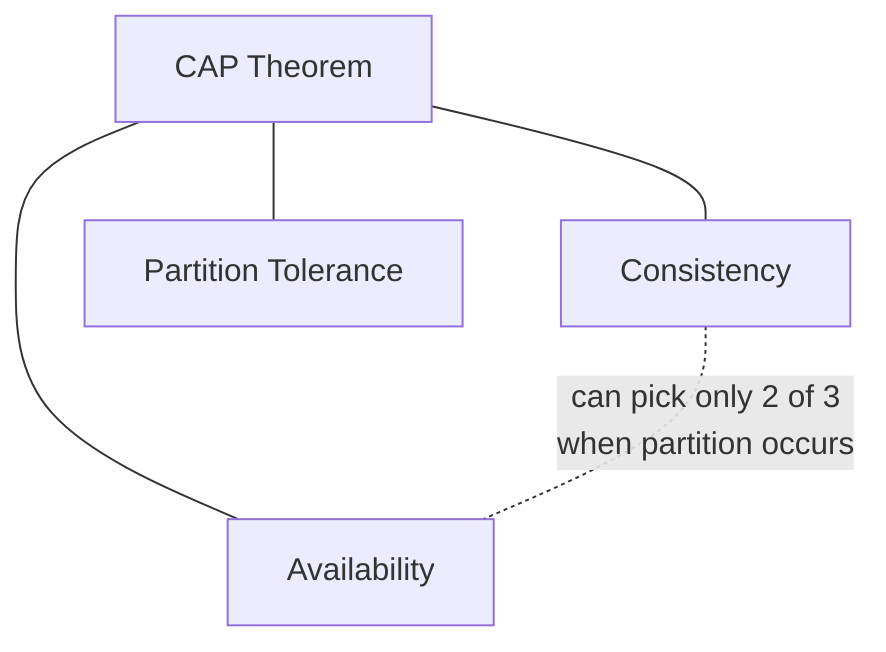

- **Advantages of understanding CAP:** guides correct database choice for use case (e.g., banking vs social media feed)
- **Disadvantages/limitations:** CAP is often oversimplified — real systems make nuanced trade-offs (see PACELC) rather than a strict binary choice

### Consistency Models

A consistency model defines the guarantees a distributed system provides about the order and visibility of reads/writes across nodes. Common models range from strong consistency (all nodes see the same data at the same time, as if there were only one copy) to eventual consistency (nodes converge to the same value over time but may temporarily diverge), with intermediate models like causal consistency and read-your-writes consistency in between.

### Eventual Consistency

Eventual consistency guarantees that, if no new updates are made, all replicas will eventually converge to the same value — but at any given moment, different nodes might return different (stale) results. This model favors availability and low latency over immediate consistency, and is common in systems like DNS, shopping cart services, and many NoSQL databases.

**Real-life scenario:** When you like a post on a social media app, your friend on the other side of the world might not see the updated like count for a second or two — the system prioritizes fast, always-available responses over instant global consistency.

- **Advantages:** high availability, low latency, better partition tolerance
- **Disadvantages:** applications must tolerate temporarily stale/conflicting reads, requires conflict resolution strategies (e.g., last-write-wins, vector clocks)

### Two-Phase Commit (2PC)

Two-phase commit is a protocol for achieving atomic commitment of a transaction across multiple distributed nodes. In the **prepare phase**, a coordinator asks all participants if they can commit; each participant locks resources and replies yes/no. In the **commit phase**, if all participants voted yes, the coordinator tells everyone to commit; if any voted no (or timed out), the coordinator tells everyone to abort.

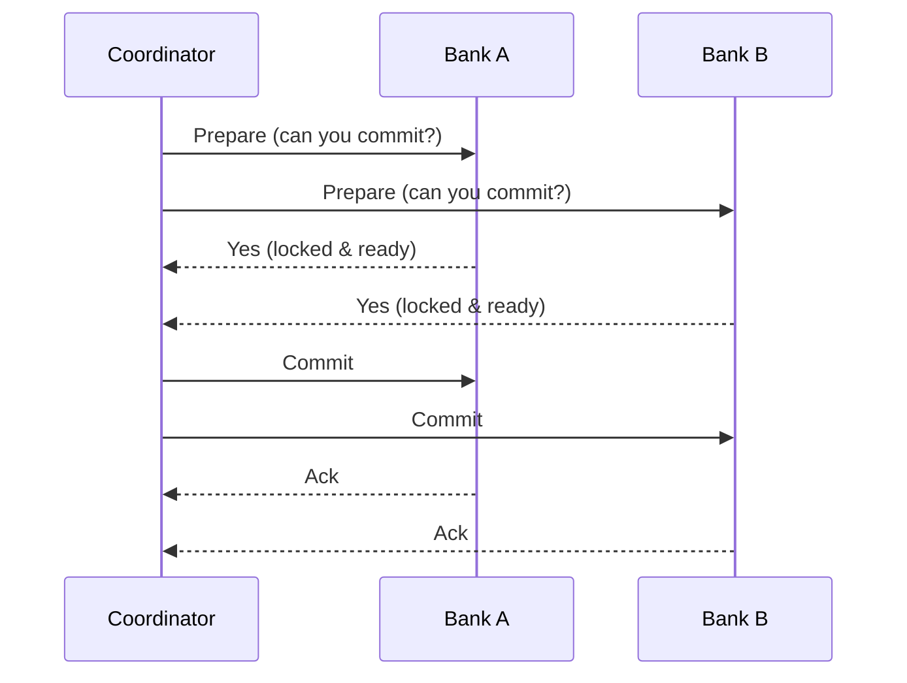

**Real-life scenario:** Transferring money between two different banks requires debiting Bank A's account and crediting Bank B's account atomically — 2PC ensures either both operations succeed or both are rolled back, preventing money from vanishing or being duplicated.

- **Advantages:** strong atomicity guarantee across distributed participants
- **Disadvantages:** blocking protocol (if coordinator crashes after prepare, participants can be stuck holding locks), poor performance/latency, single point of failure at the coordinator

### Distributed Transactions (Overview)

A distributed transaction spans multiple databases or services and must satisfy ACID properties across all of them as a single logical unit of work. This is significantly harder than single-node transactions because it requires coordination protocols (like 2PC) or compensating mechanisms (like the Saga pattern) to handle partial failures across network boundaries.

- **Advantages:** enables consistent multi-service/multi-database operations
- **Disadvantages:** higher latency, reduced availability during coordination, complex failure handling; many modern microservice architectures avoid them in favor of eventual consistency + compensating transactions (Sagas)

### Consensus Algorithms (Overview)

Consensus algorithms (such as Paxos and Raft) allow a group of distributed nodes to agree on a single value or sequence of operations, even in the presence of node failures or network issues, without a single point of failure like a 2PC coordinator. They typically work by electing a leader and requiring a majority (quorum) of nodes to agree before a value is considered committed, which is how distributed databases and coordination systems (e.g., etcd, ZooKeeper, many replicated databases) maintain a consistent replicated log.

- **Advantages:** fault-tolerant agreement without a single coordinator bottleneck, well-understood formal correctness guarantees
- **Disadvantages:** requires a majority of nodes to be available (quorum), added latency from multi-node coordination, complex to implement correctly

### Interview Questions

- **Q: Explain the CAP theorem and why you can't have all three guarantees at once during a partition.**
  A: During a network partition, a node must choose between responding with potentially stale data (favoring Availability) or refusing to respond until it can confirm consistency (favoring Consistency) — it cannot guarantee both simultaneously while the partition persists, though Partition tolerance itself is a given in real distributed systems.
- **Q: Would you choose a CP or AP system for a banking ledger, and why?**
  A: CP — banking requires strong consistency (accurate balances) even at the cost of temporary unavailability during a partition, since serving stale/incorrect balance data could cause serious financial errors.
- **Q: Would you choose a CP or AP system for a social media "like" counter, and why?**
  A: AP — availability and low latency matter more than perfect real-time accuracy; eventual consistency is an acceptable trade-off since a slightly stale like count has no serious consequence.
- **Q: What is the main weakness of the two-phase commit protocol?**
  A: It's a blocking protocol — if the coordinator crashes after participants have voted "yes" and locked resources but before sending the commit/abort decision, participants can be left blocked holding locks indefinitely.
- **Q: How does eventual consistency differ from strong consistency, and where is it acceptable?**
  A: Eventual consistency allows temporary divergence between replicas that converges over time, trading immediate accuracy for availability/performance; it's acceptable for data where slight staleness has low impact, like view counts or non-critical caches, but not for financial balances.
- **Q: How do consensus algorithms like Raft avoid the single-point-of-failure problem seen in 2PC?**
  A: They use leader election and majority quorum agreement rather than depending on a single fixed coordinator — if a leader fails, a new leader is elected and the cluster continues operating as long as a majority of nodes are reachable.
- **Q: Scenario: You need to transfer inventory between two microservices' separate databases atomically. Would you use 2PC or an alternative?**
  A: In modern microservice architectures, the Saga pattern (a sequence of local transactions with compensating actions on failure) is generally preferred over 2PC, since 2PC's blocking nature and tight coupling hurt availability and scalability.
- **Q: What is a quorum in the context of consensus algorithms, and why is majority used rather than requiring all nodes?**
  A: A quorum is the minimum number of nodes that must agree for a decision to be committed; requiring only a majority (not all nodes) allows the system to keep operating and making progress even if a minority of nodes are down or unreachable.

## Object Relational Mapping (Pre-JPA Concepts)

### Object-Relational Impedance Mismatch

The object-relational impedance mismatch describes the fundamental conceptual differences between object-oriented programming models (objects, inheritance, references, graphs) and relational database models (tables, rows, foreign keys, normalized data). For example, object inheritance has no direct equivalent in relational schemas, and object graphs with circular references don't map cleanly to normalized tables — this mismatch is the core problem ORMs try to solve.

### Mapping Objects to Tables

Mapping objects to tables is the process of defining how a class's fields correspond to a table's columns, how object references correspond to foreign keys, and how collections correspond to child tables or join tables. Strategies include table-per-class, table-per-hierarchy (single table for a class hierarchy with a discriminator column), and table-per-subclass (separate tables joined by primary key).

```sql
-- Simple object-to-table mapping example
-- Class: Order { id, customerId, amount, status }
CREATE TABLE orders (
  id BIGINT PRIMARY KEY,
  customer_id BIGINT REFERENCES customers(id),
  amount DECIMAL(10,2),
  status VARCHAR(20)
);
```

### Identity vs Equality

Identity refers to whether two references point to the exact same object instance in memory (`==` in Java), while equality refers to whether two objects are considered logically equivalent based on their state (`.equals()`). In an ORM context, this gets more nuanced: two different object instances loaded from the same database row (same primary key) are equal in the database sense but might not be the same Java object instance unless the ORM's identity map/session ensures it.

| Aspect | Identity | Equality |
|---|---|---|
| Meaning | Same object instance in memory | Same logical value/state |
| Java operator | `==` | `.equals()` |
| Database analog | Same primary key within one session/identity map | Same column values |

### Entity Lifecycle (Concept)

An entity's lifecycle describes the states it moves through in relation to a persistence context: **Transient** (a plain object not yet associated with any database row or session), **Persistent/Managed** (associated with an active session and tracked for changes), **Detached** (was persistent but the session has closed, so changes are no longer tracked), and **Removed** (marked for deletion).

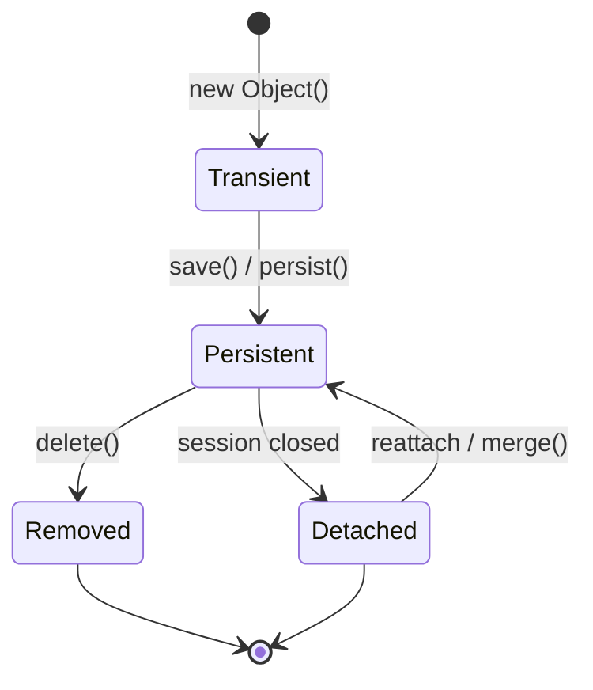

### Lazy Loading (Concept)

Lazy loading defers fetching related/associated data until it is actually accessed, rather than loading everything upfront. For example, loading an `Order` object might not immediately fetch its list of `OrderItems` from the database — those are fetched only when the `.getItems()` accessor is called. This improves initial load performance but requires an active session/connection at the time of access, or it fails (a common "LazyInitializationException"-style issue).

- **Advantages:** faster initial object loading, avoids fetching unused data, reduces memory footprint
- **Disadvantages:** risk of the N+1 query problem, requires the session to still be open when lazy data is accessed

### Eager Loading (Concept)

Eager loading fetches an object along with all its related/associated data immediately, typically in a single query (often using a JOIN). This guarantees the data is available even after the session closes, but can waste resources fetching data the caller never uses, and can produce very large result sets for deeply nested object graphs.

| Aspect | Lazy Loading | Eager Loading |
|---|---|---|
| When data is fetched | On first access | Immediately, upfront |
| Initial query cost | Lower | Higher (joins/multiple fetches) |
| Risk | N+1 queries, stale session errors | Over-fetching unused data |
| Best for | Rarely-accessed associations | Associations almost always needed together |

### N+1 Query Problem (Concept)

The N+1 query problem occurs when code fetches a list of N parent entities with one query, then triggers a separate query for each parent's related data (lazily loaded), resulting in 1 + N total queries instead of a single efficient join. This is one of the most common ORM performance pitfalls, especially in loops that access lazy associations.

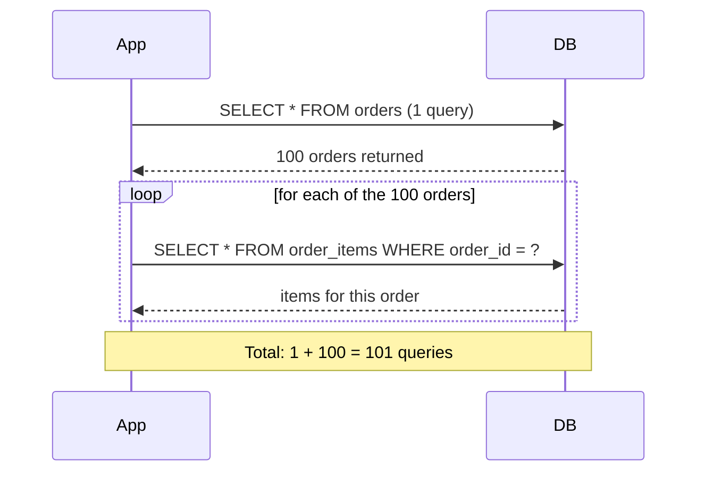

**Fix approaches:** use eager fetch joins for known access patterns, batch fetching (`@BatchSize`-style hints), or explicit `JOIN FETCH` queries to collapse N+1 queries into one or a few.

### Cascading Operations (Concept)

Cascading operations propagate a persistence action (save, update, delete) from a parent entity to its related child entities automatically, so the application doesn't need to manually manage each related entity. For example, deleting an `Order` with cascade delete configured would automatically delete its associated `OrderItems`.

- **Advantages:** less boilerplate code, ensures referential consistency for owned/dependent entities
- **Disadvantages:** can cause unintended mass deletes/updates if misconfigured, makes the true scope of an operation less visible at the call site

### Interview Questions

- **Q: What is the object-relational impedance mismatch, and why do ORMs exist?**
  A: It's the mismatch between object-oriented concepts (inheritance, object graphs, references) and relational concepts (flat tables, foreign keys, normalized rows); ORMs exist to bridge this gap so developers can work with objects while data is persisted relationally.
- **Q: Explain the difference between identity and equality in the context of an ORM session.**
  A: Identity means two references point to the literal same object instance; equality means two objects have the same logical state. Within a single ORM session/identity map, loading the same row twice typically returns the same object instance (identity holds), but across sessions you may get equal-but-not-identical objects.
- **Q: Describe the lifecycle states of a persistent entity.**
  A: Transient (not yet persisted), Persistent/Managed (tracked by an active session), Detached (was persisted, session now closed, changes untracked), and Removed (marked for deletion) — transitions occur via save/persist, session close, merge/reattach, and delete.
- **Q: What is the N+1 query problem and how would you detect it?**
  A: It's when fetching N parent rows triggers N additional queries for lazily-loaded child associations instead of one combined query; it's detected by enabling SQL logging/query counting in tests or profiling and seeing a suspiciously high query count proportional to result set size.
- **Q: How would you fix an N+1 query problem in a reporting endpoint that loads 1000 orders and their items?**
  A: Replace the lazy per-order fetch with a single `JOIN FETCH` query (or equivalent eager join) that retrieves orders and their items together, or use a batch-fetch size hint so items are fetched in grouped batches rather than one query per order.
- **Q: When would you choose lazy loading over eager loading for an association?**
  A: When the association is large, expensive to fetch, and not needed in most use cases (e.g., a user's full activity history) — lazy loading avoids the cost until it's actually required.
- **Q: What risk does lazy loading introduce if you try to access an association after the session has closed?**
  A: It typically throws a lazy-initialization error because the session needed to fetch the data on demand is no longer available — the fix is to eager-fetch known-needed associations or keep the session open (with care) for the required scope.
- **Q: Why can cascading deletes be dangerous if misconfigured?**
  A: A cascade delete on a parent can silently delete far more data than intended (e.g., deleting a category cascades to delete all products in it), so cascade rules must be deliberately scoped to true parent-owned/dependent relationships.
