# Structured Query Language(SQL)

## SQL Fundamentals

### What is SQL?

SQL (Structured Query Language) is a domain-specific, declarative language used to define, manipulate, and query data held in relational database management systems (RDBMS). "Declarative" means you describe *what* result you want, not *how* to compute it — the database's query optimizer decides the execution strategy (which indexes to use, join order, etc.).

- It operates on data organized as tables (relations) made up of rows (tuples) and columns (attributes).
- It is used across nearly every RDBMS (PostgreSQL, MySQL, Oracle, SQL Server, SQLite) with a common core syntax plus vendor-specific extensions.
- SQL is both a data definition tool (creating schema) and a data manipulation/query tool, unlike general-purpose languages that require explicit control flow to process data.

```sql
-- Declarative: describe the "what", not the "how"
SELECT customer_id, SUM(amount) AS total_spent
FROM orders
WHERE order_date >= '2024-01-01'
GROUP BY customer_id
ORDER BY total_spent DESC;
```

**Real-life scenario:** A reporting dashboard needs "top spending customers this year." Instead of writing a loop that iterates over every order row and manually accumulates totals, SQL lets you express the aggregation directly and lets the database engine optimize execution (e.g., using an index on `order_date`).

### SQL Standards

SQL is standardized by ANSI (American National Standards Institute) and ISO/IEC, with the first standard published in 1986 (SQL-86) and major revisions since (SQL-92, SQL:1999, SQL:2003, SQL:2011, SQL:2016, SQL:2023 — each adding features like window functions, JSON support, recursive queries, and temporal tables).

- The standard defines core syntax and behavior that all compliant databases should support (e.g., `SELECT`, `JOIN`, `WHERE`, transactions).
- No database vendor is 100% standard-compliant; each has extensions and deviations for performance, usability, or historical reasons.
- Standards compliance matters for portability — code written against pure ANSI SQL is more likely to run unchanged across different database engines.

| Standard | Year | Notable Additions |
|---|---|---|
| SQL-86 / SQL-89 | 1986/1989 | Initial standard |
| SQL-92 | 1992 | Joins, `CASE` expressions |
| SQL:1999 | 1999 | Recursive queries, triggers, OO extensions |
| SQL:2003 | 2003 | Window functions, `MERGE`, sequences |
| SQL:2011 | 2011 | Temporal (time-versioned) tables |
| SQL:2016 | 2016 | JSON support, row pattern matching |

### SQL Dialects (PostgreSQL, MySQL, Oracle, SQL Server)

While all major RDBMS implement the ANSI SQL core, each has its own "dialect" with unique syntax, functions, and data types. Understanding these differences is critical when writing portable code or migrating between databases.

| Feature | PostgreSQL | MySQL | Oracle | SQL Server |
|---|---|---|---|---|
| Auto-increment | `SERIAL` / `GENERATED ALWAYS AS IDENTITY` | `AUTO_INCREMENT` | `IDENTITY` / sequences | `IDENTITY` |
| Limit rows | `LIMIT n OFFSET m` | `LIMIT n OFFSET m` | `FETCH FIRST n ROWS ONLY` | `TOP n` / `OFFSET-FETCH` |
| String concat | `\|\|` | `CONCAT()` | `\|\|` | `+` |
| Upsert | `INSERT ... ON CONFLICT` | `INSERT ... ON DUPLICATE KEY UPDATE` | `MERGE` | `MERGE` |
| Case-insensitive LIKE | `ILIKE` | `LIKE` (default collation dependent) | `LIKE` + `UPPER()` | `LIKE` (collation dependent) |
| JSON support | `JSON` / `JSONB` | `JSON` | `JSON` (21c+) | `JSON` functions on `NVARCHAR` |

```sql
-- PostgreSQL pagination
SELECT * FROM products ORDER BY id LIMIT 10 OFFSET 20;

-- SQL Server pagination
SELECT * FROM products ORDER BY id OFFSET 20 ROWS FETCH NEXT 10 ROWS ONLY;

-- Oracle pagination (12c+)
SELECT * FROM products ORDER BY id OFFSET 20 ROWS FETCH NEXT 10 ROWS ONLY;
```

**Why it matters:** Application code that hardcodes a dialect-specific feature (e.g., `LIMIT`) will break when porting to SQL Server without rewriting. ORMs like Hibernate/JPA abstract this away via database "dialect" classes.

### SQL Statement Categories (DDL, DML, DQL, DCL, TCL)

SQL statements are grouped into categories based on their purpose:

- **DDL (Data Definition Language):** Defines/alters schema structure — `CREATE`, `ALTER`, `DROP`, `TRUNCATE`. Usually auto-commits in most databases.
- **DML (Data Manipulation Language):** Modifies data — `INSERT`, `UPDATE`, `DELETE` (some include `MERGE`).
- **DQL (Data Query Language):** Retrieves data — `SELECT`. Sometimes considered part of DML.
- **DCL (Data Control Language):** Manages permissions — `GRANT`, `REVOKE`.
- **TCL (Transaction Control Language):** Manages transactions — `COMMIT`, `ROLLBACK`, `SAVEPOINT`, `SET TRANSACTION`.

```sql
-- DDL
CREATE TABLE employees (id INT PRIMARY KEY, name VARCHAR(100));

-- DML
INSERT INTO employees (id, name) VALUES (1, 'Alice');
UPDATE employees SET name = 'Alicia' WHERE id = 1;

-- DQL
SELECT * FROM employees;

-- DCL
GRANT SELECT ON employees TO reporting_user;

-- TCL
BEGIN;
UPDATE employees SET name = 'Bob' WHERE id = 1;
COMMIT;
```

### SQL Execution Order

SQL is written in a fixed clause order, but the database engine *processes* clauses in a different logical order. Understanding this is essential for debugging why an alias can't be used in `WHERE`, or why `HAVING` runs after `GROUP BY`.

**Written order:** `SELECT` → `FROM` → `JOIN` → `WHERE` → `GROUP BY` → `HAVING` → `ORDER BY` → `LIMIT`

**Logical execution order:**

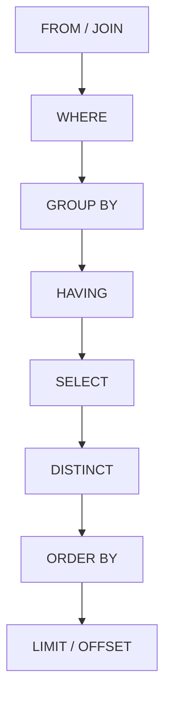

- `FROM`/`JOIN` builds the initial working row set.
- `WHERE` filters individual rows before grouping (cannot reference aggregate results).
- `GROUP BY` collapses rows into groups.
- `HAVING` filters groups (can reference aggregates like `COUNT(*)`).
- `SELECT` computes output expressions/aliases.
- `ORDER BY` can reference `SELECT` aliases because it runs after `SELECT`.
- `LIMIT`/`OFFSET` trims the final result set last.

```sql
-- This works: alias defined in SELECT can be used in ORDER BY (runs later)
SELECT customer_id, SUM(amount) AS total_spent
FROM orders
GROUP BY customer_id
ORDER BY total_spent DESC;

-- This FAILS: WHERE runs before SELECT, so the alias doesn't exist yet
SELECT customer_id, SUM(amount) AS total_spent
FROM orders
WHERE total_spent > 100  -- error: column "total_spent" does not exist
GROUP BY customer_id;
```

#### Interview Questions

1. **Is SQL a procedural or declarative language, and what does that mean in practice?**
   SQL is declarative — you specify the desired result set, not the step-by-step algorithm to compute it. The query optimizer chooses the physical execution plan (join order, index usage), which is why the same query can perform differently across databases or after statistics change.
2. **Why can't you use a `SELECT` alias in a `WHERE` clause, but you can in `ORDER BY`?**
   Because of logical execution order: `WHERE` is evaluated before `SELECT`, so column aliases defined in `SELECT` don't exist yet. `ORDER BY` (and `HAVING` in some databases) executes after `SELECT`, so aliases are already resolved and usable.
3. **What's the difference between DDL and DML, and why does it matter for transactions?**
   DDL (`CREATE`, `ALTER`, `DROP`) defines schema structure; DML (`INSERT`, `UPDATE`, `DELETE`) modifies data. In many databases (e.g., MySQL, Oracle), DDL statements implicitly commit the current transaction, meaning you can't roll back a `CREATE TABLE` inside a transaction the way you can an `UPDATE`.
4. **Give an example of a SQL dialect difference that could break portability between MySQL and PostgreSQL.**
   Auto-increment columns: MySQL uses `AUTO_INCREMENT` while PostgreSQL uses `SERIAL` or `GENERATED ALWAYS AS IDENTITY`. Similarly, upsert syntax differs (`ON DUPLICATE KEY UPDATE` vs `ON CONFLICT ... DO UPDATE`), requiring dialect-aware code or ORM abstraction.
5. **Where does `HAVING` fit in the logical execution order, and why can't `WHERE` be used instead for filtering on aggregates?**
   `HAVING` executes after `GROUP BY`, once aggregates are computed, so it can filter on expressions like `COUNT(*) > 5`. `WHERE` executes before grouping/aggregation, so at that point aggregate values don't exist yet — using an aggregate in `WHERE` raises an error.
6. **What are TCL statements and why are they a separate category from DML?**
   TCL (Transaction Control Language: `COMMIT`, `ROLLBACK`, `SAVEPOINT`) manages the scope and durability of a set of DML changes as a unit, rather than modifying data itself. They enforce ACID guarantees by letting you group multiple DML operations into an atomic unit of work.

## Database Objects

### Databases

A database is the top-level container that holds schemas, tables, and other objects, along with its own configuration (character set, collation, connection limits). In most RDBMS, a server instance can host multiple independent databases, each isolated from the others (you typically can't join tables across databases without special cross-database features).

```sql
CREATE DATABASE ecommerce
  WITH ENCODING = 'UTF8';

-- Switch context (client/tool specific, e.g., psql)
\c ecommerce
```

- Provides isolation boundary for security, backup, and resource management.
- Each database has its own set of schemas/namespaces.
- In MySQL, "database" and "schema" are effectively synonyms; in PostgreSQL/Oracle/SQL Server, a database contains one or more schemas.

### Schemas

A schema is a logical namespace within a database that groups related tables, views, and other objects. Schemas allow multiple applications or teams to share a database while avoiding naming collisions, and they enable fine-grained access control.

```sql
CREATE SCHEMA sales;
CREATE SCHEMA inventory;

CREATE TABLE sales.orders (id INT PRIMARY KEY, amount NUMERIC);
CREATE TABLE inventory.products (id INT PRIMARY KEY, name VARCHAR(100));

-- Fully qualified reference
SELECT * FROM sales.orders;
```

**Real-life scenario:** A multi-tenant SaaS application might use one schema per tenant (`tenant_123.orders`) within a single database, simplifying tenant isolation and backup/restore per customer without provisioning a whole new database server.

### Tables

A table is the fundamental storage structure in a relational database — a two-dimensional structure of rows and columns, where each column has a defined data type and each row represents one record/entity instance.

```sql
CREATE TABLE employees (
    id          INT PRIMARY KEY,
    first_name  VARCHAR(50) NOT NULL,
    last_name   VARCHAR(50) NOT NULL,
    hire_date   DATE,
    salary      NUMERIC(10, 2)
);
```

- Rows are unordered by default — retrieval order is only guaranteed with an explicit `ORDER BY`.
- Tables can be permanent, temporary (session-scoped), or unlogged (PostgreSQL, skips WAL for speed at the cost of durability).

### Views

A view is a stored, named `SELECT` query that behaves like a virtual table — it doesn't store data itself (unlike a materialized view) but re-executes its underlying query every time it's referenced.

```sql
CREATE VIEW high_value_orders AS
SELECT order_id, customer_id, amount
FROM orders
WHERE amount > 1000;

SELECT * FROM high_value_orders WHERE customer_id = 42;
```

- Simplifies complex/repeated queries by giving them a reusable name.
- Can restrict column/row visibility for security (expose a view instead of the underlying table with sensitive columns).
- Some views are updatable (simple single-table views), allowing `INSERT`/`UPDATE`/`DELETE` through them.

**Advantages:** encapsulates complexity, improves security via column/row restriction, provides a stable interface even if underlying tables change (as long as the view definition is updated).

**Disadvantages:** adds a layer of indirection that can obscure performance issues; non-materialized views re-run the query each time, so they don't inherently improve performance.

### Materialized Views (Overview)

A materialized view is like a regular view, but its result set is physically stored (materialized) on disk. It must be explicitly refreshed to reflect underlying data changes, trading data freshness for query speed.

```sql
CREATE MATERIALIZED VIEW monthly_sales_summary AS
SELECT date_trunc('month', order_date) AS month, SUM(amount) AS total
FROM orders
GROUP BY 1;

-- Refresh when underlying data changes
REFRESH MATERIALIZED VIEW monthly_sales_summary;
-- Or without blocking reads (PostgreSQL, requires a unique index)
REFRESH MATERIALIZED VIEW CONCURRENTLY monthly_sales_summary;
```

| Aspect | View | Materialized View |
|---|---|---|
| Storage | No (virtual) | Yes (physical) |
| Freshness | Always current | Stale until refreshed |
| Query speed | Same as underlying query | Fast (pre-computed) |
| Use case | Simplify/secure queries | Expensive aggregations, reporting |

**Real-life scenario:** A dashboard showing monthly revenue trends across millions of rows can use a materialized view refreshed nightly, avoiding an expensive aggregation on every page load.

### Sequences

A sequence is a database object that generates a series of unique numeric values, typically used to produce primary key values independent of any particular table.

```sql
CREATE SEQUENCE order_id_seq START WITH 1 INCREMENT BY 1;

SELECT nextval('order_id_seq');  -- 1
SELECT nextval('order_id_seq');  -- 2

CREATE TABLE orders (
    id BIGINT PRIMARY KEY DEFAULT nextval('order_id_seq'),
    amount NUMERIC
);
```

- Sequences are independent objects — multiple tables can share one, or each table can have its own.
- They are not transactional in the strict sense: a rolled-back `INSERT` does **not** return the consumed sequence value, which can leave gaps in IDs. This is normal and expected behavior, not a bug.
- Underlies `SERIAL`/`IDENTITY`/`AUTO_INCREMENT` conveniences in most dialects.

### Indexes

An index is an auxiliary data structure (commonly a B-tree, sometimes a hash, GIN, or GiST structure) that speeds up row lookups by avoiding a full table scan, at the cost of extra storage and slower writes (since indexes must be maintained on every `INSERT`/`UPDATE`/`DELETE`).

```sql
CREATE INDEX idx_employees_last_name ON employees (last_name);

-- Composite index — column order matters
CREATE INDEX idx_orders_customer_date ON orders (customer_id, order_date);

-- Unique index (also enforces uniqueness)
CREATE UNIQUE INDEX idx_users_email ON users (email);
```

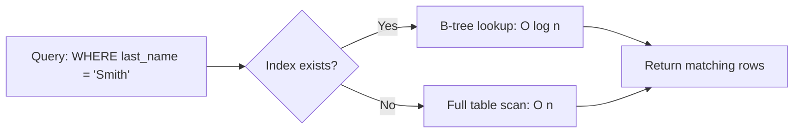

**Advantages:** dramatically faster reads/lookups, enforces uniqueness (unique indexes), supports efficient sorting and range queries.

**Disadvantages:** consumes additional disk space, slows down writes (`INSERT`/`UPDATE`/`DELETE` must update every index on the table), and an unused or poorly chosen index can actually hurt the optimizer's decisions.

**Real-life scenario:** A `users` table with millions of rows and frequent lookups by `email` (e.g., login) should have an index on `email` — without it, every login attempt triggers a full table scan.

#### Interview Questions

1. **What is the difference between a database and a schema?**
   A database is the top-level container with its own configuration and storage; a schema is a logical namespace inside a database used to group and organize related objects (tables, views) and control access. In MySQL, the two terms are used interchangeably, while PostgreSQL, Oracle, and SQL Server treat schema as a sub-container within a database.
2. **How does a materialized view differ from a regular view, and when would you choose one over the other?**
   A regular view is a virtual, always-current query definition with no stored data — it re-executes on every access. A materialized view physically stores the result set, offering much faster reads at the cost of staleness until manually or automatically refreshed. Use materialized views for expensive aggregations/reports where slightly stale data is acceptable; use regular views for simplifying/securing everyday queries that need current data.
3. **Why might adding an index sometimes make a query slower or not help at all?**
   Indexes speed up selective lookups but add overhead to writes and consume storage. If a query returns a large percentage of the table's rows, the optimizer may correctly choose a full table scan over an index scan because random-access index lookups can be slower than a sequential scan for low-selectivity queries. Also, if statistics are stale, the optimizer might choose a suboptimal plan even with an index present.
4. **Explain why gaps can appear in sequence-generated IDs, and whether that's a problem.**
   Sequences are non-transactional — calling `nextval()` consumes a value immediately, even if the surrounding transaction later rolls back or the application crashes before inserting. This causes gaps in ID sequences, which is expected behavior and generally not a problem since primary keys only need to be unique, not contiguous.
5. **What is a composite index, and why does column order matter?**
   A composite (multi-column) index is built on more than one column, and it's sorted first by the leading column, then the next, and so on. It can support queries filtering on the leading column alone or the leading column plus subsequent ones, but generally cannot efficiently support queries filtering only on a non-leading column, so the most selective/most-frequently-filtered column should typically come first.
6. **When would you use a schema-per-tenant design versus a database-per-tenant design in a multi-tenant application?**
   Schema-per-tenant shares one database instance/connection pool across tenants, reducing operational overhead and resource usage — good for many small tenants. Database-per-tenant gives stronger isolation (easier per-tenant backup/restore, resource limits, and security boundaries) at the cost of more operational complexity — better for fewer, larger, or compliance-sensitive tenants.

## Data Types

### Numeric Types

Numeric types store integers and decimals with varying range and precision. Choosing the right one balances storage size, precision, and performance.

| Type | Example | Use case |
|---|---|---|
| `SMALLINT` | -32,768 to 32,767 | Small counters, flags |
| `INT`/`INTEGER` | ~-2.1B to 2.1B | General-purpose whole numbers |
| `BIGINT` | ~-9.2 quintillion to 9.2 quintillion | IDs, large counters |
| `DECIMAL(p,s)` / `NUMERIC(p,s)` | exact precision `p`, scale `s` | Currency, financial calculations |
| `FLOAT` / `REAL` / `DOUBLE PRECISION` | approximate, IEEE 754 | Scientific measurements, non-exact math |

```sql
CREATE TABLE invoices (
    id          BIGINT PRIMARY KEY,
    quantity    INT NOT NULL,
    unit_price  NUMERIC(10, 2) NOT NULL,  -- exact: 10 total digits, 2 after decimal
    weight_kg   DOUBLE PRECISION           -- approximate
);
```

**Key gotcha:** Never use `FLOAT`/`DOUBLE` for money. Floating-point types use binary fractions internally and cannot exactly represent values like `0.1`, leading to rounding errors that accumulate (e.g., `0.1 + 0.2 != 0.3` in floating-point arithmetic). Always use `DECIMAL`/`NUMERIC` for currency.

### Character Types

Character types store text data, differing mainly in whether they're fixed-length or variable-length, and whether there's a size cap.

| Type | Description |
|---|---|
| `CHAR(n)` | Fixed-length, space-padded to `n` characters |
| `VARCHAR(n)` | Variable-length, up to `n` characters |
| `TEXT` | Variable-length, unbounded (or very large limit) |

```sql
CREATE TABLE users (
    country_code CHAR(2),        -- always exactly 2 chars, e.g. 'US'
    username     VARCHAR(30),    -- up to 30 chars
    bio          TEXT            -- unbounded free text
);
```

- `CHAR` wastes space with padding but has predictable row size; rarely used except for fixed-format codes (e.g., ISO country codes).
- `VARCHAR` is the most common general-purpose choice.
- `TEXT` (PostgreSQL/MySQL) is ideal for large, unbounded content like descriptions or comments; some databases (older SQL Server) discourage `TEXT` in favor of `VARCHAR(MAX)`.

### Boolean Type

`BOOLEAN` stores `TRUE`, `FALSE`, or `NULL` (representing "unknown"). Not all databases have a native boolean type — MySQL implements `BOOLEAN` as an alias for `TINYINT(1)`, while Oracle has no boolean column type at all (commonly emulated with `CHAR(1)` or `NUMBER(1)`).

```sql
CREATE TABLE features (
    id         INT PRIMARY KEY,
    is_enabled BOOLEAN NOT NULL DEFAULT FALSE
);

SELECT * FROM features WHERE is_enabled = TRUE;
SELECT * FROM features WHERE is_enabled;  -- equivalent shorthand
```

**Gotcha:** Because SQL uses three-valued logic (`TRUE`/`FALSE`/`UNKNOWN`), a nullable boolean column compared with `= TRUE` will exclude `NULL` rows — you must explicitly handle `IS NULL` if that matters.

### Date and Time Types

| Type | Stores | Notes |
|---|---|---|
| `DATE` | Year, month, day | No time component |
| `TIME` | Hour, minute, second (+fraction) | No date component |
| `TIMESTAMP` | Date + time | No timezone awareness by default |
| `TIMESTAMPTZ` / `TIMESTAMP WITH TIME ZONE` | Date + time + timezone | Stored normalized to UTC internally |
| `INTERVAL` | A span of time (e.g., `3 days`) | PostgreSQL/Oracle specific |

```sql
CREATE TABLE events (
    id          INT PRIMARY KEY,
    event_date  DATE,
    starts_at   TIMESTAMPTZ NOT NULL,
    duration    INTERVAL
);

INSERT INTO events VALUES (1, '2024-06-01', '2024-06-01 09:00:00+00', '2 hours');

SELECT starts_at + duration AS ends_at FROM events;
```

**Best practice:** Always store timestamps as `TIMESTAMPTZ`/UTC in the database and convert to local time zone only in the presentation layer — this avoids ambiguity across daylight saving transitions and multi-region deployments.

### UUID

A UUID (Universally Unique Identifier) is a 128-bit value, typically represented as a 36-character hyphenated hex string (e.g., `550e8400-e29b-41d4-a716-446655440000`), used as a globally unique identifier without requiring a central authority to coordinate uniqueness.

```sql
CREATE TABLE sessions (
    id      UUID PRIMARY KEY DEFAULT gen_random_uuid(),  -- PostgreSQL (pgcrypto)
    user_id BIGINT NOT NULL
);
```

| Aspect | Auto-increment INT/BIGINT | UUID |
|---|---|---|
| Uniqueness scope | Per-table (or per-sequence) | Globally unique |
| Predictability | Sequential, guessable | Random, harder to enumerate |
| Index locality | Sequential, index-friendly | Random insertion can fragment B-tree indexes |
| Storage size | 4-8 bytes | 16 bytes |
| Merging data across DBs/shards | Risk of collisions | Safe (practically collision-free) |

**Real-life scenario:** Distributed systems generating IDs independently on multiple nodes (e.g., offline mobile clients later syncing to a central server) use UUIDs to avoid ID collisions, whereas a single-writer monolithic system might prefer sequential BIGINT IDs for index performance.

### JSON / JSONB (Overview)

Modern relational databases support storing semi-structured JSON documents in a column, blending relational and document-model flexibility.

- `JSON` (PostgreSQL/MySQL): stores an exact text representation of the JSON input, preserving formatting/key order; re-parsed on every access.
- `JSONB` (PostgreSQL only): stores a decomposed, binary format — faster to query and index, but doesn't preserve exact text formatting or duplicate keys.

```sql
CREATE TABLE products (
    id         INT PRIMARY KEY,
    attributes JSONB
);

INSERT INTO products VALUES (1, '{"color": "red", "size": "M", "tags": ["sale", "new"]}');

SELECT attributes->>'color' AS color
FROM products
WHERE attributes @> '{"size": "M"}';

CREATE INDEX idx_products_attrs ON products USING GIN (attributes);
```

**Real-life scenario:** An e-commerce `products` table where each category has wildly different attributes (shoe size vs. screen resolution) can store category-specific attributes in a `JSONB` column instead of maintaining dozens of nullable columns or an EAV (entity-attribute-value) table.

### Binary Data Types

Binary types store raw byte sequences — images, files, encrypted blobs — rather than human-readable text.

| Type | Description |
|---|---|
| `BLOB` (MySQL/Oracle) | Binary Large Object, unbounded raw bytes |
| `BYTEA` (PostgreSQL) | Variable-length byte array |
| `VARBINARY(n)` (SQL Server/MySQL) | Variable-length binary, up to `n` bytes |

```sql
CREATE TABLE documents (
    id       INT PRIMARY KEY,
    file_data BYTEA  -- PostgreSQL
);
```

**Trade-off:** Storing large binary files directly in the database simplifies transactional consistency (file and metadata committed together) but bloats the database size and backup time; a common alternative is storing files in object storage (e.g., S3) and keeping only a reference URL/key in the database.

#### Interview Questions

1. **Why should you never use `FLOAT`/`DOUBLE` for currency values?**
   Floating-point types represent numbers in binary fractions, which cannot exactly represent many decimal values (e.g., `0.1`). This introduces rounding errors that compound across many operations, making totals inaccurate. `DECIMAL`/`NUMERIC` types store exact base-10 values with defined precision and scale, which is essential for financial correctness.
2. **What's the practical difference between `CHAR(n)` and `VARCHAR(n)`?**
   `CHAR(n)` is fixed-length and pads shorter values with spaces to always occupy `n` characters, giving predictable row sizes but wasting space; `VARCHAR(n)` stores only the actual characters used (plus a small length prefix), saving space for variable-length data. `CHAR` is mainly useful for fixed-format codes like ISO country/currency codes.
3. **Why is it recommended to store timestamps as UTC (`TIMESTAMPTZ`) rather than local time?**
   Storing local time without a timezone is ambiguous (which timezone? did DST apply?) and breaks when servers/users span multiple regions. Storing as UTC provides a single unambiguous point in time; conversion to a user's local timezone should happen at the display/presentation layer.
4. **When would you choose a UUID primary key over an auto-incrementing integer, and what's the downside?**
   UUIDs are ideal when IDs must be generated independently across multiple nodes/services without coordination (distributed systems, offline-first apps, merging data from multiple databases) since collisions are practically impossible. The downside is worse index locality — random UUID values inserted into a B-tree index cause page splits and fragmentation, and they consume more storage (16 bytes vs 4-8 bytes) than integers.
5. **What's the difference between `JSON` and `JSONB` in PostgreSQL?**
   `JSON` stores the exact input text and re-parses it on every query, preserving whitespace/key order/duplicate keys. `JSONB` stores a parsed, binary decomposed format that's faster to query and supports indexing (e.g., GIN indexes), but normalizes the data (removes duplicate keys, doesn't preserve formatting). `JSONB` is almost always preferred unless exact text preservation is required.
6. **Why might you avoid storing large binary files (like PDFs or images) directly in a database column?**
   Storing large BLOBs bloats table/database size, slows down backups and replication, and can degrade cache efficiency since the buffer pool has to hold large binary payloads alongside regular row data. A common pattern is storing files in dedicated object storage (e.g., S3) and keeping just a reference/URL in the relational table.

## Data Definition Language (DDL)

### CREATE DATABASE

Creates a new, isolated database container on the server instance, optionally specifying encoding, collation, and owner.

```sql
CREATE DATABASE analytics
  WITH ENCODING = 'UTF8'
  OWNER = analytics_admin;
```

- Requires elevated (superuser/admin) privileges in most systems.
- Typically an infrequent, environment-setup-time operation rather than something application code does at runtime.

### CREATE SCHEMA

Creates a logical namespace within the current database to organize tables/views and scope permissions.

```sql
CREATE SCHEMA IF NOT EXISTS billing AUTHORIZATION billing_service;

CREATE TABLE billing.invoices (
    id     BIGINT PRIMARY KEY,
    amount NUMERIC(10, 2)
);
```

`IF NOT EXISTS` avoids an error if the schema is created redundantly (common in idempotent migration scripts).

### CREATE TABLE

Defines a new table's structure: columns, data types, constraints, and optionally storage parameters.

```sql
CREATE TABLE orders (
    id          BIGINT PRIMARY KEY,
    customer_id BIGINT NOT NULL REFERENCES customers(id),
    order_date  DATE NOT NULL DEFAULT CURRENT_DATE,
    status      VARCHAR(20) NOT NULL DEFAULT 'PENDING',
    total       NUMERIC(10, 2) CHECK (total >= 0)
);

-- Create table from a query (structure + data copied, constraints usually NOT copied)
CREATE TABLE recent_orders AS
SELECT * FROM orders WHERE order_date >= CURRENT_DATE - INTERVAL '30 days';
```

Column definitions combine a data type with optional constraints (`NOT NULL`, `DEFAULT`, `CHECK`, `REFERENCES`) inline, or constraints can be declared separately as table-level constraints (useful for composite/multi-column constraints).

### ALTER TABLE

Modifies an existing table's structure — adding/dropping/renaming columns, changing data types, adding/dropping constraints.

```sql
ALTER TABLE orders ADD COLUMN notes TEXT;
ALTER TABLE orders DROP COLUMN notes;
ALTER TABLE orders ALTER COLUMN total SET NOT NULL;         -- PostgreSQL
ALTER TABLE orders ALTER COLUMN total TYPE NUMERIC(12, 2);  -- PostgreSQL
ALTER TABLE orders RENAME COLUMN status TO order_status;
ALTER TABLE orders ADD CONSTRAINT chk_status CHECK (order_status IN ('PENDING','SHIPPED','CANCELLED'));
```

**Gotcha:** On large tables, some `ALTER TABLE` operations (e.g., changing a column type, adding a `NOT NULL` column without a default) can require rewriting the entire table and take an exclusive lock, causing downtime. Modern databases increasingly support online/non-blocking DDL for common cases (e.g., PostgreSQL adding a nullable column is instant metadata-only since v11+).

### DROP TABLE

Permanently removes a table and all its data, indexes, and dependent objects (depending on `CASCADE`/`RESTRICT`).

```sql
DROP TABLE IF EXISTS temp_import;
DROP TABLE orders CASCADE;  -- also drops dependent views/foreign keys referencing it
```

This operation is irreversible without a backup — unlike `DELETE`, there is no `WHERE` clause and no way to undo it via `ROLLBACK` once committed (and in many databases, DDL auto-commits).

### TRUNCATE TABLE

Quickly removes **all** rows from a table while keeping its structure intact, typically much faster than `DELETE` with no `WHERE` clause.

```sql
TRUNCATE TABLE session_logs;
TRUNCATE TABLE session_logs RESTART IDENTITY;  -- also resets auto-increment/sequence
```

| Aspect | `DELETE` (no WHERE) | `TRUNCATE` |
|---|---|---|
| Logging | Row-by-row (more WAL/undo) | Minimal, deallocates pages |
| Speed | Slower on large tables | Much faster |
| `WHERE` clause | Supported | Not supported (all-or-nothing) |
| Triggers | Row-level triggers fire | Typically do NOT fire (per-row triggers) |
| Rollback | Fully transactional | Transactional in PostgreSQL; auto-commits in some DBs (MySQL) |
| Resets identity/auto-increment | No (unless explicit) | Yes, can reset with `RESTART IDENTITY` |
| Foreign keys | Works even if referenced (row by row, checked) | Fails if referenced by other tables (unless cascaded) |

### RENAME TABLE

Changes a table's name without affecting its data, though dependent views/foreign keys referencing the old name may need updates depending on the database.

```sql
ALTER TABLE orders RENAME TO customer_orders;  -- PostgreSQL/Oracle syntax
RENAME TABLE orders TO customer_orders;        -- MySQL syntax
```

**Real-life scenario:** Renaming is often used during zero-downtime migrations — e.g., build a new table `orders_v2`, backfill data, then atomically rename `orders` → `orders_old` and `orders_v2` → `orders` within a transaction.

### COMMENT

Attaches descriptive metadata to a database object (table, column, etc.), useful for documentation visible via schema-inspection tools without needing external docs.

```sql
COMMENT ON TABLE orders IS 'Stores customer purchase orders';
COMMENT ON COLUMN orders.status IS 'One of: PENDING, SHIPPED, CANCELLED';
```

This is purely metadata — it has no effect on query behavior, but is valuable for team documentation and tools that auto-generate data dictionaries.

#### Interview Questions

1. **Why is `TRUNCATE` typically faster than `DELETE FROM table` with no `WHERE` clause?**
   `DELETE` removes rows one at a time, logging each row deletion (and firing row-level triggers), which is expensive for large tables. `TRUNCATE` deallocates entire data pages at once with minimal logging, making it much faster, though it usually can't be filtered with a `WHERE` clause and may not fire per-row triggers.
2. **Can `TRUNCATE` be rolled back inside a transaction?**
   It depends on the database. PostgreSQL and SQL Server support fully transactional `TRUNCATE` (rollback restores the data). MySQL's `TRUNCATE` implicitly commits the current transaction and cannot be rolled back because it's implemented as a drop-and-recreate of the table.
3. **What's a real risk of running `ALTER TABLE` to change a column type on a very large production table?**
   Many such changes require rewriting the entire table's storage (to convert existing values to the new type), which acquires an exclusive/access-exclusive lock for the duration — blocking reads and writes and potentially causing an outage. Mitigations include using online schema-change tools (e.g., `pt-online-schema-change`, `gh-ost` for MySQL) or database features supporting non-blocking changes.
4. **Why does `DROP TABLE ... CASCADE` need to be used carefully?**
   `CASCADE` automatically drops all dependent objects (foreign keys referencing the table, views built on it, etc.) along with the table itself. Without reviewing dependencies first, this can silently remove other objects the team didn't intend to lose, so it's best combined with first inspecting dependent objects or using `RESTRICT` (the safer default) to fail if dependents exist.
5. **What's the difference between DDL auto-commit behavior across databases, and why does it matter?**
   In MySQL and Oracle, DDL statements implicitly commit any open transaction, meaning you cannot wrap a `CREATE TABLE`/`ALTER TABLE` in a transaction and roll it back. PostgreSQL and SQL Server support transactional DDL, allowing schema changes to be rolled back alongside data changes — this matters for writing safe, reversible migration scripts.
6. **When would you use `RENAME TABLE` as part of a deployment strategy?**
   A common zero-downtime pattern is to build a new table with the desired schema, backfill/migrate data into it, then perform an atomic rename swap (old table renamed aside, new table renamed into place) — minimizing lock time compared to altering the live table in place.

## Constraints

### PRIMARY KEY

A `PRIMARY KEY` uniquely identifies each row in a table. It implies both `UNIQUE` and `NOT NULL`, and a table can have only one primary key (though that key can span multiple columns — a composite key).

```sql
CREATE TABLE employees (
    id INT PRIMARY KEY,
    email VARCHAR(100)
);

-- Composite primary key
CREATE TABLE order_items (
    order_id   INT,
    product_id INT,
    quantity   INT,
    PRIMARY KEY (order_id, product_id)
);
```

Most databases automatically create a unique index backing the primary key, which also makes primary-key lookups fast.

### FOREIGN KEY

A `FOREIGN KEY` enforces referential integrity by requiring values in one table's column(s) to match existing values in another table's (usually primary/unique key) column(s).

```sql
CREATE TABLE orders (
    id          INT PRIMARY KEY,
    customer_id INT NOT NULL,
    FOREIGN KEY (customer_id) REFERENCES customers(id)
        ON DELETE CASCADE
        ON UPDATE CASCADE
);
```

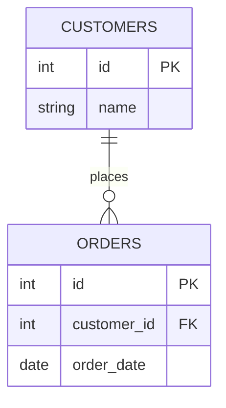

- `ON DELETE`/`ON UPDATE` actions control what happens to child rows when the referenced parent row is deleted/updated: `CASCADE` (propagate), `SET NULL`, `SET DEFAULT`, `RESTRICT`/`NO ACTION` (block the operation).
- Enforcing foreign keys prevents orphaned rows (e.g., an order pointing to a deleted customer).

**Real-life scenario:** In an e-commerce schema, a foreign key from `orders.customer_id` to `customers.id` guarantees you can never insert an order for a non-existent customer, catching application bugs at the database level rather than silently corrupting data.

### UNIQUE

Ensures all values in a column (or combination of columns) are distinct across the table, while still allowing `NULL` (with database-specific nuances on multiple NULLs).

```sql
CREATE TABLE users (
    id    INT PRIMARY KEY,
    email VARCHAR(100) UNIQUE
);

-- Composite unique constraint
ALTER TABLE enrollments ADD CONSTRAINT uq_student_course UNIQUE (student_id, course_id);
```

**Gotcha:** In most databases (PostgreSQL, SQL Server, Oracle), multiple `NULL` values are allowed in a `UNIQUE` column because `NULL` is never considered equal to another `NULL`. MySQL follows the same standard behavior as well.

### NOT NULL

Ensures a column cannot store the `NULL` (unknown/missing) value — every row must supply a value for that column.

```sql
CREATE TABLE products (
    id   INT PRIMARY KEY,
    name VARCHAR(100) NOT NULL,
    sku  VARCHAR(50) NOT NULL
);
```

Enforcing `NOT NULL` where a value is logically always required avoids defensive `IS NULL` checks scattered throughout application code and catches missing-data bugs at insert time.

### CHECK

Enforces a boolean expression that must hold true for every row, allowing custom business-rule validation directly in the schema.

```sql
CREATE TABLE products (
    id    INT PRIMARY KEY,
    price NUMERIC(10, 2) CHECK (price > 0),
    stock INT NOT NULL CHECK (stock >= 0)
);

-- Table-level CHECK referencing multiple columns
ALTER TABLE bookings ADD CONSTRAINT chk_dates CHECK (end_date > start_date);
```

**Real-life scenario:** A `bookings` table can enforce `end_date > start_date` at the database level so that no application bug (in any service that writes to this table) can ever create an invalid reservation window.

### DEFAULT

Supplies an automatic value for a column when an `INSERT` doesn't explicitly provide one.

```sql
CREATE TABLE orders (
    id         INT PRIMARY KEY,
    status     VARCHAR(20) NOT NULL DEFAULT 'PENDING',
    created_at TIMESTAMPTZ NOT NULL DEFAULT now()
);

INSERT INTO orders (id) VALUES (1);  -- status becomes 'PENDING', created_at becomes now()
```

Defaults can be literals, expressions, or function calls (e.g., `now()`, `gen_random_uuid()`), evaluated at insert time.

### AUTO_INCREMENT / IDENTITY / SERIAL

Mechanisms for automatically generating sequential unique values for a column, typically used for surrogate primary keys.

| Database | Syntax |
|---|---|
| MySQL | `id INT AUTO_INCREMENT PRIMARY KEY` |
| PostgreSQL | `id SERIAL PRIMARY KEY` (legacy) or `id INT GENERATED ALWAYS AS IDENTITY PRIMARY KEY` (SQL-standard) |
| SQL Server | `id INT IDENTITY(1,1) PRIMARY KEY` |
| Oracle | `id NUMBER GENERATED ALWAYS AS IDENTITY PRIMARY KEY` (12c+) |

```sql
-- PostgreSQL, SQL-standard identity column (preferred over SERIAL)
CREATE TABLE products (
    id   INT GENERATED ALWAYS AS IDENTITY PRIMARY KEY,
    name VARCHAR(100) NOT NULL
);
```

`SERIAL` is PostgreSQL-specific sugar that creates a backing sequence implicitly; `GENERATED ALWAYS AS IDENTITY` is the newer, SQL-standard-compliant way and is generally preferred since it prevents accidentally overwriting the auto-generated value (unless `OVERRIDING SYSTEM VALUE` is explicitly used).

### Generated Columns (Overview)

A generated (computed) column derives its value automatically from an expression involving other columns in the same row, rather than being set directly by `INSERT`/`UPDATE`.

```sql
CREATE TABLE rectangles (
    width  NUMERIC NOT NULL,
    height NUMERIC NOT NULL,
    area   NUMERIC GENERATED ALWAYS AS (width * height) STORED
);
```

- `STORED` generated columns physically persist the computed value (recomputed on every write to source columns); some databases also support `VIRTUAL`/non-stored generated columns computed on read.
- Useful for derived/denormalized values that should always stay consistent with source data (e.g., `full_name` from `first_name || ' ' || last_name`), avoiding application-level bugs from manually keeping them in sync.

#### Interview Questions

1. **What's the difference between `PRIMARY KEY` and `UNIQUE` constraints?**
   Both enforce uniqueness, but a table can have only one `PRIMARY KEY` (which also implies `NOT NULL`), while it can have multiple `UNIQUE` constraints, and `UNIQUE` columns can typically contain `NULL` values (with `NULL` not considered equal to another `NULL`).
2. **Explain the difference between `ON DELETE CASCADE`, `SET NULL`, and `RESTRICT` for foreign keys.**
   `CASCADE` automatically deletes/updates child rows when the parent row is deleted/updated; `SET NULL` sets the foreign key column to `NULL` in child rows instead of deleting them (requires the FK column to be nullable); `RESTRICT`/`NO ACTION` blocks the parent delete/update entirely if dependent child rows exist, which is often the safest default for critical data.
3. **Why would you choose a `CHECK` constraint over enforcing the same rule only in application code?**
   A `CHECK` constraint guarantees the rule holds regardless of which application, script, or direct SQL client writes to the table, closing gaps that arise from multiple services or manual data fixes bypassing application validation. It moves the "last line of defense" for data integrity into the database itself.
4. **What's the difference between `SERIAL` and `GENERATED ALWAYS AS IDENTITY` in PostgreSQL?**
   `SERIAL` is legacy syntactic sugar that creates a backing sequence and sets the column default to `nextval()`, but the sequence and column are only loosely linked (you can accidentally insert an explicit conflicting value). `GENERATED ALWAYS AS IDENTITY` is the SQL-standard approach that more tightly controls the column, preventing explicit inserts unless you use `OVERRIDING SYSTEM VALUE`, and is the recommended modern approach.
5. **Can a `UNIQUE` column contain multiple `NULL` values? Why or why not?**
   Yes in most databases (PostgreSQL, SQL Server, Oracle, MySQL) — SQL's three-valued logic treats `NULL` as "unknown," so `NULL` is never considered equal to another `NULL`, meaning uniqueness checks don't flag multiple `NULL`s as duplicates.
6. **What is a generated/computed column, and what's a good use case?**
   A generated column automatically derives its value from an expression over other columns in the same row (e.g., `total = price * quantity`), stored or computed on read. It's useful for denormalized/derived data that must always stay consistent with its inputs, eliminating the need for application code or triggers to manually keep it in sync.

## Data Manipulation Language (DML)

### INSERT

Adds new row(s) to a table. Columns not listed take their `DEFAULT` value (or `NULL` if no default and the column is nullable).

```sql
INSERT INTO employees (id, first_name, last_name, hire_date)
VALUES (1, 'Alice', 'Nguyen', '2024-01-15');

-- Omitting columns with defaults
INSERT INTO orders (id, customer_id) VALUES (100, 42);  -- status defaults to 'PENDING'
```

### INSERT Multiple Rows

A single `INSERT` statement can supply multiple value lists, which is far more efficient than issuing one `INSERT` per row (fewer round-trips, often a single transaction/log entry).

```sql
INSERT INTO employees (id, first_name, last_name) VALUES
    (2, 'Bob', 'Smith'),
    (3, 'Carla', 'Diaz'),
    (4, 'Dan', 'Lee');
```

**Real-life scenario:** Bulk-loading a CSV import of thousands of rows should batch inserts (e.g., 500-1000 rows per statement) rather than one-row-at-a-time inserts, cutting import time dramatically by reducing network round-trips and per-statement overhead.

### INSERT ... SELECT

Inserts rows produced by a `SELECT` query, useful for copying/migrating data between tables without pulling it into the application first.

```sql
INSERT INTO archived_orders (id, customer_id, order_date, total)
SELECT id, customer_id, order_date, total
FROM orders
WHERE order_date < CURRENT_DATE - INTERVAL '1 year';
```

This pattern is common for archiving, ETL staging, and building denormalized reporting tables directly inside the database engine.

### UPDATE

Modifies existing rows matching a condition. Omitting the `WHERE` clause updates **every** row in the table — one of the most common and costly SQL mistakes.

```sql
UPDATE employees
SET salary = salary * 1.05
WHERE department = 'Engineering';

-- Update using values from another table
UPDATE orders o
SET total = oi.computed_total
FROM (SELECT order_id, SUM(price * quantity) AS computed_total
      FROM order_items GROUP BY order_id) oi
WHERE o.id = oi.order_id;
```

**Safety tip:** Always run the equivalent `SELECT ... WHERE ...` first to verify which rows will be affected before running the `UPDATE`/`DELETE`, especially in production.

### DELETE

Removes rows matching a condition; like `UPDATE`, omitting `WHERE` deletes every row (but unlike `TRUNCATE`, it's row-by-row, transactional, and fires triggers).

```sql
DELETE FROM sessions WHERE expires_at < now();

-- Delete based on a join/subquery
DELETE FROM order_items
WHERE order_id IN (SELECT id FROM orders WHERE status = 'CANCELLED');
```

### MERGE / UPSERT (Database Specific)

"Upsert" means insert a row if it doesn't exist, or update it if it does — a common need for idempotent data synchronization (e.g., syncing an external feed).

```sql
-- PostgreSQL / SQLite: INSERT ... ON CONFLICT
INSERT INTO product_inventory (product_id, quantity)
VALUES (101, 50)
ON CONFLICT (product_id)
DO UPDATE SET quantity = product_inventory.quantity + EXCLUDED.quantity;

-- MySQL: INSERT ... ON DUPLICATE KEY UPDATE
INSERT INTO product_inventory (product_id, quantity)
VALUES (101, 50)
ON DUPLICATE KEY UPDATE quantity = quantity + VALUES(quantity);

-- SQL Server / Oracle: MERGE
MERGE INTO product_inventory AS target
USING (SELECT 101 AS product_id, 50 AS quantity) AS src
ON target.product_id = src.product_id
WHEN MATCHED THEN UPDATE SET quantity = target.quantity + src.quantity
WHEN NOT MATCHED THEN INSERT (product_id, quantity) VALUES (src.product_id, src.quantity);
```

**Real-life scenario:** A nightly job syncing product prices from a supplier's feed can use upsert so the same script works whether a product already exists locally or is brand new, without needing a separate existence check and conditional branch in application code.

### RETURNING Clause (PostgreSQL)

Returns values from rows affected by `INSERT`/`UPDATE`/`DELETE`, avoiding a separate round-trip `SELECT` to fetch generated values (like an auto-generated ID or a computed default).

```sql
INSERT INTO orders (customer_id, total)
VALUES (42, 99.99)
RETURNING id, created_at;

DELETE FROM sessions WHERE expires_at < now() RETURNING id, user_id;
```

This is PostgreSQL/Oracle-specific (Oracle uses `RETURNING ... INTO`); MySQL and SQL Server lack a direct equivalent (SQL Server offers `OUTPUT` instead, with similar purpose).

#### Interview Questions

1. **What happens if you run `UPDATE employees SET salary = 0` without a `WHERE` clause?**
   Every row in the table is updated — all employees' salaries become `0`. This is one of the most common production incidents; the safe practice is to first run the equivalent `SELECT` with the same `WHERE` condition to confirm the target rows, and to use transactions so the mistake can be rolled back if not yet committed.
2. **Why is a single multi-row `INSERT` generally faster than many single-row `INSERT` statements?**
   Each statement incurs network round-trip latency, parsing/planning overhead, and (depending on configuration) a transaction commit. Batching many rows into one statement (or wrapping many statements in one transaction) amortizes this overhead across all rows, which can be an order of magnitude faster for bulk loads.
3. **What does "upsert" mean, and how does it differ across PostgreSQL, MySQL, and SQL Server?**
   Upsert inserts a new row or updates an existing one in a single atomic statement, avoiding a race condition where a check-then-insert pattern in application code sees a row as missing and then fails on a duplicate-key error from a concurrent insert. PostgreSQL uses `INSERT ... ON CONFLICT DO UPDATE`, MySQL uses `INSERT ... ON DUPLICATE KEY UPDATE`, and SQL Server/Oracle use the more general-purpose `MERGE` statement.
4. **What is the purpose of the `RETURNING` clause, and what problem does it solve?**
   `RETURNING` lets an `INSERT`/`UPDATE`/`DELETE` statement return column values (like an auto-generated primary key or a default timestamp) directly in the same round-trip, avoiding a separate `SELECT` query afterward that could theoretically see different data due to a race condition.
5. **How does `DELETE` differ from `TRUNATE` in terms of triggers and transactional rollback?**
   `DELETE` processes rows individually, firing any row-level triggers and fully participating in the surrounding transaction (a `ROLLBACK` undoes it). `TRUNCATE` deallocates data pages directly, typically does not fire row-level triggers, and in some databases (MySQL) auto-commits, meaning it cannot be rolled back.
6. **Why would you use `INSERT ... SELECT` instead of reading rows into the application and inserting them back?**
   Doing the copy entirely within the database avoids pulling potentially large result sets across the network into the application and back, which is both slower and more memory-intensive. It also runs atomically as a single statement, reducing the risk of partial failures compared to a multi-step read-then-write client-side process.

## Basic Queries

### SELECT

The `SELECT` statement retrieves data from one or more tables. It's the most commonly used SQL statement and forms the basis of nearly every read operation.

```sql
SELECT id, first_name, last_name FROM employees;

-- Select all columns (avoid in production application code — brittle to schema changes)
SELECT * FROM employees;

-- Computed/expression columns
SELECT first_name || ' ' || last_name AS full_name, salary * 12 AS annual_salary
FROM employees;
```

**Best practice:** Avoid `SELECT *` in application code — it fetches unnecessary columns (wasting bandwidth), breaks if columns are added/removed/reordered, and can silently change behavior when relied upon positionally.

### DISTINCT

Removes duplicate rows from the result set, comparing across all selected columns as a combined unit.

```sql
SELECT DISTINCT department FROM employees;

-- DISTINCT applies to the whole row/column combination, not each column independently
SELECT DISTINCT department, job_title FROM employees;
```

**Gotcha:** `DISTINCT` requires the database to compare/sort or hash all result rows, which can be expensive on large result sets. Often an equivalent `GROUP BY` achieves the same deduplication and may be optimized similarly, but `EXISTS`-based rewrites can sometimes outperform both when checking for presence.

### WHERE

Filters rows before grouping/aggregation, based on a boolean condition. Only rows for which the condition evaluates to `TRUE` are kept (rows evaluating to `FALSE` or `UNKNOWN`/`NULL` are excluded).

```sql
SELECT * FROM orders WHERE status = 'PENDING' AND total > 100;
```

### ORDER BY

Sorts the final result set by one or more columns/expressions, ascending (`ASC`, default) or descending (`DESC`).

```sql
SELECT name, salary FROM employees ORDER BY salary DESC, name ASC;

-- Sort by column position (works but discouraged — brittle to SELECT list changes)
SELECT name, salary FROM employees ORDER BY 2 DESC;

-- NULLS handling (PostgreSQL/Oracle)
SELECT name, commission FROM employees ORDER BY commission DESC NULLS LAST;
```

Without an explicit `ORDER BY`, SQL makes **no guarantee** about row order — relying on "apparent" default ordering (e.g., insertion order) is a common bug source since the optimizer is free to return rows in any order it finds efficient.

### LIMIT

Restricts the number of rows returned by a query — commonly used for pagination or fetching "top N" results.

```sql
-- PostgreSQL / MySQL
SELECT * FROM products ORDER BY price DESC LIMIT 10;
```

`LIMIT` is not part of the ANSI standard (it's a widely supported PostgreSQL/MySQL/SQLite extension); SQL Server uses `TOP`, and the standard approach is `FETCH FIRST`/`OFFSET ... FETCH`.

### OFFSET

Skips a specified number of rows before starting to return rows, typically combined with `LIMIT`/`FETCH` for pagination.

```sql
-- Page 3 of 10-row pages (skip first 20 rows)
SELECT * FROM products ORDER BY id LIMIT 10 OFFSET 20;
```

**Gotcha:** `OFFSET` pagination gets progressively slower on large tables because the database must still scan/count through all skipped rows internally. For deep pagination on large datasets, "keyset pagination" (`WHERE id > :last_seen_id ORDER BY id LIMIT 10`) is far more efficient since it can use an index seek instead of scanning and discarding rows.

### FETCH FIRST

The ANSI SQL-standard way to limit rows, supported across PostgreSQL, Oracle, SQL Server (2012+), and DB2 — a portable alternative to the non-standard `LIMIT`.

```sql
SELECT * FROM products
ORDER BY price DESC
OFFSET 0 ROWS FETCH FIRST 10 ROWS ONLY;

-- With ties (includes additional rows tied with the last value)
SELECT * FROM products
ORDER BY price DESC
FETCH FIRST 10 ROWS WITH TIES;
```

`WITH TIES` is a particularly useful feature unavailable with plain `LIMIT` — it includes extra rows that tie with the last included row's sort value (e.g., "top 10 highest-paid employees," including all who tie for 10th place).

### Aliases

Aliases assign a temporary name to a column expression (`AS`) or a table (implicit or explicit `AS`), improving readability and enabling self-joins.

```sql
-- Column alias
SELECT first_name || ' ' || last_name AS full_name FROM employees;

-- Table alias (commonly required for joins, especially self-joins)
SELECT e.name AS employee_name, m.name AS manager_name
FROM employees e
JOIN employees m ON e.manager_id = m.id;
```

Table aliases are essential for self-joins (joining a table to itself) since you must disambiguate which "copy" of the table a column reference belongs to.

#### Interview Questions

1. **Why is `SELECT *` discouraged in production application code?**
   It fetches all columns even if only a few are needed, wasting bandwidth and I/O; it silently changes behavior if columns are added, removed, or reordered on the table; and it prevents the database from using certain optimizations (like index-only scans) that are possible when only specific columns are requested.
2. **What guarantee does SQL give about row order when no `ORDER BY` is specified?**
   None. The database is free to return rows in whatever order is most efficient for its execution plan, which can change between query runs, after adding an index, or after a version upgrade — code that depends on implicit ordering without `ORDER BY` is relying on undefined behavior.
3. **Why does deep `OFFSET`-based pagination become slow, and what's a better alternative?**
   `OFFSET` still requires the database to generate and then discard all skipped rows before returning the requested page, so performance degrades linearly (or worse) as the offset grows on large tables. Keyset/cursor-based pagination (filtering with `WHERE id > :last_id ORDER BY id LIMIT n`) uses an index seek directly to the starting point, giving consistent performance regardless of how deep the pagination goes.
4. **What does `FETCH FIRST ... WITH TIES` do, and why is it useful?**
   It extends a `FETCH FIRST n ROWS` limit to also include any additional rows that tie with the sort value of the last row in the limited set. This is useful for "top N" queries where ties should logically all be included (e.g., "top 3 highest scores" when multiple students share the 3rd-highest score).
5. **Is `DISTINCT` applied per-column or across the whole selected row?**
   Across the whole selected row — `SELECT DISTINCT col1, col2` deduplicates based on the combination of `col1` and `col2` together, not each column independently. If you need distinct values of just one column, select only that column.
6. **Why are table aliases required for self-joins?**
   A self-join references the same table twice in the `FROM`/`JOIN` clause, and without aliases, the database (and the reader) can't tell which occurrence a column reference belongs to. Aliases (e.g., `employees e JOIN employees m`) let you distinguish, for example, an employee row from its manager's row within the same query.

## Filtering Data

### Comparison Operators

Comparison operators (`=`, `<>` / `!=`, `<`, `>`, `<=`, `>=`) test the relationship between two values and evaluate to `TRUE`, `FALSE`, or `UNKNOWN`. They are the building blocks of every `WHERE` and `HAVING` clause.

```sql
SELECT * FROM employees WHERE salary >= 50000;
SELECT * FROM orders WHERE status <> 'CANCELLED';
```

**Gotcha:** Any comparison involving `NULL` (e.g., `salary = NULL`) evaluates to `UNKNOWN`, not `TRUE` or `FALSE`, and the row is excluded from the result — you must use `IS NULL` / `IS NOT NULL` instead.

### Logical Operators

`AND`, `OR`, and `NOT` combine multiple boolean conditions. SQL follows three-valued logic (`TRUE`, `FALSE`, `UNKNOWN`), and operator precedence follows `NOT` > `AND` > `OR` — parentheses should be used liberally to avoid ambiguity.

```sql
SELECT * FROM employees
WHERE department = 'Engineering' AND (salary > 80000 OR years_experience > 5);
```

**Gotcha:** Mixing `AND`/`OR` without parentheses is a classic bug source — `WHERE dept = 'HR' OR dept = 'IT' AND salary > 60000` is parsed as `dept = 'HR' OR (dept = 'IT' AND salary > 60000)`, which usually surprises developers expecting left-to-right evaluation.

### BETWEEN

`BETWEEN` is syntactic sugar for an inclusive range check (`col >= low AND col <= high`).

```sql
SELECT * FROM orders WHERE order_date BETWEEN '2024-01-01' AND '2024-01-31';

-- Equivalent explicit form
SELECT * FROM orders WHERE order_date >= '2024-01-01' AND order_date <= '2024-01-31';
```

**Gotcha:** `BETWEEN` is inclusive on both ends. For date ranges spanning a full day, prefer `order_date >= '2024-01-01' AND order_date < '2024-02-01'` over `BETWEEN '2024-01-01' AND '2024-01-31 23:59:59'`, since the latter can silently miss timestamps with fractional seconds.

### IN

`IN` tests whether a value matches any value in an explicit list or a subquery result — shorthand for a chain of `OR`-ed equality checks.

```sql
SELECT * FROM employees WHERE department IN ('Engineering', 'Sales', 'Marketing');

-- Subquery form
SELECT * FROM employees
WHERE department_id IN (SELECT id FROM departments WHERE region = 'EMEA');
```

### NOT IN

`NOT IN` excludes rows matching any value in a list or subquery — but it has a well-known, dangerous pitfall with `NULL`.

```sql
SELECT * FROM employees WHERE department NOT IN ('Sales', 'Marketing');

-- DANGEROUS: if the subquery returns even one NULL, this returns ZERO rows
SELECT * FROM employees
WHERE department_id NOT IN (SELECT manager_id FROM employees); -- manager_id can be NULL
```

If the list/subquery for `NOT IN` contains a single `NULL`, the entire condition evaluates to `UNKNOWN` for every row (because `x <> NULL` is `UNKNOWN`, and `UNKNOWN AND ...` can never become `TRUE`), silently returning an empty result set. This is one of the most common real-world SQL bugs.

| Approach | NULL-safe? | Behavior when list contains NULL |
|---|---|---|
| `NOT IN (subquery)` | No | Returns zero rows (silently wrong) |
| `NOT EXISTS (correlated subquery)` | Yes | Works correctly regardless of NULLs |

**Best practice:** Prefer `NOT EXISTS` over `NOT IN` whenever the list/subquery could contain `NULL`s.

### LIKE

`LIKE` performs pattern matching using wildcards: `%` matches zero or more characters, `_` matches exactly one character.

```sql
SELECT * FROM customers WHERE last_name LIKE 'Sm_th%';   -- Smith, Smyth, Smithson...
SELECT * FROM products WHERE sku LIKE '10\%%' ESCAPE '\'; -- literal '%' via ESCAPE
```

**Gotcha:** A leading wildcard (`LIKE '%foo'`) cannot use a standard B-tree index efficiently since the engine can't seek — it typically falls back to a full scan (unless a trigram/full-text index is available).

### ILIKE (PostgreSQL)

`ILIKE` is PostgreSQL's case-insensitive variant of `LIKE`. It's not part of the ANSI standard; on other databases the equivalent is achieved with `LOWER(col) LIKE LOWER(pattern)` or a case-insensitive collation.

```sql
-- PostgreSQL only
SELECT * FROM users WHERE email ILIKE '%@GMAIL.com';

-- Portable equivalent
SELECT * FROM users WHERE LOWER(email) LIKE LOWER('%@gmail.com');
```

### IS NULL

### IS NOT NULL

Because `NULL` represents "unknown/absent" rather than a comparable value, standard comparison operators cannot detect it — `IS NULL` / `IS NOT NULL` are the only correct tools.

```sql
SELECT * FROM employees WHERE manager_id IS NULL;      -- top-level employees
SELECT * FROM employees WHERE termination_date IS NOT NULL; -- former employees
```

**Gotcha:** `WHERE column = NULL` never matches any row (it's always `UNKNOWN`), and most databases won't even raise a warning — this is a frequent source of "why is my query returning nothing?" bugs.

### EXISTS

### NOT EXISTS

`EXISTS` tests whether a (usually correlated) subquery returns *any* rows at all — it doesn't care about the actual row values, only their presence, and most engines short-circuit as soon as one matching row is found.

```sql
SELECT * FROM customers c
WHERE EXISTS (
    SELECT 1 FROM orders o WHERE o.customer_id = c.id AND o.total > 1000
);

SELECT * FROM customers c
WHERE NOT EXISTS (
    SELECT 1 FROM orders o WHERE o.customer_id = c.id
); -- customers with no orders
```

Unlike `NOT IN`, `NOT EXISTS` handles `NULL`s correctly because it only checks for row existence under the correlation condition, never comparing values directly against `NULL`.

### ANY

### ALL

`ANY` (alias `SOME`) makes a comparison `TRUE` if it holds for *at least one* row returned by a subquery; `ALL` requires the comparison to hold for *every* row returned.

```sql
-- Employees earning more than at least one person in Sales (i.e., more than the minimum)
SELECT * FROM employees
WHERE salary > ANY (SELECT salary FROM employees WHERE department = 'Sales');

-- Employees earning more than everyone in Sales (i.e., more than the maximum)
SELECT * FROM employees
WHERE salary > ALL (SELECT salary FROM employees WHERE department = 'Sales');
```

| Construct | Equivalent to |
|---|---|
| `x = ANY (subquery)` | `x IN (subquery)` |
| `x <> ALL (subquery)` | `x NOT IN (subquery)` (same NULL pitfalls as `NOT IN`) |
| `x > ANY (subquery)` | `x > MIN(subquery)` |
| `x > ALL (subquery)` | `x > MAX(subquery)` |

#### Interview Questions

1. **Why does `WHERE department_id NOT IN (SELECT manager_id FROM employees)` sometimes return zero rows unexpectedly?**
   If the subquery returns even one `NULL` value (e.g., an employee with no manager), the entire `NOT IN` condition becomes `UNKNOWN` for every row, because comparing any value to `NULL` yields `UNKNOWN`, and `UNKNOWN` can never satisfy the `WHERE` clause. The safe fix is to use `NOT EXISTS` with a correlated subquery instead, or filter out NULLs explicitly (`WHERE manager_id IS NOT NULL`).
2. **Why does `WHERE salary = NULL` never return any rows?**
   SQL uses three-valued logic — comparing anything to `NULL` (including another `NULL`) produces `UNKNOWN`, never `TRUE`, so the row is excluded regardless of the actual value. You must use `IS NULL` (or `IS NOT NULL`) to test for null-ness explicitly.
3. **What's the difference between `EXISTS` and `IN`, and when would you prefer one over the other?**
   `EXISTS` only checks whether a correlated subquery returns any rows and typically short-circuits on the first match, making it NULL-safe and often efficient for large, non-indexed subquery sources. `IN` materializes/compares against a full list of values and can suffer from the `NOT IN`/NULL pitfall; for large subqueries, query optimizers often rewrite both into semi-joins, but `EXISTS` is generally the safer default, especially with `NOT`.
4. **Why can a leading wildcard `LIKE '%something'` hurt performance?**
   A B-tree index is sorted left-to-right, so the engine can only use it to seek when the pattern's prefix is fixed (e.g., `LIKE 'foo%'`). A leading `%` means there's no fixed prefix to seek on, forcing a full table/index scan unless a specialized index (trigram, full-text) is available.
5. **How would you write a case-insensitive search portably across databases that don't support `ILIKE`?**
   Wrap both sides in `LOWER()` (or `UPPER()`) consistently: `WHERE LOWER(email) LIKE LOWER('%@gmail.com')`. Alternatively, define the column with a case-insensitive collation so plain `=`/`LIKE` behave case-insensitively without extra function calls (which also preserves index usability if a matching function-based or collation-aware index exists).
6. **What does `salary > ANY (subquery)` mean compared to `salary > ALL (subquery)`?**
   `> ANY` is true if the salary exceeds at least one (i.e., the minimum) value returned by the subquery, while `> ALL` requires the salary to exceed every value (i.e., the maximum) returned. `> ANY (subquery)` is equivalent to `> (SELECT MIN(...) ...)` and `> ALL (subquery)` is equivalent to `> (SELECT MAX(...) ...)`.

## SQL Functions

### String Functions

String functions manipulate text data — concatenation, substring extraction, case conversion, trimming, length, and search/replace.

```sql
SELECT CONCAT(first_name, ' ', last_name) AS full_name FROM employees;      -- ANSI
SELECT first_name || ' ' || last_name AS full_name FROM employees;          -- PostgreSQL/Oracle operator

SELECT UPPER(email), LOWER(email) FROM users;
SELECT TRIM('  padded  ');            -- 'padded'
SELECT LENGTH(description) FROM products;
SELECT SUBSTRING(sku FROM 1 FOR 3) AS category_code FROM products;
SELECT REPLACE(phone, '-', '') AS digits_only FROM contacts;
SELECT POSITION('@' IN email) AS at_index FROM users;
```

**Real-world use:** normalizing/cleaning data at the query level (e.g., stripping formatting from phone numbers) or building derived display columns (`full_name`) without denormalizing the schema.

### Numeric Functions

Numeric functions perform arithmetic and rounding/precision operations on numbers.

```sql
SELECT ROUND(price, 2) FROM products;      -- round to 2 decimal places
SELECT CEIL(4.1), FLOOR(4.9);              -- 5, 4
SELECT ABS(-15);                           -- 15
SELECT MOD(10, 3);                         -- 1 (equivalent to 10 % 3)
SELECT POWER(2, 10);                       -- 1024
SELECT SQRT(144);                          -- 12
```

**Gotcha:** integer division truncates in most databases — `SELECT 7 / 2` returns `3`, not `3.5`, unless one operand is cast to a decimal/float type (`SELECT 7 / 2.0`).

### Date Functions

Date functions extract, truncate, and perform arithmetic on date values.

```sql
SELECT CURRENT_DATE;
SELECT EXTRACT(YEAR FROM order_date) AS order_year FROM orders;
SELECT DATE_TRUNC('month', order_date) AS order_month FROM orders; -- PostgreSQL
SELECT order_date + INTERVAL '7 days' AS due_date FROM orders;      -- PostgreSQL
SELECT AGE(CURRENT_DATE, hire_date) FROM employees;                 -- PostgreSQL: interval difference
```

`DATE_TRUNC` is especially useful for reporting/grouping (e.g., grouping orders by month) without losing the ability to sort or index the result as a real date/timestamp.

### Time Functions

Time functions handle time-of-day and timestamp values, including timezone-aware variants.

```sql
SELECT CURRENT_TIME;
SELECT CURRENT_TIMESTAMP;                 -- date + time, session timezone
SELECT NOW();                             -- PostgreSQL alias for CURRENT_TIMESTAMP
SELECT CURRENT_TIMESTAMP AT TIME ZONE 'UTC'; -- convert to a specific timezone
```

**Best practice:** store timestamps as `TIMESTAMPTZ` (timestamp with time zone) in PostgreSQL and always reason in UTC internally, converting to local time only at the presentation layer — mixing naive and timezone-aware timestamps is a common source of off-by-hours bugs.

### Conversion Functions

Conversion functions explicitly change a value's data type, avoiding reliance on implicit (and sometimes surprising) type coercion.

```sql
SELECT CAST(price AS INTEGER) FROM products;   -- ANSI standard
SELECT price::INTEGER FROM products;           -- PostgreSQL shorthand
SELECT TO_CHAR(order_date, 'YYYY-MM-DD') FROM orders;  -- PostgreSQL/Oracle
SELECT TO_NUMBER('1234.56', '9999.99');                -- PostgreSQL/Oracle
SELECT TO_DATE('2024-01-15', 'YYYY-MM-DD');
```

**Gotcha:** implicit conversions (e.g., comparing a `VARCHAR` column to a numeric literal) can silently prevent index usage or throw runtime errors on invalid data — explicit `CAST`/`::` makes intent clear and is easier to reason about.

### NULL Handling Functions

`COALESCE` and `NULLIF` provide portable, standard ways to handle `NULL` values without vendor-specific functions.

```sql
SELECT COALESCE(nickname, first_name, 'Unknown') AS display_name FROM users;

-- Avoid divide-by-zero: NULLIF returns NULL when the two arguments are equal
SELECT total_revenue / NULLIF(total_orders, 0) AS avg_order_value FROM sales_summary;
```

`COALESCE(a, b, c, ...)` returns the first non-`NULL` argument; it's the ANSI-standard, portable replacement for vendor-specific functions like `ISNULL` (SQL Server) or `IFNULL` (MySQL).

### Conditional Functions

`CASE` expressions provide if/else-style branching logic directly inside a query, usable in `SELECT`, `WHERE`, `ORDER BY`, and `GROUP BY`.

```sql
-- Simple CASE (single expression compared against values)
SELECT name,
    CASE department
        WHEN 'ENG' THEN 'Engineering'
        WHEN 'SLS' THEN 'Sales'
        ELSE 'Other'
    END AS department_name
FROM employees;

-- Searched CASE (arbitrary boolean conditions per branch)
SELECT name,
    CASE
        WHEN salary >= 100000 THEN 'Senior'
        WHEN salary >= 60000  THEN 'Mid'
        ELSE 'Junior'
    END AS band
FROM employees;
```

`CASE` is standard ANSI SQL and portable everywhere; Oracle's `DECODE` predates `CASE` and only supports simple equality branching, so `CASE` is generally preferred for new code.

#### Interview Questions

1. **Why does `SELECT 7 / 2` return `3` instead of `3.5` in most databases?**
   When both operands are integers, most SQL engines perform integer division and truncate the result, following the type of the operands. To get a fractional result, cast at least one operand to a decimal/float type, e.g., `7 / 2.0` or `CAST(7 AS DECIMAL) / 2`.
2. **What's the ANSI-standard, portable way to handle `NULL` fallback values, and how does it differ from vendor functions like `ISNULL`/`IFNULL`?**
   `COALESCE(a, b, c, ...)` returns the first non-`NULL` value among any number of arguments and is part of the SQL standard, making it portable across PostgreSQL, MySQL, SQL Server, and Oracle. `ISNULL` (SQL Server) and `IFNULL` (MySQL) are vendor-specific, typically accept only two arguments, and sometimes have subtly different type-coercion rules.
3. **How would you safely avoid a divide-by-zero error when computing an average in SQL?**
   Use `NULLIF(divisor, 0)` so the divisor becomes `NULL` when it's zero, which makes the whole division return `NULL` instead of raising an error: `total / NULLIF(count, 0)`.
4. **What's the difference between a "simple" `CASE` and a "searched" `CASE` expression?**
   A simple `CASE` compares one expression against a list of values (`CASE dept WHEN 'ENG' THEN ...`), similar to a switch statement. A searched `CASE` evaluates independent boolean conditions per branch (`CASE WHEN salary > 100000 THEN ...`), which is more flexible since each branch can reference different columns/conditions.
5. **Why should you prefer explicit `CAST`/`::` over relying on implicit type conversion?**
   Implicit conversions can silently prevent the optimizer from using an index (e.g., comparing an indexed `VARCHAR` column against a numeric literal may force a full scan), can throw unexpected runtime errors on malformed data, and make the intended type of an expression less obvious to future readers. Explicit casting documents intent and behaves predictably across database versions.
6. **Why is storing timestamps as timezone-aware (e.g., PostgreSQL `TIMESTAMPTZ`) generally recommended over naive timestamps?**
   Timezone-aware columns are always normalized to UTC internally, so comparisons, sorting, and arithmetic are unambiguous regardless of the server's or client's local timezone. Naive timestamps require the application to track and convert timezones manually, which is a frequent source of off-by-hours bugs, especially around daylight saving time transitions.

## Aggregate Functions

### COUNT

`COUNT` returns the number of rows. `COUNT(*)` counts all rows regardless of `NULL`s; `COUNT(column)` counts only rows where that column is non-`NULL`.

```sql
SELECT COUNT(*) FROM employees;                       -- total row count
SELECT COUNT(commission) FROM employees;              -- rows where commission IS NOT NULL
SELECT COUNT(DISTINCT department) FROM employees;     -- number of unique departments
```

**Gotcha:** `COUNT(column)` and `COUNT(*)` can return different numbers on the same table if `column` contains `NULL`s — this trips up many developers who assume they're interchangeable.

### SUM

`SUM` totals a numeric column, ignoring `NULL` values (treating them as if absent, not zero).

```sql
SELECT SUM(total) AS revenue FROM orders WHERE status = 'COMPLETED';
```

**Gotcha:** `SUM` over an empty set (zero matching rows) returns `NULL`, not `0` — wrap with `COALESCE(SUM(total), 0)` if a zero default is required downstream.

### AVG

`AVG` computes the arithmetic mean of a numeric column, also ignoring `NULL`s (they aren't counted as zero and don't affect the denominator).

```sql
SELECT AVG(salary) FROM employees WHERE department = 'Engineering';
```

**Gotcha:** if the column is an integer type, some databases perform integer division internally for intermediate steps — verify actual behavior, or cast explicitly (`AVG(salary::NUMERIC)`) to guarantee a fractional result.

### MIN

### MAX

`MIN`/`MAX` return the smallest/largest value in a column — they work on numeric, string (lexicographic), and date/time types alike.

```sql
SELECT MIN(hire_date), MAX(hire_date) FROM employees;
SELECT MIN(last_name) FROM employees; -- alphabetically first
```

### DISTINCT Aggregates

Combining `DISTINCT` with an aggregate function deduplicates values *before* aggregating, useful for counting/summing unique values rather than all occurrences.

```sql
SELECT COUNT(DISTINCT customer_id) AS unique_customers FROM orders;
SELECT SUM(DISTINCT price) FROM products; -- sums each distinct price once (rarely what you want for totals)
```

**Real-world use:** `COUNT(DISTINCT customer_id)` is the standard way to compute "unique customers" from an orders table where each customer may have placed multiple orders — a very common reporting/analytics query.

#### Interview Questions

1. **What's the difference between `COUNT(*)` and `COUNT(column_name)`?**
   `COUNT(*)` counts all rows in the group regardless of `NULL` values, while `COUNT(column_name)` counts only rows where that specific column is non-`NULL`. If the column has nulls, the two will return different numbers.
2. **Why does `SUM(total)` return `NULL` instead of `0` when no rows match the `WHERE` clause?**
   Aggregate functions (except `COUNT`) return `NULL` when applied to an empty set because there's no data to aggregate — SQL treats "no rows" differently from "a sum of zero." Use `COALESCE(SUM(total), 0)` if you need a guaranteed numeric default.
3. **Do aggregate functions like `SUM`, `AVG`, `MIN`, and `MAX` include `NULL` values in their calculation?**
   No — all standard aggregate functions ignore `NULL` values entirely (they're excluded from both the calculation and, for `AVG`, the denominator count). Only `COUNT(*)` counts rows without regard to `NULL`s.
4. **How do you count the number of distinct customers who placed at least one order?**
   `SELECT COUNT(DISTINCT customer_id) FROM orders;` — this deduplicates customer IDs before counting, so a customer with multiple orders is only counted once.
5. **Can you use an aggregate function without a `GROUP BY` clause? What happens?**
   Yes — without `GROUP BY`, the entire result set is treated as a single implicit group, and the aggregate function returns one row summarizing all matching rows (e.g., `SELECT COUNT(*) FROM employees` returns a single total).
6. **Why might `AVG` behave unexpectedly on an integer column, and how do you fix it?**
   Depending on the database, intermediate computation for `AVG` on integer types can involve integer division/truncation issues in edge cases, and the returned type may itself be an integer, silently truncating a fractional result. Casting explicitly (e.g., `AVG(salary::NUMERIC)` or `AVG(CAST(salary AS DECIMAL))`) guarantees a precise fractional average.

## GROUP BY

### GROUP BY

`GROUP BY` collapses rows sharing the same value(s) in specified column(s) into a single summary row per group, typically used alongside aggregate functions.

```sql
SELECT department, COUNT(*) AS headcount, AVG(salary) AS avg_salary
FROM employees
GROUP BY department;
```

Understanding SQL's **logical query processing order** is essential for reasoning about `GROUP BY`/`HAVING`/`WHERE` interactions — clauses are conceptually evaluated in this order, not the order they're written:


This is why `WHERE` cannot reference column aliases defined in `SELECT`, and why aggregate functions cannot be used in `WHERE` (the rows aren't grouped yet at that stage).

### HAVING

`HAVING` filters *groups* after aggregation, whereas `WHERE` filters individual *rows* before grouping. `HAVING` is the only clause that can reference aggregate function results.

```sql
SELECT department, COUNT(*) AS headcount
FROM employees
GROUP BY department
HAVING COUNT(*) > 10;

-- WHERE and HAVING can be combined: filter rows first, then filter resulting groups
SELECT department, AVG(salary) AS avg_salary
FROM employees
WHERE hire_date >= '2020-01-01'
GROUP BY department
HAVING AVG(salary) > 70000;
```

| Clause | Filters | Can reference aggregates? | Evaluated |
|---|---|---|---|
| `WHERE` | Individual rows | No | Before `GROUP BY` |
| `HAVING` | Groups (post-aggregation) | Yes | After `GROUP BY` |

**Gotcha:** Putting a row-level filter in `HAVING` instead of `WHERE` (e.g., `HAVING department = 'Sales'`) works but is wasteful — it forces the database to group all rows first, then discard whole groups, instead of filtering rows before the (potentially expensive) grouping step.

### Multiple Grouping Columns

Grouping by more than one column creates a group for every unique *combination* of those columns' values, effectively grouping hierarchically.

```sql
SELECT department, job_title, COUNT(*) AS headcount
FROM employees
GROUP BY department, job_title
ORDER BY department, job_title;
```

**Advanced note:** `GROUP BY ROLLUP(department, job_title)` and `GROUP BY CUBE(department, job_title)` (PostgreSQL, Oracle, SQL Server) extend this to also produce subtotal and grand-total rows automatically, useful for reporting dashboards without manual `UNION ALL` of multiple aggregation levels.

### GROUP BY with Aggregate Functions

Every column in the `SELECT` list that is *not* wrapped in an aggregate function must appear in the `GROUP BY` clause — otherwise the database cannot determine a single value to display for that column per group.

```sql
-- Valid: job_title is grouped, headcount/avg_salary are aggregated
SELECT department, job_title, COUNT(*) AS headcount, AVG(salary) AS avg_salary
FROM employees
GROUP BY department, job_title;

-- INVALID in standard SQL / PostgreSQL: job_title is neither grouped nor aggregated
SELECT department, job_title, COUNT(*)
FROM employees
GROUP BY department; -- ERROR: column "employees.job_title" must appear in GROUP BY or be used in an aggregate function
```

**Gotcha:** MySQL historically allowed this "invalid" form (returning an arbitrary value per group) unless `ONLY_FULL_GROUP_BY` SQL mode is enabled — relying on this non-standard leniency produces non-deterministic, hard-to-debug results and should be avoided even where permitted.

#### Interview Questions

1. **What is the key difference between `WHERE` and `HAVING`?**
   `WHERE` filters individual rows *before* grouping/aggregation occurs and cannot reference aggregate function results, while `HAVING` filters entire groups *after* aggregation and can reference aggregates like `COUNT(*)` or `AVG(col)`. As a performance rule of thumb, push any filter that doesn't depend on an aggregate into `WHERE` so fewer rows need to be grouped.
2. **What is SQL's logical query processing order, and why does it matter?**
   Conceptually: `FROM`/`JOIN` → `WHERE` → `GROUP BY` → `HAVING` → `SELECT` → `ORDER BY` → `LIMIT`/`OFFSET`. It matters because it explains why you can't filter on a `SELECT`-list alias in `WHERE` (aliases don't exist yet at that stage) and why aggregate functions are only usable starting at the `GROUP BY`/`HAVING` stage.
3. **Why must every non-aggregated column in the `SELECT` list also appear in `GROUP BY`?**
   Because `GROUP BY` collapses multiple rows into one output row per group, the database needs a deterministic single value for every selected column. Aggregate functions (`COUNT`, `SUM`, etc.) provide that by design, but a plain column not in `GROUP BY` could have many different values within a group, so standard SQL requires it to be either grouped or aggregated.
4. **What do `ROLLUP` and `CUBE` add on top of a plain `GROUP BY`?**
   Both generate additional subtotal/grand-total rows automatically: `ROLLUP` produces subtotals along a hierarchical rollup of the grouping columns (e.g., per-department, then a grand total), while `CUBE` produces subtotals for every possible combination of the grouping columns. They're commonly used to power reporting dashboards without stitching together multiple `UNION ALL` queries.
5. **If you need to filter on an aggregate value but also want to minimize the rows processed by grouping, what should you do?**
   Filter as much as possible in `WHERE` first (row-level, pre-aggregation conditions), and reserve `HAVING` strictly for conditions that depend on the aggregate result itself (e.g., `HAVING COUNT(*) > 10`). Putting row-level conditions in `HAVING` forces the database to group unnecessary rows before discarding them.
6. **Why does MySQL sometimes allow non-aggregated, non-grouped columns in `SELECT`, and why is this risky?**
   Unless `ONLY_FULL_GROUP_BY` SQL mode is enabled, MySQL permits this by picking an arbitrary (often the first-encountered) value for the ungrouped column within each group. This produces results that are non-deterministic and can change between query runs or server versions, so it should be avoided even when the database allows it.

## Joins

Joins combine rows from two or more tables based on a related column, letting relational data (split across normalized tables) be reassembled at query time. The choice of join type determines which unmatched rows (if any) are kept.

| Join Type | Rows returned |
|---|---|
| `INNER JOIN` | Only rows with a match in both tables |
| `LEFT JOIN` | All left rows, plus matches from the right (unmatched right columns are `NULL`) |
| `RIGHT JOIN` | All right rows, plus matches from the left (unmatched left columns are `NULL`) |
| `FULL OUTER JOIN` | All rows from both sides; unmatched columns from either side are `NULL` |
| `CROSS JOIN` | Every combination of rows from both tables (Cartesian product) |

### INNER JOIN

`INNER JOIN` returns only rows where the join condition matches in *both* tables — rows without a match on either side are excluded entirely.

```sql
SELECT e.name, d.name AS department_name
FROM employees e
INNER JOIN departments d ON e.department_id = d.id;
```

`INNER JOIN` is the default/implicit join type — plain `JOIN` means `INNER JOIN`.

### LEFT JOIN

`LEFT JOIN` (or `LEFT OUTER JOIN`) returns all rows from the left table, plus matching rows from the right table; if no match exists, right-table columns are `NULL`.

```sql
-- All employees, including those without an assigned department
SELECT e.name, d.name AS department_name
FROM employees e
LEFT JOIN departments d ON e.department_id = d.id;

-- Find employees with NO department (classic "find the missing side" pattern)
SELECT e.name
FROM employees e
LEFT JOIN departments d ON e.department_id = d.id
WHERE d.id IS NULL;
```

**Real-world use:** reporting queries that must include "zero" cases, e.g., "list all customers and their order count, including customers with no orders."

### RIGHT JOIN

`RIGHT JOIN` (or `RIGHT OUTER JOIN`) is the mirror image of `LEFT JOIN` — all rows from the right table are kept, with unmatched left-table columns as `NULL`.

```sql
SELECT e.name, d.name AS department_name
FROM employees e
RIGHT JOIN departments d ON e.department_id = d.id; -- all departments, even empty ones
```

**Style note:** `RIGHT JOIN` is used far less often in practice since any `RIGHT JOIN` can be rewritten as a `LEFT JOIN` by swapping the table order — most style guides prefer standardizing on `LEFT JOIN` for readability/consistency.

### FULL OUTER JOIN

`FULL OUTER JOIN` returns all rows from both tables, matching where possible; unmatched rows from either side appear with `NULL`s for the other side's columns.

```sql
SELECT e.name, d.name AS department_name
FROM employees e
FULL OUTER JOIN departments d ON e.department_id = d.id;
-- Includes employees with no department AND departments with no employees
```

**Gotcha:** MySQL does not support `FULL OUTER JOIN` natively — it must be emulated with `LEFT JOIN UNION RIGHT JOIN` (or `LEFT JOIN UNION ALL` a `RIGHT JOIN ... WHERE left.id IS NULL`).

### CROSS JOIN

`CROSS JOIN` produces the Cartesian product of two tables — every row from the first table paired with every row from the second, with no join condition.

```sql
SELECT s.size, c.color
FROM sizes s
CROSS JOIN colors c; -- generates every size/color combination, e.g., for product variants
```

**Real-world use:** generating combinatorial data (e.g., all size/color variants of a product, or a calendar table joined against categories). **Gotcha:** accidentally omitting a join condition (`FROM a, b` with no `WHERE`) produces an unintended cross join, which can silently multiply row counts and is a common source of duplicate-row bugs in reports.

### SELF JOIN

A self-join joins a table to itself, typically to compare rows within the same table — most commonly for hierarchical/tree-structured data (e.g., employee/manager relationships).

```sql
SELECT e.name AS employee_name, m.name AS manager_name
FROM employees e
LEFT JOIN employees m ON e.manager_id = m.id;

-- Find employees who earn more than their manager
SELECT e.name, e.salary, m.name AS manager_name, m.salary AS manager_salary
FROM employees e
JOIN employees m ON e.manager_id = m.id
WHERE e.salary > m.salary;
```

Table aliases (`e`, `m`) are mandatory here since the table appears twice — without them, the database can't disambiguate which "copy" a column reference belongs to. A `LEFT JOIN` is typically used (rather than `INNER JOIN`) so top-level employees with no manager are still included.

### NATURAL JOIN (Concept)

`NATURAL JOIN` automatically joins two tables on all columns that share the same name, with no explicit `ON` clause.

```sql
-- If both tables have an identically-named "department_id" column:
SELECT * FROM employees NATURAL JOIN departments;
```

**Why it's generally discouraged:** the join condition is implicit and depends entirely on column naming — adding an unrelated column with a matching name to either table silently changes the join semantics, and it's not immediately obvious from reading the query which columns are actually being joined on. Explicit `JOIN ... ON` is almost always preferred for clarity and safety in production code.

### Join Execution Basics

The query optimizer chooses a physical join algorithm at execution time based on table sizes, available indexes, and statistics — the three classic strategies are:

- **Nested Loop Join** — for each row in the outer table, scan the inner table for matches. Efficient when the outer table is small and the inner table has a usable index on the join column; poor for large unindexed tables (O(n·m)).
- **Hash Join** — build an in-memory hash table on the smaller input's join key, then probe it with the larger input. Efficient for large, unsorted inputs without a useful index.
- **Merge Join** — if both inputs are already sorted on the join key (or can be cheaply sorted), scan both in tandem. Efficient for large, pre-sorted or indexed inputs.

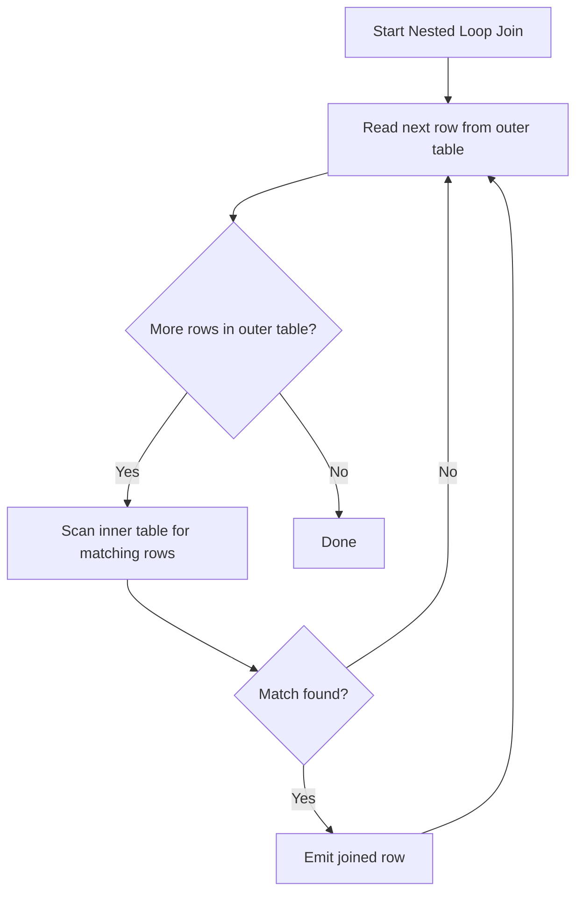

**Practical takeaway:** ensure foreign key / join columns are indexed — this is usually the single biggest lever for join performance, since it allows the optimizer to choose an efficient nested loop or merge join instead of falling back to expensive full scans. Use `EXPLAIN` / `EXPLAIN ANALYZE` to see which strategy the optimizer actually chose.

#### Interview Questions

1. **What determines whether `JOIN` performance is fast or slow, and what's the single most impactful fix?**
   Performance largely depends on whether the join columns are indexed and how large/well-estimated the intermediate result sets are; without an index, the optimizer may be forced into a full-table-scan nested loop or an expensive hash join build. Adding an index on the foreign key / join column is usually the highest-leverage fix, alongside ensuring statistics are up to date so the optimizer picks the right algorithm.
2. **How does `NULL` in a join column affect the join result, and why?**
   Join conditions are ordinary predicates (typically `=`), and comparing `NULL = NULL` (or `NULL` to anything) evaluates to `UNKNOWN`, not `TRUE` — so rows with a `NULL` join column will never match in an `INNER JOIN` (or the "matching" side of an outer join), regardless of whether the other side also has `NULL`. This is why `LEFT JOIN ... WHERE right.col IS NULL` is a standard pattern for "find unmatched rows," rather than trying to join directly on `NULL`.
3. **Give a practical use case for a self-join.**
   Modeling hierarchical data stored flatly in one table, such as an `employees` table with a `manager_id` referencing another row in the same table — a self-join (`employees e JOIN employees m ON e.manager_id = m.id`) lets you retrieve each employee alongside their manager's details in a single query. Other common cases include comparing rows for duplicates, finding sequential/adjacent records, or comparing a row to a "previous" row of the same type.
4. **What's the difference between `LEFT JOIN` and `RIGHT JOIN`, and is one better than the other?**
   They're mirror images — `LEFT JOIN` keeps all rows from the left (first-listed) table, `RIGHT JOIN` keeps all rows from the right table, filling unmatched columns from the other side with `NULL`. Neither is inherently "better"; any `RIGHT JOIN` can be rewritten as a `LEFT JOIN` by swapping table order, and most teams standardize on `LEFT JOIN` alone for consistency and readability.
5. **Why can placing a filter condition in the `WHERE` clause instead of the `ON` clause change the results of an outer join?**
   For an outer join, filtering the "preserved" side's matched columns in `WHERE` (rather than `ON`) effectively converts the outer join back into an inner join for those rows, because `WHERE` is evaluated after the join and eliminates rows where the filtered column is `NULL` from non-matches. To keep outer-join semantics while still restricting the joined table, the condition must go in the `ON` clause instead.
6. **What are the three main physical join algorithms a query optimizer can choose from, and when is each typically used?**
   Nested loop join (good for small outer input with an index on the inner join column), hash join (good for large, unsorted inputs without a usable index — builds a hash table on the smaller side), and merge join (good when both inputs are already sorted on the join key, e.g., via an index). The optimizer picks based on table size estimates, available indexes, and statistics, visible via `EXPLAIN`/`EXPLAIN ANALYZE`.

## Set Operations

Set operations combine the results of two or more `SELECT` queries. All queries involved must return the **same number of columns**, with **compatible data types** in corresponding positions — column names are taken from the first query.

### UNION

`UNION` combines the result sets of two queries and removes duplicate rows across the combined set (like `DISTINCT` applied to the union).

```sql
SELECT name, email FROM customers
UNION
SELECT name, email FROM newsletter_subscribers;
```

### UNION ALL

`UNION ALL` combines result sets *without* removing duplicates — it's simpler and faster since it skips the deduplication step entirely.

```sql
SELECT name, email FROM customers
UNION ALL
SELECT name, email FROM newsletter_subscribers;
```

| Operation | Removes duplicates? | Relative performance |
|---|---|---|
| `UNION` | Yes | Slower (requires sort/hash to dedupe) |
| `UNION ALL` | No | Faster |

**Best practice:** default to `UNION ALL` unless duplicate removal is actually required — deduplication forces the database to sort or hash the entire combined result set, which is wasted work if the source queries are already known to be disjoint or duplicates are acceptable.

### INTERSECT

`INTERSECT` returns only the rows that appear in *both* result sets (set intersection), removing duplicates.

```sql
-- Customers who are also newsletter subscribers
SELECT email FROM customers
INTERSECT
SELECT email FROM newsletter_subscribers;
```

`INTERSECT` is often more readable than the equivalent `INNER JOIN` or `WHERE ... IN (subquery)` formulation when the intent is genuinely "rows common to both sets."

### EXCEPT / MINUS

`EXCEPT` (PostgreSQL, SQL Server) — called `MINUS` in Oracle — returns rows from the first query that do **not** appear in the second query's results (set difference).

```sql
-- Customers who have never subscribed to the newsletter
SELECT email FROM customers
EXCEPT
SELECT email FROM newsletter_subscribers;

-- Oracle equivalent
-- SELECT email FROM customers MINUS SELECT email FROM newsletter_subscribers;
```

| Set Operation | Meaning | SQL Keyword(s) |
|---|---|---|
| Union | All rows from either set (deduped) | `UNION` |
| Union (with duplicates) | All rows from either set (kept) | `UNION ALL` |
| Intersection | Rows in both sets | `INTERSECT` |
| Difference | Rows in first set only | `EXCEPT` (Oracle: `MINUS`) |

#### Interview Questions

1. **What's the difference between `UNION` and `UNION ALL`, and which should you default to?**
   `UNION` removes duplicate rows from the combined result (requiring an internal sort/hash pass), while `UNION ALL` keeps all rows including duplicates and is therefore faster. Default to `UNION ALL` unless you specifically need deduplication, since the dedup step in plain `UNION` adds real overhead on large result sets.
2. **What requirement must the participating queries in a `UNION`/`INTERSECT`/`EXCEPT` satisfy?**
   Each query must return the same number of columns, with data types that are compatible (implicitly convertible) in each corresponding column position; column names in the final result come from the first query in the set operation.
3. **How would you find rows that exist in table A but not in table B using a set operation, and what's the Oracle-specific keyword?**
   `SELECT cols FROM A EXCEPT SELECT cols FROM B;` — in Oracle, the equivalent keyword is `MINUS` instead of `EXCEPT`, but the semantics are identical.
4. **Could you rewrite `INTERSECT` using a `JOIN` or `IN`/`EXISTS`? Why might you still prefer `INTERSECT`?**
   Yes — `INTERSECT` can be rewritten as an `INNER JOIN` on all matching columns or a correlated `WHERE ... IN (subquery)`. `INTERSECT` is often preferred purely for readability when the intent is "rows common to two full result sets," rather than a join on a specific key relationship.
5. **If you combine `UNION` with `ORDER BY`, where does the `ORDER BY` clause go?**
   Only one `ORDER BY` is allowed, placed at the very end after the last `SELECT` in the set operation chain — it applies to the entire combined result set, not to an individual `SELECT`, and can only reference output column names/positions (not table-qualified names from a specific branch).

## Subqueries

A subquery (or "inner query") is a `SELECT` statement nested inside another query — in a `WHERE`/`HAVING` condition, a `FROM` clause (as a derived table), or even the `SELECT` list itself.

### Scalar Subqueries

A scalar subquery returns exactly one row and one column — a single value — and can be used anywhere a literal value would be valid.

```sql
SELECT name, salary,
    (SELECT AVG(salary) FROM employees) AS company_avg_salary
FROM employees;

SELECT * FROM employees
WHERE salary > (SELECT AVG(salary) FROM employees);
```

**Gotcha:** if a scalar subquery unexpectedly returns more than one row at runtime, the database raises an error (e.g., "more than one row returned by a subquery used as an expression") rather than silently picking one — always ensure the inner query is inherently limited to one row (via aggregation, `LIMIT 1`, or a uniqueness guarantee).

### Row Subqueries

A row subquery returns a single row but multiple columns, typically compared using row constructor syntax `(col1, col2) = (subquery)`.

```sql
-- Find the employee(s) with the highest salary and earliest hire date combination
SELECT * FROM employees
WHERE (salary, hire_date) = (
    SELECT MAX(salary), MIN(hire_date) FROM employees
);
```

Row comparisons are less commonly used than scalar or table subqueries but are handy for atomically comparing multiple related columns at once without repeating the subquery per column.

### Table Subqueries

A table (or "derived table") subquery returns multiple rows and columns, and is used inside a `FROM` clause as if it were a regular table — it must be given an alias.

```sql
SELECT dept_summary.department, dept_summary.avg_salary
FROM (
    SELECT department, AVG(salary) AS avg_salary
    FROM employees
    GROUP BY department
) AS dept_summary
WHERE dept_summary.avg_salary > 70000;
```

**Gotcha:** most databases (including PostgreSQL and MySQL) *require* an alias for a derived table in `FROM` — omitting it is a syntax error, unlike a scalar subquery which doesn't need one.

### Correlated Subqueries

A correlated subquery references a column from the outer query, so conceptually it must be (re-)evaluated once per row of the outer query, rather than once overall.

```sql
-- For each employee, check if they earn more than their department's average
SELECT e.name, e.salary, e.department
FROM employees e
WHERE e.salary > (
    SELECT AVG(e2.salary)
    FROM employees e2
    WHERE e2.department = e.department  -- correlation: references outer row's department
);
```

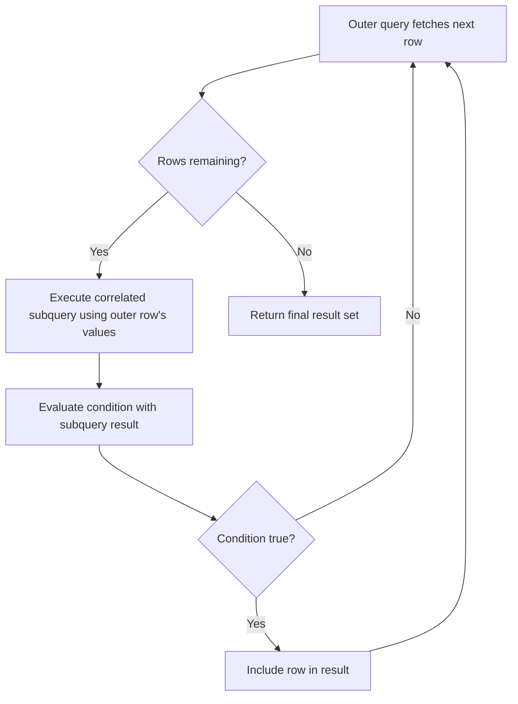

**Performance note:** conceptually a correlated subquery runs once per outer row, which sounds expensive — in practice, modern query optimizers frequently rewrite correlated subqueries (especially `EXISTS`/`IN` forms) into equivalent semi-joins that execute far more efficiently than a literal row-by-row loop. Still, always check `EXPLAIN` output on large tables, since not every correlated pattern gets optimized well.

### EXISTS vs IN

Both `EXISTS` and `IN` can express "does a related row exist," but they differ in `NULL` handling and how the optimizer typically executes them.

```sql
-- IN form
SELECT * FROM customers c
WHERE c.id IN (SELECT customer_id FROM orders o WHERE o.total > 1000);

-- EXISTS form (correlated)
SELECT * FROM customers c
WHERE EXISTS (
    SELECT 1 FROM orders o WHERE o.customer_id = c.id AND o.total > 1000
);
```

| Aspect | `IN` | `EXISTS` |
|---|---|---|
| NULL safety (with `NOT`) | Unsafe — `NOT IN` breaks if list has NULLs | Safe — unaffected by NULLs in subquery |
| Correlation | Usually non-correlated (fixed list) | Usually correlated to outer query |
| Typical optimizer strategy | Materializes list, may hash/semi-join | Often rewritten to a semi-join, short-circuits on first match |
| Readability for "existence" checks | Less direct | More directly expresses intent |

**Best practice:** for existence checks (especially negated ones), prefer `NOT EXISTS` over `NOT IN` to avoid the `NULL` pitfall; for simple membership against a short, guaranteed-non-null literal list, `IN` remains perfectly idiomatic and clear.

#### Interview Questions

1. **What's the difference between a correlated and a non-correlated subquery, and why does it matter for performance?**
   A non-correlated subquery is fully independent of the outer query and can be evaluated once; a correlated subquery references a column from the outer query, so conceptually it's re-evaluated per outer row. In practice the optimizer often rewrites correlated `EXISTS`/`IN` patterns into an efficient semi-join, but it's still important to check the execution plan since not all correlated patterns get optimized.
2. **What happens if a scalar subquery returns more than one row at runtime?**
   The database raises a runtime error (e.g., "more than one row returned by a subquery used as an expression") rather than silently choosing one value — the query must guarantee at most one row is returned, typically via an aggregate function, a unique constraint, or `LIMIT 1`.
3. **Why must a derived table (subquery in `FROM`) always have an alias, unlike a scalar subquery in `SELECT`?**
   The database needs a name to qualify columns coming from the derived table when referencing them elsewhere in the outer query (e.g., in `WHERE`, `JOIN`, or the `SELECT` list); without an alias, there'd be no way to unambiguously refer to its columns, so most databases enforce it as a syntax requirement.
4. **When would you prefer a subquery over a `JOIN`, or vice versa?**
   A subquery (especially `EXISTS`/`IN`) is often clearer when you only need to check for a related row's existence or a single aggregate value and don't need any columns from the related table in the output. A `JOIN` is preferred when you need to actually select or aggregate columns from both tables together, since it avoids re-fetching related data separately and lets the optimizer consider join-specific strategies (hash/merge/nested loop).
5. **Why is `NOT EXISTS` generally safer than `NOT IN` for existence checks?**
   `NOT IN` breaks silently (returns zero rows) if the subquery result contains any `NULL`, because comparing against `NULL` yields `UNKNOWN` for every row. `NOT EXISTS` only checks for the presence of matching rows under the correlation condition and is unaffected by `NULL`s in the subquery's other columns, making it the safer default for negated existence checks.
6. **Can a subquery in the `SELECT` list (a scalar subquery) reference columns from the outer query?**
   Yes — that makes it a correlated scalar subquery, evaluated per outer row (e.g., computing a per-row percentage of a department total). It must still be guaranteed to return exactly one row and one column per evaluation, or the query will error at runtime.

## Common Table Expressions (CTE)

A Common Table Expression (CTE) is a named, temporary result set defined with a `WITH` clause immediately before a query, and referenced by name in that query as if it were a regular table. CTEs exist only for the duration of the statement — they aren't persisted like views.

### WITH Clause

The `WITH` clause lets you factor out a subquery into a readable, named block, which is especially useful when the same derived result is needed multiple times or when a query would otherwise nest several layers of subqueries.

```sql
WITH high_earners AS (
    SELECT id, name, department, salary
    FROM employees
    WHERE salary > 90000
)
SELECT department, COUNT(*) AS high_earner_count
FROM high_earners
GROUP BY department;
```

- Improves readability by giving a meaningful name to an intermediate result instead of an inline nested subquery.
- Scoped only to the single statement it precedes — cannot be referenced by later, separate statements.
- In PostgreSQL 12+, a non-recursive CTE that's referenced only once may be *inlined* (folded into the outer query) by the planner unless you force materialization with `AS MATERIALIZED`; older versions (and `AS NOT MATERIALIZED` vs `AS MATERIALIZED` explicitly) always materialized the CTE as an optimization fence. This matters because an inlined CTE lets predicates push down into it, while a materialized one is computed once and reused as-is.

### Recursive CTE (Overview)

A recursive CTE (`WITH RECURSIVE`) lets a query reference itself to walk hierarchical or graph-like data — e.g., an org chart, a bill-of-materials tree, or a category hierarchy. It's composed of an **anchor member** (the base case, executed once) and a **recursive member** (unioned with the anchor, executed repeatedly against the *previous iteration's* results until it returns no rows).

```sql
WITH RECURSIVE org_chart AS (
    -- Anchor member: top-level managers with no manager
    SELECT id, name, manager_id, 1 AS level
    FROM employees
    WHERE manager_id IS NULL

    UNION ALL

    -- Recursive member: employees whose manager is already in org_chart
    SELECT e.id, e.name, e.manager_id, oc.level + 1
    FROM employees e
    JOIN org_chart oc ON e.manager_id = oc.id
)
SELECT * FROM org_chart ORDER BY level, name;
```

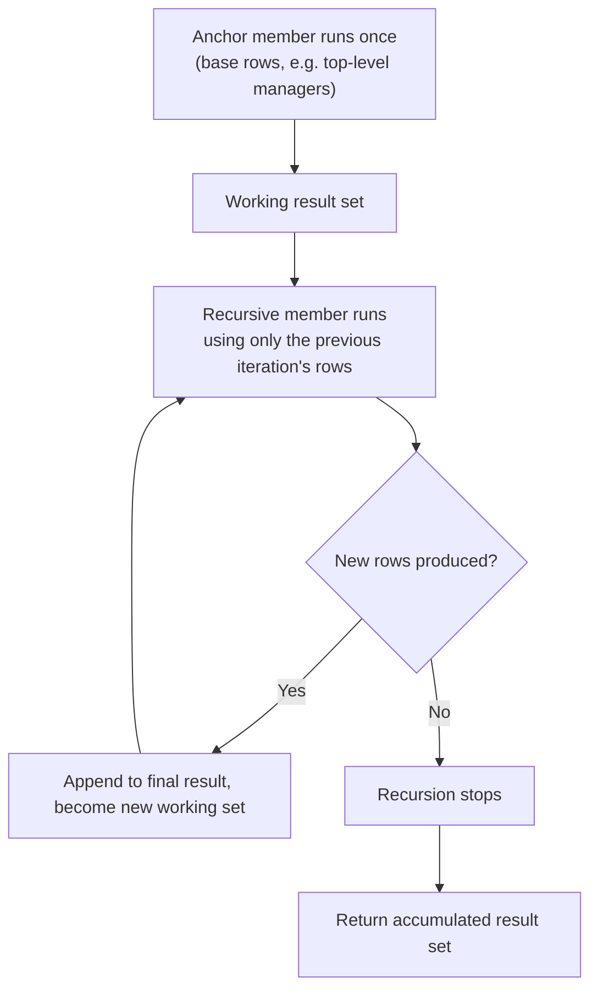

- Must use `UNION ALL` (not `UNION`) in most engines when the goal is a simple accumulating traversal — using `UNION` adds a deduplication step and can also be used deliberately to prevent infinite loops on cyclic data.
- Always include a natural termination condition (the recursive term eventually returns zero rows); for genuinely cyclic graphs, track visited nodes explicitly to avoid infinite recursion, and set an engine-level safety limit (e.g., PostgreSQL's `SET max_recursive_iterations` isn't standard, but recursion depth can be capped with a counter column and a `WHERE level < N` guard).

### Multiple CTEs

A single `WITH` clause can define several CTEs, comma-separated; later CTEs may reference earlier ones defined in the same clause, building up a pipeline of named intermediate steps.

```sql
WITH dept_avg AS (
    SELECT department, AVG(salary) AS avg_salary
    FROM employees
    GROUP BY department
),
above_avg AS (
    SELECT e.name, e.department, e.salary
    FROM employees e
    JOIN dept_avg d ON e.department = d.department
    WHERE e.salary > d.avg_salary
)
SELECT * FROM above_avg ORDER BY department, salary DESC;
```

| Aspect | CTE (`WITH`) | Subquery | Temp Table |
|---|---|---|---|
| Scope | Single statement | Single statement | Session/transaction (persists across statements) |
| Readability | High — named, can chain multiple | Lower for deeply nested cases | High, but requires extra `CREATE`/`DROP` statements |
| Reusable within same query | Yes, by name, multiple times | Must repeat the subquery text | Yes |
| Indexable | No (unless materialized and engine-specific) | No | Yes |
| Typical use case | Readable multi-step transformations, recursion | One-off inline filtering/derivation | Multi-statement batch processing, large intermediate data |

#### Interview Questions

1. **What's the difference between a CTE and a subquery, and when would you prefer one over the other?**
   Both define an inline, temporary result, but a CTE is named up front via `WITH` and can be referenced multiple times in the outer query without repeating its definition, which improves readability for multi-step logic. A subquery is inline and unnamed; it's fine for a single, simple use but becomes hard to read if reused or deeply nested. CTEs are also required for recursion, which plain subqueries cannot express.
2. **Can a CTE be referenced more than once in the same query, and does that mean it's computed multiple times?**
   Yes, it can be referenced multiple times. Whether it's computed once or re-evaluated per reference depends on the engine and materialization: PostgreSQL may inline (and thus potentially re-evaluate) a non-recursive CTE referenced once, but a CTE referenced multiple times, or explicitly marked `AS MATERIALIZED`, is typically computed once and its result reused.
3. **What are the two required parts of a recursive CTE, and what stops the recursion?**
   The anchor member (base case, run once) and the recursive member (joins back to the CTE's own name, run repeatedly against only the most recently produced rows). Recursion stops naturally when the recursive member's query returns zero new rows for an iteration.
4. **Why use `UNION ALL` instead of `UNION` in most recursive CTEs?**
   `UNION ALL` avoids an expensive duplicate-elimination pass on every iteration, which matters for performance on deep or wide recursions. `UNION` is used deliberately only when you need to deduplicate — for example, to break out of a cycle in graph data where the same node could otherwise be revisited forever.
5. **Are CTEs indexed or optimized like a real table?**
   No — a plain CTE is not a persisted, indexable object; it's either inlined into the surrounding query or materialized as a temporary result for that one statement only. If you need an indexable, reusable structure across queries, use a temp table or a materialized view instead.
6. **How would you guard against infinite recursion when the underlying data might contain cycles (e.g., a manager hierarchy with a data-entry loop)?**
   Add a column tracking visited keys (e.g., an array of ancestor IDs) and a `WHERE NOT (child_id = ANY(visited_path))` condition in the recursive member, or cap the depth with a counter and `WHERE level < N`, since the database will otherwise loop until it exhausts memory or hits an engine-level recursion limit.

## Window Functions

A window function performs a calculation across a set of rows related to the current row — its "window" — without collapsing those rows into a single output row the way `GROUP BY` does. Every input row is preserved in the output, each with its computed window value alongside it, which makes window functions ideal for rankings, running totals, and row-to-row comparisons.

### OVER Clause

The `OVER (...)` clause is what turns an ordinary aggregate or ranking function into a window function — it defines the set of rows the function operates on for each row of the result, instead of collapsing the whole result into one row.

```sql
SELECT name, department, salary,
    AVG(salary) OVER () AS company_avg_salary
FROM employees;
```

- Without any arguments, `OVER ()` treats the entire result set as one window — every row sees the same overall average, but individual rows are still returned.
- Distinguishes a window function call from a regular aggregate: `AVG(salary)` in a plain `SELECT` with `GROUP BY` collapses rows; `AVG(salary) OVER (...)` keeps every row and attaches the computed value to it.

### PARTITION BY

`PARTITION BY` splits the rows into independent groups ("partitions"), and the window function is applied separately within each partition — conceptually similar to `GROUP BY`, but again without collapsing rows.

```sql
SELECT name, department, salary,
    AVG(salary) OVER (PARTITION BY department) AS dept_avg_salary
FROM employees;
```

Each employee row now shows their own department's average alongside their individual salary, letting you directly compare an individual value against its group aggregate in the same row — something a plain `GROUP BY` query cannot do without a self-join.

### ORDER BY in Window Functions

`ORDER BY` inside `OVER (...)` defines the logical row order used for order-sensitive functions (ranking, `LEAD`/`LAG`, running totals). It also implicitly establishes the default frame (`RANGE BETWEEN UNBOUNDED PRECEDING AND CURRENT ROW`) for aggregate window functions when no explicit frame clause is given.

```sql
SELECT name, department, hire_date,
    ROW_NUMBER() OVER (PARTITION BY department ORDER BY hire_date) AS hire_order
FROM employees;
```

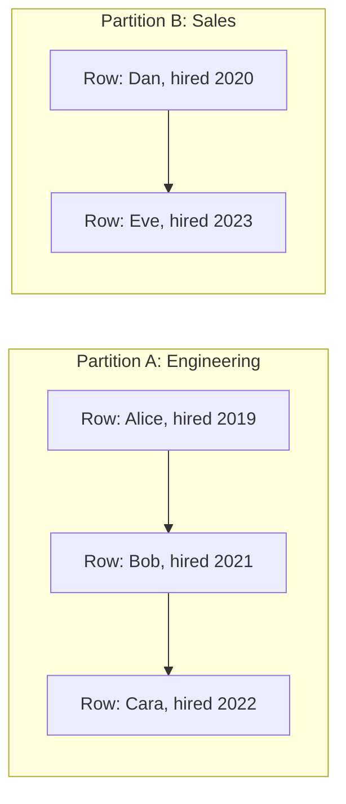

### ROW_NUMBER

`ROW_NUMBER()` assigns a unique, strictly sequential integer (1, 2, 3, …) to each row within its partition, based on the `ORDER BY` — ties get arbitrarily-but-deterministically broken (determined by physical row order unless the `ORDER BY` is fully unambiguous).

```sql
SELECT name, salary,
    ROW_NUMBER() OVER (ORDER BY salary DESC) AS rank_num
FROM employees;
```

Common use case: pagination or "top N per group" queries (e.g., top 3 highest earners per department) by filtering on `rank_num <= 3` in an outer query or CTE, since `ROW_NUMBER()` can't be used directly in the same `WHERE` clause it's defined in.

### RANK

`RANK()` assigns the same rank to tied rows, then **skips** the next rank(s) accordingly — e.g., two rows tied for rank 1 means the next row gets rank 3, not 2.

```sql
SELECT name, salary,
    RANK() OVER (ORDER BY salary DESC) AS salary_rank
FROM employees;
```

### DENSE_RANK

`DENSE_RANK()` also gives tied rows the same rank, but leaves **no gaps** — the next distinct value always gets the very next integer.

```sql
SELECT name, salary,
    DENSE_RANK() OVER (ORDER BY salary DESC) AS salary_dense_rank
FROM employees;
```

| Salary | `ROW_NUMBER()` | `RANK()` | `DENSE_RANK()` |
|---|---|---|---|
| 100,000 | 1 | 1 | 1 |
| 100,000 | 2 | 1 | 1 |
| 90,000 | 3 | 3 | 2 |
| 80,000 | 4 | 4 | 3 |

- **`ROW_NUMBER`**: always unique, never ties, useful for deduplication and strict pagination.
- **`RANK`**: reflects "competition ranking" (1st, 1st, 3rd) — matches how sports standings usually work.
- **`DENSE_RANK`**: no gaps, useful when you want a compact "tier" number (e.g., salary tier 1, 2, 3…) regardless of how many ties occurred.

### LEAD

`LEAD(column, offset, default)` looks **forward** to a subsequent row within the same partition/order, without needing a self-join.

```sql
SELECT name, department, salary,
    LEAD(salary, 1) OVER (PARTITION BY department ORDER BY hire_date) AS next_hired_salary
FROM employees;
```

Common use case: comparing each row to the "next" chronological event — e.g., time between consecutive orders, or the salary of the next person hired.

### LAG

`LAG(column, offset, default)` looks **backward** to a preceding row within the same partition/order — the mirror image of `LEAD`.

```sql
SELECT name, order_date, amount,
    amount - LAG(amount, 1, 0) OVER (PARTITION BY customer_id ORDER BY order_date) AS change_from_prev_order
FROM orders;
```

This is the standard pattern for computing period-over-period deltas (e.g., month-over-month sales change) directly in SQL without a self-join.

### FIRST_VALUE

`FIRST_VALUE(column)` returns the value from the **first** row of the current window frame (as defined by `PARTITION BY`/`ORDER BY`/frame clause).

```sql
SELECT name, department, salary,
    FIRST_VALUE(name) OVER (PARTITION BY department ORDER BY salary DESC) AS top_earner_in_dept
FROM employees;
```

### LAST_VALUE

`LAST_VALUE(column)` returns the value from the **last** row of the current window frame — but this is the most common source of window-function bugs.

```sql
-- Naive usage often gives an unexpected result:
SELECT name, department, salary,
    LAST_VALUE(name) OVER (PARTITION BY department ORDER BY salary DESC) AS naive_last
FROM employees;

-- Correct usage — explicitly extend the frame to the whole partition:
SELECT name, department, salary,
    LAST_VALUE(name) OVER (
        PARTITION BY department ORDER BY salary DESC
        ROWS BETWEEN UNBOUNDED PRECEDING AND UNBOUNDED FOLLOWING
    ) AS true_last
FROM employees;
```

**Gotcha:** with an `ORDER BY` present and no explicit frame, the *default* frame is `RANGE BETWEEN UNBOUNDED PRECEDING AND CURRENT ROW` — meaning `LAST_VALUE` sees only up to the *current* row, so it effectively just returns the current row's own value rather than the true last row of the partition. You must explicitly widen the frame to `ROWS BETWEEN UNBOUNDED PRECEDING AND UNBOUNDED FOLLOWING` to get the intuitive "last row in partition" behavior.

### Running Totals

A running (cumulative) total is computed with an aggregate window function ordered by some column, accumulating from the start of the partition up to the current row.

```sql
SELECT order_date, amount,
    SUM(amount) OVER (ORDER BY order_date ROWS BETWEEN UNBOUNDED PRECEDING AND CURRENT ROW) AS running_total
FROM orders
ORDER BY order_date;
```

Because `ROWS BETWEEN UNBOUNDED PRECEDING AND CURRENT ROW` is also the default frame implied by a plain `ORDER BY` (with `RANGE` semantics) for aggregate window functions, the shorter form `SUM(amount) OVER (ORDER BY order_date)` produces the same running total in most cases — but explicitly specifying `ROWS` avoids subtle differences when there are duplicate `ORDER BY` values (with `RANGE`, all peer rows with equal order-by values are included together, which can pull in more rows than expected).

#### Interview Questions

1. **How does a window function differ from `GROUP BY`?**
   `GROUP BY` collapses multiple rows into one row per group, discarding individual row detail. A window function computes an aggregate or ranking value per row while still returning every original row — each row gets its own computed value "alongside" it rather than being merged away, which is why window functions can, for example, show both an employee's individual salary and their department average in the same row.
2. **What's the difference between `RANK()`, `DENSE_RANK()`, and `ROW_NUMBER()`?**
   `ROW_NUMBER()` always assigns unique sequential numbers with no ties. `RANK()` gives tied rows the same rank but then skips subsequent rank values (gaps). `DENSE_RANK()` also gives ties the same rank but never leaves gaps — the next distinct value always gets the immediately following integer.
3. **Why can `LAST_VALUE()` return a surprising/wrong-looking result by default?**
   Because the implicit default window frame when an `ORDER BY` is present is `RANGE BETWEEN UNBOUNDED PRECEDING AND CURRENT ROW`, so `LAST_VALUE` only "sees" rows up to the current one and typically just returns the current row's value. To get the true last row of the partition, you must explicitly set the frame to `ROWS BETWEEN UNBOUNDED PRECEDING AND UNBOUNDED FOLLOWING`.
4. **Can you use a window function's result directly in the `WHERE` clause of the same query?**
   No — window functions are logically evaluated after `WHERE`, `GROUP BY`, and `HAVING`, alongside the `SELECT` list, so their aliases can't be referenced in the same query's `WHERE`. To filter on a window function's result (e.g., "top 3 per department"), wrap the query in a CTE or subquery and filter in the outer query instead.
5. **How would you compute a "top N per group" query using window functions?**
   Use `ROW_NUMBER()` (or `RANK()`/`DENSE_RANK()` depending on tie-handling needs) partitioned by the group column and ordered by the ranking criterion, inside a CTE or subquery; then filter the outer query on `WHERE rn <= N`. This avoids a correlated subquery or self-join per group.
6. **What's the practical difference between `LEAD`/`LAG` and a self-join for comparing a row to an adjacent row?**
   `LEAD`/`LAG` express the intent directly and let the engine compute the adjacent value in a single pass over the ordered partition, which is typically far more efficient and readable than a self-join (which requires joining the table to itself on a computed adjacency condition and risks producing incorrect results with gaps or duplicate order keys).

## Views

A view is a stored, named `SELECT` query that behaves like a virtual table — it doesn't store data itself (except a materialized view), but re-runs its underlying query each time it's referenced.

### Creating Views

A view is created with `CREATE VIEW name AS SELECT ...` and can then be queried, joined, and filtered just like a regular table.

```sql
CREATE VIEW active_employee_summary AS
SELECT id, name, department, salary
FROM employees
WHERE status = 'ACTIVE';

SELECT * FROM active_employee_summary WHERE department = 'Engineering';
```

- **Abstraction**: hides complex joins/filters behind a simple name, so consumers don't need to know the underlying schema details.
- **Security**: can expose only specific columns/rows of a sensitive table (e.g., excluding a `salary` or `ssn` column) and be granted to a role instead of granting direct table access.
- **Consistency**: centralizes a commonly-used query definition so business logic (e.g., "what counts as an active employee") isn't duplicated across the codebase.

### Updating Views

An existing view's definition can be replaced with `CREATE OR REPLACE VIEW` (without needing to `DROP` it first, as long as the column list/types are compatible), and in some cases you can `INSERT`/`UPDATE`/`DELETE` directly against a view.

```sql
CREATE OR REPLACE VIEW active_employee_summary AS
SELECT id, name, department, salary, hire_date
FROM employees
WHERE status = 'ACTIVE';

-- Updatable view example (simple, single-table, no aggregates)
CREATE VIEW engineering_employees AS
SELECT id, name, salary
FROM employees
WHERE department = 'Engineering'
WITH CHECK OPTION;

UPDATE engineering_employees SET salary = salary * 1.05 WHERE id = 42;
```

- A view is generally **updatable** only if it's based on a single table, has no `GROUP BY`/`DISTINCT`/aggregate functions/set operations, and each output column maps directly to one underlying column.
- `WITH CHECK OPTION` ensures that rows inserted/updated through the view still satisfy the view's own `WHERE` condition — without it, you could update a row through the view in a way that makes it silently "disappear" from the view.

### View Limitations

- A plain view has **no independent storage or indexing** — every query against it re-executes the underlying `SELECT`, so its performance is entirely bound to the performance of that underlying query (and any indexes on the base tables it touches).
- Only **simple** views (see above) are updatable; views involving joins, aggregates, `DISTINCT`, `UNION`, or window functions are typically read-only.
- Views cannot take parameters directly (unlike stored procedures/functions) — dynamic filtering must happen via `WHERE` clauses applied against the view from the calling query.
- Schema changes to underlying base tables (e.g., dropping a column a view depends on) can silently break dependent views, so views add a hidden coupling that must be tracked during migrations.

### Materialized Views (Concept)

A materialized view **stores** the query's result physically on disk at creation time (or last refresh), rather than recomputing it on every access — trading data freshness for query speed.

```sql
CREATE MATERIALIZED VIEW dept_salary_summary AS
SELECT department, AVG(salary) AS avg_salary, COUNT(*) AS employee_count
FROM employees
GROUP BY department;

-- Data is stale until explicitly refreshed:
REFRESH MATERIALIZED VIEW dept_salary_summary;

-- PostgreSQL: refresh without blocking concurrent reads (requires a unique index on the view)
REFRESH MATERIALIZED VIEW CONCURRENTLY dept_salary_summary;
```

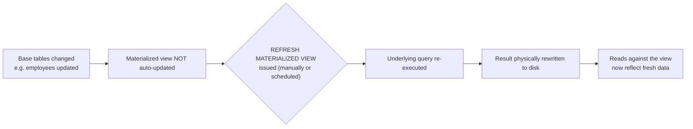

| Aspect | View | Materialized View |
|---|---|---|
| Storage | None — just a stored query definition | Physically stores result set |
| Freshness | Always up to date (re-run each query) | Stale until explicitly refreshed |
| Query speed | Same as running the underlying query | Fast — reads pre-computed data |
| Indexable | No | Yes (can add indexes on the materialized result) |
| Write overhead | None | Refresh cost (can be expensive on large datasets) |
| Best for | Simple abstraction, always-current data, low query volume | Expensive aggregations/joins, read-heavy, tolerable staleness |

#### Interview Questions

1. **What's the fundamental difference between a view and a materialized view?**
   A regular view is just a stored query — it has no data of its own and re-executes the underlying `SELECT` every time it's queried, so it's always current but has no independent performance benefit. A materialized view physically stores the computed result, so reads are fast, but the data becomes stale until you explicitly (or on a schedule) `REFRESH` it.
2. **When is a view updatable, and what's the purpose of `WITH CHECK OPTION`?**
   A view is generally updatable only if it maps to a single base table with no aggregates, `DISTINCT`, `GROUP BY`, or set operations, so each row/column corresponds directly to an underlying row/column. `WITH CHECK OPTION` prevents inserts/updates through the view from producing rows that would violate the view's own `WHERE` predicate, which would otherwise let a row "vanish" from the view immediately after being written through it.
3. **Does creating a view improve query performance?**
   No — a plain view has no storage or indexing of its own; querying it just re-runs the underlying query, so performance depends entirely on the base tables, their indexes, and the query itself. Only a materialized view (or a view combined with proper indexing on the base tables) can improve performance.
4. **How do you keep a materialized view's data current, and what are the tradeoffs?**
   You must explicitly run `REFRESH MATERIALIZED VIEW` (optionally `CONCURRENTLY` in PostgreSQL to avoid blocking reads, which requires a unique index on the view), typically on a schedule or triggered after significant data changes. The tradeoff is staleness: between refreshes, the view can return outdated results, so it's best suited for expensive aggregations where slightly-stale data is acceptable in exchange for fast reads.
5. **Why might a view "break" after a schema migration even if the view itself wasn't touched?**
   Views depend on the structure of their underlying base tables; dropping or renaming a column the view references (or changing a column's type incompatibly) can invalidate the view or cause runtime errors, even though no one explicitly altered the view. This hidden coupling means schema changes should be checked against dependent views before deployment.
6. **Can you index a materialized view but not a regular view — why?**
   Yes. A materialized view stores actual physical rows like a table, so indexes can be created on it directly to speed up queries against the stored snapshot. A regular view has no physical storage of its own — any indexing benefit must come from indexes on the underlying base tables, since the view itself is just a saved query definition.

## Indexes

An index is an auxiliary data structure (typically a B-tree) that lets the database locate rows matching a condition without scanning the entire table, at the cost of extra storage and slower writes (since the index must also be maintained).

### CREATE INDEX

The basic form creates a B-tree index (the default in most relational databases) on one or more columns.

```sql
CREATE INDEX idx_employees_department ON employees (department);
```

- Speeds up `WHERE department = 'Engineering'`, `ORDER BY department`, and equality/range joins on that column.
- B-tree is the default and general-purpose choice because it efficiently supports equality, range (`<`, `>`, `BETWEEN`), and sorting operations — most other index types (hash, GiST, GIN, BRIN in PostgreSQL) are specialized for particular data types or query patterns.

### DROP INDEX

Removing an index is straightforward but should be done deliberately, since it immediately affects the query plans of anything relying on it.

```sql
DROP INDEX idx_employees_department;
```

Indexes are usually dropped when they're no longer used (verify via the database's usage statistics, e.g., PostgreSQL's `pg_stat_user_indexes`), when they duplicate another index's leading columns, or when their write-maintenance cost outweighs their read benefit.

### Composite Index

A composite (multi-column) index covers more than one column, and the **column order matters enormously** — it follows the "leftmost prefix" rule.

```sql
CREATE INDEX idx_employees_dept_salary ON employees (department, salary);

-- Uses the index efficiently (leftmost column present):
SELECT * FROM employees WHERE department = 'Engineering';
SELECT * FROM employees WHERE department = 'Engineering' AND salary > 80000;

-- Cannot use this index efficiently (leftmost column missing):
SELECT * FROM employees WHERE salary > 80000;
```

The index is physically sorted first by `department`, then by `salary` within each department — so it's usable for queries filtering by `department` alone, or by `department` + `salary` together, but not for filtering by `salary` alone, since matching salary values are scattered across many different department groupings in the index structure.

### Unique Index

A unique index enforces that no two rows share the same value (or combination of values) in the indexed column(s), while also providing the same lookup speedup as a regular index.

```sql
CREATE UNIQUE INDEX idx_employees_email ON employees (email);
```

Declaring a column `UNIQUE` in a table constraint typically creates an underlying unique index automatically (implementation detail of the database) — so a unique constraint and a manually created unique index usually end up being functionally equivalent, differing mainly in how they're declared and documented.

### Partial Index (Overview)

A partial index (PostgreSQL feature) only indexes rows matching a `WHERE` condition, making it smaller and faster to maintain than a full-table index when only a subset of rows is commonly queried.

```sql
CREATE INDEX idx_active_employees_email ON employees (email) WHERE status = 'ACTIVE';

-- Uses the partial index efficiently:
SELECT * FROM employees WHERE status = 'ACTIVE' AND email = 'jane@example.com';
```

Ideal when queries almost always filter on a specific, stable condition (e.g., only "active" or "unprocessed" rows), since it avoids indexing the majority of rows that are rarely queried.

### Functional Index (Overview)

A functional (expression) index indexes the *result of an expression* applied to a column, rather than the raw column value — useful when queries filter on a transformed/derived form of the data.

```sql
CREATE INDEX idx_employees_email_lower ON employees (LOWER(email));

-- Uses the functional index efficiently:
SELECT * FROM employees WHERE LOWER(email) = 'jane@example.com';
```

Without the functional index, applying `LOWER()` to the column in a `WHERE` clause would prevent the optimizer from using a plain index on `email` directly, since the indexed values (raw case) don't match the transformed search value.

### Index Usage

The query optimizer decides whether to use an available index based on cost estimates derived from table/column statistics — it doesn't use an index just because one exists.

- **Selectivity**: how many rows match a condition relative to the table's total size. Highly selective conditions (few matching rows, e.g., a unique email) benefit greatly from an index; low-selectivity conditions (e.g., a boolean column with a 50/50 split) often don't, because scanning the whole table sequentially can be cheaper than jumping around via an index.
- **Statistics**: the planner relies on up-to-date statistics (row counts, value distribution/histograms) — run `ANALYZE` (PostgreSQL) after major data changes so the planner's cost estimates stay accurate.
- **Data type/operator compatibility**: an index only helps if the query's `WHERE`/`JOIN`/`ORDER BY` uses operators the index supports (e.g., a B-tree index doesn't help with `LIKE '%text%'` pattern matches without a specialized index type like GIN with `pg_trgm`).

### When Not to Use Indexes

Indexes aren't free — every index adds overhead to `INSERT`/`UPDATE`/`DELETE` (the index must be kept in sync) and consumes additional storage, so blindly indexing every column is counterproductive.

- **Small tables**: a sequential scan of a small table is often faster than the overhead of an index lookup (traversing a B-tree, then fetching rows) — the optimizer usually detects this and ignores the index anyway.
- **Low-selectivity columns**: indexing a column with very few distinct values (e.g., a boolean `is_deleted` flag) rarely helps, since a large fraction of rows would match any given value.
- **Write-heavy tables**: tables with frequent `INSERT`/`UPDATE`/`DELETE` pay a real cost for every index — each write must also update every index on the table, so excess indexes slow down writes disproportionately to their read benefit.
- **Columns rarely used in filters/joins/sorts**: an index that's never chosen by the optimizer is pure overhead — periodically audit and drop unused indexes.
- **Very wide or frequently updated columns**: indexing large text columns (unless a specialized index type is used) or columns updated on nearly every write increases index bloat and maintenance cost significantly.

| Index Type | Best For | Notes |
|---|---|---|
| B-tree (default) | Equality, range, sorting | General-purpose, most common |
| Hash | Pure equality lookups | Rarely needed over B-tree in modern PostgreSQL |
| GIN | Full-text search, array/JSONB containment | Larger, slower to update, fast for "contains" queries |
| GiST | Geometric data, range types, nearest-neighbor | Used for specialized data types |
| BRIN | Very large, naturally ordered tables (e.g., time-series) | Tiny index size, coarse-grained |
| Partial | Queries that always filter on a known subset | Smaller than a full index |

#### Interview Questions

1. **Why doesn't adding an index always speed up a query?**
   The optimizer only uses an index if its cost model estimates it's cheaper than a sequential scan — for low-selectivity columns, small tables, or queries returning a large fraction of rows, scanning sequentially can be faster than the random I/O of index lookups plus row fetches. Outdated table statistics can also cause the optimizer to make a suboptimal choice.
2. **What is the "leftmost prefix" rule for composite indexes, and why does it matter?**
   A composite index on `(a, b)` is physically sorted first by `a`, then by `b` within each `a` value. It can efficiently serve queries filtering on `a` alone, or on `a` and `b` together, but not on `b` alone, because matching `b` values are scattered non-contiguously across the index. Column order should match the most common query patterns, typically putting the most selective or most-frequently-filtered column first (though exact ordering depends on query patterns).
3. **When would you avoid adding an index, even though it would technically speed up some query?**
   On tables with heavy write throughput, where the write-side cost of maintaining an extra index (updating it on every `INSERT`/`UPDATE`/`DELETE`) outweighs the read-side benefit for a rarely-run query; on very small tables where a sequential scan is already fast; or on low-selectivity columns where the index provides little to no pruning benefit.
4. **What's the difference between a unique constraint and a unique index?**
   Functionally they usually achieve the same outcome — most databases implement a unique constraint using an underlying unique index automatically. The main difference is intent/documentation: a `UNIQUE` constraint declares a business rule as part of the table definition, while creating a unique index directly is a more implementation-focused way to get the same enforcement plus the lookup speed benefit.
5. **What is a partial index and when would you use one?**
   A partial index only indexes rows matching a specified `WHERE` condition (e.g., `WHERE status = 'ACTIVE'`), making it smaller and cheaper to maintain than indexing the whole table. It's ideal when queries consistently filter on a known subset of rows (like only active or unprocessed records) and the excluded rows are rarely or never queried by that predicate.
6. **Why would `WHERE LOWER(email) = 'x'` not use a plain index on `email`, and how do you fix it?**
   A standard index stores the column's raw values, sorted as-is; applying a function like `LOWER()` in the query transforms the search value before comparison, so it no longer matches the index's stored (untransformed) values directly, forcing a sequential scan. The fix is a functional (expression) index built on `LOWER(email)` itself, so the index stores the already-transformed values and can be matched directly.

## Transactions

A transaction groups one or more statements into a single atomic unit of work — either all of its changes are applied (`COMMIT`) or none of them are (`ROLLBACK`) — and provides the ACID guarantees (Atomicity, Consistency, Isolation, Durability) relied on to keep data correct under concurrent access and failures.

### BEGIN

`BEGIN` (or `START TRANSACTION`) explicitly opens a transaction block, after which subsequent statements are grouped together until a `COMMIT` or `ROLLBACK`.

```sql
BEGIN;

UPDATE accounts SET balance = balance - 100 WHERE id = 1;
UPDATE accounts SET balance = balance + 100 WHERE id = 2;

COMMIT;
```

Everything between `BEGIN` and `COMMIT`/`ROLLBACK` is treated as one indivisible operation from the perspective of other transactions (subject to the active isolation level).

### COMMIT

`COMMIT` permanently applies all changes made during the transaction, making them visible to other transactions and durable against crashes (once committed, guaranteed to survive a subsequent power loss, per the "Durability" guarantee).

```sql
BEGIN;
INSERT INTO orders (customer_id, total) VALUES (42, 199.99);
UPDATE inventory SET quantity = quantity - 1 WHERE product_id = 7;
COMMIT;  -- both changes become permanent and visible together
```

If any statement in the transaction fails and the transaction isn't explicitly rolled back or handled, most engines (e.g., PostgreSQL) put the whole transaction into an aborted state where further statements are rejected until a `ROLLBACK` is issued.

### ROLLBACK

`ROLLBACK` discards all changes made since the transaction began (or since a named `SAVEPOINT`), restoring the data to its pre-transaction state.

```sql
BEGIN;
UPDATE accounts SET balance = balance - 100 WHERE id = 1;
-- Application logic detects a problem (e.g., insufficient funds check failed downstream)
ROLLBACK;  -- the balance update never actually happened
```

Typically triggered explicitly by application logic on error, or automatically by the database when a statement errors out inside a transaction (depending on the engine/driver's error-handling behavior).

### SAVEPOINT

A `SAVEPOINT` marks an intermediate point within a transaction that you can roll back to *without* discarding the entire transaction — useful for handling partial failures in a larger multi-step transaction.

```sql
BEGIN;
UPDATE accounts SET balance = balance - 100 WHERE id = 1;

SAVEPOINT before_bonus;
UPDATE accounts SET balance = balance + 10 WHERE id = 1;  -- e.g., a bonus calculation step
-- Suppose this bonus step is later found invalid:
ROLLBACK TO SAVEPOINT before_bonus;

UPDATE accounts SET balance = balance + 100 WHERE id = 2;
COMMIT;  -- first update and second update are kept; the bonus update was undone
```

### Transaction Isolation Levels

Isolation level controls how much one transaction's in-progress changes are visible to (or affected by) other concurrent transactions — a direct tradeoff between consistency guarantees and concurrency/performance.

```sql
BEGIN TRANSACTION ISOLATION LEVEL REPEATABLE READ;
-- ... statements ...
COMMIT;

-- Or set for the session:
SET TRANSACTION ISOLATION LEVEL SERIALIZABLE;
```

| Isolation Level | Dirty Read | Non-Repeatable Read | Phantom Read | Notes |
|---|---|---|---|---|
| Read Uncommitted | Possible | Possible | Possible | Rarely truly implemented (e.g., PostgreSQL treats it as Read Committed) |
| Read Committed | Prevented | Possible | Possible | Default in PostgreSQL, Oracle, SQL Server |
| Repeatable Read | Prevented | Prevented | Possible (standard-defined; PostgreSQL also prevents phantoms here) | Default in MySQL/InnoDB |
| Serializable | Prevented | Prevented | Prevented | Strictest; may cause serialization failures requiring retry |

- **Dirty read**: reading another transaction's *uncommitted* changes, which might later be rolled back — you'd be acting on data that never actually existed.
- **Non-repeatable read**: re-reading the same row twice within one transaction and getting different values, because another transaction committed an update to that row in between.
- **Phantom read**: re-running the same query twice within one transaction and getting a different *set of rows* (new rows appeared or disappeared), because another transaction committed an insert/delete matching the query's condition in between.

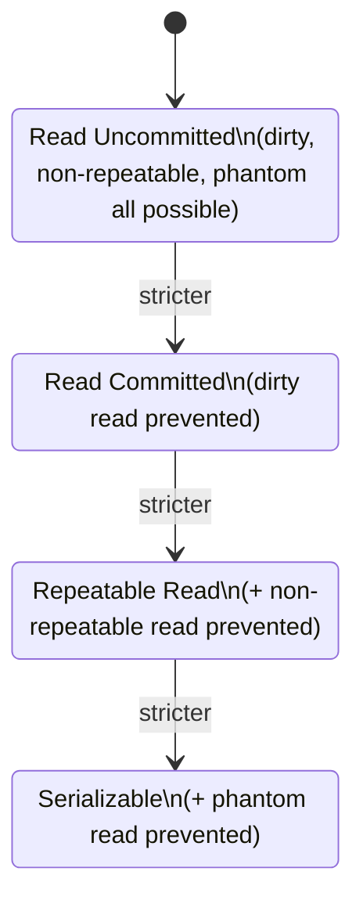

**Tradeoff:** stricter isolation levels prevent more anomalies but increase locking/blocking and reduce concurrency, and `SERIALIZABLE` can cause transactions to fail with a serialization error under contention, requiring the application to retry them.

### Auto Commit

Most database clients/drivers run in **auto-commit mode** by default — each individual statement is automatically wrapped in and committed as its own transaction unless you explicitly `BEGIN` a multi-statement transaction.

```sql
-- With autocommit ON (default), each statement below is its own transaction:
UPDATE accounts SET balance = balance - 100 WHERE id = 1;  -- committed immediately
UPDATE accounts SET balance = balance + 100 WHERE id = 2;  -- committed immediately, independently

-- To group them atomically, autocommit must be suspended via an explicit transaction:
BEGIN;
UPDATE accounts SET balance = balance - 100 WHERE id = 1;
UPDATE accounts SET balance = balance + 100 WHERE id = 2;
COMMIT;
```

This is a frequent source of bugs in application code (including Spring/JPA) — forgetting to open an explicit transaction boundary (e.g., missing `@Transactional`) means each repository call commits independently, so a failure partway through a multi-step operation leaves the database in a partially-updated state.

### Locking Basics

The database uses locks internally to enforce isolation guarantees and prevent concurrent transactions from corrupting each other's in-progress work.

- **Shared (read) lock**: allows multiple transactions to read the same row concurrently, but blocks a concurrent writer from modifying it.
- **Exclusive (write) lock**: held by a transaction modifying a row; blocks other transactions from reading (under stricter isolation) or writing that same row until released.
- **Row-level vs. table-level locking**: modern engines default to row-level locking (only the specific rows touched are locked), which allows far more concurrency than locking the entire table; explicit table locks (`LOCK TABLE`) are usually reserved for bulk operations like schema changes.
- **Deadlocks**: occur when two transactions each hold a lock the other needs, and each is waiting on the other — the database detects this cycle and forcibly aborts (rolls back) one of the transactions to break the deadlock, returning an error the application should catch and retry.

#### Interview Questions

1. **What do the four ACID properties guarantee, in one sentence each?**
   Atomicity — a transaction's statements all succeed or all fail together, with no partial application. Consistency — a transaction moves the database from one valid state to another, respecting all constraints. Isolation — concurrent transactions don't see each other's uncommitted intermediate state (to a degree controlled by isolation level). Durability — once committed, changes survive subsequent crashes/power loss.
2. **Explain the difference between a dirty read, a non-repeatable read, and a phantom read.**
   A dirty read sees another transaction's *uncommitted* changes, which could later be rolled back. A non-repeatable read occurs when re-reading the *same row* within one transaction returns different data because another transaction committed an update to it in between. A phantom read occurs when re-running the *same query* returns a different set of rows, because another transaction committed a matching insert or delete in between.
3. **Why is `Read Committed` the default isolation level in most databases rather than `Serializable`?**
   `Serializable` provides the strongest guarantees but at the cost of significantly reduced concurrency and a real risk of serialization failures requiring the application to retry transactions. `Read Committed` prevents dirty reads (the most obviously dangerous anomaly) while still allowing high concurrency, which is an acceptable tradeoff for the majority of everyday application workloads.
4. **What happens if you forget to wrap multiple related statements in an explicit transaction?**
   With autocommit on (the default in most drivers), each statement commits independently as soon as it executes. If a later statement in a logically-related sequence fails, earlier statements have already been permanently committed, leaving the database in an inconsistent, partially-updated state — this is why operations like a funds transfer must be explicitly wrapped in `BEGIN`/`COMMIT` (or `@Transactional` in Spring).
5. **What is a deadlock, and how does the database resolve it?**
   A deadlock happens when two (or more) transactions each hold a lock that the other is waiting to acquire, forming a cycle where none can proceed. The database's deadlock detector identifies the cycle and forcibly rolls back one of the transactions (chosen by some victim-selection heuristic), returning an error to that transaction's client, which should catch it and retry.
6. **What's the difference between a shared lock and an exclusive lock?**
   A shared (read) lock allows multiple transactions to hold it simultaneously on the same row, permitting concurrent reads, but blocks any transaction trying to acquire an exclusive lock for writing. An exclusive (write) lock is held by only one transaction at a time and blocks both other writers and (depending on isolation level) other readers, since the row is actively being modified.

## Query Optimization

Query optimization is the process (largely automated by the database's planner/optimizer, but guided by the developer) of ensuring a query executes using the cheapest available strategy — the right indexes, join order, and access methods — for the actual data distribution.

### Execution Plan (EXPLAIN)

`EXPLAIN` shows the query plan the optimizer *would* use (or did use), without actually running the query — the step-by-step strategy (scan types, join methods, order of operations) and their estimated costs.

```sql
EXPLAIN
SELECT e.name, d.name AS department_name
FROM employees e
JOIN departments d ON e.department_id = d.id
WHERE e.salary > 80000;
```

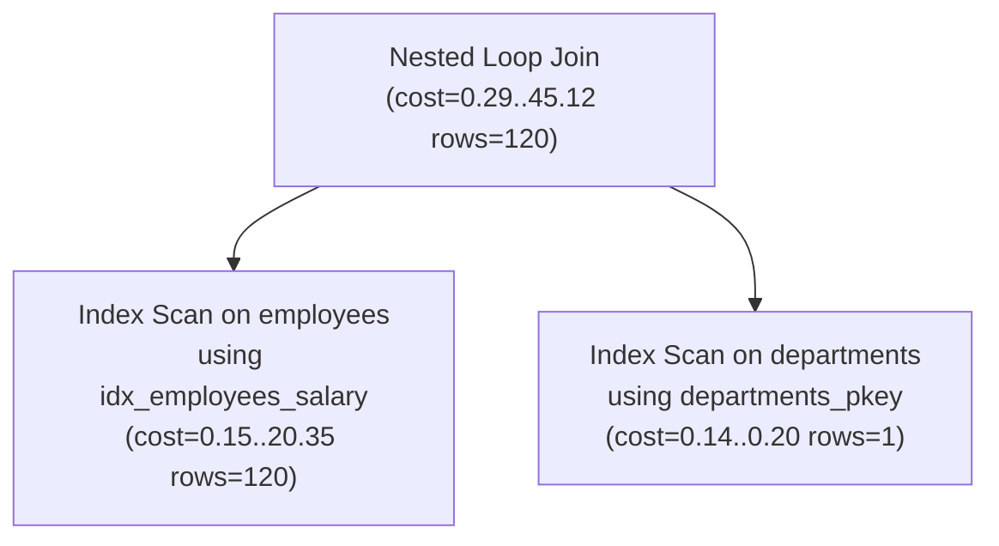

Reading a plan is done **bottom-up / inside-out**: the innermost (deepest-indented) nodes execute first and feed their output up into the parent operations above them, ending at the root node which represents the final result.

### EXPLAIN ANALYZE

`EXPLAIN ANALYZE` actually **executes** the query and reports real measured timings and row counts alongside the planner's estimates, letting you directly compare estimated vs. actual to spot planner misjudgments.

```sql
EXPLAIN ANALYZE
SELECT e.name, d.name AS department_name
FROM employees e
JOIN departments d ON e.department_id = d.id
WHERE e.salary > 80000;

-- Example output snippet:
-- Nested Loop  (cost=0.29..45.12 rows=120 width=64) (actual time=0.05..1.2 rows=340 loops=1)
--   ->  Index Scan using idx_employees_salary on employees  (cost=0.15..20.35 rows=120 width=40) (actual time=0.02..0.4 rows=340 loops=1)
--   ->  Index Scan using departments_pkey on departments  (cost=0.14..0.20 rows=1 width=32) (actual time=0.001..0.001 rows=1 loops=340)
```

**Caution:** because it actually runs the query, `EXPLAIN ANALYZE` on a data-modifying statement (`INSERT`/`UPDATE`/`DELETE`) will genuinely apply those changes — wrap it in a transaction and `ROLLBACK` afterward if you just want to inspect the plan without committing changes. A large `rows` estimate vs. `actual` mismatch is the single strongest signal that table statistics are stale (fix with `ANALYZE`) or a query is structured in a way the planner can't estimate well.

### Index Scan

An index scan traverses the index structure (typically a B-tree) to find matching rows' locations, then fetches the actual row data — efficient when relatively few rows match the condition.

```sql
EXPLAIN SELECT * FROM employees WHERE email = 'jane@example.com';
-- Index Scan using idx_employees_email on employees  (cost=0.15..8.17 rows=1 width=64)
```

- **Index Only Scan** (PostgreSQL): if *all* requested columns are present in the index itself, the engine can skip fetching the actual table row entirely, which is faster still (requires the index to be a "covering" index for that query).
- Index scans involve extra random I/O (jumping between the index and the heap/table) compared to sequential I/O, so they're only a net win when they let the engine skip a large fraction of non-matching rows.

### Sequential Scan

A sequential scan (a.k.a. full table scan) reads every row of the table in physical storage order, checking each one against the query's condition.

```sql
EXPLAIN SELECT * FROM employees;
-- Seq Scan on employees  (cost=0.00..18.50 rows=850 width=64)
```

Contrary to intuition, a sequential scan isn't inherently "bad" — for queries expected to return a large fraction of a table's rows, or for small tables entirely, sequential I/O (reading data in physical order) can outperform the random I/O of repeated index lookups. The optimizer chooses between the two based on cost estimates, not a fixed rule.

| Aspect | Index Scan | Sequential Scan |
|---|---|---|
| I/O pattern | Random (index → heap lookups) | Sequential (reads pages in order) |
| Best for | Highly selective conditions (few matching rows) | Low selectivity, small tables, or most rows needed anyway |
| Overhead | Index traversal + row lookups | None beyond reading the whole table |
| Can be avoided by planner when | Predicate matches a large fraction of rows | An appropriate, selective index exists and is cheaper |

### Join Strategies

The optimizer chooses among several physical join algorithms based on table sizes, available indexes, and selectivity — the SQL `JOIN` syntax itself doesn't dictate which is used.

- **Nested Loop Join**: for each row of the outer table, scans (or index-probes) the inner table for matches. Efficient when the outer side is small and/or the inner side has a usable index on the join column; degrades badly on large, unindexed tables since it's effectively $O(n \times m)$.
- **Hash Join**: builds an in-memory hash table from the smaller ("build") input keyed on the join column, then scans the larger ("probe") input, checking each row against the hash table. Effective for large, unsorted inputs without useful indexes, but requires enough memory to hold the hash table (or spills to disk, which is slower).
- **Merge Join**: requires both inputs to be sorted (or sorts them first) on the join column, then walks both sorted streams in lockstep, merging matches. Efficient when both inputs are already sorted (e.g., via an index) or for very large equi-joins where a hash table wouldn't fit in memory.

```sql
EXPLAIN
SELECT o.id, c.name
FROM orders o
JOIN customers c ON o.customer_id = c.id;
-- e.g. Hash Join  (cost=15.00..350.00 rows=10000 width=48)
--        Hash Cond: (o.customer_id = c.id)
--        ->  Seq Scan on orders o
--        ->  Hash
--              ->  Seq Scan on customers c
```

### Cost-Based Optimization

Modern query optimizers are **cost-based**: they enumerate multiple candidate execution plans for a query, estimate each plan's cost using internal formulas fed by table/column statistics, and choose the plan with the lowest estimated cost — not necessarily the "obviously" fastest-looking one.

- Cost estimates combine factors like estimated row counts, I/O cost (page reads), and CPU cost (per-row processing), calibrated by configurable cost constants (e.g., PostgreSQL's `seq_page_cost`, `random_page_cost`, `cpu_tuple_cost`).
- Statistics (row counts, most-common-value lists, histograms of value distribution) are what let the optimizer estimate selectivity accurately — stale statistics after large data changes are a very common cause of a suddenly-bad query plan, fixed by running `ANALYZE`.
- Because it's a cost *estimate*, not a guarantee, the optimizer can occasionally choose a suboptimal plan (e.g., due to outdated statistics, complex correlated predicates it can't estimate well, or overly generic query parameters) — this is why comparing `EXPLAIN` estimates against `EXPLAIN ANALYZE` actuals is the standard troubleshooting technique.

### Query Performance Tuning Basics

Practical, high-leverage steps for diagnosing and fixing a slow query, roughly in order of investigation:

1. **Run `EXPLAIN ANALYZE`** on the slow query to see the actual plan, timings, and row counts — look for large estimated-vs-actual mismatches and the most expensive node(s).
2. **Check for missing or unused indexes** on columns used in `WHERE`, `JOIN`, and `ORDER BY` — but verify selectivity first; not every filter column needs one (see "When Not to Use Indexes").
3. **Update statistics** (`ANALYZE`) if estimates look far off from reality, especially after bulk loads/deletes.
4. **Avoid `SELECT *`** when only specific columns are needed — reduces I/O and can enable index-only scans.
5. **Rewrite queries that defeat index usage**, e.g., wrapping an indexed column in a function (`WHERE LOWER(email) = ...`) without a matching functional index, or using a leading wildcard `LIKE '%text'` which can't use a standard B-tree index.
6. **Check join order and join types** for unexpectedly large intermediate row counts — sometimes restructuring a query (e.g., pre-filtering via a CTE before joining) helps the optimizer produce a better plan.
7. **Watch for N+1 query patterns** at the application/ORM layer (very common with JPA/Hibernate lazy loading) — a single query with a `JOIN` or a bulk `IN` fetch is usually far cheaper than many round-trip queries.
8. **Limit result sets appropriately** (`LIMIT`/pagination) so the database doesn't compute or transfer more rows than the application actually needs.

#### Interview Questions

1. **What's the difference between `EXPLAIN` and `EXPLAIN ANALYZE`?**
   `EXPLAIN` shows the planner's *estimated* execution plan and costs without running the query. `EXPLAIN ANALYZE` actually executes the query and reports real measured row counts and timings alongside the estimates, which is essential for spotting cases where the planner's assumptions (based on statistics) don't match reality.
2. **When would the optimizer choose a sequential scan over an available index, and is that necessarily a problem?**
   When the query is expected to match a large fraction of the table's rows (low selectivity), or the table is small, a sequential scan's simple sequential I/O can be cheaper than the random I/O of repeated index lookups plus row fetches. This is usually not a problem — it's the cost-based optimizer correctly recognizing the index wouldn't actually help; forcing an index in that case can make the query slower, not faster.
3. **How do you read a nested execution plan — which node executes first?**
   Execution plans are read bottom-up / inside-out: the most deeply indented (innermost) nodes execute first and feed their results upward into their parent nodes, continuing until the root/outermost node produces the final result. Costs shown at each node are typically cumulative, including the cost of all child nodes beneath it.
4. **What's the difference between a hash join, a merge join, and a nested loop join, and when does the optimizer pick each?**
   A nested loop join scans/probes the inner table once per outer row — good for small outer inputs or when the inner side has a usable index. A hash join builds an in-memory hash table from the smaller input and probes it with the larger input — good for large, unsorted equi-joins with enough memory. A merge join requires both inputs sorted on the join key and merges them in lockstep — good when both sides are already sorted (e.g., via an index) or for very large joins where a hash table wouldn't fit in memory. The optimizer picks based on cost estimates from table size, available indexes, and memory settings.
5. **A query was fast yesterday and slow today with no code change — what's the first thing you'd check?**
   Whether the table's statistics are stale relative to a recent large data change (bulk insert/delete/update) — outdated statistics can cause the cost-based optimizer to choose a previously-good but now-suboptimal plan (e.g., switching from an index scan to a sequential scan, or picking a bad join order). Running `ANALYZE` (or checking auto-vacuum/auto-analyze settings) is usually the fastest first diagnostic step, followed by re-running `EXPLAIN ANALYZE` to compare the new plan.
6. **Give an example of when adding an index would *not* help query performance, and explain how you'd confirm it via the execution plan.**
   Indexing a low-selectivity column (e.g., a boolean flag with a near-even split) usually won't help, because a large fraction of rows match any given value, making a sequential scan cheaper than repeated index lookups. You'd confirm this by running `EXPLAIN` (or `EXPLAIN ANALYZE`) both with and without the index (or checking if the planner already ignores an existing one) and observing that the planner still chooses (or would choose) a sequential scan because its cost estimate is lower than the index-scan alternative.

## SQL and Relationships

### One-to-One Queries

A one-to-one relationship means a row in one table corresponds to at most one row in another table. In SQL this is modeled with a foreign key column that also carries a `UNIQUE` constraint (or, alternatively, by making the foreign key column itself the primary key so both tables share the same identity).

Common real-life example: a `users` table holding authentication data and a `user_profiles` table holding optional, less frequently accessed details (bio, avatar, preferences). Splitting them keeps the hot authentication row small and lets the profile be lazily joined only when needed.

```sql
CREATE TABLE users (
    id BIGSERIAL PRIMARY KEY,
    username VARCHAR(50) NOT NULL UNIQUE
);

CREATE TABLE user_profiles (
    id BIGSERIAL PRIMARY KEY,
    user_id BIGINT NOT NULL UNIQUE REFERENCES users(id),
    bio TEXT,
    avatar_url VARCHAR(255)
);

-- Fetch a user together with their profile
SELECT u.username, p.bio, p.avatar_url
FROM users u
JOIN user_profiles p ON p.user_id = u.id
WHERE u.id = 42;

-- Not every user has a profile row yet -> use LEFT JOIN
SELECT u.username, p.bio
FROM users u
LEFT JOIN user_profiles p ON p.user_id = u.id
WHERE u.id = 42;
```

The `UNIQUE` constraint on `user_id` is what actually enforces "one-to-one" at the database level — without it, `user_profiles` would allow multiple rows per user, silently degrading it into a one-to-many relationship.

### One-to-Many Queries

The most common relationship: one parent row relates to many child rows, expressed by placing a foreign key on the "many" side that references the "one" side's primary key. Examples: one `department` has many `employees`; one `customer` has many `orders`.

```sql
CREATE TABLE departments (
    id BIGSERIAL PRIMARY KEY,
    name VARCHAR(100) NOT NULL
);

CREATE TABLE employees (
    id BIGSERIAL PRIMARY KEY,
    department_id BIGINT REFERENCES departments(id),
    full_name VARCHAR(150) NOT NULL
);

-- All employees in every department, including departments with none
SELECT d.name, e.full_name
FROM departments d
LEFT JOIN employees e ON e.department_id = d.id
ORDER BY d.name;

-- Count employees per department
SELECT d.name, COUNT(e.id) AS employee_count
FROM departments d
LEFT JOIN employees e ON e.department_id = d.id
GROUP BY d.name
ORDER BY employee_count DESC;
```

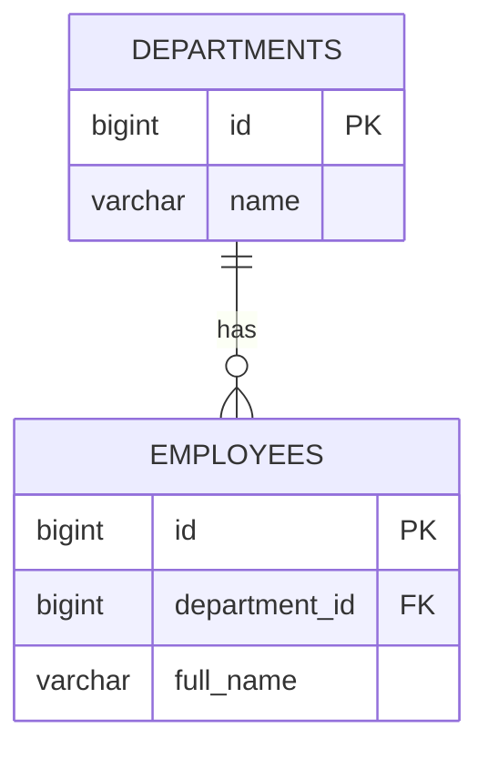

Choosing `INNER JOIN` vs `LEFT JOIN` here matters: `INNER JOIN` silently drops departments with zero employees, which is often *not* what a report needs.

### Many-to-Many Queries

A many-to-many relationship means rows on both sides can relate to multiple rows on the other side — a `student` can enroll in many `courses`, and a `course` can have many `students`. SQL has no native way to express this with a single foreign key, so it's always implemented with a **junction table** (also called an associative or bridge table) sitting between the two entities.

```sql
CREATE TABLE students (
    id BIGSERIAL PRIMARY KEY,
    full_name VARCHAR(150) NOT NULL
);

CREATE TABLE courses (
    id BIGSERIAL PRIMARY KEY,
    title VARCHAR(150) NOT NULL
);

CREATE TABLE enrollments (
    student_id BIGINT REFERENCES students(id),
    course_id BIGINT REFERENCES courses(id),
    enrolled_on DATE NOT NULL DEFAULT CURRENT_DATE,
    PRIMARY KEY (student_id, course_id)
);

-- Courses a specific student is enrolled in
SELECT c.title, e.enrolled_on
FROM enrollments e
JOIN courses c ON c.id = e.course_id
WHERE e.student_id = 7;

-- Students enrolled in a specific course
SELECT s.full_name, e.enrolled_on
FROM enrollments e
JOIN students s ON s.id = e.student_id
WHERE e.course_id = 101;
```

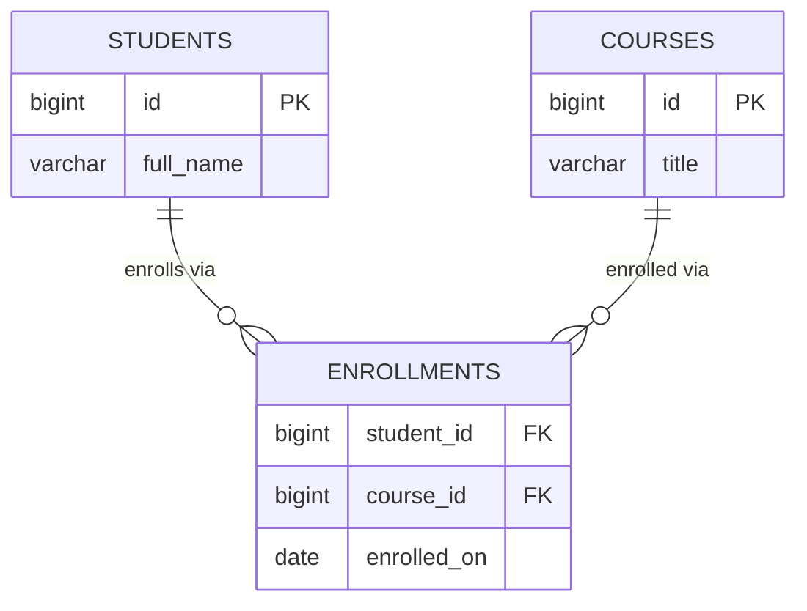

### Junction Tables

A junction table's primary responsibility is to hold the pair of foreign keys that represent one association, and optionally attributes that describe *that specific association* (e.g. `enrolled_on`, `grade`, `role`). Two design choices come up repeatedly:

- **Composite primary key** — `PRIMARY KEY (student_id, course_id)` prevents the same pair from being inserted twice and doubles as an index for lookups starting with `student_id`.
- **Surrogate primary key** — a separate `id BIGSERIAL PRIMARY KEY` plus a `UNIQUE (student_id, course_id)` constraint. This is preferred when the association itself needs to be referenced by other tables (e.g. `enrollment_grades.enrollment_id`).

```sql
-- Always index the "other" foreign key explicitly, since only the
-- leading column of a composite PK is efficiently searchable alone.
CREATE INDEX idx_enrollments_course_id ON enrollments (course_id);
```

Without that extra index, "find all students for course X" would force a full scan of `enrollments` because the composite primary key index `(student_id, course_id)` can't be used efficiently when `course_id` is searched alone.

### Foreign Key Navigation

Foreign key navigation is the act of following relationships across multiple joins to answer a question that spans several tables — e.g., "which instructor teaches the courses that student 7 is enrolled in?" This is the SQL equivalent of walking an object graph in application code.

```sql
CREATE TABLE instructors (
    id BIGSERIAL PRIMARY KEY,
    full_name VARCHAR(150) NOT NULL
);

ALTER TABLE courses ADD COLUMN instructor_id BIGINT REFERENCES instructors(id);

SELECT s.full_name AS student, c.title AS course, i.full_name AS instructor
FROM students s
JOIN enrollments e ON e.student_id = s.id
JOIN courses c ON c.id = e.course_id
JOIN instructors i ON i.id = c.instructor_id
WHERE s.id = 7;
```

Each hop is just another `JOIN` on a foreign key column. The main practical concerns are (1) making sure every foreign key column used in a join has an index, and (2) being deliberate about `INNER` vs `LEFT JOIN` at each hop so optional relationships (e.g. a course without an assigned instructor) don't unexpectedly remove rows from the result.

#### Interview Questions

1. **How do you enforce a true one-to-one relationship in SQL, and what happens if you forget the `UNIQUE` constraint on the foreign key?**
   Add a `UNIQUE` constraint (or make the FK column the primary key) on the referencing column. Without `UNIQUE`, nothing stops multiple child rows from pointing at the same parent, so the relationship silently becomes one-to-many even though the application logic assumes one-to-one.
2. **Why is a junction table necessary for many-to-many relationships instead of adding a foreign key to both sides?**
   A single foreign key column can only reference one row, so it cannot represent "many on both sides." A junction table stores one row per pairing, using a composite (or surrogate) key, and can also carry attributes specific to that pairing, like an enrollment date.
3. **When navigating three or more joined tables, why does the choice between `INNER JOIN` and `LEFT JOIN` at each hop matter?**
   `INNER JOIN` drops a row entirely if any hop has no match (e.g. a course with no assigned instructor), which can silently remove valid parent/child data from a report. `LEFT JOIN` preserves the left-side rows and returns `NULL` for the missing side, which is usually what's wanted for optional relationships.
4. **In a junction table with a composite primary key `(student_id, course_id)`, why might you still need a separate index on `course_id`?**
   A composite index is only efficiently searchable from its leading column(s); a lookup filtering solely by `course_id` can't use the `(student_id, course_id)` index effectively and would fall back to a full table scan without a dedicated index on `course_id`.
5. **What's the difference between using a composite primary key versus a surrogate primary key on a junction table?**
   A composite key `(student_id, course_id)` naturally prevents duplicate pairings and needs no extra column, but it's awkward to reference from other tables. A surrogate key (e.g. `id BIGSERIAL`) plus a `UNIQUE` constraint on the pair gives every association its own identity, which is useful when other tables need to point at a specific association row.
6. **How would you model a one-to-one relationship where you also want the child row to be deleted automatically when the parent is deleted?**
   Declare the foreign key with `ON DELETE CASCADE` in addition to the `UNIQUE` constraint, e.g. `user_id BIGINT UNIQUE REFERENCES users(id) ON DELETE CASCADE`, so removing a user automatically removes its profile row.

## Data Integrity

Referential actions determine what happens to child rows when a referenced parent row is updated or deleted. They're declared as part of the foreign key constraint using `ON DELETE` / `ON UPDATE` clauses, and choosing the right one is a key part of keeping data consistent without pushing extra cleanup logic into the application layer.

```sql
CREATE TABLE departments (
    id BIGSERIAL PRIMARY KEY,
    name VARCHAR(100) NOT NULL
);

CREATE TABLE employees (
    id BIGSERIAL PRIMARY KEY,
    department_id BIGINT REFERENCES departments(id)
        ON DELETE CASCADE
        ON UPDATE CASCADE,
    full_name VARCHAR(150) NOT NULL
);
```

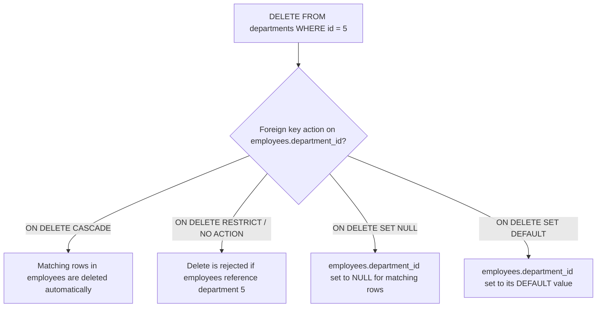

### Cascading Deletes

`ON DELETE CASCADE` automatically deletes child rows when their referenced parent row is deleted. It's convenient for strict ownership relationships — e.g. deleting an `order` should delete its `order_items`, since an order item has no meaning without its order.

```sql
ALTER TABLE order_items
    DROP CONSTRAINT order_items_order_id_fkey,
    ADD CONSTRAINT order_items_order_id_fkey
        FOREIGN KEY (order_id) REFERENCES orders(id)
        ON DELETE CASCADE;

DELETE FROM orders WHERE id = 1001; -- order_items for order 1001 are removed too
```

Cascading deletes are powerful but dangerous: a single `DELETE` can ripple through several tables. In Spring Data JPA, `CascadeType.REMOVE` on an `@OneToMany` mirrors this behavior at the application level — but relying on the database's `ON DELETE CASCADE` is usually faster and safer since it happens atomically inside the database, without loading entities into memory first.

### Cascading Updates

`ON UPDATE CASCADE` propagates a change in the parent's key value to every child row that references it. This matters far less when primary keys are surrogate, auto-generated values that never change, but it's essential when a natural key (like a `country_code`) is used as a primary key and might legitimately be updated.

```sql
CREATE TABLE countries (
    code CHAR(2) PRIMARY KEY,
    name VARCHAR(100) NOT NULL
);

CREATE TABLE offices (
    id BIGSERIAL PRIMARY KEY,
    country_code CHAR(2) REFERENCES countries(code) ON UPDATE CASCADE
);

UPDATE countries SET code = 'UK' WHERE code = 'GB';
-- offices.country_code rows update from 'GB' to 'UK' automatically
```

### Restrict

`ON DELETE RESTRICT` (and `ON UPDATE RESTRICT`) blocks the delete/update of the parent row if any child row still references it, raising a foreign key violation error. It's the safest default for relationships where accidental data loss would be costly, since it forces an explicit decision (delete children first, or reassign them) before the parent can be removed.

```sql
ALTER TABLE employees
    ADD CONSTRAINT employees_department_id_fkey
        FOREIGN KEY (department_id) REFERENCES departments(id)
        ON DELETE RESTRICT;

DELETE FROM departments WHERE id = 5;
-- ERROR: update or delete on table "departments" violates foreign key
-- constraint "employees_department_id_fkey" on table "employees"
```

### No Action

`NO ACTION` is closely related to `RESTRICT` — both reject the operation if dependent rows exist — but they differ in *when* the check happens. `RESTRICT` checks immediately; `NO ACTION` (the SQL standard default when no clause is specified) allows the check to be deferred until the end of the transaction if the constraint is declared `DEFERRABLE`. In practice, for non-deferrable constraints (the common case), `RESTRICT` and `NO ACTION` behave identically.

```sql
CREATE TABLE employees (
    id BIGSERIAL PRIMARY KEY,
    department_id BIGINT REFERENCES departments(id) -- defaults to NO ACTION
);
```

### Set Null

`ON DELETE SET NULL` sets the foreign key column to `NULL` on child rows when the parent is deleted, instead of deleting or blocking. This fits optional relationships — e.g. deleting a `manager` shouldn't delete their reports, it should just leave them temporarily unassigned.

```sql
CREATE TABLE employees (
    id BIGSERIAL PRIMARY KEY,
    manager_id BIGINT REFERENCES employees(id) ON DELETE SET NULL,
    full_name VARCHAR(150) NOT NULL
);

DELETE FROM employees WHERE id = 3; -- direct reports now have manager_id = NULL
```

Note that `SET NULL` requires the foreign key column to be nullable — it cannot be used on a `NOT NULL` column.

### Set Default

`ON DELETE SET DEFAULT` resets the foreign key column to whatever `DEFAULT` value was declared for it, instead of `NULL`. This is useful when there's a well-known fallback row to reassign to, such as an "Unassigned" department or a "Guest" category.

```sql
CREATE TABLE departments (
    id BIGINT PRIMARY KEY,
    name VARCHAR(100) NOT NULL
);
INSERT INTO departments (id, name) VALUES (0, 'Unassigned');

CREATE TABLE employees (
    id BIGSERIAL PRIMARY KEY,
    department_id BIGINT NOT NULL DEFAULT 0
        REFERENCES departments(id) ON DELETE SET DEFAULT,
    full_name VARCHAR(150) NOT NULL
);

DELETE FROM departments WHERE id = 5;
-- employees that referenced department 5 now have department_id = 0
```

**Referential action comparison**

| Action | On parent delete/update | Requires nullable FK? | Typical use case |
|---|---|---|---|
| `CASCADE` | Propagates delete/update to children | No | Strict ownership (order → order items) |
| `RESTRICT` | Rejects the operation immediately if children exist | No | Protect critical reference data |
| `NO ACTION` | Rejects the operation (can be deferred to end of transaction if `DEFERRABLE`) | No | SQL-standard default, same as `RESTRICT` in most setups |
| `SET NULL` | Children's FK column set to `NULL` | Yes | Optional relationship (employee → manager) |
| `SET DEFAULT` | Children's FK column reset to its default value | No (default must exist) | Reassign to a known fallback row |

#### Interview Questions

1. **What is the practical difference between `ON DELETE RESTRICT` and `ON DELETE NO ACTION`?**
   Both reject the delete/update when dependent rows exist. The difference is timing: `RESTRICT` checks immediately and cannot be deferred, while `NO ACTION` can be deferred until the end of the transaction if the constraint is declared `DEFERRABLE`. For ordinary (non-deferrable) constraints they behave the same.
2. **When would you choose `SET NULL` over `CASCADE` for a foreign key?**
   Use `SET NULL` when the child row's existence doesn't depend on the parent — e.g. an employee record shouldn't be deleted just because their manager left; instead `manager_id` becomes `NULL`. Use `CASCADE` only when the child has no meaning without the parent, such as order line items.
3. **Why must a column used with `ON DELETE SET NULL` be nullable, and what error occurs otherwise?**
   `SET NULL` needs to write `NULL` into the foreign key column, so if the column has a `NOT NULL` constraint, the database raises a not-null constraint violation when the referential action tries to fire.
4. **How does `CascadeType.REMOVE` in Spring Data JPA compare to `ON DELETE CASCADE` in the database?**
   `CascadeType.REMOVE` is an application-level, ORM-managed cascade — Hibernate loads and deletes each associated entity individually (and can trigger lifecycle callbacks), which is slower and requires entities to be in the persistence context. `ON DELETE CASCADE` happens entirely inside the database in a single atomic operation and works regardless of what the application does, but it bypasses JPA entity lifecycle callbacks.
5. **What risk does `ON DELETE CASCADE` introduce in a deeply nested schema, and how would you mitigate it?**
   A cascade can ripple through several levels of related tables, causing much more data to be deleted than intended from a single `DELETE` statement — sometimes invisibly to whoever issued it. Mitigate by using cascade only for strict parent/child ownership, keeping `RESTRICT`/`SET NULL` for shared or optional references, and testing delete impact with `EXPLAIN` or a `SELECT` count of affected rows before deleting in production.
6. **What does `SET DEFAULT` require in order to work correctly, and what would happen if the default row itself is deleted?**
   The column must have a `DEFAULT` value that references an existing row (often a well-known "unassigned"/"guest" row). If that default row is deleted while other rows still depend on it via `SET DEFAULT`, subsequent deletes would fail their foreign key check (or, if the default row's own FK/constraints are violated first, the delete of the default row itself would be rejected).

## Stored Database Objects (Awareness)

Spring Data JPA applications are usually built around the ORM owning schema logic in Java, so stored procedures, functions, and triggers are used sparingly. Still, interviewers expect awareness of what these objects are, when teams reach for them anyway (bulk data migrations, auditing, cross-application business rules), and the trade-offs versus keeping logic in the application layer.

### Stored Procedures (Overview)

A stored procedure is a named, precompiled block of SQL (and procedural logic — loops, conditionals, variables) stored in the database and invoked with `CALL`. Procedures can perform multiple statements, including inserts/updates/deletes across several tables, and don't have to return a value.

```sql
CREATE PROCEDURE transfer_funds(
    sender_id BIGINT,
    receiver_id BIGINT,
    amount NUMERIC
)
LANGUAGE plpgsql
AS $$
BEGIN
    UPDATE accounts SET balance = balance - amount WHERE id = sender_id;
    UPDATE accounts SET balance = balance + amount WHERE id = receiver_id;

    IF (SELECT balance FROM accounts WHERE id = sender_id) < 0 THEN
        RAISE EXCEPTION 'Insufficient funds for account %', sender_id;
    END IF;
END;
$$;

CALL transfer_funds(1, 2, 250.00);
```

Stored procedures are attractive when an operation must be atomic, reused by multiple applications/languages, and should avoid the round-trip overhead of several separate statements. The downside is that business logic becomes split between the database and the application, harder to version-control alongside code, and harder to unit test with ordinary Java tooling.

### Functions

A SQL function is similar to a stored procedure but is designed to compute and return a value (scalar, row, or set of rows) and can be used directly inside a query, e.g. in a `SELECT` list or `WHERE` clause — something a procedure cannot do.

```sql
CREATE FUNCTION full_name(first_name VARCHAR, last_name VARCHAR)
RETURNS VARCHAR
LANGUAGE sql
IMMUTABLE
AS $$
    SELECT first_name || ' ' || last_name;
$$;

SELECT id, full_name(first_name, last_name) AS display_name
FROM employees;
```

Functions are commonly used for reusable computed expressions, custom validation logic referenced from `CHECK` constraints, or encapsulating a complex calculation (like tax or discount rules) so it isn't duplicated across many queries.

### Triggers (Overview)

A trigger is a piece of procedural code the database executes automatically in response to an `INSERT`, `UPDATE`, or `DELETE` on a table — `BEFORE` or `AFTER` the operation, and either once per statement or once per row. Triggers are how databases implement things like automatic `updated_at` timestamps or audit logging that must happen no matter which application or tool modifies the data.

```sql
CREATE TABLE employees (
    id BIGSERIAL PRIMARY KEY,
    full_name VARCHAR(150) NOT NULL,
    updated_at TIMESTAMP NOT NULL DEFAULT now()
);

CREATE FUNCTION set_updated_at()
RETURNS TRIGGER
LANGUAGE plpgsql
AS $$
BEGIN
    NEW.updated_at = now();
    RETURN NEW;
END;
$$;

CREATE TRIGGER trg_employees_updated_at
BEFORE UPDATE ON employees
FOR EACH ROW
EXECUTE FUNCTION set_updated_at();
```

Triggers are powerful but easy to overuse: because they fire implicitly, they can make debugging harder ("why did this column change? — a trigger did it") and can hide business logic from developers who only look at the application code. In a Spring JPA codebase, an `@PrePersist`/`@PreUpdate` entity listener is often preferred for this exact scenario because it keeps the logic visible in Java, but a database trigger is the safer choice when *every* writer to the table (including other services, ETL jobs, or manual `psql` sessions) must be guaranteed to trigger the behavior.

### Sequences

A sequence is a standalone database object that generates a series of unique numbers, most commonly used to back auto-incrementing primary keys. `BIGSERIAL`/`SERIAL` columns in PostgreSQL are actually shorthand for "create a sequence and default the column to `nextval()` on it."

```sql
CREATE SEQUENCE order_number_seq
    START WITH 1000
    INCREMENT BY 1;

SELECT nextval('order_number_seq'); -- 1000
SELECT nextval('order_number_seq'); -- 1001

CREATE TABLE orders (
    id BIGINT PRIMARY KEY DEFAULT nextval('order_number_seq'),
    customer_id BIGINT NOT NULL
);
```

Sequences matter directly to Spring Data JPA: `@GeneratedValue(strategy = GenerationType.SEQUENCE)` maps an entity's identifier to a database sequence, and Hibernate can even pre-allocate blocks of sequence values (`@SequenceGenerator(allocationSize = ...)`) to reduce round-trips when inserting many entities in a batch.

```java
@Entity
public class Order {

    @Id
    @GeneratedValue(strategy = GenerationType.SEQUENCE, generator = "order_seq")
    @SequenceGenerator(name = "order_seq", sequenceName = "order_number_seq", allocationSize = 50)
    private Long id;
}
```

#### Interview Questions

1. **What is the key functional difference between a stored procedure and a function?**
   A function must return a value and can be called from within a `SELECT` statement or expression; a procedure is invoked with `CALL`, may perform multiple independent operations (including transactional control in some databases), and does not need to return a value.
2. **Why might a team prefer a database trigger over a JPA entity listener (`@PrePersist`/`@PreUpdate`) for auditing?**
   A trigger fires for any write to the table regardless of which application, service, or tool performs it (including raw SQL scripts or other microservices sharing the database), guaranteeing consistent behavior. A JPA listener only fires for writes that go through that specific application's entity manager.
3. **What is a downside of relying heavily on triggers for business logic?**
   Logic becomes implicit and scattered outside the application codebase, making it harder to trace, test, and version alongside the rest of the code — a developer reading the Java code may not realize a column is being modified by a trigger.
4. **How does `GenerationType.SEQUENCE` with `allocationSize` improve insert performance in Hibernate?**
   Instead of calling the database sequence once per entity to get the next ID, Hibernate can request and cache a block of N sequence values (`allocationSize`) in one round trip, then hand them out to new entities locally — dramatically reducing database round-trips for bulk inserts compared to `GenerationType.IDENTITY`.
5. **Why can `GenerationType.IDENTITY` hurt JDBC batch insert performance compared to `GenerationType.SEQUENCE`?**
   With `IDENTITY`, the database assigns the primary key only after the row is inserted, so Hibernate must execute (and see the result of) each insert individually to learn the generated ID, which effectively disables statement batching. `SEQUENCE` lets Hibernate know the ID before the insert, so multiple inserts can be batched together.
6. **When would you reach for a stored procedure instead of doing the equivalent work in a `@Service` method with multiple JPA repository calls?**
   When the operation needs to be atomic and shared across multiple applications/languages without duplicating logic, or when minimizing network round-trips for a multi-step operation matters more than keeping logic in version-controlled Java code — for example, a nightly batch reconciliation job run directly against the database.

## Pagination

### LIMIT / OFFSET

`LIMIT` caps how many rows a query returns, and `OFFSET` skips a number of rows before starting to return results — together they're the simplest way to page through a result set.

```sql
-- Page 1 (rows 1-20)
SELECT id, title, created_at
FROM articles
ORDER BY created_at DESC
LIMIT 20 OFFSET 0;

-- Page 3 (rows 41-60)
SELECT id, title, created_at
FROM articles
ORDER BY created_at DESC
LIMIT 20 OFFSET 40;
```

`OFFSET` is easy to reason about and maps directly onto `Pageable`/`PageRequest` in Spring Data JPA, but it has a well-known performance problem: the database still has to *scan and discard* every skipped row before it can start returning the requested page, so `OFFSET 1000000` is dramatically slower than `OFFSET 0` even though both return the same number of rows.

### Keyset Pagination (Concept)

Keyset pagination (also called "seek" pagination) avoids `OFFSET` entirely by remembering the last row seen on the previous page and filtering for rows strictly after it, using an indexed column (typically the primary key or a sort column with a tiebreaker).

```sql
-- First page
SELECT id, title, created_at
FROM articles
ORDER BY created_at DESC, id DESC
LIMIT 20;

-- Next page: caller passes back the (created_at, id) of the last row from the previous page
SELECT id, title, created_at
FROM articles
WHERE (created_at, id) < ('2026-07-15 10:00:00', 8421)
ORDER BY created_at DESC, id DESC
LIMIT 20;
```

Because the `WHERE` clause can use an index seek (`created_at, id`) instead of scanning and counting rows, keyset pagination stays fast no matter how deep into the result set the page is — a major advantage for large tables or infinite-scroll style UIs. The trade-off is that you can no longer jump directly to an arbitrary page number (e.g. "go to page 47") — you can only move forward/backward relative to a known row.

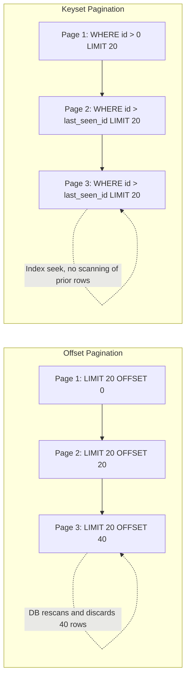

**Offset vs keyset pagination**

| Aspect | Offset (`LIMIT`/`OFFSET`) | Keyset (seek) |
|---|---|---|
| Performance on deep pages | Degrades as offset grows (scans + discards rows) | Consistently fast (index seek) |
| Jump to arbitrary page | Yes | No — only next/previous relative to a cursor |
| Stable under concurrent inserts/deletes | No — rows can shift between pages | Yes — cursor is tied to actual row values |
| Implementation complexity | Simple | Slightly more complex (needs a stable sort + cursor) |
| Typical Spring Data support | `Pageable` / `PageRequest.of(page, size)` | `Slice`/custom `WHERE` + `Pageable` with `Sort`, or `ScrollPosition`/`Window` (`findBy...().scroll(...)`) |

### Cursor-Based Pagination (Concept)

Cursor-based pagination is the same underlying idea as keyset pagination, applied at the API layer: instead of exposing raw page numbers, the API returns an opaque "cursor" token (often an encoded representation of the last row's sort key) that the client sends back to fetch the next page. This decouples the API contract from the underlying SQL technique and is what most large-scale REST/GraphQL APIs (e.g. GitHub's API) use for list endpoints.

```sql
-- The API encodes something like base64("2026-07-15T10:00:00|8421") as the cursor
SELECT id, title, created_at
FROM articles
WHERE (created_at, id) < ('2026-07-15 10:00:00', 8421)
ORDER BY created_at DESC, id DESC
LIMIT 20;
```

Real-life scenario: an infinite-scroll social media feed cannot use `OFFSET` at scale — by the time a user has scrolled to page 500, `OFFSET` would force the database to scan hundreds of thousands of rows per request. A cursor referencing "the last post ID and timestamp I saw" lets every request perform the same constant-time index seek regardless of how far the user has scrolled, and it also avoids showing duplicate/skipped posts if new rows are inserted while the user scrolls.

#### Interview Questions

1. **Why does `OFFSET` get slower as the offset value increases, even though the number of returned rows (`LIMIT`) stays the same?**
   The database must still walk through and discard every row up to the offset before it can start returning the requested rows — there's no way to "jump" directly to row 100,000 without first counting past the preceding 99,999 in most standard execution plans, so cost grows roughly linearly with the offset.
2. **What problem can occur with `OFFSET`-based pagination if rows are inserted or deleted between page requests?**
   Because offset is a positional count rather than tied to actual row values, a row can shift between pages — e.g. a new row inserted at the top pushes everything down, causing the same row to appear twice across two page requests, or a row to be skipped entirely.
3. **How does keyset (seek) pagination avoid the performance problems of `OFFSET`?**
   Instead of counting rows to skip, it filters with `WHERE (sort_column, tiebreaker) < (last_seen_value, last_seen_id)`, which the database can satisfy with a direct index seek to the correct starting point, independent of how many rows come before it.
4. **What is the main limitation of keyset/cursor pagination compared to offset pagination?**
   You lose the ability to jump directly to an arbitrary page number (e.g., "go to page 50"); you can only navigate forward or backward relative to a specific cursor/row, which is fine for infinite-scroll UIs but awkward for numbered pagination controls.
5. **How does Spring Data JPA's `Pageable`/`Page` relate to offset pagination, and what alternative exists for keyset-style pagination?**
   `PageRequest.of(pageNumber, pageSize)` translates directly into a `LIMIT`/`OFFSET` query and also issues a `COUNT` query for total elements, inheriting the same deep-page performance cost. For keyset-style pagination, Spring Data supports `ScrollPosition`-based scrolling (`findBy...().scroll(ScrollPosition.keyset())`) which generates seek-style `WHERE` clauses instead of `OFFSET`.
6. **Why is a tiebreaker column (like the primary key) needed in keyset pagination's `ORDER BY`/`WHERE` clause even when sorting by another column such as `created_at`?**
   If the sort column isn't unique (e.g. multiple articles created at the exact same timestamp), sorting by it alone can't unambiguously determine "everything after this row." Adding a unique tiebreaker (typically `id`) guarantees a total, stable order so the cursor comparison `(created_at, id) < (...)` always identifies a consistent next page.

## JSON Support (PostgreSQL Focus)

### JSON

PostgreSQL's `JSON` type stores JSON text exactly as it was input, byte-for-byte, including whitespace and key ordering. It validates that the input is well-formed JSON but does not parse it into any internal binary structure — every query that inspects the JSON has to re-parse the raw text.

```sql
CREATE TABLE events (
    id BIGSERIAL PRIMARY KEY,
    event_type VARCHAR(50) NOT NULL,
    payload JSON NOT NULL
);

INSERT INTO events (event_type, payload)
VALUES ('user.signup', '{"userId": 42, "plan": "pro", "tags": ["trial", "referred"]}');
```

`JSON` is appropriate when you mostly store-and-retrieve the document as-is (e.g. an audit log where preserving the exact original text matters) and rarely query into its structure.

### JSONB

`JSONB` stores JSON in a decomposed **binary** format: whitespace is discarded, keys are de-duplicated (last value wins), and key order is not preserved. Because it's already parsed, `JSONB` supports efficient querying, indexing (including GIN indexes), and containment operators — at the cost of slightly slower input (it must be parsed on write) and slightly larger storage.

```sql
CREATE TABLE events (
    id BIGSERIAL PRIMARY KEY,
    event_type VARCHAR(50) NOT NULL,
    payload JSONB NOT NULL
);

CREATE INDEX idx_events_payload ON events USING GIN (payload);
```

**`JSON` vs `JSONB`**

| Aspect | `JSON` | `JSONB` |
|---|---|---|
| Storage format | Exact text copy | Parsed, decomposed binary |
| Preserves key order / whitespace / duplicate keys | Yes | No (last duplicate key wins, order not preserved) |
| Write speed | Faster (no parsing) | Slightly slower (must parse on write) |
| Query/read speed | Slower (re-parses every time) | Faster (already parsed) |
| Indexing support | None | GIN indexes on the whole document or specific paths |
| Recommended default | Rarely — only when exact text fidelity is required | Yes — the practical default for almost all use cases |

### JSON Operators

PostgreSQL provides dedicated operators for extracting values and testing structure without needing string functions.

```sql
-- ->  : get JSON object field as JSON/JSONB
-- ->> : get JSON object field as text
-- #>  : get JSON object at a path, as JSON/JSONB
-- #>> : get JSON object at a path, as text
SELECT payload -> 'plan' AS plan_json,      -- "pro"        (JSON value)
       payload ->> 'plan' AS plan_text,     -- pro          (text)
       payload #>> '{tags,0}' AS first_tag  -- trial        (text at path)
FROM events
WHERE id = 1;

-- Containment: does the left JSONB contain the right JSONB?
SELECT * FROM events WHERE payload @> '{"plan": "pro"}';

-- Existence: does the JSONB object contain this top-level key?
SELECT * FROM events WHERE payload ? 'tags';
```

### Querying JSON Fields

Because `->>` extracts JSON values as text, they can be used directly in `WHERE`, `ORDER BY`, and even joined against relational columns like any other predicate.

```sql
-- Find all "pro" plan signups
SELECT id, payload ->> 'userId' AS user_id
FROM events
WHERE event_type = 'user.signup'
  AND payload ->> 'plan' = 'pro';

-- Query a nested array element with a GIN-backed containment check (uses the index)
SELECT id FROM events
WHERE payload @> '{"tags": ["referred"]}';

-- Cast an extracted text value to a real type for numeric comparisons
SELECT id FROM events
WHERE (payload ->> 'amount')::numeric > 100;
```

A GIN index on the `payload` column (`USING GIN (payload)`) lets containment queries (`@>`) use an index scan instead of evaluating every row, which is the main reason `JSONB` is preferred whenever the JSON needs to be searched.

### Updating JSON Data

PostgreSQL supports partial, in-place updates to `JSONB` values without needing to overwrite the entire document from the application.

```sql
-- jsonb_set(target, path, new_value, create_missing)
UPDATE events
SET payload = jsonb_set(payload, '{plan}', '"enterprise"', true)
WHERE id = 1;

-- Merge (concatenate) additional keys into the document
UPDATE events
SET payload = payload || '{"upgraded": true}'::jsonb
WHERE id = 1;

-- Remove a key
UPDATE events
SET payload = payload - 'tags'
WHERE id = 1;
```

Real-life scenario: a `product_attributes` `JSONB` column lets an e-commerce catalog store wildly different attribute sets per category (a shirt has `size`/`color`, a laptop has `ram`/`cpu`) without a sparse, ever-growing set of nullable columns or a full EAV (entity-attribute-value) schema — while still allowing indexed queries like "find all products where `attributes @> '{"color": "red"}'`.

#### Interview Questions

1. **What is the fundamental storage difference between `JSON` and `JSONB` in PostgreSQL?**
   `JSON` stores the exact input text verbatim (preserving whitespace, key order, and duplicate keys), re-parsing it on every read. `JSONB` stores a parsed, decomposed binary representation (no whitespace, de-duplicated keys, order not preserved), which is faster to query and supports indexing at the cost of slightly slower writes.
2. **Why would you almost always choose `JSONB` over `JSON` in a new schema?**
   `JSONB` supports efficient querying via operators like `@>`, `?`, and `->>`, and can be indexed with GIN indexes for fast containment lookups. `JSON`'s only real advantage — preserving the exact original text/formatting — is rarely a requirement, so `JSONB`'s query performance advantage usually wins.
3. **What is the difference between the `->` and `->>` operators?**
   `->` returns the field as a JSON/JSONB value (so it can be further navigated or compared to other JSON), while `->>` returns the field as plain text, which is what you need for string comparisons, casting to other types, or displaying the value.
4. **How does the `@>` containment operator work, and why does it benefit from a GIN index?**
   `@>` checks whether the JSONB document on the left contains the structure on the right (e.g. `payload @> '{"plan": "pro"}'` matches any document with that key/value present anywhere satisfying containment rules). A GIN index on the column indexes the individual keys/values inside the JSONB, so PostgreSQL can look up matching documents directly instead of evaluating the containment check against every row.
5. **When would you choose a `JSONB` column over fully normalizing data into relational columns/tables?**
   When the schema is genuinely dynamic or sparse per row (e.g. product attributes that vary wildly by category) and adding a new relational column or junction table for every possible attribute would be impractical. It's a trade-off: you gain schema flexibility but lose some of the type safety, constraint enforcement, and joinability that normalized columns provide.
6. **How would you update a single nested field inside a `JSONB` column without overwriting the whole document?**
   Use `jsonb_set(column, '{path,to,field}', new_value, true)`, which returns a new JSONB value with only that path replaced (or created, if the last argument is `true`), leaving the rest of the document untouched; the result still needs to be written back with an `UPDATE ... SET column = jsonb_set(...)`.

## SQL Features Used Frequently with Spring JPA

### CRUD Operations

Every Spring Data JPA repository ultimately compiles down to the four basic SQL operations — `SELECT`, `INSERT`, `UPDATE`, `DELETE` — generated by Hibernate from either derived query methods, JPQL, or entity state changes flushed at the end of a transaction.

```sql
INSERT INTO products (id, name, price) VALUES (1, 'Keyboard', 49.99);
SELECT * FROM products WHERE id = 1;
UPDATE products SET price = 44.99 WHERE id = 1;
DELETE FROM products WHERE id = 1;
```

```java
public interface ProductRepository extends JpaRepository<Product, Long> {
    // save() -> INSERT or UPDATE depending on whether the entity is new
    // findById() -> SELECT ... WHERE id = ?
    // deleteById() -> DELETE ... WHERE id = ?
}
```

Hibernate decides `INSERT` vs `UPDATE` inside `save()` based on whether the entity's identifier is `null` (or, with `@Version`/`Persistable`, whether it's marked as new) — this is a common source of confusion when entities are constructed with a manually assigned, non-null ID.

### Parameterized Queries

A parameterized query separates the SQL structure from the actual data values, sending values as bound parameters (`?` or `:name`) instead of concatenating them into the SQL string. This is the single most important defense against SQL injection, and it's also what allows the database to cache and reuse a query's execution plan.

```sql
SELECT * FROM products WHERE category = ? AND price <= ?;
```

```java
@Query("SELECT p FROM Product p WHERE p.category = ?1 AND p.price <= ?2")
List<Product> findAffordableInCategory(String category, BigDecimal maxPrice);
```

Spring Data JPA repository methods, `@Query` with `?N`/`:name` placeholders, and `EntityManager.createQuery(...).setParameter(...)` all use parameterized queries under the hood — string-concatenating user input into a JPQL/native query string (e.g. via `String.format`) reintroduces the exact SQL injection risk parameterization is meant to prevent.

### Named Parameters (Concept)

Named parameters (`:paramName`) identify a bind variable by name instead of positional order (`?1`, `?2`), making multi-parameter queries far more readable and less error-prone when parameters are reordered.

```sql
-- Native SQL with a named-style placeholder (driver/ORM dependent)
SELECT * FROM products WHERE category = :category AND price <= :maxPrice;
```

```java
@Query("SELECT p FROM Product p WHERE p.category = :category AND p.price <= :maxPrice")
List<Product> findAffordableInCategory(
        @Param("category") String category,
        @Param("maxPrice") BigDecimal maxPrice);
```

Named parameters via `@Param` are strongly preferred over positional (`?1`) in real codebases — reordering method arguments won't silently swap query semantics, and the query itself is self-documenting.

### Native SQL Queries

`@Query(nativeQuery = true)` bypasses JPQL entirely and sends raw, database-specific SQL, which is useful for vendor-specific features (PostgreSQL's `JSONB` operators, window functions, `LATERAL` joins) that JPQL doesn't support.

```sql
SELECT * FROM products
WHERE payload @> :filter::jsonb;
```

```java
@Query(value = "SELECT * FROM products WHERE payload @> CAST(:filter AS jsonb)", nativeQuery = true)
List<Product> findByAttributeFilter(@Param("filter") String filterJson);
```

**JPQL vs native SQL**

| Aspect | JPQL | Native SQL |
|---|---|---|
| Portability across databases | High (entity/field names, DB-agnostic) | Low (tied to a specific SQL dialect) |
| Access to vendor-specific features (JSONB, window functions, CTEs*) | Limited/none | Full access |
| Returns managed entities directly | Yes | Only if mapped correctly (or via `Tuple`/DTO projections) |
| Refactoring safety (renaming entity fields) | Safe — checked against the entity model | Unsafe — plain strings, not validated at compile time |

*Modern Hibernate versions support CTEs and some window functions in JPQL, but native SQL still offers the broadest and earliest access to database-specific syntax.

### Sorting

`ORDER BY` in SQL corresponds to `Sort`/the sorting part of `Pageable` in Spring Data JPA, and can also be expressed directly in derived query method names (`findByCategoryOrderByPriceDesc`).

```sql
SELECT * FROM products ORDER BY price DESC, name ASC;
```

```java
List<Product> findByCategoryOrderByPriceDesc(String category);

// or dynamically:
List<Product> products = productRepository.findAll(Sort.by(Sort.Direction.DESC, "price"));
```

### Pagination

`Pageable`/`PageRequest` translate directly into `LIMIT`/`OFFSET` (plus an extra `COUNT` query for total elements when using `Page` rather than `Slice`).

```sql
SELECT * FROM products ORDER BY price DESC LIMIT 20 OFFSET 40;
SELECT COUNT(*) FROM products; -- only issued for Page<T>, not Slice<T>
```

```java
Page<Product> page = productRepository.findAll(PageRequest.of(2, 20, Sort.by("price").descending()));
```

Prefer `Slice<T>` over `Page<T>` when the total count isn't needed by the UI (e.g. infinite scroll) — it skips the extra `COUNT` query entirely.

### Batch Inserts

Batch inserts group multiple `INSERT` statements into fewer round-trips to the database, which Hibernate can do automatically when JDBC batching is enabled and entity IDs are known before insert (see `GenerationType.SEQUENCE` in [Stored Database Objects (Awareness)](#stored-database-objects-awareness)).

```sql
INSERT INTO products (id, name, price) VALUES
    (101, 'Mouse', 19.99),
    (102, 'Monitor', 199.99),
    (103, 'Webcam', 39.99);
```

```java
// application.yml / properties
// spring.jpa.properties.hibernate.jdbc.batch_size=50
// spring.jpa.properties.hibernate.order_inserts=true

@Transactional
public void saveAll(List<Product> products) {
    productRepository.saveAll(products); // batched into groups of batch_size inserts
}
```

### Batch Updates

Similarly, batch updates group multiple `UPDATE` statements, or — even better — perform the update as a single bulk `UPDATE` statement using `@Modifying` when every affected row shares the same new value(s).

```sql
UPDATE products SET price = price * 1.10 WHERE category = 'electronics';
```

```java
@Modifying
@Transactional
@Query("UPDATE Product p SET p.price = p.price * 1.10 WHERE p.category = :category")
int applyPriceIncrease(@Param("category") String category);
```

`@Modifying` bulk updates execute directly against the database and bypass the persistence context — entities already loaded into the current session will **not** reflect the change unless the context is cleared/refreshed, which is a frequent source of stale-data bugs.

### Batch Deletes

The same bulk vs per-entity distinction applies to deletes: `deleteAll(entities)` issues one `DELETE` per entity (potentially batched at the JDBC level), while a `@Modifying` bulk delete issues a single `DELETE ... WHERE` statement.

```sql
DELETE FROM products WHERE category = 'discontinued';
```

```java
@Modifying
@Transactional
@Query("DELETE FROM Product p WHERE p.category = :category")
int deleteDiscontinued(@Param("category") String category);
```

Bulk `@Modifying` deletes are far more efficient for large sets because they don't need to load every matching entity into memory first, but — like bulk updates — they skip JPA cascade rules and entity lifecycle callbacks (`@PreRemove`), so any cascading cleanup they'd normally trigger via `CascadeType.REMOVE` must instead be handled at the database level (`ON DELETE CASCADE`) or explicitly.

### EXISTS Queries

`EXISTS` checks only for the *presence* of at least one matching row, letting the database stop scanning as soon as one match is found — far cheaper than counting or fetching rows just to check "is there any."

```sql
SELECT EXISTS (SELECT 1 FROM products WHERE category = 'electronics' AND price > 1000);
```

```java
boolean existsByCategoryAndPriceGreaterThan(String category, BigDecimal price);
// Spring Data derives: SELECT ... FROM Product ... (existsBy is optimized to an EXISTS-style query)
```

Prefer `existsBy...` derived methods (or a native/JPQL `EXISTS` subquery) over `countBy... > 0` or `findBy...().isEmpty()` — both of the latter are correct but potentially wasteful, since counting or fetching rows does more work than necessary just to answer a yes/no question.

### CASE Expressions

`CASE` provides conditional, in-query branching — computing a derived value per row based on conditions, without needing to post-process results in Java.

```sql
SELECT id, price,
       CASE
           WHEN price < 20 THEN 'budget'
           WHEN price BETWEEN 20 AND 100 THEN 'mid-range'
           ELSE 'premium'
       END AS price_tier
FROM products;
```

```java
@Query("""
    SELECT p.id, p.price,
           CASE
               WHEN p.price < 20 THEN 'budget'
               WHEN p.price BETWEEN 20 AND 100 THEN 'mid-range'
               ELSE 'premium'
           END
    FROM Product p
    """)
List<Object[]> findWithPriceTier();
```

### COALESCE

`COALESCE` returns the first non-null argument from a list — the standard SQL way to provide a fallback/default value in a query rather than checking for `null` afterward in application code.

```sql
SELECT id, COALESCE(nickname, first_name, 'Anonymous') AS display_name
FROM users;
```

```java
@Query("SELECT COALESCE(u.nickname, u.firstName, 'Anonymous') FROM User u WHERE u.id = :id")
String findDisplayName(@Param("id") Long id);
```

### NULLIF

`NULLIF(a, b)` returns `NULL` if `a` equals `b`, otherwise returns `a` — commonly used to avoid division-by-zero errors or to normalize a sentinel value (like an empty string) into a real `NULL`.

```sql
-- Avoid a division-by-zero error when total_orders is 0
SELECT customer_id, total_spent / NULLIF(total_orders, 0) AS avg_order_value
FROM customer_stats;
```

```java
@Query("""
    SELECT c.customerId, c.totalSpent / NULLIF(c.totalOrders, 0)
    FROM CustomerStats c
    """)
List<Object[]> findAverageOrderValues();
```

#### Interview Questions

1. **Why are parameterized queries important, and what happens if a native query is built with string concatenation instead?**
   Parameterized queries send data separately from SQL structure, so user input can never be interpreted as SQL syntax — this is the primary defense against SQL injection. Concatenating raw input into a native query string re-opens that vulnerability, since a malicious value could alter the query's structure (e.g. injecting `OR 1=1` or a stacked statement).
2. **What is the difference between `?1` positional parameters and `@Param("name")` named parameters in a Spring Data `@Query`?**
   Positional parameters bind by argument order, which breaks silently if method parameters are reordered without updating the query. Named parameters (`:name` bound via `@Param`) bind by name, making the query resilient to reordering and more self-documenting.
3. **Why does a `@Modifying` bulk `UPDATE`/`DELETE` query risk leaving the persistence context with stale data?**
   Bulk `@Modifying` operations execute directly in the database and don't go through the persistence context, so any entities already loaded into the current `EntityManager`/session retain their old in-memory field values until the context is cleared or those entities are refreshed/evicted.
4. **When should you use `Slice<T>` instead of `Page<T>` in a Spring Data repository method?**
   Use `Slice<T>` when the caller doesn't need the total element/page count (e.g. "load more" or infinite-scroll UIs) — it only checks whether a next page exists (by fetching one extra row) and skips the separate `COUNT(*)` query that `Page<T>` always issues.
5. **Why is `existsBy...` generally more efficient than `countBy... > 0` for a presence check?**
   `EXISTS`-style queries let the database stop as soon as it finds one matching row, whereas `COUNT` (in the worst case) must scan all matching rows to produce an accurate total — unnecessary work when you only care whether at least one row matches.
6. **Why does `GenerationType.IDENTITY` interfere with Hibernate's JDBC batching for inserts, and how does this affect bulk-save performance?**
   With `IDENTITY`, the primary key is only known after each row is physically inserted, so Hibernate must send and process each `INSERT` individually to retrieve the generated key, which disables batching multiple inserts into a single round-trip. Using `SEQUENCE` (optionally with a pre-allocated `allocationSize`) lets Hibernate know IDs ahead of time and batch inserts efficiently.

## Advanced SQL Concepts (Recommended)

### Recursive Queries

A recursive query uses a recursive Common Table Expression (`WITH RECURSIVE`) to repeatedly apply a query to its own previous results until no new rows are produced — the standard SQL technique for traversing hierarchical or graph-like data (org charts, category trees, bill-of-materials) stored in a single self-referencing table.

```sql
CREATE TABLE employees (
    id BIGINT PRIMARY KEY,
    full_name VARCHAR(150) NOT NULL,
    manager_id BIGINT REFERENCES employees(id)
);

-- All employees who report (directly or indirectly) to employee 1
WITH RECURSIVE org_chart AS (
    -- anchor member: the root employee
    SELECT id, full_name, manager_id, 0 AS depth
    FROM employees
    WHERE id = 1

    UNION ALL

    -- recursive member: join back to org_chart itself
    SELECT e.id, e.full_name, e.manager_id, oc.depth + 1
    FROM employees e
    JOIN org_chart oc ON e.manager_id = oc.id
)
SELECT * FROM org_chart ORDER BY depth, full_name;
```

The anchor member seeds the recursion, the recursive member repeatedly joins the CTE to itself, and the recursion stops automatically once a step produces zero new rows. Recursive CTEs must eventually terminate — a self-referencing table with a cycle (e.g. a data bug where an employee is set as their own indirect manager) can cause an infinite loop unless guarded with a depth limit or cycle detection (`WITH RECURSIVE ... UNION` naturally stops on no-new-rows, but cyclic data can still loop forever without an explicit depth cap).

### Lateral Joins (Overview)

A `LATERAL` join lets a subquery on the right-hand side reference columns from tables earlier in the `FROM` clause — something an ordinary subquery or join cannot do. This makes `LATERAL` the natural way to express "for each row on the left, compute/fetch the top N related rows."

```sql
-- For each customer, get their 3 most recent orders
SELECT c.id AS customer_id, c.name, recent.id AS order_id, recent.total, recent.created_at
FROM customers c
CROSS JOIN LATERAL (
    SELECT o.id, o.total, o.created_at
    FROM orders o
    WHERE o.customer_id = c.id
    ORDER BY o.created_at DESC
    LIMIT 3
) AS recent;
```

Without `LATERAL`, the subquery's `WHERE o.customer_id = c.id` couldn't reference `c.id` at all — a plain (non-lateral) subquery is evaluated independently of the outer query's current row. `LATERAL` is especially useful for "top N per group" queries, which are otherwise awkward to express without window functions.

### Common Performance Pitfalls

A handful of mistakes account for most real-world SQL performance problems encountered in JPA-backed applications:

- **Missing indexes on foreign keys** — every join or filter on a foreign key column benefits from an index; Postgres does *not* automatically index foreign key columns (only the referenced primary key is indexed automatically).
- **`SELECT *` / fetching unused columns** — pulling large columns (e.g. `JSONB` blobs, `TEXT`) that aren't needed wastes I/O and memory, especially across many rows.
- **Functions applied to indexed columns in `WHERE`** — `WHERE LOWER(email) = 'x'` prevents the database from using a plain index on `email`; a functional index (`CREATE INDEX ON users (LOWER(email))`) is needed instead.
- **Unbounded result sets** — forgetting `LIMIT`/pagination on a query that can grow without bound.
- **N+1 queries from lazy-loaded associations** — see below.
- **Overusing `OFFSET` for deep pagination** — see [Pagination](#pagination).
- **Not reviewing `EXPLAIN ANALYZE`** before shipping a query that runs against a large or fast-growing table.

### N+1 Query Problem (SQL Perspective)

The N+1 problem happens when code fetches a list of N parent rows with one query, then issues one additional query *per parent* to fetch related child data — resulting in `1 + N` total round-trips instead of one (or two) efficient queries. It's one of the most common Spring Data JPA performance pitfalls, almost always caused by lazy-loaded (`FetchType.LAZY`) associations accessed inside a loop.

```java
@Entity
public class Department {
    @Id
    private Long id;

    @OneToMany(mappedBy = "department", fetch = FetchType.LAZY)
    private List<Employee> employees;
}

// Triggers 1 query for departments, then N queries — one per department — for employees
List<Department> departments = departmentRepository.findAll();
for (Department d : departments) {
    System.out.println(d.getEmployees().size()); // lazy-loads employees, one query each
}
```

```sql
SELECT * FROM departments;                                  -- 1 query
SELECT * FROM employees WHERE department_id = 1;             -- +1
SELECT * FROM employees WHERE department_id = 2;             -- +1
-- ... repeated once per department row returned above
```

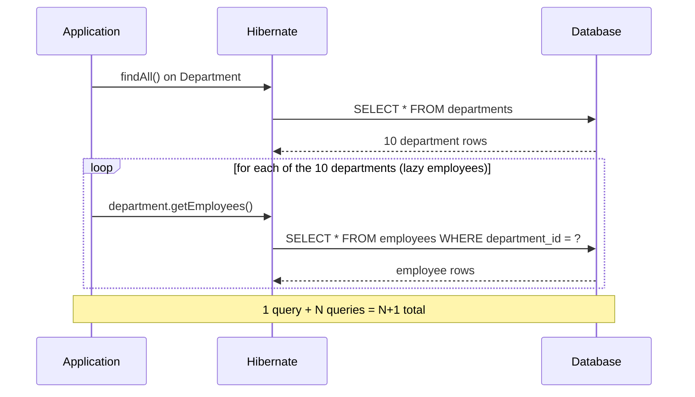

The standard fixes, from a SQL perspective, all boil down to fetching the needed data in one query instead of N follow-up queries:

- **`JOIN FETCH` in JPQL** — `SELECT d FROM Department d JOIN FETCH d.employees` produces a single `SELECT ... JOIN` instead of N+1 (be aware of result duplication for one-to-many fetch joins, and that it can't be safely combined with `LIMIT`/pagination for the "many" side without care — this can trigger Hibernate's in-memory pagination warning).
- **`@EntityGraph`** — declaratively specifies which lazy associations to eagerly fetch for a given repository method, without changing the entity's default fetch type globally.
- **Batch fetching** (`@BatchSize` / `hibernate.default_batch_fetch_size`) — instead of one query per parent, Hibernate groups the follow-up lazy-loads into a handful of `WHERE department_id IN (?, ?, ?, ...)` queries.

```java
@Query("SELECT d FROM Department d JOIN FETCH d.employees WHERE d.id IN :ids")
List<Department> findWithEmployees(@Param("ids") List<Long> ids);
```

### Optimistic vs Pessimistic Locking (SQL Perspective)

Both locking strategies solve the same problem — preventing lost updates when two transactions try to modify the same row concurrently — but they take opposite approaches to when conflicts are detected.

**Pessimistic locking** acquires a database-level row lock up front, blocking other transactions from modifying (or, depending on lock strength, even reading) the row until the current transaction commits or rolls back.

```sql
BEGIN;
SELECT * FROM accounts WHERE id = 1 FOR UPDATE; -- other transactions block here
UPDATE accounts SET balance = balance - 100 WHERE id = 1;
COMMIT;
```

```java
@Lock(LockModeType.PESSIMISTIC_WRITE)
@Query("SELECT a FROM Account a WHERE a.id = :id")
Account findByIdForUpdate(@Param("id") Long id);
```

**Optimistic locking** takes no lock at all; instead, it assumes conflicts are rare, and detects them at write time by checking that a version column hasn't changed since the row was read. If another transaction updated the row in the meantime, the `UPDATE` affects zero rows and the application raises a conflict error.

```sql
ALTER TABLE accounts ADD COLUMN version INT NOT NULL DEFAULT 0;

UPDATE accounts
SET balance = balance - 100, version = version + 1
WHERE id = 1 AND version = 5; -- 0 rows affected => someone else updated it first
```

```java
@Entity
public class Account {
    @Id
    private Long id;

    @Version
    private int version; // Hibernate manages the version column and the WHERE ... AND version = ? check

    private BigDecimal balance;
}
```

With `@Version`, Hibernate automatically appends `AND version = ?` to its `UPDATE` statement and throws `OptimisticLockException` if the row-count returned by the database is zero, meaning someone else committed a change first.

**Optimistic vs pessimistic locking**

| Aspect | Optimistic locking | Pessimistic locking |
|---|---|---|
| When conflict is detected | At write time (via version check) | Prevented up front (row is locked on read) |
| Database lock held | None | Row lock (`FOR UPDATE`) held until commit/rollback |
| Throughput under low contention | High (no blocking) | Lower (readers/writers can block) |
| Throughput under high contention | Lower (frequent retries needed) | Higher (no wasted work from conflicting retries) |
| Risk | Lost work on conflict — caller must retry | Deadlocks, blocked transactions, reduced concurrency |
| Spring/JPA mechanism | `@Version` field | `@Lock(LockModeType.PESSIMISTIC_WRITE)` / `PESSIMISTIC_READ` |
| Best suited for | Low-contention, high-read workloads (most web apps) | High-contention critical sections (e.g. financial transfers, inventory decrement) |

Real-life scenario: an e-commerce checkout decrementing inventory is a classic case for pessimistic locking (`SELECT ... FOR UPDATE`) because two concurrent checkouts racing for the last unit of stock must not both succeed. A user editing their own profile, by contrast, is a good fit for optimistic locking (`@Version`) — conflicts are rare, and on the rare occasion two edits collide, simply asking the user to retry is an acceptable trade-off for much better everyday throughput.

#### Interview Questions

1. **What causes the N+1 query problem in a Spring Data JPA application, and how do you detect it?**
   It's caused by accessing a `FetchType.LAZY` association (like `department.getEmployees()`) inside a loop over parent entities, triggering one additional query per parent instead of a single combined query. It's typically detected by enabling SQL logging (`spring.jpa.show-sql` / a query-count assertion library) and observing far more `SELECT` statements than expected for a given request.
2. **What are two different ways to fix an N+1 problem in JPA, and what trade-off does each involve?**
   `JOIN FETCH` (or `@EntityGraph`) eagerly loads the association in the same query, reducing round-trips to one but risking result-set duplication for one-to-many fetches and complicating pagination. Batch fetching (`@BatchSize`/`default_batch_fetch_size`) still issues multiple queries but groups them into a handful of `IN (...)` queries instead of one per row, which is safer with pagination but still more round-trips than a single join.
3. **Why can't `JOIN FETCH` be safely combined with `LIMIT`/pagination on the "many" side of a one-to-many relationship?**
   Because the join multiplies parent rows by the number of matching child rows before pagination is applied, a database-level `LIMIT` would cut off in the middle of a parent's children rather than limiting the number of distinct parents — Hibernate detects this and either warns or performs pagination in memory, which defeats the purpose of `LIMIT`.
4. **How does optimistic locking detect a conflicting concurrent update without taking a database lock?**
   Each row has a version column; when updating, the application includes the version it originally read in the `WHERE` clause (`WHERE id = ? AND version = ?`). If another transaction already updated and incremented the version, the `UPDATE` matches zero rows, signaling a conflict that Hibernate surfaces as `OptimisticLockException`.
5. **When would you choose pessimistic locking (`SELECT ... FOR UPDATE`) over optimistic locking (`@Version`)?**
   When conflicts are expected to be frequent and/or the cost of retrying after a failed optimistic update is high or user-visible — e.g. decrementing limited inventory during checkout, or transferring funds between accounts — where it's better to block briefly than to risk repeated failed attempts under contention.
6. **What SQL-level risk does pessimistic locking introduce that optimistic locking does not?**
   Held row locks can cause blocking and, if multiple transactions lock rows in different orders, deadlocks — the database must detect and abort one of the transactions. Optimistic locking never blocks another transaction; its downside is wasted work and a need to retry when a conflict is detected after the fact, rather than blocking.
7. **In the `accounts` table example, what does `UPDATE accounts SET balance = ..., version = version + 1 WHERE id = 1 AND version = 5` returning 0 affected rows actually tell you?**
   It means the row's current `version` was no longer `5` at the moment the `UPDATE` executed — some other transaction already read version 5, updated the row, and bumped the version — so this transaction's view of the data was stale and the update was safely rejected instead of silently overwriting the other change.
