# Apache Kafka Topics

## Kafka Fundamentals

### What is Apache Kafka?

Apache Kafka is a distributed, horizontally scalable, fault-tolerant event streaming platform originally built at LinkedIn and later open-sourced through the Apache Software Foundation. At its core, Kafka is a durable, append-only, distributed commit log that lets producers write records to named streams called *topics*, and lets consumers read those records independently, at their own pace, in the order they were written.

Unlike a traditional queue where a message disappears once consumed, Kafka retains records for a configurable retention period (or indefinitely with compaction), so multiple independent consumers or applications can read the same data stream without interfering with each other. This log-centric design is what enables Kafka to act simultaneously as a messaging system, a storage system, and a stream-processing platform.

Kafka is written in Scala and Java, runs as a cluster of one or more servers called *brokers*, and (since KRaft became the default) no longer requires ZooKeeper for metadata management. It is used heavily for decoupling microservices, building event-driven architectures, real-time analytics pipelines, log aggregation, and as the backbone for CDC (Change Data Capture) pipelines with tools like Debezium.

For a Spring Boot engineer, Kafka usually shows up via the `spring-kafka` library, which wraps the native Kafka Java client with `KafkaTemplate` for producing and `@KafkaListener` for consuming, integrated with Spring's dependency injection and configuration model.

**Real-life scenario:** An e-commerce platform publishes an `OrderPlaced` event to Kafka whenever a customer checks out. The inventory service, billing service, notification service, and analytics service each consume that same event independently, without the order service needing to know who is listening.

**Interview Questions:**
- What problem was Kafka originally designed to solve at LinkedIn? — Handling high-throughput activity/event data feeds that traditional MOM systems couldn't scale to.
- Is Kafka a message queue or a streaming platform? — Both; it behaves like a queue via consumer groups and like a pub/sub log for independent consumers.
- Why is Kafka described as a "distributed commit log"? — Because each partition is an ordered, immutable, append-only sequence of records persisted to disk.
- What language is Kafka written in, and what client languages are commonly used with Spring Boot? — Written in Scala/Java; Spring Boot uses the Java client via `spring-kafka`.

### Event Streaming Platform

An event streaming platform is software infrastructure designed to continuously capture, store, and process streams of events — as opposed to processing data in discrete batches. Kafka qualifies as a full event streaming platform because it combines three capabilities: publish/subscribe messaging (producers and consumers), durable storage (the commit log with configurable retention), and stream processing (via Kafka Streams or ksqlDB) — all in one system.

The key mental shift from traditional data systems is that in event streaming, the *event* (a fact that something happened, e.g. "payment authorized") is the primary artifact, and it flows continuously rather than being requested on demand. Applications react to events as they arrive instead of polling a database for changes.

This architecture supports both real-time use cases (fraud detection, live dashboards) and near-batch use cases (nightly ETL jobs reading yesterday's events), because consumers can choose to read from the latest offset or replay from the beginning of the log.

```java
// Spring Kafka producer sending a domain event
@Service
public class OrderEventPublisher {

    private final KafkaTemplate<String, OrderPlacedEvent> kafkaTemplate;

    public OrderEventPublisher(KafkaTemplate<String, OrderPlacedEvent> kafkaTemplate) {
        this.kafkaTemplate = kafkaTemplate;
    }

    public void publish(OrderPlacedEvent event) {
        kafkaTemplate.send("order-events", event.getOrderId(), event);
    }
}
```

**Real-life scenario:** A ride-hailing app streams `DriverLocationUpdated` events continuously; a matching service consumes them in real time to assign the nearest driver, while a separate analytics job replays the same stream hours later to compute heatmaps.

**Interview Questions:**
- What three pillars make Kafka a complete event streaming platform? — Pub/sub messaging, durable storage, and stream processing.
- How does event streaming differ from traditional batch ETL? — Events are processed continuously as they occur rather than collected and processed periodically.
- Can the same event stream serve both real-time and batch consumers? — Yes, since Kafka retains data and consumers track their own offsets independently.

### Messaging System vs Event Streaming

Traditional messaging systems (like classic JMS queues) are built around the idea of delivering a message from a producer to a consumer and then discarding it — the broker's job is transient delivery, not long-term storage. Once a message is acknowledged/consumed, it is typically gone, and only one logical consumer group processes a given message.

Event streaming platforms like Kafka treat the stream as a durable, replayable log. Data is retained for a configurable time (or forever with log compaction), consumers do not remove data when they read it, and any number of independent consumer groups can replay the exact same history. This turns the broker from a transient pipe into a source of truth that new applications can plug into later and "catch up" on history.

The practical implication for system design: with pure messaging, if a new service needs historical data it usually queries a database; with event streaming, that service can simply subscribe to the topic from offset zero and rebuild its own state from the event history (event sourcing).

**Advantages of Event Streaming over classic Messaging:**
- Replayability — new consumers can reprocess history.
- Multiple independent consumer groups can read the same data.
- Enables event sourcing and CQRS patterns naturally.
- Higher throughput via sequential disk I/O and batching.

**Disadvantages of Event Streaming vs classic Messaging:**
- More operational complexity (partitions, offsets, consumer group rebalancing).
- Message-level per-consumer acknowledgement/redelivery semantics are less granular than JMS.
- Requires understanding of retention/compaction tuning to avoid unbounded storage growth.

**Interview Questions:**
- What happens to a message after it is consumed in Kafka vs in a traditional queue? — Kafka retains it per retention policy; a traditional queue typically deletes it.
- Why can multiple consumer groups read the same Kafka topic independently? — Kafka tracks offsets per consumer group, not by deleting messages on read.
- Give an example where event streaming enables a capability plain messaging cannot. — A new analytics service replaying all historical orders to build aggregates from scratch.

### Kafka Architecture

At a high level, a Kafka deployment consists of a cluster of *brokers* that store data, *topics* split into *partitions* distributed across those brokers, *producers* that write records, and *consumers* (organized into *consumer groups*) that read records. Metadata about the cluster — which broker leads which partition, current ISR sets, topic configs — is managed by a small quorum of *controller* nodes, using the KRaft protocol (Raft-based, replacing ZooKeeper in modern Kafka).

Each partition has one broker acting as *leader*, handling all reads and writes for that partition, while zero or more *followers* replicate the leader's log for fault tolerance. If a leader fails, the controller promotes one of the in-sync followers to leader.

Clients (producers/consumers) talk to any broker to fetch cluster metadata, then connect directly to the leader broker for each partition they need to produce to or consume from — Kafka clients are "smart," and brokers are comparatively simple pipes.

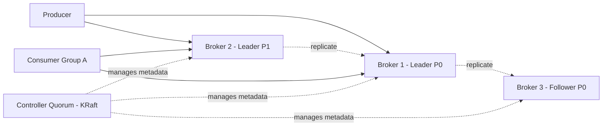

**Real-life scenario:** A payments company runs a 6-broker Kafka cluster across 3 availability zones; each topic has replication factor 3, so a full AZ outage does not cause data loss because followers in other AZs hold copies of every partition.

**Interview Questions:**
- What is the role of the controller in a Kafka cluster? — Manages partition leadership, cluster metadata, and broker membership.
- What replaced ZooKeeper in modern Kafka, and why? — KRaft (Kafka Raft), to simplify operations and remove the external ZooKeeper dependency.
- How do producers know which broker to send a record to? — They fetch metadata (topic/partition/leader mapping) and connect directly to the partition leader.

### Kafka Use Cases

Kafka is a general-purpose backbone for moving and processing data at scale, and its common use cases fall into a handful of recurring patterns: (1) **messaging/decoupling** between microservices so producers and consumers don't need synchronous APIs; (2) **log aggregation**, collecting application/infrastructure logs from many hosts into a central pipeline (often feeding Elasticsearch/Splunk); (3) **stream processing**, doing real-time transformations, aggregations, and joins with Kafka Streams or ksqlDB; (4) **event sourcing / CQRS**, where the topic is the durable source of truth for an entity's state changes; (5) **change data capture (CDC)**, streaming database row-level changes (via Debezium) into Kafka for downstream consumers; and (6) **metrics/telemetry pipelines** feeding monitoring systems.

Because Kafka decouples producers from consumers in time and space, it is especially well suited to systems that need to fan out one event to many independent downstream systems, or that need to buffer bursts of traffic (e.g., Black Friday sales spikes) without overwhelming downstream services.

In a Spring Boot microservices architecture, a very common pattern is the "outbox" pattern: a service writes to its own database and an outbox table in the same transaction, and a CDC connector or scheduled publisher pushes those changes to Kafka, guaranteeing at-least-once delivery without distributed transactions.

**Real-life scenario:** A bank streams every ledger transaction into Kafka; a fraud-detection stream-processing job scores transactions in real time, a reporting pipeline aggregates daily totals, and an audit service persists an immutable copy — all fed from one topic.

**Interview Questions:**
- Name three distinct architectural patterns where Kafka is commonly used. — Microservice decoupling, log aggregation, CDC/event sourcing.
- Why is Kafka a good fit for the outbox pattern? — It provides durable, ordered, replayable delivery decoupled from the originating service's transaction.
- How does Kafka help absorb traffic spikes? — Producers can write faster than consumers process; the log buffers the backlog until consumers catch up.

### Kafka vs RabbitMQ

RabbitMQ is a traditional message broker implementing AMQP, built around smart brokers with exchanges, queues, and bindings that actively route messages to consumers and typically delete a message once it's acknowledged. Kafka is a distributed log where "dumb" brokers just append and serve bytes, and "smart" consumers pull data and track their own offsets, with retained, replayable history.

RabbitMQ is generally the better choice for complex routing (topic/fanout/direct exchanges, priority queues, per-message TTL, request/reply RPC patterns) and lower absolute latency for individual messages at moderate throughput. Kafka is the better choice for very high-throughput, ordered, replayable event streams and stream processing.

**Differences vs RabbitMQ:**
- Kafka retains messages after consumption (configurable retention/compaction); RabbitMQ typically deletes on ack.
- Kafka scales consumption via partitions and consumer groups; RabbitMQ scales via competing consumers on a queue.
- Kafka guarantees order only within a partition; RabbitMQ can guarantee order per queue (single consumer) but loses it with competing consumers.
- RabbitMQ supports rich routing topologies (exchanges); Kafka routing is essentially topic + partition key.
- Kafka is push-pull with consumer-driven pulling; RabbitMQ pushes messages to consumers.

**Advantages of Kafka:** massive throughput, replay/history, natural fit for stream processing, strong ordering per key.
**Advantages of RabbitMQ:** flexible routing, simpler mental model for classic task queues, lower latency for low-volume workloads, mature plugin ecosystem (delayed messages, priority queues).

**Interview Questions:**
- When would you pick RabbitMQ over Kafka? — Complex routing needs, RPC-style messaging, or low-throughput task queues needing per-message acknowledgement semantics.
- How does message retention differ between the two systems? — Kafka retains by policy regardless of consumption; RabbitMQ removes messages once acknowledged.
- How is ordering guaranteed differently in each system? — Kafka orders within a partition; RabbitMQ orders within a queue only with a single consumer.

### Kafka vs ActiveMQ

ActiveMQ is a JMS-compliant broker supporting both queue (point-to-point) and topic (pub/sub) models with transient message delivery, typically used for enterprise integration patterns and reliable request/response messaging. Kafka instead implements a persistent, partitioned log designed for high-throughput streaming and replay, with a different delivery philosophy: consumers pull data and manage offsets rather than the broker pushing and tracking per-consumer state.

ActiveMQ's JMS topics allow multiple subscribers, but durable subscriptions and scaling to very large consumer counts or huge retained backlogs are not its strength; it was designed for enterprise messaging integration (ESB-style), not for petabyte-scale log storage or stream processing.

**Differences vs ActiveMQ:**
- Kafka is log-based and replayable; ActiveMQ is queue/topic-based and largely transient.
- Kafka scales horizontally via partitioning much more easily than ActiveMQ's broker/network-of-brokers model.
- ActiveMQ natively supports the JMS API and standards (useful for legacy Java EE integration); Kafka has its own client protocol (and JMS bridges exist but are not native).
- Kafka is generally preferred for streaming/analytics pipelines; ActiveMQ is preferred for classic enterprise integration (EIP) with strict JMS semantics.

**Interview Questions:**
- Why is Kafka generally favored for high-throughput streaming over ActiveMQ? — Its partitioned log design and sequential I/O give it much higher sustained throughput and replay capability.
- Does Kafka support the JMS API natively? — No, Kafka has its own client API; JMS-to-Kafka bridges/adapters exist separately.
- In what scenario would ActiveMQ's JMS compliance be a deciding factor? — Integrating with legacy Java EE apps that require standard JMS queues/topics and transactions.

### Kafka vs Pulsar

Apache Pulsar is a more recently developed pub/sub and streaming platform that separates the serving layer (brokers) from the storage layer (Apache BookKeeper), which theoretically allows brokers to scale and fail over independently of the data they serve. Kafka, by contrast, couples storage and serving in the broker itself (each broker owns and serves the partitions it stores).

Pulsar natively supports both queuing (shared subscriptions with competing consumers) and streaming (exclusive/failover subscriptions) semantics within the same topic abstraction, whereas Kafka's consumer-group model primarily targets the streaming/log-partition style and approximates queue semantics via a single-partition, single-consumer-group setup.

**Differences vs Pulsar (Overview):**
- Pulsar decouples compute (brokers) from storage (BookKeeper); Kafka brokers own their own storage.
- Pulsar has built-in multi-tenancy and geo-replication features baked in earlier; Kafka added MirrorMaker/Cluster Linking for cross-cluster replication.
- Kafka has a much larger ecosystem, community, and tooling maturity (Kafka Streams, ksqlDB, Kafka Connect) as of most interviews' expectations.
- Pulsar supports flexible subscription types (exclusive, shared, failover, key-shared) natively; Kafka approximates these through partition/consumer-group design.

**Interview Questions:**
- What is the fundamental architectural difference between Kafka and Pulsar? — Pulsar separates serving (brokers) from storage (BookKeeper); Kafka brokers do both together.
- Why might Pulsar rebalance faster after a broker failure than Kafka? — Because storage is externalized to BookKeeper, a new broker can immediately serve existing segments without re-replicating data.
- Which platform has broader ecosystem/tooling maturity for stream processing as of common industry usage? — Kafka, via Kafka Streams and ksqlDB.

## Core Kafka Concepts

### Events (Records)

An event (also called a *record* or *message*) is the fundamental unit of data in Kafka: an immutable fact representing something that happened, such as "user 123 clicked button X" or "order 456 was placed." Structurally, a Kafka record consists of a **key**, a **value**, a **timestamp**, and optional **headers** (metadata key-value pairs), all serialized to bytes before being written to a partition.

The key is important beyond identifying the payload — Kafka uses it (by default, via a hash) to decide which partition a record lands in, which in turn determines ordering guarantees for records sharing that key. The value carries the actual payload, often JSON, Avro, or Protobuf-encoded.

Because records are immutable and appended sequentially, an event once written cannot be edited in place; corrections are made by publishing new compensating events (e.g., `OrderCancelled` after `OrderPlaced`), which fits well with event-sourcing style designs.

```java
public class OrderPlacedEvent {
    private String orderId;
    private BigDecimal amount;
    private Instant placedAt;
    // getters/setters
}

// Producing an event with a key and header
ProducerRecord<String, OrderPlacedEvent> record =
        new ProducerRecord<>("order-events", orderId, event);
record.headers().add("event-type", "OrderPlaced".getBytes(StandardCharsets.UTF_8));
kafkaTemplate.send(record);
```

**Real-life scenario:** A ride-share app emits a `TripCompleted` event carrying the trip ID as the key, ensuring all events for the same trip (start, update, complete) land in the same partition and are processed in order.

**Interview Questions:**
- What are the core components of a Kafka record? — Key, value, timestamp, and headers.
- Why does the key matter beyond just being part of the payload? — It determines the target partition, which affects ordering.
- Are Kafka records mutable? — No, they are immutable once appended to the log.

### Topics

A topic is a named, logical channel to which producers write and from which consumers read — conceptually similar to a table in a database or a folder of continuously appended files. Every topic is split into one or more partitions, and Kafka provides ordering guarantees only *within* a partition, not across an entire topic.

Topics are the primary unit of organization: you configure retention, replication factor, and cleanup policy (delete vs. compact) per topic. A topic can have many producers and many independent consumer groups reading it simultaneously without any coordination between them.

Topic names are typically namespaced by convention (e.g., `orders.created`, `payments.authorized`) to keep large clusters organized, and naming conventions matter a lot in real production systems for discoverability and access control (ACLs).

```bash
# Create a topic with 6 partitions and replication factor 3
kafka-topics.sh --bootstrap-server localhost:9092 \
  --create --topic order-events \
  --partitions 6 --replication-factor 3

# Describe a topic
kafka-topics.sh --bootstrap-server localhost:9092 --describe --topic order-events
```

**Real-life scenario:** A logistics company uses separate topics `shipment.created`, `shipment.dispatched`, and `shipment.delivered` instead of one giant topic, so consumers can subscribe only to the lifecycle stage they care about.

**Interview Questions:**
- What determines the ordering guarantee of a topic? — Ordering is guaranteed only within a single partition, not across the whole topic.
- What per-topic settings can be configured independently? — Retention, replication factor, partition count, cleanup policy, min ISR, etc.
- Can two unrelated applications read the same topic independently? — Yes, as long as they use different consumer group IDs.

### Partitions

A partition is an ordered, immutable sequence of records that forms a physical unit of parallelism and storage within a topic. Each partition lives on disk as a set of segment files on one or more brokers, and each record within a partition gets a monotonically increasing **offset** that uniquely identifies its position.

Partitions are the mechanism Kafka uses to scale both writes and reads horizontally: more partitions allow more brokers to share the write load and more consumers (up to the partition count) to read in parallel within a consumer group. However, more partitions also mean more open file handles, more replication traffic, and longer leader-election/rebalance times, so partition count is a real capacity-planning decision, not something to maximize blindly.

Choosing the number of partitions typically balances expected throughput, target consumer parallelism, and per-partition ordering requirements — a common rule of thumb is to size partitions based on desired consumer count and expected MB/s throughput per partition.

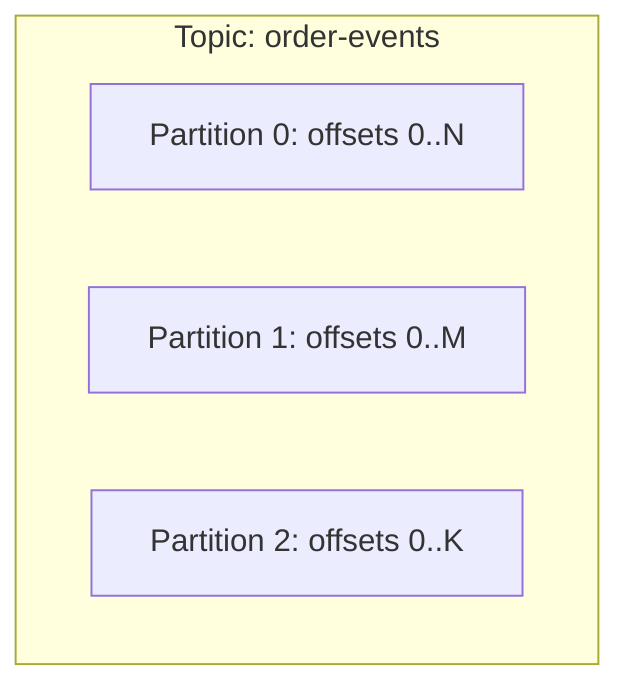

**Real-life scenario:** A topic with 3 partitions allows 3 consumer instances in the same group to each own one partition and process records in parallel, tripling throughput compared to a single partition.

**Interview Questions:**
- What is the maximum useful number of consumers in a single consumer group for a topic? — Equal to the number of partitions; extra consumers sit idle.
- Why can't Kafka guarantee ordering across an entire topic? — Because partitions are independent logs processed and replicated separately.
- What are the trade-offs of increasing partition count? — More parallelism but more overhead (file handles, replication, longer rebalances, higher latency for some operations).

### Offsets

An offset is a monotonically increasing integer that uniquely identifies the position of a record within a partition. Offsets are assigned by the partition leader at write time and never change for a given record — they are how consumers track "how far have I read."

Each consumer group tracks its own offset per partition (committed to the internal `__consumer_offsets` topic), which is what allows independent consumer groups to read the same partition at different paces without conflicting. Offset management is central to Kafka's delivery semantics: whether you get at-most-once, at-least-once, or effectively-once behavior largely depends on *when* offsets are committed relative to processing.

Consumers can also seek to arbitrary offsets — earliest, latest, a specific offset, or a timestamp — enabling replay for reprocessing, debugging, or disaster recovery.

```java
@KafkaListener(topics = "order-events", groupId = "billing-service")
public void consume(ConsumerRecord<String, OrderPlacedEvent> record) {
    log.info("Processing offset {} in partition {}", record.offset(), record.partition());
    // business logic
}
```

**Real-life scenario:** After a bug is found in a billing consumer, the team resets the consumer group's offset back to a known-good point in time and replays two days of `order-events` to recompute invoices correctly.

**Interview Questions:**
- Where does Kafka store committed consumer offsets? — In the internal `__consumer_offsets` topic (by default).
- What delivery semantic results from committing offsets before processing completes? — At-most-once (risk of losing unprocessed messages on crash).
- How can a team reprocess historical data? — By resetting the consumer group's offset to an earlier position (earliest, timestamp, or specific offset).

### Producers

A producer is a client application that publishes (writes) records to Kafka topics. Producers decide which topic to send to, optionally which partition (directly or via a key-based partitioner), and handle serialization of the key/value into bytes before sending.

Internally, the Kafka producer client batches records destined for the same partition, compresses them, and sends them asynchronously in the background via a network thread, while exposing a `Future`/callback-based API so the calling code isn't blocked waiting for the broker acknowledgment (unless it explicitly calls `.get()` or blocks on the future).

In Spring Boot, `KafkaTemplate` wraps the underlying producer, providing convenient synchronous and asynchronous send methods integrated with Spring's `ProducerFactory` and transaction management.

```java
@Configuration
public class KafkaProducerConfig {
    @Bean
    public ProducerFactory<String, Object> producerFactory() {
        Map<String, Object> config = new HashMap<>();
        config.put(ProducerConfig.BOOTSTRAP_SERVERS_CONFIG, "localhost:9092");
        config.put(ProducerConfig.KEY_SERIALIZER_CLASS_CONFIG, StringSerializer.class);
        config.put(ProducerConfig.VALUE_SERIALIZER_CLASS_CONFIG, JsonSerializer.class);
        config.put(ProducerConfig.ACKS_CONFIG, "all");
        return new DefaultKafkaProducerFactory<>(config);
    }

    @Bean
    public KafkaTemplate<String, Object> kafkaTemplate(ProducerFactory<String, Object> pf) {
        return new KafkaTemplate<>(pf);
    }
}
```

**Real-life scenario:** A checkout service produces an `OrderPlaced` event using `kafkaTemplate.send(...)` and attaches a callback to log a warning (and trigger an alert) if the broker ack fails, without blocking the HTTP response to the customer.

**Interview Questions:**
- Is `KafkaProducer.send()` synchronous or asynchronous by default? — Asynchronous; it returns a `Future` immediately.
- What responsibilities does a producer client have? — Serialization, partition selection, batching, compression, retries.
- How does Spring Boot simplify producing messages? — Via `KafkaTemplate`, which wraps `ProducerFactory`/`KafkaProducer` with Spring-friendly APIs.

### Consumers

A consumer is a client application that subscribes to one or more topics and pulls records for processing. Kafka's consumption model is pull-based: consumers actively poll brokers for new data (`poll()`), which gives consumers full control over their own pace, batch size, and backpressure — brokers never push data.

Consumers belong to a **consumer group**, identified by a `group.id`; Kafka assigns each partition of a subscribed topic to exactly one consumer instance within the group at any time, enabling horizontal scaling of processing while ensuring a partition's records are still processed in order by a single consumer instance.

In Spring Boot, `@KafkaListener` abstracts away the poll loop, offset management, and deserialization, letting developers write plain business-logic methods that get invoked per record or per batch.

```java
@KafkaListener(topics = "order-events", groupId = "notification-service", concurrency = "3")
public void onOrderPlaced(OrderPlacedEvent event, 
                           @Header(KafkaHeaders.RECEIVED_PARTITION) int partition) {
    notificationClient.sendOrderConfirmation(event);
}
```

**Real-life scenario:** A notification microservice runs 3 pod replicas, each hosting a consumer in the same group; Kafka spreads the topic's 6 partitions roughly 2-per-instance so notifications are sent in parallel without duplication.

**Interview Questions:**
- Is Kafka consumption push-based or pull-based? — Pull-based; consumers call `poll()`.
- What determines how many consumer instances can actively process a topic in parallel? — The number of partitions in the topic.
- How does `@KafkaListener` simplify consumer development in Spring Boot? — It hides the manual poll loop, offset commits, and deserialization boilerplate.

### Brokers

A broker is a single Kafka server process responsible for storing partition data, serving produce/fetch requests from clients, and replicating data for partitions it hosts. A production Kafka cluster typically consists of many brokers (3+ for real fault tolerance), each identified by a unique broker ID.

Each broker hosts a subset of the cluster's partitions, acting as **leader** for some and **follower** for others. Brokers handle the low-level mechanics of appending to log segments on disk, serving fetch requests efficiently (often via zero-copy sendfile), and enforcing topic-level configuration like retention and quotas.

Brokers are largely "dumb" in the sense that they don't track per-consumer read progress (that's the consumer's job via committed offsets) — this simplicity is a big part of why Kafka can scale to huge throughput.

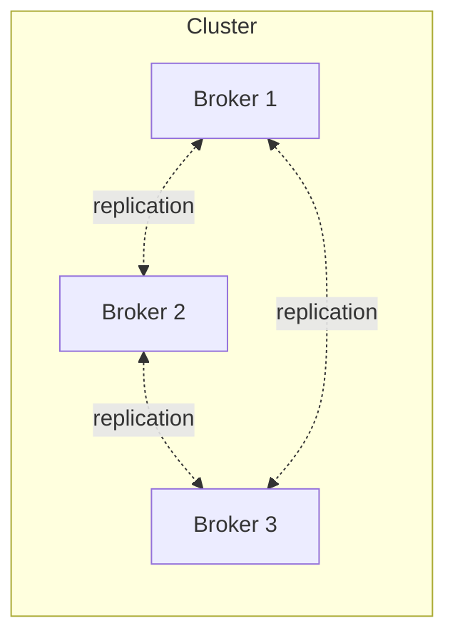

**Real-life scenario:** During a rolling Kafka upgrade, operators take down brokers one at a time; because each partition is replicated across at least 3 brokers, no data is lost and clients transparently fail over to the new leader.

**Interview Questions:**
- What is the main responsibility of a Kafka broker? — Storing partition logs and serving produce/fetch requests, plus replication.
- Do brokers track consumer read progress? — No, consumers track and commit their own offsets.
- Why do production clusters typically run at least 3 brokers? — To tolerate broker failure while maintaining a majority/replication factor for durability.

### Kafka Cluster

A Kafka cluster is a group of brokers working together, coordinated via the controller (KRaft quorum), that collectively store all topics/partitions and serve all client traffic for a Kafka deployment. From a client's perspective, the cluster looks like a single logical system reachable via a bootstrap server list, even though data is physically spread across many machines.

Clusters provide horizontal scalability (adding brokers to hold more partitions/throughput) and fault tolerance (replication across brokers, often across racks or availability zones). Cluster-wide concerns — topic creation, partition reassignment, ACLs, quotas — are coordinated centrally by the controller, while data-plane operations (produce/fetch) are handled directly by the relevant partition leaders.

Multiple clusters are also common in larger organizations for isolation (dev/staging/prod), geographic distribution, or regulatory boundaries, often linked together with MirrorMaker 2 or Cluster Linking for cross-cluster replication.

**Real-life scenario:** A global SaaS company runs regional Kafka clusters in the US, EU, and APAC for data residency compliance, with only aggregated, anonymized events mirrored to a central analytics cluster.

**Interview Questions:**
- What is a "bootstrap server" and why don't clients need to know about every broker? — An initial contact point used to discover the full cluster metadata; clients don't need every broker's address upfront.
- What role does the controller play at the cluster level? — Manages metadata, leader election, and broker membership across the cluster.
- Why might an organization run multiple Kafka clusters instead of one? — Isolation, data residency/compliance, blast-radius reduction, or geographic latency.

### Consumer Groups

A consumer group is a set of consumer instances that share a `group.id` and cooperatively consume a topic's partitions, with each partition assigned to exactly one consumer in the group at a time. This is the mechanism Kafka uses to provide both queue-like load balancing (partitions split across instances) and pub/sub-like fan-out (multiple groups each get the full data independently).

The **group coordinator** (a broker) tracks group membership, triggers rebalances when consumers join/leave, and manages the partition assignment strategy (range, round-robin, sticky, or cooperative-sticky). When a rebalance happens, some or all partitions may be reassigned, and consumers must handle a brief pause in processing.

Scaling a service's consumption throughput is done by adding more consumer instances to the same group (up to the partition count) — beyond that, extra instances remain idle since a partition cannot be split further.

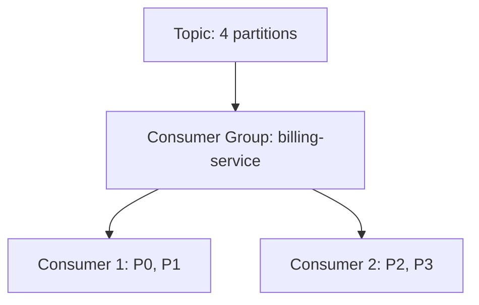

**Real-life scenario:** The `billing-service` consumer group has 2 instances handling 4 partitions (2 each); the `fraud-detection` consumer group independently reads the same topic from its own offsets without affecting billing.

**Interview Questions:**
- What determines whether two applications get independent copies of the same data stream? — Using different `group.id` values.
- What triggers a consumer group rebalance? — A consumer joining, leaving, crashing, or a partition count change.
- What happens if you add more consumers than partitions in a group? — The extras remain idle with no partitions assigned.

### Replication

Replication is Kafka's mechanism for durability and fault tolerance: each partition's data is copied to multiple brokers, with one broker as **leader** (serving all reads/writes) and the rest as **followers** (passively fetching and replicating the leader's log). The number of copies is controlled by the topic's **replication factor**.

Followers that are sufficiently caught up with the leader are part of the **in-sync replica (ISR)** set; only ISR members are eligible for leader election if the current leader fails, ensuring no committed data is lost during failover. Producers can require acknowledgment from all ISR members (`acks=all`) for the strongest durability guarantee.

Replication factor is a direct trade-off between durability/availability and storage/network cost: replication factor 3 (common in production) tolerates 2 broker failures for a partition while tripling storage and inter-broker network usage compared to replication factor 1.

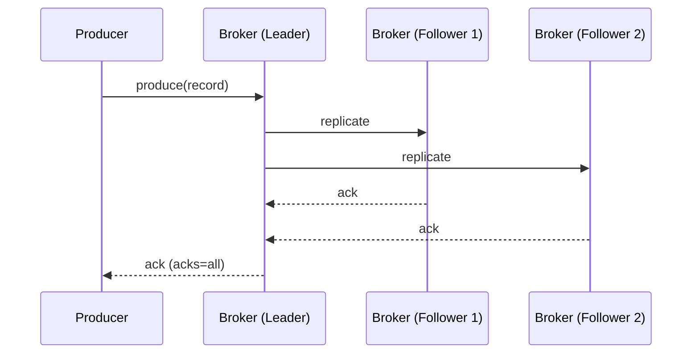

**Real-life scenario:** A retail company sets replication factor 3 for its `orders` topic; when one broker's disk fails at 3am, the controller promotes a follower to leader automatically and the on-call engineer only needs to replace the failed hardware, with zero data loss.

**Interview Questions:**
- What is the difference between replication factor and ISR? — Replication factor is the configured target number of copies; ISR is the current set of replicas actually caught up with the leader.
- What acks setting gives the strongest durability guarantee, and why? — `acks=all`, because it waits for all in-sync replicas to acknowledge the write.
- What happens if a leader broker crashes? — The controller elects a new leader from the ISR set for the affected partitions.

### Leader and Follower Replicas

For each partition, one replica is elected **leader** and handles all client reads and writes for that partition; all other replicas are **followers** that continuously fetch data from the leader to stay in sync but do not (by default) serve client traffic directly. This leader-follower model keeps the consistency model simple: clients always talk to exactly one authoritative copy per partition.

Followers that fall too far behind (beyond `replica.lag.time.max.ms`) are removed from the ISR set and are not eligible to become leader until they catch back up, protecting against promoting a stale replica and silently losing committed data.

Since Kafka 2.4+, `fetch-from-follower` allows consumers to optionally read from a geographically closer follower replica (for latency/cost optimization) even though it's not the leader, while writes always still go to the leader.

**Real-life scenario:** In a multi-datacenter deployment, consumers in the EU read from an EU-based follower replica to avoid cross-region latency, while the partition leader (and all writes) remains in the US datacenter.

**Interview Questions:**
- Which replica handles writes for a partition? — Only the leader.
- What determines whether a follower is eligible to become the new leader? — Whether it is part of the current in-sync replica (ISR) set.
- What Kafka feature allows reading from a follower instead of the leader? — Fetch-from-follower (rack-aware consumer reads), introduced in KIP-392.

## Kafka Architecture

### Cluster Architecture

Kafka's cluster architecture is built from three cooperating layers: the **data plane** (brokers storing and serving partitions), the **control plane** (the KRaft controller quorum managing metadata, leader elections, and cluster membership), and the **client layer** (producers and consumers that read cluster metadata and talk directly to the relevant partition leaders). This separation lets the data plane scale by simply adding brokers, while the control plane remains small and highly consistent (typically 3 or 5 controller nodes using Raft consensus).

Clients never need a load balancer in front of Kafka in the traditional sense — instead, they use a small list of "bootstrap" broker addresses to discover the full cluster topology, then cache and refresh that metadata as partitions move or leaders change.

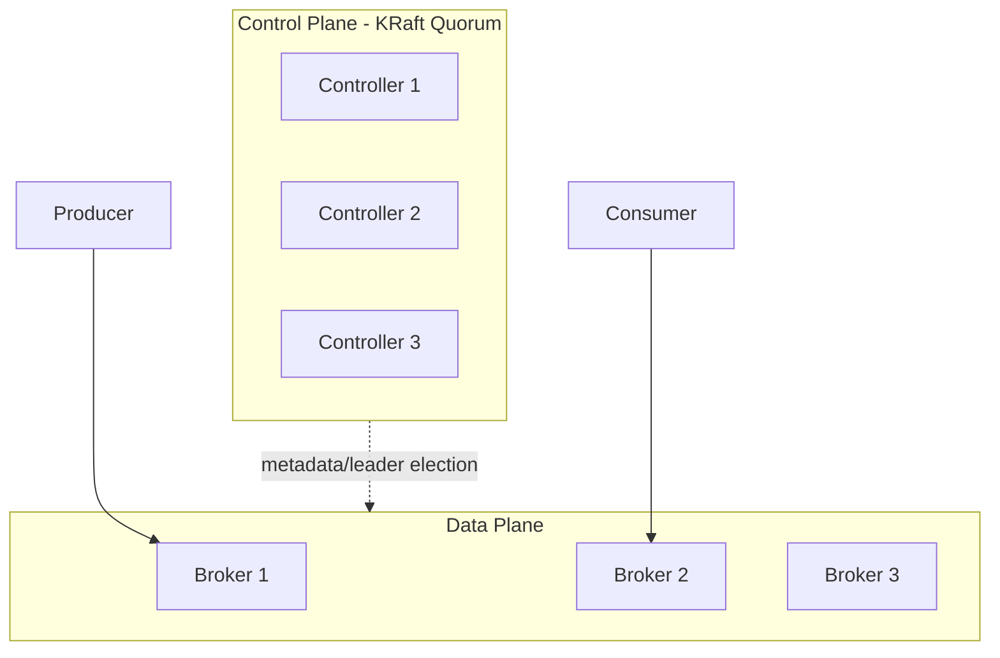

**Real-life scenario:** A platform team scales from 3 to 12 brokers as traffic grows, redistributing partitions across the new brokers, without ever touching the small 3-node controller quorum that continues managing metadata.

**Interview Questions:**
- Why is the control plane kept small (3-5 nodes) even in large clusters? — Raft consensus performs best with a small, odd-numbered quorum; it doesn't need to scale with data volume.
- How do clients discover the full cluster topology? — By connecting to bootstrap servers and fetching metadata, which is cached and refreshed as needed.
- What are the three architectural layers of a Kafka deployment? — Control plane (KRaft controllers), data plane (brokers), and client layer (producers/consumers).

### Broker Responsibilities

A broker's core responsibilities include: persisting partition data to disk as append-only log segments; serving `Produce` requests (appending new records) and `Fetch` requests (serving records to consumers/followers); managing replication for partitions it leads or follows; enforcing topic configuration such as retention, quotas, and compaction; and participating in cluster membership/heartbeats with the controller.

Brokers are deliberately kept stateless with respect to consumer progress — they don't track which records a given consumer group has read (that's stored in `__consumer_offsets`, itself just another topic) — which keeps the broker implementation simpler and more scalable.

Performance-wise, brokers rely heavily on the OS page cache and sequential disk I/O (rather than random access or in-JVM caching) to achieve high throughput, and use zero-copy transfer (`sendfile`) to serve fetch requests efficiently without extra data copies.

**Real-life scenario:** An SRE team monitors broker-level metrics like `UnderReplicatedPartitions` and `RequestHandlerAvgIdlePercent` to catch a struggling broker before it causes cluster-wide latency spikes.

**Interview Questions:**
- Does a broker know how far along a specific consumer group has read? — No, that state lives in the `__consumer_offsets` topic, not in broker memory tied to the consumer.
- Why does Kafka favor sequential disk I/O? — It is dramatically faster than random I/O on both spinning disks and SSDs, and pairs well with OS page-cache reads.
- What technique lets brokers serve fetch requests with minimal CPU/memory overhead? — Zero-copy transfer via `sendfile`.

### Topic Partitioning

Topic partitioning is the act of splitting a topic's data into multiple independent, ordered logs (partitions) so that storage and throughput scale horizontally across brokers, and so that multiple consumers can process a topic in parallel. Partitioning is a core architectural decision because it directly bounds parallelism (partition count) and ordering scope (only within a partition).

When a producer sends a record, a **partitioner** decides its destination partition: if a key is present, the default partitioner hashes the key (murmur2) to consistently map same-key records to the same partition; if no key is present, records are distributed using a sticky/round-robin approach for load balancing across partitions.

Repartitioning an existing topic (increasing partition count) is possible but changes the key-to-partition mapping going forward, which can break ordering assumptions for existing keys — a well-known gotcha that's frequently asked about in interviews.

```bash
# Increase partitions on an existing topic (cannot decrease!)
kafka-topics.sh --bootstrap-server localhost:9092 \
  --alter --topic order-events --partitions 12
```

**Real-life scenario:** A team increases `order-events` from 6 to 12 partitions to add consumer parallelism, but must warn downstream teams that records for existing order IDs may now land on a different partition than before, potentially affecting strict per-key ordering during the transition.

**Interview Questions:**
- How does the default partitioner decide the partition for a keyed record? — It hashes the key (murmur2) modulo partition count.
- Can you decrease the number of partitions on an existing topic? — No, Kafka does not support reducing partition count; the topic must be recreated.
- What is the risk of increasing partition count on a topic with existing keyed data? — The key-to-partition mapping changes, potentially breaking per-key ordering continuity.

### Metadata

Cluster metadata is the authoritative record of everything about the cluster's topology: which topics and partitions exist, which broker is the leader/follower for each partition, the current ISR set, topic configurations, and broker liveness. In modern Kafka, this metadata itself is stored as an event log (the `__cluster_metadata` topic) replicated via the Raft protocol among controller nodes — a very fitting design, since Kafka essentially "eats its own dog food" by using a log to store its own metadata.

Clients periodically refresh cached metadata (on a timer, or reactively when they hit a `NotLeaderForPartition` error), so that they keep sending requests to the correct current leader even as leadership changes due to failures or rebalancing.

Efficient metadata propagation matters a lot at scale — with hundreds of thousands of partitions, slow metadata propagation was one of the biggest scalability pain points ZooKeeper-based Kafka had, which was a major motivation for KRaft.

**Real-life scenario:** When a broker crashes and a new leader is elected for its partitions, producers get a `NotLeaderForPartition` error on their next request, triggering an automatic metadata refresh so subsequent requests go to the correct new leader within milliseconds.

**Interview Questions:**
- Where is cluster metadata stored in a KRaft-based Kafka cluster? — In the internal `__cluster_metadata` topic, replicated via Raft among controllers.
- What triggers a client to refresh its cached metadata? — A periodic timer, or an error response like `NotLeaderForPartition`/`UnknownTopicOrPartition`.
- Why was metadata propagation a scalability bottleneck in ZooKeeper-based Kafka? — ZooKeeper's watch-based full-metadata propagation didn't scale well to very large partition counts, causing slow controller failover.

### Replication Factor

Replication factor is a per-topic configuration specifying how many copies of each partition should exist across the cluster, including the leader. A replication factor of 3 means one leader plus two followers; this is the most common production setting because it tolerates the simultaneous loss of two brokers without losing data (assuming `acks=all` and sufficient ISR).

Replication factor cannot exceed the number of brokers in the cluster, and increasing it after topic creation requires a partition reassignment operation (it isn't a simple config toggle), since new replicas need to be created and fully synced.

There's a direct cost trade-off: each additional replica multiplies storage usage and inter-broker network bandwidth for that topic, so teams typically apply replication factor 3 for important data and may accept replication factor 1 or 2 for easily-reproducible, low-value data (e.g., transient logs).

```properties
# server.properties / topic config
default.replication.factor=3
min.insync.replicas=2
```

**Real-life scenario:** A financial services firm mandates replication factor 3 for all production topics as a compliance requirement, ensuring no single points of failure for transactional event data.

**Interview Questions:**
- What is a typical production replication factor and why? — 3, because it tolerates 2 broker failures while balancing storage/network cost.
- Can replication factor exceed the broker count? — No, there must be at least as many brokers as the replication factor.
- Is changing replication factor a simple config change? — No, it requires a partition reassignment to create and sync new replicas.

### In-Sync Replicas (ISR)

The In-Sync Replica (ISR) set for a partition is the leader plus all follower replicas that have fetched up to (or sufficiently close to) the leader's latest offset within the allowed lag window (`replica.lag.time.max.ms`). Only members of the ISR are eligible to be elected leader if the current leader fails, which is what guarantees no acknowledged (committed) data is lost on failover.

The ISR set is dynamic: a follower is removed from ISR if it falls behind (e.g., due to a slow disk, network issue, or GC pause) and re-added once it catches up. Monitoring `UnderReplicatedPartitions` (partitions where the ISR set is smaller than the replication factor) is one of the most important operational health signals for a Kafka cluster.

`min.insync.replicas` works together with `acks=all` to enforce a durability floor: if the ISR count drops below `min.insync.replicas`, producers using `acks=all` will receive a `NotEnoughReplicasException` rather than silently writing with weaker durability.

**Real-life scenario:** A broker experiences a long GC pause; its replicas fall out of the ISR for several partitions, and the cluster's monitoring dashboard fires an alert on rising `UnderReplicatedPartitions` before customer impact occurs.

**Interview Questions:**
- What determines whether a replica is in the ISR? — Whether it has kept up with the leader within the configured lag time/window.
- Why does leader election only choose from the ISR set? — To guarantee no committed data is lost (a lagging replica may be missing recent records).
- What happens to `acks=all` producers when ISR count drops below `min.insync.replicas`? — They receive a `NotEnoughReplicasException` and the write is rejected.

### Controller

The controller is the component (in KRaft, a set of dedicated controller nodes forming a Raft quorum) responsible for cluster-wide coordination: electing partition leaders, tracking broker liveness, propagating metadata changes, and processing administrative operations like topic creation/deletion and partition reassignment. In legacy ZooKeeper-based Kafka, exactly one broker was elected "controller" using ZooKeeper; in KRaft, dedicated controller nodes (which can be combined with broker roles in smaller clusters) manage this via Raft consensus without external coordination software.

The controller must react quickly to broker failures — detecting a dead broker, and reassigning leadership for every partition it led — so controller failover speed and metadata propagation efficiency are critical to overall cluster availability during incidents.

Because the controller quorum uses Raft, it maintains strong consistency about cluster state and elects its own internal active controller similarly to how partitions elect leaders, making the whole system self-similar in design.

**Real-life scenario:** When a broker holding 500 partition leaderships suddenly crashes, the controller quickly detects the failure via missed heartbeats and reassigns each affected partition's leadership to an in-sync follower, restoring full availability within seconds.

**Interview Questions:**
- What is the controller's primary job in a Kafka cluster? — Managing partition leader election, broker membership, and metadata propagation.
- How did the controller work before KRaft, and what changed? — One broker was elected controller via ZooKeeper; KRaft replaces this with a dedicated Raft-based controller quorum.
- Why is fast controller failover important operationally? — Because until a new controller is active, leader elections and metadata updates cannot proceed, risking availability during incidents.

### KRaft Architecture

KRaft (Kafka Raft) is Kafka's built-in consensus protocol that replaces ZooKeeper for metadata management, making Kafka self-contained with no external coordination service required. In KRaft mode, a small set of nodes run the **controller** role (forming a Raft quorum that replicates the `__cluster_metadata` log), while other nodes run the **broker** role (serving data); small clusters can combine both roles on the same nodes, while large production clusters typically run dedicated controller nodes.

KRaft was introduced to solve real operational pain points with ZooKeeper: a second system to deploy/monitor/secure, slower controller failover due to full-metadata reloads, and scalability limits around very large partition counts (ZooKeeper struggled past a few hundred thousand partitions). KRaft's event-log-based metadata store scales much better and unifies Kafka's own architecture (metadata is itself just a replicated log, consistent with how Kafka treats everything else).

As of recent Kafka versions, KRaft is the default and recommended mode for new clusters, with ZooKeeper mode deprecated and slated for removal.

```properties
# KRaft node roles in server.properties (combined mode example)
process.roles=broker,controller
node.id=1
controller.quorum.voters=1@localhost:9093,2@localhost:9094,3@localhost:9095
listeners=PLAINTEXT://:9092,CONTROLLER://:9093
```

**Real-life scenario:** A team migrating from Kafka 2.x to a modern version retires their ZooKeeper ensemble entirely, simplifying their deployment topology and reducing the number of systems that need patching, monitoring, and on-call runbooks.

**Interview Questions:**
- What problem does KRaft solve compared to ZooKeeper-based Kafka? — Removes the external ZooKeeper dependency, improves controller failover speed, and scales to far more partitions.
- What two node roles exist in KRaft, and can they be combined? — Broker and controller; yes, small clusters can combine both roles on the same node.
- Where is KRaft metadata stored? — In an internal replicated log, the `__cluster_metadata` topic.

### ZooKeeper (Legacy)

ZooKeeper was the original external coordination service Kafka relied on (pre-KRaft) to store cluster metadata: broker registration, topic/partition configuration, ACLs, and — critically — to elect the single active controller broker. ZooKeeper is a general-purpose distributed coordination system (used by many distributed systems, not just Kafka) providing a hierarchical key-value store with watches for change notification.

The ZooKeeper-based design had well-known limitations: operators had to run, secure, and monitor a completely separate ZooKeeper ensemble; controller failover required reloading full metadata state, which became slow as partition counts grew into the hundreds of thousands; and the watch-based notification model didn't scale gracefully to very large clusters.

Kafka has fully deprecated ZooKeeper mode in favor of KRaft; it is now primarily an interview/legacy-systems topic — useful to understand for maintaining older clusters, but not for new deployments.

**Real-life scenario:** An engineer supporting a legacy Kafka 2.x deployment troubleshoots a slow controller failover, tracing the root cause to ZooKeeper reprocessing a large volume of watches during a full metadata reload — the exact pain point KRaft was built to eliminate.

**Interview Questions:**
- What was ZooKeeper's role in older Kafka clusters? — Storing cluster metadata and electing the active controller broker.
- Why was ZooKeeper eventually removed from Kafka's architecture? — It added an extra operational dependency and became a scalability/failover bottleneck at high partition counts.
- Is ZooKeeper still recommended for new Kafka deployments? — No, KRaft is the default and recommended mode; ZooKeeper mode is deprecated.

### KRaft Controller Quorum

The KRaft controller quorum is the set of nodes (typically 3 or 5, an odd number for majority voting) running the controller role that use the Raft consensus algorithm to maintain a single, consistent, replicated log of cluster metadata. One node in the quorum acts as the **active controller** (the Raft leader for the metadata log) while the others are **standby controllers** that replicate the log and can take over instantly if the active controller fails.

Raft ensures that metadata changes (new topic, partition reassignment, ACL update, broker registration) are committed only once a majority of the quorum has persisted them, giving strong consistency guarantees even during controller failover — a big improvement over the ZooKeeper model's slower, full-reload failover.

Sizing the controller quorum is a small, fixed decision independent of the number of brokers or partitions in the cluster — 3 controllers is standard for most deployments, with 5 used for extremely large or critical clusters wanting extra fault tolerance.

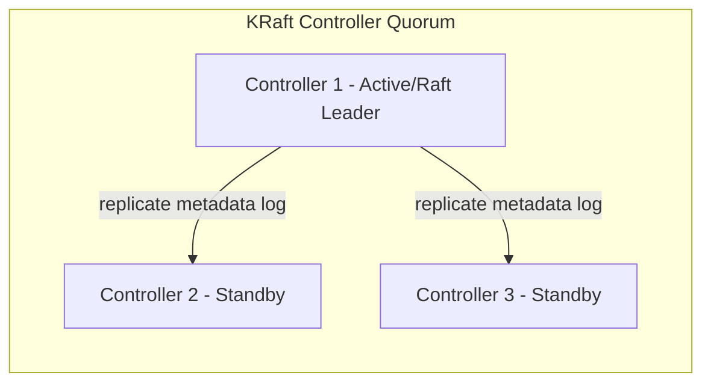

**Real-life scenario:** During a datacenter network blip, the active controller becomes unreachable; the remaining two controllers in the quorum quickly elect a new active controller via Raft, and cluster operations (leader elections, metadata updates) resume with only a brief pause.

**Interview Questions:**
- Why is the controller quorum sized as an odd number (e.g., 3 or 5)? — To ensure a clear majority for Raft consensus and tolerate node failures without losing quorum.
- What is the difference between the active controller and standby controllers? — The active controller is the current Raft leader processing metadata writes; standbys replicate and stand ready to take over.
- Does controller quorum size need to scale with the number of brokers? — No, it is typically fixed (3 or 5) regardless of cluster size.

## Topic Management

### Topic Creation

Creating a topic establishes a new named log with a chosen partition count and replication factor, either explicitly via the admin CLI/API, or implicitly via **auto topic creation** (`auto.create.topics.enable=true`) when a producer or consumer references a topic that doesn't exist yet — a convenience most production teams disable in favor of explicit, reviewed topic provisioning (often via Infrastructure-as-Code/GitOps).

Key decisions at creation time include partition count (parallelism/throughput), replication factor (durability), and topic-level overrides for retention, cleanup policy, and min ISR — because while many settings can be changed later, partition count can only be increased (never decreased), making it worth planning carefully upfront.

In a Spring Boot application, topics can also be declared as beans using `NewTopic`/`TopicBuilder`, letting `KafkaAdmin` create them automatically at application startup — handy for local development and integration tests.

```java
@Configuration
public class KafkaTopicConfig {
    @Bean
    public NewTopic orderEventsTopic() {
        return TopicBuilder.name("order-events")
                .partitions(6)
                .replicas(3)
                .config(TopicConfig.RETENTION_MS_CONFIG, "604800000") // 7 days
                .build();
    }
}
```

```bash
kafka-topics.sh --bootstrap-server localhost:9092 \
  --create --topic order-events --partitions 6 --replication-factor 3
```

**Real-life scenario:** A platform team disables `auto.create.topics.enable` in production and instead requires all topics to be created via a Terraform module reviewed in pull requests, preventing typo'd topic names from silently creating unmanaged, misconfigured topics.

**Interview Questions:**
- Why do many production teams disable auto topic creation? — To avoid accidental/misconfigured topics from typos and to enforce governance over partition/replication settings.
- Which topic setting cannot be decreased after creation? — Partition count.
- How can Spring Boot automatically create topics on startup? — By declaring `NewTopic` beans (e.g., via `TopicBuilder`), picked up by `KafkaAdmin`.

### Topic Configuration

Topics support a rich set of configuration overrides beyond partition count and replication factor, including `retention.ms`/`retention.bytes` (how long/how much data to keep), `cleanup.policy` (`delete` vs `compact` vs both), `min.insync.replicas`, `max.message.bytes`, `segment.ms`/`segment.bytes` (log segment rolling), and `compression.type`. These can be set at topic creation or altered later without downtime.

Topic-level configs override broker-level defaults, which lets teams apply broad sensible defaults cluster-wide (e.g., 7-day retention) while giving specific topics custom behavior (e.g., a compacted `user-profile-changelog` topic that never expires by time, only by compaction).

Understanding which configs are dynamic (changeable without restart, via `kafka-configs.sh --alter`) versus static (requiring broker restart) is a practical operational skill frequently probed in interviews.

```bash
# Alter topic config dynamically
kafka-configs.sh --bootstrap-server localhost:9092 \
  --entity-type topics --entity-name order-events \
  --alter --add-config retention.ms=259200000,min.insync.replicas=2
```

**Real-life scenario:** A team sets `cleanup.policy=compact` and disables time-based retention for a `customer-profile` topic so it behaves like a durable keyed changelog (latest state per customer ID), while their `clickstream` topic uses `cleanup.policy=delete` with a 3-day retention window.

**Interview Questions:**
- Can topic configuration be changed after the topic is created? — Yes, most configs (like retention, min ISR) can be altered dynamically without downtime.
- What's the difference between `retention.ms` and `retention.bytes`? — One limits retention by age, the other by total size per partition; whichever limit is hit first triggers deletion.
- Give an example of a topic-level override that differs from a sensible cluster default. — A compacted changelog topic overriding the cluster's default delete-based retention policy.

### Topic Partitions

(See also "Partitions" and "Topic Partitioning" above.) From a topic management perspective, partitions are the unit you provision and monitor per topic: you choose the initial count at creation, can only increase it later, and must track per-partition metrics (size, leader, ISR, consumer lag) as part of ongoing operations. Tools like `kafka-topics.sh --describe` and Kafka's JMX metrics expose per-partition leader/ISR/replica assignment for operational visibility.

A common operational task is **partition reassignment** — moving partitions between brokers (e.g., after adding new brokers, or to fix uneven load) using `kafka-reassign-partitions.sh`, which generates a reassignment plan and executes it as a background data-copy operation.

Choosing the right partition count up front matters because while you can add partitions later, doing so does not rebalance existing data across brokers automatically, and it changes the key-to-partition mapping for future records.

```bash
# Describe partitions, leaders, and ISR for a topic
kafka-topics.sh --bootstrap-server localhost:9092 --describe --topic order-events
```

**Real-life scenario:** After onboarding three new brokers, an operations engineer uses `kafka-reassign-partitions.sh` to spread `order-events`' 12 partitions more evenly across all brokers, improving overall cluster throughput and balance.

**Interview Questions:**
- What tool is used to move partitions between brokers? — `kafka-reassign-partitions.sh`.
- Does adding partitions automatically rebalance existing data? — No, new partitions start empty; existing data isn't redistributed.
- What per-partition information does `kafka-topics.sh --describe` show? — Leader, replicas, and ISR set for each partition.

### Topic Replication

Topic replication management involves setting and monitoring the replication factor per topic, ensuring the ISR stays healthy, and performing partition reassignment when replication needs to change (e.g., increasing replication factor after the fact, or moving replicas off a decommissioned broker). Unlike simple config values, replication factor changes require generating and executing a reassignment plan because new replica copies must be created and fully synced before they can join the ISR.

Operationally, the most important replication health signals are `UnderReplicatedPartitions` (ISR smaller than replication factor) and `OfflinePartitionsCount` (partitions with no available leader) — both are near-universal alerting rules in production Kafka monitoring.

Cross-cluster replication (as opposed to intra-cluster replication) is a separate concern handled by tools like MirrorMaker 2 or Confluent's Cluster Linking, typically used for disaster recovery or multi-region active-active/active-passive setups.

```bash
# Generate and execute a partition reassignment (e.g., increase replication)
kafka-reassign-partitions.sh --bootstrap-server localhost:9092 \
  --reassignment-json-file reassignment.json --execute
```

**Real-life scenario:** After a disk failure permanently takes a broker offline, an SRE runs a reassignment to move that broker's replicas to healthy brokers, restoring the topic's target replication factor and clearing the `UnderReplicatedPartitions` alert.

**Interview Questions:**
- What operation is required to change a topic's replication factor after creation? — A partition reassignment to add/remove replica copies.
- What metric indicates a topic partition currently has no leader? — `OfflinePartitionsCount` (a critical, page-worthy alert).
- What tools handle cross-cluster (as opposed to intra-cluster) replication? — MirrorMaker 2 or Cluster Linking.

### Topic Retention

Retention determines how long Kafka keeps records in a partition before eligible segments are deleted, controlled by `retention.ms` (time-based, default 7 days) and/or `retention.bytes` (size-based, per partition) — whichever limit is reached first triggers deletion of old log segments. Retention applies to topics using `cleanup.policy=delete` (as opposed to `compact`).

Retention is enforced at the **segment** level, not per individual record: Kafka rolls the active log into fixed-size or time-boxed segment files (`segment.bytes`/`segment.ms`), and only deletes whole segments once every record in them is past the retention threshold — meaning actual deletion can lag behind the theoretical retention window somewhat.

Setting retention too short risks losing data consumers haven't read yet (especially if a consumer is down for maintenance); setting it too long (or unbounded) risks unbounded disk growth. Retention of `-1` means "keep forever," typically only appropriate combined with compaction or for small, critical topics.

```bash
kafka-configs.sh --bootstrap-server localhost:9092 \
  --entity-type topics --entity-name clickstream --alter \
  --add-config retention.ms=259200000  # 3 days
```

**Real-life scenario:** A team shortens retention on a high-volume `clickstream` topic from 30 days to 3 days after confirming all downstream consumers process data within hours, cutting storage costs significantly.

**Interview Questions:**
- What are the two main levers controlling retention? — `retention.ms` (time) and `retention.bytes` (size), whichever is hit first.
- Is retention enforced per-record or per-segment? — Per-segment; whole segment files are deleted once expired.
- What risk does a very short retention window introduce? — Consumers that fall behind or are offline may miss data permanently.

### Topic Compaction

Log compaction is an alternative (or additional) cleanup policy (`cleanup.policy=compact`) that retains only the **latest record for each key** in a partition, rather than deleting based on age/size. This turns a Kafka topic into a durable, replayable changelog of "current state per key" — ideal for use cases like a `customers` topic where you only care about each customer's latest profile, not their full history of edits.

The compaction process runs in the background (the log cleaner threads), periodically rewriting segments to drop superseded records while preserving the relative offset order of surviving records. A special **tombstone** record (a key with a `null` value) signals deletion of that key; tombstones are themselves eventually removed after `delete.retention.ms`, once consumers have had a chance to see the deletion.

Compacted topics are the storage mechanism behind Kafka Streams' `KTable` and behind Kafka's own internal `__consumer_offsets` topic (which only needs the latest committed offset per group/partition, not full history).

```bash
kafka-topics.sh --bootstrap-server localhost:9092 \
  --create --topic customer-profile-changelog \
  --partitions 6 --replication-factor 3 \
  --config cleanup.policy=compact --config min.cleanable.dirty.ratio=0.1
```

**Real-life scenario:** A `user-preferences` topic uses compaction so that after millions of updates over years, the topic still only physically stores one record per user ID — the latest preferences snapshot — dramatically reducing storage compared to keeping every historical update.

**Interview Questions:**
- What does log compaction guarantee about a partition's contents? — At least the latest record for every key is retained.
- How do you delete a key entirely from a compacted topic? — Publish a tombstone record (that key with a `null` value).
- What Kafka Streams concept is backed by compacted topics? — `KTable`, representing the latest value per key.

### Internal Topics

Kafka uses several **internal topics**, prefixed with double underscores, to store its own operational state — most notably `__consumer_offsets` (committed consumer group offsets, compacted) and `__transaction_state` (transactional producer state for exactly-once semantics, also compacted). In KRaft mode, `__cluster_metadata` similarly stores the cluster's own metadata log.

These topics are created automatically by the broker and are managed internally — you generally shouldn't produce/consume them directly in application code, though inspecting them (e.g., with `kafka-console-consumer.sh --formatter` for offsets) is a common and useful debugging technique.

Because `__consumer_offsets` and `__transaction_state` are compacted, they naturally stay bounded in size regardless of how long a cluster runs, since only the latest state per key (e.g., per consumer-group-partition) is retained.

```bash
# Inspect committed offsets (for debugging only)
kafka-console-consumer.sh --bootstrap-server localhost:9092 \
  --topic __consumer_offsets --formatter \
  "kafka.coordinator.group.GroupMetadataManager\$OffsetsMessageFormatter" \
  --from-beginning
```

**Real-life scenario:** While debugging why a consumer group won't stop reprocessing data, an engineer inspects `__consumer_offsets` directly to confirm whether commits are actually landing for that group/partition.

**Interview Questions:**
- Name two important internal Kafka topics and what they store. — `__consumer_offsets` (committed offsets) and `__transaction_state` (transactional producer state).
- Why are internal topics like `__consumer_offsets` compacted rather than time-retained? — Because only the latest value per key (e.g., per group+partition) matters, keeping the topic bounded in size.
- Should application code produce directly to internal topics? — No, they are managed by the broker/clients internally, not meant for direct application use.

### Topic Deletion

Deleting a topic permanently removes its partitions, data, and configuration from the cluster, controlled by the broker-level `delete.topic.enable` setting (default `true` in modern Kafka). Because deletion is irreversible and immediate once processed, production clusters often protect topics via ACLs so only authorized automation/administrators can delete them.

Topic deletion is an asynchronous operation from the controller's perspective — it marks the topic for deletion and the brokers hosting its partitions clean up the underlying log segments in the background; very large topics may take some time to fully disappear from disk.

A frequent real-world gotcha: deleting and immediately recreating a topic with the same name can occasionally race with the deletion still finishing in the background, leading to confusing transient errors — a small delay or explicit verification is a safer operational pattern.

```bash
kafka-topics.sh --bootstrap-server localhost:9092 --delete --topic old-events
```

**Real-life scenario:** A team decommissioning a deprecated microservice deletes its dedicated topic as part of cleanup, but first double-checks no other consumer groups are still subscribed, since deletion is irreversible and would cause silent data loss for any lingering consumer.

**Interview Questions:**
- What broker setting controls whether topic deletion is allowed? — `delete.topic.enable` (default `true`).
- Is topic deletion synchronous or asynchronous? — Asynchronous; the controller marks it for deletion and brokers clean up segments in the background.
- What precaution should you take before deleting a topic in production? — Confirm no active consumer groups or producers still depend on it, since deletion is irreversible.

### Minimum In-Sync Replicas (min.insync.replicas)

`min.insync.replicas` is a topic (or broker-default) configuration that sets the minimum number of replicas that must acknowledge a write (be part of the ISR) for a produce request with `acks=all` to succeed. It exists specifically to prevent a false sense of durability: without it, `acks=all` combined with a shrunk ISR (e.g., down to just the leader) would still "succeed" but with effectively zero redundancy.

A very common production pattern is replication factor 3 with `min.insync.replicas=2`: this tolerates one broker failure while still requiring at least 2 copies acknowledge every write, giving a solid balance between availability and durability. If ISR drops below `min.insync.replicas` (e.g., 2 brokers down), `acks=all` producers start receiving `NotEnoughReplicasException`, deliberately favoring consistency/durability over availability.

This setting is frequently paired with `acks=all` in interview questions about "how do you guarantee no data loss in Kafka," since neither setting alone is sufficient — you need both together.

```properties
# Topic config combined with producer acks=all for strong durability
min.insync.replicas=2
```

```java
config.put(ProducerConfig.ACKS_CONFIG, "all"); // combine with topic's min.insync.replicas=2
```

**Real-life scenario:** A payments team sets replication factor 3 and `min.insync.replicas=2` on their `transactions` topic; when two of three brokers hosting a partition go down simultaneously, writes are deliberately rejected rather than risk accepting transactions with no redundancy.

**Interview Questions:**
- What does `min.insync.replicas` protect against that `acks=all` alone does not? — Writes succeeding with a dangerously shrunk ISR (e.g., only the leader), losing real redundancy.
- What is a common production combination of replication factor and `min.insync.replicas`? — Replication factor 3 with `min.insync.replicas=2`.
- What exception do `acks=all` producers get when ISR falls below `min.insync.replicas`? — `NotEnoughReplicasException`.

## Partitions and Ordering

### Partitioning Strategy

A partitioning strategy is the logic that determines which partition a given record is written to, and it directly shapes both load distribution and ordering guarantees. Kafka's built-in default strategy is: if a key is present, hash the key (murmur2) and mod by partition count; if no key is present, use a sticky/round-robin strategy that batches records to one partition at a time for efficiency before moving to the next.

Choosing the right partitioning strategy is really about choosing the right **key**: keying by `customerId` guarantees all events for a customer are ordered relative to each other (same partition), while keying by something too coarse (e.g., a constant) defeats parallelism, and keying by something too fine-grained and skewed (e.g., a rare category value) can cause "hot partitions."

For advanced cases, applications can supply a custom `Partitioner` implementation to control exactly how records map to partitions — e.g., to co-locate related entities beyond simple key hashing, or to implement geographic/tenant-aware partitioning.

```java
ProducerRecord<String, OrderEvent> record =
        new ProducerRecord<>("order-events", customerId, orderEvent); // key drives partition
```

**Real-life scenario:** An analytics platform keys events by `tenantId` so that all events for a given tenant are processed in order by the same consumer instance, simplifying per-tenant stateful aggregation.

**Interview Questions:**
- What's the default behavior when a producer sends a record with no key? — A sticky/round-robin distribution across partitions for load balancing.
- Why does key choice matter so much for partitioning? — It determines both load distribution and per-key ordering guarantees.
- What is a "hot partition" and how does poor key choice cause it? — A partition receiving disproportionate traffic because the chosen key has skewed value distribution.

### Message Ordering

Kafka guarantees strict ordering only **within a single partition** — records with the same key (and thus the same partition) are guaranteed to be written and read in the order they were produced, but there is no ordering guarantee across different partitions of the same topic. This is a foundational fact that shapes almost every design decision involving Kafka and ordering-sensitive data.

To preserve ordering for a logical entity (e.g., all events for one bank account), you must ensure all its events share the same partition key. On the producer side, retries can also threaten ordering unless `max.in.flight.requests.per.connection` is limited (or idempotence is enabled, which fixes this safely) — otherwise a retried batch could be written after a later batch that succeeded first.

On the consumer side, ordering is naturally preserved because a single consumer instance processes a given partition's records sequentially — but if you fan work out to multiple threads within a consumer's processing logic without care, you can accidentally reorder processing even though Kafka delivered records in order.

```java
// Safe ordering with idempotence + limited in-flight requests
config.put(ProducerConfig.ENABLE_IDEMPOTENCE_CONFIG, true);
config.put(ProducerConfig.MAX_IN_FLIGHT_REQUESTS_PER_CONNECTION, 5); // safe with idempotence
```

**Real-life scenario:** A banking system keys all transactions for an account by `accountId`, guaranteeing that a `Deposit` event is always processed before a subsequent `Withdrawal` event for the same account, since both land in the same partition in produce order.

**Interview Questions:**
- Does Kafka guarantee ordering across an entire topic? — No, only within a single partition.
- How can producer retries break ordering, and how is this fixed? — Retried batches could land out of order; enabling the idempotent producer fixes this safely even with multiple in-flight requests.
- What must you ensure to preserve ordering for a logical entity's events? — All its events must share the same partition key.

### Partition Keys

A partition key is the value (often the record's `key` field) used by the partitioner to deterministically choose which partition a record belongs to, most commonly via hashing. Good key selection balances two competing goals: even distribution of load across partitions, and correct grouping of related records that must stay ordered together.

Common effective keys include entity identifiers like `customerId`, `orderId`, `deviceId`, or `accountId` — anything that represents "the thing whose events must be ordered relative to each other." Poor key choices include highly skewed values (e.g., a `country` field where 90% of traffic is one country) or overly generic constants that eliminate parallelism entirely.

It's worth noting the key also often carries business meaning beyond partitioning — e.g., for a compacted topic, the key defines the compaction unit (only the latest value per key survives).

```java
// Good: keyed by orderId - all lifecycle events for an order stay ordered
kafkaTemplate.send("order-events", orderId, orderStatusChangedEvent);
```

**Real-life scenario:** An IoT platform partitions sensor readings by `deviceId`, ensuring a single consumer thread processes a device's readings in sequence (important for stateful anomaly detection), while spreading load across thousands of devices evenly.

**Interview Questions:**
- What two goals must a good partition key balance? — Even load distribution and correct grouping/ordering of related records.
- What happens if you choose a highly skewed partition key? — It creates hot partitions, overloading some brokers/consumers while others sit idle.
- Besides partitioning, what other role does the key play in a compacted topic? — It defines the compaction unit — only the latest value per key is retained.

### Round Robin Partitioning

Round-robin partitioning distributes records evenly across all partitions in sequence, used by default when a producer sends records **without a key** (technically Kafka's modern default is a "sticky" variant that batches several records to one partition before rotating, for better batching efficiency, but the net effect over time is still roughly even distribution). This maximizes load balancing but sacrifices any ordering relationship between records, since there's no key tying related records to the same partition.

Round-robin (or sticky) partitioning is appropriate when records are truly independent of each other — e.g., isolated log lines, metrics, or telemetry pings where no downstream consumer needs to see a particular entity's events in strict order.

The trade-off versus keyed partitioning is fundamental: round-robin optimizes for uniform load distribution, while keyed partitioning optimizes for correct per-entity ordering — you generally cannot fully have both when the key distribution itself is skewed.

```java
// No key -> sticky/round-robin distribution across partitions
ProducerRecord<String, String> record = new ProducerRecord<>("app-logs", null, logLine);
```

**Real-life scenario:** A logging pipeline sends unkeyed log lines to a `app-logs` topic using round-robin distribution, since individual log lines from different requests have no ordering dependency on each other.

**Interview Questions:**
- When is round-robin (no-key) partitioning appropriate? — When records are independent and don't require per-entity ordering.
- What is the modern default behavior for unkeyed records, and why does it differ slightly from pure round-robin? — A "sticky" partitioner batches several records to one partition at a time before rotating, improving batching efficiency while still balancing load overall.
- What do you lose by using round-robin partitioning instead of keyed partitioning? — Any ordering guarantee between related records.

### Custom Partitioners

A custom partitioner is a user-supplied implementation of Kafka's `Partitioner` interface, allowing an application to override the default key-hash/round-robin logic with domain-specific partition assignment — for example, co-locating related entities that don't share a simple key, implementing weighted/priority routing, or handling skewed keys with special-casing to avoid hot partitions.

To implement one, you implement the `partition()` method (returning a partition number given the topic, key, value, and cluster metadata) and configure it via the producer's `partitioner.class` property; Spring Boot/Spring Kafka simply passes this through to the underlying `ProducerConfig`.

Custom partitioners should be used sparingly — they add operational complexity and can make behavior less predictable to future maintainers — reaching for one is usually justified only when the default hashing genuinely can't express the required routing (e.g., dynamically rebalancing around known hot keys).

```java
public class VipAwarePartitioner implements Partitioner {
    @Override
    public int partition(String topic, Object key, byte[] keyBytes,
                          Object value, byte[] valueBytes, Cluster cluster) {
        int numPartitions = cluster.partitionsForTopic(topic).size();
        if ("VIP".equals(key)) {
            return 0; // dedicate partition 0 to VIP traffic
        }
        return Math.abs(Utils.murmur2(keyBytes)) % (numPartitions - 1) + 1;
    }
    @Override public void configure(Map<String, ?> configs) {}
    @Override public void close() {}
}
```

```properties
# producer config
partitioner.class=com.example.VipAwarePartitioner
```

**Real-life scenario:** A customer support platform routes VIP customer events to a dedicated partition (consumed with priority) via a custom partitioner, ensuring VIP tickets are processed faster than general traffic within the same topic.

**Interview Questions:**
- When would you implement a custom `Partitioner`? — When default hashing/round-robin can't express required routing (e.g., priority lanes, avoiding known hot keys).
- What method must a custom `Partitioner` implement? — `partition()`, returning the target partition number.
- What's a risk of overusing custom partitioners? — Increased complexity and less predictable/standard behavior for future maintainers.

### Partition Rebalancing

Partition rebalancing (in the consumer-group sense) is the process of reassigning topic partitions among the active consumer instances in a group whenever membership changes — a consumer joins, leaves, crashes (missed heartbeat), or the subscribed topic's partition count changes. During a rebalance, the group coordinator pauses partition assignment, runs the configured assignment strategy (range, round-robin, sticky, or cooperative-sticky), and hands out the new assignment.

Older "eager" rebalancing (range/round-robin assignors) revokes *all* partitions from *all* consumers before reassigning, causing a full stop-the-world pause. Newer **cooperative-sticky** rebalancing incrementally reassigns only the partitions that actually need to move, letting unaffected consumers keep processing during the rebalance — a major improvement adopted widely in modern Spring Kafka/consumer configurations.

Frequent or long rebalances are a common production pain point (often caused by slow consumer processing exceeding `max.poll.interval.ms`, or aggressive session timeouts), and are usually fixed by tuning poll/session timeouts, reducing batch processing time, or switching to the cooperative-sticky assignor.

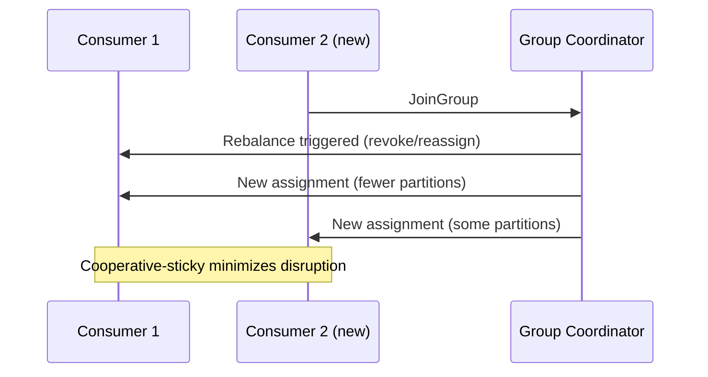

```properties
partition.assignment.strategy=org.apache.kafka.clients.consumer.CooperativeStickyAssignor
```

**Real-life scenario:** During a rolling deployment of a consumer service, pods restart one at a time; using the cooperative-sticky assignor keeps the rebalance impact minimal so throughput barely dips, versus the old eager assignor which would briefly stop all consumption cluster-wide.

**Interview Questions:**
- What triggers a consumer group rebalance? — Consumers joining/leaving, crashing, or partition count changes.
- What's the key difference between eager and cooperative-sticky rebalancing? — Eager revokes all partitions from everyone first; cooperative-sticky only reassigns the partitions that actually need to move.
- What consumer config commonly causes unwanted rebalances due to slow processing? — Exceeding `max.poll.interval.ms` between polls.

## Producers

### Producer Architecture

Internally, the Kafka producer client is built around a few cooperating pieces: the application thread that calls `send()`, an in-memory **record accumulator** that batches records per partition, and a background **Sender** thread that drains those batches and transmits them to the appropriate broker over the network. This architecture is what allows `send()` to return almost immediately (asynchronously) while still achieving high throughput through batching and compression.

When `send()` is called, the record is serialized, assigned a partition (via the partitioner), and appended to the accumulator's per-partition batch; the Sender thread flushes batches either when they hit `batch.size`, when `linger.ms` elapses, or when explicitly flushed. Responses (including retries and errors) are handled asynchronously and surfaced to the caller via a `Future<RecordMetadata>` or an optional callback.

Understanding this pipeline is important for tuning throughput vs. latency: increasing `linger.ms` and `batch.size` improves throughput and compression efficiency at the cost of added per-record latency, while decreasing them favors low latency at the cost of smaller, less efficient batches.

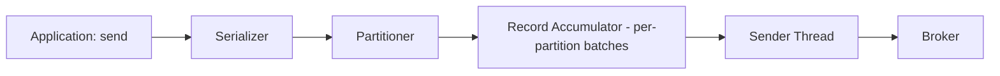

**Real-life scenario:** A high-throughput analytics pipeline tunes `linger.ms=20` and `batch.size=64KB` to trade a small amount of per-record latency for significantly better compression ratios and network efficiency.

**Interview Questions:**
- What two components handle batching and network transmission inside the producer client? — The record accumulator (batching) and the Sender thread (transmission).
- How does `linger.ms` affect throughput vs. latency? — Higher values allow bigger batches (better throughput/compression) at the cost of added latency per record.
- Is `KafkaProducer.send()` blocking? — No, it's asynchronous by default, returning a `Future`.

### Producer Configuration

Producer configuration governs correctness, performance, and durability trade-offs, and a handful of settings come up constantly in interviews: `bootstrap.servers` (initial cluster contact points), `acks` (durability level), `retries`/`delivery.timeout.ms` (resilience), `enable.idempotence` (exactly-once per-partition semantics), `batch.size`/`linger.ms` (batching), `compression.type`, `key.serializer`/`value.serializer`, and `max.in.flight.requests.per.connection`.

In Spring Boot, these map directly to `spring.kafka.producer.*` properties or programmatically via a `Map<String, Object>` passed to `DefaultKafkaProducerFactory`, giving teams a single place to standardize producer behavior across an application.

A well-configured production producer typically combines `acks=all`, `enable.idempotence=true`, and sensible retry/timeout settings to get strong durability without sacrificing much throughput, since modern brokers and clients are optimized to make this combination performant by default.

```yaml
# application.yml
spring:
  kafka:
    bootstrap-servers: localhost:9092
    producer:
      acks: all
      retries: 5
      properties:
        enable.idempotence: true
        max.in.flight.requests.per.connection: 5
        linger.ms: 10
        compression.type: snappy
      key-serializer: org.apache.kafka.common.serialization.StringSerializer
      value-serializer: org.springframework.kafka.support.serializer.JsonSerializer
```

**Real-life scenario:** A new engineer accidentally leaves `acks=1` (the client default in older versions) in production config, causing occasional silent data loss during leader failover — a code review catches it and standardizes on `acks=all` cluster-wide.

**Interview Questions:**
- What producer settings together provide strong durability guarantees? — `acks=all` combined with the topic's `min.insync.replicas`.
- How are producer settings configured in a Spring Boot application? — Via `spring.kafka.producer.*` properties or a custom `ProducerFactory` bean.
- What does `enable.idempotence=true` protect against? — Duplicate records caused by producer-side retries.

### Producer Acknowledgements (acks)

The `acks` setting controls how many replicas must confirm receipt of a record before the producer considers the write successful. `acks=0` means fire-and-forget (no confirmation, fastest, risk of silent loss); `acks=1` means only the partition leader must persist the record before acking (fast, but data can be lost if the leader fails before followers replicate it); `acks=all` (equivalent to `acks=-1`) means all current in-sync replicas must acknowledge, giving the strongest durability guarantee when combined with `min.insync.replicas`.

This setting is one of the most fundamental levers for the classic throughput-vs-durability trade-off in Kafka: `acks=0` maximizes throughput/minimizes latency at the cost of safety, while `acks=all` maximizes safety at some cost to latency (though modern Kafka minimizes this cost significantly).

For any data where loss is unacceptable — payments, orders, audit logs — `acks=all` paired with `min.insync.replicas>=2` and `enable.idempotence=true` is the standard production recipe.

```java
config.put(ProducerConfig.ACKS_CONFIG, "all");
```

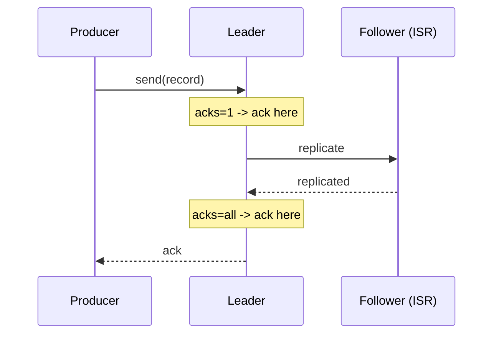

**Real-life scenario:** A payment-processing service switches from the client default to `acks=all` after a post-mortem revealed a handful of transaction events were silently lost during a leader failover under `acks=1`.

**Interview Questions:**
- What are the three possible values of `acks` and their trade-offs? — `0` (no ack, fastest, riskiest), `1` (leader only), `all`/`-1` (all ISR, safest).
- Which `acks` setting can lose data on leader failure even though the producer got an ack? — `acks=1`.
- What other setting must be tuned alongside `acks=all` to avoid a false sense of durability? — `min.insync.replicas`.

### Batching

Batching is the producer's strategy of grouping multiple records destined for the same partition into a single network request, dramatically improving throughput by amortizing network and per-request overhead, and improving compression efficiency (compressing a batch of similar records together compresses better than compressing them individually). Batching is controlled primarily by `batch.size` (max bytes per batch) and `linger.ms` (max time to wait for a batch to fill before sending anyway).

There's an inherent trade-off: larger batches and longer linger times increase throughput and compression ratio but add latency to each individual record (since it waits in the batch before being sent); very latency-sensitive applications may deliberately keep `linger.ms` low (or 0) at some throughput cost.

Batching happens transparently inside the producer client — application code just calls `send()` per record, and the client's record accumulator handles grouping records into batches per partition automatically.

```properties
batch.size=32768
linger.ms=15
compression.type=lz4
```

**Real-life scenario:** A metrics ingestion pipeline handling millions of events/sec tunes `linger.ms=25` and a larger `batch.size`, cutting broker-side CPU and network usage substantially compared to sending each metric as an individual uncompressed request.

**Interview Questions:**
- What two settings primarily control batching behavior? — `batch.size` and `linger.ms`.
- Why does batching improve compression efficiency? — Compressing many similar records together achieves a better ratio than compressing each individually.
- What's the cost of increasing `linger.ms`? — Added latency per record, since it waits longer for the batch to fill before being sent.

### Compression

Kafka supports compressing record batches on the producer side (`compression.type`: `none`, `gzip`, `snappy`, `lz4`, or `zstd`) to reduce network bandwidth and broker storage, with the broker typically storing and forwarding the compressed batch as-is (avoiding recompression) and consumers decompressing on read. Compression operates on whole batches, not individual records, which is why bigger batches tend to compress better.

Different codecs trade off CPU cost against compression ratio: `gzip` compresses the most but is the slowest/most CPU-intensive; `lz4` and `snappy` are fast with moderate compression, good defaults for high-throughput systems; `zstd` (newer) often gives the best balance of ratio and speed for many workloads.

Compression is one of the easiest, highest-leverage production tuning changes — enabling `lz4` or `zstd` on a previously uncompressed high-volume topic often cuts network/storage costs substantially with minimal downside.

```properties
compression.type=zstd
```

**Real-life scenario:** A logging pipeline enables `compression.type=lz4` on its high-volume `app-logs` topic, cutting inter-broker replication network traffic and disk usage by more than half with negligible CPU overhead.

**Interview Questions:**
- Does Kafka compress individual records or whole batches? — Whole batches, which is also why larger batches compress more efficiently.
- Which compression codec typically offers the best speed/ratio balance for modern workloads? — `zstd` (with `lz4`/`snappy` as fast alternatives).
- Do brokers decompress and recompress data during replication/storage? — No, generally brokers store and forward the compressed batch as-is; decompression happens on the consumer side.

### Retries

Retries govern how the producer handles transient send failures (e.g., `NotLeaderForPartitionException`, timeouts) by automatically resending the record rather than failing immediately. Configured via `retries` (max attempts, effectively very high/unbounded by default in modern clients) and bounded overall by `delivery.timeout.ms` (the total time budget across all attempts before giving up entirely).

A well-known pitfall: without the idempotent producer enabled, retries with multiple in-flight requests (`max.in.flight.requests.per.connection > 1`) can cause **duplicate** or **out-of-order** records if an earlier batch's retry succeeds after a later batch already landed. Enabling `enable.idempotence=true` fixes both problems safely by having the broker deduplicate retried batches using producer ID + sequence numbers, without forcing you to sacrifice in-flight parallelism.

Retries should be paired with sensible timeout settings (`request.timeout.ms`, `delivery.timeout.ms`) so that a persistently unreachable cluster fails fast enough for the application to handle it (e.g., circuit breaker, fallback) rather than blocking indefinitely.

```properties
retries=2147483647
delivery.timeout.ms=120000
enable.idempotence=true
```

**Real-life scenario:** During a brief network blip between a producer and the cluster, transient send failures are automatically retried and succeed within the `delivery.timeout.ms` budget, with no duplicate or reordered records thanks to idempotence being enabled.

**Interview Questions:**
- What problem can retries introduce if idempotence is disabled? — Duplicate or out-of-order records when retried batches interleave with later successful batches.
- What setting bounds the total time budget across all retry attempts? — `delivery.timeout.ms`.
- How does enabling idempotence make retries with multiple in-flight requests safe? — The broker deduplicates using producer ID + sequence number, preserving order and preventing duplicates.

### Idempotent Producer

An idempotent producer (`enable.idempotence=true`) guarantees that retried sends of the same record batch are not duplicated on the broker side, achieved by assigning each producer a unique **Producer ID (PID)** and tagging each batch with a monotonically increasing **sequence number** per partition; the broker tracks the last committed sequence number per PID/partition and silently drops/deduplicates a retry that matches an already-committed sequence.

This gives **exactly-once semantics per partition, per producer session** for the write path (not to be confused with full end-to-end exactly-once processing, which additionally requires transactions to span reads+writes atomically, e.g., in Kafka Streams or transactional producer/consumer patterns). Idempotence is effectively "free" — it doesn't reduce throughput meaningfully — which is why it's recommended to enable by default in nearly all production producers.

Enabling idempotence automatically enforces `acks=all` and `max.in.flight.requests.per.connection<=5`, since these are required preconditions for the deduplication guarantee to hold correctly.

```properties
enable.idempotence=true
# acks is forced to 'all' automatically when idempotence is enabled
```

**Real-life scenario:** A billing service enables idempotent producers so that a network blip causing a retry never results in a customer being double-charged due to a duplicate `PaymentProcessed` event landing twice.

**Interview Questions:**
- How does Kafka implement idempotent producers under the hood? — Via a Producer ID (PID) and per-partition sequence numbers that the broker uses to detect and drop duplicate retries.
- What acks setting does enabling idempotence require? — `acks=all`, enforced automatically.
- Does the idempotent producer guarantee exactly-once across multiple partitions or topics? — No, only exactly-once per partition per producer session; cross-partition atomicity requires transactions.

### Transactions

Kafka transactions allow a producer to write to multiple partitions/topics **atomically** — either all the writes in the transaction become visible to consumers (with `isolation.level=read_committed`), or none do — and can also atomically combine a consume-process-produce cycle by committing consumer offsets as part of the same transaction. This is the foundation of Kafka's **exactly-once semantics (EOS)** for stream processing pipelines (heavily used internally by Kafka Streams).

Transactions require a stable `transactional.id` per producer instance (used to fence off zombie producer instances after a crash/restart, so an old instance can't accidentally commit stale writes), and idempotence is implicitly required/enabled as part of using transactions.

Consumers must set `isolation.level=read_committed` to only see committed transactional writes (the default, `read_uncommitted`, would let them see writes from transactions that later abort) — a subtlety that's an easy trap in interviews and in real production configs.

```java
config.put(ProducerConfig.TRANSACTIONAL_ID_CONFIG, "order-processor-1");
KafkaProducer<String, String> producer = new KafkaProducer<>(config);
producer.initTransactions();

try {
    producer.beginTransaction();
    producer.send(new ProducerRecord<>("orders", orderId, orderJson));
    producer.send(new ProducerRecord<>("audit-log", orderId, auditJson));
    producer.commitTransaction();
} catch (Exception e) {
    producer.abortTransaction();
}
```

**Real-life scenario:** An order-processing stream reads from `raw-orders`, transforms and writes to `validated-orders` plus commits its consumer offset, all within a single Kafka transaction — guaranteeing that if the process crashes mid-way, the partial output is never visible and no data is double-processed on restart.

**Interview Questions:**
- What consumer setting is required to only see committed transactional writes? — `isolation.level=read_committed`.
- What is the purpose of `transactional.id`? — To fence off zombie producer instances and maintain transactional state across restarts.
- What Kafka feature commonly relies on transactions internally? — Kafka Streams' exactly-once processing guarantee.

### Message Keys

(See also "Partition Keys" above.) Beyond routing to a partition, message keys carry semantic meaning throughout the Kafka ecosystem: they define the compaction unit in log-compacted topics, they're commonly used in Kafka Streams for co-partitioning joins/aggregations (`KStream`-`KTable` joins require matching keys and partition counts), and they often double as a natural identifier for logging/debugging/tracing a specific entity's event flow.

Choosing `null` as a key is a valid and common choice for genuinely independent events, resulting in round-robin/sticky distribution; choosing a key is required whenever ordering or co-partitioning matters. Keys are serialized independently from values (via `key.serializer`), commonly as a simple `String`/`Long`, though composite/Avro keys are also used in more advanced schemas.

A frequent real-world mistake is using a highly unique but semantically meaningless key (e.g., a random UUID per message) when the goal is actually just "even distribution" — that's better served by no key at all, since a UUID key defeats the purpose of any ordering relationship while adding partitioner overhead.

```java
// Correct: keyed by entity id
kafkaTemplate.send("orders", orderId, orderEvent);

// Anti-pattern: random UUID key when no ordering relationship is needed
kafkaTemplate.send("orders", UUID.randomUUID().toString(), orderEvent);
```

**Real-life scenario:** A stream-processing job joining `orders` (keyed by `orderId`) with `payments` (also keyed by `orderId`) relies on both topics being co-partitioned by the same key and partition count, which is only possible because both producers deliberately used the same key strategy.

**Interview Questions:**
- What Kafka Streams requirement depends directly on consistent message keys? — Co-partitioning for stream-table or stream-stream joins.
- What happens if you send a record with a `null` key? — It's distributed round-robin/sticky across partitions rather than by hash.
- Why is a random UUID often a poor key choice? — It defeats any ordering/co-partitioning benefit while adding unnecessary partitioner hashing overhead.

### Message Headers

Headers are optional key-value metadata pairs attached to a Kafka record, separate from the key and value payload, used to carry cross-cutting information like `event-type`, `correlation-id`, `trace-id`, content-type, schema version, or tenant ID — without polluting the actual business payload schema. Headers are lightweight (`byte[]` values) and can be read/written without deserializing the full record value.

Headers are especially useful for distributed tracing (propagating a `traceparent`/`correlation-id` header across service boundaries so logs/traces can be stitched together) and for routing/filtering logic in consumers or Kafka Streams topologies that need metadata without paying the cost of full value deserialization.

Spring Kafka exposes headers conveniently via the `@Header` annotation in `@KafkaListener` methods, or via the `Message<T>`/`ConsumerRecord` APIs for more manual control.

```java
// Producing with headers
ProducerRecord<String, OrderEvent> record = new ProducerRecord<>("order-events", orderId, event);
record.headers().add("correlation-id", correlationId.getBytes(StandardCharsets.UTF_8));
kafkaTemplate.send(record);

// Consuming with headers
@KafkaListener(topics = "order-events")
public void consume(@Payload OrderEvent event,
                     @Header("correlation-id") String correlationId) {
    log.info("Processing {} with correlation {}", event, correlationId);
}
```

**Real-life scenario:** A microservices platform propagates a `correlation-id` header through every Kafka event so that a single customer request can be traced end-to-end across five different services in their centralized logging/tracing system.

**Interview Questions:**
- What kind of data belongs in headers rather than the record value? — Cross-cutting metadata like correlation IDs, trace IDs, or event type, not core business payload data.
- How can consumers access a specific header in Spring Kafka? — Via the `@Header` annotation on a `@KafkaListener` method parameter.
- Why are headers useful for distributed tracing? — They let trace/correlation IDs propagate across service boundaries without altering the business payload schema.

### Serialization

Serialization converts a Java object (key or value) into bytes for transmission and storage, and deserialization reverses the process on the consumer side; Kafka requires configuring both `key.serializer`/`value.serializer` (producer) and matching `key.deserializer`/`value.deserializer` (consumer). Common choices include `StringSerializer`, `JsonSerializer`/`JsonDeserializer` (Spring Kafka, using Jackson), and schema-based formats like Avro or Protobuf paired with a **Schema Registry** for enforced, evolvable contracts between producers and consumers.

Schema-based serialization (Avro/Protobuf + Schema Registry) is strongly preferred in larger production systems because it provides compile-time/runtime type safety, enforces backward/forward-compatible schema evolution, and avoids the classic "consumer breaks because producer added/removed a JSON field" problem that plain JSON serialization doesn't protect against.

A very common pitfall in polyglot/Spring Kafka setups is type mismatches when `JsonDeserializer` tries to deserialize into a specific target class but the producer's payload doesn't match — configuring `spring.json.trusted.packages` and explicit type mapping headers helps avoid runtime deserialization errors and security issues (unrestricted deserialization of arbitrary classes is itself a security risk).

```java
// Producer
config.put(ProducerConfig.VALUE_SERIALIZER_CLASS_CONFIG, JsonSerializer.class);

// Consumer
config.put(ConsumerConfig.VALUE_DESERIALIZER_CLASS_CONFIG, JsonDeserializer.class);
config.put(JsonDeserializer.TRUSTED_PACKAGES, "com.example.events");
config.put(JsonDeserializer.VALUE_DEFAULT_TYPE, OrderPlacedEvent.class.getName());
```

**Real-life scenario:** A large e-commerce platform migrates from plain JSON to Avro with a Schema Registry after repeated production incidents where a producer team silently changed a field type, breaking multiple downstream consumers without warning.

**Interview Questions:**
- Why is schema-based serialization (Avro/Protobuf) often preferred over plain JSON in large systems? — It enforces compile/runtime-checked, evolvable contracts and prevents silent breaking changes between producers and consumers.
- What Spring Kafka setting restricts which classes `JsonDeserializer` is allowed to instantiate? — `spring.json.trusted.packages` (or `JsonDeserializer.TRUSTED_PACKAGES`).
- What's a security risk of unrestricted deserialization? — Deserializing arbitrary/untrusted classes can lead to remote code execution or denial-of-service vulnerabilities.

### Producer Interceptors

A `ProducerInterceptor` is a pluggable hook (implementing `org.apache.kafka.clients.producer.ProducerInterceptor`) that lets you intercept and optionally mutate records before they're sent (`onSend`), and observe the result after acknowledgment or failure (`onAcknowledgement`), without changing the core producer application code. Interceptors are configured via `interceptor.classes` and are chained if multiple are configured.

Common use cases include cross-cutting concerns like adding standardized headers (correlation ID, timestamp), metrics/monitoring (measuring send latency or error rates), and auditing/logging — the same kind of AOP-style cross-cutting logic Spring developers are already familiar with from AOP interceptors/aspects.

Interceptors should be kept lightweight and side-effect-safe since they run synchronously in the calling thread's send path (for `onSend`) — throwing exceptions or doing slow blocking work inside an interceptor can degrade producer performance or even break sends.

```java
public class MetricsProducerInterceptor implements ProducerInterceptor<String, Object> {
    @Override
    public ProducerRecord<String, Object> onSend(ProducerRecord<String, Object> record) {
        record.headers().add("produced-at", Instant.now().toString().getBytes());
        return record;
    }
    @Override
    public void onAcknowledgement(RecordMetadata metadata, Exception exception) {
        if (exception != null) metricsRegistry.incrementCounter("producer.errors");
    }
    @Override public void configure(Map<String, ?> configs) {}
    @Override public void close() {}
}
```

```properties
interceptor.classes=com.example.MetricsProducerInterceptor
```

**Real-life scenario:** A platform team adds a producer interceptor across all services to automatically tag every outgoing record with a `produced-at` timestamp header and emit a metric on send failures, without requiring every team to duplicate that logic.

**Interview Questions:**
- What two lifecycle methods does a `ProducerInterceptor` implement? — `onSend()` (before sending) and `onAcknowledgement()` (after the result is known).
- Give a practical cross-cutting use case for producer interceptors. — Adding standardized headers, metrics, or audit logging without modifying business logic.
- What risk does putting slow/blocking logic inside `onSend` introduce? — It runs synchronously in the send path and can degrade producer throughput/latency.

## Consumers

### Consumer Architecture

Internally, the Kafka consumer client manages a **fetcher** component that issues `Fetch` requests to partition leaders and buffers returned records locally, while the application thread calls `poll()` to retrieve batches of already-fetched records for processing. The consumer also maintains a connection to the **group coordinator** (a broker) for group membership, heartbeats, and partition assignment.

A single consumer instance can be assigned multiple partitions (potentially from multiple topics), and internally manages a separate fetch position per partition; `poll()` returns an interleaved batch of records across all currently assigned partitions, though within any single partition the records returned are always in offset order.

In Spring Kafka, the `@KafkaListenerContainerFactory`/`ConcurrentMessageListenerContainer` wraps this poll loop into a managed background thread pool, letting `concurrency` control how many consumer threads (and thus how many partitions can be processed in parallel) a single application instance runs.

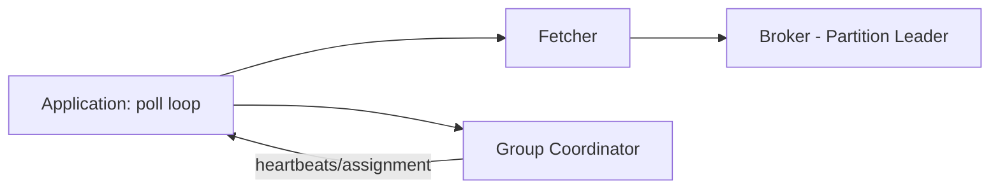

**Real-life scenario:** A Spring Boot service configures `concurrency=4` on its `@KafkaListener`, spinning up 4 internal consumer threads that each independently poll and process a subset of the topic's partitions in parallel within a single application instance.

**Interview Questions:**
- What two broker-facing responsibilities does a consumer client manage besides fetching data? — Group membership/heartbeats and coordinating with the group coordinator for partition assignment.
- Within a single `poll()` call, is ordering guaranteed across different partitions? — No, only within each individual partition; the returned batch interleaves partitions.
- How does Spring Kafka let you run multiple consumer threads per application instance? — Via the `concurrency` setting on `@KafkaListener`/listener container factory.

### Consumer Groups

(See also "Consumer Groups" under Core Kafka Concepts.) From an implementation standpoint, a consumer group's state — membership, partition assignment, committed offsets — is managed by a **group coordinator** broker, elected per group based on a hash of the `group.id`. Consumers periodically send heartbeats (`heartbeat.interval.ms`) to the coordinator to signal liveness; missing heartbeats beyond `session.timeout.ms` triggers removal from the group and a rebalance.

The relationship between partitions and consumer instances within a group is strictly 1-to-many-or-one: each partition is owned by exactly one consumer at a time, but a single consumer can own multiple partitions. This is the fundamental scaling knob — throughput scales by adding consumer instances up to the partition count, and beyond that by adding partitions (which requires planning, since partition count can't be decreased).

Choosing `group.id` carefully matters operationally: services that should share load use the same `group.id`; services that need their own independent copy of the stream use a distinct `group.id`.

```java
@KafkaListener(topics = "order-events", groupId = "inventory-service")
public void onOrder(OrderPlacedEvent event) { /* ... */ }
```

**Real-life scenario:** Both `inventory-service` and `analytics-service` consume the same `order-events` topic using different `group.id`s, so each gets its own full, independent copy of the stream at its own pace.

**Interview Questions:**
- What broker component manages a consumer group's membership and offsets? — The group coordinator.
- What two settings control how quickly a crashed consumer is detected and removed from the group? — `heartbeat.interval.ms` and `session.timeout.ms`.
- How do you scale processing throughput for a consumer group? — Add more consumer instances (up to the partition count), or increase partition count if already maxed out.

### Consumer Configuration

Key consumer configuration properties include `group.id` (group membership), `bootstrap.servers`, `key.deserializer`/`value.deserializer`, `auto.offset.reset` (`earliest`/`latest`/`none` — behavior when no committed offset exists), `enable.auto.commit` (auto vs manual offset commits), `max.poll.records` (batch size per poll), `max.poll.interval.ms` (max allowed time between polls before being considered dead), and `fetch.min.bytes`/`fetch.max.wait.ms` (fetch batching tuning).

In Spring Boot, these map to `spring.kafka.consumer.*` properties, and Spring Kafka additionally layers its own container-level settings (like `ackMode` for manual commit strategies, and `concurrency` for parallelism) on top of the raw Kafka client configuration.

A commonly misunderstood setting is `auto.offset.reset`: it only takes effect when there is **no previously committed offset** for that consumer group/partition (e.g., a brand-new group, or offsets expired) — it does *not* control behavior for a group with existing committed offsets, which always resumes from its last commit regardless of this setting.

```yaml
spring:
  kafka:
    consumer:
      group-id: billing-service
      auto-offset-reset: earliest
      enable-auto-commit: false
      max-poll-records: 500
      key-deserializer: org.apache.kafka.common.serialization.StringDeserializer
      value-deserializer: org.springframework.kafka.support.serializer.JsonDeserializer
    listener:
      ack-mode: MANUAL_IMMEDIATE
```

**Real-life scenario:** A new consumer group deployed for the first time uses `auto.offset.reset=earliest` to process the topic's entire retained history on its first run, then relies purely on its committed offsets for every subsequent restart.

**Interview Questions:**
- When does `auto.offset.reset` actually take effect? — Only when there's no existing committed offset for that consumer group/partition.
- What consumer setting bounds how many records are returned per `poll()` call? — `max.poll.records`.
- What happens if processing a poll batch exceeds `max.poll.interval.ms`? — The consumer is considered dead/stuck and is removed from the group, triggering a rebalance.

### Polling Model

Kafka consumers use a **pull-based polling model**: the application repeatedly calls `poll(Duration timeout)` in a loop, and the client returns whatever records are currently available (up to `max.poll.records`) for the partitions assigned to that consumer. This is a deliberate design choice versus a push-based model — it gives the consumer full control over its own pace and backpressure, rather than risking being overwhelmed by a broker pushing data faster than it can process.

Calling `poll()` serves double duty: it both retrieves records **and** signals liveness to the group coordinator (implicitly satisfying heartbeat/liveness requirements in older client versions, though modern clients use a separate background heartbeat thread to decouple liveness from slow processing between polls). Still, `max.poll.interval.ms` bounds how long you can go between `poll()` calls before being considered dead.

Spring Kafka's `@KafkaListener` abstracts this loop entirely — developers write a method that receives one record (or a batch, with `batch = true`) per invocation, while the framework manages the underlying poll loop, retry, and offset commit behavior.

```java
// Manual poll loop (what @KafkaListener does internally)
while (running) {
    ConsumerRecords<String, String> records = consumer.poll(Duration.ofMillis(500));
    for (ConsumerRecord<String, String> record : records) {
        process(record);
    }
    consumer.commitSync();
}
```

**Real-life scenario:** A consumer processing computationally expensive records deliberately keeps `max.poll.records` small so each poll's processing time comfortably stays under `max.poll.interval.ms`, avoiding accidental rebalances from perceived staleness.

**Interview Questions:**
- Is Kafka's consumption model push-based or pull-based, and why? — Pull-based, giving consumers control over pace and backpressure.
- What client-side setting bounds the allowed time between successive `poll()` calls? — `max.poll.interval.ms`.
- How does `@KafkaListener` relate to the raw `poll()` loop? — It wraps and manages the poll loop internally, invoking your method per record/batch.

### Offset Management

Offset management is the process of tracking, per consumer group and partition, the position up to which records have been processed, so that a restarted or rebalanced consumer knows where to resume. Kafka stores committed offsets durably in the internal `__consumer_offsets` topic (rather than requiring an external database), making offset tracking scale naturally with the rest of the cluster.

Offsets can be committed automatically (`enable.auto.commit=true`, periodically in the background) or manually (application code explicitly calls `commitSync()`/`commitAsync()`, or Spring Kafka's `Acknowledgment.acknowledge()` under `AckMode.MANUAL`/`MANUAL_IMMEDIATE`), with the choice directly affecting delivery semantics (at-most-once vs at-least-once).

Beyond simple commit/resume, offsets can be explicitly manipulated for operational purposes: seeking to a specific offset, a timestamp, or resetting to `earliest`/`latest` — invaluable for reprocessing after a bug fix or recovering from a bad deployment.

```bash
# Reset a consumer group's offsets to earliest (group must be inactive)
kafka-consumer-groups.sh --bootstrap-server localhost:9092 \
  --group billing-service --topic order-events \
  --reset-offsets --to-earliest --execute
```

**Real-life scenario:** After fixing a bug that mis-calculated invoices for two days, the billing team resets their consumer group's offsets to a timestamp just before the bug was deployed and lets the service reprocess and correct the affected invoices automatically.

**Interview Questions:**
- Where are committed consumer offsets stored? — In the internal `__consumer_offsets` topic.
- What are the two broad approaches to committing offsets? — Automatic (periodic background commit) and manual (explicit application-controlled commit).
- Name a practical operational reason to manually reset a consumer group's offsets. — Reprocessing data after fixing a processing bug, or recovering from a bad deployment.

### Offset Commit

Committing an offset tells Kafka "this consumer group has successfully processed up to (and including) this position" for a given partition. The timing of the commit relative to actual message processing is the single biggest factor determining a consumer's delivery guarantee: committing *before* processing risks losing unprocessed records on a crash (at-most-once); committing *after* successful processing risks reprocessing duplicates on a crash between processing and committing (at-least-once, the most common and recommended default); and true exactly-once requires transactional writes that atomically combine processing output with the offset commit.

Kafka supports both synchronous commits (`commitSync()` — blocks until the broker acknowledges, safer but slower) and asynchronous commits (`commitAsync()` — non-blocking, faster, but requires careful handling since a failed async commit isn't automatically retried in a way that guarantees ordering of commit results).

In Spring Kafka, the `AckMode` setting controls this behavior declaratively: `RECORD` (commit after each record), `BATCH` (commit after each poll batch, the default), `MANUAL`/`MANUAL_IMMEDIATE` (application explicitly calls `acknowledgment.acknowledge()`), removing the need to hand-write commit logic.

```java
@KafkaListener(topics = "order-events", groupId = "billing-service")
public void consume(ConsumerRecord<String, String> record, Acknowledgment ack) {
    process(record);
    ack.acknowledge(); // manual commit after successful processing
}
```

**Real-life scenario:** A billing consumer commits offsets only after successfully writing an invoice to its database, ensuring that if it crashes mid-processing, the record is reprocessed on restart rather than silently skipped (accepting at-least-once/duplicate-safe processing via idempotent writes).

**Interview Questions:**
- What delivery semantic results from committing offsets before processing completes? — At-most-once (risk of message loss on crash).
- What delivery semantic results from committing after successful processing? — At-least-once (risk of duplicate reprocessing on crash, the common safe default).
- What's the difference between `commitSync()` and `commitAsync()`? — `commitSync()` blocks until acknowledged (safer, slower); `commitAsync()` is non-blocking (faster, needs careful error handling).

### Auto Commit

Auto commit (`enable.auto.commit=true`, the client default) periodically commits the latest returned offsets in the background on a timer (`auto.commit.interval.ms`, default 5s), without the application needing to call any commit method explicitly. It's the simplest option to configure and works fine for workloads where occasional message loss or duplicate processing on crash is tolerable (e.g., non-critical metrics, best-effort notifications).

The core risk is that auto commit happens on a timer *independent of whether processing has actually finished* — if a consumer crashes between an auto-commit and finishing processing of records already "committed," those records are silently skipped on restart (effectively at-most-once in the worst case), which is often surprising and undesirable for business-critical data.

Auto commit is generally discouraged for anything where correctness matters, in favor of manual commit tied explicitly to successful processing completion.

```properties
enable.auto.commit=true
auto.commit.interval.ms=5000
```

**Advantages:** simplest to configure, lowest application complexity, fine for low-stakes/best-effort data.
**Disadvantages:** commit timing is decoupled from actual processing completion, risking silent data loss on crash; less control over delivery semantics.

**Interview Questions:**
- What is the default value of `enable.auto.commit`? — `true`.
- What's the main risk of auto commit for critical data? — Offsets can be committed before processing finishes, risking silent message loss on a crash.
- When is auto commit an acceptable choice? — For low-stakes, best-effort workloads where occasional loss/duplication is tolerable.

### Manual Commit

Manual commit (`enable.auto.commit=false`) gives the application explicit control over exactly when an offset is considered "done," typically by calling `commitSync()`/`commitAsync()` (raw client) or `Acknowledgment.acknowledge()` (Spring Kafka, under `AckMode.MANUAL`/`MANUAL_IMMEDIATE`) only after processing has genuinely completed successfully — e.g., after a database write succeeds, or after downstream calls succeed.

This is the recommended approach for any business-critical processing, because it lets you align the commit precisely with your actual unit of work and error-handling strategy (e.g., commit only after a successful transactional write, or after a retry/dead-letter-queue policy has handled a failure), achieving reliable at-least-once semantics (and, combined with Kafka transactions, exactly-once).

The trade-off is added application complexity: you must explicitly manage commit timing, handle commit failures, and decide on batch-vs-per-record commit granularity (per-record commits are safer but slower; batch commits are faster but reprocess a bigger batch on failure).

```java
@KafkaListener(topics = "order-events", groupId = "billing-service",
               containerFactory = "manualAckContainerFactory")
public void consume(ConsumerRecord<String, String> record, Acknowledgment ack) {
    try {
        billingService.process(record.value());
        ack.acknowledge();
    } catch (Exception e) {
        // send to DLQ, retry, or skip - deliberately don't ack on failure
    }
}
```

**Advantages:** precise control over delivery semantics, safer for critical data, integrates cleanly with retry/DLQ patterns.
**Disadvantages:** more code/complexity, easier to introduce bugs (e.g., forgetting to ack, or acking too early), typically slightly higher latency than auto commit for the same throughput.

**Differences vs Auto Commit:**
- Manual commit ties offset progress to actual processing success; auto commit ties it to a timer.
- Manual commit supports precise at-least-once/exactly-once patterns; auto commit cannot reliably guarantee either.
- Manual commit requires explicit error handling; auto commit "just works" but with weaker guarantees.

**Interview Questions:**
- Why is manual commit preferred for business-critical consumers? — It aligns offset commits precisely with actual successful processing, avoiding silent data loss.
- What Spring Kafka construct enables manual commit in a `@KafkaListener`? — The `Acknowledgment` parameter combined with `AckMode.MANUAL`/`MANUAL_IMMEDIATE`.
- What's a downside of committing after every single record versus after a batch? — Higher commit overhead/latency, though safer on a per-record basis (smaller reprocessing window on failure).

### Consumer Rebalancing

(See also "Partition Rebalancing" above, from the producer/partitioning-adjacent perspective.) From the consumer's own lifecycle viewpoint, rebalancing means a consumer instance can have partitions **revoked** (`ConsumerRebalanceListener.onPartitionsRevoked`) and later **assigned** (`onPartitionsAssigned`) as group membership changes; well-behaved consumers use these callbacks to commit offsets before losing a partition and to seek to appropriate positions after gaining one.

Spring Kafka exposes this via `ConsumerAwareRebalanceListener` on the listener container, letting applications hook custom logic (e.g., flushing local state, committing pending work) precisely at the moment partitions are revoked or (re)assigned, which is especially important for stateful consumers (e.g., ones maintaining an in-memory cache keyed by partition).

Choosing the **cooperative-sticky** assignor (`partition.assignment.strategy`) over the legacy eager assignors (range/round-robin) significantly reduces rebalance disruption in modern deployments, since it avoids revoking partitions that don't actually need to move.

```java
@Bean
public ConcurrentKafkaListenerContainerFactory<String, String> containerFactory(
        ConsumerFactory<String, String> consumerFactory) {
    ConcurrentKafkaListenerContainerFactory<String, String> factory =
            new ConcurrentKafkaListenerContainerFactory<>();
    factory.setConsumerFactory(consumerFactory);
    factory.getContainerProperties().setConsumerRebalanceListener(
        new ConsumerAwareRebalanceListener() {
            @Override
            public void onPartitionsRevokedBeforeCommit(Consumer<?, ?> consumer, Collection<TopicPartition> partitions) {
                // flush local state / commit pending offsets
            }
        });
    return factory;
}
```

**Real-life scenario:** A stateful fraud-detection consumer keeps an in-memory rolling window of transactions per partition; it uses `onPartitionsRevoked` to persist that in-memory state before losing ownership, preventing gaps in fraud detection during rebalances.

**Interview Questions:**
- What two callbacks does `ConsumerRebalanceListener` provide, and when do they fire? — `onPartitionsRevoked` (before losing partitions) and `onPartitionsAssigned` (after gaining partitions).
- Why might a stateful consumer care deeply about rebalance callbacks? — To persist/flush in-memory state tied to a partition before losing ownership of it.
- What modern assignment strategy minimizes rebalance disruption compared to eager assignors? — The cooperative-sticky assignor.

### Deserialization

Deserialization is the reverse of serialization on the consumer side, converting raw bytes back into typed Java objects using the configured `key.deserializer`/`value.deserializer` (e.g., `StringDeserializer`, Spring's `JsonDeserializer`, or Avro/Protobuf deserializers backed by a Schema Registry). Deserialization errors are one of the most common real-world consumer failure modes — a malformed or unexpectedly-shaped message can throw an exception that, if unhandled, can repeatedly crash the consumer (a "poison pill" record blocking the whole partition).

Modern Spring Kafka mitigates poison-pill scenarios with an `ErrorHandlingDeserializer` wrapper, which catches deserialization exceptions per-record and delegates them to the container's configured error handler (e.g., send to a Dead Letter Topic) instead of crashing the consumer thread — an essential production hardening pattern.

As with serialization, schema-based deserialization (Avro/Protobuf + Schema Registry) provides stronger safety by validating compatibility before a mismatched producer/consumer pair can even communicate, catching schema drift far earlier than plain JSON.

```java
config.put(ConsumerConfig.VALUE_DESERIALIZER_CLASS_CONFIG, ErrorHandlingDeserializer.class);
config.put(ErrorHandlingDeserializer.VALUE_DESERIALIZER_CLASS, JsonDeserializer.class.getName());
config.put(JsonDeserializer.TRUSTED_PACKAGES, "com.example.events");
```

**Real-life scenario:** A malformed record produced by a buggy upstream service used to repeatedly crash a downstream consumer on every restart until the team wrapped their deserializer with `ErrorHandlingDeserializer` and routed failures to a dead-letter topic for later inspection, keeping the main pipeline flowing.

**Interview Questions:**
- What is a "poison pill" record and why is it dangerous? — A malformed record that repeatedly fails deserialization/processing, potentially blocking or crash-looping a consumer indefinitely.
- How does `ErrorHandlingDeserializer` help in Spring Kafka? — It isolates deserialization failures per-record and routes them to the configured error handler instead of crashing the consumer.
- Why does schema-based deserialization (Avro/Protobuf) catch problems earlier than plain JSON? — Schema Registry enforces compatibility checks before incompatible producers/consumers can exchange data.

### Consumer Interceptors

A `ConsumerInterceptor` is the consumer-side counterpart to `ProducerInterceptor`, implementing hooks that run when records are returned from `poll()` (`onConsume`) and when offsets are committed (`onCommit`), allowing cross-cutting logic like metrics, logging, header inspection/mutation, or filtering — configured via `interceptor.classes` on the consumer, and chainable like producer interceptors.

Common practical uses include measuring end-to-end latency (comparing a `produced-at` header timestamp against consumption time), auditing which offsets were committed and when, and centralized tracing/correlation-id propagation into logging context (e.g., populating an MDC field for structured logs).

As with producer interceptors, consumer interceptor code runs synchronously in the poll/processing path, so it should remain lightweight and avoid throwing unhandled exceptions, since a misbehaving interceptor can disrupt the whole consumer's record processing.

```java
public class LatencyConsumerInterceptor implements ConsumerInterceptor<String, Object> {
    @Override
    public ConsumerRecords<String, Object> onConsume(ConsumerRecords<String, Object> records) {
        records.forEach(r -> {
            Header header = r.headers().lastHeader("produced-at");
            if (header != null) {
                // compute and record end-to-end latency metric
            }
        });
        return records;
    }
    @Override
    public void onCommit(Map<TopicPartition, OffsetAndMetadata> offsets) {}
    @Override public void close() {}
    @Override public void configure(Map<String, ?> configs) {}
}
```

```properties
interceptor.classes=com.example.LatencyConsumerInterceptor
```

**Real-life scenario:** An observability team adds a shared consumer interceptor across all services to automatically measure and export end-to-end (produce-to-consume) latency metrics, without requiring each team to instrument their own listener code.

**Interview Questions:**
- What two lifecycle hooks does a `ConsumerInterceptor` provide? — `onConsume()` (records returned from poll) and `onCommit()` (offsets committed).
- Give a practical use case for a consumer interceptor. — Measuring end-to-end latency using a producer-set timestamp header, or centralized audit logging of commits.
- What risk does putting heavy logic inside `onConsume` introduce? — It runs synchronously in the poll path and can slow down or destabilize record processing for the whole consumer.

## Message Delivery Semantics

### At Most Once

At most once means every message is delivered **zero or one time** — it is never redelivered, even if that means it gets lost. This happens when a consumer commits its offset (or a producer stops retrying) *before* the message is fully processed. If the consumer crashes after committing but before finishing the business logic, the message is gone forever from that consumer's perspective.

This is the weakest and cheapest delivery guarantee. It trades correctness for throughput and simplicity — there's no need to track processing state, deduplicate, or retry. It's typically the default behavior when a producer uses `acks=0` (fire-and-forget) or when a consumer uses auto-commit with the commit happening on a timer rather than after processing.

In interviews, this is usually explained as the baseline against which "at least once" and "exactly once" are compared — most systems actively avoid this unless data loss is tolerable.

**Producer side (fire-and-forget):**
```properties
acks=0
retries=0
```

**Consumer side (commit before processing — classic at-most-once bug pattern):**
```java
@KafkaListener(topics = "orders", groupId = "at-most-once-group")
public void listen(ConsumerRecord<String, String> record, Acknowledgment ack) {
    ack.acknowledge(); // offset committed FIRST
    processOrder(record.value()); // if this throws, message is lost
}
```

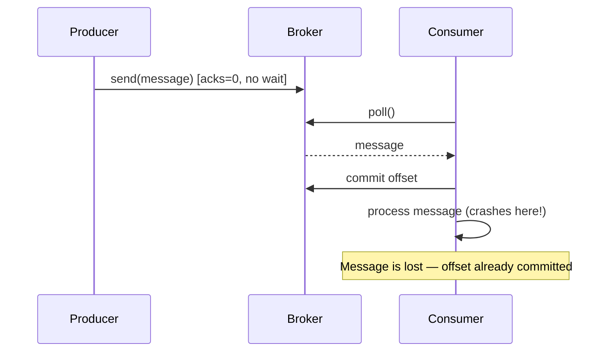

**Real-life scenario:** A metrics/telemetry pipeline collecting non-critical UI click events — losing a handful of clicks during a consumer restart is acceptable, and avoiding duplicate counting is more valuable than perfect delivery.

**Advantages**
- Highest throughput, lowest latency — no waiting for acknowledgments or retries.
- Simplest consumer logic — no dedup/idempotency handling needed.

**Disadvantages**
- Silent data loss is possible and hard to detect.
- Not acceptable for financial, audit, or order-processing systems.

**Differences vs At Least Once / Exactly Once**
- At Most Once: 0 or 1 delivery (may lose data).
- At Least Once: 1+ deliveries (may duplicate data).
- Exactly Once: exactly 1 logical delivery (no loss, no duplication).

**Interview Questions**
- What producer/consumer configuration results in at-most-once semantics?
- Why would a system intentionally choose at-most-once over at-least-once?
- How does committing offsets before vs after processing change the delivery guarantee?

### At Least Once

At least once guarantees a message will **never be lost**, but it may be **delivered more than once**. This is achieved by committing the consumer offset (or retrying the producer send) only *after* the message has been successfully processed. If a failure happens after processing but before the commit, the same message is redelivered on restart/rebalance.

This is the most common delivery semantic used in production Kafka systems because it's a reasonable middle ground: no data loss, at the cost of the consumer needing to handle duplicates (idempotent processing). Producers achieve their side of "at least once" using `acks=all` combined with `retries > 0`, which can cause duplicate writes if a broker acknowledges but the ack is lost in transit, forcing a producer retry.

Because duplicates are possible, most real systems built on at-least-once semantics pair it with idempotent business logic (e.g., upserts keyed by a unique message ID) rather than trying to eliminate duplicates entirely at the messaging layer.

**Producer side:**
```properties
acks=all
retries=2147483647
enable.idempotence=false
max.in.flight.requests.per.connection=5
```

**Consumer side (manual ack after processing):**
```java
@KafkaListener(topics = "orders", groupId = "at-least-once-group",
        containerFactory = "manualAckContainerFactory")
public void listen(ConsumerRecord<String, String> record, Acknowledgment ack) {
    processOrder(record.value()); // done first
    ack.acknowledge();            // commit only after success
}
```

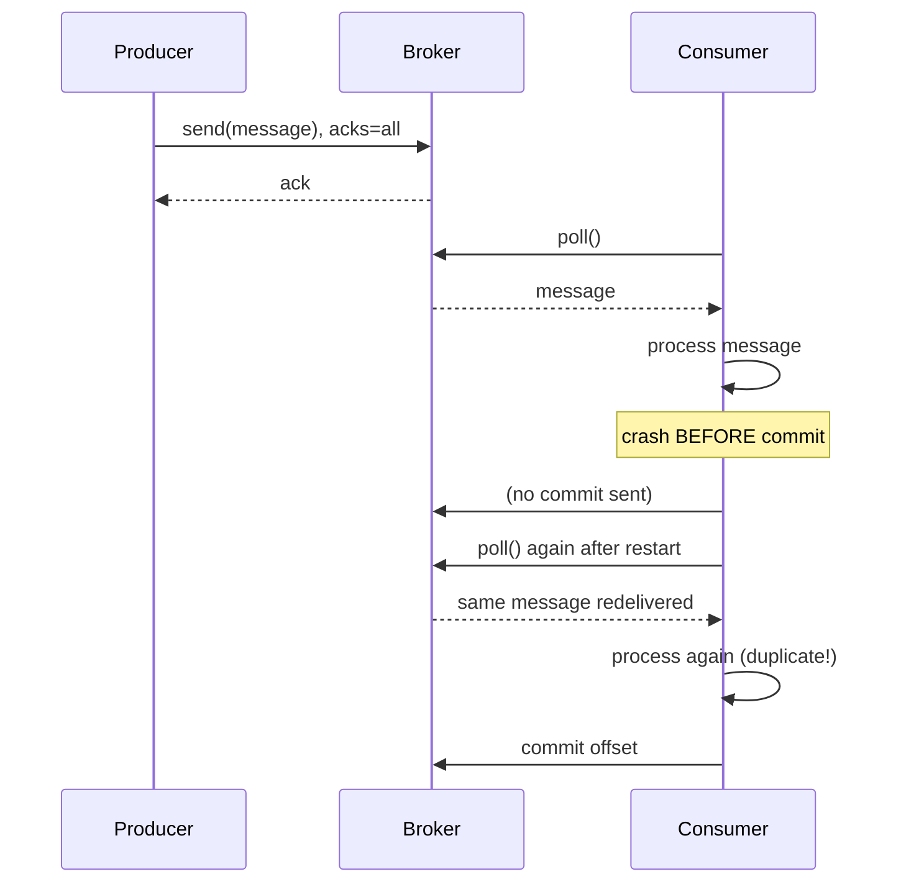

**Real-life scenario:** An order-processing service that writes to a database using the order ID as a unique key (`INSERT ... ON CONFLICT DO NOTHING` / upsert) — redelivery just re-runs a no-op write, so duplicates are harmless.

**Advantages**
- No data loss under normal failure scenarios.
- Simple to reason about compared to full exactly-once machinery.

**Disadvantages**
- Consumers must be idempotent or tolerate duplicates.
- Can cause double side-effects (e.g., double email sends) if not guarded.

**Differences vs At Most Once / Exactly Once**
- Safer than at-most-once (no silent loss) but less strict than exactly-once (duplicates possible).
- Requires application-level idempotency to behave like exactly-once in practice.

**Interview Questions**
- How do you make an at-least-once consumer effectively idempotent?
- What role does `acks=all` play in at-least-once producer guarantees?
- Give an example of a bug that causes duplicate processing in an at-least-once system.

### Exactly Once

Exactly once semantics (EOS) guarantee that each message is processed **once and only once**, with no loss and no duplication, even across producer retries, consumer rebalances, and broker failures. Kafka achieves this through a combination of **idempotent producers** (preventing duplicate writes on retry) and **transactions** (atomically committing both the produced records and the consumer offsets as a single unit — the classic "consume-transform-produce" pattern).

It's important to clarify in interviews that Kafka's exactly-once guarantee applies **within Kafka** — from a source topic, through processing, to a destination topic (or via Kafka Streams). If the consumer's side effect is an external system (e.g., calling a REST API or writing to a non-transactional database), Kafka cannot make that external call exactly-once; you still need idempotency or transactional outbox patterns at that boundary.

EOS is enabled by setting `enable.idempotence=true` on the producer (default in newer Kafka versions) and wrapping produce + offset-commit calls in a transaction using `transactional.id`. On the consumer side, `isolation.level=read_committed` ensures only committed transactional messages are visible.

```java
@Bean
public ProducerFactory<String, String> producerFactory() {
    Map<String, Object> props = new HashMap<>();
    props.put(ProducerConfig.ACKS_CONFIG, "all");
    props.put(ProducerConfig.ENABLE_IDEMPOTENCE_CONFIG, true);
    props.put(ProducerConfig.TRANSACTIONAL_ID_CONFIG, "order-tx-");
    return new DefaultKafkaProducerFactory<>(props);
}

@Transactional("kafkaTransactionManager")
public void processAndForward(ConsumerRecord<String, String> record) {
    String transformed = transform(record.value());
    kafkaTemplate.send("orders-out", transformed); // atomic with offset commit
}
```

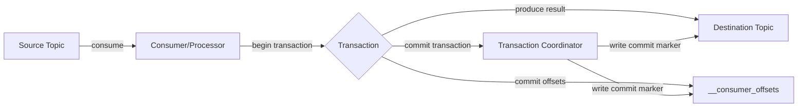

**Real-life scenario:** A banking ledger service that debits one account and credits another via Kafka Streams — losing or duplicating a single event would corrupt balances, so EOS is mandatory.

**Advantages**
- No duplicates, no data loss — strongest guarantee Kafka offers.
- Enables safe stream processing pipelines (aggregations, joins) that would otherwise double-count.

**Disadvantages**
- Higher latency and lower throughput due to transaction overhead.
- Only end-to-end exactly-once when the entire pipeline stays within Kafka (or uses transactional sinks).
- More complex configuration and failure-mode reasoning.

**Differences vs At Most Once / At Least Once**
- Strongest guarantee; built on top of idempotent producers + transactions.
- At-least-once is a prerequisite mechanism EOS refines by eliminating duplicates via transactional atomicity.

**Interview Questions**
- How does Kafka implement exactly-once without a distributed two-phase commit across arbitrary systems?
- What is the relationship between idempotent producers and transactions in achieving EOS?
- Why can't Kafka guarantee exactly-once delivery to an external, non-transactional system by itself?
- What does `isolation.level=read_committed` do for EOS consumers?

### Idempotency

Producer idempotency ensures that **retrying the same send does not result in duplicate messages** on the broker. Kafka implements this by assigning each producer a unique `PID` (producer ID) and tagging every message with a monotonically increasing sequence number per partition. The broker tracks the last committed `(PID, sequence)` pair per partition and silently drops/deduplicates any retry that matches a sequence it has already accepted.

This solves a very specific problem: without idempotency, if a producer sends a message, the broker writes it and sends an ack, but the ack is lost (network blip), the producer will retry and the broker will accept a **second, duplicate** write — even though the original succeeded. Idempotency closes this gap by making retries safe at the broker level, which is a prerequisite building block for full exactly-once transactions.

Enabling it is a single config flag, and since Kafka 3.0 it's the default for producers when other settings allow it (`acks=all`, bounded in-flight requests).

```properties
enable.idempotence=true
acks=all
max.in.flight.requests.per.connection=5
retries=2147483647
```

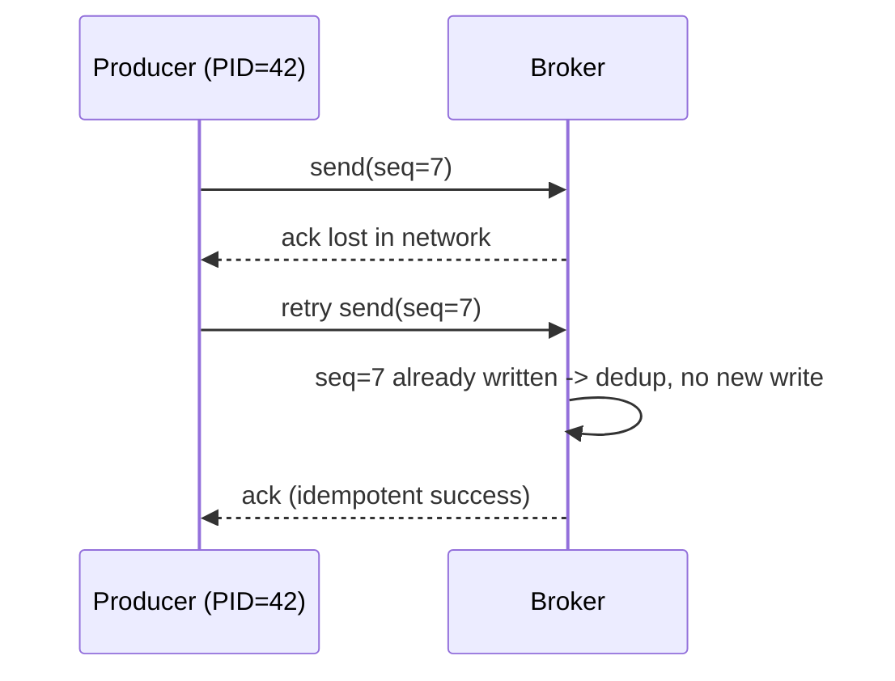

**Real-life scenario:** A payment event producer whose network occasionally times out on acks — idempotency guarantees a retried send never creates a second charge event on the topic.

**Advantages**
- Eliminates duplicate writes caused purely by producer retries, with negligible overhead.
- Foundation for transactional/exactly-once semantics.

**Disadvantages**
- Only protects against producer-retry duplication, not application-level duplicate sends (e.g., calling `send()` twice manually) or consumer-side reprocessing.
- Requires `max.in.flight.requests.per.connection <= 5` (Kafka enforces ordering guarantees for idempotence).

**Interview Questions**
- How does Kafka detect and drop duplicate messages at the producer level?
- What is a `PID` and how is it used with sequence numbers?
- Does enabling `enable.idempotence=true` alone give you exactly-once semantics? Why not?

### Transactions

Kafka transactions let a producer write to **multiple partitions/topics atomically**, and — critically for stream processing — atomically commit produced records together with consumed offsets. All the writes within a transaction become visible to `read_committed` consumers together, or not at all if the transaction aborts.

A transactional producer is configured with a stable `transactional.id`, which Kafka uses to fence off older/zombie producer instances (e.g., after a rebalance or restart) so they cannot continue writing under the same identity — this is called **producer fencing**, using an incrementing epoch tied to the `transactional.id`.

The full API sequence is: `initTransactions()` → `beginTransaction()` → `send(...)` (and optionally `sendOffsetsToTransaction(...)`) → `commitTransaction()` or `abortTransaction()`. Spring Kafka wraps this with `@Transactional` and `KafkaTransactionManager` so application code rarely calls the raw API directly.

```java
try {
    producer.initTransactions();
    producer.beginTransaction();
    producer.send(new ProducerRecord<>("orders-out", key, value));
    producer.sendOffsetsToTransaction(offsets, consumerGroupMetadata);
    producer.commitTransaction();
} catch (ProducerFencedException | OutOfOrderSequenceException e) {
    producer.close(); // fatal, must recreate producer
} catch (KafkaException e) {
    producer.abortTransaction();
}
```

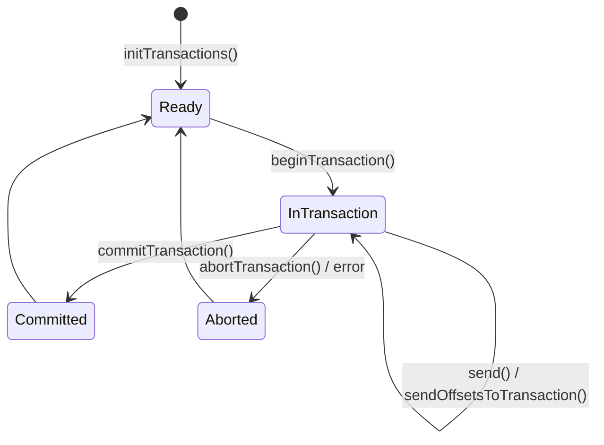

**Real-life scenario:** A Kafka Streams application reading `payments` and writing to both `payments-audit` and `payments-summary` topics needs both writes plus the input offset commit to succeed or fail together, or the audit and summary topics could drift out of sync.

**Advantages**
- Atomic multi-partition writes and atomic offset commits.
- Enables true exactly-once stream processing topologies.

**Disadvantages**
- Adds coordination overhead (transaction coordinator round-trips) and latency.
- Consumers must opt in with `isolation.level=read_committed` to benefit; default `read_uncommitted` sees uncommitted/aborted data.

**Interview Questions**
- Walk through the Kafka producer transaction API call sequence.
- What is producer fencing and why is `transactional.id` important for it?
- What happens to an in-progress transaction if the producer crashes mid-way?

### Duplicate Messages

Duplicate messages are an inherent risk in any at-least-once (or misconfigured at-most-once) system. Duplicates can originate from: producer retries without idempotence, consumer reprocessing after a crash/rebalance before committing offsets, or manual redelivery/replay for recovery purposes. Handling them correctly is one of the most commonly tested practical Kafka skills in interviews because it shifts responsibility from "does Kafka guarantee it" to "how do I design my consumer."

The standard solution is **idempotent consumption**: design the downstream effect so that applying the same message twice produces the same result as applying it once. Common techniques include storing a processed-message ID (dedup table with a unique constraint), using upserts keyed by business ID, or leveraging natural idempotency of the operation (e.g., "set balance to X" instead of "add X to balance").

```java
@KafkaListener(topics = "orders")
public void listen(ConsumerRecord<String, String> record) {
    String messageId = new String(record.headers().lastHeader("messageId").value());
    if (processedMessageRepository.existsById(messageId)) {
        return; // already handled — skip duplicate
    }
    processOrder(record.value());
    processedMessageRepository.save(new ProcessedMessage(messageId));
}
```

**Real-life scenario:** A notification service that resends an SMS every time it reprocesses a message after a rebalance — deduplicating on a message ID prevents the customer from receiving the same alert five times.

**Advantages of handling duplicates at the application layer**
- Works regardless of which Kafka delivery semantic is used underneath.
- Decouples correctness from infrastructure configuration.

**Disadvantages**
- Requires extra storage (dedup table/cache) and adds a lookup on the hot path.
- Dedup window/TTL must be chosen carefully — too short and old duplicates slip through, too long and storage grows.

**Interview Questions**
- What causes duplicate messages even when a producer uses `acks=all`?
- How would you design a consumer to be idempotent without relying on Kafka transactions?
- What's the tradeoff of using a database unique constraint vs. an in-memory cache for deduplication?

## Serialization

### String Serialization

String serialization is the simplest Kafka serialization strategy: keys and/or values are plain UTF-8 (or other charset) strings, handled by Kafka's built-in `StringSerializer`/`StringDeserializer`. It requires no schema, no external registry, and no extra dependencies — messages are just human-readable text (often JSON-as-a-string, CSV, or delimited formats).

It's commonly used for simple use cases, prototyping, log-style events, or when the payload is genuinely textual (e.g., a raw log line). Because there's no structure enforcement, it offers zero compile-time or run-time safety about the message shape — that responsibility falls entirely on the application.

```properties
key.serializer=org.apache.kafka.common.serialization.StringSerializer
value.serializer=org.apache.kafka.common.serialization.StringSerializer
key.deserializer=org.apache.kafka.common.serialization.StringDeserializer
value.deserializer=org.apache.kafka.common.serialization.StringDeserializer
```

```java
@Bean
public KafkaTemplate<String, String> kafkaTemplate(ProducerFactory<String, String> pf) {
    return new KafkaTemplate<>(pf);
}

kafkaTemplate.send("logs", "user-123", "LOGIN_SUCCESS");
```

**Real-life scenario:** Shipping raw application log lines or simple status codes between services where a full schema would be overkill.

**Advantages**
- Zero setup, human-readable, easy to debug with CLI tools (`kafka-console-consumer`).
- No schema registry dependency.

**Disadvantages**
- No schema enforcement — easy to introduce inconsistent formats across producers.
- Larger payload size than binary formats like Avro/Protobuf; no built-in compatibility checking.

**Interview Questions**
- When is plain string serialization an acceptable choice in production?
- What are the risks of using strings for structured data (e.g., JSON-as-string) without a schema?

### JSON Serialization

JSON serialization converts Java objects to/from JSON text, typically via Jackson (`JsonSerializer`/`JsonDeserializer` in Spring Kafka). It's human-readable and framework-friendly — POJOs annotate naturally, and most services already have Jackson on the classpath — making it a popular default for internal microservice communication.

Spring Kafka's `JsonSerializer` also embeds type information in message headers (`__TypeId__`) by default, allowing the deserializer to reconstruct the correct Java class automatically, which is convenient but couples the payload to a specific Java class name unless `addTypeInfo` is disabled and a type mapping is configured explicitly.

```java
@Bean
public ProducerFactory<String, Order> producerFactory() {
    Map<String, Object> props = new HashMap<>();
    props.put(ProducerConfig.KEY_SERIALIZER_CLASS_CONFIG, StringSerializer.class);
    props.put(ProducerConfig.VALUE_SERIALIZER_CLASS_CONFIG, JsonSerializer.class);
    return new DefaultKafkaProducerFactory<>(props);
}

@KafkaListener(topics = "orders")
public void listen(Order order) { // auto-deserialized via JsonDeserializer
    process(order);
}
```

**Real-life scenario:** A set of internal Spring Boot microservices exchanging `OrderCreatedEvent` payloads where developer velocity and readability matter more than wire size.

**Advantages**
- Human-readable, easy to debug, wide tooling/library support, no registry required (though can be paired with one).
- Flexible — tolerant of missing/extra fields by default (loosely typed).

**Disadvantages**
- No enforced schema/compatibility checks out of the box — breaking changes fail silently at runtime.
- Larger payloads and slower (de)serialization than binary formats like Avro/Protobuf.

**Differences vs Avro/Protobuf**
- JSON: human-readable, no schema enforcement by default, larger size.
- Avro/Protobuf: binary, compact, schema-enforced (especially with Schema Registry), faster.

**Interview Questions**
- How does Spring Kafka's `JsonDeserializer` know which Java class to deserialize into?
- What are the risks of using JSON serialization without any schema governance in a large microservices system?
- How would you evolve a JSON message format safely across producer/consumer versions?

### Avro Serialization

Apache Avro is a compact, binary serialization format built around an explicit schema (`.avsc`, JSON-defined) that is normally managed centrally via a **Schema Registry**. Instead of embedding field names in every message (like JSON does), Avro stores only the data, referencing the schema (via a schema ID) needed to interpret it — resulting in significantly smaller payloads and faster serialization.

Avro is the most common serialization choice in mature Kafka ecosystems (especially Confluent-based) because of its first-class schema evolution support: it defines strict rules for **backward, forward, and full compatibility** checked automatically by the registry at publish time, catching breaking changes before they reach production.

```json
{
  "type": "record",
  "name": "Order",
  "fields": [
    { "name": "orderId", "type": "string" },
    { "name": "amount", "type": "double" },
    { "name": "status", "type": "string", "default": "PENDING" }
  ]
}
```

```java
@Bean
public ProducerFactory<String, Order> avroProducerFactory() {
    Map<String, Object> props = new HashMap<>();
    props.put(ProducerConfig.VALUE_SERIALIZER_CLASS_CONFIG, KafkaAvroSerializer.class);
    props.put("schema.registry.url", "http://localhost:8081");
    return new DefaultKafkaProducerFactory<>(props);
}
```

**Real-life scenario:** A high-throughput e-commerce event pipeline (millions of events/day) where wire size and deserialization speed materially affect infrastructure cost — Avro's compact binary encoding reduces both network and storage footprint versus JSON.

**Advantages**
- Compact binary format, fast (de)serialization.
- Strong schema evolution rules enforced via Schema Registry; generates typed classes.

**Disadvantages**
- Not human-readable — requires tooling (schema registry, Avro tools) to inspect messages.
- Adds an operational dependency (Schema Registry) and build-time code generation step.

**Differences vs Protobuf/JSON**
- Avro: schema stored separately (registry/ID reference), great for Kafka + Confluent ecosystem, dynamic typing supported.
- Protobuf: schema compiled into strongly-typed generated code, `.proto` IDL, popular for gRPC + Kafka combined systems.
- JSON: no compact binary form, no built-in schema evolution enforcement.

**Interview Questions**
- How does Avro achieve smaller payloads compared to JSON?
- What role does the Schema Registry play when using Avro with Kafka?
- How does Avro handle a consumer reading data written with an older schema version?

### Protobuf Serialization

Protocol Buffers (Protobuf) is Google's binary serialization format defined via `.proto` IDL files, compiled into strongly-typed classes for multiple languages. Like Avro, it's compact and fast, but unlike Avro, the schema is typically compiled directly into the application (though Confluent's Schema Registry also supports Protobuf schemas with compatibility checking, similar to Avro).

Protobuf is a strong choice for organizations that already use it for gRPC service contracts, since the same `.proto` definitions can be reused for both synchronous (gRPC) and asynchronous (Kafka) communication, giving a single source of truth for data contracts across the whole system.

```protobuf
syntax = "proto3";
message Order {
  string order_id = 1;
  double amount = 2;
  string status = 3;
}
```

```java
Map<String, Object> props = new HashMap<>();
props.put(ProducerConfig.VALUE_SERIALIZER_CLASS_CONFIG, KafkaProtobufSerializer.class);
props.put("schema.registry.url", "http://localhost:8081");
```

**Real-life scenario:** A polyglot microservices platform (Java, Go, Python) already using Protobuf/gRPC for synchronous APIs extends the same schemas to Kafka events for consistency and code-gen reuse.

**Advantages**
- Compact, fast, strongly typed generated code across many languages.
- Field numbering enables safe evolution (add optional fields without breaking old consumers).

**Disadvantages**
- Not human-readable without tooling; requires a compile step for `.proto` files.
- Slightly more rigid field semantics (e.g., default value ambiguity in proto3) than Avro.

**Differences vs Avro/JSON**
- Protobuf: compiled `.proto` contracts, great gRPC synergy, field-number-based evolution.
- Avro: registry-centric schema resolution, more dynamic/schema-on-read friendly.
- JSON: no compactness or built-in evolution guarantees.

**Interview Questions**
- How does Protobuf's field-numbering scheme support backward/forward compatibility?
- When would you choose Protobuf over Avro in a Kafka-based system?
- How can Protobuf schemas be shared between gRPC APIs and Kafka event contracts?

### Custom Serialization

Custom serialization means implementing Kafka's `Serializer<T>` and `Deserializer<T>` interfaces yourself, rather than using a built-in or Confluent-provided implementation. This is useful when you need a proprietary binary format, need to integrate legacy encoding schemes, want fine-grained control over performance, or need to add custom framing (e.g., encryption, compression, versioning headers) around the payload.

The interfaces are intentionally minimal — `serialize(String topic, T data)` returns a `byte[]`, and `deserialize(String topic, byte[] data)` returns `T` — which makes it straightforward to wrap an existing library (e.g., Kryo, custom binary protocol) or add cross-cutting behavior like encryption before delegating to a real serializer.

```java
public class EncryptingSerializer implements Serializer<Order> {
    private final ObjectMapper mapper = new ObjectMapper();

    @Override
    public byte[] serialize(String topic, Order data) {
        try {
            byte[] json = mapper.writeValueAsBytes(data);
            return EncryptionUtil.encrypt(json); // custom framing/logic
        } catch (Exception e) {
            throw new SerializationException("Failed to serialize Order", e);
        }
    }
}
```

```properties
value.serializer=com.example.kafka.EncryptingSerializer
value.deserializer=com.example.kafka.DecryptingDeserializer
```

**Real-life scenario:** A regulated financial system that must encrypt PII fields at rest on the topic, requiring a custom serializer that encrypts before delegating to standard JSON/Avro encoding.

**Advantages**
- Full control over wire format, compression, encryption, or legacy protocol support.
- Can optimize for a very specific performance or size requirement.

**Disadvantages**
- You own all correctness, versioning, and compatibility concerns — no registry safety net unless you build one.
- More maintenance burden and onboarding complexity for new developers.

**Interview Questions**
- What two interfaces must you implement to create a custom Kafka serializer?
- When would a custom serializer be preferred over Avro/Protobuf/JSON?
- How would you add encryption to messages without changing every producer's business logic?

### Schema Evolution

Schema evolution is the practice of changing a message schema over time (adding fields, removing fields, renaming, changing types) while keeping producers and consumers on different schema versions interoperable. It's a core operational concern in any long-lived event-driven system, since producers and consumers deploy independently and are rarely upgraded in perfect lockstep.

The safest evolution changes are: adding an **optional field with a default value**, or removing a field that already had a default. Renaming fields, changing a field's type, or removing a required field without a default are generally unsafe and will break compatibility unless carefully staged (e.g., add-new-field → dual-write → migrate consumers → remove-old-field).

Schema Registry-backed formats (Avro/Protobuf) can enforce compatibility rules automatically on schema registration, rejecting a new schema version if it violates the configured compatibility mode (`BACKWARD`, `FORWARD`, `FULL`).

```json
// v1
{ "name": "Order", "fields": [ {"name": "orderId", "type": "string"} ] }

// v2 - safe evolution: added optional field with default
{ "name": "Order", "fields": [
  {"name": "orderId", "type": "string"},
  {"name": "currency", "type": "string", "default": "USD"}
]}
```

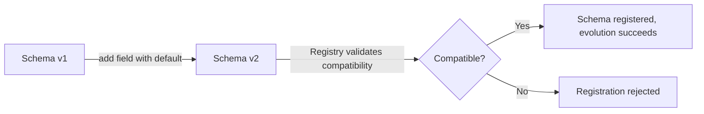

**Real-life scenario:** Adding a `currency` field to an `Order` event so new consumers can support multi-currency orders, while old consumers (unaware of the field) keep working unaffected.

**Advantages**
- Enables independent, incremental deployment of producers/consumers.
- Prevents "big bang" migrations across an entire event-driven architecture.

**Disadvantages**
- Requires discipline (avoiding breaking changes) and tooling (registry, compatibility checks) to do safely.
- Long-lived "deprecated but still present" fields can accumulate technical debt.

**Interview Questions**
- What kinds of schema changes are generally safe vs. unsafe for compatibility?
- How does adding a default value affect whether a new field is a breaking change?
- Describe a safe multi-step process for removing a field from a widely-used event schema.

## Schema Management

### Schema Registry

The Schema Registry is a centralized service (most commonly Confluent Schema Registry) that stores and versions schemas (Avro, Protobuf, or JSON Schema) for Kafka topics, and enforces compatibility rules whenever a new schema version is registered. Producers and consumers reference schemas by an ID embedded in each message rather than sending the full schema every time, keeping payloads small.

It acts as the contract authority between independently-deployed producers and consumers: instead of every team informally agreeing on a message format (and drifting over time), the registry provides a queryable, enforced source of truth, typically organized under a "subject" naming strategy (e.g., `orders-value` for the value schema of the `orders` topic).

```properties
schema.registry.url=http://localhost:8081
```

```bash
# Register a new schema for the "orders-value" subject
curl -X POST -H "Content-Type: application/vnd.schemaregistry.v1+json" \
  --data '{"schema": "{\"type\":\"record\",\"name\":\"Order\",\"fields\":[...]}"}' \
  http://localhost:8081/subjects/orders-value/versions
```

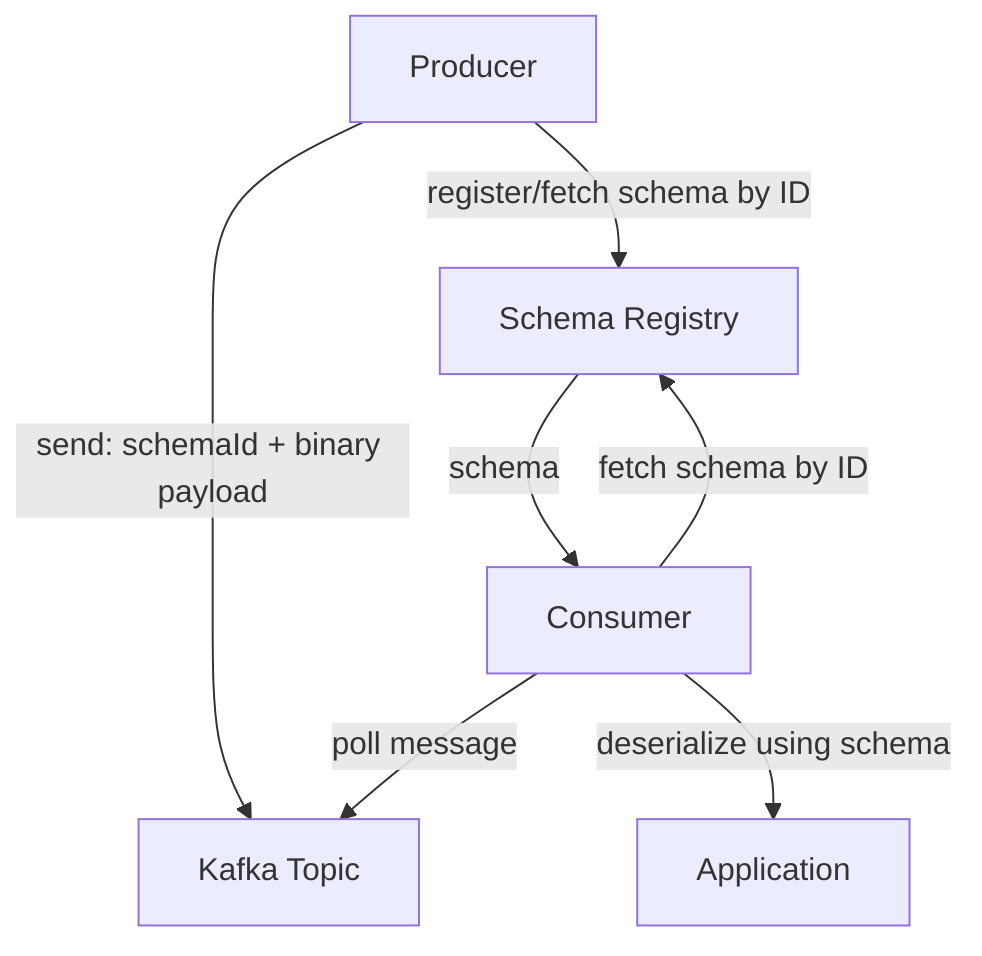

**Real-life scenario:** Dozens of microservices producing/consuming `orders`, `payments`, and `shipments` events all rely on the registry to guarantee that a schema change by the `orders` team can't silently break the `shipments` team's consumers.

**Advantages**
- Central governance, compatibility enforcement, smaller message payloads (schema-by-reference).
- Enables schema discovery/documentation across teams.

**Disadvantages**
- Adds an operational dependency — an outage or misconfiguration can block all producers/consumers.
- Requires careful subject/compatibility strategy management as the system grows.

**Interview Questions**
- What problem does the Schema Registry solve that plain Avro/Protobuf alone does not?
- How are messages linked to their schema without re-sending the schema every time?
- What happens if the Schema Registry is temporarily unavailable when a producer tries to send a message?

### Schema Compatibility

Schema compatibility refers to the rules governing whether a new schema version can safely coexist with old producers/consumers still using a previous version. The Schema Registry supports several compatibility modes — `BACKWARD`, `FORWARD`, `FULL` (and their transitive variants, `BACKWARD_TRANSITIVE`, etc.) — each defining a different contract about who can read whose data.

Choosing the right mode is a deliberate architectural decision based on deployment order: if consumers are always upgraded before producers, forward compatibility matters most; if producers are upgraded first (the more common case), backward compatibility is what protects existing consumers.

```bash
# Set compatibility mode for a subject
curl -X PUT -H "Content-Type: application/vnd.schemaregistry.v1+json" \
  --data '{"compatibility": "BACKWARD"}' \
  http://localhost:8081/config/orders-value
```

**Real-life scenario:** A platform team mandates `BACKWARD` compatibility as the org-wide default so that any team can deploy a new producer schema without needing to coordinate simultaneous consumer deployments.

**Advantages**
- Prevents breaking changes from being deployed accidentally; codifies deployment ordering assumptions.
- Reduces cross-team coordination overhead for routine, additive schema changes.

**Disadvantages**
- Choosing the wrong mode for your deployment pattern can either be too restrictive (blocking valid changes) or too permissive (allowing breakage).

**Differences vs Forward/Backward/Full (see next entries)**
- Compatibility is the umbrella concept; Forward/Backward/Full are the specific enforced directions.

**Interview Questions**
- What is the difference between schema compatibility and schema validation?
- Why would an organization choose `BACKWARD` as its default compatibility mode?
- What is the transitive variant of a compatibility mode, and why does it matter?

### Forward Compatibility

Forward compatibility means data written with a **new** schema can be read by consumers using the **old** schema. This matters when consumers are upgraded slower than producers, or when you can't control consumer upgrade timing at all (e.g., third-party consumers). In practice, this is achieved by only removing fields (never adding required fields without defaults) — old consumers simply ignore fields they don't recognize, and any field the old schema still expects must still be present with a default in the new writer schema... conceptually, "new writer, old reader."

The typical safe change under forward compatibility is **removing a field** (old readers just won't look for it) or adding a field with a default so that if an old reader schema still references it, a value is available.


**Real-life scenario:** A logging pipeline where the central log-aggregation consumer is upgraded far less frequently than the dozens of producing services — producers must be free to evolve without breaking the slow-moving aggregator.

**Advantages**
- Producers can evolve independently ahead of consumers.
- Useful when many heterogeneous/external consumers can't be upgraded on demand.

**Disadvantages**
- Restricts producer changes to safe subtractive/default-having changes only.
- Less commonly the default choice than backward compatibility in most orgs (producers are usually deployed first).

**Differences vs Backward Compatibility**
- Forward: new schema data readable by old schema readers ("upgrade producers first is safe").
- Backward: new schema readers can read old schema data ("upgrade consumers first is safe").

**Interview Questions**
- Give an example schema change that is forward-compatible but not backward-compatible.
- In what deployment order scenario is forward compatibility the more important guarantee?

### Backward Compatibility

Backward compatibility means a **new** schema can read data written with an **old** schema — i.e., "new reader, old writer." This is the most commonly used default in real-world Kafka systems because the typical deployment pattern upgrades consumers to handle new fields *before* (or independent of) producers actually start sending them, and because it directly supports the common pattern of adding new optional fields with defaults that old data simply won't contain.

The safe changes here are **adding a field with a default value** (old data missing the field just uses the default) and **removing a field that had a default** in the old schema. Removing a field without a default, or adding a required field without one, breaks backward compatibility because the new reader would have no way to populate that field from old data.

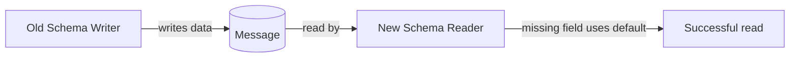

**Real-life scenario:** Adding a `discountCode` field with a default of `null`/empty to the `Order` schema — new consumer code can safely read old order events produced before the field existed.

**Advantages**
- Matches the most common real deployment order (deploy new consumer code, then gradually roll out new producer fields).
- Enables safe additive schema growth over time.

**Disadvantages**
- Requires every new field to have a sensible default value.
- Doesn't protect old consumers from new data (that's forward compatibility's job).

**Differences vs Forward Compatibility**
- Backward: safe to upgrade consumers first.
- Forward: safe to upgrade producers first.

**Interview Questions**
- Why is adding a field with a default value backward-compatible but adding one without a default is not?
- Which is more common in practice — backward or forward compatibility — and why?

### Full Compatibility

Full compatibility requires a schema change to be **both backward and forward compatible simultaneously** — old and new producers and consumers can all safely interoperate in any deployment order. This is the strictest and safest compatibility mode, but also the most restrictive: it only permits changes where every added/removed field has a default value on both sides, ruling out many otherwise-reasonable schema changes.

Because full compatibility eliminates deployment-order coordination entirely (you don't need to know or control whether producers or consumers upgrade first), it's often the right choice for shared, high-fanout topics with many independent consumer teams where coordinating upgrade order is impractical.

```bash
curl -X PUT -H "Content-Type: application/vnd.schemaregistry.v1+json" \
  --data '{"compatibility": "FULL"}' \
  http://localhost:8081/config/orders-value
```

**Real-life scenario:** A widely shared `customer-events` topic consumed by 15+ teams across the company — `FULL` compatibility avoids any single team needing to coordinate a synchronized upgrade with all consumers.

**Advantages**
- Maximum safety — no deployment-order assumptions required.
- Best for broadly shared/high-fanout topics with many independent consumer teams.

**Disadvantages**
- Most restrictive — only additive/subtractive changes with defaults on both sides are allowed; renames and type changes are effectively impossible without a new subject/topic.

**Differences vs Backward/Forward**
- Full = Backward AND Forward simultaneously enforced; strictly the intersection of allowed changes from both modes.

**Interview Questions**
- What is the tradeoff of choosing `FULL` compatibility over `BACKWARD` alone?
- Why might a widely-shared topic prefer `FULL` compatibility despite its restrictiveness?

## Replication and Fault Tolerance

### Replication Factor

Replication factor (RF) is the number of copies of each partition Kafka maintains across different brokers. An RF of 3 means every partition has one leader and two follower replicas, each on a different broker (ideally in different racks/availability zones). This is the primary mechanism Kafka uses to survive broker failures without losing data.

RF is set per-topic (`--replication-factor`) and interacts closely with the `min.insync.replicas` and `acks` producer setting: with `acks=all` and `min.insync.replicas=2` on an RF=3 topic, a write is only acknowledged once it's durably stored on at least 2 of the 3 replicas, tolerating the loss of 1 broker without data loss.

```bash
kafka-topics.sh --create --topic orders --partitions 6 --replication-factor 3 \
  --bootstrap-server localhost:9092
```

```properties
min.insync.replicas=2
acks=all
```

**Real-life scenario:** A production cluster spanning 3 availability zones sets RF=3 (one replica per AZ) so that losing an entire AZ doesn't cause data loss or downtime for that topic.

**Advantages**
- Higher RF tolerates more simultaneous broker failures without data loss.
- Works transparently with leader election for automatic failover.

**Disadvantages**
- Higher RF increases storage cost and network replication traffic proportionally.
- Doesn't help if `acks`/`min.insync.replicas` aren't configured to actually require replica acknowledgment.

**Interview Questions**
- If RF=3 and `min.insync.replicas=2`, how many broker failures can you tolerate without losing availability for writes?
- What's the relationship between replication factor and `acks=all`?
- What are the storage/network cost tradeoffs of increasing replication factor?

### Leader Election

Every partition has exactly one **leader** replica that handles all reads and writes for that partition; followers passively replicate from the leader. Leader election is the process of choosing which replica becomes the leader — happening initially at topic/partition creation, and again whenever the current leader fails or is taken offline (broker shutdown, crash, etc.).

Historically, election was coordinated by a **Controller** broker using ZooKeeper; in modern Kafka (KRaft mode, post-ZooKeeper removal), the controller quorum itself manages metadata and leader election via the Raft protocol. Either way, the goal is the same: pick a replica from the partition's **In-Sync Replica (ISR)** set to become the new leader as fast as possible to minimize unavailability.

```mermaid
sequenceDiagram
    participant Ctrl as Controller
    participant B1 as Broker 1 (old leader)
    participant B2 as Broker 2 (ISR follower)
    participant B3 as Broker 3 (ISR follower)
    B1--xCtrl: Broker 1 fails (heartbeat lost)
    Ctrl->>Ctrl: Detect failure, check ISR list
    Ctrl->>B2: Elect as new leader (in ISR, most caught up)
    Ctrl->>B3: Update metadata: leader = B2
    Ctrl->>B2: Update metadata: leader = B2
    Note over B2: B2 now serves all reads/writes for partition
```

**Real-life scenario:** A broker hosting the leader for `orders-partition-2` crashes during a deploy — the controller promotes an in-sync follower within seconds so producers/consumers experience only a brief blip, not an outage.

**Advantages**
- Automatic, fast failover with no manual intervention.
- Keeps the cluster available as long as at least one ISR replica survives.

**Disadvantages**
- Brief unavailability window during election (`LeaderNotAvailableException` on the client side momentarily).

**Interview Questions**
- What is the ISR set and why does it matter for leader election?
- What component is responsible for leader election, and how did this change with KRaft?
- What happens to producers/consumers during the brief window while a new leader is being elected?

### Preferred Leader

The preferred leader for a partition is the replica that was the leader at the time the partition was originally created/assigned — recorded as the first replica in the partition's assignment list. Over time, due to broker restarts and failovers, the *actual* leader can drift away from this preferred replica, leading to uneven leader distribution across the cluster (some brokers hosting far more leaders — and thus more client traffic — than others).

Kafka provides **preferred leader election** (automatic via `auto.leader.rebalance.enable=true`, or manual via `kafka-leader-election.sh`) to periodically rebalance leadership back to the preferred replicas, restoring even load distribution across brokers.

```bash
kafka-leader-election.sh --bootstrap-server localhost:9092 \
  --election-type preferred --all-topic-partitions
```

```properties
auto.leader.rebalance.enable=true
leader.imbalance.check.interval.seconds=300
leader.imbalance.per.broker.percentage=10
```

**Real-life scenario:** After a rolling restart, broker 1 ends up leading 80% of partitions while brokers 2 and 3 sit mostly idle — triggering preferred leader election redistributes leadership evenly, balancing CPU/network load.

**Advantages**
- Restores balanced load distribution across brokers after failovers/restarts.
- Can run automatically in the background with minimal operational effort.

**Disadvantages**
- Triggers additional leader elections (brief client-visible blips) purely for load balancing, not failure recovery.

**Interview Questions**
- Why can leadership become unevenly distributed across a cluster over time?
- How do you trigger preferred leader election manually vs. automatically?

### Leader Failover

Leader failover is the end-to-end process that occurs when a partition's leader broker becomes unavailable: the controller detects the failure (via lost heartbeats/session expiry), selects a new leader from the ISR, updates cluster metadata, and propagates that new leader information to all brokers and clients. Producers and consumers discover the new leader via metadata refresh (triggered by a `NotLeaderForPartitionException`/`NotLeaderOrFollowerException` on their next request) and transparently redirect traffic.

This is the practical mechanism that gives Kafka its high-availability story — clients don't need any manual reconfiguration; the failover is handled entirely by the cluster and reflected through routine metadata refresh calls.

```mermaid
flowchart TD
    A[Leader broker crashes] --> B[Controller detects failure]
    B --> C[Select new leader from ISR]
    C --> D[Update partition metadata]
    D --> E[Brokers propagate updated metadata]
    E --> F[Clients refresh metadata on next request]
    F --> G[Traffic resumes against new leader]
```

**Real-life scenario:** A hardware failure takes down a broker mid-afternoon; within the `session.timeout.ms`/controller detection window, all partitions it led fail over to healthy replicas with only a few seconds of write unavailability per partition.

**Advantages**
- Fully automatic; no operator intervention required for common failure cases.

**Disadvantages**
- If replication lag was high before the failure, failover can involve some risk of data loss unless `min.insync.replicas`/`acks=all` were properly configured (unclean election risk — see below).

**Interview Questions**
- Walk through what happens, step by step, when a partition leader broker dies.
- How do producers/consumers find out a new leader has been elected?
- How does `min.insync.replicas` reduce the risk of data loss during leader failover?

### Replica Synchronization

Follower replicas continuously fetch new data from the partition leader to stay in sync — this fetching process is replica synchronization. A follower is considered **in-sync** (part of the ISR) if it has fetched up to (approximately) the leader's latest offset within the allowed lag window, controlled by `replica.lag.time.max.ms`. If a follower falls behind this threshold (due to slow disks, network issues, or being restarted), it's removed from the ISR until it catches up.

This mechanism is what makes replication *safe*: only replicas that are truly caught up are eligible to become leader, preventing a stale replica from becoming leader and silently losing recently-acknowledged data.

```properties
replica.lag.time.max.ms=30000
replica.fetch.max.bytes=1048576
```

```mermaid
sequenceDiagram
    participant L as Leader
    participant F1 as Follower 1 (in-sync)
    participant F2 as Follower 2 (lagging)
    L->>F1: fetch response (latest data)
    F1-->>L: fetch request (caught up)
    L->>F2: fetch response (latest data)
    Note over F2: F2 slow to fetch — exceeds replica.lag.time.max.ms
    L->>L: Remove F2 from ISR
```

**Real-life scenario:** A follower broker experiencing disk I/O contention falls behind and is dropped from the ISR — it keeps replicating in the background and rejoins the ISR automatically once caught up, without any manual step.

**Advantages**
- Ensures only truly up-to-date replicas can become leaders, protecting data durability.

**Disadvantages**
- A shrinking ISR (multiple followers lagging) reduces fault tolerance headroom and can block writes if `min.insync.replicas` can't be satisfied.

**Interview Questions**
- What determines whether a follower is considered "in-sync"?
- What happens to writes if the ISR shrinks below `min.insync.replicas`?
- How does a lagging follower get back into the ISR?

### High Availability

High availability (HA) in Kafka refers to the cluster's ability to remain operational — serving both reads and writes — despite individual broker failures. HA is the emergent result of several mechanisms working together: replication (RF > 1), automatic leader election/failover, the ISR mechanism, and (in modern KRaft deployments) a fault-tolerant controller quorum instead of a single point of failure.

Designing for HA involves choosing an appropriate replication factor, spreading replicas across failure domains (racks/AZs via `broker.rack`), setting `min.insync.replicas` and `acks=all` appropriately, and monitoring under-replicated partitions as an early warning signal of degraded fault tolerance.

```mermaid
flowchart TD
    subgraph AZ1
        B1[Broker 1: Leader P0]
    end
    subgraph AZ2
        B2[Broker 2: Follower P0]
    end
    subgraph AZ3
        B3[Broker 3: Follower P0]
    end
    B1 -.replicate.-> B2
    B1 -.replicate.-> B3
    B1 --x Fail[Broker 1 fails]
    B2 -->|elected new leader| Active[Cluster stays available]
```

**Real-life scenario:** An always-on payment platform designs its Kafka cluster with RF=3 across 3 AZs, `min.insync.replicas=2`, and monitors `UnderReplicatedPartitions` — allowing a full AZ outage without service disruption.

**Advantages**
- No single point of failure for data storage or (in KRaft) cluster metadata.
- Enables zero-downtime rolling upgrades and maintenance.

**Disadvantages**
- HA requires deliberate configuration (RF, rack awareness, ISR settings); default single-broker/no-replication setups have none.

**Interview Questions**
- What combination of Kafka features together provide high availability?
- What metric would you monitor to detect degraded fault tolerance before an outage occurs?
- How does rack/AZ awareness (`broker.rack`) improve HA?

### Broker Failure Recovery

Broker failure recovery describes what happens after a broker rejoins the cluster (restarted after a crash, or replaced) — it must catch up as a follower for every partition replica it hosts, re-syncing from each partition's current leader, and eventually can be re-elected as leader for its preferred partitions (see Preferred Leader) to restore balanced load.

Operationally, this involves the returning broker re-registering with the controller/quorum, resuming replica fetch requests for all its assigned partitions, and its partitions transitioning from under-replicated back to fully in-sync as it catches up. Monitoring `UnderReplicatedPartitions` and `OfflinePartitionsCount` during this window is standard practice.

```mermaid
sequenceDiagram
    participant Broker as Recovered Broker
    participant Ctrl as Controller
    participant Leader as Partition Leader
    Broker->>Ctrl: Rejoin cluster (registration)
    Ctrl->>Broker: Assign existing replica set
    Broker->>Leader: Fetch request (catch up from last offset)
    Leader-->>Broker: Data batches
    Note over Broker: Once caught up, rejoins ISR
    Ctrl->>Ctrl: Optionally trigger preferred leader election
```

**Real-life scenario:** After a broker is replaced due to disk failure, the new broker (same ID, empty disk) rejoins, and operators watch under-replicated partition counts drop to zero as it re-replicates several hundred GB of data before it's considered fully healthy.

**Advantages**
- Fully automated re-synchronization; no manual data copying required.

**Disadvantages**
- Recovery can be slow for large partitions/high-throughput topics, during which fault tolerance is reduced (fewer in-sync replicas).

**Interview Questions**
- What steps happen when a previously-failed broker rejoins the cluster?
- What metrics indicate a broker is still catching up after recovery?
- Why might you delay preferred leader re-election immediately after a broker recovers?

### Unclean Leader Election

Unclean leader election is allowing a replica that is **not** in the ISR (i.e., it was lagging/out-of-date) to become the partition leader when no in-sync replica is available — trading availability for potential data loss. Kafka controls this with the topic/broker-level setting `unclean.leader.election.enable` (default `false` in modern Kafka for safety).

If disabled (the safe default), a partition with no available ISR members simply stays offline/unavailable until an ISR replica comes back, guaranteeing no committed data is lost but sacrificing availability. If enabled, the partition can keep serving traffic immediately using an out-of-sync replica, but any messages the ISR had that this replica never received are silently lost.

```properties
unclean.leader.election.enable=false
```

```mermaid
flowchart TD
    A[All ISR replicas offline] --> B{unclean.leader.election.enable}
    B -->|false, default| C[Partition stays offline<br/>No data loss, no availability]
    B -->|true| D[Elect out-of-sync replica as leader]
    D --> E[Partition available again<br/>Possible silent data loss]
```

**Real-life scenario:** A retail analytics topic (where a few seconds of missing clickstream data is tolerable) enables unclean leader election to prioritize uptime, while a payments-ledger topic explicitly keeps it disabled to guarantee no silent data loss.

**Advantages**
- Restores availability quickly even when all ISR replicas are down.

**Disadvantages**
- Can silently lose committed messages that never replicated to the elected out-of-sync replica.
- Generally considered dangerous for critical data and disabled by default for good reason.

**Differences vs (clean) Leader Election**
- Clean election: only chooses from ISR — no data loss, but partition unavailable if ISR is empty.
- Unclean election: chooses any available replica — availability preserved, data loss possible.

**Interview Questions**
- What tradeoff does `unclean.leader.election.enable` control?
- Why is unclean leader election disabled by default in modern Kafka?
- For what kind of topic might you deliberately enable unclean leader election?

## Storage and Retention

### Log Segments

Kafka stores each partition's data as an append-only log, physically split into multiple **segment files** on disk (e.g., `00000000000000000000.log`, `00000000000000015000.log`), rather than one single ever-growing file. Each segment has an associated index file (`.index` for offset lookup, `.timeindex` for timestamp lookup) that lets Kafka binary-search to a specific offset/timestamp quickly without scanning the whole log.

Segmentation is what makes retention and compaction practically feasible: instead of rewriting or trimming one giant file, Kafka simply deletes whole segment files once every message in them is eligible for removal, and compaction operates segment-by-segment. Only the **active segment** (the newest one) accepts new writes; older segments are immutable/read-only.

```properties
log.segment.bytes=1073741824      # roll to a new segment at 1GB
log.segment.ms=604800000          # or roll after 7 days, whichever first
```

```mermaid
flowchart LR
    subgraph Partition Log
        S1["Segment 0<br/>(offsets 0-14999)<br/>closed"]
        S2["Segment 15000<br/>(offsets 15000-29999)<br/>closed"]
        S3["Segment 30000<br/>(active, still appending)"]
    end
    S1 --> S2 --> S3
```

**Real-life scenario:** A high-volume `clickstream` topic rolls a new log segment roughly every hour due to its size threshold; retention deletion later just removes whole old segment files rather than editing them in place, keeping deletion cheap.

**Advantages**
- Enables efficient, cheap deletion (drop whole files) and fast offset/timestamp lookups via segment indexes.

**Disadvantages**
- More small files to manage on disk if segment size is set too small; too large delays reclaiming disk space.

**Interview Questions**
- Why does Kafka split a partition's log into multiple segment files instead of one file?
- What are `.index` and `.timeindex` files used for?
- What triggers a new segment to be created?

### Log Retention

Log retention defines how long (or how much) data Kafka keeps in a topic before deleting it, independent of whether any consumer has read it — Kafka does not delete messages just because a consumer has consumed them. Retention is enforced at the segment level: an entire segment is eligible for deletion once its newest message exceeds the retention threshold (or the partition exceeds its size cap), which is why deletion happens in segment-sized chunks rather than per-message.

This "consumer-independent" retention model is a key conceptual difference from traditional message queues (like RabbitMQ/JMS), where a message is typically removed once acknowledged — Kafka instead behaves like a durable, replayable log, letting multiple/new consumers re-read history within the retention window.

```properties
log.retention.hours=168        # 7 days
log.retention.bytes=-1         # unlimited by size (per partition)
```

**Real-life scenario:** A new analytics consumer is deployed and needs to backfill the last 3 days of events — because Kafka retains data independent of consumption, it can simply reset its offset and replay, something a traditional queue couldn't support after messages were acked and removed.

**Advantages**
- Enables replay, multiple independent consumers, and reprocessing without producer involvement.

**Disadvantages**
- Requires enough disk to hold the configured retention window across all partitions/replicas.

**Interview Questions**
- Why doesn't Kafka delete a message as soon as a consumer reads it?
- What are the two dimensions (besides compaction) that control retention?
- What operational risk exists if retention is set too long relative to available disk capacity?

### Time-Based Retention

Time-based retention deletes segments once the age of their most recent message exceeds `log.retention.ms` (or the hours/minutes variants — `ms` takes precedence if multiple are set). This is the most commonly used retention strategy, since most use cases care about "how far back can I replay" rather than "how many total bytes are stored."

Kafka evaluates this per-segment (not per-message): a whole segment is deleted only once its *newest* record exceeds the retention window, meaning in practice data can be retained slightly longer than the configured value, bounded by segment roll frequency.

```properties
log.retention.ms=604800000   # 7 days, highest precedence
log.retention.minutes=10080
log.retention.hours=168
```

**Real-life scenario:** A `user-activity` topic retains 7 days of data by default so that reprocessing jobs (e.g., a nightly analytics batch) always have a full week of replay-able history available.

**Advantages**
- Predictable, easy-to-reason-about replay window ("last N days").

**Disadvantages**
- Doesn't protect against disk exhaustion if traffic volume spikes unexpectedly within the time window (that's what size-based retention complements).

**Interview Questions**
- Which config takes precedence if both `log.retention.ms` and `log.retention.hours` are set?
- Why might actual retained data slightly exceed the configured retention time?

### Size-Based Retention

Size-based retention deletes the oldest segments once a partition's total log size exceeds `log.retention.bytes`, regardless of message age. It's often used **in combination with** time-based retention as a safety net — whichever limit (time or size) is hit first triggers deletion — to bound disk usage during unexpected traffic spikes.

Note that `log.retention.bytes` is a **per-partition** limit, not per-topic, so the effective topic-level retention capacity is `log.retention.bytes × number of partitions`.

```properties
log.retention.bytes=536870912   # 512MB per partition
log.retention.ms=604800000      # 7 days — whichever limit hits first wins
```

**Real-life scenario:** A topic normally retains 7 days of data comfortably, but during a traffic surge (e.g., a flash sale), size-based retention kicks in first to cap disk usage, trimming the effective retention window shorter than 7 days for that period.

**Advantages**
- Provides a hard ceiling on disk usage regardless of traffic volume changes.

**Disadvantages**
- Can unexpectedly shorten the effective replay window during high-traffic periods, surprising consumers expecting the full time-based window.

**Differences vs Time-Based Retention**
- Time-based: bounds by age of data.
- Size-based: bounds by total bytes per partition; the two are combined with "whichever triggers first" semantics.

**Interview Questions**
- Is `log.retention.bytes` a per-topic or per-partition setting?
- How do time-based and size-based retention interact when both are configured?

### Log Compaction

Log compaction is an alternative (or complementary) retention strategy that, instead of deleting data by age/size, retains **at least the last known value for each message key**, removing older records with the same key. This turns a Kafka topic into something like a durable, replayable changelog of the *latest state* per key — the foundation for Kafka Streams' `KTable` and for rebuilding state stores after a failure.

Compaction runs in the background (the log cleaner thread), operating on closed segments, and only rewrites data — it never breaks offset ordering, though offsets can have "gaps" after compaction since intermediate values are removed. A topic can combine `delete` and `compact` cleanup policies (`cleanup.policy=compact,delete`) to also enforce a time/size bound in addition to key-based compaction.

```properties
cleanup.policy=compact
min.cleanable.dirty.ratio=0.5
segment.ms=600000
```

```mermaid
flowchart LR
    subgraph Before Compaction
        A1["key=A, v1"] --> A2["key=B, v1"] --> A3["key=A, v2"] --> A4["key=B, v2"] --> A5["key=A, v3"]
    end
    subgraph After Compaction
        C1["key=B, v2"] --> C2["key=A, v3"]
    end
```

**Real-life scenario:** A `customer-profile` topic used to feed a Kafka Streams `KTable` only needs each customer's latest profile snapshot — compaction keeps storage bounded to "one record per customer" instead of growing forever with every update.

**Advantages**
- Bounded storage growth for "latest value per key" use cases; enables fast state-store rebuilding.

**Disadvantages**
- Not suitable for use cases needing the full historical sequence of every change (use time/size-based retention instead).
- Requires every meaningful record to have a well-chosen key.

**Interview Questions**
- How does log compaction differ from time/size-based deletion?
- What Kafka Streams concept relies heavily on compacted topics?
- Can offsets have gaps after compaction, and why?

### Tombstone Records

A tombstone is a record with a non-null key but a **null value**, used in a compacted topic to signal "delete this key." During compaction, once a tombstone is encountered, the log cleaner removes all prior records for that key, and after a configurable grace period (`delete.retention.ms`), removes the tombstone itself too — giving downstream consumers time to observe the deletion before it disappears entirely.

This mechanism is essential for compacted topics acting as a changelog/state store (e.g., Kafka Streams `KTable`) — without tombstones, there would be no way to represent "this key was deleted" since compaction only ever removes *older* values for a key that still has a newer value, not the key entirely.

```java
// Producing a tombstone: null value deletes the key on a compacted topic
kafkaTemplate.send("customer-profile", customerId, null);
```

```properties
delete.retention.ms=86400000   # keep tombstone visible for 24h before fully removing
```

**Real-life scenario:** When a customer closes their account, the profile service publishes a tombstone (`key=customerId, value=null`) to `customer-profile`, ensuring the compacted topic (and any `KTable` built from it) eventually fully forgets that customer.

**Advantages**
- Provides an explicit, first-class "delete" signal in an otherwise append-only, keyed log.

**Disadvantages**
- Downstream consumers must be written to specifically check for and handle null values as deletions.

**Interview Questions**
- What does a tombstone record look like, and how is it produced?
- Why doesn't the tombstone itself get removed from the log immediately?
- What controls how long a tombstone remains visible before being purged?

### Disk Storage Model

Kafka's on-disk model is deliberately simple and sequential: each partition is an append-only log split into segment files, each segment paired with sparse index files (`.index`, `.timeindex`) for fast lookup. Writes always append to the end of the active segment (sequential disk I/O, which is dramatically faster than random I/O on spinning disks and still very fast on SSDs), and Kafka relies heavily on the OS page cache rather than an in-process cache — reads of recent data are often served directly from page cache, and Kafka uses `sendfile`/zero-copy transfer to send data to consumers without extra copies through user space.

This design is a large part of why Kafka achieves such high throughput compared to traditional message brokers: it avoids random disk access, avoids redundant memory copies, and leans on well-understood, highly optimized OS-level mechanisms (page cache, zero-copy) instead of reinventing them in the application layer.

```mermaid
flowchart TD
    subgraph Disk
        Seg0[Segment 0 .log/.index/.timeindex]
        Seg1[Segment 1 .log/.index/.timeindex]
        SegActive[Active Segment .log/.index/.timeindex]
    end
    Producer -->|sequential append| SegActive
    PageCache[OS Page Cache] -->|zero-copy sendfile| Consumer
    Seg0 -.loaded into.-> PageCache
    Seg1 -.loaded into.-> PageCache
    SegActive -.loaded into.-> PageCache
```

**Real-life scenario:** Kafka brokers routinely sustain hundreds of MB/s per broker on commodity hardware/SSDs largely because writes are sequential appends and reads of recent data are served straight from OS page cache rather than round-tripping through disk.

**Advantages**
- Extremely high throughput via sequential I/O, page cache reuse, and zero-copy transfer.

**Disadvantages**
- Heavily relies on sufficient OS page cache/RAM headroom; cache misses for very old data fall back to slower disk reads.

**Interview Questions**
- Why does Kafka favor sequential disk I/O, and how does that affect performance?
- What is zero-copy transfer and how does Kafka use it when serving consumer fetch requests?
- How does the OS page cache factor into Kafka's read performance?

### Tiered Storage

Tiered storage (available in modern Kafka versions, e.g., KIP-405) separates a partition's log into a **local tier** (recent data on broker-attached fast disks, used for low-latency reads) and a **remote tier** (older segments offloaded to cheaper, virtually unlimited object storage like S3/GCS/Azure Blob). This decouples storage capacity from broker compute/disk, letting operators retain data for months or years without needing enormous, expensive local disks on every broker.

Consumers reading recent data are served from local disk as usual; requests for older, tiered-off data are transparently fetched from remote storage by the broker, at the cost of higher latency for those older reads. This makes very long retention windows economically practical, especially for compliance/audit use cases, without requiring a separate data lake pipeline just to keep old Kafka data accessible.

```properties
remote.storage.enable=true
local.retention.ms=86400000        # 1 day kept locally
retention.ms=31536000000           # 1 year total (local + remote)
```

```mermaid
flowchart LR
    subgraph Broker Local Disk
        Recent[Recent Segments]
    end
    subgraph Remote Object Storage
        Old[Older Segments - S3/GCS]
    end
    Producer --> Recent
    Recent -->|offload after local.retention.ms| Old
    ConsumerRecent[Consumer - recent reads] --> Recent
    ConsumerOld[Consumer - historical reads] --> Old
```

**Real-life scenario:** A compliance requirement mandates 2 years of audit-event retention; tiered storage keeps only the last day on local broker disks (cheap, fast) while the remaining ~2 years lives in S3, avoiding the need for petabytes of local broker disk.

**Advantages**
- Dramatically cheaper long-term retention; decouples storage growth from broker scaling.
- Enables very long replay windows without a separate archival/data-lake pipeline.

**Disadvantages**
- Reads of remote/tiered data have higher latency than local reads.
- Adds operational complexity (remote storage plugin/config, another dependency to monitor).

**Interview Questions**
- What problem does tiered storage solve compared to scaling local broker disks?
- How does read latency differ between local and remote tiered segments?
- What two retention settings control how much data stays local vs. is eligible for offload?

## Consumer Group Rebalancing

### Static Membership

By default, each consumer instance gets a dynamically generated `member.id` on every join, so a brief restart (rolling deploy, pod reschedule) looks like "member left, then a new member joined" — triggering a full rebalance. Static membership fixes this by letting a consumer specify a stable `group.instance.id`; on rejoin within `session.timeout.ms`, the group coordinator recognizes it as the *same* member and skips triggering a rebalance, simply reassigning it its previous partitions.

This is especially valuable for stateful consumers (e.g., Kafka Streams apps with local state stores) where rebalancing is expensive (state store rebuilding, cache invalidation) — static membership turns routine restarts from "expensive full rebalance" into "cheap, transparent reconnect."

```properties
group.instance.id=consumer-instance-1
session.timeout.ms=45000
```

```java
@Bean
public ConsumerFactory<String, String> consumerFactory() {
    Map<String, Object> props = new HashMap<>();
    props.put(ConsumerConfig.GROUP_INSTANCE_ID_CONFIG, "order-consumer-1");
    return new DefaultKafkaConsumerFactory<>(props);
}
```

**Real-life scenario:** A Kubernetes-deployed Kafka Streams application restarts pods during a rolling update; with static membership, each pod reclaims its exact prior partition assignment on restart instead of forcing the entire consumer group to rebalance and rebuild state.

**Advantages**
- Avoids unnecessary rebalances on brief, expected restarts — much cheaper for stateful consumers.

**Disadvantages**
- Requires each instance to have a genuinely stable, unique `group.instance.id` (misconfiguration, e.g., duplicate IDs, causes errors).
- Doesn't help if the instance is gone for longer than `session.timeout.ms` — a rebalance still happens eventually.

**Differences vs Dynamic Membership**
- Static: stable identity across restarts, rebalance-avoidant.
- Dynamic: new identity every join, rebalances on every restart.

**Interview Questions**
- What problem does static membership solve for stateful consumer applications?
- What config enables static membership, and what happens if two instances share the same value?
- What happens if a statically-membered consumer doesn't come back within the session timeout?

### Dynamic Membership

Dynamic membership is Kafka's default consumer group behavior: every time a consumer instance joins the group, it's assigned a brand-new, ephemeral `member.id`, and the group coordinator has no concept of "this is the same physical instance as before." Any join, leave, restart, or crash is treated as a full membership change, triggering a rebalance to redistribute partitions among current members.

This is simpler to reason about and requires no configuration, making it the right choice for stateless consumers where a rebalance is cheap (no local state to rebuild) — but for stateful or large consumer groups, frequent rebalances caused by routine restarts can become a real performance/availability concern, which is exactly what static membership was introduced to address.

```properties
# Default behavior — no group.instance.id set
group.id=order-processing-group
```

**Real-life scenario:** A simple, stateless notification-sending consumer group that scales up/down frequently with autoscaling — dynamic membership is fine here since each rebalance is cheap and there's no state to lose.

**Advantages**
- Zero configuration, simplest mental model, works fine for stateless/lightweight consumers.

**Disadvantages**
- Every restart/crash triggers a rebalance, which can be costly for stateful applications or large groups (rebalance "storms").

**Differences vs Static Membership**
- Dynamic: new ID every join, rebalance on every membership change.
- Static: stable ID via `group.instance.id`, rebalance-avoidant on brief restarts.

**Interview Questions**
- What is the default consumer group membership behavior in Kafka?
- Why can frequent rebalances be especially costly for large or stateful consumer groups?

### Cooperative Rebalancing

Cooperative (incremental) rebalancing, introduced via the `CooperativeStickyAssignor`, replaces the older "stop-the-world" **eager** rebalancing protocol (where *every* consumer revokes *all* its partitions before reassignment, even ones it will get right back) with an incremental approach: only the specific partitions that actually need to move are revoked, and consumers keep processing their unaffected partitions throughout the rebalance. This can require two rebalance rounds internally, but avoids the full-group pause that eager rebalancing causes.

This is now the recommended assignment strategy for most Spring Kafka / Kafka Streams applications, since it significantly reduces the "stop the world" pause duration during scaling events or restarts, especially for large consumer groups with many partitions.

```properties
partition.assignment.strategy=org.apache.kafka.clients.consumer.CooperativeStickyAssignor
```

```mermaid
sequenceDiagram
    participant C1 as Consumer 1
    participant C2 as Consumer 2 (new)
    participant Coord as Group Coordinator
    Note over C1,C2: Eager: ALL partitions revoked, THEN reassigned
    Note over C1,C2: Cooperative: only affected partitions revoked
    C2->>Coord: JoinGroup (new member)
    Coord->>C1: Revoke only partitions moving to C2
    C1->>C1: Continue processing unaffected partitions
    Coord->>C2: Assign partitions
    Note over C1,C2: Only a small subset paused, not the whole group
```

**Real-life scenario:** A 20-partition, 10-consumer group scales up to 12 consumers — with cooperative rebalancing, only the ~4 partitions that actually need to move are briefly paused, while the other 16 keep processing uninterrupted.

**Advantages**
- Much shorter effective downtime during rebalances; scales better for large groups.

**Disadvantages**
- Slightly more complex protocol (may take two rebalance passes); requires consistent assignor config across all group members.

**Differences vs Eager Rebalancing**
- Eager: revoke everything, then reassign everything (full pause).
- Cooperative: revoke and reassign only what's necessary (partial, incremental pause).

**Interview Questions**
- What is the key difference between eager and cooperative rebalancing protocols?
- Which assignor enables cooperative rebalancing, and what config enables it?
- Why might cooperative rebalancing take more than one round to converge?

### Rebalance Triggers

A rebalance is triggered whenever the group coordinator determines that partition ownership needs to change. Common triggers include: a new consumer joining the group, an existing consumer leaving gracefully (`close()`) or being considered dead (missed heartbeats past `session.timeout.ms`, or failing to call `poll()` within `max.poll.interval.ms`), a topic's partition count increasing, or the consumer group's subscribed topic list changing.

Understanding these triggers is critical for diagnosing "rebalance storms" in production — e.g., a consumer whose processing occasionally exceeds `max.poll.interval.ms` will be repeatedly kicked out and rejoin, causing continuous, avoidable rebalances that hurt overall group throughput.

```properties
session.timeout.ms=45000
heartbeat.interval.ms=15000
max.poll.interval.ms=300000
max.poll.records=500
```

**Real-life scenario:** A consumer occasionally takes longer than `max.poll.interval.ms` to process a large batch (e.g., due to a slow downstream API call), gets evicted from the group, and rejoins moments later — triggering a rebalance every time this happens, visible as a recurring pattern in consumer lag graphs.

**Advantages of understanding triggers**
- Enables tuning (`max.poll.records`, `max.poll.interval.ms`, session timeouts) to reduce unnecessary rebalances.

**Disadvantages of frequent, unmanaged rebalances**
- Temporary processing pauses, potential duplicate processing (uncommitted offsets get reprocessed), reduced overall throughput.

**Interview Questions**
- What are the main events that trigger a consumer group rebalance?
- How can slow message processing indirectly cause repeated rebalances?
- What's the difference between `session.timeout.ms` and `max.poll.interval.ms`, and how do they each relate to rebalances?

### Rebalance Listeners

Spring Kafka and the native Kafka client both expose rebalance listener hooks — `ConsumerRebalanceListener` (native) and `ConsumerAwareRebalanceListener`/container `setConsumerRebalanceListener` (Spring Kafka) — that let application code react to partitions being revoked or assigned, most commonly to **commit offsets manually before partitions are taken away**, or to clean up/initialize local resources (caches, state) tied to specific partitions.

The two key callback methods are `onPartitionsRevoked` (called just before partitions are reassigned — the last safe chance to commit offsets for that batch of work) and `onPartitionsAssigned` (called once new partitions are assigned — a good place to seek to a specific offset or warm up local state).

```java
@Bean
public ConcurrentKafkaListenerContainerFactory<String, String> kafkaListenerContainerFactory(
        ConsumerFactory<String, String> cf) {
    ConcurrentKafkaListenerContainerFactory<String, String> factory =
            new ConcurrentKafkaListenerContainerFactory<>();
    factory.setConsumerFactory(cf);
    factory.getContainerProperties().setConsumerRebalanceListener(new ConsumerAwareRebalanceListener() {
        @Override
        public void onPartitionsRevokedBeforeCommit(Consumer<?, ?> consumer, Collection<TopicPartition> partitions) {
            log.info("Partitions revoked, committing offsets: {}", partitions);
        }

        @Override
        public void onPartitionsAssigned(Consumer<?, ?> consumer, Collection<TopicPartition> partitions) {
            log.info("Partitions assigned: {}", partitions);
        }
    });
    return factory;
}
```

**Real-life scenario:** A consumer maintaining an in-memory per-partition cache uses `onPartitionsRevoked` to flush pending writes and commit offsets safely, and `onPartitionsAssigned` to pre-load cache entries for its newly assigned partitions — avoiding both data loss and cold-cache latency spikes.

**Advantages**
- Enables safe cleanup/commit and warm-up logic exactly at the moments ownership changes.

**Disadvantages**
- Incorrect handling (e.g., slow logic in the listener) can extend the overall rebalance pause for the whole group.

**Interview Questions**
- Why is `onPartitionsRevoked` the right place to commit offsets manually?
- What risk does putting slow logic inside a rebalance listener introduce?
- How would you use rebalance listeners to warm up a local cache per partition?

## Transactions

### Producer Transactions

Producer transactions let a single producer atomically write to multiple partitions/topics — all messages sent within a transaction become visible together (on commit) or are all discarded (on abort), never partially visible. This is enabled by setting a unique, stable `transactional.id` per producer instance and following the `initTransactions → beginTransaction → send... → commitTransaction/abortTransaction` lifecycle.

Spring Kafka simplifies this considerably: configuring a `transactional.id` prefix on the `ProducerFactory` and using `@Transactional` (backed by `KafkaTransactionManager`) around business logic automatically begins, commits, or rolls back the transaction based on whether the method completes normally or throws.

```java
@Bean
public KafkaTransactionManager<String, String> kafkaTransactionManager(
        ProducerFactory<String, String> producerFactory) {
    return new KafkaTransactionManager<>(producerFactory);
}

@Transactional("kafkaTransactionManager")
public void placeOrder(Order order) {
    kafkaTemplate.send("orders", order.getId(), order);
    kafkaTemplate.send("orders-audit", order.getId(), order);
    // both sends commit together, or both are aborted, atomically
}
```

**Real-life scenario:** Publishing both an `orders` event and a corresponding `orders-audit` event that must never diverge — producer transactions guarantee a consumer of either topic never sees one without the other.

**Advantages**
- Atomic multi-topic/multi-partition writes from a single producer.

**Disadvantages**
- Added latency/coordination overhead vs. non-transactional sends; requires downstream consumers to use `read_committed` to actually benefit.

**Interview Questions**
- What producer config is required to enable transactions?
- How does Spring Kafka's `@Transactional` map onto the raw producer transaction API?
- What happens to messages sent within a transaction that is later aborted?

### Transaction Coordinator

The transaction coordinator is a broker-side component (one per transactional producer, resolved via hashing the `transactional.id`) responsible for managing a transaction's lifecycle: tracking its state in the internal `__transaction_state` topic, writing begin/commit/abort markers, and ensuring atomicity across all partitions involved — even if the producer crashes mid-transaction.

It also enforces **producer fencing**: each `transactional.id` has an associated epoch that increments every time `initTransactions()` is called for that ID. If an old "zombie" producer instance (e.g., a previous, still-running-but-orphaned process after a restart) tries to write using a stale epoch, the coordinator rejects it with a `ProducerFencedException`, preventing two instances of "the same" producer from corrupting a transaction concurrently.

```mermaid
sequenceDiagram
    participant P as Producer
    participant TC as Transaction Coordinator
    participant T as Target Partitions
    P->>TC: initTransactions() -> get/bump PID epoch
    P->>TC: beginTransaction()
    P->>T: send() records (marked as part of transaction)
    P->>TC: commitTransaction()
    TC->>T: write COMMIT marker to all partitions
    TC-->>P: transaction committed
```

**Real-life scenario:** A producer instance hangs (but isn't fully dead) and a new instance starts up with the same `transactional.id` after a restart — the coordinator fences the old instance's epoch so it can no longer commit, preventing conflicting/duplicate transactional writes.

**Advantages**
- Centralizes atomicity/consistency guarantees; protects against zombie-producer corruption via fencing.

**Disadvantages**
- Adds a coordination hop (extra broker round-trips) to every transactional write.

**Interview Questions**
- What is the role of the transaction coordinator in Kafka?
- How does producer fencing prevent zombie producers from corrupting data?
- What internal topic stores transaction state?

### Transaction Lifecycle

A Kafka transaction moves through a well-defined set of states, both from the producer API's perspective and the coordinator's internal state machine: **Empty/Ready** → **Ongoing** (after `beginTransaction()`, as records are sent) → **PrepareCommit**/**PrepareAbort** → **CompleteCommit**/**CompleteAbort**. Understanding this lifecycle matters for reasoning about failure scenarios — e.g., what happens if the producer crashes after `commitTransaction()` is called but before the coordinator finishes writing all commit markers (answer: the coordinator resumes and completes the commit on its own using its persisted state, since the decision was already durably recorded).

```mermaid
stateDiagram-v2
    [*] --> Empty
    Empty --> Ongoing: beginTransaction()
    Ongoing --> Ongoing: send() / sendOffsetsToTransaction()
    Ongoing --> PrepareCommit: commitTransaction() called
    Ongoing --> PrepareAbort: abortTransaction() / error
    PrepareCommit --> CompleteCommit: markers written to all partitions
    PrepareAbort --> CompleteAbort: abort markers written to all partitions
    CompleteCommit --> Empty
    CompleteAbort --> Empty
```

**Real-life scenario:** During a rolling deployment, a producer crashes right after calling `commitTransaction()` — because the coordinator already durably recorded the "PrepareCommit" decision in `__transaction_state`, it independently finishes writing commit markers to all partitions, so the transaction still completes correctly without producer involvement.

**Advantages**
- Durable, coordinator-driven state machine survives producer crashes mid-commit/abort.

**Disadvantages**
- More moving parts to reason about when debugging stuck or slow transactions.

**Interview Questions**
- What happens if a producer crashes right after calling `commitTransaction()`?
- Why does the coordinator need to persist transaction state durably?
- What's the difference between the `PrepareCommit` and `CompleteCommit` states?

### Read Committed

`isolation.level=read_committed` is a consumer-side setting that makes the consumer only see messages from **committed** transactions — messages from open or aborted transactions are filtered out entirely (never delivered, not even as "skip-able" records, aside from an internal offset gap). This is what actually delivers the exactly-once *consumption* guarantee promised by Kafka transactions; without it, a consumer would see every message regardless of whether its producing transaction ultimately committed or aborted.

```properties
isolation.level=read_committed
```

```java
@Bean
public ConsumerFactory<String, String> consumerFactory() {
    Map<String, Object> props = new HashMap<>();
    props.put(ConsumerConfig.ISOLATION_LEVEL_CONFIG, "read_committed");
    return new DefaultKafkaConsumerFactory<>(props);
}
```

**Real-life scenario:** A downstream analytics consumer must never count an aborted, retried transactional write twice or see a half-written multi-topic transaction — `read_committed` ensures it only ever observes fully committed, atomic transaction results.

**Advantages**
- Enables true exactly-once processing semantics for consumers of transactional topics.

**Disadvantages**
- Slightly higher latency — messages aren't visible until the producing transaction actually commits (can't be read "early").

**Differences vs Read Uncommitted**
- Read committed: only committed transactional data visible; aborted/in-flight data hidden.
- Read uncommitted (default): all data visible immediately, including data from transactions that later abort.

**Interview Questions**
- What does `isolation.level=read_committed` actually filter out for a consumer?
- Why is `read_committed` necessary to realize exactly-once semantics on the consumer side?
- Does `read_committed` add latency, and why?

### Read Uncommitted

`isolation.level=read_uncommitted` is Kafka's **default** consumer isolation level: the consumer sees every message on the partition, in offset order, regardless of whether it was written as part of a transaction that eventually commits or aborts. This means with transactional producers in play, a `read_uncommitted` consumer could briefly observe data that is later effectively "undone" (aborted), leading to incorrect results if not accounted for.

For non-transactional topics, this distinction is moot — `read_uncommitted` behaves identically to `read_committed` since there are no transaction boundaries to consider. It only matters when a topic is written to by transactional producers and consumer correctness depends on never seeing uncommitted/aborted writes.

```properties
isolation.level=read_uncommitted   # default
```

**Real-life scenario:** A best-effort monitoring dashboard consuming a transactional topic doesn't care about the rare aborted-transaction edge case, so it stays on the (cheaper, lower-latency) default `read_uncommitted` setting rather than paying the small transactional-visibility delay of `read_committed`.

**Advantages**
- Lowest latency, default/simplest behavior; fine for non-transactional topics or tolerant consumers.

**Disadvantages**
- Can observe data from transactions that are later aborted, causing correctness bugs in strict-consistency use cases.

**Differences vs Read Committed**
- Uncommitted: sees everything immediately, including data from aborted transactions.
- Committed: only sees data from transactions that actually commit.

**Interview Questions**
- Why is `read_uncommitted` the default isolation level?
- In what scenario would a consumer on `read_uncommitted` see incorrect data due to an aborted transaction?

### Exactly Once Semantics (EOS)

Exactly Once Semantics (EOS) is the umbrella term for Kafka's combination of **idempotent producers** (dedup on retry) and **transactions** (atomic multi-partition writes + atomic offset commits) that together deliver "process each message exactly once" for Kafka-to-Kafka pipelines — most visibly used within Kafka Streams (`processing.guarantee=exactly_once_v2`) and in any custom "consume-transform-produce" application built with a transactional producer and a `read_committed` consumer.

The key architectural insight for interviews: EOS doesn't eliminate reprocessing — a consumer/processor can still crash and reprocess input after restart — but it makes that reprocessing produce **identical, non-duplicated output**, because the output write and the input-offset commit are atomically tied together in one transaction; either both "happened" or neither did, so a restart simply redoes the same atomic unit of work rather than partially repeating it.

```java
@Bean
public KafkaStreamsConfiguration kStreamsConfig() {
    Map<String, Object> props = new HashMap<>();
    props.put(StreamsConfig.PROCESSING_GUARANTEE_CONFIG, StreamsConfig.EXACTLY_ONCE_V2);
    return new KafkaStreamsConfiguration(props);
}
```

```mermaid
flowchart TD
    A[Consume input offset N] --> B[Transform / Business Logic]
    B --> C[Begin Transaction]
    C --> D[Produce output record]
    C --> E[Commit offset N as part of same transaction]
    D --> F[Commit Transaction]
    E --> F
    F --> G{Crash before commit?}
    G -->|Yes| H[Restart re-reads offset N,<br/>redoes atomic unit - no duplicate output]
    G -->|No| I[Move to offset N+1]
```

**Real-life scenario:** A Kafka Streams application computing a running balance per account reads a debit event, computes the new balance, and writes it downstream — EOS guarantees that a mid-processing crash and restart never results in the balance being debited twice, because the write and offset commit succeed or fail as one atomic unit.

**Advantages**
- Strongest correctness guarantee for stream processing pipelines; eliminates duplicate side effects for Kafka-to-Kafka flows.

**Disadvantages**
- Throughput/latency cost from transactional coordination; only covers Kafka-native pipelines, not arbitrary external side effects.

**Differences vs At-Least-Once Processing**
- At-least-once: output may be duplicated on reprocessing after failure.
- EOS: output and offset commit are atomic, so reprocessing never duplicates output.

**Interview Questions**
- What two underlying mechanisms combine to provide Kafka's exactly-once semantics?
- Why doesn't EOS prevent a consumer from ever reprocessing a message — what does it actually guarantee instead?
- How is `processing.guarantee=exactly_once_v2` used in Kafka Streams, and what does it change under the hood?
- Does Kafka's EOS extend to side effects in external, non-Kafka systems? Why or why not?

## Error Handling

### Retry Strategies

When a `@KafkaListener` throws an exception, Spring Kafka needs a policy for what to do next: retry immediately, retry with delay, retry a bounded number of times, or give up. Retry strategies define this policy so transient failures (a database connection blip, a downstream HTTP timeout) don't cause message loss, while permanent failures don't cause infinite reprocessing loops.

In Spring Kafka this is implemented via `DefaultErrorHandler` (formerly `SeekToCurrentErrorHandler`) combined with a `BackOff` implementation, or declaratively with `@RetryableTopic` / `RetryTopicConfiguration`. Retries can happen "in place" (blocking the consumer thread, re-polling the same record) or via non-blocking retry topics where the failed record is republished to a `-retry` topic with a delay header.

Choosing a retry strategy requires balancing consumer throughput (blocking retries stall the partition), message ordering guarantees, and the cost of duplicate processing. Idempotent consumers are essential when retries are in play, since redelivery is likely.

```java
@Bean
public DefaultErrorHandler errorHandler() {
    FixedBackOff backOff = new FixedBackOff(1000L, 3L); // 1s delay, 3 attempts
    DefaultErrorHandler handler = new DefaultErrorHandler(backOff);
    handler.addNotRetryableExceptions(IllegalArgumentException.class);
    return handler;
}
```

```mermaid
flowchart TD
    A[Message consumed] --> B{Processing succeeds?}
    B -- Yes --> C[Commit offset]
    B -- No --> D{Retryable exception?}
    D -- No --> E[Send to DLT]
    D -- Yes --> F{Retries exhausted?}
    F -- No --> G[Wait backoff, retry]
    G --> A
    F -- Yes --> E
```

**Real-life scenario:** An order-service consumer calls a payment API that occasionally returns `503`. A retry strategy with exponential backoff lets the consumer wait and retry instead of failing the whole batch or losing the order event.

**Advantages**
- Handles transient failures automatically without manual intervention
- Reduces message loss compared to a simple try/catch that swallows errors

**Disadvantages**
- Blocking retries can stall partition consumption and increase consumer lag
- Naive retries without backoff can hammer an already-struggling downstream service

**Interview Questions**
- How does `DefaultErrorHandler` differ from the older `SeekToCurrentErrorHandler`?
- What's the difference between blocking and non-blocking retries in Spring Kafka?
- How do you avoid duplicate side effects when a message is retried?
- When would you mark an exception as "not retryable"?

### Dead Letter Topics (DLT)

A Dead Letter Topic is a designated Kafka topic where messages that repeatedly fail processing are routed instead of being retried forever or silently dropped. It acts as a quarantine area: the main pipeline keeps flowing while problematic messages are preserved for later inspection, replay, or manual remediation.

Spring Kafka provides this out of the box via `DeadLetterPublishingRecoverer`, which publishes the failed `ConsumerRecord` to a topic (by convention `<original-topic>.DLT`) along with headers describing the exception, original topic, partition, and offset. This is typically wired as the final recovery step after retries are exhausted in a `DefaultErrorHandler`.

DLTs are a cornerstone of resilient event-driven systems because they decouple "message failed" from "message lost." Operations teams can build dashboards/alerts on DLT volume, and a separate consumer (or manual tool) can replay DLT messages once the root cause (e.g., a bug or a downstream outage) is fixed.

```java
@Bean
public DefaultErrorHandler errorHandler(KafkaTemplate<Object, Object> template) {
    DeadLetterPublishingRecoverer recoverer =
        new DeadLetterPublishingRecoverer(template);
    return new DefaultErrorHandler(recoverer, new FixedBackOff(1000L, 3L));
}
```

```mermaid
flowchart LR
    A[orders topic] --> B[Consumer]
    B -- retries exhausted --> C[orders.DLT topic]
    C --> D[DLT monitor / alert]
    C --> E[Manual replay tool]
```

**Real-life scenario:** A malformed JSON payload from a third-party webhook keeps failing deserialization. Instead of blocking the partition forever, it lands in `webhook-events.DLT` where an engineer inspects and fixes the producer, then replays it.

**Advantages**
- Keeps the main consumer moving instead of head-of-line blocking on one bad record
- Provides an audit trail of failures for debugging and compliance

**Disadvantages**
- Requires additional tooling/process to monitor and replay DLT messages
- If ordering matters, routing one message to DLT while others proceed can violate strict ordering guarantees

**Interview Questions**
- How do you configure `DeadLetterPublishingRecoverer` in Spring Kafka?
- What headers does Spring Kafka add to a DLT message?
- How would you replay messages from a DLT back into the original topic?
- What happens to partition/offset information when a record is sent to the DLT?

### Poison Messages

A poison message is a record that can never be processed successfully no matter how many times it's retried — for example, a payload that fails deserialization, violates a schema, or triggers a deterministic bug in the consumer logic. Unlike transient failures, retrying a poison message wastes resources and, if not handled, can cause an infinite retry loop that stalls the entire partition.

The key challenge is detection: the consumer needs to distinguish "might succeed if I retry" (network blip) from "will never succeed" (corrupt data, `NullPointerException` on a specific field). Spring Kafka addresses this with `addNotRetryableExceptions()` on `DefaultErrorHandler`, so exceptions like `DeserializationException` skip retries entirely and go straight to the recoverer (typically the DLT).

Deserialization failures are a special case because the exception happens before the listener method is even invoked. Spring Kafka handles this via `ErrorHandlingDeserializer`, which wraps the real deserializer and defers the exception, allowing the error handler to catch it and route it to the DLT rather than crashing the consumer.

```java
@Bean
public ConsumerFactory<String, MyEvent> consumerFactory() {
    Map<String, Object> props = new HashMap<>();
    props.put(ConsumerConfig.KEY_DESERIALIZER_CLASS_CONFIG, ErrorHandlingDeserializer.class);
    props.put(ConsumerConfig.VALUE_DESERIALIZER_CLASS_CONFIG, ErrorHandlingDeserializer.class);
    props.put(ErrorHandlingDeserializer.VALUE_DESERIALIZER_CLASS, JsonDeserializer.class.getName());
    return new DefaultKafkaConsumerFactory<>(props);
}
```

**Real-life scenario:** A producer bug emits an event with a negative `amount` field that fails a domain validation check every time. Marking that validation exception as not-retryable sends it straight to the DLT instead of retrying it 10 times and delaying every message behind it.

**Advantages**
- Prevents wasted retries and partition stalls caused by unrecoverable records
- Fast-fails clearly identifiable bad data straight to quarantine

**Disadvantages**
- Requires careful exception classification; misclassifying a transient error as permanent causes premature data loss (mitigated by DLT)

**Interview Questions**
- How does `ErrorHandlingDeserializer` prevent a poison message from crashing the consumer?
- How do you tell Spring Kafka an exception should skip retries?
- What's the risk of retrying a poison message indefinitely?

### Error Recovery

Error recovery is the step that runs after all configured retries are exhausted (or immediately for non-retryable exceptions) — it decides the final disposition of a failed record. Common recovery actions include publishing to a DLT, logging and skipping (seek-to-current past the record), or in rare cases failing the whole application to force operator intervention.

In Spring Kafka, recovery is pluggable through the `ConsumerRecordRecoverer` interface passed to `DefaultErrorHandler`. `DeadLetterPublishingRecoverer` is the most common implementation, but you can write a custom recoverer that, say, writes to a database "failed_events" table, calls a paging system, or applies compensating logic.

A well-designed recovery strategy also needs to commit the offset for the failed record after recovery so the consumer doesn't get stuck redelivering it forever — `DefaultErrorHandler` does this automatically once the recoverer completes successfully.

```java
ConsumerRecordRecoverer recoverer = (record, exception) -> {
    log.error("Recovering failed record at offset {}", record.offset(), exception);
    failedEventRepository.save(FailedEvent.from(record, exception));
};
DefaultErrorHandler handler = new DefaultErrorHandler(recoverer, new FixedBackOff(500L, 2L));
```

**Real-life scenario:** After 3 failed retries calling an inventory service, the recovery step persists the event to a `failed_events` table and triggers a low-priority alert, rather than crashing the consumer thread.

**Interview Questions**
- What is a `ConsumerRecordRecoverer` and how does it plug into `DefaultErrorHandler`?
- Why must the offset be committed even after a record fails recovery?
- How would you build a custom recovery strategy that isn't just "send to DLT"?

### Backoff Strategies

Backoff strategy defines the delay between retry attempts. A `FixedBackOff` waits a constant interval between retries; an `ExponentialBackOff` starts with a small delay and multiplies it after each attempt (optionally with jitter and a max interval), which is generally preferred because it gives a struggling downstream dependency progressively more time to recover instead of hammering it at a constant rate.

Spring Kafka's `DefaultErrorHandler` accepts any `org.springframework.util.backoff.BackOff` implementation. For non-blocking retries via `@RetryableTopic`, backoff is expressed declaratively and Spring Kafka creates separate retry topics per delay tier (e.g., `orders-retry-0`, `orders-retry-1`) so the delay is achieved by scheduling redelivery rather than blocking the consumer thread.

Jitter (randomizing the delay slightly) is important at scale — without it, many consumer instances that failed at the same time retry in lockstep, causing a "thundering herd" against the downstream dependency.

```java
@Bean
public DefaultErrorHandler errorHandler() {
    ExponentialBackOff backOff = new ExponentialBackOff();
    backOff.setInitialInterval(500L);
    backOff.setMultiplier(2.0);
    backOff.setMaxInterval(10_000L);
    return new DefaultErrorHandler(backOff);
}
```

```java
@RetryableTopic(
    attempts = "4",
    backoff = @Backoff(delay = 1000, multiplier = 2.0, maxDelay = 10000),
    dltStrategy = DltStrategy.FAIL_ON_ERROR
)
@KafkaListener(topics = "orders")
public void listen(Order order) { ... }
```

**Real-life scenario:** A downstream fraud-check service returns errors during a brief deployment rollout. Exponential backoff spreads out retries over ~500ms, 1s, 2s, 4s instead of retrying instantly three times and giving up too soon.

**Differences vs Fixed Backoff**
- `FixedBackOff`: simple, predictable, but can overwhelm a recovering service with constant-rate retries
- `ExponentialBackOff`: adapts delay growth, better for real outages; slightly more complex to reason about and test

**Interview Questions**
- Why is exponential backoff generally preferred over fixed backoff for retries?
- What is jitter and why does it matter at scale?
- How does backoff work differently for blocking retries vs. `@RetryableTopic` non-blocking retries?

## Performance Tuning

### Throughput vs Latency

Throughput measures how many messages/bytes per second a Kafka pipeline can move; latency measures how long a single message takes from produce to consume. These two goals are frequently in tension: techniques that maximize throughput (large batches, compression, waiting to accumulate records) add latency per message, while techniques that minimize latency (small batches, `linger.ms=0`, immediate sends) reduce per-batch efficiency and increase per-message overhead (more network round trips, more CPU per byte).

Interview candidates should understand that Kafka tuning is rarely "one-size-fits-all" — a fraud-detection pipeline that needs sub-100ms latency will configure producers very differently from a batch analytics pipeline ingesting terabytes where a few hundred milliseconds of extra latency per batch is irrelevant. The key producer knobs that trade one for the other are `batch.size`, `linger.ms`, and `compression.type`; on the consumer side, `fetch.min.bytes` and `fetch.max.wait.ms` play the equivalent role.

In practice, most systems pick a "good enough" balance: a small `linger.ms` (5-20ms) captures most of the batching benefit without meaningfully hurting perceived latency, while still allowing higher throughput than `linger.ms=0`.

**Differences vs each other**
- **Throughput-optimized:** larger `batch.size`, non-zero `linger.ms`, compression enabled, more partitions — higher CPU efficiency, higher per-message delay
- **Latency-optimized:** `linger.ms=0`, small batches, `acks=1`, fewer partitions per consumer — lower delay, more network/CPU overhead per message

**Real-life scenario:** A stock-trading system prioritizes latency (`linger.ms=0`) to react to price changes within milliseconds, while a nightly clickstream aggregation job prioritizes throughput (`linger.ms=50`, `compression.type=lz4`) to ingest billions of events cheaply.

**Interview Questions**
- Which producer configs primarily control the throughput/latency trade-off?
- Why does increasing `linger.ms` increase throughput but also increase per-message latency?
- How would you tune Kafka differently for a real-time fraud detection system vs. a batch ETL pipeline?

### Batch Size

`batch.size` controls the maximum number of bytes of messages the producer will accumulate per partition before sending a batch to the broker. It's measured in bytes, not record count. When multiple records destined for the same partition arrive close together, the producer groups them into a single batch, amortizing network and broker-side overhead across many records instead of one request per record.

A larger `batch.size` improves throughput and compression efficiency (bigger batches compress better) at the cost of higher memory usage on the producer and slightly higher latency if `linger.ms` also allows batches to wait. If a batch fills up before `linger.ms` expires, it's sent immediately regardless of the timer — so `batch.size` and `linger.ms` work together, not independently.

```yaml
spring:
  kafka:
    producer:
      batch-size: 32768 # 32KB
      properties:
        linger.ms: 10
```

**Real-life scenario:** A logging pipeline sending millions of small log lines benefits hugely from a larger `batch.size` (e.g., 64KB) since it drastically cuts the number of produce requests to the broker.

**Interview Questions**
- What unit is `batch.size` measured in, and what happens when a batch fills up before `linger.ms` expires?
- How does `batch.size` interact with `compression.type`?
- What's the trade-off of setting `batch.size` very large?

### Linger Time

`linger.ms` tells the producer how long to wait, after the first record for a partition arrives, before sending the batch — even if `batch.size` hasn't been reached. It intentionally trades a small amount of latency for the opportunity to accumulate more records into a single request, improving throughput.

The default is `0`, meaning the producer sends as soon as the previous batch is flushed (essentially immediately for low-traffic partitions). Setting it to something like `5`-`20`ms is a common production compromise: it's imperceptible to most consumers but lets the producer batch several records from a burst of traffic into one network call.

```java
Properties props = new Properties();
props.put(ProducerConfig.LINGER_MS_CONFIG, 20);
props.put(ProducerConfig.BATCH_SIZE_CONFIG, 32768);
```

**Real-life scenario:** During a traffic spike, `linger.ms=20` lets dozens of events arriving within that 20ms window ride in a single batch instead of triggering dozens of separate network requests.

**Interview Questions**
- What happens if `linger.ms` is set to `0`?
- How do `linger.ms` and `batch.size` interact to decide when a batch is sent?
- Why would a low-latency system set `linger.ms` to `0` while a high-throughput system sets it to `20`+?

### Compression

Kafka supports compressing batches of messages on the producer side (`compression.type`: `none`, `gzip`, `snappy`, `lz4`, `zstd`) and the broker stores/forwards them compressed, decompressing only happens on the consumer (and sometimes not even then, if using zero-copy — see below). Compression reduces network bandwidth usage and disk footprint substantially, often 2-4x, at the cost of CPU time on both producer and consumer.

`lz4` and `zstd` are popular modern choices: `lz4` is very fast with decent compression ratio, `zstd` offers the best compression ratio at a moderate CPU cost. `gzip` compresses well but is CPU-heavy and slower, mostly used when bandwidth is the primary bottleneck and CPU is abundant. `snappy` is fast but generally has a worse compression ratio than `lz4`/`zstd`.

Compression works at the batch level, so it pairs naturally with `batch.size`/`linger.ms` — bigger batches compress more efficiently because there's more redundant data to exploit.

```yaml
spring:
  kafka:
    producer:
      compression-type: lz4
```

**Real-life scenario:** A clickstream pipeline producing JSON events (highly compressible, repetitive field names) enables `zstd` and cuts network egress cost significantly with minimal CPU overhead.

**Advantages**
- Reduces network bandwidth and broker disk usage
- Improves effective throughput for text-heavy payloads (JSON, XML)

**Disadvantages**
- Adds CPU overhead on producer (compress) and consumer (decompress)
- Poor choice for already-compressed payloads (images, protobuf with binary blobs) — little benefit, wasted CPU

**Interview Questions**
- What compression codecs does Kafka support and how do `lz4` and `zstd` compare?
- Why does compression work better with larger batch sizes?
- When would compression not be worth enabling?

### Fetch Size

Fetch size settings control how much data a consumer requests from the broker per fetch request. `fetch.min.bytes` sets the minimum amount of data the broker should accumulate before responding (default 1 byte, meaning respond immediately); `fetch.max.wait.ms` caps how long the broker will wait to satisfy `fetch.min.bytes` before responding anyway; `max.partition.fetch.bytes` bounds how much data can be returned per partition in a single fetch.

Raising `fetch.min.bytes` (e.g., to a few KB) trades a small amount of latency for larger, more efficient fetch responses — similar in spirit to the producer's `linger.ms`/`batch.size` pair, but on the consume side.

```yaml
spring:
  kafka:
    consumer:
      fetch-min-size: 1048576   # 1MB
      fetch-max-wait: 500
      max-partition-fetch-bytes: 2097152
```

**Real-life scenario:** A high-throughput analytics consumer sets `fetch.min.bytes=1MB` so the broker batches more data per response, cutting the number of fetch round-trips dramatically compared to the 1-byte default.

**Interview Questions**
- What's the relationship between `fetch.min.bytes` and `fetch.max.wait.ms`?
- What happens if `max.partition.fetch.bytes` is smaller than the largest message in a partition?

### Poll Size

`max.poll.records` caps how many records a single call to `consumer.poll()` returns to the application, controlling how much work happens per polling loop iteration. It's a client-side throttle independent of the actual bytes fetched from the broker (which is governed by fetch size settings above) — Kafka may fetch a large chunk of data internally but hand it to your code in `max.poll.records`-sized chunks.

Setting this too high risks exceeding `max.poll.interval.ms` (the deadline to call `poll()` again before the consumer is considered dead and triggers a rebalance) if processing each record is slow. Setting it too low increases polling overhead and reduces per-poll efficiency.

```yaml
spring:
  kafka:
    consumer:
      max-poll-records: 500
      properties:
        max.poll.interval.ms: 300000
```

**Real-life scenario:** A consumer doing heavyweight per-record processing (calling multiple external APIs) reduces `max.poll.records` from 500 to 50 so a single poll batch doesn't blow past `max.poll.interval.ms` and trigger a spurious rebalance.

**Interview Questions**
- How does `max.poll.records` relate to `max.poll.interval.ms`?
- What happens if a consumer fails to call `poll()` again within `max.poll.interval.ms`?
- How would you tune `max.poll.records` for a listener with expensive per-record processing?

### Producer Buffer Memory

`buffer.memory` sets the total bytes the producer can use to buffer records waiting to be sent to the broker, across all partitions. When the application produces faster than the network can send data (e.g., broker slow, network congested), records queue up in this buffer. If the buffer fills up completely, `send()` calls will block for up to `max.block.ms` before throwing a `TimeoutException`.

This is essentially the producer's "shock absorber" for bursts of traffic. Sizing it correctly requires understanding your peak produce rate, average message size, and how long the broker might be temporarily unavailable or slow.

```yaml
spring:
  kafka:
    producer:
      buffer-memory: 33554432 # 32MB
      properties:
        max.block.ms: 60000
```

**Real-life scenario:** A batch job that bursts thousands of events per second increases `buffer.memory` from the 32MB default to 64MB to absorb spikes without blocking the producer thread.

**Interview Questions**
- What happens when `buffer.memory` is exhausted?
- How does `buffer.memory` differ from `batch.size`?
- What producer exception indicates the buffer is full and blocking timed out?

### Consumer Fetch Settings

Beyond individual knobs, "consumer fetch settings" as a category refers to the combination of `fetch.min.bytes`, `fetch.max.wait.ms`, `max.partition.fetch.bytes`, and `max.poll.records` working together to shape how a consumer pulls data efficiently. Tuning them holistically matters more than tuning any single one in isolation — for example, raising `fetch.min.bytes` without also considering `max.partition.fetch.bytes` could mean the broker waits to accumulate data that then gets truncated per partition.

A common holistic tuning approach: increase `fetch.min.bytes` for high-throughput background consumers (reduces broker request overhead), keep it low (default) for latency-sensitive consumers, and always ensure `max.poll.interval.ms` comfortably exceeds worst-case processing time for a `max.poll.records` batch.

```yaml
spring:
  kafka:
    consumer:
      fetch-min-size: 65536
      fetch-max-wait: 500
      max-poll-records: 500
      properties:
        max.partition.fetch.bytes: 1048576
```

**Real-life scenario:** A metrics-ingestion consumer group tunes fetch settings together — larger `fetch.min.bytes`, moderate `max.poll.records` — to maximize throughput without risking rebalances from slow polling.

**Interview Questions**
- Why should fetch-related settings be tuned together rather than individually?
- How would misconfigured `max.partition.fetch.bytes` interact badly with `fetch.min.bytes`?

### Broker Performance Tuning

Broker-side tuning in `server.properties` covers thread pools, disk I/O, and OS-level settings that determine how well a broker handles concurrent producer/consumer load. Key settings include `num.network.threads` (threads handling network requests), `num.io.threads` (threads doing disk I/O), `num.replica.fetchers` (threads replicating from other brokers), `log.flush.interval.messages`/`log.flush.interval.ms` (how often to force fsync vs. rely on OS page cache), and `log.segment.bytes` (segment file size affecting compaction/retention granularity).

Kafka is designed to rely heavily on the OS page cache rather than application-level caching or frequent fsyncs — this is why brokers perform best with plenty of RAM and why `log.flush.interval.*` is usually left at defaults (relying on replication for durability instead of per-message fsync). Disk choice matters too: sequential writes to fast disks (or even spinning disks, since Kafka's write pattern is sequential) combined with proper `num.io.threads` sizing (roughly matching disk count) significantly affects sustained write throughput.

```properties
# server.properties
num.network.threads=8
num.io.threads=16
num.replica.fetchers=4
log.segment.bytes=1073741824
log.retention.hours=168
replica.fetch.max.bytes=1048576
```

**Real-life scenario:** A broker handling a sudden surge of producers experiences request queuing; increasing `num.network.threads` and `num.io.threads` (matched to available CPU cores/disks) relieves the bottleneck.

**Interview Questions**
- What's the difference between `num.network.threads` and `num.io.threads`?
- Why does Kafka rely on the OS page cache instead of flushing to disk on every message?
- How does `log.segment.bytes` affect log compaction and retention?

### Zero-Copy Transfer

Zero-copy is an OS-level optimization (via the `sendfile()` system call) that lets Kafka brokers send data directly from the page cache/disk to the network socket without copying it through user-space application memory. Normally, serving a file over network involves multiple copies: disk → OS buffer → application buffer → socket buffer → NIC. Zero-copy collapses this to a single kernel-space transfer, dramatically reducing CPU usage and context switches for a very common Kafka operation: serving already-written log segments to consumers.

This is a major reason Kafka can sustain very high consumer throughput with modest CPU usage — consumers reading historical/older data (which is often already compressed on disk) get it streamed almost "for free" from the broker's perspective. It's also why enabling end-to-end compression is efficient: the broker doesn't decompress/recompress, it just moves compressed bytes.

Zero-copy applies specifically to reads that don't require broker-side transformation — if the broker needed to decrypt, re-encode, or transform the data before sending, zero-copy couldn't be used for that path.

```mermaid
flowchart LR
    subgraph Without Zero-Copy
    A1[Disk] --> B1[OS Buffer]
    B1 --> C1[App Buffer]
    C1 --> D1[Socket Buffer]
    D1 --> E1[NIC]
    end
    subgraph With Zero-Copy sendfile
    A2[Disk / Page Cache] --> D2[Socket Buffer]
    D2 --> E2[NIC]
    end
```

**Real-life scenario:** A consumer group replaying weeks of historical topic data pulls large volumes of already-compressed log segments; zero-copy lets the broker serve this at near-network-line-rate with low CPU usage, instead of saturating broker CPU on data copying.

**Interview Questions**
- What is zero-copy and which system call enables it in Kafka?
- Why does zero-copy make serving compressed data particularly efficient?
- Under what circumstances can Kafka NOT use zero-copy transfer?

## Security

### Authentication

Authentication in Kafka verifies the identity of a client (producer, consumer, or another broker) before it's allowed to connect. Kafka supports several authentication mechanisms configured per listener: SSL/TLS mutual authentication (client certificates), SASL (with mechanisms like `PLAIN`, `SCRAM-SHA-256/512`, `GSSAPI`/Kerberos, or `OAUTHBEARER`), and combinations like `SASL_SSL` where SASL handles identity and TLS handles transport encryption.

Authentication answers "who are you?" — it's a prerequisite for authorization, which answers "what are you allowed to do?" Without authentication, any client that can reach the broker network could impersonate any principal, making ACLs meaningless.

```yaml
spring:
  kafka:
    security:
      protocol: SASL_SSL
    properties:
      sasl.mechanism: SCRAM-SHA-512
      sasl.jaas.config: >
        org.apache.kafka.common.security.scram.ScramLoginModule required
        username="app-user" password="app-secret";
```

**Real-life scenario:** A multi-team Kafka cluster requires every producing/consuming service to authenticate via `SASL_SSL` with unique credentials per service, so the security team can trace exactly which service produced a bad message.

**Interview Questions**
- What authentication mechanisms does Kafka support?
- What's the difference between `SASL_PLAINTEXT` and `SASL_SSL`?
- Why is authentication a prerequisite for meaningful authorization?

### Authorization

Authorization determines what an already-authenticated principal is permitted to do — e.g., can `user:app-user` write to `orders` topic, read from `orders` topic, or manage the cluster's configs. Kafka implements authorization via a pluggable `Authorizer` interface, with `AclAuthorizer` (or the newer `StandardAuthorizer` under KRaft) being the built-in implementation backed by ACLs.

Every request to a broker (produce, fetch, create topic, alter configs, etc.) is checked against the authorizer, which evaluates configured ACLs (or, in some setups, integrates with external systems like LDAP/RBAC via commercial distributions) to allow or deny the operation. Denials return errors like `TopicAuthorizationException` to the client.

Well-designed authorization follows least-privilege: a service should only have `Read`/`Write` on the specific topics/consumer groups it needs, not blanket cluster-wide access.

**Real-life scenario:** A reporting service is granted `Read` on `orders` and `payments` topics but explicitly denied `Write`, preventing it from accidentally (or maliciously) publishing corrupt data into production topics.

**Interview Questions**
- How does Kafka authorization differ from authentication?
- What is the role of the `Authorizer` interface?
- How would you enforce least-privilege access for a read-only reporting service?

### ACLs

Access Control Lists (ACLs) are the concrete rules Kafka's authorizer evaluates: each ACL binds a principal (e.g., `User:app-service`), a resource (topic, group, cluster, transactional ID), an operation (`Read`, `Write`, `Create`, `Describe`, `Alter`, `All`), and a permission type (`Allow`/`Deny`) — optionally scoped to a specific host. ACLs are managed via the `kafka-acls.sh` CLI tool or the `AdminClient` API and are stored in ZooKeeper (legacy) or the metadata log (KRaft).

Because Kafka's default behavior without any matching ACL is to deny (when authorization is enabled), ACLs are additive: you explicitly grant what's needed. `Deny` rules take precedence over `Allow` rules, useful for carving out exceptions (e.g., allow a group broad read access but deny one sensitive topic).

```bash
kafka-acls.sh --bootstrap-server localhost:9092 \
  --add --allow-principal User:app-service \
  --operation Read --operation Write \
  --topic orders
```

```mermaid
flowchart TD
    A[Request: Write to orders] --> B[Authenticated as User:app-service]
    B --> C{ACL exists? Allow Write on orders?}
    C -- Yes --> D[Request permitted]
    C -- No / Deny --> E[AuthorizationException]
```

**Real-life scenario:** A security audit requires that only the `billing-service` principal can write to the `invoices` topic; an ACL is added granting `Write` to that principal alone, and all other write attempts are rejected.

**Interview Questions**
- What components make up a Kafka ACL binding?
- What is the default authorization behavior when no ACL matches a request?
- How do `Allow` and `Deny` ACLs interact when both could apply?

### SSL/TLS

SSL/TLS in Kafka provides two things: encryption in transit (protecting data from eavesdropping) and, optionally, mutual authentication via client certificates (2-way TLS). Each broker listener can be configured as `SSL` or combined with SASL as `SASL_SSL`. Brokers and clients present certificates from a truststore/keystore, and the TLS handshake establishes an encrypted channel before any Kafka protocol traffic flows.

When used purely for encryption (1-way TLS), only the broker presents a certificate and the client verifies it, similar to how HTTPS works for websites. When used for mutual TLS (2-way), the client also presents a certificate that the broker validates against its truststore, providing authentication without needing SASL.

```yaml
spring:
  kafka:
    security:
      protocol: SSL
    ssl:
      trust-store-location: file:/certs/truststore.jks
      trust-store-password: changeit
      key-store-location: file:/certs/keystore.jks
      key-store-password: changeit
```

```mermaid
sequenceDiagram
    participant C as Kafka Client
    participant B as Kafka Broker
    C->>B: ClientHello
    B->>C: ServerHello + Certificate
    C->>C: Verify broker cert against truststore
    C->>B: (mTLS only) Client Certificate
    B->>B: Verify client cert against truststore
    C->>B: Encrypted session established
    C->>B: Kafka protocol traffic (encrypted)
```

**Real-life scenario:** A financial services company enables mutual TLS between all internal services and the Kafka cluster so that both encryption and client identity verification happen at the transport layer, satisfying compliance requirements.

**Interview Questions**
- What's the difference between one-way and mutual TLS in Kafka?
- What files/stores are needed to configure SSL on a Kafka client?
- How does SSL-based authentication compare to SASL-based authentication?

### SASL

SASL (Simple Authentication and Security Layer) is a framework Kafka uses for pluggable authentication independent of the transport encryption layer. Common SASL mechanisms in Kafka include `PLAIN` (simple username/password, should always be paired with TLS since credentials are otherwise sent in a recoverable form), `SCRAM-SHA-256`/`SCRAM-SHA-512` (salted challenge-response, credentials stored securely), `GSSAPI` (Kerberos, common in enterprise/Hadoop environments), and `OAUTHBEARER` (token-based, integrates with OAuth/OIDC providers).

SASL is typically combined with SSL as `SASL_SSL` in production: SASL handles "who is this client" while SSL/TLS handles "is this connection encrypted." Using `SASL_PLAINTEXT` (SASL without TLS) is discouraged outside trusted internal networks because credentials or tokens could be exposed on the wire depending on mechanism.

```yaml
spring:
  kafka:
    security:
      protocol: SASL_SSL
    properties:
      sasl.mechanism: SCRAM-SHA-256
      sasl.jaas.config: >
        org.apache.kafka.common.security.scram.ScramLoginModule required
        username="svc-orders" password="${KAFKA_PASSWORD}";
```

**Real-life scenario:** An enterprise already using Kerberos for internal service identity configures Kafka with `SASL_SSL` + `GSSAPI` so Kafka authentication integrates with existing corporate identity infrastructure.

**Differences vs SSL/TLS**
- SASL: primarily an authentication framework, mechanism-agnostic (password, Kerberos, OAuth)
- SSL/TLS: primarily a transport encryption + optional certificate-based authentication mechanism
- In production these are combined (`SASL_SSL`), not chosen exclusively

**Interview Questions**
- Name the SASL mechanisms supported by Kafka and when you'd choose each.
- Why is `SASL_PLAINTEXT` discouraged in production?
- How does `SASL_SSL` combine authentication and encryption responsibilities?

### SCRAM

SCRAM (Salted Challenge Response Authentication Mechanism) is a SASL mechanism that authenticates using a username/password without ever sending the plaintext password over the wire, and without the broker needing to store plaintext passwords. It uses salted, iterated cryptographic hashing (`SCRAM-SHA-256` or `SCRAM-SHA-512`) and a challenge-response handshake so both client and server prove knowledge of the password without transmitting it directly.

Credentials for SCRAM users are stored in ZooKeeper/KRaft metadata (created via `kafka-configs.sh`) rather than in a flat file, and can be rotated without restarting brokers, unlike Kerberos keytabs. This makes SCRAM a popular, relatively low-friction choice for teams that want per-user credentials without standing up a full Kerberos infrastructure.

```bash
kafka-configs.sh --bootstrap-server localhost:9092 \
  --alter --add-config 'SCRAM-SHA-512=[password=secret]' \
  --entity-type users --entity-name svc-orders
```

**Real-life scenario:** A mid-size company wants per-service Kafka credentials without deploying Kerberos; they use `SASL_SSL` + `SCRAM-SHA-512`, creating one SCRAM user per microservice.

**Differences vs OAuth**
- SCRAM: credentials managed directly in Kafka's metadata store, simple to set up, no external dependency
- OAuth: credentials/tokens issued and validated by an external identity provider, better for centralized identity/SSO and short-lived tokens, more moving parts to operate

**Interview Questions**
- How does SCRAM avoid sending the password in plaintext?
- Where are SCRAM credentials stored, and how do you rotate them?
- Why might a team choose SCRAM over Kerberos (`GSSAPI`)?

### OAuth Authentication

Kafka supports OAuth 2.0 style authentication through the `OAUTHBEARER` SASL mechanism, letting clients authenticate using short-lived bearer tokens issued by an external identity provider (Okta, Keycloak, Azure AD, etc.) instead of static passwords. The client obtains a token (often via the client-credentials grant) and presents it during the SASL handshake; the broker validates the token's signature and claims (typically via a `AuthenticateCallbackHandler` that checks against the identity provider's JWKS endpoint or introspection endpoint).

This model fits well with modern zero-trust and centralized identity architectures: tokens are short-lived and automatically expire, revocation is centralized at the identity provider, and there's no long-lived shared secret embedded in application config the way there is with `SCRAM`/`PLAIN`.

```yaml
spring:
  kafka:
    security:
      protocol: SASL_SSL
    properties:
      sasl.mechanism: OAUTHBEARER
      sasl.login.callback.handler.class: org.apache.kafka.common.security.oauthbearer.secured.OAuthBearerLoginCallbackHandler
      sasl.jaas.config: >
        org.apache.kafka.common.security.oauthbearer.OAuthBearerLoginModule required
        clientId="orders-service" clientSecret="${OAUTH_CLIENT_SECRET}"
        tokenEndpointUrl="https://idp.example.com/oauth/token";
```

**Real-life scenario:** A company standardizing on Okta for all internal service-to-service auth configures Kafka clients to fetch short-lived OAuth tokens instead of managing separate SCRAM passwords per service.

**Interview Questions**
- How does `OAUTHBEARER` authentication flow differ from `SCRAM`?
- Why are short-lived tokens preferable to static credentials in large organizations?
- What component validates the token on the broker side?

### Encryption in Transit

Encryption in transit ensures data moving between clients and brokers (and between brokers themselves during replication) can't be read or tampered with by anyone intercepting network traffic. In Kafka this is provided by enabling `SSL`/`TLS` on listeners — either standalone (`SSL`) or combined with SASL authentication (`SASL_SSL`). It's distinct from encryption at rest (protecting data on disk) and end-to-end/application-level encryption (encrypting the message payload itself, which even the broker can't read).

Production Kafka clusters almost always enable encryption in transit for inter-broker communication (`security.inter.broker.protocol`) as well as client-facing listeners, since replication traffic between brokers/data-centers may traverse less-trusted networks. Certificate management (rotation, CA trust chains) is an operational responsibility that comes with enabling TLS.

```properties
# server.properties
listeners=SASL_SSL://broker1:9093
security.inter.broker.protocol=SASL_SSL
ssl.client.auth=required
ssl.keystore.location=/certs/kafka.keystore.jks
ssl.truststore.location=/certs/kafka.truststore.jks
```

**Real-life scenario:** A healthcare company processing PHI data through Kafka enables TLS on every listener, including inter-broker replication, to satisfy HIPAA's requirement that data be encrypted in transit.

**Interview Questions**
- What's the difference between encryption in transit, encryption at rest, and end-to-end encryption?
- Why would you enable TLS specifically for inter-broker replication traffic, not just client connections?
- What operational overhead does enabling TLS introduce?

## Quotas and Multi-Tenancy

### Client Quotas

Client quotas let a Kafka cluster limit the byte-rate (produce/fetch bandwidth) or request-rate a given client (identified by `client.id` and/or authenticated user principal) can consume, preventing any single misbehaving or overly aggressive client from starving others sharing the cluster. Two main quota types exist: **network bandwidth quotas** (`producer_byte_rate`, `consumer_byte_rate`) and **request rate quotas** (CPU time spent processing a client's requests, covered next).

Quotas are configured dynamically via `kafka-configs.sh` against `--entity-type users` and/or `--entity-type clients`, and can be scoped per-user, per-client-id, per-user-and-client-id, or as a cluster-wide default. When a client exceeds its quota, the broker doesn't reject the request — instead it throttles by delaying the response, and exposes throttle time via metrics/response so well-behaved clients can back off gracefully.

```bash
kafka-configs.sh --bootstrap-server localhost:9092 \
  --alter --add-config 'producer_byte_rate=1048576,consumer_byte_rate=2097152' \
  --entity-type users --entity-name svc-orders
```

**Real-life scenario:** A shared multi-tenant Kafka cluster caps each tenant service to 1MB/s produce throughput so one tenant's traffic burst can't degrade latency for every other tenant on the same brokers.

**Interview Questions**
- What are the two broad categories of Kafka client quotas?
- How does a broker enforce a quota — does it reject or throttle requests?
- How would you set a quota for a specific user + client-id combination?

### Request Rate Quotas

Request rate quotas limit the percentage of broker request-handler/network thread time a client (or user) is allowed to consume, expressed as a percentage (e.g., `request_percentage=25` means up to 25% of a thread's capacity). This protects against CPU-bound abuse that byte-rate quotas alone wouldn't catch — for example, a client sending a huge volume of tiny requests (lots of `Metadata` or `Fetch` calls with little data each) can burn CPU/thread time disproportionately to the bytes transferred.

Like byte-rate quotas, exceeding the request-rate quota causes the broker to throttle (delay) responses rather than reject them outright, giving misbehaving clients backpressure instead of hard failures.

```bash
kafka-configs.sh --bootstrap-server localhost:9092 \
  --alter --add-config 'request_percentage=25' \
  --entity-type users --entity-name svc-orders
```

**Real-life scenario:** A buggy consumer polling in a tight loop with `fetch.max.wait.ms=0` overwhelms broker request-handler threads; a request rate quota throttles it, protecting other tenants without needing a code fix immediately.

**Interview Questions**
- Why are request rate quotas needed in addition to byte-rate quotas?
- What does a `request_percentage` value represent?
- What kind of client behavior does a byte-rate quota fail to catch but a request-rate quota catches?

### Multi-Tenancy

Multi-tenancy means multiple teams, applications, or even external customers share a single Kafka cluster (or a small number of clusters) instead of each getting a dedicated cluster. It reduces operational overhead and infrastructure cost but introduces the challenge of isolating tenants from each other's failures, traffic spikes, and security boundaries.

Kafka supports multi-tenancy through a combination of the primitives already covered: **naming conventions/topic prefixes** (e.g., `team-a.orders`) for organizational clarity, **ACLs** to restrict each tenant to its own topics/consumer groups, **quotas** to prevent noisy-neighbor resource contention, and sometimes **separate listeners or even KRaft/ZooKeeper isolation** for stricter tenants. Some organizations also isolate tenants using resource-level tagging and per-tenant monitoring dashboards built from topic/consumer-group metrics.

The trade-off is real: shared clusters are cheaper and simpler to operate than one cluster per team, but require disciplined governance (naming standards, quota defaults, ACL review processes) to avoid one tenant's mistake (e.g., creating thousands of topics, or a runaway producer) degrading the whole cluster.

```mermaid
flowchart TD
    subgraph Kafka Cluster
    T1[team-a.orders]
    T2[team-b.payments]
    T3[team-c.notifications]
    end
    Team_A -->|ACL: RW team-a.*| T1
    Team_B -->|ACL: RW team-b.*| T2
    Team_C -->|ACL: RW team-c.*| T3
    Quotas -.throttle.-> Team_A
    Quotas -.throttle.-> Team_B
    Quotas -.throttle.-> Team_C
```

**Real-life scenario:** A platform team runs one shared Kafka cluster for the whole company; each department gets a topic-name prefix, dedicated ACLs, and default quotas so no single team can monopolize brokers or read another team's data.

**Advantages**
- Lower infrastructure and operational cost vs. per-team dedicated clusters
- Centralized monitoring/governance

**Disadvantages**
- Noisy-neighbor risk without proper quotas
- Harder blast-radius containment — a cluster-wide incident (e.g., disk full) affects every tenant
- Requires strong naming/ACL governance to avoid chaos

**Interview Questions**
- What Kafka primitives combine to enable safe multi-tenancy?
- What's the main risk of multi-tenancy and how do quotas mitigate it?
- When would you choose dedicated clusters per team instead of a shared multi-tenant cluster?

## Monitoring and Operations

### Kafka Metrics

Kafka exposes a rich set of metrics via JMX (Java Management Extensions) on both brokers and clients, covering everything from request rates and latencies to replication health and consumer lag. These metrics are the primary window into cluster health and are typically scraped by a monitoring agent (Prometheus JMX Exporter, Datadog agent, etc.) and visualized in Grafana/Datadog dashboards.

Broadly, Kafka metrics fall into categories: **broker metrics** (request handling, disk, replication), **topic/partition metrics** (bytes in/out, message rates per topic), **consumer metrics** (lag, fetch rate), and **producer metrics** (record send rate, error rate, batch size average). Understanding which metrics matter for which failure mode is a core operational skill — e.g., `UnderReplicatedPartitions` signals replication trouble, while `RequestQueueSize` signals broker overload.

```yaml
management:
  endpoints:
    web:
      exposure:
        include: prometheus, health, metrics
  metrics:
    export:
      prometheus:
        enabled: true
```

**Real-life scenario:** An SRE team builds a Grafana dashboard tracking `UnderReplicatedPartitions`, consumer lag, and request latency percentiles to get early warning before a slow disk turns into a full outage.

**Interview Questions**
- How does Kafka expose metrics, and what tools are commonly used to collect them?
- Name a few broker-level metrics that indicate cluster health problems.
- What's the difference between broker metrics and consumer metrics?

### Consumer Lag

Consumer lag is the difference between the latest offset produced to a partition (log-end-offset) and the offset a consumer group has last committed (current-offset). It's arguably the single most important operational metric in a Kafka-based system because it directly answers "how far behind real-time is this consumer?"

Lag can be measured with `kafka-consumer-groups.sh --describe`, via JMX metrics exposed by the consumer, or through tools like Burrow/Kafka Lag Exporter that track lag trends over time (a consumer with high but *shrinking* lag is recovering; high and *growing* lag signals a real problem — either the consumer is too slow or under-provisioned relative to incoming traffic).

Common causes of growing lag: consumer processing logic became slower (e.g., a downstream dependency degraded), insufficient consumer instances/partitions for the load, frequent rebalances interrupting progress, or a poison message stalling a partition.

```bash
kafka-consumer-groups.sh --bootstrap-server localhost:9092 \
  --describe --group order-processing-group
```

```mermaid
flowchart LR
    A[Partition log-end-offset: 10,000] --- B[Consumer committed-offset: 9,200]
    B --> C[Lag = 800 messages]
```

**Real-life scenario:** During a Black Friday traffic spike, consumer lag on the `orders` topic grows from near-zero to tens of thousands; the on-call engineer scales up consumer instances (up to the partition count) to catch up.

**Interview Questions**
- How is consumer lag calculated?
- What are common root causes of growing consumer lag?
- How would you scale a consumer group to reduce lag, and what's the hard limit on parallelism?

### Broker Metrics

Broker metrics describe the health and performance of an individual Kafka broker process: request handling (`RequestHandlerAvgIdlePercent`, request queue size, request latency percentiles per API type), replication (`UnderReplicatedPartitions`, `IsrShrinksPerSec`/`IsrExpandsPerSec`), and resource usage (disk usage per log dir, network thread utilization).

`UnderReplicatedPartitions` deserves special interview attention: it counts partitions where the ISR (in-sync replica set) is smaller than the configured replication factor, meaning some replicas have fallen behind — a leading indicator of broker/network trouble that can precede data-loss risk if it persists and the leader fails before replicas catch up.

**Real-life scenario:** A broker's disk starts failing intermittently; `RequestHandlerAvgIdlePercent` drops and `UnderReplicatedPartitions` rises well before the broker fully crashes, giving ops time to react.

**Interview Questions**
- What does `UnderReplicatedPartitions` indicate and why is it critical to monitor?
- What does `RequestHandlerAvgIdlePercent` tell you about broker load?
- How would you distinguish a network problem from a disk problem using broker metrics?

### Topic Metrics

Topic-level metrics aggregate activity per topic: bytes-in/bytes-out per second, messages-in per second, and failed produce/fetch request rates. These help identify which topics are driving cluster load, whether a specific topic's traffic pattern has changed unexpectedly (a sudden spike could indicate a bug causing duplicate produces), and where to focus partition/replication tuning.

Because topic metrics are typically tagged with the topic name, they're the natural granularity for per-team dashboards in a multi-tenant cluster, and for setting per-topic alerting thresholds (e.g., alert if `orders` topic bytes-in drops to zero unexpectedly, indicating an upstream producer outage).

**Real-life scenario:** A dashboard shows the `notifications` topic's messages-in rate suddenly 10x higher than baseline; investigation reveals a retry loop bug in a producer causing duplicate sends.

**Interview Questions**
- What topic-level metrics would you monitor to detect a producer misbehaving?
- Why is per-topic granularity useful in a multi-tenant cluster?

### Partition Metrics

Partition-level metrics drill down even further than topic metrics, tracking per-partition log size, log-end-offset growth rate, and — crucially — leader/replica placement and ISR status for that specific partition. Skewed partition metrics (one partition receiving far more traffic than its siblings) reveal a poor partitioning key choice, which causes hot partitions and uneven consumer load since a single consumer thread handles a partition at a time.

Monitoring partition size growth also matters for capacity planning and for catching runaway retention issues (e.g., a compacted topic not compacting properly, or `log.retention` misconfigured).

**Real-life scenario:** A topic partitioned by `customer_id` shows one partition consistently 5x larger than others because a single enterprise customer generates disproportionate traffic — an interview-worthy case for reconsidering the partitioning key or using a custom partitioner.

**Interview Questions**
- What causes a "hot partition" and how would you detect it via metrics?
- Why does uneven partition traffic hurt consumer group scalability?
- How would you fix a hot-partition problem caused by a skewed partitioning key?

### Health Checks

Health checks in a Kafka-based Spring Boot application typically mean two things: (1) the application's own readiness/liveness — is the Spring Kafka container running, connected, and consuming; and (2) the cluster's health — are brokers reachable, is the target topic present, is replication healthy. Spring Boot Actuator provides a built-in `KafkaHealthIndicator` (when `spring-boot-starter-actuator` and Spring Kafka are both on the classpath) that reports `UP`/`DOWN` based on whether the admin client can describe cluster metadata.

In Kubernetes deployments, liveness probes should generally NOT be tied directly to Kafka connectivity (a transient broker blip shouldn't kill and restart the whole pod), while readiness probes checking Kafka health make more sense — taking the pod out of the load balancer/traffic rotation until Kafka connectivity is restored, without killing it.

```yaml
management:
  endpoint:
    health:
      show-details: always
  health:
    kafka:
      enabled: true
```

**Real-life scenario:** During a brief broker restart for a rolling upgrade, a consuming service's readiness probe flips to `DOWN` temporarily (removed from load-balanced traffic) but its liveness probe stays `UP` so Kubernetes doesn't unnecessarily restart the pod.

**Interview Questions**
- What does Spring Boot Actuator's Kafka health indicator check?
- Why should Kafka connectivity typically inform readiness rather than liveness probes?
- What could cause a Kafka health check to report `DOWN` even though the application itself is fine?

### Log Monitoring

Log monitoring refers to two related but distinct things in Kafka operations: monitoring the **application/broker logs** (broker `server.log`, controller logs, application logs from `@KafkaListener` error handlers) for error patterns, and monitoring **Kafka's own commit log** — the actual topic-partition log segments on disk — for size, retention, and compaction behavior.

For broker/application logs, teams typically ship logs to a centralized system (ELK, Splunk, Loki) and alert on patterns like repeated `NotLeaderForPartitionException`, `OutOfMemoryError`, or a spike in DLT publishing log lines. For the Kafka log itself, `kafka-log-dirs.sh` and JMX metrics reveal segment counts, size on disk per topic, and whether log cleanup (deletion or compaction) is keeping up with retention configuration.

**Real-life scenario:** A centralized logging alert fires when a broker logs repeated `Broker had a stale broker epoch` warnings, prompting the ops team to investigate a flaky controller before it causes a leader election storm.

**Interview Questions**
- What's the difference between monitoring Kafka's application/broker logs vs. monitoring the Kafka log (partition segments) itself?
- What log patterns would you alert on for early failure detection?
- What tool would you use to inspect on-disk log segment sizes per topic?

### Alerting

Alerting turns metrics and log monitoring into actionable notifications when thresholds are breached, ideally before an incident becomes customer-visible. Good Kafka alerting strategy tiers alerts by severity: page immediately for things like `UnderReplicatedPartitions > 0` sustained for several minutes, broker down, or consumer lag growing unbounded on a critical topic; ticket/low-priority for things like disk usage trending toward a threshold over days.

A common interview-level pitfall to discuss is alert fatigue: naive alerting (e.g., "alert if lag > 0") generates constant noise since transient lag spikes are normal during traffic bursts or brief consumer restarts. Effective alerts use rate-of-change and sustained-duration conditions (e.g., "lag > 10,000 for more than 5 minutes AND still increasing") rather than instantaneous thresholds.

```yaml
# Example Prometheus alerting rule (conceptual)
groups:
  - name: kafka-alerts
    rules:
      - alert: HighConsumerLag
        expr: kafka_consumergroup_lag > 10000
        for: 5m
        labels:
          severity: page
```

**Real-life scenario:** An alerting rule pages on-call only when `orders` consumer lag exceeds 10,000 messages for 5+ consecutive minutes, avoiding false pages during brief, self-resolving traffic spikes.

**Interview Questions**
- How would you design alert thresholds to avoid alert fatigue?
- What's the difference between an instantaneous threshold alert and a sustained/rate-based alert?
- What Kafka metrics would you page on immediately vs. just ticket?

### Broker Configuration (server.properties)

`server.properties` is the primary configuration file for a Kafka broker, controlling everything from network listeners and log directories to replication, retention, and cluster identity (`broker.id`, or KRaft's `node.id`/`process.roles`). Key categories interview candidates should know: **listener config** (`listeners`, `advertised.listeners`, `security.inter.broker.protocol`), **log config** (`log.dirs`, `log.retention.hours`, `log.segment.bytes`, `log.cleanup.policy`), **replication config** (`default.replication.factor`, `min.insync.replicas`, `unclean.leader.election.enable`), and **cluster metadata** (`zookeeper.connect` for legacy mode, or `process.roles`/`controller.quorum.voters` for KRaft mode).

`min.insync.replicas` combined with producer `acks=all` is a frequent interview topic: it defines the minimum number of replicas that must acknowledge a write for it to be considered successful, directly trading off durability against availability (a higher `min.insync.replicas` means stronger durability guarantees but requests fail if too many replicas are unavailable).

```properties
# server.properties
broker.id=1
listeners=SASL_SSL://broker1:9093
log.dirs=/var/kafka-logs
log.retention.hours=168
default.replication.factor=3
min.insync.replicas=2
unclean.leader.election.enable=false
```

**Real-life scenario:** A payments system sets `min.insync.replicas=2` with `replication.factor=3` and producer `acks=all`, ensuring a write is only acknowledged once it's durably stored on at least 2 of 3 replicas — protecting against data loss if a single broker fails right after acknowledging.

**Interview Questions**
- What does `min.insync.replicas` control, and how does it interact with producer `acks=all`?
- Why would you disable `unclean.leader.election.enable` in a durability-sensitive system?
- What's the difference between `listeners` and `advertised.listeners`?

## Kafka Streams (Concepts)

### Stream Processing

Stream processing is the paradigm of continuously processing unbounded, ever-arriving data as it flows through a system, rather than collecting it into a bounded dataset and processing it in one shot (batch processing). Kafka Streams is a Java library (not a separate cluster/service — it runs as a library inside your application) that lets you build stream processing applications directly on top of Kafka topics, reading input topics, applying transformations, and writing results to output topics.

The core mental model is a continuous, potentially infinite sequence of key-value records flowing through a topology of processing steps (map, filter, join, aggregate) with results emitted incrementally as new data arrives, rather than waiting for "all the data" (which never truly ends in a streaming system).

```java
StreamsBuilder builder = new StreamsBuilder();
KStream<String, Order> orders = builder.stream("orders");
orders.filter((key, order) -> order.getAmount() > 100)
      .to("large-orders");

KafkaStreams streams = new KafkaStreams(builder.build(), streamsConfig());
streams.start();
```

**Real-life scenario:** A fraud detection system needs to flag suspicious transactions within seconds of them occurring — stream processing continuously evaluates each transaction as it arrives instead of waiting for a nightly batch job.

**Differences vs Batch Processing**
- Stream: low latency, continuous, unbounded data, results emitted incrementally
- Batch: higher latency, scheduled/bounded runs, simpler to reason about for large historical computations

**Interview Questions**
- How does Kafka Streams differ architecturally from a separate processing cluster like Spark?
- What is the difference between stream processing and batch processing?
- Why is Kafka Streams described as "just a library"?

### Stateless Processing

Stateless processing operations transform each record independently, without needing to remember anything about previously seen records. Examples in the Kafka Streams DSL include `filter`, `map`, `mapValues`, `flatMap`, and `foreach`. Because no state is retained between records, stateless operators are simple, require no local state store, and scale linearly — any instance can process any record without coordination.

Stateless operations are the building blocks for simple transformations and routing logic: reshaping a record's fields, filtering out irrelevant events, or splitting a stream by a predicate (`split()`/`branch`).

```java
KStream<String, Order> orders = builder.stream("orders");
KStream<String, String> highValueCustomerIds = orders
    .filter((key, order) -> order.getAmount() > 1000)
    .mapValues(order -> order.getCustomerId());
```

**Real-life scenario:** Redacting a sensitive field from every event before forwarding it to an analytics topic is a purely stateless `mapValues` transformation — no memory of past records is needed.

**Interview Questions**
- Give three examples of stateless Kafka Streams DSL operators.
- Why do stateless operations scale more easily than stateful ones?

### Stateful Processing

Stateful processing operations need to remember information across multiple records to produce a result — aggregations (`count`, `reduce`, `aggregate`), joins, and windowing all require state. Kafka Streams implements this state using local **state stores** (backed by RocksDB by default, or in-memory stores), which are automatically backed up to internal **changelog topics** in Kafka so state can be restored if an instance crashes or a partition is reassigned.

Because state is partitioned along with the input topic's partitions, stateful operations require careful attention to keying: records must be **co-partitioned** (same key, same number of partitions) for joins and aggregations to work correctly, since Kafka Streams processes each partition's state independently on whichever instance owns it.

```java
KTable<String, Long> orderCountsByCustomer = builder
    .stream("orders", Consumed.with(Serdes.String(), orderSerde))
    .groupBy((key, order) -> order.getCustomerId(), Grouped.with(Serdes.String(), orderSerde))
    .count(Materialized.as("order-counts-store"));
```

**Real-life scenario:** Counting the number of orders per customer in the last hour requires stateful processing — the application must remember running counts per customer key, not just react to each order in isolation.

**Differences vs Stateless Processing**
- Stateless: no memory needed, trivially scalable, simple operators (`map`, `filter`)
- Stateful: needs local state stores + changelog topics, requires co-partitioning, more complex failure recovery (state restoration)

**Interview Questions**
- Why do stateful operations require a state store, and how is that store made fault-tolerant?
- What does "co-partitioning" mean and why does it matter for joins/aggregations?
- What happens to a stateful task's data when a Kafka Streams instance crashes and its partition is reassigned?

### Stream Topology

A stream topology is the directed acyclic graph (DAG) of processing nodes — sources, processors, sinks — that defines how records flow through a Kafka Streams application. Built using either the high-level DSL (`StreamsBuilder`, `KStream`/`KTable` chaining) or the low-level Processor API (`Topology`, custom `Processor` implementations for full control), the topology is compiled once at startup and then executed continuously as records arrive.

Internally, Kafka Streams splits the topology into **sub-topologies** at points where repartitioning is required (e.g., after a `groupBy` with a different key), and each sub-topology's partitions are distributed across available stream threads/instances as **tasks** — the actual unit of parallelism in Kafka Streams.

```java
Topology topology = builder.build();
System.out.println(topology.describe()); // prints the DAG structure
```

```mermaid
flowchart TD
    A[Source: orders topic] --> B[Filter: amount > 100]
    B --> C[MapValues: extract customerId]
    C --> D[GroupBy: customerId]
    D --> E[Aggregate: count]
    E --> F[Sink: order-counts topic]
```

**Real-life scenario:** Calling `topology.describe()` during development lets an engineer visually verify the DAG matches their intended business logic before deploying, catching an accidental extra repartition step.

**Interview Questions**
- What's the difference between the high-level DSL and the low-level Processor API in Kafka Streams?
- What is a sub-topology and when does Kafka Streams create one?
- What is a "task" in Kafka Streams and how does it relate to parallelism?

### Windowing

Windowing groups stream records into finite time buckets so aggregations (like `count` or `sum`) can be computed "per time period" instead of over the entire unbounded stream. Kafka Streams supports several window types: **tumbling windows** (fixed-size, non-overlapping, e.g., every 5 minutes), **hopping windows** (fixed-size but overlapping, advancing by a smaller "advance" interval than the window size), **sliding windows** (used mainly for joins, windows centered around each record), and **session windows** (dynamic-length windows that close after a period of inactivity/gap).

Because streaming data can arrive out of order or late (network delays, retries), Kafka Streams uses **grace periods** to decide how long to keep a window open for late-arriving records before finalizing and emitting results, balancing correctness against latency and state store size.

```java
KTable<Windowed<String>, Long> ordersPerFiveMinutes = builder
    .stream("orders", Consumed.with(Serdes.String(), orderSerde))
    .groupByKey()
    .windowedBy(TimeWindows.ofSizeAndGrace(Duration.ofMinutes(5), Duration.ofSeconds(30)))
    .count();
```

```mermaid
gantt
    title Tumbling vs Hopping Windows (5-min size)
    dateFormat X
    axisFormat %M
    section Tumbling
    Window 1 :0, 5
    Window 2 :5, 10
    section Hopping (advance 2min)
    Window A :0, 5
    Window B :2, 7
    Window C :4, 9
```

**Real-life scenario:** A monitoring system computes "requests per 1-minute tumbling window" to detect traffic spikes, while a session window groups a user's clickstream events into a "session" that closes after 30 minutes of inactivity.

**Differences vs each other**
- **Tumbling:** fixed, non-overlapping — simplest, each record belongs to exactly one window
- **Hopping:** fixed size, overlapping — a record can belong to multiple windows, useful for rolling averages
- **Session:** dynamic length based on activity gaps — ideal for user session analytics
- **Sliding:** used specifically for stream-stream joins, one window per record pair within a time bound

**Interview Questions**
- What's the difference between tumbling and hopping windows?
- What is a grace period and why is it needed for windowed aggregations?
- When would you use a session window instead of a tumbling window?

### Joins

Kafka Streams supports joining two streams/tables similarly to a SQL join but adapted for continuous, unbounded data. The main categories are **KStream-KStream joins** (windowed, since both sides are unbounded streams — you must bound the time range being joined), **KStream-KTable joins** (non-windowed, enriches each stream record with the current value from a table, e.g., enriching an order event with customer details), and **KTable-KTable joins** (non-windowed, always up-to-date view join between two tables).

All joins require the input streams/tables to be **co-partitioned** (same key type, same number of partitions, same partitioning strategy) so that Kafka Streams can guarantee corresponding keys land on the same partition/task, since joins are computed locally per-partition without cross-network shuffling.

```java
KStream<String, Order> orders = builder.stream("orders");
KTable<String, Customer> customers = builder.table("customers");

KStream<String, EnrichedOrder> enrichedOrders = orders.join(
    customers,
    (order, customer) -> new EnrichedOrder(order, customer)
);
```

**Real-life scenario:** An `orders` stream is joined with a `customers` KTable to enrich each order event with the customer's tier/loyalty status in real time, without querying a database per event.

**Differences vs each other**
- **Stream-Stream:** windowed (bounded time range), both sides unbounded
- **Stream-Table:** non-windowed, table represents "latest known state," stream drives the join
- **Table-Table:** non-windowed, always reflects current state of both tables

**Interview Questions**
- Why must stream-stream joins be windowed while stream-table joins are not?
- What does co-partitioning require, and what happens if streams aren't co-partitioned?
- Give an example use case for a KStream-KTable join.

### Aggregations

Aggregations combine multiple records sharing a key into a single running result — `count()`, `reduce()`, and `aggregate()` are the core DSL operators. `count` tracks the number of records per key, `reduce` combines values of the same type (e.g., summing amounts), and `aggregate` is the most general form, allowing the result type to differ from the input type (e.g., building a custom object that tracks count, sum, and average together).

Aggregations always require a preceding `groupBy`/`groupByKey` (to ensure records are co-partitioned by the aggregation key) and produce a `KTable`, since an aggregation is fundamentally a continuously-updated "current state per key" rather than a stream of independent events. Combined with windowing, aggregations produce a `KTable<Windowed<K>, V>` representing per-window running totals.

```java
KTable<String, Double> totalSpendByCustomer = builder
    .stream("orders", Consumed.with(Serdes.String(), orderSerde))
    .groupBy((key, order) -> order.getCustomerId(), Grouped.with(Serdes.String(), orderSerde))
    .aggregate(
        () -> 0.0,
        (customerId, order, total) -> total + order.getAmount(),
        Materialized.<String, Double, KeyValueStore<Bytes, byte[]>>as("total-spend-store")
            .withValueSerde(Serdes.Double())
    );
```

**Real-life scenario:** An e-commerce platform maintains a running "total lifetime spend" per customer using `aggregate()`, updated in real time as new orders arrive, backing a personalization feature.

**Interview Questions**
- What's the difference between `reduce` and `aggregate` in the Kafka Streams DSL?
- Why does an aggregation always produce a `KTable` rather than a `KStream`?
- How does windowing change the key type of an aggregation result?

### Interactive Queries

Interactive Queries let an external application query the state stored inside a Kafka Streams application's local state stores directly (via a REST endpoint you expose yourself), instead of writing aggregation results back out to a Kafka topic and having another service consume it. This avoids an extra round-trip through Kafka for use cases like "give me this customer's current running total right now," turning Kafka Streams' internal state into a queryable, low-latency read API.

Because state is partitioned across multiple application instances, a query for a specific key might be served locally (if that instance owns the partition) or require the application to look up which instance owns the key (`KafkaStreams.queryMetadataForKey()`) and forward the request (typically over HTTP) to that instance — application code you write yourself, since Kafka Streams doesn't provide this routing out of the box.

```java
ReadOnlyKeyValueStore<String, Double> store =
    streams.store(StoreQueryParameters.fromNameAndType(
        "total-spend-store", QueryableStoreTypes.keyValueStore()));
Double total = store.get("customer-123");
```

**Real-life scenario:** A dashboard needs to show a customer's live running order total; instead of a separate database + sync job, it queries the Kafka Streams application's state store directly via a small REST endpoint.

**Interview Questions**
- What problem do Interactive Queries solve compared to writing results back to a topic?
- How do you handle querying a key that lives on a different application instance's partition?
- What's a limitation of Interactive Queries regarding availability during rebalances?

### KStream and KTable Abstractions

`KStream` and `KTable` are the two core abstractions in the Kafka Streams DSL, representing two different views of the same underlying idea: a Kafka topic. A `KStream` represents an unbounded sequence of independent events — every record is a new, distinct fact (think: "an order was placed"). A `KTable` represents a continuously updated table/changelog — each record with a given key represents an *update* to that key's current value (think: "customer 123's current address is now X"), and a new record with the same key overwrites the previous value logically (like a database upsert).

This distinction has real semantic consequences: aggregating a `KStream` counts/sums every individual event, while a `KTable` sourced from a compacted topic naturally represents "latest value per key" and updates in place. Kafka Streams also has a `GlobalKTable`, which — unlike a regular `KTable` — is fully replicated to every application instance (not partitioned), useful for small reference/lookup data that needs to be joined without requiring co-partitioning.

```java
KStream<String, Order> orderEvents = builder.stream("orders");         // every event distinct
KTable<String, Customer> customerTable = builder.table("customers");    // latest value per key
GlobalKTable<String, Product> productCatalog = builder.globalTable("products"); // fully replicated
```

**Real-life scenario:** An `orders` topic is naturally a `KStream` (every order is a distinct event you want to count/process individually), while a `customer-profile` compacted topic is naturally a `KTable` (you only care about each customer's latest profile state).

**Differences vs each other**
- **KStream:** every record independent, unbounded log of events, no "current value" semantics
- **KTable:** latest value per key, backed by a changelog/state store, supports upsert semantics
- **GlobalKTable:** fully replicated to all instances (no co-partitioning needed for joins), best for small reference datasets

**Interview Questions**
- What's the core semantic difference between a `KStream` and a `KTable`?
- When would you use a `GlobalKTable` instead of a regular `KTable`?
- Why does converting a `KStream` to a `KTable` (via aggregation) change how updates for the same key are treated?

### State Stores

State stores are the local, embedded storage Kafka Streams uses to hold data needed for stateful operations — aggregation results, join lookup data, or custom state in the Processor API. By default, state stores are backed by RocksDB (an embedded key-value store optimized for fast local reads/writes on disk), though in-memory stores are also available for smaller state or lower-latency needs at the cost of durability across restarts.

Crucially, every state store is backed by a **changelog topic** in Kafka (unless explicitly disabled), so if an application instance crashes or a partition is migrated to another instance, the new owner can rebuild the state store's contents by replaying the changelog topic rather than losing data. This changelog-backed design is what makes Kafka Streams' state fault-tolerant without needing an external database.

```java
StoreBuilder<KeyValueStore<String, Long>> storeBuilder = Stores.keyValueStoreBuilder(
    Stores.persistentKeyValueStore("order-counts-store"),
    Serdes.String(), Serdes.Long()
);
builder.addStateStore(storeBuilder);
```

**Real-life scenario:** When a Kubernetes pod running a Kafka Streams instance is rescheduled to a new node, its RocksDB state store is rebuilt from the changelog topic before it resumes processing, ensuring no aggregation data is lost.

**Interview Questions**
- What's the default storage engine for Kafka Streams state stores, and why is it a good fit?
- How does Kafka Streams make state stores fault-tolerant?
- What's the trade-off between a persistent (RocksDB) store and an in-memory store?

### Exactly-Once Semantics in Kafka Streams

Exactly-once semantics (EOS) in Kafka Streams guarantees that each input record affects the final result exactly once, even in the face of failures/retries — no duplicate processing effects and no lost updates — despite the underlying mechanics involving at-least-once delivery and retries at the network level. This is achieved by combining Kafka's idempotent producer, transactions (atomic writes across multiple topics/partitions, including changelog topics and output topics), and consumer isolation levels (`read_committed`) so downstream consumers only see fully-committed transactional output.

Enabling it is a single configuration change (`processing.guarantee=exactly_once_v2`), but understanding the mechanics is a strong interview signal: Kafka Streams wraps each batch of processing (consume, update state, produce output, commit offsets) as a single Kafka transaction. If a Streams instance crashes mid-processing, the transaction is aborted and consumers with `isolation.level=read_committed` never see the partial/uncommitted output, so reprocessing after recovery produces a clean, exactly-once outcome.

```java
Properties props = new Properties();
props.put(StreamsConfig.PROCESSING_GUARANTEE_CONFIG, StreamsConfig.EXACTLY_ONCE_V2);
props.put(StreamsConfig.APPLICATION_ID_CONFIG, "order-processing-app");
props.put(StreamsConfig.BOOTSTRAP_SERVERS_CONFIG, "localhost:9092");
```

```mermaid
sequenceDiagram
    participant S as Streams Task
    participant K as Kafka (input/changelog/output)
    S->>K: Begin transaction
    S->>K: Consume input, update state store, produce output
    alt Success
        S->>K: Commit transaction (atomic)
        K-->>Consumers: read_committed sees new output
    else Crash before commit
        S->>K: Transaction aborted / fenced
        K-->>Consumers: read_committed never sees partial output
    end
```

**Real-life scenario:** A billing aggregation Kafka Streams application enables `exactly_once_v2` so that if an instance crashes mid-batch while updating a customer's running total, the partial update is rolled back atomically rather than double-counting or losing that batch on restart.

**Advantages**
- Eliminates duplicate-processing bugs without manual idempotency logic in application code
- Provides atomic "read-process-write" guarantees across topics and state stores

**Disadvantages**
- Adds latency/throughput overhead due to transactional commits
- Requires `read_committed` isolation on downstream consumers to actually observe the guarantee end-to-end

**Interview Questions**
- What Kafka mechanisms combine to provide exactly-once semantics in Kafka Streams?
- What config enables EOS, and what's the performance trade-off?
- What isolation level must downstream consumers use to actually benefit from EOS?
- What happens to a Streams transaction if the instance crashes mid-batch?

## Kafka Connect (Concepts)

### Source Connectors

A source connector is a Kafka Connect plugin that pulls data from an external system (a database, message queue, filesystem, or SaaS API) and publishes it as records into one or more Kafka topics. Instead of hand-writing a producer application for every upstream system, you configure a connector (for example `io.debezium.connector.mysql.MySqlConnector` or `io.confluent.connect.jdbc.JdbcSourceConnector`) and Kafka Connect handles polling, schema conversion, partitioning, offset tracking, and fault tolerance for you.

Source connectors matter in interviews because they represent the standard, low-code way organizations integrate legacy systems into event-driven pipelines. Understanding how a source connector converts external records (rows, files, messages) into Kafka `SourceRecord` objects — including key/value schemas and partition/offset bookkeeping — demonstrates you understand the full data-integration story, not just producer/consumer APIs.

A source connector implementation extends `SourceConnector` (cluster-level config validation and task partitioning) and one or more `SourceTask` instances that actually poll data and return `List<SourceRecord>`. Connect workers manage the task lifecycle, retries, and committing offsets so tasks resume from the correct position after a restart or rebalance.

```json
{
  "name": "mysql-orders-source",
  "config": {
    "connector.class": "io.debezium.connector.mysql.MySqlConnector",
    "database.hostname": "mysql",
    "database.port": "3306",
    "database.user": "debezium",
    "database.password": "dbz",
    "database.server.id": "184054",
    "topic.prefix": "orders-db",
    "table.include.list": "shop.orders",
    "schema.history.internal.kafka.bootstrap.servers": "kafka:9092",
    "schema.history.internal.kafka.topic": "schema-changes.orders"
  }
}
```

**Real-life scenario:** A retail company uses Debezium's MySQL source connector to capture every row change in the `orders` table via the MySQL binlog (CDC) and stream it into an `orders-db.shop.orders` topic, without any application code changes to the order-service.

**Advantages**
- No custom producer code needed for common systems.
- Built-in offset management and fault tolerance.
- Horizontally scalable by adding tasks.

**Disadvantages**
- Limited to what the connector plugin supports/exposes.
- Schema drift in the source system can break the connector.
- Debugging connector internals is harder than debugging your own producer.

**Interview Questions**
- What is the difference between a `SourceConnector` and a `SourceTask`?
- How does Kafka Connect know where a source connector left off after a restart?
- How would you use CDC (e.g. Debezium) to avoid dual-write problems?

### Sink Connectors

A sink connector does the reverse of a source connector: it consumes records from Kafka topics and writes them into an external system such as Elasticsearch, a relational database, S3, or HDFS. Sink connectors are built by extending `SinkConnector` and `SinkTask`, where `SinkTask.put(Collection<SinkRecord>)` receives batches of records to persist downstream.

They matter for interviews because most real systems need to "land" streaming data somewhere queryable — a data warehouse, search index, or object store — and sink connectors are the idiomatic Kafka way to do this without writing bespoke consumer applications. Interviewers often probe on delivery semantics: sink connectors must handle at-least-once delivery, meaning downstream systems need idempotent writes (upserts keyed by a unique ID) to avoid duplicate records after task restarts.

Sink connectors also handle schema conversion — e.g. translating an Avro/JSON Kafka record into a SQL `INSERT ... ON DUPLICATE KEY UPDATE` statement or an Elasticsearch document — and manage batching/flush intervals to balance throughput versus latency.

```json
{
  "name": "es-orders-sink",
  "config": {
    "connector.class": "io.confluent.connect.elasticsearch.ElasticsearchSinkConnector",
    "topics": "orders-db.shop.orders",
    "connection.url": "http://elasticsearch:9200",
    "type.name": "_doc",
    "key.ignore": "false",
    "schema.ignore": "true",
    "behavior.on.null.values": "delete"
  }
}
```

**Real-life scenario:** A search team subscribes to the `orders-db.shop.orders` topic via an Elasticsearch sink connector so every order change is immediately searchable in a customer-support dashboard, with no custom consumer code to maintain.

**Advantages**
- Declarative, reusable integration with common data stores.
- Automatic batching, retries, and dead-letter routing.

**Disadvantages**
- At-least-once semantics require idempotent downstream writes.
- Complex transformations may exceed what SMTs can express.

**Interview Questions**
- How do sink connectors guarantee (or fail to guarantee) exactly-once delivery to the target system?
- What happens if a downstream system is unavailable — how does the task handle retries?
- How would you design the sink target schema to make writes idempotent?

### Standalone Mode

Standalone mode runs Kafka Connect as a single process on a single machine, with connector and task state (including offsets) stored in local files rather than in Kafka topics. You start it with `connect-standalone.sh worker.properties connector1.properties [connector2.properties ...]`, and configuration for connectors is supplied via flat `.properties` files rather than the REST API (though the REST API is technically still available).

This mode matters for interviews as the "simple case" baseline: it's good for local development, testing a connector plugin, or small, non-critical integrations (like tailing a single log file) where high availability isn't a requirement. Because offsets live in a local file (`offset.storage.file.filename`), if the machine or disk is lost, offset tracking is lost too — there's no automatic failover to another node.

Understanding standalone mode helps you explain to an interviewer *why* production deployments almost always use distributed mode instead: standalone has a single point of failure and cannot scale beyond one JVM process.

**Advantages**
- Simple to set up; no additional Kafka topics required for coordination.
- Good for quick local testing of a connector.

**Disadvantages**
- No fault tolerance — losing the process loses in-flight work and requires the file to survive.
- No horizontal scaling; one process handles all tasks.
- Not suitable for production workloads that need HA.

**Differences vs Distributed Mode**
- Config & offsets: local files vs Kafka topics.
- Fault tolerance: none vs automatic task rebalancing across workers.
- Scalability: single process vs many worker processes/nodes.
- Management: static properties files vs dynamic REST API.

**Interview Questions**
- Why would you *never* use standalone mode for a production CDC pipeline?
- Where are offsets stored in standalone mode, and what's the operational risk?
- When is standalone mode actually the right choice?

### Distributed Mode

Distributed mode runs Kafka Connect as a cluster of worker processes that coordinate via Kafka itself. Connector configurations, task status, and offsets are stored in internal Kafka topics (`connect-configs`, `connect-status`, `connect-offsets` by convention), and workers use a Kafka consumer group protocol to elect a leader and rebalance tasks across available workers automatically.

This is the mode used in virtually all production deployments because it provides fault tolerance (if a worker dies, its tasks are redistributed to remaining workers), horizontal scalability (add more workers to handle more tasks/throughput), and centralized management via the REST API rather than local config files. Interviewers care about this because it shows you understand Connect isn't just "a connector" — it's a distributed system with its own rebalancing protocol, much like consumer groups.

```mermaid
flowchart TB
    subgraph Cluster["Kafka Connect Distributed Cluster"]
        W1["Worker 1 (leader)"]
        W2["Worker 2"]
        W3["Worker 3"]
    end
    W1 -- "configs / offsets / status" --> K[("Kafka internal topics")]
    W2 -- "configs / offsets / status" --> K
    W3 -- "configs / offsets / status" --> K
    REST["REST API client"] -- "POST /connectors" --> W1
    W1 -- "assign tasks" --> W2
    W1 -- "assign tasks" --> W3
```

**Real-life scenario:** A data platform team runs a 3-node Connect cluster shared by dozens of source/sink connectors; when one node is redeployed during a rolling upgrade, its tasks are automatically picked up by the remaining nodes with minimal disruption.

**Advantages**
- Automatic task rebalancing and fault tolerance.
- Centralized, dynamic configuration via REST API.
- Scales horizontally by adding workers.

**Disadvantages**
- More operational complexity (internal topics, cluster group coordination).
- Rebalances can briefly pause task processing.

**Interview Questions**
- How does a distributed Connect cluster elect a leader and assign tasks?
- What are the three internal topics distributed Connect relies on, and what does each store?
- How would you scale a distributed Connect cluster to handle more source tables?

### Connector Configuration

Every connector — source or sink — is defined by a configuration map of key/value properties submitted either as a `.properties` file (standalone) or JSON payload to the REST API (distributed). Core properties every connector needs include `name`, `connector.class`, `tasks.max`, `key.converter`/`value.converter` (or these are inherited from worker defaults), and connector-specific properties (e.g. `topics`, `connection.url`, `table.include.list`).

Interviewers probe this topic to see if you understand the separation between **worker-level config** (bootstrap servers, converters, offset storage — same for all connectors on that worker) and **connector-level config** (specific to that integration). Getting `tasks.max` right is also a key scaling lever: it caps parallelism, but the actual number of running tasks also depends on how many partitions/tables/files can be split.

```json
{
  "name": "jdbc-sink-users",
  "config": {
    "connector.class": "io.confluent.connect.jdbc.JdbcSinkConnector",
    "tasks.max": "4",
    "topics": "users",
    "connection.url": "jdbc:postgresql://db:5432/app",
    "auto.create": "true",
    "insert.mode": "upsert",
    "pk.mode": "record_key",
    "pk.fields": "id"
  }
}
```

**Real-life scenario:** A platform engineer bumps `tasks.max` from 1 to 4 on a busy sink connector to parallelize writes across four partitions, cutting consumer lag from minutes to seconds.

**Interview Questions**
- What is the difference between worker configuration and connector configuration?
- What happens if you set `tasks.max` higher than the number of partitions/tables available to split work?
- How do `key.converter`/`value.converter` settings affect how records are (de)serialized?

### Offset Storage

Offset storage is how Kafka Connect tracks "how far" each connector task has progressed, so it can resume correctly after a restart, crash, or rebalance instead of reprocessing or skipping data. For **source connectors**, offsets represent a position in the *external* system (e.g. a file byte offset, a database CDC log position, a JDBC "last modified" timestamp) and are stored in the `offset.storage.topic` (distributed mode) or a local file (standalone mode). For **sink connectors**, "offsets" are just standard Kafka consumer-group offsets committed back to Kafka for the topics being consumed.

This matters in interviews because it's a common source of confusion: source-connector offsets are *connector-defined* semantics tracked by Connect, while sink-connector offsets reuse the normal Kafka consumer offset-commit mechanism. Understanding this distinction shows depth beyond "Connect just moves data."

In distributed mode, the offset topic is configured with `offset.storage.topic`, `offset.storage.replication.factor`, and `offset.storage.partitions`, and — like any Kafka topic — should be replicated (typically factor 3) since losing it means losing the ability to resume connectors correctly.

**Real-life scenario:** After a Connect worker crashes mid-poll, the replacement worker task reads the last committed source offset (e.g. binlog position `mysql-bin.000123:456789`) from the offset topic and resumes CDC capture from exactly that point, avoiding duplicate or missed events.

**Interview Questions**
- Why should the internal offset storage topic be replicated in production?
- How do source-connector offsets differ conceptually from sink-connector offsets?
- What happens to processing if the offset topic is lost or corrupted?

### Single Message Transforms (SMTs)

Single Message Transforms are lightweight, per-record transformations applied inline within a Connect pipeline — either on records coming from a source connector before they hit Kafka, or on records read from Kafka before they reach a sink connector. Common built-in SMTs include `InsertField`, `MaskField`, `ReplaceField`, `Filter`, `RegexRouter`, `TimestampConverter`, and `Cast`.

SMTs matter because they let you do simple ETL-style adjustments (renaming fields, masking PII, routing to a different topic name, dropping tombstones) declaratively in connector JSON config, without writing and deploying custom Java code or a separate stream-processing job. For anything beyond simple per-record logic (joins, aggregations, windowing), you'd reach for Kafka Streams or ksqlDB instead — a key distinction interviewers like to test.

```json
{
  "name": "mysql-source-with-smt",
  "config": {
    "connector.class": "io.debezium.connector.mysql.MySqlConnector",
    "transforms": "route,mask",
    "transforms.route.type": "org.apache.kafka.connect.transforms.RegexRouter",
    "transforms.route.regex": "orders-db\\.shop\\.(.*)",
    "transforms.route.replacement": "cdc-$1",
    "transforms.mask.type": "org.apache.kafka.connect.transforms.MaskField$Value",
    "transforms.mask.fields": "customer_ssn"
  }
}
```

**Real-life scenario:** A compliance requirement mandates that SSNs never land in Kafka in plaintext; a `MaskField` SMT scrubs the field at ingestion time, before the record ever reaches the topic.

**Advantages**
- No extra code or deployment — just configuration.
- Chainable (multiple SMTs run in sequence per record).

**Disadvantages**
- Limited to single-record, stateless logic — no joins/aggregations.
- Chains of many SMTs can hurt readability and debuggability.

**Interview Questions**
- When would you choose an SMT versus a full Kafka Streams application?
- How would you mask or drop a sensitive field before it reaches a topic?
- Can SMTs perform stateful operations like deduplication across records? Why or why not?

### Kafka Connect REST API

The REST API is the primary management interface for a distributed Connect cluster: it lets you create, update, pause, resume, restart, and delete connectors, inspect task status, and query available connector plugins — all via HTTP (default port `8083`) instead of editing files on individual machines. Key endpoints include `POST /connectors`, `GET /connectors/{name}/status`, `PUT /connectors/{name}/config`, `POST /connectors/{name}/restart`, and `GET /connector-plugins`.

Interviewers ask about this to confirm you know Connect is managed operationally like a microservice with an API, not a static config file system, and that any worker in the cluster can serve API requests (they forward to the leader when needed) — meaning you don't need to know which node is "in charge."

```bash
# create/update a connector
curl -X PUT http://localhost:8083/connectors/mysql-orders-source/config \
  -H "Content-Type: application/json" \
  -d @mysql-source-config.json

# check status of all tasks
curl http://localhost:8083/connectors/mysql-orders-source/status

# restart only failed tasks
curl -X POST http://localhost:8083/connectors/mysql-orders-source/tasks/0/restart
```

**Real-life scenario:** An on-call engineer sees a connector task in `FAILED` state on a monitoring dashboard and uses `POST /connectors/{name}/tasks/{id}/restart` to recover it without redeploying the whole Connect cluster.

**Interview Questions**
- Which REST endpoint would you use to check why a connector task failed?
- How can you update a running connector's configuration without restarting the whole cluster?
- How does the REST API behave differently on a follower worker versus the leader?

## Event-Driven Architecture

### Event-Driven Design

Event-driven design is an architectural style where services communicate by producing and reacting to **events** — immutable facts describing something that happened (`OrderPlaced`, `PaymentCaptured`) — rather than by calling each other's APIs directly. Kafka is the most common backbone for this style: producers publish events to topics, and any number of interested consumers react independently and asynchronously.

This matters enormously in interviews because most modern backend roles (especially microservices) expect familiarity with decoupling services via events instead of synchronous REST/RPC chains. Event-driven design reduces temporal coupling (the producer doesn't need consumers to be online) and enables new consumers to be added later without touching the producer at all — a core scalability and evolvability argument.

The trade-off interviewers expect you to articulate is complexity: debugging a request that flows through five asynchronous event handlers is harder than following a single synchronous call stack, and you give up strong consistency for eventual consistency, requiring careful thinking about idempotency, ordering, and failure handling.

```mermaid
flowchart LR
    OS["Order Service"] -- "OrderPlaced" --> T[("orders topic")]
    T --> IS["Inventory Service"]
    T --> PS["Payment Service"]
    T --> NS["Notification Service"]
```

**Real-life scenario:** An e-commerce checkout publishes a single `OrderPlaced` event; inventory, payment, and notification services each consume it independently, so adding a new "loyalty points" service later requires zero changes to the order service.

**Advantages**
- Loose coupling between producers and consumers.
- Easy to add new consumers without touching producers.
- Naturally supports scaling and async processing.

**Disadvantages**
- Harder to trace/debug a full business flow across services.
- Eventual consistency instead of strong consistency.
- Requires careful handling of duplicates, ordering, and failures.

**Interview Questions**
- How does event-driven design reduce coupling compared to synchronous REST calls between services?
- What new failure modes does event-driven design introduce that a monolith doesn't have?
- How would you trace a business transaction that spans multiple asynchronous event consumers?

### Event Producers

An event producer is any service or component responsible for detecting that something meaningful happened in its domain and publishing a corresponding event to a topic. In Kafka terms this is simply a `KafkaProducer` (or `KafkaTemplate` in Spring), but architecturally the important part is *domain ownership*: the producer is the authoritative source of truth for that event type, and it decides the event's schema, key, and topic.

Interviewers focus on producer responsibilities beyond "call `send()`": choosing a good partition key (for ordering guarantees), setting `acks` appropriately for durability, handling send failures/retries, and — critically — ensuring the event is only published if the underlying state change actually committed (the dual-write problem, often solved with the Outbox Pattern).

```java
@Service
public class OrderEventProducer {

    private final KafkaTemplate<String, OrderPlacedEvent> kafkaTemplate;

    public OrderEventProducer(KafkaTemplate<String, OrderPlacedEvent> kafkaTemplate) {
        this.kafkaTemplate = kafkaTemplate;
    }

    public void publish(OrderPlacedEvent event) {
        kafkaTemplate.send("orders", event.orderId(), event)
            .whenComplete((result, ex) -> {
                if (ex != null) {
                    log.error("Failed to publish OrderPlacedEvent {}", event.orderId(), ex);
                }
            });
    }
}
```

**Real-life scenario:** The order-service is the single producer of `OrderPlaced` events; no other service is allowed to emit that event type, keeping ownership and schema evolution unambiguous.

**Interview Questions**
- Why should only one service "own" producing a given event type?
- What is the dual-write problem, and how does it affect event producers?
- How do you choose a partition key to preserve ordering for a given entity?

### Event Consumers

An event consumer subscribes to one or more topics and reacts to incoming events — updating its own local state, triggering side effects (sending an email, calling another API), or emitting further downstream events. In Kafka this is a `KafkaConsumer` (or `@KafkaListener` in Spring), organized into consumer groups for scalability.

The interview-relevant nuance is that consumers must be designed for **at-least-once delivery**: a consumer may see the same event more than once (after a rebalance, crash, or retry), so consumer logic must be idempotent — e.g. checking a processed-events table keyed by event ID, or using upserts instead of blind inserts.

```java
@KafkaListener(topics = "orders", groupId = "inventory-service")
public void onOrderPlaced(OrderPlacedEvent event) {
    if (processedEventRepository.existsById(event.eventId())) {
        return; // idempotency guard
    }
    inventoryService.reserveStock(event);
    processedEventRepository.save(new ProcessedEvent(event.eventId()));
}
```

**Real-life scenario:** The inventory-service consumes `OrderPlaced` events to decrement stock; because Kafka guarantees at-least-once delivery, it tracks processed event IDs so a redelivered event never double-decrements inventory.

**Interview Questions**
- Why must event consumers be idempotent, and how would you implement that?
- What happens to a consumer's offset if it crashes mid-processing before committing?
- How do multiple consumers in the same consumer group share the work of a topic?

### Event Choreography

Choreography is a style of coordinating a multi-step business process where each service reacts to events from others and emits its own events in turn, with **no central coordinator** dictating the sequence. Each participant knows only "what to do when I see event X," and the overall flow emerges from the collective behavior of independent services listening to a shared stream of events.

This is a major interview topic because it's directly contrasted with **orchestration** (a central Saga orchestrator explicitly calling each step). Choreography is praised for decoupling — services don't need to know about each other, only about event contracts — but criticized because the overall business flow isn't visible in any single place, making it hard to reason about, monitor, or modify the process end-to-end.

```mermaid
sequenceDiagram
    participant O as Order Service
    participant P as Payment Service
    participant I as Inventory Service
    participant S as Shipping Service
    O->>P: OrderPlaced
    P->>I: PaymentCaptured
    I->>S: StockReserved
    S->>O: Shipped
```

**Real-life scenario:** In an order-fulfillment flow, payment-service reacts to `OrderPlaced`, inventory-service reacts to `PaymentCaptured`, and shipping-service reacts to `StockReserved` — no single service knows the entire pipeline exists.

**Advantages**
- Maximum decoupling; services only need to know event contracts.
- No single point of failure/coordination.

**Disadvantages**
- No centralized view of the overall business process.
- Harder to implement compensation/rollback logic across many services.
- Debugging cross-service flows requires distributed tracing.

**Differences vs Orchestration (Saga)**
- Choreography: decentralized, each service reacts to events independently.
- Orchestration: a central coordinator explicitly commands each step and handles compensation.

**Interview Questions**
- How would you debug a business process implemented via choreography when a step silently fails?
- Why is choreography harder to extend when the business process itself changes?
- When would you prefer orchestration over choreography?

### Event Ordering

Event ordering concerns whether events are processed in the same sequence they occurred, which matters because many domain events are only meaningful in order (e.g. `OrderCreated` before `OrderShipped`). Kafka guarantees ordering **only within a single partition**, so ordering across an entire topic isn't guaranteed unless all related events share the same partition — which is achieved by using a consistent partition key (typically the entity ID, like `orderId`).

Interviewers use this to test whether you understand Kafka's ordering guarantee is *partition-scoped, not topic-scoped* — a very common point of confusion. They also probe on what happens with retries/out-of-order redelivery, and how consumers might need to buffer or reorder events by a sequence number/version field when strict ordering matters but the partitioning scheme can't guarantee it (e.g. after repartitioning).

```java
// Using orderId as the key guarantees all events for the same order
// land in the same partition and are consumed in order.
kafkaTemplate.send("orders", event.orderId(), event);
```

**Real-life scenario:** All events for a given order (`OrderCreated`, `OrderPaid`, `OrderShipped`) use `orderId` as the partition key, so they always land in the same partition and are read by the consumer in the correct sequence.

**Interview Questions**
- Does Kafka guarantee global ordering across a topic? Why or why not?
- How do you guarantee that all events for a given entity are processed in order?
- What happens to ordering guarantees if you increase the number of partitions on an existing topic?

### Event Versioning

Event versioning is the practice of managing how an event's schema evolves over time without breaking existing consumers. As business requirements change, event payloads gain new fields, rename fields, or change types — and because producers and consumers deploy independently, multiple event versions may be "in flight" simultaneously. Strategies include additive-only changes (new optional fields), embedding an explicit `version` field in the payload, and using a schema registry (Avro/Protobuf/JSON Schema) with defined compatibility modes (`BACKWARD`, `FORWARD`, `FULL`).

This is a favorite interview topic because it tests real production experience: teams that don't plan for event versioning eventually break downstream consumers when a producer "helpfully" renames a field. Schema Registry compatibility checks (rejecting incompatible schema changes at publish time) are the standard safety net.

```json
{
  "type": "record",
  "name": "OrderPlacedEvent",
  "fields": [
    { "name": "orderId", "type": "string" },
    { "name": "amount", "type": "double" },
    { "name": "currency", "type": "string", "default": "USD" }
  ]
}
```

**Real-life scenario:** Adding a `currency` field with a `default` value keeps the schema `BACKWARD` compatible, so older consumers that don't know about `currency` can still deserialize new events.

**Interview Questions**
- What's the difference between `BACKWARD`, `FORWARD`, and `FULL` schema compatibility?
- How would you add a new required field to an event without breaking existing consumers?
- Why is a schema registry useful in an event-driven architecture?

### Event Immutability

Event immutability means that once an event is published, it is never modified or deleted — it's a permanent record of a fact that occurred at a point in time. If something needs to change, you publish a *new* event (e.g. `OrderCancelled`) rather than editing the original `OrderPlaced` event. This is fundamentally different from mutable database rows, and it's what makes Kafka topics suitable as an append-only log / source of truth in Event Sourcing.

Interviewers ask about this to see if you understand why events are modeled as past-tense facts (`OrderPlaced`, not `PlaceOrder`) and why that immutability enables replayability — any consumer can reprocess the full event history from the beginning to rebuild state, which is impossible if events could be silently edited or removed.

**Real-life scenario:** When a customer cancels an order, the system doesn't delete or edit the original `OrderPlaced` event — it appends a new `OrderCancelled` event, preserving a complete, auditable history of what actually happened.

**Advantages**
- Full auditability and replayability of history.
- Enables Event Sourcing and time-travel debugging.

**Disadvantages**
- Corrections require compensating events, not edits — added application complexity.
- Storage grows unbounded unless topics use retention/compaction policies.

**Interview Questions**
- Why are events named in the past tense (`OrderPlaced`) rather than as commands (`PlaceOrder`)?
- How do you "correct" a mistaken event if events can never be edited or deleted?
- How does immutability enable rebuilding state via Event Sourcing?

## Design Patterns

### Publish-Subscribe

Publish-Subscribe (pub-sub) is a messaging pattern where producers ("publishers") send messages to a named channel (a Kafka topic) without knowing who — if anyone — will consume them, and consumers ("subscribers") receive messages from that channel without knowing who produced them. Kafka implements pub-sub natively: any number of consumer groups can independently subscribe to the same topic and each group receives a full copy of every message, while consumers within the same group split the messages between them.

This is foundational interview material because it's the basis for almost every other pattern in this list. The key nuance interviewers look for is understanding the difference between pub-sub (Kafka topics, multiple independent consumer groups each get all messages) and point-to-point queueing (traditional queues like SQS/ActiveMQ, where one message is consumed by exactly one consumer overall).

```mermaid
flowchart LR
    P["Publisher"] --> T[("Topic")]
    T --> CG1["Consumer Group A"]
    T --> CG2["Consumer Group B"]
```

**Real-life scenario:** A `payment-events` topic is published to once, but consumed independently by the fraud-detection group, the analytics group, and the notification group — each gets every message, unaffected by the others.

**Differences vs Point-to-Point Queue**
- Pub-sub: every subscribed consumer group receives every message.
- Point-to-point: a message is delivered to and consumed by exactly one consumer.

**Interview Questions**
- How does Kafka's consumer-group model let it support both pub-sub and queue-like semantics?
- What happens if two different services both need every message from a topic — do they need separate consumer groups?
- How would you replay all messages for a newly added subscriber?

### Event Sourcing (Overview)

Event Sourcing is a persistence pattern where instead of storing only the *current* state of an entity, you store the full sequence of events that led to that state, and current state is derived by replaying (or "folding over") those events. Kafka topics — especially compacted or long-retention topics — are a natural transport/storage layer for event-sourced systems, since they're append-only, ordered (per partition), and replayable.

Interviewers like this topic because it highlights a mental shift from CRUD thinking ("update the row") to event thinking ("append a fact, derive state"). It also pairs naturally with CQRS (Command Query Responsibility Segregation): commands produce events, and read-optimized projections are built by consuming those events.

```java
public class Account {
    private BigDecimal balance = BigDecimal.ZERO;

    public static Account replay(List<AccountEvent> events) {
        Account account = new Account();
        events.forEach(account::apply);
        return account;
    }

    private void apply(AccountEvent event) {
        switch (event) {
            case Deposited d -> balance = balance.add(d.amount());
            case Withdrawn w -> balance = balance.subtract(w.amount());
        }
    }
}
```

**Real-life scenario:** A banking ledger never stores a mutable "current balance" column as the source of truth; instead, `Deposited`/`Withdrawn` events are replayed to compute balance on demand, giving a complete audit trail for free.

**Advantages**
- Full audit history and time-travel debugging.
- Natural fit with event-driven, replayable architectures.

**Disadvantages**
- Replaying long event histories can be slow without snapshots.
- Querying "current state" requires building projections — more moving parts than plain CRUD.

**Interview Questions**
- How would you avoid replaying millions of events every time you need current state?
- How does Event Sourcing relate to CQRS?
- What are the challenges of changing an event's schema in an event-sourced system?

### Outbox Pattern

The Outbox Pattern solves the "dual-write problem": how do you atomically update your database *and* publish a Kafka event, when a database transaction and a Kafka publish can't be part of the same distributed transaction reliably? The solution: instead of publishing to Kafka directly inside the business transaction, you write the event to an `outbox` table in the *same* database transaction as your business data change. A separate process (often a CDC connector like Debezium reading the outbox table's binlog, or a polling publisher) then reads new outbox rows and publishes them to Kafka, later marking/deleting them.

This is one of the most commonly asked Kafka+Spring interview topics because it directly demonstrates understanding of distributed-systems failure modes: if you `save()` to the DB and then call `kafkaTemplate.send()` in the same method without an outbox, a crash between the two leaves your database and Kafka permanently inconsistent — either you saved but never published, or (less obviously) you published but the DB transaction later rolled back.

```java
@Transactional
public void placeOrder(Order order) {
    orderRepository.save(order);
    outboxRepository.save(new OutboxEvent(
        order.getId(), "OrderPlaced", toJson(order)));
    // both writes commit atomically in the same DB transaction
}
```

```mermaid
sequenceDiagram
    participant App as Order Service
    participant DB as Database (orders + outbox)
    participant CDC as Debezium/Publisher
    participant K as Kafka
    App->>DB: BEGIN TX: insert order + insert outbox row
    DB-->>App: COMMIT
    CDC->>DB: read new outbox rows (CDC/poll)
    CDC->>K: publish OrderPlaced
    CDC->>DB: mark outbox row as published
```

**Real-life scenario:** An order-service writes both the `orders` row and an `outbox` row in one JPA transaction; a Debezium connector tails the outbox table's binlog and reliably publishes `OrderPlaced` to Kafka, even if the service crashes right after committing.

**Advantages**
- Atomic, reliable publishing without distributed transactions.
- Works with any database that supports transactions.

**Disadvantages**
- Extra infrastructure (CDC connector or polling publisher) and outbox table maintenance.
- Slight publish latency versus a direct, synchronous send.

**Interview Questions**
- What problem does the Outbox Pattern solve that a plain `@Transactional` method with a Kafka send inside it doesn't?
- How would you implement an outbox publisher without using Debezium/CDC?
- How do you clean up published rows from the outbox table without losing unpublished ones?

### Request-Reply Pattern

Kafka is fundamentally asynchronous and one-way, but sometimes a caller genuinely needs a response correlated to its request (e.g. a synchronous-feeling API gateway call). The Request-Reply pattern over Kafka achieves this by having the requester publish a message to a "request" topic with a unique correlation ID and a `replyTo` topic, and the responder publishes its answer to that reply topic tagged with the same correlation ID; the original caller listens on the reply topic and matches responses back to pending requests (often via a `CompletableFuture` keyed by correlation ID).

Interviewers ask about this to test whether you understand that Kafka can *simulate* RPC but it's not a natural fit — you're trading Kafka's async strengths for synchronous semantics, and it adds meaningful complexity (correlation IDs, timeouts, reply-topic management) versus just calling a REST/gRPC endpoint directly.

```java
ReplyingKafkaTemplate<String, Request, Response> replyingTemplate;

public Response call(Request request) throws Exception {
    ProducerRecord<String, Request> record = new ProducerRecord<>("requests", request);
    RequestReplyFuture<String, Request, Response> future = replyingTemplate.sendAndReceive(record);
    return future.get(5, TimeUnit.SECONDS).value();
}
```

**Real-life scenario:** A legacy integration needs a synchronous "give me the current price" answer; instead of adding a REST endpoint, the team reuses existing Kafka infrastructure with Spring's `ReplyingKafkaTemplate` to correlate request/response pairs.

**Advantages**
- Reuses existing Kafka infrastructure/topics for synchronous-style calls.

**Disadvantages**
- Adds latency and complexity versus direct REST/gRPC calls.
- Requires careful timeout and correlation-ID management.

**Interview Questions**
- Why is Kafka not a natural fit for request-reply communication?
- How does Spring's `ReplyingKafkaTemplate` correlate a reply with its original request?
- When might you actually choose this pattern over a direct synchronous API call?

### Competing Consumers

The Competing Consumers pattern uses multiple consumer instances in the same consumer group to process messages from a topic in parallel, with Kafka automatically dividing partitions among the group members so each message is handled by exactly one consumer instance in that group. This is Kafka's primary mechanism for horizontal scale-out of consumption.

Interviewers use this to test your understanding of the partition-to-consumer assignment: the maximum useful parallelism for a single consumer group is bounded by the number of partitions — adding more consumer instances than partitions leaves some instances idle. This directly ties into partition-count planning done at topic-creation time.

```java
@KafkaListener(topics = "orders", groupId = "order-processors", concurrency = "3")
public void process(OrderEvent event) {
    orderProcessingService.handle(event);
}
```

**Real-life scenario:** A topic with 12 partitions is consumed by 6 pods of the same service (same `groupId`); Kafka assigns 2 partitions to each pod, and if 2 pods crash, the remaining 4 automatically pick up the abandoned partitions.

**Advantages**
- Automatic load distribution and horizontal scalability.
- Automatic failover via rebalancing when a consumer dies.

**Disadvantages**
- Parallelism capped by partition count.
- Rebalances can cause brief processing pauses.

**Interview Questions**
- What determines the maximum number of consumer instances that can usefully process a topic in parallel?
- What happens if you add more consumer instances to a group than there are partitions?
- How does Kafka handle a consumer instance crashing mid-processing?

### Retry Pattern

The Retry pattern handles transient failures (a downstream API timing out, a temporary DB lock) by re-attempting a failed operation, typically with a backoff strategy, before giving up and routing the message to a dead-letter topic. In Kafka/Spring, this is commonly implemented with `DefaultErrorHandler` + `FixedBackOff`/`ExponentialBackOff` for in-memory retries, or with `@RetryableTopic` for retries that go through dedicated retry topics (so the main consumer thread isn't blocked waiting).

Interviewers care about this because naive retry loops (infinite retry with no backoff) can cause cascading failures or "poison pill" messages that block a partition forever. Understanding the trade-off between blocking retries (simple, but stalls the partition) and non-blocking topic-based retries (more complex, but doesn't block other messages) is a strong signal of production experience.

```java
@Bean
public DefaultErrorHandler errorHandler() {
    return new DefaultErrorHandler(
        new FixedBackOff(1000L, 3)); // retry 3 times, 1s apart, then DLT
}
```

**Real-life scenario:** A payment-service call to a third-party gateway occasionally times out; retrying up to 3 times with backoff resolves most transient blips without operator intervention, while permanent failures move to a dead-letter topic for investigation.

**Interview Questions**
- What's the risk of retrying a failed message indefinitely with no backoff?
- What's the difference between blocking retries and non-blocking retry-topic-based retries?
- How would you distinguish a retryable (transient) error from a non-retryable (permanent) one?

### Dead Letter Queue Pattern

A Dead Letter Queue (in Kafka, a Dead Letter Topic/DLT) is where messages are routed after they repeatedly fail processing (or fail deserialization), so they don't block the partition indefinitely and aren't silently dropped. Spring Kafka's `DeadLetterPublishingRecoverer` automatically republishes a failed record — along with exception details in headers — to a `<topic>.DLT` topic after retries are exhausted.

This matters in interviews because it's the standard answer to "what happens to a message that keeps failing?" — a poison-pill message (e.g. malformed JSON) would otherwise stall the consumer forever, retried on an infinite loop, blocking every message behind it in that partition. DLTs let processing continue while preserving the failed message for manual inspection/reprocessing.

```java
@Bean
public DefaultErrorHandler errorHandler(KafkaTemplate<Object, Object> template) {
    DeadLetterPublishingRecoverer recoverer =
        new DeadLetterPublishingRecoverer(template);
    return new DefaultErrorHandler(recoverer, new FixedBackOff(1000L, 3));
}
```

**Real-life scenario:** A consumer receives a malformed JSON payload from a buggy upstream producer; after 3 failed retries, `DeadLetterPublishingRecoverer` moves it to `orders.DLT` so the rest of the topic keeps flowing while an engineer investigates the bad message.

**Advantages**
- Prevents poison-pill messages from blocking a partition.
- Preserves failed messages for inspection/replay instead of dropping them.

**Disadvantages**
- Requires monitoring/alerting on the DLT, or failures go unnoticed.
- Reprocessing DLT messages after a fix requires manual or custom tooling.

**Interview Questions**
- What happens to a partition if a poison-pill message isn't routed to a DLT?
- How does Spring Kafka's `DeadLetterPublishingRecoverer` work?
- How would you reprocess messages from a dead-letter topic once the root cause is fixed?

### Transactional Outbox

Transactional Outbox is the more formal name for the same idea covered in the Outbox Pattern above, emphasized here specifically in its role of providing **exactly-once-like** effective delivery across a database and Kafka. The key guarantee is atomicity: the business-data write and the "intent to publish" write succeed or fail together as one local database transaction, and the actual Kafka publish is decoupled into a separate, retryable step (via CDC or a polling publisher) that can safely be retried to achieve at-least-once delivery to Kafka without ever losing an event.

Interviewers sometimes ask you to compare this against using Kafka transactions (`ChainedKafkaTransactionManager`) alone: Kafka transactions only guarantee atomicity *across Kafka operations* (or Kafka+JDBC via chained transaction managers in Spring, though this is not a true 2PC and has its own edge cases) — the Transactional Outbox pattern is the more battle-tested, universally applicable solution because it relies only on the database's own transactional guarantees.

**Real-life scenario:** A financial services company chose the transactional outbox pattern over chained transaction managers specifically because it required zero coordination logic beyond "read the outbox table," making it robust across database failovers and Kafka broker restarts.

**Differences vs plain "send after commit"**
- Plain send-after-commit: two independent operations; a crash between them loses the event or duplicates it inconsistently.
- Transactional outbox: single atomic local DB transaction; publishing is a separately retryable step guaranteed to eventually happen.

**Interview Questions**
- Why is "commit the DB transaction, then call `kafkaTemplate.send()`" not safe on its own?
- How does the transactional outbox pattern differ from using `ChainedKafkaTransactionManager`?
- What are the operational costs of running an outbox pattern in production (extra table, CDC connector, monitoring)?

### Saga Pattern (Overview)

A Saga is a pattern for managing data consistency across multiple services in a long-running business transaction, where a traditional ACID distributed transaction isn't feasible. Instead of one atomic transaction, a saga is a sequence of local transactions, each updating its own service's data and publishing an event/command to trigger the next step; if a step fails, previously completed steps are undone via **compensating transactions** (e.g. `PaymentCaptured` → `RefundIssued` if a later step fails).

This is one of the highest-value interview topics for microservices roles because it's the standard answer to "how do you keep data consistent across services without 2-phase commit?" Two implementation styles exist: **choreography** (each service reacts to events independently, as covered earlier) and **orchestration** (a central saga orchestrator explicitly invokes each participant and manages compensation logic).

```mermaid
sequenceDiagram
    participant Orch as Saga Orchestrator
    participant Pay as Payment Service
    participant Inv as Inventory Service
    participant Ship as Shipping Service
    Orch->>Pay: CapturePayment
    Pay-->>Orch: PaymentCaptured
    Orch->>Inv: ReserveStock
    Inv-->>Orch: StockReserveFailed
    Orch->>Pay: RefundPayment (compensation)
```

**Real-life scenario:** An order saga captures payment, then tries to reserve stock; if stock reservation fails, the orchestrator issues a compensating `RefundPayment` command so the customer isn't charged for an item that can't ship.

**Advantages**
- Achieves eventual data consistency across services without distributed transactions.
- Each service keeps full ownership/autonomy over its own data.

**Disadvantages**
- Compensating transactions add significant design complexity.
- No true isolation — intermediate inconsistent states are briefly visible to other flows.

**Differences vs Choreography-based Sagas (Orchestration)**
- Orchestration: a central coordinator explicitly drives each step and compensation logic; flow is visible in one place.
- Choreography: no central coordinator; each service reacts to events and the flow emerges implicitly, easier to decouple but harder to observe/debug.

**Interview Questions**
- Why can't you use a traditional distributed (2PC) transaction across microservices in most Kafka-based architectures?
- What is a compensating transaction, and why is designing one often harder than the "happy path" step?
- When would you choose saga orchestration over choreography?

## Scalability

### Horizontal Scaling

Horizontal scaling in Kafka means adding more machines/processes (brokers, producer instances, or consumer instances) to handle increased load, rather than making a single machine bigger (vertical scaling). Kafka's architecture is designed around this from the ground up: topics are split into partitions distributed across brokers, and consumer groups distribute partition consumption across many consumer instances — both scale by adding more units, not bigger units.

Interviewers ask about this broadly to see whether you understand that Kafka's scalability story is fundamentally partition-based: you cannot scale beyond the number of partitions for a given topic's consumption parallelism, and you cannot scale broker-level throughput beyond how partitions are distributed across the cluster. This makes partition count a first-class scaling decision made largely at topic-creation time (though it can be increased later, not decreased).

**Real-life scenario:** During a holiday sales spike, a platform team scales the order-processing consumer deployment from 3 to 12 pods (matching partition count) via Kubernetes HPA, linearly increasing throughput with no code changes.

**Interview Questions**
- Why is horizontal scaling generally preferred over vertical scaling for distributed systems like Kafka?
- What's the hard upper limit on consumer parallelism for a single consumer group?
- How would you scale a Kafka cluster to handle 10x the current message volume?

### Scaling Producers

Producers scale largely for free: a single producer instance is already highly concurrent internally (it batches records, uses a background I/O thread, and can have multiple in-flight requests per connection via `max.in.flight.requests.per.connection`), and you can additionally run many producer instances/application replicas publishing concurrently since producers don't coordinate with each other. Tuning knobs like `batch.size`, `linger.ms`, and `compression.type` matter more for producer throughput than simply "adding more producers."

Interviewers use this to check whether you understand that producer scaling is mostly about **efficient batching and compression** rather than adding instances, and that partition count determines the ceiling on how much parallel write throughput a topic can accept across brokers.

```java
Properties props = new Properties();
props.put(ProducerConfig.BATCH_SIZE_CONFIG, 32 * 1024);
props.put(ProducerConfig.LINGER_MS_CONFIG, 10);
props.put(ProducerConfig.COMPRESSION_TYPE_CONFIG, "lz4");
props.put(ProducerConfig.ACKS_CONFIG, "all");
```

**Real-life scenario:** Increasing `linger.ms` from 0 to 10ms lets a high-volume clickstream producer batch many small events together, cutting broker-side request overhead and increasing throughput significantly with negligible added latency.

**Interview Questions**
- How does `linger.ms` trade off latency for throughput?
- Does adding more producer application instances always increase write throughput? Why or why not?
- How does `compression.type` affect both producer CPU usage and network/broker load?

### Scaling Consumers

Consumers scale by adding more instances to a consumer group, up to the number of partitions on the topics being consumed — Kafka's group coordinator automatically rebalances partition ownership across however many instances are alive. Beyond that hard limit, further scaling requires increasing partition count (which is a one-way, topic-level operation with ordering implications) or using multiple consumer groups for different concerns.

This is a favorite interview area because it connects several concepts: consumer group rebalancing protocol, partition-assignment strategies (`RangeAssignor`, `CooperativeStickyAssignor`), and the practical operational reality that over-provisioning idle consumer instances wastes resources without adding throughput.

```java
@KafkaListener(topics = "orders", groupId = "order-service", concurrency = "6")
public void listen(OrderEvent event) { /* ... */ }
```

**Real-life scenario:** A team notices consumer lag climbing under load and scales from 4 to 8 pods, but lag doesn't improve further past 8 because the topic only has 8 partitions — the extra pods sit idle until partition count is increased.

**Interview Questions**
- What happens when you add more consumer instances to a group than there are partitions?
- How does `CooperativeStickyAssignor` reduce the disruption of rebalances compared to the eager `RangeAssignor`?
- If consumer lag keeps growing despite adding instances, what should you check first?

### Partition Scaling

Partition scaling refers to increasing the number of partitions for an existing topic (`kafka-topics.sh --alter --partitions N`) to raise the ceiling on consumer parallelism and broker-level write throughput. It's a one-directional operation — Kafka does not support reducing partition count — and it has a critical side effect: existing keyed messages may now hash to a *different* partition than before, breaking per-key ordering guarantees for any key whose target partition changes.

Interviewers dig into this to see if candidates understand that partition scaling isn't "free" — it's a trade-off between raw scalability and ordering guarantees, and it should be planned upfront (over-provisioning partitions moderately at topic creation) rather than reactively increased on a live, ordering-sensitive topic.

**Real-life scenario:** A topic originally created with 6 partitions is scaled to 24 to handle 4x growth, but the team first confirms no downstream consumer logic depends on strict cross-message ordering, since existing keys may now map to new partitions.

**Advantages**
- Increases achievable consumer parallelism and broker throughput.

**Disadvantages**
- Cannot be undone (partitions can only increase, never decrease).
- Can silently break per-key ordering guarantees for existing data.

**Interview Questions**
- Why can you not decrease the number of partitions on a Kafka topic?
- What ordering risk does increasing partition count introduce for existing keyed messages?
- How would you plan partition count upfront to avoid needing to scale later?

### Broker Scaling

Broker scaling means adding more broker nodes to a Kafka cluster to increase overall storage capacity, throughput, and fault tolerance headroom. Adding brokers alone doesn't automatically rebalance existing topic-partition replicas onto the new nodes — you need to trigger partition reassignment (via `kafka-reassign-partitions.sh` or a tool like Cruise Control) so existing load actually spreads onto the new hardware.

Interviewers ask about this to gauge operational maturity: simply running `kafka-server-start` on a new node doesn't help until data/leadership is rebalanced onto it, and reassignment itself consumes network/disk I/O that must be throttled to avoid impacting live traffic.

**Real-life scenario:** After adding 3 new brokers to a 6-node cluster, an SRE runs a partition reassignment plan with a throttled bandwidth limit so historical partition data migrates onto the new brokers gradually, without disrupting live producer/consumer traffic.

**Interview Questions**
- Why doesn't simply adding a new broker to a cluster automatically improve throughput?
- What tool would you use to rebalance existing partitions onto newly added brokers?
- How would you avoid a partition reassignment saturating your network during business hours?

## Reliability

### High Availability

High Availability (HA) in Kafka means the cluster keeps serving reads/writes even when individual brokers fail, achieved primarily through partition replication: each partition has a leader (serves all reads/writes) and one or more followers (replicate the leader's log) distributed across different brokers. If the leader broker fails, one of the in-sync replicas (ISRs) is automatically elected as the new leader, and clients transparently reconnect to it.

Interviewers expect you to connect HA directly to configuration knobs: `replication.factor` (how many copies of each partition exist), `min.insync.replicas` (how many replicas must acknowledge a write for it to be considered "committed" when `acks=all`), and `unclean.leader.election.enable` (whether a non-in-sync replica can become leader, trading availability for potential data loss).

```mermaid
flowchart LR
    subgraph B1["Broker 1"]
        L["Partition 0 (Leader)"]
    end
    subgraph B2["Broker 2"]
        F1["Partition 0 (Follower)"]
    end
    subgraph B3["Broker 3"]
        F2["Partition 0 (Follower)"]
    end
    L -- replicate --> F1
    L -- replicate --> F2
```

**Real-life scenario:** With `replication.factor=3` and `min.insync.replicas=2`, losing one broker in a 3-broker cluster doesn't interrupt producers or consumers — a follower is promoted to leader automatically and writes continue.

**Interview Questions**
- What is the relationship between `replication.factor`, `min.insync.replicas`, and `acks=all`?
- What happens if the leader for a partition fails and no in-sync replica is available?
- What does `unclean.leader.election.enable=true` trade off, and why is it usually disabled in production?

### Disaster Recovery

Disaster Recovery (DR) for Kafka addresses the scenario where an entire cluster (or datacenter/region) becomes unavailable — beyond what in-cluster replication can handle. The standard approach is running a secondary Kafka cluster in a different region/datacenter and continuously replicating data to it using a cross-cluster replication tool (typically **MirrorMaker 2**), so applications can fail over to the secondary cluster if the primary is lost entirely.

This matters in interviews as the natural follow-up to "what if the whole cluster/region goes down, not just one broker?" — testing whether candidates understand DR operates at a different layer than in-cluster replication (which only protects against individual broker failures, not full cluster/region loss), and that DR introduces its own challenges: offset translation between clusters, replication lag, and failover/failback runbooks.

**Real-life scenario:** A financial services company runs an active-passive Kafka DR setup across two AWS regions using MirrorMaker 2; during a regional outage, consumers are redirected to the DR cluster's replicated topics with a documented runbook for offset translation.

**Interview Questions**
- How does disaster recovery differ from in-cluster replication (`replication.factor`)?
- What tool is commonly used to replicate data between Kafka clusters in different regions?
- What complications arise when failing over consumers from a primary to a DR cluster (hint: offsets)?

### Rack Awareness

Rack awareness lets Kafka distribute partition replicas across different physical racks (or, in the cloud, different availability zones) by tagging each broker with a `broker.rack` identifier, so the replica-placement algorithm avoids putting all replicas of a partition on brokers that could fail together (same rack/power/network segment). Without rack awareness, Kafka might, by chance, place all 3 replicas of a partition in the same AZ — meaning a single AZ outage could take down every replica of that partition simultaneously.

Interviewers ask about this to test cloud-deployment awareness: rack awareness is essential for genuinely fault-tolerant deployments in AWS/GCP/Azure, where `broker.rack` is typically set to the availability zone, ensuring replicas spread across AZs and survive a single-AZ outage.

```properties
# broker configuration (server.properties)
broker.rack=us-east-1a
```

**Real-life scenario:** By setting `broker.rack` to each broker's actual AZ, a team ensures that a partition with `replication.factor=3` always has its replicas spread across 3 different AZs, so a single AZ failure never takes out more than one replica.

**Interview Questions**
- What problem does rack awareness solve that plain replication doesn't?
- How would you configure `broker.rack` in a cloud deployment across 3 availability zones?
- What could go wrong if all replicas of a partition ended up in the same rack/AZ?

### Multi-Cluster Replication (Overview)

Multi-cluster replication is the practice of copying topic data between two or more independent Kafka clusters — for disaster recovery, geo-locality (serving reads closer to users in each region), regulatory data residency, or aggregating data from many edge clusters into a central analytics cluster. It's distinct from in-cluster partition replication: multi-cluster replication treats each cluster as an independent unit with its own brokers, ZooKeeper/KRaft controllers, and topic metadata, connected via an external replication tool.

Interviewers ask about this at a conceptual level to see if you understand the common topologies: **active-passive** (one cluster serves traffic, the other is a DR standby), **active-active** (both clusters serve traffic, with bidirectional replication), and **aggregation** (many regional clusters replicate into one central cluster).

```mermaid
flowchart LR
    C1["Cluster: us-east (active)"] -- "MirrorMaker 2" --> C2["Cluster: us-west (passive/DR)"]
```

**Real-life scenario:** A global SaaS company runs regional Kafka clusters in each geography for low producer latency, while replicating all topics into one central cluster for cross-region analytics.

**Interview Questions**
- What are the main reasons a company would run multiple Kafka clusters instead of one large cluster?
- What's the difference between active-passive and active-active multi-cluster topologies?
- What challenges arise with active-active replication (hint: conflict/loop prevention)?

### MirrorMaker 2 (Overview)

MirrorMaker 2 (MM2) is Kafka's official tool for replicating topics, consumer offsets, and ACLs between clusters, built on top of the Kafka Connect framework (it ships `MirrorSourceConnector`, `MirrorCheckpointConnector`, and `MirrorHeartbeatConnector`). Unlike the original MirrorMaker, MM2 supports active-active replication, automatic topic renaming to avoid collisions (e.g. `us-east.orders` on the target cluster), and — critically — offset translation, so a consumer failing over to the replica cluster can resume from roughly the equivalent position instead of starting from the beginning or end.

Interviewers ask about MM2 to confirm hands-on familiarity with Kafka's DR tooling, and to test whether you know it's built on Connect (so it inherits Connect's distributed-mode fault tolerance and REST API management) rather than being a bespoke standalone tool.

```properties
# mm2.properties
clusters = primary, secondary
primary.bootstrap.servers = primary-kafka:9092
secondary.bootstrap.servers = secondary-kafka:9092
primary->secondary.enabled = true
primary->secondary.topics = orders.*
sync.topic.acls.enabled = false
```

**Real-life scenario:** During a primary-region outage, consumers reconnect to the secondary cluster and use MM2's translated offsets (via `MirrorCheckpointConnector`) to resume close to where they left off, instead of reprocessing the entire topic from the start.

**Interview Questions**
- What Kafka Connect components does MirrorMaker 2 build on internally?
- How does MM2 handle offset translation when a consumer fails over to a replica cluster?
- How does MM2's topic-renaming convention help avoid replication loops in active-active setups?

## Best Practices

### Topic Naming Conventions

Consistent topic naming conventions prevent chaos as a Kafka deployment grows from a handful of topics to hundreds across many teams. A common convention is `<domain>.<entity>.<event-type>` or `<team>.<system>.<entity>-<version>` (e.g. `orders.order.created`, `payments.invoice.paid.v1`), using lowercase, dot- or dash-separated segments, and avoiding special characters that complicate tooling.

Interviewers ask about this to see if you've worked in a real multi-team Kafka deployment, where topic sprawl and naming collisions are a genuine operational pain point. A good convention also encodes ownership and versioning, making it possible to apply consistent ACLs, quotas, and retention policies by prefix pattern.

**Real-life scenario:** A platform team enforces `<domain>.<entity>.<event>` naming via a topic-creation approval pipeline, so ACLs like `orders.*` can be granted to the orders team without accidentally exposing unrelated topics.

**Interview Questions**
- Why does topic naming matter at organizational scale, not just technically?
- How would you encode versioning into a topic name, and why?
- How can a naming convention simplify applying ACLs or quotas across many topics?

### Partition Sizing

Partition sizing is about choosing the physical/logical size and count of partitions so that no single partition becomes a bottleneck (a "hot partition") while avoiding excessive per-partition overhead (each partition consumes broker memory/file handles and adds latency to metadata operations and leader elections). Guidance typically targets partitions in the range of a few hundred MB/s max throughput each in mind, and choosing a partition key that distributes load evenly to avoid skew.

Interviewers use this to test whether candidates think about "how much data/throughput per partition" rather than just "how many partitions total" — a topic with 100 partitions is still poorly sized if 90% of traffic hashes to 3 of them due to a skewed key (e.g. partitioning by `tenantId` when one tenant is 1000x larger than others).

**Real-life scenario:** A multi-tenant SaaS platform initially partitioned events by `tenantId`, causing one enterprise customer's traffic to overload a single partition; switching to a composite key (`tenantId + hash bucket`) spread the load evenly.

**Interview Questions**
- What is a "hot partition" and what typically causes one?
- Why doesn't simply adding more partitions always fix a throughput problem?
- How would you detect partition skew in a running cluster?

### Choosing Replication Factor

Replication factor determines how many copies of each partition exist across the cluster, directly trading storage/network cost for fault tolerance. The near-universal production standard is `replication.factor=3`, which tolerates the loss of any one broker (or, with `min.insync.replicas=2` and `acks=all`, still guarantees durability while one replica is down) — `replication.factor=2` is sometimes used in cost-sensitive, less critical environments, but tolerates only very limited failure scenarios safely.

Interviewers expect a candidate to connect replication factor directly to `min.insync.replicas` and `acks`: setting `replication.factor=3` but `min.insync.replicas=1` still leaves you exposed to data loss on certain failure sequences, so these settings must be reasoned about together, not in isolation.

**Real-life scenario:** A team initially ran with `replication.factor=2` to save on storage costs, but after a broker failure caused a brief availability gap, they moved all critical topics to `replication.factor=3` with `min.insync.replicas=2`.

**Interview Questions**
- Why is `replication.factor=3` considered the standard for production Kafka topics?
- How do `replication.factor` and `min.insync.replicas` interact to determine durability guarantees?
- What's the downside of a higher replication factor?

### Choosing Number of Partitions

Choosing partition count upfront requires balancing desired consumer parallelism (partitions ≥ expected max consumer instances) against per-partition overhead (too many partitions across many topics can strain broker memory, file handles, and controller metadata, and increase end-to-end latency due to more replication fan-out). A common heuristic is to size partitions based on target throughput divided by per-partition throughput capacity, then round up for headroom, while remembering partition count can be increased later but never decreased.

Interviewers like this topic because it requires weighing multiple factors simultaneously rather than reciting a single number — there's no universally "correct" partition count; it depends on target throughput, expected consumer scale-out, and ordering requirements.

**Real-life scenario:** A team sizing a new topic expecting to scale consumers up to 20 instances during peak load creates the topic with 20 partitions upfront, rather than needing a disruptive later increase that could break existing key-based ordering.

**Interview Questions**
- What factors go into choosing an initial partition count for a new topic?
- Why might "just create the topic with 1000 partitions to be safe" be a bad idea?
- How does expected consumer group size influence partition count decisions?

### Message Size Best Practices

Kafka is optimized for high-throughput streams of relatively small messages, not large payloads; the default `message.max.bytes`/`max.request.size` are set conservatively (around 1MB), and pushing large messages (multi-MB images, files) through Kafka increases broker memory pressure, replication cost, and can hurt overall cluster throughput for all topics, not just the one with large messages. Best practice for large payloads is the "claim check" pattern: store the large payload in an external store (S3, blob storage) and publish only a reference/URL plus small metadata in the Kafka message.

Interviewers ask about this to see if a candidate understands Kafka's sweet spot and doesn't default to "just put everything in Kafka" — recognizing when an external store plus a lightweight event is architecturally better.

```json
{
  "orderId": "abc-123",
  "documentUrl": "s3://invoices/abc-123.pdf",
  "contentType": "application/pdf"
}
```

**Real-life scenario:** Instead of publishing full PDF invoices (several MB each) directly into a Kafka topic, a billing system uploads the PDF to S3 and publishes a small event containing just the `documentUrl`, keeping the topic lightweight and fast.

**Interview Questions**
- Why is Kafka not well-suited for transporting large binary payloads directly?
- What is the "claim check" pattern and when would you use it?
- What broker-side settings control the maximum allowed message size?

### Key Design

Message key design determines partition assignment (via `hash(key) % numPartitions` by default) and therefore both ordering guarantees and load distribution. A good key groups related messages that need relative ordering (e.g. all events for one `orderId`) while distributing overall load evenly across partitions — a key that's too coarse-grained (e.g. a single `tenantId` for a huge tenant) creates hot partitions, while `null` keys (round-robin) give even distribution but no ordering guarantee at all.

Interviewers use key design questions to probe whether a candidate can reason about the ordering-vs-distribution trade-off concretely, since it's one of the most consequential, hard-to-change decisions in a Kafka-based system (changing the key effectively reshuffles data across partitions).

```java
// good: groups all events for an order together, evenly distributed across many orders
kafkaTemplate.send("orders", order.getId(), event);
```

**Real-life scenario:** A ride-sharing platform keys trip-status events by `tripId` (evenly distributed across millions of trips) rather than by `driverId` (which could create hot partitions for very active drivers), preserving per-trip ordering without skew.

**Interview Questions**
- What determines which partition a keyed message is sent to by default?
- Why might keying by a low-cardinality field (like `tenantId` for one huge tenant) be risky?
- What ordering guarantee do you get with a `null` key?

### Consumer Group Design

Consumer group design is about deciding how many logically distinct consumer groups you need and how they map to partitions and application instances. Each independent "concern" (e.g. fraud detection, analytics, notifications) that needs its own full copy of a topic's data should be its own consumer group; instances that share work on the *same* concern should be in the *same* group (competing consumers). Group ID naming should also be stable across deployments — changing a `group.id` accidentally resets consumption to the configured `auto.offset.reset` policy, potentially causing reprocessing or data loss.

Interviewers ask about this to test operational awareness: a common real-world mistake is accidentally creating a new consumer group on every deployment (e.g. via a dynamically generated group ID), which silently resets offset tracking and can either skip a huge backlog or reprocess everything from the beginning.

**Real-life scenario:** A team's CI/CD pipeline accidentally appended a build timestamp to `group.id`, creating a brand-new consumer group on every deploy that defaulted to `latest` and silently skipped a growing backlog of unprocessed orders.

**Interview Questions**
- What's the risk of accidentally changing a consumer's `group.id` between deployments?
- How do you decide whether two consumers should share a consumer group or use separate ones?
- How does `auto.offset.reset` behave for a brand-new consumer group versus an existing one?

### Error Handling Best Practices

Robust Kafka error handling distinguishes **transient** failures (network blip, temporary downstream unavailability — worth retrying) from **permanent** failures (malformed message, business-rule violation — not worth retrying, should go straight to a dead-letter topic). Best practice combines bounded retries with backoff (`DefaultErrorHandler` + `ExponentialBackOffWithMaxRetries`), a dead-letter topic for exhausted/permanent failures, and structured logging/metrics on the failure so it's observable rather than silently swallowed.

Interviewers use this to see if a candidate avoids the two most common anti-patterns: catching and silently discarding exceptions in a listener (data loss with no trace) and retrying forever with no backoff (can amplify an outage and blocks partition progress).

```java
@Bean
public DefaultErrorHandler errorHandler(KafkaTemplate<Object, Object> template) {
    var backOff = new ExponentialBackOffWithMaxRetries(5);
    backOff.setInitialInterval(500L);
    backOff.setMultiplier(2.0);
    backOff.setMaxInterval(10_000L);
    var recoverer = new DeadLetterPublishingRecoverer(template);
    return new DefaultErrorHandler(recoverer, backOff);
}
```

**Real-life scenario:** After several incidents where a single malformed message silently blocked a partition for hours, a team standardizes on exponential-backoff retries plus dead-letter routing across every consumer in the organization.

**Interview Questions**
- Why is silently catching and logging an exception inside a `@KafkaListener` method often a bad pattern?
- How do you tell the difference between a retryable and a non-retryable error in a listener?
- What's the benefit of exponential backoff over fixed-interval retries?

### Performance Best Practices

Kafka performance tuning spans producers, brokers, and consumers: on the producer side, batch (`batch.size`, `linger.ms`) and compress (`compression.type=lz4`/`zstd`); on the broker side, ensure adequate page cache, use fast disks, and avoid over-partitioning a single broker; on the consumer side, tune `fetch.min.bytes`/`max.poll.records` for batch efficiency and ensure processing logic inside the listener is fast (or offloaded asynchronously) so it doesn't stall the poll loop and trigger rebalances.

Interviewers ask broad performance questions to see if a candidate can reason across the whole pipeline rather than tuning just one side — e.g., a slow consumer can cause `max.poll.interval.ms` timeouts and unnecessary rebalances even if producers and brokers are perfectly tuned.

```properties
# producer
batch.size=32768
linger.ms=10
compression.type=lz4
acks=all

# consumer
fetch.min.bytes=1024
max.poll.records=500
max.poll.interval.ms=300000
```

**Real-life scenario:** A team diagnosed frequent consumer-group rebalances not as a Kafka bug but as a symptom of a slow downstream HTTP call inside the listener exceeding `max.poll.interval.ms`; moving the call to an async queue fixed the rebalancing storm.

**Interview Questions**
- What producer settings would you tune to increase throughput at the cost of a little latency?
- How can slow message processing inside a consumer cause unexpected rebalances?
- What's the trade-off of enabling stronger compression like `zstd` versus `lz4`?

## Concepts for Spring for Apache Kafka

### Producer Factory

`ProducerFactory<K, V>` is Spring Kafka's abstraction for creating and managing `KafkaProducer` instances, encapsulating producer configuration (bootstrap servers, serializers, `acks`, retries) so application code never constructs a raw `KafkaProducer` directly. The most common implementation, `DefaultKafkaProducerFactory`, can either create a new producer per request or (by default, since Spring Kafka reuses a single producer unless transactions are involved) share a single, thread-safe producer instance across the application for efficiency.

Interviewers ask about this to confirm you understand the layering in Spring Kafka: `ProducerFactory` builds producers, `KafkaTemplate` wraps a `ProducerFactory` to give you a simple, high-level send API. Knowing that a raw `KafkaProducer` is thread-safe and expensive to create (hence factories reuse/pool them) is a common follow-up detail.

```java
@Configuration
public class KafkaProducerConfig {

    @Bean
    public ProducerFactory<String, OrderEvent> producerFactory() {
        Map<String, Object> config = new HashMap<>();
        config.put(ProducerConfig.BOOTSTRAP_SERVERS_CONFIG, "localhost:9092");
        config.put(ProducerConfig.KEY_SERIALIZER_CLASS_CONFIG, StringSerializer.class);
        config.put(ProducerConfig.VALUE_SERIALIZER_CLASS_CONFIG, JsonSerializer.class);
        config.put(ProducerConfig.ACKS_CONFIG, "all");
        return new DefaultKafkaProducerFactory<>(config);
    }
}
```

**Real-life scenario:** A Spring Boot service defines one `ProducerFactory` bean shared by multiple `KafkaTemplate`s (one per event type), centralizing broker connection settings in a single place.

**Interview Questions**
- What is the relationship between `ProducerFactory` and `KafkaTemplate`?
- Why is a `KafkaProducer` expensive to create per-message, and how does `ProducerFactory` address that?
- How would you configure a transactional `ProducerFactory` in Spring Kafka?

### Consumer Factory

`ConsumerFactory<K, V>` is the consumer-side counterpart to `ProducerFactory`, responsible for creating `KafkaConsumer` instances with the configured deserializers, `group.id`, and other consumer properties. Unlike producers, `KafkaConsumer` is *not* thread-safe, so `DefaultKafkaConsumerFactory` creates a new consumer instance per listener container thread rather than sharing one.

Interviewers ask about `ConsumerFactory` mainly as groundwork for `ConcurrentKafkaListenerContainerFactory`, which wraps a `ConsumerFactory` to actually run `@KafkaListener` methods. Understanding that concurrency (`concurrency` attribute) creates multiple consumer instances — each needing its own `KafkaConsumer` from the factory — ties this concept directly to consumer-group scaling.

```java
@Bean
public ConsumerFactory<String, OrderEvent> consumerFactory() {
    Map<String, Object> config = new HashMap<>();
    config.put(ConsumerConfig.BOOTSTRAP_SERVERS_CONFIG, "localhost:9092");
    config.put(ConsumerConfig.GROUP_ID_CONFIG, "order-service");
    config.put(ConsumerConfig.KEY_DESERIALIZER_CLASS_CONFIG, StringDeserializer.class);
    config.put(ConsumerConfig.VALUE_DESERIALIZER_CLASS_CONFIG, JsonDeserializer.class);
    config.put(JsonDeserializer.TRUSTED_PACKAGES, "com.example.events");
    return new DefaultKafkaConsumerFactory<>(config);
}
```

**Real-life scenario:** A service configures `JsonDeserializer.TRUSTED_PACKAGES` on its `ConsumerFactory` to restrict which classes can be deserialized from Kafka, preventing a deserialization-based security vulnerability from untrusted payloads.

**Interview Questions**
- Why does Spring Kafka create one `KafkaConsumer` per listener thread instead of sharing one, unlike producers?
- What security risk does `JsonDeserializer.TRUSTED_PACKAGES` help mitigate?
- How does `ConsumerFactory` relate to `ConcurrentKafkaListenerContainerFactory`?

### KafkaTemplate

`KafkaTemplate<K, V>` is Spring Kafka's high-level API for sending messages, analogous to `JdbcTemplate` or `RestTemplate` in the Spring ecosystem — it wraps a `ProducerFactory`, hides raw `KafkaProducer` boilerplate, and returns a `CompletableFuture<SendResult<K, V>>` for asynchronous result handling (success metadata or failure exception).

Interviewers expect familiarity with both the fire-and-forget style (`send()` without blocking) and correctly handling the returned future to detect failures — a very common production bug is calling `send()` and never checking the result, silently losing messages on failure. `KafkaTemplate` also supports transactional sends when backed by a transactional `ProducerFactory`.

```java
@Service
public class OrderEventPublisher {

    private final KafkaTemplate<String, OrderEvent> kafkaTemplate;

    public OrderEventPublisher(KafkaTemplate<String, OrderEvent> kafkaTemplate) {
        this.kafkaTemplate = kafkaTemplate;
    }

    public void publish(OrderEvent event) {
        kafkaTemplate.send("orders", event.orderId(), event)
            .whenComplete((result, ex) -> {
                if (ex != null) {
                    log.error("Send failed for order {}", event.orderId(), ex);
                } else {
                    log.info("Sent to partition {} offset {}",
                        result.getRecordMetadata().partition(),
                        result.getRecordMetadata().offset());
                }
            });
    }
}
```

**Real-life scenario:** A checkout service uses `KafkaTemplate.send()` and logs both success (partition/offset) and failure via the returned future, giving observability into every publish attempt instead of assuming sends always succeed.

**Interview Questions**
- What does `KafkaTemplate.send()` return, and how would you handle a failed send?
- How does `KafkaTemplate` relate to `ProducerFactory`?
- How would you make `KafkaTemplate` participate in a database transaction?

### Listener Containers

A listener container (`KafkaMessageListenerContainer` for a single consumer, or `ConcurrentMessageListenerContainer` for multiple) is the Spring-managed component that runs the actual poll loop against Kafka, dispatching received records to your `@KafkaListener` method or a manually registered `MessageListener`. It manages consumer lifecycle (start/stop), thread management, offset commits, error handling, and rebalance callbacks — all the plumbing you'd otherwise hand-write around a raw `KafkaConsumer.poll()` loop.

Interviewers ask about listener containers to see if candidates understand `@KafkaListener` isn't magic — it's backed by a container created from `ConcurrentKafkaListenerContainerFactory`, and container-level settings (ack mode, error handler, concurrency) are what actually control consumption behavior.

```java
@Bean
public ConcurrentKafkaListenerContainerFactory<String, OrderEvent> kafkaListenerContainerFactory(
        ConsumerFactory<String, OrderEvent> consumerFactory) {
    ConcurrentKafkaListenerContainerFactory<String, OrderEvent> factory =
        new ConcurrentKafkaListenerContainerFactory<>();
    factory.setConsumerFactory(consumerFactory);
    factory.setConcurrency(3);
    factory.getContainerProperties().setAckMode(ContainerProperties.AckMode.MANUAL);
    return factory;
}
```

**Real-life scenario:** A team sets `concurrency=3` on the listener container factory to run 3 consumer threads in-process, matching a topic's 3 partitions for full parallelism within a single application instance.

**Interview Questions**
- What's the difference between `KafkaMessageListenerContainer` and `ConcurrentMessageListenerContainer`?
- How does the `concurrency` setting relate to the number of partitions a topic has?
- What lifecycle responsibilities does the listener container handle on your behalf?

### @KafkaListener

`@KafkaListener` is the primary annotation-driven way to consume Kafka messages in Spring — annotate a method with `@KafkaListener(topics = "...", groupId = "...")` and Spring wires up a listener container behind the scenes to invoke that method for every received record, handling deserialization, acknowledgment, and error delegation according to the configured container factory.

Interviewers use `@KafkaListener` questions to probe understanding of its many configuration knobs: `topics` vs `topicPattern`, `groupId`, `concurrency`, `containerFactory` (to select a non-default factory), and method-parameter binding (`ConsumerRecord<K,V>`, `@Payload`, `@Header`, `Acknowledgment` for manual ack mode).

```java
@KafkaListener(
    topics = "orders",
    groupId = "order-service",
    containerFactory = "kafkaListenerContainerFactory"
)
public void handleOrder(
        @Payload OrderEvent event,
        @Header(KafkaHeaders.RECEIVED_PARTITION) int partition,
        Acknowledgment ack) {
    orderService.process(event);
    ack.acknowledge();
}
```

**Real-life scenario:** A service uses `@Header(KafkaHeaders.RECEIVED_PARTITION)` to log which partition an event came from, helping diagnose a partition-skew issue reported in production.

**Interview Questions**
- What happens if you don't inject `Acknowledgment` while using `AckMode.MANUAL`?
- How would you consume from multiple topics matching a pattern instead of listing them explicitly?
- How does `@KafkaListener` differ from manually creating a `KafkaMessageListenerContainer`?

### Message Converters

Message converters handle translating between the raw bytes on a Kafka topic and Java objects used in application code — Spring Kafka's `MessagingMessageConverter` (record-level) and `RecordMessageConverter` implementations like `StringJsonMessageConverter` bridge Spring's `Message<T>` abstraction with Kafka's `ConsumerRecord`/`ProducerRecord`, working alongside (not instead of) the Kafka `Serializer`/`Deserializer` configured on the factories.

Interviewers ask about this to clarify a commonly confused point: `Serializer`/`Deserializer` operate at the Kafka client level (bytes ↔ typed object), while Spring's `MessageConverter` operates one layer up, mapping between Kafka records and Spring's generic messaging `Message<T>` model used by `@KafkaListener` parameter binding — both work together in the JSON conversion pipeline.

```java
@Bean
public RecordMessageConverter converter() {
    return new StringJsonMessageConverter();
}
```

**Interview Questions**
- What's the difference between a Kafka `Deserializer` and a Spring `MessageConverter`?
- When would you need a custom `MessageConverter` versus just a custom `Deserializer`?
- How does `@Payload` parameter binding in `@KafkaListener` rely on message converters?

### Acknowledgement Modes

Acknowledgement (ack) mode controls when a consumer commits its offset back to Kafka, directly affecting delivery guarantees and failure-recovery behavior. Spring Kafka's `AckMode` options include `RECORD` (commit after each record), `BATCH` (commit after each poll's batch — the default), `TIME`/`COUNT` (commit after a time/count threshold), and `MANUAL`/`MANUAL_IMMEDIATE` (application explicitly calls `Acknowledgment.acknowledge()` when it decides processing succeeded).

Interviewers focus heavily on `MANUAL` ack mode because it's what enables true at-least-once processing with application-controlled commit timing — e.g., only acknowledging after a database write succeeds, so a crash before that point causes reprocessing rather than silent data loss (with the trade-off of needing idempotent processing).

```java
factory.getContainerProperties().setAckMode(ContainerProperties.AckMode.MANUAL_IMMEDIATE);
```

```java
@KafkaListener(topics = "orders")
public void listen(OrderEvent event, Acknowledgment ack) {
    orderRepository.save(toEntity(event));
    ack.acknowledge(); // only commit offset after DB write succeeds
}
```

**Real-life scenario:** A payment consumer uses `MANUAL_IMMEDIATE` ack mode so the offset is only committed after the payment record is durably persisted, ensuring a crash mid-processing results in reprocessing rather than a lost payment event.

**Advantages of Manual ack**
- Precise control over exactly when an offset is considered "done."
- Enables commit-after-side-effect patterns critical for correctness.

**Disadvantages of Manual ack**
- More application code and responsibility (forgetting `acknowledge()` stalls commits).
- Slightly more complex than relying on automatic batch commits.

**Interview Questions**
- What's the difference between `AckMode.RECORD` and `AckMode.BATCH`?
- Why would you choose `MANUAL_IMMEDIATE` ack mode for a payment-processing consumer?
- What happens if your listener throws an exception before calling `acknowledge()`?

### Error Handlers

Spring Kafka's `DefaultErrorHandler` (formerly `SeekToCurrentErrorHandler`/`ErrorHandlingDeserializer` combo in older versions) is the central mechanism for handling exceptions thrown from `@KafkaListener` methods — applying configurable retry backoff, and delegating to a `Recoverer` (typically `DeadLetterPublishingRecoverer`) once retries are exhausted. It can also be configured to treat specific exception types as always-fatal (no retry) via `addNotRetryableExceptions`.

Interviewers ask about error handlers to test understanding of the full failure-handling pipeline in Spring Kafka: exception thrown → error handler catches it → backoff/retry policy applied → recoverer invoked on exhaustion (e.g., publish to DLT) — and how this compares to `@RetryableTopic`'s topic-based retry approach.

```java
@Bean
public DefaultErrorHandler errorHandler(KafkaTemplate<Object, Object> template) {
    DefaultErrorHandler handler = new DefaultErrorHandler(
        new DeadLetterPublishingRecoverer(template),
        new FixedBackOff(2000L, 3));
    handler.addNotRetryableExceptions(IllegalArgumentException.class);
    return handler;
}
```

**Interview Questions**
- What role does a `Recoverer` play in `DefaultErrorHandler`?
- How would you configure certain exceptions to never be retried?
- How does `DefaultErrorHandler` differ from using `@RetryableTopic`?

### Retry Topics

`@RetryableTopic` provides non-blocking retries by routing failed messages to automatically created retry topics (e.g. `orders-retry-0`, `orders-retry-1`) with increasing backoff delays, instead of blocking the main consumer thread with in-memory retry loops. After exhausting configured attempts, the message is routed to a dead-letter topic (`orders-dlt` by default).

Interviewers ask about this because it's the modern, recommended Spring Kafka approach for retrying without stalling partition consumption: blocking retries (via `DefaultErrorHandler`'s backoff alone) pause the whole partition during backoff, while `@RetryableTopic` lets the main topic keep flowing since retries happen on separate topics/timelines.

```java
@RetryableTopic(
    attempts = "4",
    backoff = @Backoff(delay = 1000, multiplier = 2.0),
    dltStrategy = DltStrategy.FAIL_ON_ERROR
)
@KafkaListener(topics = "orders")
public void handleOrder(OrderEvent event) {
    orderService.process(event);
}

@DltHandler
public void handleDlt(OrderEvent event) {
    log.error("Order event sent to DLT: {}", event);
}
```

**Real-life scenario:** A high-throughput consumer uses `@RetryableTopic` so a handful of transient failures retry on dedicated `orders-retry-*` topics without blocking or slowing down the main `orders` topic's overall throughput.

**Differences vs blocking `DefaultErrorHandler` retries**
- Blocking retries: pause the consumer/partition during backoff; simpler, no extra topics.
- `@RetryableTopic`: non-blocking; main topic keeps flowing, but requires extra retry/DLT topics and more infrastructure.

**Interview Questions**
- How does `@RetryableTopic` avoid blocking the main consumer thread during retries?
- What extra Kafka topics does `@RetryableTopic` create automatically?
- When would you prefer blocking retries over `@RetryableTopic`?

### Dead Letter Topics

In Spring Kafka, a Dead Letter Topic (DLT) is where messages land after exhausting all configured retry attempts — created automatically by `@RetryableTopic` (default suffix `-dlt`) or configured manually via `DeadLetterPublishingRecoverer` passed into `DefaultErrorHandler`. The DLT preserves the original message plus exception headers (`kafka_dlt-exception-message`, `kafka_dlt-exception-stacktrace`), enabling later inspection or reprocessing.

Interviewers expect candidates to know both the manual (`DeadLetterPublishingRecoverer`) and annotation-driven (`@RetryableTopic` + `@DltHandler`) paths to a DLT, and to reason about what happens next — a DLT is not "fire and forget"; it needs monitoring/alerting and often a manual or automated reprocessing tool once the root cause is fixed.

```java
@DltHandler
public void processDlt(OrderEvent event, @Header(KafkaHeaders.EXCEPTION_MESSAGE) String exMsg) {
    alertingService.notify("Order event failed permanently: " + exMsg);
}
```

**Interview Questions**
- What headers does Spring Kafka add to a message published to a DLT?
- How would you build a process to safely reprocess messages from a DLT after a bug fix?
- What's the risk of having a DLT that nobody monitors?

### Batch Listeners

A batch listener receives a `List<ConsumerRecord<K,V>>` (or `List<T>` of payloads) per invocation instead of one record at a time, configured by setting `factory.setBatchListener(true)` on the container factory. This lets application code process an entire poll's worth of records together — useful for bulk database inserts, batched external API calls, or any workload where per-record overhead dominates.

Interviewers use batch-vs-record listener questions to test understanding of the throughput/complexity trade-off: batch listeners can dramatically improve throughput for bulk operations, but error handling is more complex (a failure partway through a batch requires deciding which records to retry/ack, often using `BatchListenerFailedException` to indicate the failing index).

```java
@Bean
public ConcurrentKafkaListenerContainerFactory<String, OrderEvent> batchFactory(
        ConsumerFactory<String, OrderEvent> consumerFactory) {
    ConcurrentKafkaListenerContainerFactory<String, OrderEvent> factory =
        new ConcurrentKafkaListenerContainerFactory<>();
    factory.setConsumerFactory(consumerFactory);
    factory.setBatchListener(true);
    return factory;
}

@KafkaListener(topics = "orders", containerFactory = "batchFactory")
public void handleBatch(List<OrderEvent> events) {
    orderRepository.saveAll(events.stream().map(this::toEntity).toList());
}
```

**Real-life scenario:** An analytics pipeline switches from a record listener to a batch listener to bulk-insert thousands of events per second into a data warehouse via a single `saveAll()` call instead of thousands of individual inserts.

**Differences vs Record Listeners**
- Batch listener: one invocation per poll batch; higher throughput for bulk operations; more complex partial-failure handling.
- Record listener: one invocation per record; simpler error handling and reasoning; more per-record overhead.

**Interview Questions**
- How would you handle a failure for just one record within a batch listener invocation?
- What's the throughput benefit of batch listeners, and what's the cost in complexity?
- How do you enable batch listening on a `ConcurrentKafkaListenerContainerFactory`?

### Record Listeners

A record listener — the default and most common `@KafkaListener` style — receives and processes exactly one `ConsumerRecord`/payload per invocation. It's the simplest mental model (one message in, one unit of processing) and pairs naturally with per-record acknowledgment modes and per-record error handling/retry via `@RetryableTopic`.

Interviewers expect candidates to know record listeners are the right default choice for most business-event processing (where each event triggers independent logic), while batch listeners are an optimization reserved for genuinely bulk-oriented workloads.

```java
@KafkaListener(topics = "orders", groupId = "order-service")
public void handleOrder(OrderEvent event) {
    orderService.process(event);
}
```

**Real-life scenario:** An order-processing service uses simple record listeners since each `OrderPlaced` event triggers an independent business workflow (inventory check, payment) that doesn't benefit from batching.

**Interview Questions**
- Why is a record listener usually the right default over a batch listener?
- How does error handling differ in complexity between record and batch listeners?
- Can you mix record listeners and batch listeners across different `@KafkaListener` methods in the same application?

### Transactions with Spring Kafka

Spring Kafka supports Kafka's native transactions via a transactional `ProducerFactory` (`setTransactionIdPrefix(...)`) combined with `KafkaTransactionManager`, enabling atomic "read-process-write" cycles: consume a batch, process it, and produce resulting events, with the consumed offsets and produced records committed atomically as one Kafka transaction — this is what gives Kafka Streams-style **exactly-once semantics** within Kafka. For mixed DB+Kafka transactions, Spring provides `ChainedKafkaTransactionManager` to coordinate a `KafkaTransactionManager` and a `DataSourceTransactionManager` together (note: this is best-effort coordination, not true two-phase commit, so the Outbox Pattern is still the more bulletproof choice for strict DB+Kafka atomicity).

Interviewers ask about this to see if candidates understand the nuance: Kafka transactions guarantee atomicity *across Kafka topics/partitions* cleanly, but combining them with a separate database transaction via `ChainedKafkaTransactionManager` has edge cases (e.g., the DB commits but the Kafka transaction fails after) that the Outbox Pattern avoids entirely.

```java
@Bean
public ProducerFactory<String, OrderEvent> producerFactory() {
    DefaultKafkaProducerFactory<String, OrderEvent> factory =
        new DefaultKafkaProducerFactory<>(producerConfigs());
    factory.setTransactionIdPrefix("order-tx-");
    return factory;
}

@Bean
public KafkaTransactionManager<String, OrderEvent> kafkaTransactionManager(
        ProducerFactory<String, OrderEvent> producerFactory) {
    return new KafkaTransactionManager<>(producerFactory);
}

@Transactional("kafkaTransactionManager")
@KafkaListener(topics = "orders")
public void handleAndForward(OrderEvent event) {
    OrderValidated validated = validate(event);
    kafkaTemplate.send("orders-validated", validated);
    // consumed offset + produced record commit atomically
}
```

**Real-life scenario:** A stream-processing service consumes raw orders, validates them, and republishes to a "validated" topic within a single Kafka transaction, guaranteeing no order is ever lost or duplicated between the two topics even on failure.

**Interview Questions**
- What does a Kafka transaction actually make atomic?
- Why is `ChainedKafkaTransactionManager` not a true substitute for the Outbox Pattern?
- What does `setTransactionIdPrefix` do, and why does each producer instance need a unique transactional ID?

### JSON Message Conversion

JSON is the most common wire format for Spring Kafka applications, handled via `JsonSerializer`/`JsonDeserializer` (built on Jackson) configured on the producer/consumer factories. `JsonSerializer` adds type information as a header (`__TypeId__`) by default so `JsonDeserializer` on the consumer side knows which Java class to deserialize into — though this can be overridden with `addTypeInfo(false)` plus an explicit `setDefaultType`/`setValueDefaultType` if you want to decouple producer and consumer classes (e.g. across different services/languages).

Interviewers ask about this because it's the most common real-world serialization setup, and the security implication of `TRUSTED_PACKAGES` (restricting which classes `JsonDeserializer` will instantiate, mitigating deserialization-gadget attacks) is a frequently tested detail.

```java
Map<String, Object> config = new HashMap<>();
config.put(JsonDeserializer.TRUSTED_PACKAGES, "com.example.events");
config.put(JsonDeserializer.VALUE_DEFAULT_TYPE, OrderEvent.class.getName());
config.put(JsonDeserializer.USE_TYPE_INFO_HEADERS, false);
```

**Interview Questions**
- What is the `__TypeId__` header used for, and how would you avoid depending on it across services?
- What security risk does `JsonDeserializer.TRUSTED_PACKAGES` mitigate?
- How would you version a JSON event schema without breaking older consumers?

### Avro Integration (Concept)

Avro is a compact binary serialization format commonly paired with Kafka via **Confluent Schema Registry**, which stores and validates schemas centrally and enforces compatibility rules (`BACKWARD`, `FORWARD`, `FULL`) on every schema change. Spring Kafka integrates via `io.confluent.kafka.serializers.KafkaAvroSerializer`/`KafkaAvroDeserializer` configured as the producer/consumer value serializer/deserializer, with `schema.registry.url` pointing at the registry.

Interviewers ask about Avro+Schema Registry to contrast with plain JSON: Avro messages are smaller and schema-validated at publish time (rejecting incompatible changes before they ever reach a topic), at the cost of requiring schema-registry infrastructure and Avro-generated Java classes (via `avro-maven-plugin`), versus JSON's simplicity but weaker safety guarantees.

```java
Map<String, Object> config = new HashMap<>();
config.put(AbstractKafkaSchemaSerDeConfig.SCHEMA_REGISTRY_URL_CONFIG, "http://schema-registry:8081");
config.put(ProducerConfig.VALUE_SERIALIZER_CLASS_CONFIG, KafkaAvroSerializer.class);
config.put(KafkaAvroSerializerConfig.AUTO_REGISTER_SCHEMAS, true);
```

**Differences vs JSON Message Conversion**
- Avro: compact binary, schema-registry-enforced compatibility, needs codegen/registry infra.
- JSON: human-readable, no registry required, weaker built-in compatibility enforcement.

**Interview Questions**
- What benefit does Schema Registry add over plain JSON serialization?
- What are the three main Avro schema compatibility modes, and what does each allow?
- What extra infrastructure does Avro integration require compared to JSON?

### Embedded Kafka for Testing (Concept)

`@EmbeddedKafka` (from `spring-kafka-test`) spins up an in-memory Kafka broker (backed by an embedded ZooKeeper or KRaft, depending on version) for integration tests, letting you test real producer/consumer interactions — including `@KafkaListener` methods — without needing a real external Kafka cluster running in CI.

Interviewers ask about this to confirm familiarity with proper integration testing of Kafka-based Spring applications: rather than mocking `KafkaTemplate` (which only tests your code calls `send()`, not real serialization/consumption behavior), `@EmbeddedKafka` exercises the full pipeline, catching serialization bugs, listener misconfiguration, and topic-name typos that mocks would miss.

```java
@SpringBootTest
@EmbeddedKafka(partitions = 1, topics = "orders")
class OrderEventFlowTest {

    @Autowired
    private KafkaTemplate<String, OrderEvent> kafkaTemplate;

    @Autowired
    private OrderRepository orderRepository;

    @Test
    void publishedEventIsConsumedAndPersisted() {
        kafkaTemplate.send("orders", "order-1", new OrderEvent("order-1", 99.0));

        await().atMost(Duration.ofSeconds(5)).untilAsserted(() ->
            assertThat(orderRepository.findById("order-1")).isPresent());
    }
}
```

**Real-life scenario:** A CI pipeline runs `@EmbeddedKafka`-backed integration tests on every pull request, catching a bug where a consumer's `@KafkaListener` was misconfigured with the wrong topic name before it ever reached staging.

**Interview Questions**
- Why is `@EmbeddedKafka` preferred over mocking `KafkaTemplate` for integration tests?
- What does `@EmbeddedKafka(partitions = ...)` let you control in a test?
- How would you assert that an asynchronously consumed message was processed, given Kafka consumption isn't synchronous?

### Concurrency Configuration (@KafkaListener)

Concurrency configuration controls how many consumer threads a single application instance runs for a given `@KafkaListener`, set via the `concurrency` attribute on the annotation or `factory.setConcurrency(n)` on the `ConcurrentKafkaListenerContainerFactory`. Each concurrent thread gets its own `KafkaConsumer` (from the `ConsumerFactory`) and is assigned a subset of the topic's partitions by Kafka's group-coordination protocol — critically, setting `concurrency` higher than the topic's partition count leaves some threads permanently idle.

Interviewers ask about this to test whether candidates connect application-level concurrency configuration to the underlying Kafka partition-assignment mechanics, rather than treating `concurrency` as an arbitrary performance dial — it must be considered together with total partition count and how many application instances (pods) are also running.

```java
@KafkaListener(topics = "orders", groupId = "order-service", concurrency = "4")
public void handleOrder(OrderEvent event) {
    orderService.process(event);
}
```

**Real-life scenario:** A topic with 8 partitions, running behind 2 application pod replicas, sets `concurrency = "4"` per pod so all 8 partitions are actively consumed (4 threads × 2 pods), maximizing parallelism without leaving any thread idle.

**Interview Questions**
- What happens if `concurrency` is set higher than the number of partitions available to a consumer group?
- How should `concurrency` be chosen when running multiple replicas of the same service?
- Does increasing `concurrency` create new consumer groups, or more members within the same group?
