# Redis

## Redis Fundamentals

### What is Redis?

Redis (**RE**mote **DI**ctionary **S**erver) is an open-source, in-memory data structure store that can be used as a database, cache, message broker, and streaming engine. Unlike traditional relational databases that store data on disk and organize it into tables and rows, Redis keeps its entire dataset in RAM and exposes it through a small set of rich data structures — strings, hashes, lists, sets, sorted sets, streams, bitmaps, and more. Because memory access is orders of magnitude faster than disk I/O, Redis can serve millions of operations per second with sub-millisecond latency on modest hardware.

Redis was originally created by Salvatore Sanfilippo in 2009 to solve a real scaling problem for his startup, and it has since become one of the most widely deployed pieces of infrastructure in modern backend systems. It is commonly placed in front of a primary datastore (like PostgreSQL or MySQL) to absorb read traffic, but it is equally capable of acting as a standalone system of record when durability is configured correctly via RDB/AOF persistence. Its single-threaded command execution model (for the core data commands) means that every command is atomic by default, which removes an entire class of concurrency bugs that plague multi-threaded caches.

```bash
# Connect to a local Redis instance and check it's alive
redis-cli PING
# PONG

redis-cli SET greeting "hello redis"
# OK
redis-cli GET greeting
# "hello redis"
```

**Real-life scenario:** An e-commerce checkout service stores shopping cart contents in Redis hashes keyed by session ID, so cart reads/writes never touch the relational database during the browsing phase, and the cart is only persisted to the SQL database when the order is finalized.

### In-Memory Data Store

Being an in-memory data store means Redis keeps the working dataset resident in RAM rather than reading it from disk on every access. This is the core architectural decision that gives Redis its performance characteristics: a `GET` on a string key is essentially a hash table lookup in process memory, taking microseconds, compared to disk-backed databases where a cache miss can mean a multi-millisecond seek even on SSDs.

The trade-off is cost and capacity — RAM is more expensive per gigabyte than disk, and the dataset size is bounded by available memory (or by the `maxmemory` setting combined with an eviction policy). To mitigate durability concerns that come with volatile memory, Redis offers optional persistence layers (RDB snapshots and AOF logs) that write to disk asynchronously, so a restart or crash doesn't necessarily mean total data loss. Redis also supports replication so that a copy of the in-memory dataset lives on multiple nodes, further protecting against a single point of failure.

```bash
# Inspect how much memory the dataset is currently using
redis-cli INFO memory | grep used_memory_human
# used_memory_human:1.23M
```

| Aspect | In-Memory (Redis) | Disk-Based (traditional RDBMS) |
|---|---|---|
| Typical latency | Microseconds | Single-digit to double-digit milliseconds |
| Durability | Optional, via RDB/AOF | Durable by default (WAL, fsync) |
| Cost per GB | Higher (RAM) | Lower (disk/SSD) |
| Max practical dataset size | Bound by RAM | Bound by disk capacity |

### Redis Architecture

Redis follows a **single-threaded event loop** architecture for command processing, built around a multiplexed I/O model (historically based on `epoll`/`kqueue`/`select` depending on OS, exposed via the internal `ae` event library). A single main thread accepts client connections, reads commands, executes them against the in-memory dataset, and writes responses — all sequentially. This design avoids the need for locks around data structures, so every command that touches the keyspace is inherently atomic.

Since Redis 4.0, some expensive operations (like freeing large objects via `UNLINK`, or lazy-freeing on `FLUSHALL ASYNC`) can happen on background threads, and Redis 6.0+ added an optional **I/O threading** model that parallelizes reading/parsing/writing bytes on the socket (not command execution) to reduce the cost of network I/O for very high-throughput workloads. Redis also runs background processes for tasks like RDB snapshotting (`fork()`-based) and expiration/eviction sweeps. In a production deployment, the architecture typically expands beyond a single node into a **primary-replica** topology for read scaling and failover, coordinated by **Redis Sentinel**, or a **Redis Cluster** for horizontal sharding across multiple primaries.

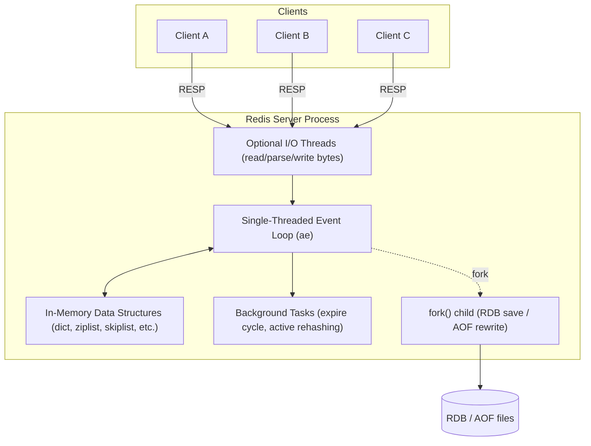

**Real-life scenario:** Because command execution is single-threaded, teams must watch out for long-running commands like `KEYS *` or unbounded `SORT` on a large collection blocking the entire server for all clients — this is why `SCAN` and command-level time budgeting are emphasized in production Redis usage.

### Redis Use Cases

Redis's versatility comes from combining raw speed with purpose-built data structures, which makes it suitable for far more than "just a cache." Common production use cases include: **caching** (database query results, HTML fragments, computed API responses), **session storage** (web session state shared across stateless app server instances), **rate limiting** (using `INCR` with `EXPIRE`, or the sliding-window pattern with sorted sets), **leaderboards** (sorted sets ranked by score), **pub/sub messaging** (real-time notifications, chat fan-out), **job queues** (lists with `LPUSH`/`BRPOP`), **distributed locks** (via `SET key value NX PX`), and **real-time analytics** (HyperLogLog for unique counts, bitmaps for feature flags/activity tracking).

In a typical Spring Boot microservices architecture, Redis is frequently wired in through Spring Data Redis for declarative caching (`@Cacheable`), through Spring Session for centralized HTTP session management across horizontally scaled instances, and through Lettuce/Jedis clients for direct data-structure manipulation such as rate limiters or leaderboards.

```java
// Spring Boot: declarative caching backed by Redis
@Service
public class ProductService {

    @Cacheable(value = "products", key = "#productId")
    public Product getProduct(String productId) {
        return productRepository.findById(productId)
                .orElseThrow(() -> new ProductNotFoundException(productId));
    }
}
```

```bash
# Simple fixed-window rate limiter using INCR + EXPIRE
redis-cli INCR "rate_limit:user:42"
redis-cli EXPIRE "rate_limit:user:42" 60
```

### Redis vs Traditional Databases

Traditional relational databases (PostgreSQL, MySQL, Oracle) are designed around durable, disk-based storage with strong ACID guarantees, rich query languages (SQL), joins, and complex transactional semantics. Redis, by contrast, is a data-structure server optimized for speed and simplicity: it has no query planner, no joins, and a limited (though growing) notion of transactions via `MULTI`/`EXEC`. It trades relational query expressiveness for raw throughput and predictable low-latency operations on well-known access patterns.

This does not mean Redis is "worse" — it means Redis and an RDBMS solve different problems and are usually deployed together. The RDBMS remains the system of record for complex, relational, durable business data, while Redis accelerates read-heavy or latency-sensitive paths, handles ephemeral state, and offloads structures (like counters, queues, and leaderboards) that would be awkward and slow to model relationally at high write volume.

| Dimension | Redis | Traditional RDBMS |
|---|---|---|
| Data model | Key-value + rich structures | Tables, rows, relations |
| Query language | Command-based (no SQL) | SQL, joins, aggregations |
| Durability | Optional/tunable | Durable by default (ACID) |
| Latency | Microseconds | Milliseconds |
| Transactions | `MULTI`/`EXEC`, no rollback on runtime errors | Full ACID with rollback |
| Best for | Caching, sessions, queues, counters, real-time | Complex relational business data |

### Redis vs Memcached

Memcached and Redis are both popular in-memory caching systems, and they're often compared directly because both can serve as a simple key-value cache in front of a database. Memcached is deliberately minimal: it supports only strings/blobs as values, uses a multi-threaded architecture to maximize throughput per core, and offers no persistence, replication, or advanced data structures out of the box.

Redis, on the other hand, supports rich data types (hashes, lists, sets, sorted sets, streams, geospatial), optional persistence (RDB/AOF), built-in replication and clustering, pub/sub messaging, Lua scripting, and transactions. For pure "cache a blob of bytes behind a key" workloads at extreme throughput per node, Memcached's multi-threaded design can have an edge; but for anything requiring durability, replication, richer data modeling, or additional messaging/queueing capability, Redis is almost always the better fit — which is why it has become the default choice for most new projects.

| Feature | Redis | Memcached |
|---|---|---|
| Data structures | Strings, hashes, lists, sets, zsets, streams, geo | Strings/blobs only |
| Persistence | RDB, AOF | None (pure cache) |
| Replication | Built-in (primary-replica, Cluster) | None natively |
| Threading model | Single-threaded core + optional I/O threads | Multi-threaded |
| Pub/Sub | Yes | No |
| Transactions | `MULTI`/`EXEC`, Lua scripts | No |
| Typical use | Cache + data store + broker | Pure cache |

### Redis Persistence Overview

Although Redis is an in-memory store, it offers two complementary mechanisms to persist data to disk so that a restart, crash, or planned failover doesn't necessarily lose the dataset: **RDB (Redis Database) snapshots**, which write a compact, point-in-time binary dump of the dataset at configured intervals, and the **AOF (Append Only File)**, which logs every write command as it happens and replays it on restart. Redis 4.0+ also supports a **hybrid** mode where the AOF file begins with an RDB-format preamble followed by incremental commands, combining fast restarts with fine-grained durability.

Choosing a persistence strategy is a trade-off between durability guarantees, restart time, disk I/O overhead, and write-amplification. A pure cache in front of a source-of-truth database might disable persistence entirely (`save ""`), accepting that a restart simply results in cache misses, while a Redis instance acting as a primary data store (e.g., backing a queue or session store with no other copy of the data) will typically enable AOF with `appendfsync everysec` for a strong durability/performance balance. This topic is explored in full depth in the dedicated **Redis Persistence** section below.

```conf
# redis.conf - disable persistence entirely (pure cache mode)
save ""
appendonly no
```

```conf
# redis.conf - production-grade durability
appendonly yes
appendfsync everysec
```

### RESP Protocol (Redis Serialization Protocol)

RESP (REdis Serialization Protocol) is the wire protocol Redis clients and servers use to communicate. It's a simple, text-based, binary-safe protocol designed to be trivial to parse quickly while remaining human-readable enough to debug over a raw TCP connection with tools like `telnet` or `nc`. RESP2 has been the protocol since Redis's early days; **RESP3**, introduced with Redis 6.0, adds richer types (maps, sets, doubles, booleans, big numbers, verbatim strings, push messages) primarily to support features like client-side caching and better typed responses, while remaining backward compatible — clients opt in via the `HELLO 3` command.

Every RESP message begins with a type-indicating byte: `+` for simple strings, `-` for errors, `:` for integers, `$` for bulk strings, and `*` for arrays. Requests from client to server are always sent as RESP arrays of bulk strings (i.e., a command and its arguments), which keeps the parser on both ends extremely simple and fast — a key ingredient in Redis's low-latency profile.

```text
# Raw RESP request/response for: SET foo bar
Client sends:
*3\r\n$3\r\nSET\r\n$3\r\nfoo\r\n$3\r\nbar\r\n

Server responds:
+OK\r\n

# Raw RESP for: GET foo
Client sends:
*2\r\n$3\r\nGET\r\n$3\r\nfoo\r\n

Server responds:
$3\r\nbar\r\n
```

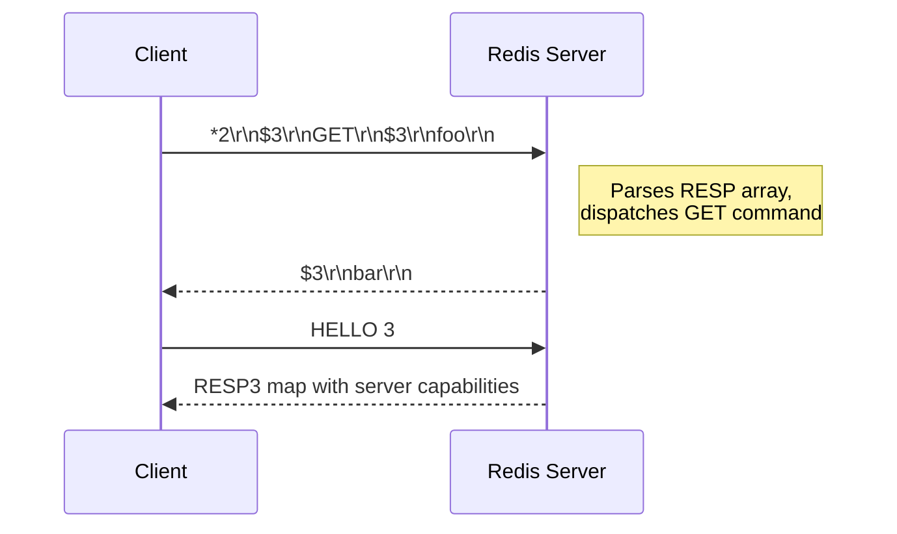

```bash
# You can literally speak RESP over raw TCP for debugging
printf '*1\r\n$4\r\nPING\r\n' | nc localhost 6379
# +PONG
```

### Interview Questions

1. What is Redis and how does it differ from a conventional disk-based database?
2. Why is Redis single-threaded for command execution, and what problem does that design choice solve?
3. What is the role of the event loop / `ae` library in Redis's architecture?
4. What are the main trade-offs of storing data in memory versus on disk?
5. When would you choose Redis over Memcached, and vice versa?
6. What are the most common production use cases for Redis besides caching?
7. How does Redis provide durability despite being an in-memory store?
8. What is RESP, and why does Redis use a custom protocol instead of something like JSON over HTTP?
9. What changed between RESP2 and RESP3, and why was RESP3 introduced?
10. How would you explain Redis's atomicity guarantees given its threading model?
11. What are the risks of running long-blocking commands (e.g., `KEYS *`) on a production Redis instance?
12. How does Redis Cluster/Sentinel change the "single node" architecture picture?
13. What is the difference between RDB and AOF at a conceptual level (deferred to the Persistence section, but expect a high-level question here)?
14. Why might a team choose to disable persistence entirely for a given Redis deployment?
15. What I/O threading improvements were introduced in Redis 6.0, and what problem do they address?

## Redis Installation and Configuration

### Redis Server

`redis-server` is the executable that runs the Redis daemon itself. It can be started with no arguments (using built-in defaults), with a path to a configuration file, or with individual configuration directives passed directly on the command line — the latter is convenient for quick overrides in containerized environments.

On Linux, Redis is commonly installed via the distribution's package manager (`apt`, `yum`) or compiled from source for the latest features; on macOS, `brew install redis` is the standard route for local development. In production, most teams run Redis inside a container (Docker/Kubernetes) or use a managed service (AWS ElastiCache, Azure Cache for Redis, Redis Cloud) rather than managing the server process directly on bare metal.

```bash
# Start with defaults (binds 127.0.0.1:6379, no persistence directives beyond built-in defaults)
redis-server

# Start with an explicit config file
redis-server /etc/redis/redis.conf

# Override a directive inline without editing the file
redis-server /etc/redis/redis.conf --port 6380 --requirepass "s3cr3t"

# Check the running server's version and process
redis-cli INFO server | grep redis_version
```

### Redis CLI

`redis-cli` is the official interactive command-line client for talking to a Redis server. It supports an interactive REPL mode, a single-shot command mode (great for scripting), a `--pipe` mode for bulk-loading commands from a file at high speed, and a `--cluster` mode for administering Redis Cluster deployments.

Beyond basic command execution, `redis-cli` has several features that are extremely useful during development and incident response: `MONITOR` streams every command hitting the server in real time (never use in production under load — it has a real performance cost), `--latency` measures round-trip latency to the server, `--bigkeys` samples the keyspace to find unusually large keys, and `--stat` gives a continuously refreshing overview of server load.

```bash
# Interactive mode
redis-cli
127.0.0.1:6379> SET user:1:name "Alice"
OK
127.0.0.1:6379> GET user:1:name
"Alice"

# One-shot command mode (useful in shell scripts)
redis-cli SET user:1:name "Alice"
redis-cli GET user:1:name

# Connect to a remote host/port with auth
redis-cli -h redis.prod.internal -p 6379 -a "$REDIS_PASSWORD" PING

# Live command stream (debugging only, avoid in high-throughput prod)
redis-cli MONITOR

# Find big keys in the keyspace
redis-cli --bigkeys

# Measure latency to the server
redis-cli --latency
```

### Configuration File (redis.conf)

`redis.conf` is the primary configuration file Redis reads on startup, containing directives for networking, persistence, memory, security, replication, logging, and more. It is a plain-text file with one directive per line, and Redis ships with a heavily commented example `redis.conf` that documents every option and its default value — an invaluable reference.

Most directives can also be inspected and, for many, changed at runtime without a restart via `CONFIG GET`/`CONFIG SET`, though changes made this way are not persisted back to the file unless you explicitly run `CONFIG REWRITE`. This split between "file-based" and "runtime" configuration is important operationally: a `CONFIG SET maxmemory 500mb` takes effect immediately but will be lost on the next restart unless written back.

```conf
# redis.conf (excerpt)
port 6379
bind 127.0.0.1 -::1
daemonize no
logfile ""
dir /var/lib/redis
maxmemory 512mb
maxmemory-policy allkeys-lru
requirepass changeme
```

```bash
# Inspect and change config at runtime
redis-cli CONFIG GET maxmemory
redis-cli CONFIG SET maxmemory 256mb
redis-cli CONFIG REWRITE   # persist runtime changes back to redis.conf
```

### Basic Configuration Options

Beyond persistence and memory (covered separately), a handful of directives form the baseline of almost every Redis deployment: `port` (TCP port to listen on, default `6379`), `bind` (which network interfaces to listen on — critical for security), `daemonize` (whether to run as a background daemon), `pidfile`, `logfile` and `loglevel` (operational logging), `databases` (number of logical DBs selectable via `SELECT`, default 16), and `timeout` (idle client timeout).

Getting these basics right matters more than it might seem: leaving `bind` unset or set to `0.0.0.0` without a firewall/`requirepass` is one of the most common ways Redis instances get compromised (mass-scanned by botnets looking for open Redis ports to exploit for cryptomining or ransom). Production configuration should always explicitly scope `bind`, set a strong `requirepass` or ACL, and disable dangerous commands as appropriate.

```conf
port 6379
bind 127.0.0.1 10.0.0.5
daemonize yes
pidfile /var/run/redis.pid
logfile /var/log/redis/redis.log
loglevel notice
databases 16
timeout 300
```

### Memory Configuration

Memory configuration governs how much RAM Redis is allowed to consume and what happens once that ceiling is reached. The central directive is `maxmemory`, which sets a hard cap (e.g., `maxmemory 2gb`); when the dataset approaches this limit, Redis's behavior is determined by `maxmemory-policy` (covered in depth in the **Memory Management** section) — options range from refusing writes (`noeviction`) to evicting keys under various LRU/LFU/TTL-aware strategies.

Other memory-related directives fine-tune how Redis represents small collections internally for compactness — e.g., `hash-max-listpack-entries`, `list-max-listpack-size`, `set-max-intset-entries` — which control when Redis switches a data type's internal encoding from a compact representation to a more general (but heavier) one as the collection grows. Tuning these thresholds can meaningfully reduce memory footprint for workloads with many small hashes/lists/sets.

```conf
maxmemory 2gb
maxmemory-policy allkeys-lru

# Compact-encoding thresholds
hash-max-listpack-entries 128
hash-max-listpack-value 64
list-max-listpack-size 128
set-max-intset-entries 512
```

```bash
redis-cli CONFIG SET maxmemory 2gb
redis-cli CONFIG SET maxmemory-policy allkeys-lru
redis-cli INFO memory | grep -E "used_memory_human|maxmemory_human"
```

### Security Configuration

Redis was historically designed for use within a trusted network, so its default posture is permissive — no authentication, no encryption, and every command available to any connected client. Modern production deployments must actively harden this: enable `requirepass` (simple shared-secret auth) or, preferably, **Redis ACLs** (Redis 6.0+) for fine-grained per-user permissions on commands and key patterns; bind to specific interfaces rather than `0.0.0.0`; enable TLS for encrypted client connections; and rename or disable dangerous administrative commands like `FLUSHALL`, `CONFIG`, and `SHUTDOWN` in untrusted environments.

ACLs are the recommended modern approach because they let you create least-privilege users — for example, an application user who can only run `GET`/`SET` on keys matching `app:*`, versus an operations user with full administrative access. This is a major improvement over the single global password model.

```conf
# redis.conf
requirepass "a-very-strong-password"
rename-command FLUSHALL ""
rename-command CONFIG ""
```

```bash
# ACL: create a least-privilege application user
redis-cli ACL SETUSER app_user on >app_password \
  ~app:* +get +set +del -@admin

# List configured ACL users
redis-cli ACL LIST

# Verify the user's effective permissions
redis-cli ACL GETUSER app_user
```

| Mechanism | Granularity | Notes |
|---|---|---|
| `requirepass` | Single shared password, full access | Simple, but no per-user scoping |
| ACLs (`ACL SETUSER`) | Per-user, per-command, per-key-pattern | Recommended for multi-tenant/least-privilege setups |
| TLS | Transport encryption | Protects data in transit, independent of auth |
| `bind` / firewall | Network-level | First line of defense — never expose Redis publicly |

### Running Redis with Docker

Docker is the most common way developers run Redis locally and increasingly how it's run in production (often orchestrated via Kubernetes/Helm). The official `redis` image on Docker Hub provides ready-to-run builds for all supported versions, and mounting a volume for `/data` combined with a custom `redis.conf` gives you a fully configurable, disposable Redis instance.

```bash
# Quick ephemeral instance for local development
docker run --name redis-dev -p 6379:6379 -d redis:7.2

# Persistent instance with a custom config and a named volume
docker run --name redis-prod \
  -p 6379:6379 \
  -v redis-data:/data \
  -v $(pwd)/redis.conf:/usr/local/etc/redis/redis.conf \
  -d redis:7.2 redis-server /usr/local/etc/redis/redis.conf

# Tail logs / open a CLI inside the running container
docker logs -f redis-prod
docker exec -it redis-prod redis-cli
```

```yaml
# docker-compose.yaml
services:
  redis:
    image: redis:7.2
    ports:
      - "6379:6379"
    volumes:
      - redis-data:/data
      - ./redis.conf:/usr/local/etc/redis/redis.conf
    command: ["redis-server", "/usr/local/etc/redis/redis.conf"]
    healthcheck:
      test: ["CMD", "redis-cli", "ping"]
      interval: 5s
      timeout: 3s
      retries: 5

volumes:
  redis-data:
```

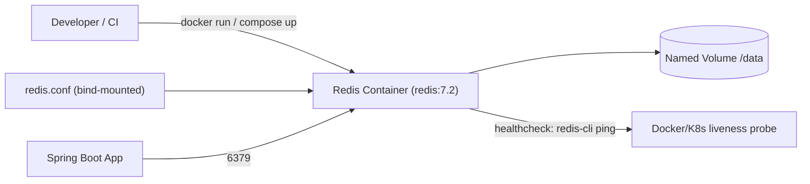

**Real-life scenario:** A team's `docker-compose.yaml` spins up Redis alongside the application and a Postgres database for local development and integration tests, ensuring the exact same Redis major version is used locally as in production, eliminating "works on my machine" version drift.

### Client Connection Configuration

Client connection configuration covers both server-side settings that govern how clients connect (`timeout`, `tcp-keepalive`, `maxclients`) and client-side configuration in the application (connection pool size, timeouts, retry policy). Getting this right is critical for resilience: a Spring Boot service using Lettuce or Jedis needs a properly sized connection pool, sane command timeouts, and a reconnection strategy so that a brief network blip or Redis failover doesn't cascade into application-wide errors.

Lettuce (the default client in Spring Boot's `spring-boot-starter-data-redis`) is built on Netty and is asynchronous/non-blocking by nature, sharing a small number of connections efficiently via multiplexing, whereas Jedis is a simpler synchronous client that typically requires a connection pool (via Apache Commons Pool2) sized to match expected concurrency.

```yaml
# application.yml (Spring Boot, Lettuce)
spring:
  data:
    redis:
      host: redis.prod.internal
      port: 6379
      password: ${REDIS_PASSWORD}
      timeout: 2000ms
      lettuce:
        pool:
          max-active: 16
          max-idle: 8
          min-idle: 2
        shutdown-timeout: 200ms
```

```java
@Configuration
public class RedisConfig {

    @Bean
    public LettuceConnectionFactory redisConnectionFactory(RedisProperties properties) {
        RedisStandaloneConfiguration standalone = new RedisStandaloneConfiguration(
                properties.getHost(), properties.getPort());
        standalone.setPassword(properties.getPassword());

        LettuceClientConfiguration clientConfig = LettuceClientConfiguration.builder()
                .commandTimeout(Duration.ofSeconds(2))
                .build();

        return new LettuceConnectionFactory(standalone, clientConfig);
    }
}
```

```conf
# redis.conf server-side connection tuning
tcp-keepalive 300
timeout 0
maxclients 10000
```

### Interview Questions

1. What are the different ways to start `redis-server`, and how do command-line overrides interact with `redis.conf`?
2. What is the difference between changing configuration via `CONFIG SET` and editing `redis.conf` directly?
3. Why is `CONFIG REWRITE` needed, and when would you use it?
4. What security risks come from binding Redis to `0.0.0.0` without authentication?
5. How do Redis ACLs improve on the legacy `requirepass` model?
6. What are some dangerous commands you might rename or disable in a production configuration, and why?
7. How would you run a persistent Redis instance in Docker with a custom configuration file?
8. What is the difference between Lettuce and Jedis as Redis clients in a Spring Boot application?
9. Why does Lettuce need fewer connections than Jedis for the same level of concurrency?
10. What is `redis-cli --bigkeys` used for, and why should `MONITOR` be used cautiously in production?
11. What directives control how Redis represents small hashes/lists/sets compactly in memory?
12. How would you size a Lettuce/Jedis connection pool for a Spring Boot service under load?
13. What is `maxclients`, and what happens when it's exceeded?
14. How does TLS configuration differ from ACL/password-based authentication in Redis?
15. What operational steps would you take to hardened a freshly installed Redis instance before exposing it to an application?

## Redis Data Types

### Strings

The string type is Redis's most fundamental data structure: a binary-safe sequence of bytes up to 512MB, which means it can hold text, serialized JSON, images, or any binary payload. Strings support far more than simple get/set — Redis provides atomic increment/decrement (`INCR`, `INCRBY`, `INCRBYFLOAT`), atomic substring/append operations (`APPEND`, `GETRANGE`, `SETRANGE`), and bit-level operations (`SETBIT`, `GETBIT`, `BITCOUNT`) that are the foundation of the Bitmaps data type.

Strings are the natural fit for simple caching (serialized objects, HTML fragments), counters (page views, rate limits), distributed locks (`SET key value NX PX 30000`), and feature flags. Because `INCR`/`DECR` are atomic at the server level, they're a reliable building block for counters shared across many concurrent clients without any application-level locking.

```bash
SET session:abc123 '{"userId":42,"role":"admin"}' EX 1800
GET session:abc123

INCR page:views:home
INCRBY inventory:sku:1001 -5
INCRBYFLOAT wallet:user:7 12.50

# Atomic lock pattern
SET lock:order:987 "worker-1" NX PX 30000
```

```java
// Spring Data Redis - simple string operations
StringRedisTemplate redisTemplate = new StringRedisTemplate(connectionFactory);
redisTemplate.opsForValue().set("session:abc123", sessionJson, Duration.ofMinutes(30));
Long views = redisTemplate.opsForValue().increment("page:views:home");
```

### Hashes

Hashes store a mapping of field-value pairs under a single key, similar to a small object/dictionary. They are ideal for representing structured entities — a user profile, a product record, or a cart — without needing to serialize/deserialize the entire object just to read or update one field. Internally, small hashes are stored in a compact `listpack` encoding and automatically convert to a full hash table once they exceed `hash-max-listpack-entries` or `hash-max-listpack-value`.

Because individual fields can be read and written independently (`HGET`, `HSET`, `HINCRBY`, `HDEL`), hashes avoid the classic "read-modify-write whole blob" race condition that plagues storing a full JSON string for an entity that has frequently-updated sub-fields (e.g., incrementing a view counter on a product without touching its name/description).

```bash
HSET user:1000 name "Alice" email "alice@example.com" login_count 0
HINCRBY user:1000 login_count 1
HGET user:1000 email
HGETALL user:1000
HDEL user:1000 email
```

```java
HashOperations<String, String, String> hashOps = redisTemplate.opsForHash();
hashOps.put("user:1000", "name", "Alice");
hashOps.increment("user:1000", "login_count", 1);
Map<String, String> user = hashOps.entries("user:1000");
```

**Real-life scenario:** A shopping cart service stores each cart as a hash (`cart:{sessionId}`) with `productId -> quantity` field pairs, allowing individual line-item updates (`HINCRBY`) without reading/rewriting the entire cart.

### Lists

Lists are ordered collections of strings, implemented internally as a `listpack`/`quicklist` structure, supporting efficient push/pop operations at both ends (`LPUSH`/`RPUSH`, `LPOP`/`RPOP`) in O(1) time, plus blocking variants (`BLPOP`, `BRPOP`) that let a consumer wait efficiently for new items rather than polling. This makes lists a natural fit for queues, activity feeds, and simple message buffering.

A common production pattern is a work queue: producers `LPUSH` jobs onto a list, and one or more workers `BRPOP` to consume them in FIFO order, blocking (rather than busy-polling) until work arrives. For patterns needing guaranteed delivery/acknowledgment, Redis Streams (covered later) are generally preferred over plain lists, since a popped list item is gone the instant it's popped, with no re-delivery mechanism if the consumer crashes mid-processing.

```bash
LPUSH queue:emails '{"to":"a@example.com","template":"welcome"}'
BRPOP queue:emails 5
LRANGE queue:emails 0 -1
LLEN queue:emails
```

```java
ListOperations<String, String> listOps = redisTemplate.opsForList();
listOps.leftPush("queue:emails", jobJson);
String job = listOps.rightPop("queue:emails", Duration.ofSeconds(5));
```

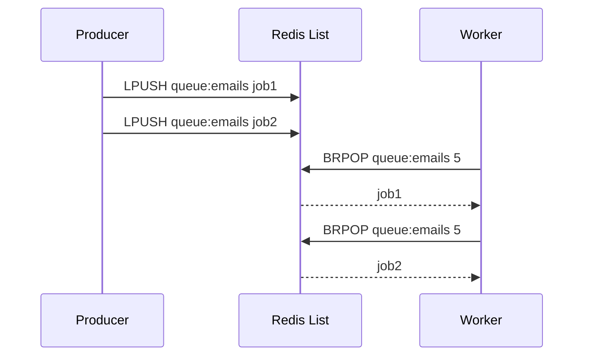

### Sets

Sets are unordered collections of unique strings, supporting O(1) membership tests (`SISMEMBER`), additions/removals (`SADD`/`SREM`), and powerful set-algebra operations — union, intersection, and difference (`SUNION`, `SINTER`, `SDIFF`) — computed server-side without pulling data into the application.

Sets shine for tagging systems, deduplication, and relationship modeling: tracking unique visitors per day, tags associated with a blog post, or the mutual friends between two users via `SINTER`. Because set operations run inside Redis, they avoid transferring large collections over the network just to compute an intersection in application code.

```bash
SADD post:123:tags "redis" "caching" "backend"
SISMEMBER post:123:tags "redis"
SADD user:1:following "u2" "u3" "u4"
SADD user:2:following "u3" "u4" "u5"
SINTER user:1:following user:2:following      # mutual follows
SCARD post:123:tags
```

```java
SetOperations<String, String> setOps = redisTemplate.opsForSet();
setOps.add("post:123:tags", "redis", "caching", "backend");
Boolean isTagged = setOps.isMember("post:123:tags", "redis");
Set<String> mutual = redisTemplate.opsForSet().intersect("user:1:following", "user:2:following");
```

### Sorted Sets (ZSets)

Sorted sets combine the uniqueness guarantee of a set with an associated floating-point **score** per member, and Redis keeps members ordered by that score internally (via a skip list + hash table combination). This makes range queries by rank or by score (`ZRANGE`, `ZRANGEBYSCORE`, `ZRANK`) extremely fast — O(log N) for inserts and range lookups.

Sorted sets are the canonical Redis data structure for **leaderboards** (score = player points), **priority queues** (score = priority/timestamp), **rate limiting with sliding windows** (score = request timestamp, trimming old entries with `ZREMRANGEBYSCORE`), and **time-ordered indexes**. Their combination of uniqueness + ordering + O(log N) operations makes them one of the most powerful and heavily used Redis structures in real systems.

```bash
ZADD leaderboard 1500 "alice" 2200 "bob" 900 "carol"
ZREVRANGE leaderboard 0 2 WITHSCORES     # top 3, descending
ZRANK leaderboard "alice"
ZINCRBY leaderboard 50 "alice"
ZRANGEBYSCORE leaderboard 1000 2000

# Sliding-window rate limiter: keep only requests in the last 60s
ZADD rl:user:42 1690000000 "req-1"
ZREMRANGEBYSCORE rl:user:42 -inf (1690000000-60)
ZCARD rl:user:42
```

```java
ZSetOperations<String, String> zsetOps = redisTemplate.opsForZSet();
zsetOps.add("leaderboard", "alice", 1500);
zsetOps.incrementScore("leaderboard", "alice", 50);
Set<String> top3 = zsetOps.reverseRange("leaderboard", 0, 2);
```

### Bitmaps

Bitmaps aren't a distinct data type in Redis — they're an interpretation of the string type as a bit array, manipulated with bit-oriented commands (`SETBIT`, `GETBIT`, `BITCOUNT`, `BITOP`, `BITPOS`). Because a string can hold up to 512MB, a single bitmap key can represent up to roughly 4 billion bits, making bitmaps extraordinarily memory-efficient for tracking boolean state across huge populations — e.g., "did user N do X today" as one bit per user.

Classic use cases include daily active user tracking (one bit per user ID, one key per day), feature-flag rollouts, and real-time analytics where `BITOP AND`/`OR` across multiple daily bitmaps can answer questions like "how many users were active every day this week" in a single, extremely fast operation.

```bash
# Mark user 123 and 578 active today
SETBIT active:2026-08-02 123 1
SETBIT active:2026-08-02 578 1

# Count how many users were active today
BITCOUNT active:2026-08-02

# Users active both yesterday and today
BITOP AND active:both active:2026-08-01 active:2026-08-02
BITCOUNT active:both
```

### HyperLogLog

HyperLogLog (HLL) is a probabilistic data structure used to estimate the cardinality (count of unique elements) of a set using a fixed, tiny amount of memory — roughly 12KB regardless of whether the underlying set has thousands or billions of elements. It trades perfect accuracy for massive space savings: Redis's HLL implementation guarantees a standard error of about 0.81%.

This makes HLL perfect for approximate unique counting at scale where exact precision isn't required — unique visitors to a website per day, unique search queries, or unique IPs hitting an endpoint — problems that would otherwise require a full set (with memory proportional to the number of unique items) to solve exactly.

```bash
PFADD unique_visitors:2026-08-02 "user:1" "user:2" "user:3"
PFCOUNT unique_visitors:2026-08-02
PFADD unique_visitors:2026-08-03 "user:2" "user:4"
PFMERGE unique_visitors:week unique_visitors:2026-08-02 unique_visitors:2026-08-03
PFCOUNT unique_visitors:week
```

| Approach | Memory for 10M unique items | Accuracy |
|---|---|---|
| Redis Set | ~ hundreds of MB (proportional to cardinality) | Exact |
| HyperLogLog | ~12 KB (fixed) | ~0.81% standard error |

### Streams

Redis Streams (added in Redis 5.0) model an append-only log of entries, each with a unique, monotonically increasing ID (`<milliseconds>-<sequence>`), designed to emulate the semantics of systems like Kafka in a lightweight form. Unlike lists, entries are not removed on read by default — multiple independent consumers (or **consumer groups**) can read the same stream at their own pace, and consumer groups provide at-least-once delivery with explicit acknowledgment (`XACK`) and the ability to claim messages abandoned by a crashed consumer (`XCLAIM`/`XAUTOCLAIM`).

Streams are the right tool when you need durable, ordered event logs with multiple consumer groups, replay capability, and delivery guarantees — for example, an order-events stream consumed independently by an inventory service, a notification service, and an analytics pipeline, each tracking its own read position.

```bash
XADD orders:events '*' orderId 1001 status "CREATED"
XADD orders:events '*' orderId 1001 status "PAID"

XGROUP CREATE orders:events inventory-svc 0
XREADGROUP GROUP inventory-svc consumer-1 COUNT 10 STREAMS orders:events '>'
XACK orders:events inventory-svc 1690000000000-0

XLEN orders:events
XRANGE orders:events - +
```

```java
StreamOperations<String, Object, Object> streamOps = redisTemplate.opsForStream();
streamOps.add(StreamRecords.newRecord()
        .in("orders:events")
        .ofObject(Map.of("orderId", "1001", "status", "CREATED")));
```

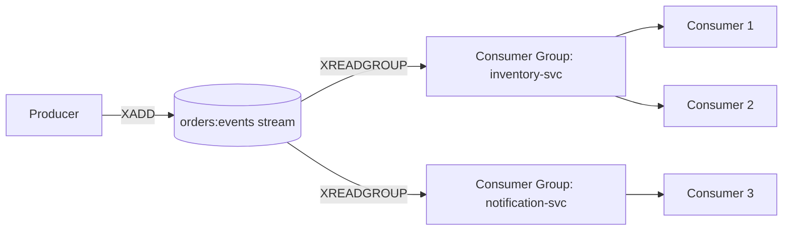

### Geospatial Data

Redis's geospatial commands (`GEOADD`, `GEOSEARCH`, `GEODIST`, `GEOPOS`) let you store longitude/latitude coordinates and query them by proximity, all built on top of sorted sets under the hood (coordinates are encoded into a geohash-based score). This gives you "find all X within N kilometers of point P" queries without needing a separate specialized geospatial database for simple radius/location use cases.

Typical applications include store/restaurant locators ("find the 5 nearest coffee shops"), ride-sharing driver matching (nearest available drivers to a rider), and geofencing-style features, all served with Redis's usual low-latency guarantees.

```bash
GEOADD stores 13.361389 38.115556 "store:palermo"
GEOADD stores 15.087269 37.502669 "store:catania"

GEODIST stores store:palermo store:catania km

GEOSEARCH stores FROMLONLAT 15 37 BYRADIUS 200 km ASC WITHCOORD WITHDIST
```

```java
GeoOperations<String, String> geoOps = redisTemplate.opsForGeo();
geoOps.add("stores", new Point(13.361389, 38.115556), "store:palermo");
Distance distance = geoOps.distance("stores", "store:palermo", "store:catania", Metrics.KILOMETERS);
```

### Interview Questions

1. What Redis data types are you familiar with, and how would you decide which one fits a given problem?
2. How is the string type used for atomic counters and distributed locks?
3. Why are hashes better than serialized JSON strings for entities with independently updated fields?
4. What is the difference between a Redis list-based queue and a Redis Stream for job processing?
5. How would you compute mutual followers/friends between two users using Redis sets?
6. Why are sorted sets the natural choice for implementing a leaderboard?
7. How would you implement a sliding-window rate limiter using a sorted set?
8. What is a bitmap in Redis, and how is it different from a "real" data type like a set?
9. How does HyperLogLog achieve constant memory usage, and what accuracy trade-off does it make?
10. When would you choose HyperLogLog over a Set for counting unique items?
11. What delivery guarantees do Redis Streams provide that plain lists do not?
12. What is a consumer group in Redis Streams, and what problem does `XACK`/`XCLAIM` solve?
13. How are Redis's geospatial commands implemented internally?
14. What's the internal encoding difference between a small hash/list/set and a large one, and why does Redis switch representations?
15. Given a requirement to track daily active users across millions of accounts, which Redis data type(s) would you pick and why?

## Redis Modules and Extensions

### RedisJSON

RedisJSON is a module that adds a native JSON data type to Redis, allowing you to store, update, and query JSON documents in place using JSONPath expressions, rather than reading an entire serialized JSON string, deserializing it in the application, mutating a field, and writing the whole thing back. Commands like `JSON.SET`, `JSON.GET`, and `JSON.NUMINCRBY` operate directly on nested fields inside the stored document.

This is valuable when Redis needs to act as a document-oriented store or a fast cache layer for JSON-shaped API responses where partial updates matter — for example, incrementing a nested `stock` field in a product document without a full read-modify-write round trip, avoiding both extra network overhead and race conditions.

```bash
JSON.SET product:1001 $ '{"name":"Widget","price":9.99,"stock":{"available":42}}'
JSON.GET product:1001 $.price
JSON.NUMINCRBY product:1001 $.stock.available -1
JSON.SET product:1001 $.name '"Super Widget"'
```

### RediSearch (Full-Text and Vector Search)

RediSearch adds secondary indexing, full-text search, and vector similarity search directly on top of Redis hashes or JSON documents. You define an index over specific fields (`FT.CREATE`), and RediSearch maintains it automatically as matching keys are written, letting you run rich queries — full-text search with ranking, numeric range filters, tag filters, and (in recent versions) approximate nearest-neighbor vector search — using `FT.SEARCH`/`FT.AGGREGATE`.

The vector search capability has become particularly significant with the rise of AI/RAG (retrieval-augmented generation) applications: embeddings generated by an LLM can be stored alongside application data and queried for similarity (`KNN`) directly in Redis, letting a single system serve both the operational cache and the vector index rather than standing up a separate vector database.

```bash
FT.CREATE idx:products ON HASH PREFIX 1 product: SCHEMA \
  name TEXT SORTABLE \
  price NUMERIC SORTABLE \
  category TAG

FT.SEARCH idx:products "widget" LIMIT 0 10
FT.SEARCH idx:products "@category:{electronics} @price:[10 50]"
```

### RedisBloom (Probabilistic Data Structures)

RedisBloom adds a family of probabilistic data structures beyond HyperLogLog: **Bloom filters** (fast, space-efficient "definitely not present / possibly present" membership tests with a tunable false-positive rate), **Cuckoo filters** (similar, but support deletion), **Count-Min Sketch** (approximate frequency counting), and **Top-K** (tracking the most frequent items in a stream).

Bloom filters are widely used to avoid unnecessary expensive lookups — for example, checking a Bloom filter before querying a database or cache to quickly rule out "definitely doesn't exist" cases (a classic technique for preventing cache-penetration attacks where clients repeatedly request non-existent keys).

```bash
BF.RESERVE seen_urls 0.01 1000000
BF.ADD seen_urls "https://example.com/a"
BF.EXISTS seen_urls "https://example.com/a"     # 1 (possibly present)
BF.EXISTS seen_urls "https://example.com/z"     # 0 (definitely absent)

CMS.INITBYDIM freq_sketch 2000 5
CMS.INCRBY freq_sketch "sku:1001" 1
CMS.QUERY freq_sketch "sku:1001"
```

### RedisTimeSeries

RedisTimeSeries is purpose-built for storing and querying time-stamped numeric data efficiently, with native support for automatic downsampling/aggregation (compaction rules), retention policies, and labels for multi-dimensional querying — similar in spirit to specialized time-series databases like InfluxDB or Prometheus, but embedded in Redis.

This module fits naturally into observability and IoT-style pipelines: ingesting sensor readings, application metrics, or financial tick data at high frequency, with built-in rollups (e.g., automatically maintaining a 1-minute average alongside the raw per-second series) so downstream dashboards don't need to compute aggregates on the fly.

```bash
TS.CREATE temperature:sensor1 RETENTION 86400000 LABELS sensor "1" location "warehouse"
TS.ADD temperature:sensor1 '*' 21.5
TS.CREATE temperature:sensor1:avg1m
TS.CREATERULE temperature:sensor1 temperature:sensor1:avg1m AGGREGATION avg 60000
TS.RANGE temperature:sensor1 - +
```

### Redis Stack Overview

**Redis Stack** is a distribution that bundles Redis with the most popular modules — RedisJSON, RediSearch, RedisBloom, RedisTimeSeries, and RedisGraph (deprecated in favor of other graph solutions as of recent releases) — plus **RedisInsight**, a GUI for browsing and managing data. It exists so teams don't need to compile or separately load each module: `docker run redis/redis-stack` gets you a fully-loaded Redis with document, search, probabilistic, and time-series capabilities out of the box.

Choosing Redis Stack versus vanilla Redis is largely about whether your application needs these extended capabilities. A simple cache/session-store deployment has no need for the extra modules (and thus extra memory/attack-surface overhead), while an application doing JSON document modeling, full-text/vector search, or time-series analytics benefits substantially from having them natively available rather than integrating separate specialized systems.

```bash
docker run -p 6379:6379 -p 8001:8001 redis/redis-stack:latest
# Port 6379: Redis + modules
# Port 8001: RedisInsight web UI
```

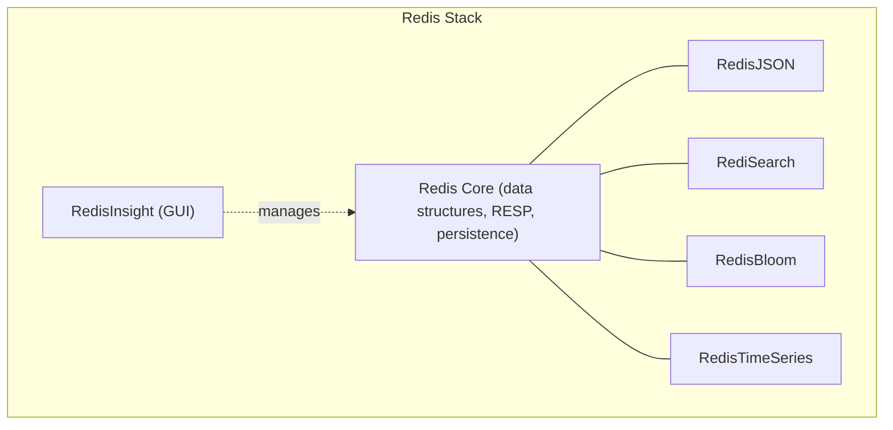

| Need | Module |
|---|---|
| Native JSON documents, partial updates | RedisJSON |
| Full-text / vector similarity search | RediSearch |
| Approximate membership / frequency | RedisBloom |
| Time-stamped metrics with rollups | RedisTimeSeries |
| All of the above, bundled | Redis Stack |

### Interview Questions

1. What problem does RedisJSON solve that plain string-based JSON storage does not?
2. How does RediSearch enable vector similarity search, and why is that relevant to AI/RAG applications?
3. What is a Bloom filter, and what does "false positive but never a false negative" mean in practice?
4. How does a Bloom filter help prevent cache-penetration attacks?
5. What's the difference between a Bloom filter and a Cuckoo filter?
6. When would you choose RedisTimeSeries over storing time-series data in sorted sets manually?
7. What is Redis Stack, and how does it differ from vanilla open-source Redis?
8. What is RedisInsight, and what role does it play in a development workflow?
9. How would you decide whether a project needs Redis Stack versus plain Redis?
10. What are the trade-offs of using Redis modules versus a dedicated specialized system (e.g., Elasticsearch for search, InfluxDB for time series)?

## Key Management

### Keys

Keys are the primary identifiers under which all Redis values are stored — every piece of data in Redis, regardless of its data type, is addressed by a unique binary-safe string key. Redis provides a broad set of key-level commands that work uniformly across data types: `EXISTS`, `TYPE`, `TTL`, `EXPIRE`, `DEL`, `RENAME`, and `SCAN`, all operating purely on the key without needing to know or care what kind of value it points to.

Understanding that keys and values are decoupled from "collections/tables" (as in a relational model) is fundamental to thinking in Redis: there's no schema enforcing that all "user" keys look alike, so naming discipline and application-level conventions are what keep a large keyspace organized and maintainable.

```bash
SET user:1000:name "Alice"
EXISTS user:1000:name
TYPE user:1000:name
TTL user:1000:name
DEL user:1000:name
```

### Namespaces

Redis has no built-in concept of namespaces or schemas — instead, the community convention is to encode a logical namespace directly into the key using a delimiter (traditionally `:`), e.g., `app:user:1000:profile`. This is purely a naming convention enforced by application discipline, not a server-side feature, though tools like `SCAN` with pattern matching and RedisInsight's tree view rely on this convention to present a navigable hierarchy.

Namespacing keys by service/domain/entity is essential in any shared Redis instance to avoid collisions between unrelated features and to make operational tasks (like "delete all cache entries for the pricing service") tractable via pattern-based scanning rather than needing to track every key individually.

```bash
SET orders:svc:order:1001:status "PAID"
SET pricing:svc:sku:2002:price "19.99"
SET auth:svc:session:abcxyz "user:42"

# Discover keys within a namespace (never use KEYS in production - see Key Scanning)
redis-cli --scan --pattern "orders:svc:*"
```

### Key Naming Conventions

A consistent key naming convention makes a large keyspace debuggable, scannable, and safe to operate on. The most common convention is colon-delimited segments moving from general to specific: `{namespace}:{entity}:{id}:{field-or-subresource}`, e.g., `shop:cart:user123:items`. Keeping keys human-readable (rather than opaque hashes) pays off enormously during incident response, when an engineer needs to `SCAN` and reason about what's in the keyspace.

Other conventions worth adopting: keep key names reasonably short (very long keys waste memory across millions of entries), avoid embedding highly variable data that would explode cardinality unnecessarily, and pick a single delimiter convention and enforce it via shared client libraries/wrappers rather than ad hoc string concatenation scattered through the codebase.

```text
Good:
  cache:product:1001
  session:user:42
  rl:api:user:42:2026-08-02T10

Avoid:
  product_1001_cache_data_v2_final   (inconsistent, unstructured)
  1001                                (no context, collision-prone)
```

```java
// Centralize key construction so conventions are enforced in one place
public final class CacheKeys {
    public static String product(String productId) {
        return "cache:product:" + productId;
    }
}
```

### Key Expiration (TTL)

Redis supports attaching a **time-to-live** to any key, after which it is automatically deleted. TTLs can be set at creation (`SET key value EX 60`) or applied/adjusted afterward (`EXPIRE`, `PEXPIRE`, `EXPIREAT`), and inspected via `TTL`/`PTTL` (returning remaining seconds/milliseconds, `-1` if the key has no TTL, `-2` if it doesn't exist). `PERSIST` removes an existing TTL, making the key permanent again.

Internally, Redis does not scan the whole keyspace continuously for every possible expiration — it uses a combination of **lazy expiration** (a key is checked and deleted the moment it's accessed if its TTL has passed) and an **active expiration cycle** that periodically samples a subset of keys with TTLs set and proactively removes expired ones, keeping memory from being needlessly held by expired-but-unaccessed keys.

```bash
SET session:abc123 "user-data" EX 1800
TTL session:abc123
PERSIST session:abc123
TTL session:abc123          # -1, no longer expires
EXPIRE session:abc123 60
PTTL session:abc123
```

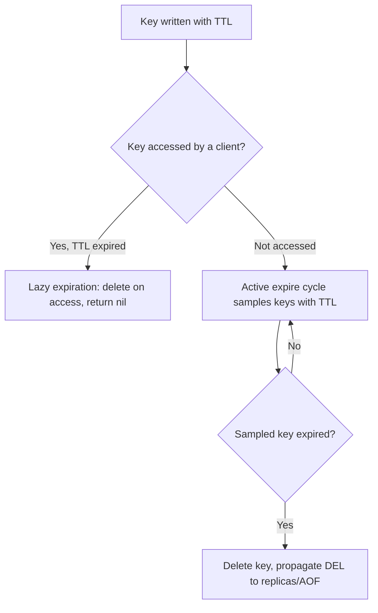

**Real-life scenario:** Session tokens are stored with `EX 1800` (30 minutes) so an inactive user's session data is reclaimed automatically without any application-side cleanup job.

### Persistent Keys

A "persistent key" is simply a key with no expiration set — it remains in the keyspace indefinitely (subject to eviction under memory pressure, unless the eviction policy specifically protects keys without a TTL). Most durable application data — user accounts, product catalogs, configuration — should be stored as persistent keys, since accidental TTL leakage into permanent data would be a serious bug.

A common defensive practice is to choose an eviction policy like `volatile-lru` when persistent keys must never be evicted even under memory pressure — this policy only ever evicts keys that do have a TTL set, guaranteeing permanent keys are safe from eviction (though they can still trigger `OOM` errors on writes if memory is fully exhausted with no evictable keys available).

```bash
SET config:feature:dark_mode "enabled"      # no TTL - persistent by default
TTL config:feature:dark_mode                # -1
```

### Key Eviction

Key eviction is the process by which Redis proactively removes keys to reclaim memory once `maxmemory` is reached, governed by the configured `maxmemory-policy`. This is covered in full depth under **Memory Management**, but at the key-management level, it's important to understand which keys are eligible: policies prefixed `volatile-*` only ever evict keys that have a TTL set, while `allkeys-*` policies can evict any key regardless of expiration.

```bash
CONFIG SET maxmemory 100mb
CONFIG SET maxmemory-policy volatile-lru
INFO stats | grep evicted_keys
```

### Key Scanning

Iterating over the keyspace safely is a common operational need — for debugging, running maintenance scripts, or bulk-deleting a namespace. The naive `KEYS *` command is **dangerous in production** because it's O(N) over the entire keyspace and blocks the single-threaded server for the full duration on a large dataset, causing latency spikes for every other client.

The correct tool is `SCAN` (and its type-specific siblings `HSCAN`, `SSCAN`, `ZSCAN`), which uses a cursor-based protocol to incrementally walk the keyspace in small batches without blocking the server, at the cost of weaker consistency guarantees (a key present throughout a full scan is guaranteed to be returned at least once, but keys added/removed during the scan may or may not appear).

```bash
# Dangerous in production on a large keyspace - avoid
KEYS "cache:product:*"

# Safe, non-blocking, cursor-based iteration
SCAN 0 MATCH "cache:product:*" COUNT 100
# returns a cursor + a batch of keys; repeat with the returned cursor until it's 0
```

```bash
redis-cli --scan --pattern "cache:product:*" | xargs redis-cli DEL
```

| Command | Blocking | Consistency | Production-safe |
|---|---|---|---|
| `KEYS *` | Yes, O(N) | Full snapshot | No |
| `SCAN` | No, incremental | At-least-once per key | Yes |

### Key Deletion

Redis provides two commands for removing keys: `DEL`, which frees the key's memory synchronously on the main thread, and `UNLINK` (Redis 4.0+), which reclaims memory **asynchronously** on a background thread while removing the key from the keyspace immediately. For large values (a huge hash, list, or set with millions of entries), `DEL` can briefly block the server while it frees memory; `UNLINK` avoids this by deferring the actual memory deallocation.

```bash
DEL session:abc123
UNLINK big:collection:key      # non-blocking free for large values
FLUSHDB ASYNC                  # clear current DB without blocking
FLUSHALL ASYNC                 # clear all DBs without blocking
```

### Key Renaming

`RENAME` and `RENAMENX` atomically rename a key, with `RENAMENX` only succeeding if the destination key does not already exist (useful to avoid accidentally clobbering existing data). Renaming is atomic and preserves the key's TTL, type, and value untouched.

```bash
SET tmp:import:batch42 "processed-data"
RENAME tmp:import:batch42 import:batch42:final
RENAMENX import:batch42:final import:batch41:final    # fails: destination exists
```

### Interview Questions

1. How does Redis handle the absence of namespaces/schemas, and what conventions fill that gap?
2. What key naming convention would you adopt for a multi-service Redis deployment, and why?
3. What's the difference between lazy expiration and active expiration in Redis?
4. What do `TTL` return values of `-1` and `-2` mean?
5. Why is `KEYS *` dangerous in production, and how does `SCAN` avoid the same problem?
6. What consistency guarantees does `SCAN` provide during concurrent modifications to the keyspace?
7. What's the difference between `DEL` and `UNLINK`, and when would you prefer one over the other?
8. How would you safely bulk-delete all keys matching a pattern in production?
9. What is the difference between `RENAME` and `RENAMENX`?
10. How do `volatile-*` and `allkeys-*` eviction policies relate to whether a key has a TTL?
11. How would you ensure a piece of permanent configuration data is never accidentally evicted or expired?
12. What tools or commands would you use to audit unusually large keys in a Redis instance?
13. How is `FLUSHALL ASYNC` different from a plain `FLUSHALL`?
14. Why might inconsistent key naming become an operational liability at scale?
15. How would you design a key schema for a multi-tenant SaaS application sharing one Redis instance?

## Redis Persistence

### RDB Snapshots

RDB (Redis Database) persistence produces a single compact binary file (`dump.rdb`) containing a point-in-time snapshot of the entire dataset. Snapshots are triggered either by configured save points (e.g., "save after 900 seconds if at least 1 key changed"), by the `SAVE`/`BGSAVE` commands, or automatically before certain operations like replication sync. `BGSAVE` is the production-relevant variant: Redis `fork()`s a child process that writes the snapshot while the parent continues serving clients, relying on the OS's copy-on-write semantics so the fork is cheap and doesn't block command processing for long.

RDB's strengths are compactness (a single file, ideal for backups and fast transfer to a new replica) and fast restarts (loading one binary snapshot is much quicker than replaying a long command log). Its weakness is durability granularity: since a snapshot only happens periodically, a crash between snapshots loses all writes since the last save point — this is the central trade-off compared to AOF.

```conf
# redis.conf save points: "save <seconds> <changes>"
save 900 1
save 300 10
save 60 10000
dbfilename dump.rdb
dir /var/lib/redis
```

```bash
redis-cli BGSAVE
redis-cli LASTSAVE
redis-cli INFO persistence | grep rdb_
```

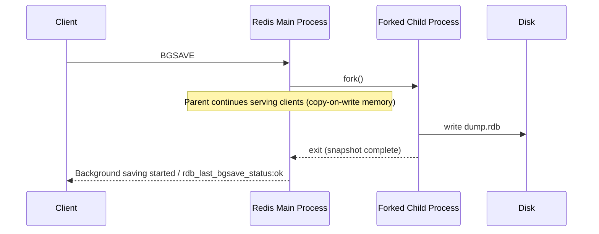

### AOF (Append Only File)

The Append Only File logs every write command Redis executes, in order, to a file on disk, and reconstructs the dataset on restart by replaying that log from the beginning. Unlike RDB's periodic snapshots, AOF's durability is controlled by `appendfsync`, which determines how often the file is `fsync`'d to disk: `always` (every write, safest but slowest), `everysec` (fsync once per second — the recommended default, bounding potential loss to ~1 second of writes), or `no` (let the OS decide, fastest but least durable).

Because AOF logs every command, the file grows continuously and would eventually become unwieldy; Redis addresses this with **AOF rewriting** (covered separately below), which compacts the log into the minimal set of commands needed to reproduce the current dataset. AOF generally offers better durability guarantees than RDB alone, at the cost of larger file sizes and slightly slower restarts (replaying a log vs. loading a snapshot) — this is why hybrid mode (also below) is the modern default.

```conf
appendonly yes
appendfilename "appendonly.aof"
appenddirname "appendonlydir"
appendfsync everysec
```

```bash
redis-cli CONFIG SET appendonly yes
redis-cli INFO persistence | grep aof_
```

### Hybrid Persistence

Since Redis 4.0, AOF can operate in **hybrid mode** (`aof-use-rdb-preamble yes`, the default since Redis 5.0+): when the AOF is rewritten, the new file starts with the dataset encoded in the compact RDB binary format, followed by the incremental commands issued since the rewrite. This gives you the fast-loading benefit of RDB (loading the binary preamble is quick) combined with the fine-grained durability of AOF (only a small tail of recent commands needs to be replayed on top).

This is the recommended default for most production deployments requiring strong durability: enable both `appendonly yes` and `aof-use-rdb-preamble yes`, giving a restart profile that's nearly as fast as pure RDB while retaining AOF's per-second (or better) durability.

```conf
appendonly yes
aof-use-rdb-preamble yes
appendfsync everysec
```

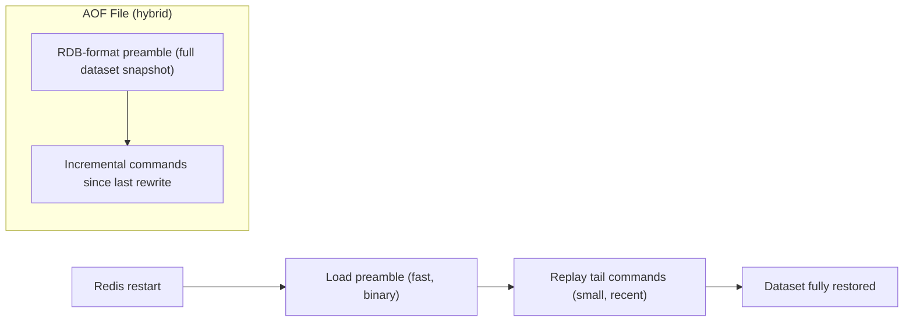

### Persistence Trade-offs

Choosing between RDB, AOF, hybrid, or no persistence at all comes down to how much data loss is acceptable versus how much I/O overhead, disk space, and restart time the workload can tolerate. A pure cache in front of a system of record can safely disable persistence entirely, since a restart simply means repopulating from the source database on subsequent cache misses. A Redis instance holding data with no other copy (e.g., a queue, a rate-limiter's state, or a primary session store) needs AOF (or hybrid) with at least `everysec` fsync to bound potential loss to about one second of writes.

| Strategy | Data loss window | Restart speed | Disk overhead | When to use |
|---|---|---|---|---|
| None (`save ""`, `appendonly no`) | Everything since last restart | N/A (empty on start) | None | Pure cache with a reliable source of truth |
| RDB only | Up to the save-point interval | Fast (binary load) | Low (single compact file) | Backups, acceptable to lose minutes of data |
| AOF only (`everysec`) | ~1 second | Slower (replay log) | Higher (grows until rewrite) | Durability-sensitive data, no RDB needed |
| AOF only (`always`) | ~0 (every write fsynced) | Slower | Highest I/O overhead | Extreme durability needs, latency cost accepted |
| Hybrid (AOF + RDB preamble) | ~1 second | Fast (binary preamble + small tail) | Moderate | Recommended default for most production systems |

### Backup and Restore

Backing up Redis is straightforward because RDB snapshots are just files: trigger a `BGSAVE`, then copy the resulting `dump.rdb` (and/or the `appendonlydir` if AOF is enabled) to durable storage (S3, a backup server, etc.) on a schedule. Restoring is the reverse — place the backup file(s) in the configured `dir` before starting Redis, and it will load them automatically on startup.

For point-in-time recovery in a replicated setup, it's common to trigger backups against a **replica** rather than the primary, avoiding any `fork()`/I/O impact on the node serving live production traffic. Always verify restores periodically (e.g., load a backup into a scratch instance and sanity-check key counts) rather than trusting an untested backup pipeline.

```bash
# Trigger a snapshot and copy it off-box
redis-cli -h redis-replica.internal BGSAVE
scp redis-replica.internal:/var/lib/redis/dump.rdb ./backups/dump-$(date +%F).rdb

# Restore: stop Redis, place the file, start Redis
cp ./backups/dump-2026-08-01.rdb /var/lib/redis/dump.rdb
systemctl restart redis
redis-cli DBSIZE   # sanity check after restore
```

```bash
# Backing up AOF instead/in addition
redis-cli BGREWRITEAOF
tar -czf aof-backup-$(date +%F).tar.gz /var/lib/redis/appendonlydir
```

### AOF Rewrite (BGREWRITEAOF)

Because AOF logs every write command, the file would grow unbounded over time — including redundant history, like a key that was incremented a thousand times and then deleted, all of which is irrelevant once you only care about the current state. `BGREWRITEAOF` compacts the AOF by writing a new, minimal file representing the current dataset (using the RDB-preamble format in hybrid mode) and atomically replacing the old file once complete — exactly analogous to `BGSAVE`, using a forked child process so the main thread keeps serving traffic.

Redis can also trigger this automatically based on `auto-aof-rewrite-percentage` and `auto-aof-rewrite-min-size`, which fire a rewrite once the AOF has grown by a configured percentage since the last rewrite, past a minimum size threshold — preventing rewrites from firing constantly on a small, fast-growing-but-still-tiny file.

```conf
auto-aof-rewrite-percentage 100
auto-aof-rewrite-min-size 64mb
```

```bash
redis-cli BGREWRITEAOF
redis-cli INFO persistence | grep aof_rewrite
```

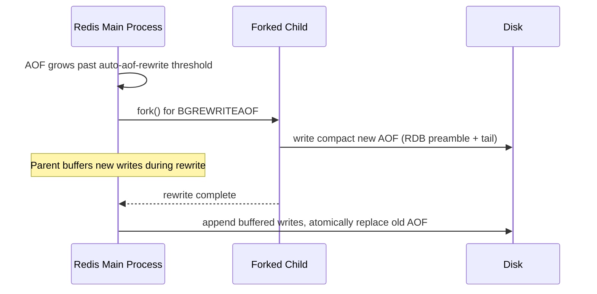

### Interview Questions

1. What is the difference between RDB and AOF persistence in Redis?
2. How does `BGSAVE` avoid blocking the main Redis process while writing a snapshot?
3. What role does `fork()` and copy-on-write memory play in RDB and AOF rewrites?
4. What does `appendfsync everysec` mean, and why is it the recommended default over `always` or `no`?
5. What is hybrid AOF persistence, and what problem does the RDB preamble solve?
6. What are the trade-offs between enabling persistence and running Redis purely as a cache with no persistence?
7. How would you recover a Redis instance from a backup after a total data loss?
8. Why would you take backups from a replica rather than the primary?
9. What triggers an automatic AOF rewrite, and what do `auto-aof-rewrite-percentage`/`auto-aof-rewrite-min-size` control?
10. What data-loss window would you expect with RDB-only persistence versus AOF with `everysec`?
11. How would you verify that a Redis backup is actually restorable before you need it in an emergency?
12. Why might a rewrite of the AOF file be necessary even though the file is technically "correct" as-is?
13. What happens to new writes that arrive while a `BGREWRITEAOF` or `BGSAVE` is in progress?
14. If you needed the absolute minimum risk of data loss, what persistence configuration would you choose, and what's the cost?
15. How does persistence configuration differ between a Redis node used purely as a cache versus one acting as a system of record?

## Memory Management

### Memory Allocation

Redis is an in-memory data store, which means every key, value, and internal data structure lives in RAM for the lifetime of the process (persistence to disk is a separate, asynchronous concern). Redis does not implement its own low-level memory allocator from scratch; instead it delegates raw allocation to a pluggable allocator, defaulting to **jemalloc** on Linux (a general-purpose allocator originally developed for FreeBSD/Facebook workloads) because it handles fragmentation and small-object allocation patterns better than the glibc allocator for Redis's typical workload of many small, short-lived objects. On macOS builds, Redis typically falls back to the system's `libc` allocator.

Every Redis object (a `String`, `Hash`, `List`, `Set`, `ZSet`, `Stream`, etc.) is wrapped in a `robj` (Redis Object) structure that carries type, encoding, refcount, and LRU/LFU metadata alongside the raw payload — so the "cost" of a key is always larger than just the bytes of its value. Understanding this overhead matters for capacity planning: a Redis instance holding a million tiny integers can still consume hundreds of megabytes because of per-object bookkeeping, pointers, and allocator rounding (jemalloc allocates memory in fixed-size classes, so a 17-byte request might actually consume a 32-byte slot).

```bash
# Inspect how much memory Redis believes it is using, and how the allocator is configured
redis-cli INFO memory

# Key fields to look at:
#   used_memory_human          -> memory used by Redis data + overhead
#   used_memory_rss_human      -> actual physical memory the OS says Redis is using
#   mem_allocator               -> jemalloc / libc
#   maxmemory_human             -> configured hard cap (0 = unlimited)
```

```conf
# redis.conf - cap Redis at 2GB of used memory and pick jemalloc explicitly at build time
maxmemory 2gb
maxmemory-policy noeviction
```

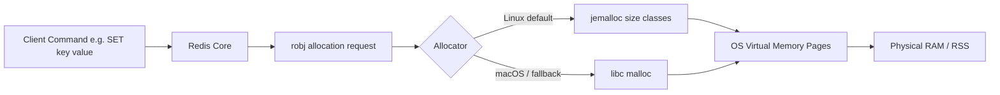

**Production scenario:** When sizing a Redis instance for a session store holding 5 million sessions of ~500 bytes each, naive math suggests 2.5 GB, but real-world sizing must budget an extra 30-50% for per-key overhead, allocator fragmentation, and replication buffers — under-provisioning `maxmemory` here leads to unexpected evictions or OOM errors under load.

### Memory Usage

Redis exposes several tools to introspect exactly how memory is spent, which is essential before choosing an eviction policy or deciding whether to shard/scale. The `MEMORY USAGE` command reports the number of bytes a specific key (including its value, encoding overhead, and key name) consumes, while `MEMORY STATS` gives a global breakdown (dataset size, replication backlog, client output buffers, Lua scripts cache, etc.) and `MEMORY DOCTOR` gives a human-readable diagnostic opinion about the instance's health.

Data type **encoding** heavily influences memory usage. Redis uses compact encodings for small collections — e.g., a `Hash` with few fields and short values is stored as a `listpack` (a flat, cache-friendly byte array) rather than a full hash table; once it crosses `hash-max-listpack-entries`/`hash-max-listpack-value` thresholds, Redis converts it to a proper hash table, which uses significantly more memory per entry but offers O(1) access at scale. The same pattern applies to `Sets` (`intset`/`listpack` vs `hashtable`) and `Sorted Sets` (`listpack` vs `skiplist`).

```bash
# Per-key memory footprint
redis-cli MEMORY USAGE user:1001

# Check the internal encoding Redis chose for a key
redis-cli OBJECT ENCODING user:1001
# -> "listpack" (small hash) or "hashtable" (large hash)

# Global memory breakdown
redis-cli MEMORY STATS

# Human readable health check
redis-cli MEMORY DOCTOR

# Find the largest keys in the keyspace (sampling scan, safe for production)
redis-cli --bigkeys
```

**Production scenario:** Before migrating a product catalog cache from a single Redis node to Redis Cluster, an SRE team runs `redis-cli --bigkeys` and `MEMORY USAGE` across a sample of keys to estimate per-shard memory needs and to catch pathological cases (e.g., a single `Hash` accidentally holding an entire catalog as one giant key, which would create a hot, oversized shard).

### Eviction Policies

When Redis's used memory reaches the configured `maxmemory` limit, it must decide what to do with new write commands. This behavior is controlled by `maxmemory-policy`, and Redis supports eight policies, split across two dimensions: **which keys are eligible for eviction** (all keys vs only keys with a TTL) and **which algorithm picks the victim** (LRU, LFU, random, or TTL-based).

| Policy | Eligible Keys | Eviction Strategy |
|---|---|---|
| `noeviction` | none | Returns an error on writes once memory is full; reads still work |
| `allkeys-lru` | all keys | Evicts the least recently used key |
| `volatile-lru` | keys with TTL only | Evicts the least recently used key among those with an expiry |
| `allkeys-lfu` | all keys | Evicts the least frequently used key |
| `volatile-lfu` | keys with TTL only | Evicts the least frequently used key among those with an expiry |
| `allkeys-random` | all keys | Evicts a random key |
| `volatile-random` | keys with TTL only | Evicts a random key among those with an expiry |
| `volatile-ttl` | keys with TTL only | Evicts the key with the nearest expiration time |

Eviction is not a background sweep — it happens lazily, inline with the command that would push memory over the limit. Redis checks memory usage before executing a write, and if over budget, it evicts keys (according to policy) until enough memory is freed or there is nothing left to evict, then proceeds with (or rejects) the original command.

```bash
redis-cli CONFIG SET maxmemory 100mb
redis-cli CONFIG SET maxmemory-policy allkeys-lru
redis-cli CONFIG GET maxmemory-policy
```

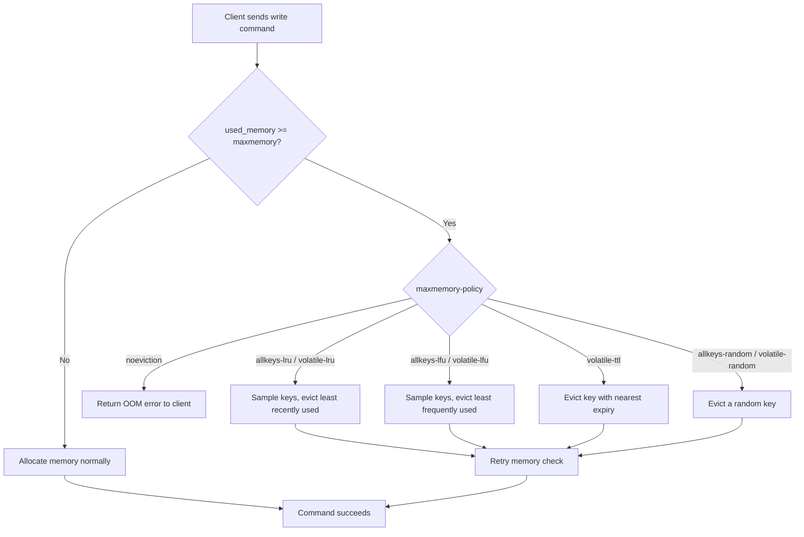

**Production scenario:** A pure caching layer (nothing else depends on the data surviving) typically runs `allkeys-lru` or `allkeys-lfu` so Redis can reclaim any key. A Redis instance that mixes cache data (with TTLs) and important operational data (without TTLs, e.g., feature flags) should use a `volatile-*` policy so the eviction never touches the keys without an expiry.

### LRU

Redis does not implement textbook, perfectly accurate LRU (which would require a doubly linked list reordered on every access — too expensive at Redis's scale). Instead it implements **approximated LRU** using random sampling: each `robj` stores a 24-bit "last access" clock value, updated whenever the key is touched. When eviction is needed, Redis randomly samples a small pool of keys (controlled by `maxmemory-samples`, default 5) and evicts whichever sampled key has the oldest access time. Increasing `maxmemory-samples` makes the approximation closer to true LRU at the cost of extra CPU per eviction; Redis also maintains a small "eviction pool" of candidate keys across invocations to further improve accuracy without full-table scans.

```bash
redis-cli CONFIG SET maxmemory-policy allkeys-lru
redis-cli CONFIG SET maxmemory-samples 10   # closer to true LRU, more CPU cost

# Inspect how long (in seconds) a key has been idle - i.e. not read/written
redis-cli OBJECT IDLETIME session:abc123
```

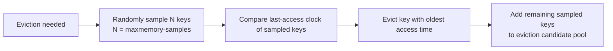

**Production scenario:** A leaderboard-adjacent session cache using `allkeys-lru` with the default `maxmemory-samples 5` is usually good enough; a small business increases it to 10 only after observing (via `MEMORY DOCTOR` and hit-rate metrics) that too many "warm" keys were being evicted under memory pressure.

### LFU

Introduced in Redis 4.0, LFU (Least Frequently Used) tracks *access frequency* instead of *recency*, which better protects keys that are accessed constantly but might have a large gap between two specific accesses (LRU would otherwise mistakenly evict them). Redis implements this with a compact **probabilistic counter** (a Morris-style logarithmic counter) packed into the same 24 bits normally used for the LRU clock — an exact counter would need far more memory per key, so Redis trades a small amount of accuracy for massive memory savings. The counter increases probabilistically (higher counts require more accesses to increment further, following a logarithmic curve controlled by `lfu-log-factor`), and it periodically **decays** over time (rate controlled by `lfu-decay-time`) so that keys that were hot yesterday but are cold today gradually become eligible for eviction again.

```bash
redis-cli CONFIG SET maxmemory-policy allkeys-lfu
redis-cli CONFIG SET lfu-log-factor 10   # higher = counter grows more slowly (favors precision at high freq)
redis-cli CONFIG SET lfu-decay-time 1    # minutes; higher = frequency counters decay more slowly

# Inspect a key's current logarithmic access frequency counter (0-255)
redis-cli OBJECT FREQ product:catalog:42
```

| Aspect | LRU | LFU |
|---|---|---|
| Tracks | Recency of access (when) | Frequency of access (how often) |
| Good for | Bursty, time-clustered access patterns | Steady, frequently-hit "hot" keys with irregular gaps |
| Risk | Evicts frequently-used keys accessed just slightly less recently | Slow to "forget" keys that were hot but are now cold (mitigated by decay) |
| Redis storage cost | 24-bit access timestamp | 24-bit probabilistic frequency counter |
| Config knobs | `maxmemory-samples` | `lfu-log-factor`, `lfu-decay-time` |

**Production scenario:** A product catalog cache where a small set of best-selling SKUs are read thousands of times per minute, interspersed with sporadic long-tail SKU lookups, benefits from `allkeys-lfu` — pure LRU could evict a best-seller simply because it wasn't the *most recent* access, whereas LFU correctly keeps it resident due to its high access count.

### Volatile vs AllKeys Policies

This is the axis that decides **which keys are even considered** for eviction, independent of the algorithm (LRU/LFU/random/TTL). `allkeys-*` policies treat every key in the keyspace as fair game, regardless of whether it has a TTL set — appropriate when the entire Redis instance is a disposable, rebuildable cache. `volatile-*` policies restrict eviction candidates to only keys that have an expiration set via `EXPIRE`/`SET ... EX`/`PEXPIRE`; keys without a TTL are treated as "permanent" and are never evicted (though they can still consume memory that leads to `noeviction`-style OOM if no volatile keys remain to evict).

```bash
# Instance used purely as a cache -> anything can be evicted
redis-cli CONFIG SET maxmemory-policy allkeys-lru

# Instance mixing cache entries (with TTL) and durable data (no TTL, e.g. counters, flags)
redis-cli CONFIG SET maxmemory-policy volatile-lru

redis-cli SET feature:flag:new-checkout "on"          # no TTL -> never evicted under volatile-*
redis-cli SET session:xyz "..." EX 1800                # has TTL -> eligible for eviction under volatile-*
```

**Production scenario:** A shared Redis instance storing both short-lived rate-limit counters (with TTL) and long-lived application configuration (no TTL) should use `volatile-lru` rather than `allkeys-lru`, so that a spike of rate-limit keys can never accidentally evict configuration data — though the safer long-term fix is to run separate Redis instances/databases for concerns with different durability requirements.

### Memory Fragmentation

Memory fragmentation is the gap between memory Redis *thinks* it's using (`used_memory`) and the memory the operating system has actually reserved for the process (`used_memory_rss`, Resident Set Size). Redis reports this as `mem_fragmentation_ratio = used_memory_rss / used_memory`. A ratio close to `1.0` is healthy. A ratio significantly above `1.0` (e.g., `1.5`+) indicates fragmentation — often caused by frequent allocation/deallocation of variably-sized objects (allocators leave unusable gaps between allocated blocks) or by large keys being deleted/resized repeatedly. A ratio **below** `1.0` is actually a more alarming signal: it means the OS has swapped some of Redis's memory to disk, which will cause severe latency spikes on access.

Since Redis 4.0, an **active defragmentation** feature can reclaim fragmented memory in the background without blocking clients, by incrementally moving data to more compact allocations when jemalloc supports it.

```bash
redis-cli INFO memory | grep -E "used_memory:|used_memory_rss:|mem_fragmentation_ratio"
# used_memory:1073741824
# used_memory_rss:1717986918
# mem_fragmentation_ratio:1.60   <- meaningful fragmentation, consider active defrag

redis-cli CONFIG SET activedefrag yes
redis-cli CONFIG SET active-defrag-ignore-bytes 100mb
redis-cli CONFIG SET active-defrag-threshold-lower 10
```

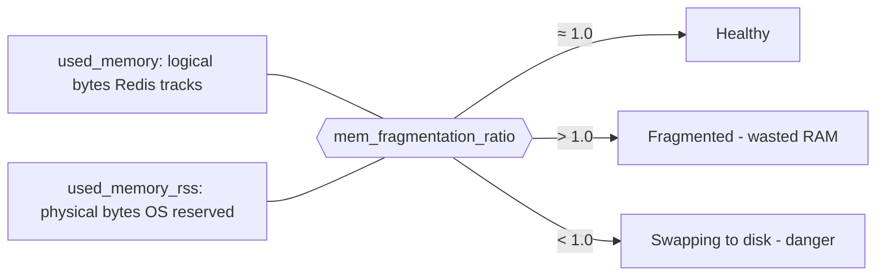

**Production scenario:** After a workload that repeatedly writes and deletes large `Hash` objects of varying sizes (e.g., ephemeral shopping carts), an on-call engineer notices `used_memory_rss` is 1.6x `used_memory` in `INFO memory`, and enables `activedefrag` rather than immediately provisioning more RAM, since the fragmentation — not real dataset growth — was inflating the container's memory footprint.

### Interview Questions

- What is the difference between `used_memory` and `used_memory_rss`, and what does a high `mem_fragmentation_ratio` indicate?
- Why does Redis use jemalloc instead of the default glibc allocator on Linux?
- Explain all eight `maxmemory-policy` options and when you would choose each.
- What happens to write commands when `maxmemory` is reached and the policy is `noeviction`?
- How does Redis approximate LRU without maintaining a true access-ordered linked list?
- What is `maxmemory-samples` and how does increasing it affect accuracy vs performance?
- How does Redis's LFU counter work, and what role do `lfu-log-factor` and `lfu-decay-time` play?
- When would you choose LFU over LRU, or vice versa?
- What is the difference between `allkeys-*` and `volatile-*` eviction policies?
- Why might a Redis instance still hit `noeviction` OOM errors even with `volatile-lru` configured?
- How can you inspect the internal encoding of a key, and why does encoding affect memory usage?
- What tools would you use to find the largest keys in a production Redis instance safely?
- What is active defragmentation and when should it be enabled?
- If `mem_fragmentation_ratio` is below 1.0, what does that suggest, and why is it worse than a high ratio?
- How would you estimate the memory required to store N sessions of a known average size in Redis?

## Transactions

### Transaction Basics

A Redis transaction lets a client group multiple commands so that they are executed **sequentially and without interruption** from other clients, as a single unit. This is fundamentally different from the ACID transactions of a relational database: Redis transactions guarantee **isolation** (no other client's commands can interleave in the middle of your transaction, because Redis processes commands single-threaded) and **atomic execution as a batch**, but they do **not** provide rollback on runtime errors, and they don't offer configurable isolation levels or durability guarantees beyond Redis's normal persistence settings (RDB/AOF).

The transaction lifecycle has three phases: **queueing** (commands issued after `MULTI` are buffered per-connection rather than executed immediately), **execution** (`EXEC` runs every queued command back-to-back, uninterrupted by any other client), and **completion** (the client receives an array of replies, one per queued command, in order). If `EXEC` is never called (e.g., connection drops), the queued commands are discarded and never applied — nothing happens silently.

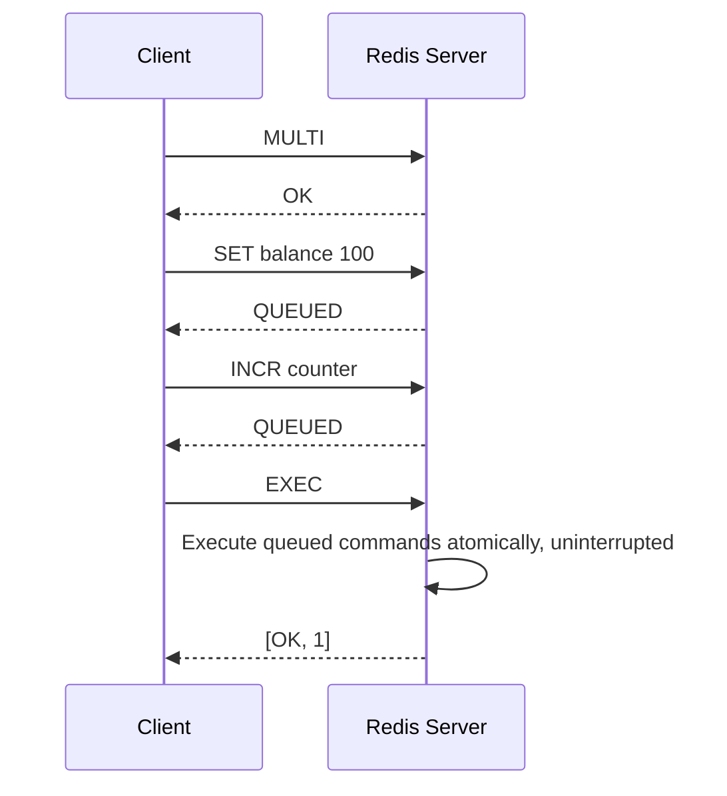

**Production scenario:** An order-processing service increments an inventory counter and writes an order-status key together; wrapping both in `MULTI`/`EXEC` guarantees no other client's command can be interleaved between the two writes, even though Redis offers no rollback if, say, the second command targets the wrong type.

### MULTI

`MULTI` marks the start of a transaction block on the current connection. After issuing `MULTI`, every subsequent command is not executed immediately — Redis validates its syntax, buffers it, and replies `QUEUED` instead of the command's normal reply. The actual execution is deferred until `EXEC` is called.

```bash
redis-cli
> MULTI
OK
> SET user:1:status "active"
QUEUED
> INCR user:1:login_count
QUEUED
> EXPIRE user:1:status 3600
QUEUED
```

Commands with obvious syntax errors at queue time (e.g., wrong number of arguments) cause Redis to flag the transaction; calling `EXEC` in that case aborts the entire transaction without running *any* queued command — this is the one case where Redis does refuse to execute a malformed transaction as a whole.

### EXEC

`EXEC` executes every command queued since `MULTI`, and Redis guarantees that no other client's command is processed in between — because Redis's command execution is single-threaded, once `EXEC` starts running the queued commands, they run to completion as an uninterrupted batch. The reply to `EXEC` is an array containing the reply of each queued command in the order they were queued.

```bash
> EXEC
1) OK
2) (integer) 5
3) (integer) 1
```

Crucially, if an individual command fails at **runtime** (e.g., `INCR` on a key holding a string that isn't numeric), Redis does **not** abort the transaction or roll back preceding commands — the error is reported only for that specific command's slot in the reply array, and every other queued command still executes. This is a common interview trap: Redis transactions are about *atomic scheduling*, not *all-or-nothing correctness*.

### DISCARD

`DISCARD` cancels a transaction that is currently being built with `MULTI`, throwing away all commands queued so far and returning the connection to its normal (non-transactional) state. No queued command is executed.

```bash
> MULTI
OK
> SET tempkey "value"
QUEUED
> DISCARD
OK
> GET tempkey
(nil)   # SET was never applied
```

**Production scenario:** A client library wraps a business operation in `MULTI`; if an application-level precondition check fails after some commands were already queued (but before `EXEC`), the client issues `DISCARD` to safely abandon the whole batch rather than executing a partial or invalid operation.

### WATCH

`WATCH` implements **optimistic locking** for Redis transactions. A client calls `WATCH key1 key2 ...` before `MULTI`; if any watched key is modified (by any client, including itself, between the `WATCH` and the `EXEC`) then Redis aborts the transaction, and `EXEC` returns a `nil` reply instead of running the queued commands. This lets a client implement **check-and-set** semantics: read a value, decide what to write based on it, and only commit if nothing changed it in the meantime.

```bash
# Client A - a compare-and-swap style balance transfer
redis-cli
> WATCH balance:acct1
OK
> GET balance:acct1
"100"
> MULTI
OK
> DECRBY balance:acct1 30
QUEUED
> EXEC
# If another client modified balance:acct1 between WATCH and EXEC:
(nil)
# Application must retry the whole read-modify-write sequence
```

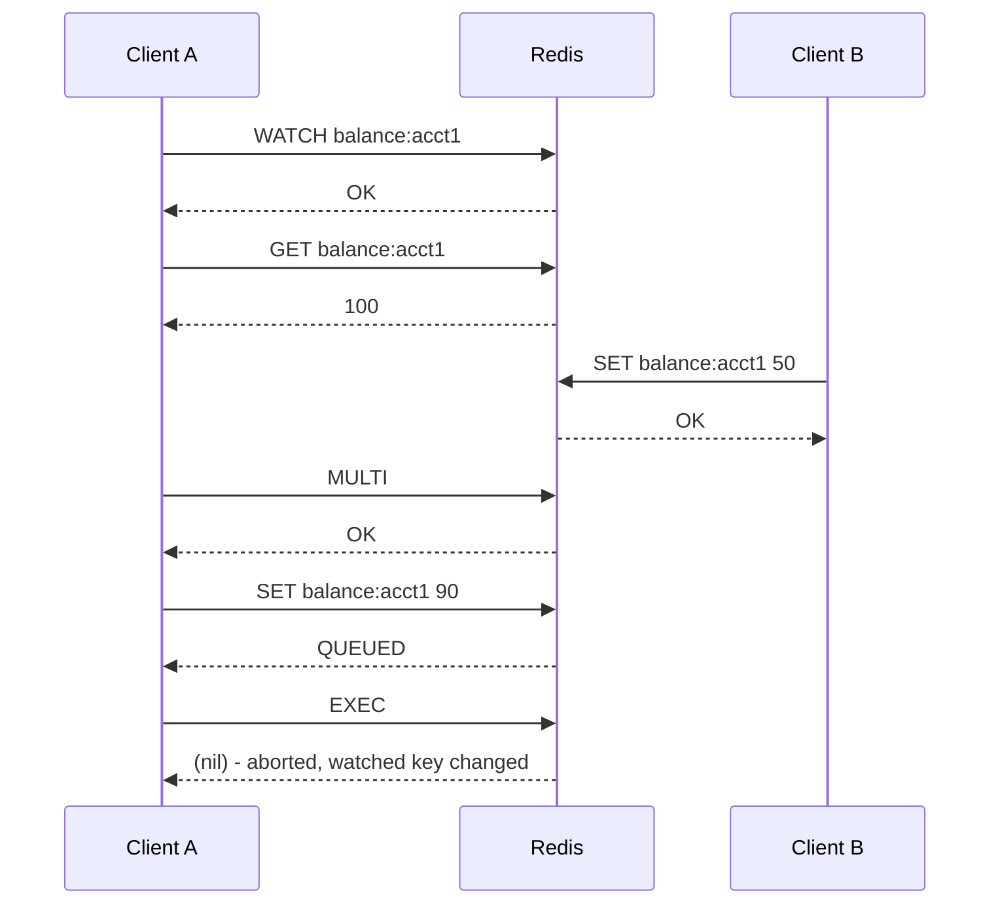

```java
// Spring Data Redis: optimistic locking with WATCH via SessionCallback
RedisTemplate<String, String> redisTemplate = ...;

String result = redisTemplate.execute(new SessionCallback<String>() {
    @Override
    public String execute(RedisOperations operations) {
        operations.watch("balance:acct1");
        String current = (String) operations.opsForValue().get("balance:acct1");
        int newBalance = Integer.parseInt(current) - 30;

        operations.multi();
        operations.opsForValue().set("balance:acct1", String.valueOf(newBalance));
        List<Object> execResult = operations.exec();

        return execResult.isEmpty() ? "RETRY_NEEDED" : "OK";
    }
});
```

### Optimistic Locking

Redis's optimistic locking pattern combines `WATCH` + `MULTI` + `EXEC` to implement compare-and-swap (CAS) logic without ever holding an actual server-side lock. The client optimistically assumes no conflict will occur, reads the current state, computes the new state client-side, and submits the write transactionally — Redis itself checks (cheaply, via internal version/touch tracking on watched keys) whether the assumption held. If a conflicting write happened, `EXEC` fails harmlessly and the client is expected to **retry** the entire read-compute-write cycle, typically in a bounded loop with backoff.

This contrasts with **pessimistic locking** (e.g., an explicit `SET lock:key token NX PX ttl` distributed lock), where a client acquires exclusive access *before* reading/modifying data and blocks or waits for other clients.

| Aspect | Optimistic (`WATCH`/`MULTI`/`EXEC`) | Pessimistic (Distributed Lock) |
|---|---|---|
| Conflict handling | Detect after the fact, then retry | Prevent up front by blocking others |
| Contention cost | Cheap when conflicts are rare | Cost paid on every access, even without conflicts |
| Best for | Low-contention, fast read-modify-write cycles | High-contention or long-running critical sections |
| Failure mode | `EXEC` returns nil, client retries | Lock acquisition times out / blocks |

```bash
# Typical client-side retry loop pseudocode
while attempts_left:
    WATCH key
    value = GET key
    MULTI
    SET key new_value
    result = EXEC
    if result is not nil:
        break  # success
    attempts_left -= 1
```

**Production scenario:** A flash-sale inventory decrement (limited stock, many concurrent buyers) uses `WATCH`/`MULTI`/`EXEC` in a retry loop rather than a distributed lock, since most attempts won't conflict and optimistic locking avoids the overhead and failure modes of lock management under bursty traffic.

### Transaction Limitations

Redis transactions are intentionally lightweight, and this brings real limitations engineers must design around:

- **No rollback on runtime errors** — if the third of five queued commands fails at runtime (e.g., type mismatch), the first, second, fourth, and fifth commands still execute. There is no automatic undo.
- **No nested transactions** — calling `MULTI` while already inside a `MULTI` block returns an error; Redis has no concept of savepoints or nested transaction scopes.
- **All-or-nothing only applies to queue-time errors** — a malformed command (bad arity, unknown command) discovered while queueing marks the whole transaction as "dirty," and `EXEC` will refuse to run any of it, returning an `EXECABORT` error. This is different from a runtime error, which is command-specific.
- **No complex control flow** — you cannot make a queued command's behavior depend on the result of an earlier command within the same transaction (there's no "if the previous SET succeeded, then..."). For that kind of conditional, atomic, multi-step logic, **Lua scripting** (`EVAL`/`EVALSHA`) or **Redis Functions** (Redis 7+) are the correct tool, since a script executes as a single atomic unit with full access to intermediate results.
- **Long transactions block the server** — because Redis is single-threaded, a transaction with many commands (or one operating on very large data structures) blocks all other clients for its duration.

```bash
# EXECABORT example - a syntax error at queue time aborts the whole transaction
> MULTI
OK
> SET key1 value1
QUEUED
> NOTACOMMAND
(error) ERR unknown command 'NOTACOMMAND'
> EXEC
(error) EXECABORT Transaction discarded because of previous errors.
```

### Interview Questions

- How do Redis transactions differ from ACID transactions in a relational database?
- Walk through the lifecycle of `MULTI`, queued commands, and `EXEC`.
- What happens if a command queued inside a transaction fails at runtime? Does Redis roll back?
- What is `EXECABORT` and when is it triggered?
- What does `DISCARD` do, and when would you use it?
- Explain how `WATCH` implements optimistic locking. What causes `EXEC` to return `nil`?
- Compare optimistic locking (`WATCH`/`MULTI`/`EXEC`) with a pessimistic distributed lock — when would you choose each?
- Why can't you nest `MULTI` blocks in Redis?
- Why are Lua scripts sometimes preferred over `MULTI`/`EXEC` transactions?
- Can a client watch a key, and then have another one of its *own* commands (not from another client) invalidate the watch? Explain.
- What is the isolation guarantee that Redis's single-threaded model provides for transactions, and what are its limits?
- How would you design a retry loop around `WATCH`/`MULTI`/`EXEC` for a high-contention key?
- What happens to queued commands if the client connection drops before `EXEC`?

## Concurrency and Atomicity

### Single-Threaded Execution Model

The core of Redis processes commands using a **single thread** running an event loop, historically built on a multiplexing mechanism like `epoll` (Linux) or `kqueue` (macOS/BSD) — architecturally similar in spirit to Node.js. All client connections are multiplexed onto this one thread: Redis waits for a socket to become readable, reads the command, executes it against the in-memory dataset, writes the reply, and moves to the next ready socket. Because command execution itself never runs concurrently with another command, **every single Redis command is inherently atomic** with respect to other commands — there is no possibility of two commands interleaving mid-execution the way there could be with genuinely parallel threads mutating shared memory.

Since Redis 6.0, Redis added optional **I/O threading** (`io-threads` config) to parallelize the *network* read/parse/write work across multiple threads, since that had become a bottleneck at very high throughput — but the actual execution of commands against the dataset remains strictly single-threaded. This distinction is important: I/O threading improves network throughput, not command concurrency or atomicity guarantees, which continue to hold exactly as before.

The single-threaded model has a critical operational implication: any command that takes a long time to execute **blocks every other client** for that duration, since there's no other thread to service them. Commands like `KEYS *` (full keyspace scan), `FLUSHALL`, `SMEMBERS` on a huge set, or a poorly-written Lua script/`EVAL` can cause noticeable latency spikes across the entire system. This is why Redis provides non-blocking alternatives like `SCAN` (cursor-based, incremental iteration) instead of `KEYS`.

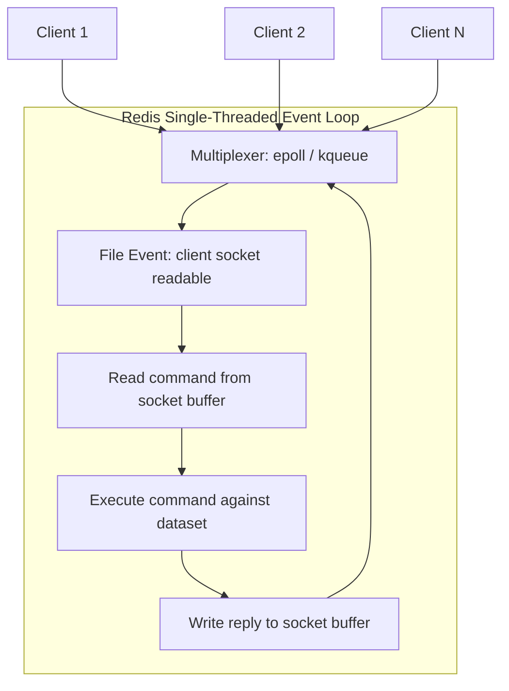

```bash
# Bad: blocks the single thread while scanning the entire keyspace
redis-cli KEYS "user:*"

# Good: non-blocking, incremental cursor-based iteration
redis-cli SCAN 0 MATCH "user:*" COUNT 100
```

**Production scenario:** A team debugging periodic latency spikes discovers a scheduled job calling `KEYS pattern:*` on a database with millions of keys every few minutes — replacing it with `SCAN` eliminates the blocking behavior since `SCAN` processes the keyspace incrementally across many small non-blocking calls.

### Atomic Operations

Because of the single-threaded execution model, every individual Redis command executes atomically — nothing else can observe or mutate the dataset mid-command. Redis leverages this heavily by providing compound commands that perform what would otherwise be a "read, compute, write" sequence as one atomic step: `INCR`/`INCRBY`/`DECRBY`/`HINCRBY` (atomic increment), `GETSET`/`GETDEL` (atomic read-and-replace / read-and-delete), `SETNX` and `SET key value NX` (atomic "set only if not exists"), `SET key value XX` (set only if exists), and `RPOPLPUSH`/`LMOVE` (atomic move between lists, useful for reliable queues).

```bash
# Atomic counter - safe even with thousands of concurrent clients
redis-cli INCR page:views:home

# Atomic "acquire if absent" - classic building block for simple locks
redis-cli SET lock:job:42 "worker-7" NX PX 10000

# Atomic move - pop from one list and push to another as a single step (reliable queue pattern)
redis-cli RPOPLPUSH queue:pending queue:processing
```

It's important to recognize the boundary of this atomicity: a **single command** is atomic, but a **sequence of separate commands issued by the client** (e.g., `INCR` followed by a separate `EXPIRE` call) is *not* atomic as a pair — another client's command could execute between them. For that, you need `MULTI`/`EXEC`, a Lua script, or (as of Redis 7) `SET key value EX seconds` style combined options where available, or `GETEX`.

```bash
# NOT atomic as a pair - a crash/race between these two lines leaves a key with no TTL
redis-cli INCR rate_limit:user:42
redis-cli EXPIRE rate_limit:user:42 60

# Better - do it in a single Lua script (atomic) or use SET with options where the command supports it
redis-cli EVAL "local c = redis.call('INCR', KEYS[1]) if c == 1 then redis.call('EXPIRE', KEYS[1], ARGV[1]) end return c" 1 rate_limit:user:42 60
```

**Production scenario:** A per-user API rate limiter increments a counter key per request; using `INCR` alone guarantees the counter itself is race-free, but setting the TTL only on the *first* request of the window requires wrapping the increment-then-conditionally-expire logic in a Lua script to keep the whole sequence atomic.

### Race Conditions

Even though every single Redis command is atomic, a **race condition** can still occur whenever application logic performs a *read, then decide, then write* sequence using multiple separate round trips, because another client's write can slip in between the read and the write. The classic example: two clients both `GET` a balance of 100, each independently computes a new balance in application code, and each issues a separate `SET` — the second `SET` silently overwrites the first, and one of the two updates is lost, even though each individual `GET`/`SET` was itself atomic.

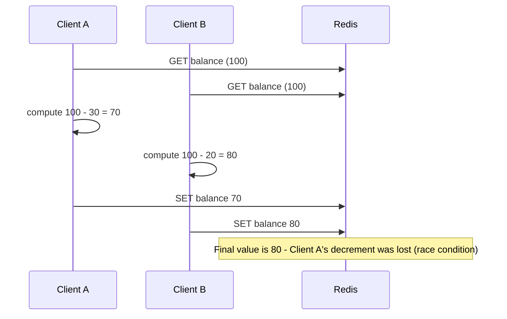

Redis provides three main tools to eliminate this class of race condition, each with different trade-offs already discussed elsewhere in this document:

1. **Use an atomic single command** instead of read-then-write when possible (e.g., `DECRBY balance 30` instead of `GET`+compute+`SET`).
2. **Optimistic locking** with `WATCH`/`MULTI`/`EXEC` when the write logic is too complex for a single atomic command but conflicts are rare.
3. **Lua scripting / distributed locks** when you need guaranteed atomic multi-step logic or need to coordinate across processes with genuinely complex critical sections.

**Production scenario:** A "first come, first served" ticket-booking system that reads remaining ticket count, checks if `> 0`, and decrements, must not use plain `GET` + `DECR` — it should use `DECR` directly with a post-check-and-rollback pattern, or a Lua script that atomically checks-and-decrements, to avoid overselling under concurrent bookings.

### Distributed Locks (Concept)

A distributed lock coordinates exclusive access to a resource across multiple, independent application processes (potentially on different machines) — something a language-level `synchronized` block or in-process mutex cannot do, since those only protect against contention within a single process. Redis is commonly used to implement distributed locks because `SET key value NX PX ttl` is atomic: it sets the key only if it doesn't already exist, with an expiry, in a single round trip, meaning only one client can "win" the lock at a time even if many request it simultaneously.

A safe implementation requires two extra details beyond the basic `SET ... NX PX`: the lock's **value must be a unique token** per lock holder (e.g., a UUID), and **releasing the lock must verify the token before deleting**, using a small Lua script executed atomically — otherwise a client could delete a lock it no longer owns (e.g., after its own TTL expired and a different client acquired it in the meantime).

```bash
# Acquire: only succeeds if the key does not already exist; auto-expires after 30s as a safety net
redis-cli SET lock:order:123 "client-uuid-9f8e" NX PX 30000

# Safe release - only delete if the value still matches our token (avoids deleting someone else's lock)
redis-cli EVAL "if redis.call('GET', KEYS[1]) == ARGV[1] then return redis.call('DEL', KEYS[1]) else return 0 end" 1 lock:order:123 client-uuid-9f8e
```

```java
// Using Redisson (a popular Java Redis client with a proper RLock implementation)
RedissonClient redisson = Redisson.create(config);
RLock lock = redisson.getLock("lock:order:123");

lock.lock(30, TimeUnit.SECONDS);  // auto-expiring, safe unlock handled internally
try {
    processOrder(orderId);
} finally {
    lock.unlock();
}
```

**Production scenario:** Two instances of a scheduled batch job (deployed for high availability) must ensure only one of them actually runs a nightly reconciliation task at a time — each instance attempts `SET lock:nightly-reconciliation <token> NX PX 300000` at startup, and only the one that acquires the lock proceeds, preventing duplicate processing.

### Redlock (Overview)

**Redlock** is an algorithm (proposed by Redis's original author) for acquiring a distributed lock with stronger guarantees than a single-instance lock, by using **multiple independent Redis masters** (typically 5, deployed without replication between them). A client attempts to acquire the same lock key/value on all N instances; it considers the lock successfully acquired only if it obtains it on a **majority** (e.g., 3 of 5) within a time budget that is small relative to the lock's TTL. This protects against a single Redis instance failing or a network partition isolating one node from causing an incorrect lock grant.

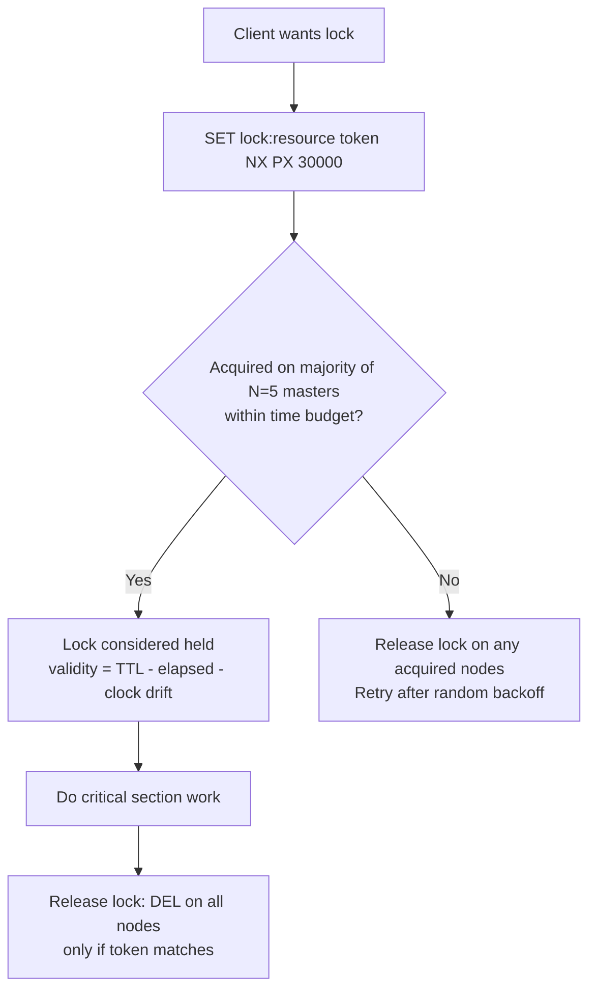

Redlock is also one of the more **debated** patterns in distributed systems circles: Martin Kleppmann published a well-known critique arguing Redlock is not safe for correctness-critical use cases, because it relies on assumptions (bounded clock drift, bounded process pauses) that don't always hold in practice — a long GC pause or clock jump could cause a client to believe it still holds a lock after it has actually expired and been granted to someone else. Redis's own documentation acknowledges this debate. The practical takeaway used in interviews and system design discussions: Redlock is reasonable for **efficiency locks** (avoiding duplicate work, best-effort deduplication), but for **correctness-critical locks** (where a violation causes real data corruption or financial loss), a system with fencing tokens and a consensus-based store (e.g., ZooKeeper, etcd) is the safer choice.

| Approach | Guarantee Strength | Complexity | Typical Use |
|---|---|---|---|
| Single-instance Redis lock (`SET NX PX`) | Best-effort, single point of failure | Low | Non-critical mutual exclusion, deduplication |
| Redlock (multiple Redis masters) | Stronger, but debated under clock/GC assumptions | Medium | Cross-node coordination where full consensus is overkill |
| ZooKeeper / etcd (consensus-based) | Strong, with fencing tokens | Higher | Correctness-critical distributed locking |

**Production scenario:** A distributed cron-like scheduler running across five Redis masters uses Redlock to decide which node runs a given job this cycle — acceptable because occasionally running a job twice (in a rare failure edge case) is a tolerable inefficiency, not a correctness violation.

### Interview Questions

- Why is every individual Redis command atomic, and how does the single-threaded event loop enable that?
- What did Redis 6's I/O threading change, and what did it *not* change about concurrency?
- Give an example of a race condition that can occur in Redis despite individual commands being atomic.
- How would you make a "check remaining stock, then decrement" operation safe under concurrency?
- Walk through how to implement a safe distributed lock using `SET key value NX PX`.
- Why is it unsafe to release a distributed lock with a plain `DEL` without checking a token first?
- What is Redlock, and how does it differ from a single-instance Redis lock?
- What is the well-known criticism of Redlock, and in what scenarios is it still considered acceptable?
- What Redis commands or patterns would you avoid because they block the single-threaded event loop?
- Why is `SCAN` preferred over `KEYS` in production?
- How do fencing tokens help address the weaknesses of naive distributed locks?
- What is the difference between atomicity and isolation in the context of a single Redis command versus a Redis transaction?

## Pub/Sub Messaging

### Publish

The `PUBLISH channel message` command sends a message to a named channel. Redis delivers it immediately to every client currently subscribed to that channel (or matching it via a pattern subscription), and the command returns the **number of clients** that received the message. Publishing to a channel with zero subscribers is a no-op — the message is not stored, queued, or delivered to anyone; it simply disappears.

```bash
redis-cli PUBLISH notifications "New order #4521 created"
# (integer) 2   <- delivered to 2 currently-connected subscribers
```

```java
// Spring Data Redis
@Autowired
private StringRedisTemplate redisTemplate;

public void notifyOrderCreated(String orderId) {
    redisTemplate.convertAndSend("notifications", "New order " + orderId + " created");
}
```

### Subscribe

`SUBSCRIBE channel [channel ...]` puts the connection into subscriber mode, where it will receive any message published to the given channel(s). A subscribed connection is largely dedicated to receiving messages — in RESP2, a subscribed client can only issue a small set of pub/sub-related commands (`SUBSCRIBE`, `UNSUBSCRIBE`, `PSUBSCRIBE`, `PUNSUBSCRIBE`, `PING`, `QUIT`) until it unsubscribes from everything; ordinary data commands are rejected on that connection. This is why applications typically use a **separate connection** for subscribing versus issuing normal commands.

```bash
redis-cli SUBSCRIBE notifications
# Reading messages... (press Ctrl-C to quit)
# 1) "subscribe"
# 2) "notifications"
# 3) (integer) 1
# ... blocks here, printing each message as it arrives ...
```

```java
// Spring Data Redis - MessageListenerContainer keeps a dedicated subscription connection
@Bean
RedisMessageListenerContainer container(RedisConnectionFactory connectionFactory) {
    RedisMessageListenerContainer container = new RedisMessageListenerContainer();
    container.setConnectionFactory(connectionFactory);
    container.addMessageListener(
        (message, pattern) -> System.out.println("Received: " + new String(message.getBody())),
        new ChannelTopic("notifications")
    );
    return container;
}
```

### Pattern Subscriptions

`PSUBSCRIBE pattern [pattern ...]` subscribes to all channels whose name matches a glob-style pattern (`*`, `?`, `[...]`), rather than one exact channel name. This is useful when the set of concrete channel names is dynamic or hierarchical (e.g., per-tenant or per-room channels) and a consumer wants to listen to all of them without subscribing individually to each.

```bash
redis-cli PSUBSCRIBE "room.*"
# Matches: room.101, room.202, room.vip, etc.

redis-cli PUBLISH room.101 "user joined"
# Delivered to any client pattern-subscribed to room.* as well as exact subscribers of room.101
```

```java
container.addMessageListener(
    (message, pattern) -> System.out.println("Pattern: " + pattern + " -> " + new String(message.getBody())),
    new PatternTopic("room.*")
);
```

### Pub/Sub Limitations

Redis Pub/Sub is intentionally simple: it is a **fire-and-forget**, **at-most-once** messaging mechanism with no persistence layer behind it. This has several concrete implications that must be understood before relying on it for anything beyond ephemeral notifications:

- **No message history/replay** — a client that subscribes *after* a message was published never sees it; there is no backlog to catch up on.
- **No durability** — if Redis restarts, or the network drops a subscriber's connection momentarily, any messages published during that gap are lost forever.
- **No acknowledgement** — publishers have no way to know whether a specific subscriber actually processed a message, only how many subscribers were connected at publish time.
- **No consumer groups / load balancing** — every subscriber gets every message; there's no built-in way to have a pool of workers each process a distinct subset of messages (unlike Streams).
- **No back-pressure handling** — a slow subscriber can accumulate an output buffer on the server side; Redis will eventually disconnect clients whose output buffer exceeds configured limits (`client-output-buffer-limit pubsub`), silently dropping any pending messages to that client.

| Feature | Pub/Sub | Redis Streams | Kafka |
|---|---|---|---|
| Delivery guarantee | At-most-once | At-least-once (with consumer groups + ack) | At-least-once / exactly-once (configurable) |
| Message persistence | None | Yes (in-memory + optional RDB/AOF) | Yes (durable log, configurable retention) |
| Replay / history | No | Yes (by ID / offset) | Yes (by offset) |
| Consumer groups | No | Yes | Yes |
| Best for | Real-time, ephemeral broadcast | Lightweight durable event log within Redis | High-throughput durable event streaming at scale |

**Production scenario:** Pub/Sub is a poor fit for "process this payment event exactly once" business logic (use Streams or a proper message broker instead), but it is an excellent fit for "invalidate this cache entry on every app server right now" or "push a live UI update to connected dashboards" — situations where missing a message occasionally due to a transient disconnect is acceptable.

### Common Use Cases

Because of its at-most-once, fire-and-forget nature, Redis Pub/Sub is best suited to scenarios where losing an occasional message is tolerable and low latency, simple fan-out is the priority:

- **Cross-instance cache invalidation** — when one application node updates data, it publishes an invalidation event so every other node's local (in-process) cache can evict the stale entry.
- **Real-time notifications** — chat messages, live comment feeds, "user is typing" indicators.
- **Live dashboards / metrics broadcasting** — pushing updated counters or gauges to connected monitoring UIs.
- **Coordinating ephemeral cluster-wide events** — e.g., signaling all application instances to reload configuration.

### Keyspace Notifications

Redis can publish Pub/Sub events automatically whenever keys are modified, expired, or deleted — a feature called **keyspace notifications**. This is disabled by default (it has a small performance cost) and must be enabled via `notify-keyspace-events`, whose value is a combination of flags selecting which event classes to publish (e.g., `K` for keyspace channel, `E` for keyevent channel, `g` generic commands, `x` expired events, `A` all events).

Two channel naming conventions are used: `__keyspace@<db>__:<key>` (published per-key, message = event name) and `__keyevent@<db>__:<event>` (published per-event-type, message = key name). A common use is reacting to key expiration to trigger cleanup or cascading logic.

```bash
# Enable notifications for expired-key events on the keyevent channel
redis-cli CONFIG SET notify-keyspace-events "Ex"

# In one terminal: subscribe to expiration events for DB 0
redis-cli SUBSCRIBE __keyevent@0__:expired

# In another terminal: set a key with a 1 second TTL
redis-cli SET session:abc123 "data" EX 1
# ~1 second later, the subscriber receives:
# 1) "message"
# 2) "__keyevent@0__:expired"
# 3) "session:abc123"
```

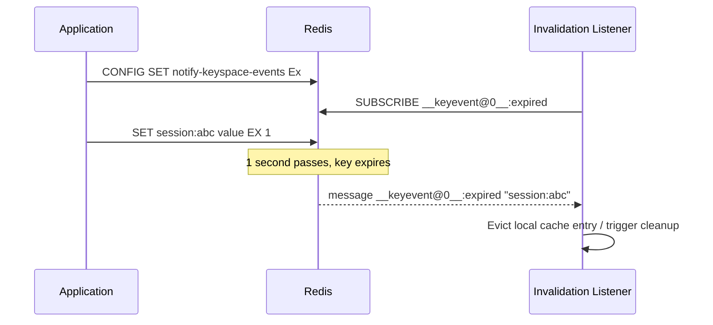

**Production scenario:** A service maintains a small in-process (L1) cache on top of Redis (L2); it subscribes to `__keyevent@0__:expired` and `__keyevent@0__:del` events so that when a key naturally expires or is explicitly deleted in Redis, the local in-process copy is evicted immediately rather than waiting for its own (longer) local TTL to lapse.

### Interview Questions

- How does `PUBLISH` know how many subscribers received a message, and what does that return value mean?
- What commands can a client issue while in subscriber mode, and why is that restricted?
- What is the difference between `SUBSCRIBE` and `PSUBSCRIBE`?
- Why is Redis Pub/Sub described as "fire-and-forget," and what are the practical consequences?
- What happens to a published message if no client is currently subscribed to that channel?
- Compare Redis Pub/Sub to Redis Streams — which delivery guarantees does each provide?
- When would you choose Kafka over Redis Pub/Sub or Streams?
- What are keyspace notifications, and how do you enable them?
- What's the difference between the `__keyspace@<db>__` and `__keyevent@<db>__` channel conventions?
- Describe a real production use case where losing a Pub/Sub message occasionally would be acceptable.
- Why can a slow subscriber cause Redis to disconnect it, and what configuration controls this?
- How would you implement cross-instance cache invalidation using Pub/Sub?

## Redis Streams

### Streams Basics

Introduced in Redis 5.0, a **Stream** is an append-only log data type — conceptually similar to a Kafka topic or a commit log, but implemented as a native Redis data structure. Each entry appended to a stream is assigned a unique, monotonically increasing **ID** of the form `<millisecondsTime>-<sequence>` (e.g., `1699999999999-0`), which doubles as both a unique identifier and a natural ordering/offset mechanism. Internally, Redis stores stream entries in a **radix tree (rax)** of "listpack" nodes for memory-efficient, ordered storage, and — unlike Pub/Sub — a stream's entries persist as part of the keyspace (subject to normal RDB/AOF persistence) until explicitly trimmed or deleted.

Unlike a `List`, which is typically used as a simple queue where entries are removed on pop, a Stream is designed to be **read non-destructively and potentially by multiple independent readers**, each tracking its own position (or, when using consumer groups, having Redis track it for them).

```bash
# Append an entry with an auto-generated ID (the *)
redis-cli XADD orders '*' order_id 4521 status "created" amount 129.99

# Read the whole stream from the beginning
redis-cli XRANGE orders - +

# Number of entries currently in the stream
redis-cli XLEN orders
```

```mermaid
flowchart LR
    A[XADD orders * order_id 4521] --> S[(Stream 'orders': append-only log)]
    B[XADD orders * order_id 4522] --> S
    C[XADD orders * order_id 4523] --> S
    S --> E1["1699999990000-0"]
    S --> E2["1699999991000-0"]
    S --> E3["1699999991000-1"]
```

**Production scenario:** An order-management service uses a Stream (instead of a `List` or Pub/Sub channel) as the backbone for an event log of order lifecycle transitions, because it needs both durability (entries aren't lost if a consumer is briefly offline) and the ability for multiple independent downstream services (billing, inventory, notifications) to each read the full history at their own pace.

### Producers

A producer appends entries with `XADD`, specifying the stream key, an ID (usually `*` to let Redis auto-generate one based on the current time, guaranteeing monotonic ordering), and one or more field-value pairs (a stream entry is essentially a small hash/dictionary of fields). `XADD` also supports `NOMKSTREAM` (fail instead of implicitly creating the stream if it doesn't exist) and inline trimming options (`MAXLEN`/`MINID`) to cap the stream's size at write time.

```bash
redis-cli XADD orders '*' order_id 4521 status created
redis-cli XADD orders NOMKSTREAM '*' order_id 4522 status created   # fails if 'orders' doesn't exist yet
redis-cli XADD orders MAXLEN '~' 100000 '*' order_id 4523 status created  # cap stream length approximately
```

```java
// Spring Data Redis - producing to a stream
StreamOperations<String, Object, Object> streamOps = redisTemplate.opsForStream();

Map<String, Object> fields = Map.of("order_id", "4521", "status", "created");
RecordId id = streamOps.add(StreamRecords.mapBacked(fields).withStreamKey("orders"));
```

### Consumers

The simplest way to read a stream is `XREAD`, which reads entries after a given ID without any server-side tracking of "what has this client already seen" — the client is responsible for remembering the last ID it processed and passing it on the next call. Passing `$` as the ID means "only give me new entries from now on" (useful for a live tail), while `BLOCK <ms>` makes the call wait for new entries instead of returning immediately if none are available.

```bash
# Blocking read - wait up to 5 seconds for new entries after the given ID
redis-cli XREAD COUNT 10 BLOCK 5000 STREAMS orders '$'

# Non-blocking read of everything after a specific ID
redis-cli XREAD COUNT 100 STREAMS orders 1699999990000-0
```

This standalone `XREAD` model has no concept of acknowledgement, competing consumers, or automatic recovery from a crashed reader — for that, **consumer groups** (below) are needed.

### Consumer Groups

A **consumer group** lets multiple consumer processes cooperatively read from the same stream as competing consumers — each message within the group's view of the stream is delivered to exactly **one** consumer in the group (Redis load-balances entries across the group's active consumers), which is the pattern needed for horizontally scaling stream processing (similar to Kafka consumer groups sharing a topic's partitions). Redis tracks, per group, the ID of the last entry delivered to *any* consumer in that group, so consumers don't need to manage offsets themselves.

```bash
# Create a consumer group starting from the beginning of the stream
redis-cli XGROUP CREATE orders order-processors 0

# Each consumer reads new (undelivered) entries with '>' 
redis-cli XREADGROUP GROUP order-processors consumer-1 COUNT 1 STREAMS orders '>'
redis-cli XREADGROUP GROUP order-processors consumer-2 COUNT 1 STREAMS orders '>'
```

```mermaid
sequenceDiagram
    participant P as Producer
    participant R as Redis Stream 'orders'
    participant C1 as Consumer 1
    participant C2 as Consumer 2
    P->>R: XADD orders * order_id 4521
    C1->>R: XREADGROUP GROUP order-processors consumer-1 STREAMS orders >
    R-->>C1: entry 1234-0 (added to PEL)
    P->>R: XADD orders * order_id 4522
    C2->>R: XREADGROUP GROUP order-processors consumer-2 STREAMS orders >
    R-->>C2: entry 1235-0 (added to PEL)
    C1->>R: XACK orders order-processors 1234-0
    R-->>C1: removed from PEL
```

```java
// Spring Data Redis - StreamMessageListenerContainer with a consumer group
StreamMessageListenerContainer<String, MapRecord<String, String, String>> container =
    StreamMessageListenerContainer.create(connectionFactory);

container.receive(
    Consumer.from("order-processors", "consumer-1"),
    StreamOffset.create("orders", ReadOffset.lastConsumed()),
    record -> {
        System.out.println("Processing: " + record.getValue());
        redisTemplate.opsForStream().acknowledge("orders", "order-processors", record.getId());
    }
);
container.start();
```

**Production scenario:** A fleet of three worker instances processing order events from the `orders` stream join the same consumer group so that each order is handled by exactly one worker — scaling out by adding a fourth worker instance automatically shares the load without any code change, since Redis distributes entries across whichever consumers are currently active in the group.

### Message Acknowledgement

When a consumer in a group reads an entry via `XREADGROUP`, Redis does not consider it "done" — it is added to that consumer's entry in the **Pending Entries List (PEL)**, a per-group record of messages that have been delivered but not yet acknowledged. The consumer must explicitly call `XACK stream group id` once it has finished processing, which removes the entry from the PEL. This gives Streams **at-least-once delivery semantics**: if a consumer crashes after reading but before acknowledging, the message remains in the PEL and can be recovered and reprocessed (by this or another consumer), rather than being silently lost as would happen with Pub/Sub.

```bash
redis-cli XACK orders order-processors 1699999990000-0
# (integer) 1   <- one pending entry acknowledged and removed from the PEL
```

**Production scenario:** A payment-confirmation worker only calls `XACK` after it has successfully written a confirmation record to its own database — if the worker crashes mid-processing, the message stays pending and gets picked up again later, guaranteeing the payment confirmation logic eventually runs at least once, at the cost of needing idempotent processing to handle possible redelivery.

### Pending Entries

`XPENDING` inspects a consumer group's Pending Entries List — showing how many entries are pending, their ID range, and (with extended form) each entry's consumer, and how long it has been pending (idle time). When a consumer dies or hangs without acknowledging, `XCLAIM` (or the simpler, all-in-one `XAUTOCLAIM` added in Redis 6.2) transfers ownership of those pending entries to a different, healthy consumer so processing can continue.

```bash
# Summary view: how many pending entries, ID range, and per-consumer counts
redis-cli XPENDING orders order-processors

# Detailed view: entries idle for more than 60 seconds (likely from a dead consumer)
redis-cli XPENDING orders order-processors IDLE 60000 - + 10

# Claim entries idle > 60s and reassign them to 'consumer-2'
redis-cli XCLAIM orders order-processors consumer-2 60000 1699999990000-0

# Simpler one-shot equivalent: scan-and-claim in one call
redis-cli XAUTOCLAIM orders order-processors consumer-2 60000 0
```

**Production scenario:** A recovery job runs periodically, calling `XPENDING` to find entries idle for more than a few minutes (indicating their original consumer likely crashed), then uses `XAUTOCLAIM` to hand them to a healthy consumer instance, ensuring no order event is silently dropped due to a worker failure.

### Stream Trimming

Because stream entries are retained indefinitely by default, an actively-written stream will grow unbounded and consume ever-increasing memory unless it is explicitly trimmed. `XTRIM` (or `MAXLEN`/`MINID` options passed directly to `XADD`) removes older entries once the stream exceeds a size or ID threshold. The `~` (approximate) modifier lets Redis trim in a more efficient, best-effort way (removing whole internal macro-nodes rather than an exact count), which is significantly cheaper than exact trimming (`=` or no modifier) at high write volume, at the cost of the stream sometimes holding slightly more entries than the exact requested limit.

```bash
# Approximate trim - efficient, may retain slightly more than 100000 entries
redis-cli XTRIM orders MAXLEN '~' 100000

# Exact trim - guarantees exactly 100000 entries remain, more CPU-expensive
redis-cli XTRIM orders MAXLEN 100000

# Trim by minimum ID instead of count (e.g., drop everything older than a given timestamp-based ID)
redis-cli XTRIM orders MINID 1699990000000
```

| Data Structure | Persistence | Multiple Readers | Consumer Groups | Typical Role |
|---|---|---|---|---|
| Pub/Sub channel | None | Yes (all get every message) | No | Ephemeral broadcast |
| List (as queue) | Yes (until popped) | No (destructive pop) | No (manual sharding only) | Simple work queue |
| Stream | Yes (until trimmed) | Yes | Yes | Durable, replayable event log with competing consumers |

**Production scenario:** An `orders` stream feeding several downstream services is capped with `XTRIM orders MAXLEN ~ 1000000` on every write, bounding memory usage while still retaining enough recent history for consumer groups to recover from short outages, without growing forever.

### Interview Questions

- What is a Redis Stream, and how does it differ from a `List` used as a queue?
- How are stream entry IDs structured, and what property do they guarantee?
- What is the difference between reading a stream with plain `XREAD` versus using a consumer group with `XREADGROUP`?
- How does Redis load-balance entries across consumers within the same consumer group?
- What is the Pending Entries List (PEL), and what is its purpose?
- What delivery guarantee do Streams provide, and how does `XACK` relate to it?
- What happens to a message if a consumer reads it via `XREADGROUP` but crashes before calling `XACK`?
- How would you recover and reprocess messages stuck in a pending state due to a dead consumer?
- What is the difference between `XCLAIM` and `XAUTOCLAIM`?
- Why do streams need to be trimmed, and what is the trade-off between exact and approximate (`~`) trimming?
- Compare Redis Streams to Kafka — where would you choose one over the other?
- How would you design an idempotent consumer to safely handle at-least-once delivery semantics?

## Caching Concepts

### Cache Aside Pattern

**Cache-aside** (also called **lazy loading**) is the most common caching pattern used with Redis, and the one Spring Data Redis's `@Cacheable` abstraction implements by default. The application code is responsible for managing the cache explicitly: on a read, it first checks Redis; on a cache miss, it queries the database itself, then writes the result back into Redis (usually with a TTL) before returning it. On a write, the application updates the database directly and then either **deletes** the corresponding cache key (most common — forces the next read to repopulate it) or updates it in place.

```mermaid
sequenceDiagram
    participant App as Application
    participant Cache as Redis Cache
    participant DB as Database
    App->>Cache: GET product:42
    alt Cache Hit
        Cache-->>App: cached value
    else Cache Miss
        Cache-->>App: nil
        App->>DB: SELECT * FROM products WHERE id=42
        DB-->>App: row
        App->>Cache: SET product:42 value EX 3600
        App->>App: return value
    end
```

```java
@Service
public class ProductService {

    @Autowired private StringRedisTemplate redisTemplate;
    @Autowired private ProductRepository productRepository;

    public Product getProduct(Long id) {
        String key = "product:" + id;
        String cached = redisTemplate.opsForValue().get(key);
        if (cached != null) {
            return deserialize(cached);
        }
        Product product = productRepository.findById(id).orElseThrow();
        redisTemplate.opsForValue().set(key, serialize(product), Duration.ofHours(1));
        return product;
    }

    public void updateProduct(Product product) {
        productRepository.save(product);
        redisTemplate.delete("product:" + product.getId());  // invalidate, don't update in place
    }
}
```

```java
// Equivalent using Spring's caching abstraction
@Cacheable(value = "products", key = "#id")
public Product getProduct(Long id) {
    return productRepository.findById(id).orElseThrow();
}

@CacheEvict(value = "products", key = "#product.id")
public void updateProduct(Product product) {
    productRepository.save(product);
}
```

| Advantage | Disadvantage |
|---|---|
| Only requested data gets cached (no wasted cache space) | First request after a miss/expiry always pays full DB latency |
| Cache failure doesn't break reads — falls back to DB | Application owns cache-population logic (more code, more places to get it wrong) |
| Simple mental model, widely supported by frameworks | Risk of momentarily stale data between a DB write and cache invalidation |

**Production scenario:** A product catalog service uses cache-aside with a 1-hour TTL: most reads are served from Redis, the database only sees traffic for products not recently viewed, and if Redis were to become unavailable, the application would simply serve every request from the database (degraded performance, not an outage).

### Read Through Cache

**Read-through** caching moves the "load from DB on a miss" responsibility out of the application and into the caching layer itself: the application always talks to the cache abstraction, and the cache (backed by a configured loader function) transparently fetches from the database when it doesn't already have the data. The functional outcome looks similar to cache-aside, but the key architectural difference is **who owns the loading logic** — with cache-aside the application explicitly checks the cache and explicitly queries the DB on a miss; with read-through, the application only ever calls the cache, and the cache's own loader plugs into the database.

```java
// Spring Cache abstraction with a CacheLoader-style pattern approximates read-through semantics
// using a Caffeine-backed near-cache in front of Redis, or a custom CacheManager wrapper
@Bean
public CacheManager cacheManager(RedisConnectionFactory factory) {
    RedisCacheConfiguration config = RedisCacheConfiguration.defaultCacheConfig()
        .entryTtl(Duration.ofMinutes(30));
    return RedisCacheManager.builder(factory).cacheDefaults(config).build();
}

// The @Cacheable-annotated method acts as the "loader" the cache calls on a miss,
// but the client code (below) only ever calls through the cache-manager-backed proxy
@Cacheable("products")
public Product getProduct(Long id) {
    return productRepository.findById(id).orElseThrow();  // only invoked by the cache on a miss
}
```

| Aspect | Cache-Aside | Read-Through |
|---|---|---|
| Who queries the DB on a miss | Application code, explicitly | The cache provider itself, via a configured loader |
| Coupling | Application knows about both cache and DB | Application only talks to the cache abstraction |
| Flexibility | More control over custom loading/merging logic | Simpler application code, less flexibility |

**Production scenario:** Teams using Spring's `@Cacheable` annotation are effectively using a read-through-style abstraction from the application code's perspective — the annotated method is only invoked (by Spring's proxy) when the cache reports a miss, so calling code never manually checks the cache itself.

### Write Through Cache

In **write-through** caching, writes go to the cache first, and the cache synchronously propagates the write to the underlying database before acknowledging success back to the application. This keeps the cache and database always in sync (no window where the cache is stale relative to the DB), at the cost of added write latency, since every write now waits on both the cache write and the database write to complete.

```mermaid
sequenceDiagram
    participant App as Application
    participant Cache as Cache Layer
    participant DB as Database
    Note over App,DB: Write-Through
    App->>Cache: write(key, value)
    Cache->>DB: synchronous write
    DB-->>Cache: ack
    Cache-->>App: ack (after DB confirms)
```

```java
public void updateProductWriteThrough(Product product) {
    // Write to DB and cache together, synchronously, before returning
    productRepository.save(product);
    redisTemplate.opsForValue().set("product:" + product.getId(), serialize(product), Duration.ofHours(1));
}
```

**Production scenario:** A pricing service that cannot tolerate even brief staleness between cache and database (e.g., displayed price must always match the authoritative price) uses write-through so that every price update is durably persisted and cache-consistent before any client can observe it.

### Write Behind Cache

**Write-behind** (or **write-back**) caching accepts a write into the cache immediately and acknowledges the client right away, then asynchronously flushes the change to the database later — often batched, delayed, or coalesced with other pending writes for efficiency. This dramatically reduces write latency and database load (many rapid updates to the same key can be collapsed into a single eventual DB write), but introduces a real risk: if the cache crashes before the asynchronous flush completes, those writes can be **lost**, since they were never durably persisted to the database.

```mermaid
sequenceDiagram
    participant App as Application
    participant Cache as Cache Layer
    participant Queue as Async Write Queue
    participant DB as Database
    App->>Cache: write(key, value)
    Cache-->>App: ack (immediately)
    Cache->>Queue: enqueue write
    Note over Queue,DB: later, batched
    Queue->>DB: flush batched writes
```

| Strategy | Write Latency | Consistency Risk | Typical Use |
|---|---|---|---|
| Write-Through | Higher (waits on DB) | Low - always in sync | Financial/pricing data requiring strong consistency |
| Write-Behind | Very low (async flush) | Higher - risk of data loss on crash before flush | High write-throughput analytics, view counters, telemetry |
| Write-Around | N/A for cache (writes bypass cache) | Cache can be stale until next read repopulates it | Write-heavy data rarely re-read soon after writing |

**Production scenario:** A view-count or "likes" counter service accepts write-behind semantics, buffering increments in Redis and flushing aggregated counts to the database every few seconds — an occasional lost increment on crash is an acceptable trade-off for the massive reduction in database write load.

### Refresh Ahead Cache

**Refresh-ahead** proactively re-fetches and repopulates a cache entry **before** it expires, typically triggered when the entry is accessed within some threshold of its TTL (e.g., accessed with less than 20% of its TTL remaining). This smooths out the latency spike that would otherwise occur when a hot key expires and the next request has to pay full database latency synchronously — instead, a background refresh keeps serving the (still valid) cached value to current requests while quietly updating it behind the scenes.

```java
public Product getProductWithRefreshAhead(Long id) {
    String key = "product:" + id;
    Long ttl = redisTemplate.getExpire(key, TimeUnit.SECONDS);
    String cached = redisTemplate.opsForValue().get(key);

    if (cached != null && ttl != null && ttl < REFRESH_THRESHOLD_SECONDS) {
        // still serve the current value, but kick off an async refresh
        asyncRefreshExecutor.submit(() -> refreshProductCache(id));
    }
    if (cached != null) {
        return deserialize(cached);
    }
    return loadAndCacheProduct(id);
}
```

**Production scenario:** A frequently-read configuration value with a 5-minute TTL is refreshed ahead of expiry whenever it's accessed with under 30 seconds remaining, so that heavy read traffic never experiences the latency spike of a synchronous cache-miss reload during peak load.

### Cache Warming

**Cache warming** (or pre-warming) is the practice of populating cache entries proactively — often at application startup, via a scheduled batch job, or right before an anticipated traffic spike — instead of waiting for organic traffic to trigger cache-aside misses. This avoids a "cold cache" period where the first wave of production traffic all misses simultaneously and floods the database.

```bash
# Efficient bulk population using a pipeline to avoid one round trip per key
redis-cli --pipe <<'EOF'
SET product:1 "{...serialized product 1...}"
SET product:2 "{...serialized product 2...}"
SET product:3 "{...serialized product 3...}"
EOF
```

```java
@Component
public class CacheWarmupRunner implements ApplicationRunner {

    @Autowired private ProductRepository productRepository;
    @Autowired private StringRedisTemplate redisTemplate;

    @Override
    public void run(ApplicationArguments args) {
        List<Product> topProducts = productRepository.findTopSellingProducts(1000);
        redisTemplate.executePipelined((RedisCallback<Object>) connection -> {
            topProducts.forEach(p ->
                connection.stringCommands().set(
                    ("product:" + p.getId()).getBytes(), serialize(p).getBytes()));
            return null;
        });
    }
}
```

**Production scenario:** Ahead of a scheduled flash sale, an e-commerce platform runs a warmup job that loads the top 10,000 expected-to-be-popular SKUs into Redis, avoiding a stampede of cache misses against the database the instant the sale goes live.

### Cache Invalidation

Cache invalidation is the process of removing or updating stale cache entries once the underlying data changes, and is famously one of the trickier problems in caching design — a cache that never invalidates correctly will serve incorrect data indefinitely. Common strategies, often combined:

- **TTL-based expiry** — the simplest approach; every entry naturally expires after a fixed duration, bounding staleness even if explicit invalidation is missed. Simple but means data can be up to `TTL` seconds stale.
- **Explicit invalidation on write** — the writing service directly `DEL`s (cache-aside) or updates (write-through) the affected key(s) as part of the write path.
- **Event-driven invalidation** — a write publishes an event (via Pub/Sub or keyspace notifications) that other services/instances subscribe to, so they can invalidate their own local or distributed cache copies without being directly coupled to the writer.
- **Versioned/namespaced keys** — instead of deleting a key, embed a version number in the key name (e.g., `product:42:v3`) and bump the version pointer on write, effectively "orphaning" old cached entries without needing to actively delete them (they simply age out via TTL).

```bash
# Explicit invalidation
redis-cli DEL product:42

# Versioned key pattern - bump the version instead of deleting
redis-cli INCR product:42:version
redis-cli GET product:42:version   # "3"
redis-cli SET product:42:v3 "{...}"
```

**Production scenario:** A multi-service architecture where several microservices each maintain their own read cache of "customer profile" data uses event-driven invalidation: the customer-service publishes a `customer.updated` event on write, and every other service's cache listener deletes its local copy of that customer's cached data in response.

### Cache Stampede

A **cache stampede** (also called "dog-piling") happens when a single, popular cache key expires (or is evicted) and a large number of concurrent requests all experience a cache miss for that key **at the same time**, causing all of them to hit the database simultaneously — potentially overwhelming it, even though the aggregate request rate hadn't actually changed.

```mermaid
flowchart TD
    A[Popular key expires] --> B[100s of concurrent requests miss cache]
    B --> C{Mutex lock in Redis?}
    C -->|No lock - naive| D[All requests hit DB simultaneously]
    D --> E[DB overloaded - stampede]
    C -->|Lock acquired by one request| F[Only 1 request queries DB and repopulates cache]
    F --> G[Other requests wait briefly or serve stale value]
    G --> H[Cache repopulated - lock released]
```

Common mitigations:
- **Mutex/lock on rebuild** — the first request to miss acquires a short-lived Redis lock (`SET lock:key token NX PX 5000`) and is the only one allowed to query the database and repopulate the cache; other concurrent requests either wait briefly and retry the cache, or serve a stale value if one is available.
- **Probabilistic early expiration** (e.g., the XFetch algorithm) — requests probabilistically decide to recompute a value slightly *before* its actual expiry, with probability increasing as expiry nears, spreading recomputation out over time instead of all at once.
- **Request coalescing** — the application layer de-duplicates concurrent in-flight requests for the same key into a single database call, fanning the result out to all waiters.

```bash
# Basic stampede protection: only the lock-winner rebuilds the cache
redis-cli SET lock:product:42:rebuild "worker-token" NX PX 5000
```

**Production scenario:** A celebrity's profile page cache key expires during a viral traffic spike; without stampede protection, thousands of concurrent requests would all query the database at once — a rebuild lock ensures only one request repopulates the cache while the rest briefly wait or receive the previous (slightly stale) cached value.

### Cache Penetration

**Cache penetration** occurs when requests target keys that exist in **neither** the cache **nor** the database — for example, a client (or attacker) probing sequential or random IDs that don't correspond to real records. Because the data genuinely doesn't exist, a naive cache-aside implementation never caches anything for these lookups, so every such request bypasses the cache entirely and hits the database, repeatedly, for data that will never be found.

Mitigations:
- **Cache negative results** — explicitly cache a sentinel "not found" marker (with a short TTL) for keys confirmed absent from the database, so repeated lookups of the same missing ID are served from the cache instead of re-querying the DB.
- **Bloom filter pre-check** — maintain a Bloom filter (e.g., via the RedisBloom module) of all valid IDs; check the filter before even attempting a cache/DB lookup, and short-circuit immediately if the filter says the ID definitely doesn't exist (a Bloom filter has no false negatives, only a tunable false-positive rate).

```bash
# Caching a negative result with a short TTL to absorb repeated lookups of a missing key
redis-cli SET product:99999999:notfound "1" EX 60

# Using RedisBloom to pre-filter obviously-invalid IDs before touching cache or DB
redis-cli BF.RESERVE valid_product_ids 0.01 1000000
redis-cli BF.ADD valid_product_ids "42"
redis-cli BF.EXISTS valid_product_ids "99999999"
# (integer) 0   <- definitely not a real ID, skip cache/DB lookup entirely
```

**Production scenario:** An API endpoint exposed to the public internet is targeted by an automated scanner requesting thousands of non-existent user IDs; a Bloom filter of valid IDs in front of the cache/DB lookup absorbs this traffic with negligible memory and CPU cost, protecting the database from a flood of guaranteed-miss queries.

### Cache Avalanche

A **cache avalanche** occurs when a large number of cache keys expire **at the same time** (e.g., they were all set with the same TTL during a bulk load or cache warmup), or when the cache layer itself becomes unavailable (node crash, network partition) — in either case, a large fraction of traffic that would normally be absorbed by the cache suddenly lands on the database simultaneously, risking a cascading overload.

Mitigations:
- **TTL jitter** — add a small random offset to each key's TTL (e.g., `baseTTL + random(0, 300)` seconds) so mass-loaded keys don't all expire in the same instant.
- **Multi-tier caching** — an in-process (L1) cache in front of Redis (L2) means even a full Redis outage doesn't send 100% of traffic straight to the database.
- **Circuit breakers around the database** — protect the DB from a sudden traffic surge by failing fast or shedding load rather than letting every request queue up against an overloaded database.
- **Redis high availability** — Sentinel or Cluster deployments reduce the chance that a single node failure removes the entire cache layer at once.

```java
// TTL jitter to avoid mass simultaneous expiry
Duration baseTtl = Duration.ofHours(1);
Duration jitter = Duration.ofSeconds(new Random().nextInt(300));  // up to 5 minutes of jitter
redisTemplate.opsForValue().set(key, value, baseTtl.plus(jitter));
```

| Failure Mode | Cause | Primary Mitigation |
|---|---|---|
| Cache Stampede | One hot key expires; many concurrent requests race to rebuild it | Rebuild lock / mutex, probabilistic early refresh |
| Cache Penetration | Requests for keys absent from both cache and DB | Cache negative results, Bloom filter |
| Cache Avalanche | Many keys expire together, or the cache layer itself goes down | TTL jitter, multi-tier caching, Redis HA, circuit breakers |

**Production scenario:** A batch job that reloads the entire product catalog into Redis every night sets identical TTLs on tens of thousands of keys; adding TTL jitter prevents all of them from expiring in the same second the next day, which would otherwise cause an avalanche of simultaneous database queries.

### Hot Keys

A **hot key** is a single key (or a small number of keys) that receives disproportionately more traffic than the rest of the keyspace — for example, a viral post, a celebrity's profile, or a globally shared configuration flag. In a clustered Redis deployment, all requests for a hot key hash to the **same shard**, meaning that shard's single node can become a throughput bottleneck even though the cluster as a whole has ample capacity — since Redis Cluster distributes by key *hash slot*, not by request rate, a hot key cannot be "spread out" the way normal keys are.

Mitigations:
- **Local (in-process) caching layer** on top of Redis for known hot keys, so most reads never even reach Redis.
- **Key replication/sharding of the hot key itself** — store the same value under multiple key variants (e.g., `product:42:copy0` .. `product:42:copy9`) and have clients pick a copy at random, spreading load across shards artificially.
- **Read replicas** — route read traffic for hot keys across multiple replicas rather than a single primary.

```java
// Client-side sharding of a known hot key across N copies
int shardIndex = ThreadLocalRandom.current().nextInt(10);
String key = "leaderboard:global:copy" + shardIndex;
String value = redisTemplate.opsForValue().get(key);
```

**Production scenario:** A global leaderboard key read by every client on every app-open becomes a hot key under viral growth; the team splits it into 10 replicated copies refreshed by the same writer, and clients randomly choose a copy to read, spreading load evenly across cluster shards.

### Client-Side Caching

Redis 6 introduced native **client-side caching** (built on RESP3 and a feature called **tracking**): the Redis server remembers which keys a client has recently read, and proactively **pushes an invalidation message** to that client whenever one of those keys is modified or evicted — letting the client maintain a local, in-process cache of recently-read values while still being notified the instant they become stale, without polling or manual TTL guessing.

Two tracking modes exist: **default mode**, where the server maintains a per-client table of exactly which keys each client has read (more server memory, precise invalidation); and **broadcasting mode** (`BCAST`), where the server doesn't track individual client reads at all, and instead broadcasts invalidation messages for any key matching a set of registered prefixes to all clients subscribed to that prefix (less server memory, coarser invalidation).

```bash
# Enable tracking on a RESP3 connection (typically negotiated by the client library)
redis-cli -3 CLIENT TRACKING ON

# Broadcasting mode, only for keys under a given prefix
redis-cli -3 CLIENT TRACKING ON BCAST PREFIX product:
```

```mermaid
sequenceDiagram
    participant App as Application
    participant Client as Redis Client (RESP3)
    participant R as Redis Server
    Client->>R: CLIENT TRACKING ON
    App->>Client: GET product:42
    Client->>R: GET product:42
    R-->>Client: value (Redis notes client cached this key)
    Client-->>App: value (also cached locally)
    Note over App,Client: Later, key changes
    R-->>Client: push invalidation: product:42
    Client->>Client: evict product:42 from local cache
```

**Production scenario:** A read-heavy service that re-reads the same handful of configuration keys thousands of times per second enables client-side caching so most reads are served entirely from local process memory, falling back to Redis only after receiving an invalidation push when the underlying value actually changes — cutting network round trips dramatically for effectively-static hot data.

### Interview Questions

- Explain the cache-aside pattern and walk through both its read and write paths.
- What's the architectural difference between cache-aside and read-through caching?
- Compare write-through and write-behind caching in terms of latency and durability trade-offs.
- What is refresh-ahead caching, and what problem does it solve versus a simple TTL expiry?
- Why would a team run a cache-warming job, and how would you implement one efficiently in Redis?
- What strategies exist for cache invalidation, and what are the trade-offs of each?
- Define cache stampede, cache penetration, and cache avalanche, and explain how each is caused differently.
- How would you protect a system from a cache stampede on a single hot key?
- How does a Bloom filter help mitigate cache penetration?
- Why does TTL jitter help prevent a cache avalanche?
- What makes a "hot key" especially problematic in a clustered Redis deployment, compared to a single-node deployment?
- How would you mitigate a hot key problem in Redis Cluster?
- What is Redis client-side caching, and how does RESP3 tracking enable it?
- What is the difference between default tracking mode and broadcasting (`BCAST`) mode for client-side caching?
- In a real system, how would you decide between cache-aside, write-through, and write-behind for a given data type?

## Expiration and Eviction

### TTL

TTL (Time To Live) is the mechanism Redis uses to track how much longer a key will remain in the keyspace before it is automatically removed. Every key can optionally carry an expiration timestamp, stored internally as an absolute Unix time in milliseconds. When a key has no expiration set, it lives forever (or until explicitly deleted), and Redis reports this as a TTL of `-1`. If the key does not exist at all, Redis reports `-2`.

The `TTL` command returns the remaining time to live in seconds, while `PTTL` returns the same information in milliseconds for higher precision. These commands are read-only and non-destructive — checking a key's TTL does not affect it in any way. This is heavily used by applications to decide whether to refresh a cache entry, extend a session, or simply to expose debugging/observability information about cache freshness.

```bash
# Set a key with a 60 second expiration
SET session:abc123 "user-data" EX 60

# Check remaining TTL in seconds
TTL session:abc123
# -> (integer) 57

# Check remaining TTL in milliseconds
PTTL session:abc123
# -> (integer) 56732

# A key with no expiration
SET config:flag "on"
TTL config:flag
# -> (integer) -1

# A key that does not exist
TTL nonexistent:key
# -> (integer) -2
```

**Production scenario:** In session-management systems, TTL is checked before renewing a user's session to decide whether a "sliding expiration" should be applied (extend it) or whether the session is close to expiry and the user should be prompted to re-authenticate soon.

### Expire

The `EXPIRE` family of commands sets or updates a key's time-to-live. `EXPIRE key seconds` sets a relative expiration in seconds, `PEXPIRE key milliseconds` does the same in milliseconds, and `EXPIREAT` / `PEXPIREAT` set an absolute Unix timestamp instead of a relative duration. Since Redis 7.0, these commands also accept optional flags — `NX` (set expiry only if the key has no TTL), `XX` (set expiry only if the key already has a TTL), `GT` (set only if the new expiry is greater than the current one), and `LT` (set only if the new expiry is less than the current one).

Any write command that overwrites a key's value (e.g. `SET` without `KEEPTTL`) removes its existing TTL by default. This is a common source of bugs: developers set a TTL on a cache key, then later update the value with a plain `SET`, unintentionally making the key persist forever. Using `SET key value KEEPTTL` or reapplying `EXPIRE` after every write avoids this.

```bash
# Set expiration to 120 seconds from now
EXPIRE user:1001:cart 120

# Only apply if the key currently has no TTL
EXPIRE user:1001:cart 300 NX

# Only extend the TTL if the new one is greater (sliding expiration pattern)
EXPIRE user:1001:cart 600 GT

# Set an absolute expiration timestamp (Unix epoch seconds)
EXPIREAT report:daily 1893456000

# Update the value but keep the existing TTL
SET user:1001:cart "{...}" KEEPTTL
```

**Real-life use case:** Rate limiters commonly use `EXPIRE ... NX` to set a window's expiry only on the very first increment, ensuring the counter resets cleanly every fixed window without accidentally resetting the TTL on every subsequent request.

### Persist

`PERSIST` removes any existing expiration from a key, converting it back into a permanent key that will never expire until explicitly deleted. It returns `1` if a TTL was removed, and `0` if the key had no TTL (or didn't exist) to begin with.

This is the inverse operation of `EXPIRE`, and it's important in workflows where a temporary object needs to be "promoted" to permanent status — for example, a shopping cart that is normally cleaned up after 24 hours of inactivity but should stop expiring once the order is confirmed and moved into a "completed" state, or a temporary lock/token that becomes a long-lived record.

```bash
SET promo:code:XYZ "10-percent-off" EX 3600
TTL promo:code:XYZ
# -> (integer) 3598

PERSIST promo:code:XYZ
# -> (integer) 1

TTL promo:code:XYZ
# -> (integer) -1   (no longer expires)
```

### Passive Expiration

Passive (lazy) expiration means Redis does not proactively scan for and remove expired keys as its primary mechanism. Instead, whenever a client accesses a key (via `GET`, `EXISTS`, or virtually any read/write command), Redis first checks if the key has an expiration timestamp in the past. If so, the key is deleted on the spot before the command proceeds, and the client sees the equivalent of the key not existing.

This lazy check is cheap and only pays the cost of expiration when a key is actually touched. The downside is that a key which is set to expire but never read again would sit in memory indefinitely if passive expiration were the *only* mechanism — which is why Redis combines it with active expiration (below).

```mermaid
sequenceDiagram
    participant Client
    participant Redis
    Client->>Redis: GET session:xyz
    Redis->>Redis: check expiry timestamp
    alt key expired
        Redis->>Redis: DEL session:xyz
        Redis-->>Client: (nil)
    else key valid
        Redis-->>Client: value
    end
```

### Active Expiration

Because passive expiration alone would let unread expired keys linger in memory forever, Redis also runs an active expiration cycle in the background. By default, Redis runs this cycle 10 times per second (configurable via the `hz` directive in `redis.conf`). On each cycle, Redis randomly samples a set of keys from the keys that have a TTL set, checks how many are expired, and deletes them.

The algorithm is adaptive: if more than 25% of the sampled keys were found expired, Redis immediately repeats the sampling process (without waiting for the next cycle) since it assumes there are likely more expired keys to clean up. This keeps CPU usage low during normal conditions but ramps up cleanup effort proportionally to how many keys are actually expiring, preventing large backlogs of dead keys from accumulating.

```conf
# redis.conf
# Frequency of internal background tasks, including active expire cycle
hz 10
```

```mermaid
flowchart TD
    A[Active Expire Cycle Tick] --> B[Sample random keys with TTL]
    B --> C{More than 25% expired?}
    C -- Yes --> D[Delete expired keys]
    D --> B
    C -- No --> E[Sleep until next cycle]
```

**Production note:** On replicas, active expiration does *not* delete keys directly — replicas wait for the master to send an explicit `DEL`/`UNLINK` for the expired key, to keep master and replica data consistent (avoiding split-brain interpretations of "now").

### Eviction Strategies

When Redis is used as a cache and memory is bounded via `maxmemory`, expiration alone isn't enough to keep memory in check — new writes can arrive faster than TTLs naturally clear space. Eviction strategies decide what Redis does when memory is full and a new write needs room. Configured via `maxmemory-policy`, the main strategies are:

| Policy | Behavior |
|---|---|
| `noeviction` | Returns errors for write commands once memory limit is reached; reads still work |
| `allkeys-lru` | Evicts the least-recently-used key across the entire keyspace |
| `volatile-lru` | Evicts the least-recently-used key, but only among keys that have a TTL set |
| `allkeys-lfu` | Evicts the least-frequently-used key across the entire keyspace |
| `volatile-lfu` | Evicts the least-frequently-used key, but only among keys with a TTL |
| `allkeys-random` | Evicts a random key from the entire keyspace |
| `volatile-random` | Evicts a random key, but only among keys with a TTL |
| `volatile-ttl` | Evicts the key with the nearest expiration time first |

```conf
# redis.conf
maxmemory 2gb
maxmemory-policy allkeys-lru
```

**Choosing a policy:**

- Use `allkeys-lru` for a pure cache where every key is disposable and recency of access predicts future access.
- Use `volatile-lru` or `volatile-ttl` when the same instance mixes permanent, critical data (no TTL) with disposable cached data (TTL set) — this protects permanent keys from ever being evicted.
- Use `noeviction` for primary data stores where losing data silently is unacceptable and you'd rather get `OOM` errors and alert on them.

**Real-life scenario:** An e-commerce product catalog cache uses `volatile-lru` so that permanent configuration keys (no TTL) are never evicted, while product detail cache entries (with a 1-hour TTL) are evicted least-recently-used-first when memory pressure hits.

### Interview Questions

- What is the difference between `TTL` and `PTTL`, and what do the special return values `-1` and `-2` mean?
- How does `EXPIRE` behave when combined with the `NX`, `XX`, `GT`, and `LT` flags?
- Why does a plain `SET` remove an existing key's TTL, and how do you avoid that?
- What does `PERSIST` do, and when would you use it in a real application?
- Explain the difference between passive (lazy) and active expiration in Redis.
- Why isn't passive expiration alone sufficient to reclaim memory from expired keys?
- How does the active expiration cycle decide how aggressively to run, and what role does `hz` play?
- Why do replicas not delete expired keys on their own, and how do they find out a key expired?
- List and explain the eviction policies available via `maxmemory-policy`.
- What is the difference between `allkeys-lru` and `volatile-lru`?
- What happens to write commands when `maxmemory` is reached and the policy is `noeviction`?
- How would you choose between LRU and LFU eviction for a given workload?
- What is `volatile-ttl` eviction and in what scenario is it a better choice than `volatile-lru`?
- How does Redis approximate LRU internally instead of maintaining a perfectly ordered access list?
- What are the risks of using `allkeys-random` in production?

## Replication and High Availability

### Master-Replica Replication

Redis replication lets one or more replica (formerly "slave") instances maintain an exact, continuously-updated copy of a master's dataset. Replication is asynchronous by default: the master doesn't wait for replicas to acknowledge writes before responding to the client, which keeps write latency low but means a replica can lag behind the master by a small amount at any given time. Redis also supports semi-synchronous behavior via `WAIT`, which lets a client block until a write has been propagated to at least N replicas.

A replica is configured to follow a master either in `redis.conf` with `replicaof <master-ip> <master-port>` or dynamically at runtime with the `REPLICAOF` command (`SLAVEOF` is the deprecated alias). Once connected, the replica performs an initial synchronization (typically a full resync on first connect) and then continuously receives a stream of write commands from the master to stay up to date. Replicas are read-only by default (`replica-read-only yes`), preventing accidental divergence from the master's dataset.

```conf
# On the replica's redis.conf
replicaof 10.0.0.5 6379
replica-read-only yes
```

```bash
# Or dynamically, via redis-cli connected to the replica
REPLICAOF 10.0.0.5 6379

# Check replication status
INFO replication

# Detach a replica and make it a standalone master again
REPLICAOF NO ONE
```

```mermaid
flowchart LR
    M[(Master)] -- async write stream --> R1[(Replica 1)]
    M -- async write stream --> R2[(Replica 2)]
    M -- async write stream --> R3[(Replica 3)]
    C[Client] -- writes --> M
    C -. reads .-> R1
    C -. reads .-> R2
```

**Production scenario:** Replication is the foundation for both read scaling (offloading `GET`-heavy traffic to replicas) and high availability (a replica can be promoted to master if the original master fails).

### Replication Process

When a replica first connects to a master (or reconnects after being disconnected long enough that partial resync isn't possible), Redis performs a **full synchronization**:

1. The replica sends a `PSYNC ? -1` command indicating it doesn't have a previous replication ID/offset to resume from.
2. The master starts a background save, creating an RDB snapshot of its current dataset (using a forked child process so the parent can keep serving clients).
3. While the RDB is being generated, the master buffers any new write commands that arrive in a **replication backlog**.
4. The master sends the RDB file to the replica; the replica discards its old dataset and loads the RDB into memory.
5. The master then streams the buffered write commands (and any new ones) to the replica, which applies them to reach the exact same state as the master.
6. From this point on, the connection stays open and the master streams every subsequent write command in real time.

```mermaid
sequenceDiagram
    participant Replica
    participant Master
    Replica->>Master: PSYNC ? -1
    Master->>Master: fork() + BGSAVE (RDB snapshot)
    Master-->>Replica: FULLRESYNC <replid> <offset>
    Master->>Replica: RDB file (bulk transfer)
    Replica->>Replica: flush dataset, load RDB
    Master->>Replica: stream buffered + live write commands
    Note over Replica,Master: Replica is now in sync
```

This process is I/O and CPU intensive on the master (fork cost, disk/network for the RDB transfer), which is why partial resynchronization (covered later) is preferred whenever possible to avoid repeating a full sync for brief network blips.

### Read Replicas

Because replicas maintain a live copy of the master's data and accept read commands (as long as `replica-read-only` is enabled, which is the default), they are commonly used to horizontally scale read throughput. Applications can direct read-heavy operations — analytics queries, reporting, dashboards, search-like scans — to one or more replicas while routing all writes to the master.

Client libraries and proxies (like a Spring Data Redis `LettuceClientConfiguration` with `ReadFrom.REPLICA_PREFERRED`, or `ReadFrom.NEAREST`) can automatically distribute read traffic. However, because replication is asynchronous, reads from a replica are subject to **eventual consistency** — a client that writes to the master and then immediately reads from a replica might not see its own write yet. This is an important trade-off to communicate to application teams: read replicas are great for scaling aggregate/reporting-style reads but risky for read-your-own-writes correctness requirements without additional care (e.g., reading from the master right after a write, or using `WAIT`).

```java
// Spring Data Redis example: prefer reading from replicas
LettuceClientConfiguration clientConfig = LettuceClientConfiguration.builder()
        .readFrom(ReadFrom.REPLICA_PREFERRED)
        .build();
```

### Failover Concepts

Failover is the process of promoting a replica to become the new master when the original master becomes unavailable (crash, network partition, planned maintenance). Redis distinguishes between:

- **Manual failover** — an operator (or an orchestration tool) explicitly runs `REPLICAOF NO ONE` on a chosen replica to promote it, and reconfigures other replicas and clients to point at the new master. This is predictable and safe but requires human/tooling intervention and incurs downtime while it happens.
- **Automatic failover** — handled by **Redis Sentinel** (for master-replica deployments) or natively by **Redis Cluster** (via its gossip protocol and internal voting). These systems detect master failure and promote the best-positioned replica (typically the one with the highest replication offset, i.e. the most up-to-date) without human intervention.

Key considerations during any failover: possible data loss (writes that reached the old master but hadn't yet been replicated), a brief write-unavailability window while the new master is elected and clients reconnect, and the need to avoid **split-brain** (two nodes both believing they're the master, e.g. after a network partition heals incorrectly).

```mermaid
flowchart TD
    A[Master fails] --> B{Failover mechanism}
    B -->|Sentinel| C[Sentinels detect ODOWN, elect leader]
    B -->|Cluster| D[Cluster nodes gossip, mark master FAIL]
    C --> E[Leader promotes best replica]
    D --> E
    E --> F[Other replicas reconfigured to follow new master]
    F --> G[Clients reconnect to new master]
```

### Partial Resynchronization (PSYNC)

Partial resynchronization is an optimization that avoids the expensive full-sync process (fork + RDB transfer) when a replica temporarily disconnects and reconnects shortly after — for example, due to a brief network blip. It relies on three pieces of state:

- **Replication ID (`replid`)** — a unique identifier for a given "history" of the dataset, shared by the master and its replicas.
- **Replication offset** — a monotonically increasing byte counter representing how much of the write stream has been processed.
- **Replication backlog buffer** — a fixed-size in-memory circular buffer on the master (`repl-backlog-size`, default 1MB) that retains the most recent stream of write commands.

When a replica reconnects, instead of starting from scratch it sends `PSYNC <replid> <offset>` telling the master exactly where it left off. If the master still has that offset available in its backlog buffer (i.e., the disconnect wasn't too long and the buffer wasn't overwritten), it replies `+CONTINUE` and streams only the missing commands — a partial resync. If the offset has already been evicted from the backlog, the master falls back to a full resync (`+FULLRESYNC`).

```conf
# redis.conf
repl-backlog-size 4mb
repl-backlog-ttl 3600
```

```mermaid
sequenceDiagram
    participant Replica
    participant Master
    Replica->>Master: PSYNC <replid> <offset>
    alt offset still in backlog
        Master-->>Replica: +CONTINUE
        Master->>Replica: stream only missing commands
    else offset lost from backlog
        Master-->>Replica: +FULLRESYNC <replid> <newoffset>
        Master->>Replica: full RDB transfer
    end
```

**Full resync vs partial resync comparison:**

| Aspect | Full Resync | Partial Resync (PSYNC) |
|---|---|---|
| Cost on master | High (fork, RDB generation, full transfer) | Low (just streams missing backlog data) |
| Cost on replica | High (discard + reload entire dataset) | Low (applies incremental commands) |
| Triggered when | First connect, or offset lost from backlog | Brief disconnect within backlog window |
| Network usage | Proportional to full dataset size | Proportional to missed write volume |

**Tuning tip:** Increasing `repl-backlog-size` gives replicas a larger window to reconnect and still qualify for partial resync, at the cost of more memory on the master — valuable in environments with flaky networks or frequent brief replica restarts.

### Interview Questions

- Is Redis replication synchronous or asynchronous by default, and what does `WAIT` change about that?
- Walk through the steps of a full synchronization between a master and a new replica.
- Why does the master fork a child process during a full resync?
- What does `replica-read-only` do and why is it the default?
- What consistency guarantees (or lack thereof) do read replicas provide, and how could stale reads affect an application?
- What's the difference between manual and automatic failover?
- What is split-brain in the context of Redis high availability, and how is it avoided?
- What state does the replication backlog buffer hold, and what configuration controls its size?
- Explain how `PSYNC <replid> <offset>` enables partial resynchronization.
- Under what conditions does a master fall back to a full resync instead of honoring a partial resync request?
- How would increasing `repl-backlog-size` affect failover/reconnection behavior?
- Why might a replica be several writes "behind" the master at any given moment?
- How does a replica become a standalone master, and when would you do that manually?
- What criteria determine which replica is promoted during an automatic failover?
- How do client libraries like Lettuce decide which node to send read commands to?

## Redis Sentinel

### Sentinel Architecture

Redis Sentinel is a distributed system that provides high availability for Redis by monitoring master and replica instances, detecting failures, and orchestrating automatic failover — all without requiring manual intervention. Rather than being a single process, Sentinel is designed to run as a **cluster of Sentinel processes** (a minimum of 3 is the standard production recommendation) that cooperate with each other to agree on the health of the monitored Redis instances.

Each Sentinel process independently connects to the master, discovers replicas via `INFO replication`, and also discovers other Sentinels monitoring the same master through a Pub/Sub channel (`__sentinel__:hello`) that every Sentinel publishes to and subscribes on. This gossip-like discovery means administrators only need to point each Sentinel at the master initially — the Sentinels automatically learn about each other and about all replicas.

```conf
# sentinel.conf
port 26379
sentinel monitor mymaster 10.0.0.5 6379 2
sentinel down-after-milliseconds mymaster 5000
sentinel failover-timeout mymaster 60000
sentinel parallel-syncs mymaster 1
```

```mermaid
flowchart TD
    subgraph Sentinels
        S1[Sentinel 1]
        S2[Sentinel 2]
        S3[Sentinel 3]
    end
    M[(Master)]
    R1[(Replica 1)]
    R2[(Replica 2)]
    S1 -- monitor --> M
    S2 -- monitor --> M
    S3 -- monitor --> M
    M --> R1
    M --> R2
    S1 -.hello pub/sub.- S2
    S2 -.hello pub/sub.- S3
    S1 -.hello pub/sub.- S3
```

Running an odd number of Sentinels (3, 5, ...) spread across independent failure domains (different hosts, racks, or availability zones) is critical — it ensures a clean majority can be reached for quorum-based decisions even if one zone becomes unreachable.

### Automatic Failover

When the majority of Sentinels agree the master is down, Sentinel orchestrates a failover automatically, with no operator involvement:

1. One of the Sentinels is elected as the **failover leader** (see Leader Election below).
2. The leader selects the best replica to promote — prioritizing the one with the highest replica priority (`replica-priority`, excluding `0` which means "never promote"), then the one with the most complete replication (highest processed replication offset), then the lowest run ID as a tiebreaker.
3. The leader sends `REPLICAOF NO ONE` to the chosen replica, promoting it to master.
4. The leader reconfigures the remaining replicas to replicate from the new master via `REPLICAOF`.
5. Sentinel updates its own internal configuration and publishes the new master's address so that Sentinel-aware clients can discover it.
6. When the old master eventually comes back online, Sentinel reconfigures it as a replica of the new master (preventing split-brain).

`sentinel parallel-syncs` controls how many replicas resync with the new master simultaneously — a lower number reduces the load spike on the new master (since each resync may trigger an RDB transfer) at the cost of a longer overall convergence time.

### Monitoring

Sentinel continuously monitors the health of the master, its replicas, and its peer Sentinels via periodic `PING` commands. Two distinct failure states are tracked:

- **SDOWN (Subjectively Down)** — a single Sentinel's own opinion: it hasn't received a valid response from the instance within `sentinel down-after-milliseconds`.
- **ODOWN (Objectively Down)** — reached when a sufficient number of Sentinels (the configured **quorum**) independently report SDOWN for the master within a given window. Only ODOWN triggers a failover.

```bash
# Ask a Sentinel for its view of the master
redis-cli -p 26379 SENTINEL master mymaster

# List replicas Sentinel knows about
redis-cli -p 26379 SENTINEL replicas mymaster

# List other Sentinels monitoring this master
redis-cli -p 26379 SENTINEL sentinels mymaster

# Force Sentinel to check current state
redis-cli -p 26379 SENTINEL ckquorum mymaster
```

Sentinel also monitors replicas and other Sentinels for liveness, but only the master's ODOWN state triggers a failover procedure.

### Leader Election

Quorum determines *whether* a failover should happen (enough Sentinels agree the master is unreachable), but a separate mechanism decides *who coordinates* the failover. Sentinel uses a variant of a well-known distributed consensus approach (similar in spirit to Raft) to elect a single leader Sentinel per failover event:

1. Any Sentinel that observes ODOWN can nominate itself as leader candidate for that failover epoch.
2. It asks other Sentinels to vote for it via `SENTINEL is-master-down-by-addr`.
3. Each Sentinel votes for at most one candidate per epoch (typically the first one that asked).
4. A candidate becomes leader once it wins a **majority** of the Sentinel processes' votes (not just the configured quorum — a true majority of all known Sentinels).
5. The elected leader performs the failover steps described above.

```mermaid
sequenceDiagram
    participant S1 as Sentinel 1
    participant S2 as Sentinel 2
    participant S3 as Sentinel 3
    participant M as Master
    S1->>M: PING (timeout)
    S1->>S1: mark SDOWN
    S1->>S2: is-master-down-by-addr?
    S1->>S3: is-master-down-by-addr?
    S2-->>S1: agree (SDOWN confirmed)
    S3-->>S1: agree (SDOWN confirmed)
    Note over S1,S3: Quorum reached -> ODOWN
    S1->>S2: vote for me as leader (epoch N)
    S1->>S3: vote for me as leader (epoch N)
    S2-->>S1: vote granted
    S3-->>S1: vote granted
    Note over S1: S1 wins majority -> becomes leader
    S1->>M: promote best replica (REPLICAOF NO ONE)
```

This distinction is a frequent interview trap: **quorum** just decides whether the system agrees there's a problem; **majority vote** decides who is trusted to fix it.

### Client Interaction

Sentinel does not sit in the data path — clients never send `GET`/`SET` traffic through Sentinel. Instead, Sentinel acts purely as a **discovery and notification service**. Sentinel-aware clients (like Jedis's `JedisSentinelPool` or Lettuce's `RedisSentinelClient`) are configured with the addresses of the Sentinel processes (not the master directly) and the master's logical name (e.g. `mymaster`). On startup, the client asks any Sentinel `SENTINEL get-master-addr-by-name mymaster` to learn the current master's real IP/port, then connects directly to that master for actual commands.

When a failover happens, Sentinel publishes a `+switch-master` event on its Pub/Sub interface; well-behaved clients subscribe to this and reconnect to the new master automatically instead of polling.

```java
// Spring Data Redis Sentinel configuration
RedisSentinelConfiguration sentinelConfig = new RedisSentinelConfiguration()
        .master("mymaster")
        .sentinel("10.0.0.11", 26379)
        .sentinel("10.0.0.12", 26379)
        .sentinel("10.0.0.13", 26379);

LettuceConnectionFactory factory = new LettuceConnectionFactory(sentinelConfig);
```

**Production scenario:** A payments service uses Sentinel-backed Redis for idempotency keys; if the master fails at 3 AM, Sentinel promotes a replica within seconds and the application reconnects transparently, avoiding a page for a human operator.

### Interview Questions

- What problem does Redis Sentinel solve, and why is it typically deployed as a cluster of at least 3 processes?
- How do Sentinels discover replicas and other Sentinels monitoring the same master?
- What is the difference between SDOWN and ODOWN?
- How does the `sentinel monitor mymaster <ip> <port> <quorum>` directive work, and what does the quorum number actually gate?
- Walk through the steps Sentinel takes once it decides to fail over.
- How is the replacement master chosen among multiple replicas?
- What is `sentinel parallel-syncs` and why would you keep it low in a large replica fleet?
- How does Sentinel's leader election differ from the quorum check — why are both needed?
- What happens to the old master once it recovers after being replaced?
- Do application clients send read/write commands through Sentinel? How do they find the current master?
- What is the `+switch-master` event and how do clients use it?
- Why should Sentinel processes be deployed across independent failure domains?
- What could cause a "split-brain" scenario in a Sentinel deployment, and how does Sentinel avoid it?
- What is `sentinel down-after-milliseconds` and how does its value trade off failover speed against false positives?
- How would you manually check the quorum status of a Sentinel deployment from the CLI?

## Redis Cluster

### Cluster Architecture

Redis Cluster is Redis's native solution for horizontal scaling and high availability, distributing data across multiple nodes without needing an external coordinator like Sentinel or a proxy. A cluster is made up of multiple master nodes, each owning a subset of the keyspace, and optionally one or more replicas per master for redundancy. Every node in the cluster talks to every other node over a dedicated **cluster bus** — a binary protocol on port `<client-port> + 10000` — using a gossip protocol to continuously exchange state: which nodes are alive, which hash slots each master owns, and configuration changes.

Clients can connect to *any* node in the cluster. If that node doesn't own the requested key's slot, it replies with a `MOVED` redirection pointing the client to the correct node. Cluster-aware clients cache the slot-to-node mapping so subsequent requests go directly to the right node, avoiding an extra redirect hop.

```conf
# redis.conf on every cluster node
cluster-enabled yes
cluster-config-file nodes.conf
cluster-node-timeout 15000
appendonly yes
```

```bash
# Create a 3-master, 3-replica cluster (6 nodes) with redis-cli
redis-cli --cluster create \
  10.0.0.1:6379 10.0.0.2:6379 10.0.0.3:6379 \
  10.0.0.4:6379 10.0.0.5:6379 10.0.0.6:6379 \
  --cluster-replicas 1
```

```mermaid
flowchart TD
    subgraph Cluster Bus - gossip
        M1((Master A))
        M2((Master B))
        M3((Master C))
    end
    M1 <--> M2
    M2 <--> M3
    M1 <--> M3
    M1 --- R1[(Replica of A)]
    M2 --- R2[(Replica of B)]
    M3 --- R3[(Replica of C)]
    Client -->|any node| M2
    M2 -.MOVED redirect.-> M1
```

A production cluster requires a **minimum of 3 master nodes** so that the cluster can reach majority agreement when marking a node as failed; running with fewer masters undermines the cluster's ability to safely tolerate failures.

### Hash Slots

Redis Cluster splits the entire keyspace into **16384 hash slots** (numbered 0–16383). Every key is mapped to exactly one slot using `CRC16(key) mod 16384`, and each master node in the cluster is assigned ownership of a contiguous or scattered range of these slots. This is fundamentally different from consistent hashing (used by many other distributed caches) — Redis Cluster uses a fixed, pre-determined slot count that is then distributed among nodes, which makes resharding a matter of moving whole slots (and their keys) between nodes rather than rehashing everything.

If a key contains a `{...}` hash tag, only the substring inside the braces is hashed — this lets applications force multiple related keys onto the same slot (necessary for multi-key operations to work in cluster mode).

```bash
# Which slot does a key hash to?
redis-cli -c CLUSTER KEYSLOT user:1000

# Hash tags force related keys onto the same slot
# "user:{1000}:profile" and "user:{1000}:cart" both hash only on "1000"
redis-cli -c CLUSTER KEYSLOT "user:{1000}:profile"
redis-cli -c CLUSTER KEYSLOT "user:{1000}:cart"

# Inspect which node owns which slot ranges
redis-cli -c CLUSTER SLOTS
redis-cli -c CLUSTER SHARDS
```

```mermaid
flowchart LR
    subgraph Slot Space [0 - 16383]
        A0["0 - 5460"]
        B0["5461 - 10922"]
        C0["10923 - 16383"]
    end
    A0 --> MA[(Master A)]
    B0 --> MB[(Master B)]
    C0 --> MC[(Master C)]
```

### Data Partitioning

Because each master owns a distinct range of hash slots, data is naturally partitioned across the cluster: a given key always lives on exactly one master (plus its replicas). This gives Redis Cluster linear scalability for both storage capacity and write throughput — adding masters increases the total number of slots available to spread data across.

Partitioning is transparent to well-behaved cluster-aware clients: they maintain a local slot map (refreshed from `CLUSTER SLOTS`/`CLUSTER SHARDS` or from `MOVED` responses) and route each command directly to the owning node, avoiding unnecessary hops in the common case.

**Real-life scenario:** A multi-tenant SaaS platform uses hash tags like `{tenant-123}` on every key belonging to a tenant, guaranteeing all of that tenant's data lands on the same slot/node — enabling safe use of multi-key operations and Lua scripts scoped to a single tenant, while still getting cluster-wide horizontal scaling across tenants.

### Resharding

Resharding is the process of moving hash slots (and the keys within them) from one master node to another — done to rebalance load after adding/removing nodes, or to fix an uneven distribution. Redis Cluster supports **live resharding**: it can move slots while the cluster continues serving reads and writes, using the `CLUSTER SETSLOT ... MIGRATING/IMPORTING` mechanism combined with per-key `MIGRATE` commands.

During migration of a slot, the source node marks it `MIGRATING` and the destination marks it `IMPORTING`. Keys are moved one at a time. If a client asks the source node for a key that has already moved, the source responds with an `ASK` redirect (a one-time redirect, unlike `MOVED` which is a permanent redirect for a slot that has fully moved) telling the client to retry against the destination node with an `ASKING` command first.

```bash
# Interactive resharding wizard
redis-cli --cluster reshard 10.0.0.1:6379

# Non-interactive resharding: move 1000 slots to a specific node
redis-cli --cluster reshard 10.0.0.1:6379 \
  --cluster-from <source-node-id> \
  --cluster-to <dest-node-id> \
  --cluster-slots 1000 \
  --cluster-yes

# Rebalance slots automatically across all masters
redis-cli --cluster rebalance 10.0.0.1:6379
```

```mermaid
sequenceDiagram
    participant Client
    participant Source as Source Node (MIGRATING)
    participant Dest as Destination Node (IMPORTING)
    Client->>Source: GET somekey
    alt key already migrated
        Source-->>Client: -ASK Dest
        Client->>Dest: ASKING
        Client->>Dest: GET somekey
        Dest-->>Client: value
    else key not yet migrated
        Source-->>Client: value
    end
```

**ASK vs MOVED:**

| Redirect | Meaning | Client behavior |
|---|---|---|
| `MOVED` | The slot has permanently moved to another node | Update local slot map permanently, always route there |
| `ASK` | This *specific key* is mid-migration to another node | Retry once against the new node with `ASKING`, don't update the permanent slot map |

### Cluster Failover

Each master's health is tracked by its peers via the gossip protocol, using periodic `PING`/`PONG` messages over the cluster bus. If a node doesn't respond within `cluster-node-timeout`, other nodes mark it as `PFAIL` (possible failure) — analogous to Sentinel's SDOWN. If enough master nodes (a majority of the masters that hold slots) agree on the `PFAIL` status, it's upgraded to `FAIL` — analogous to ODOWN.

Once a master is `FAIL`, its own replicas race to be promoted: each eligible replica waits a short, randomized delay (favoring the replica with the most up-to-date replication offset), then requests votes from the master nodes. If it obtains a majority of master votes, it promotes itself with an internal failover, taking over the failed master's hash slots, and announces this to the cluster via gossip.

```mermaid
flowchart TD
    A[Master fails to respond] --> B[Peers mark it PFAIL]
    B --> C{Majority of masters agree?}
    C -- Yes --> D[Node marked FAIL]
    D --> E[Replicas of failed master request votes]
    E --> F[Replica with most master votes wins]
    F --> G[Replica promotes itself, takes over slots]
    G --> H[New topology gossiped to all nodes]
```

### Multi-Key Operation Limitations

Because data is sharded by hash slot across independent nodes, multi-key commands (`MGET`, `MSET`, transactions with `MULTI`/`EXEC`, and Lua scripts using multiple keys) only work if **all involved keys map to the same hash slot**. If keys span different slots on different nodes, Redis returns a `CROSSSLOT` error rather than silently doing a partial or two-phase operation — Redis Cluster deliberately does not support distributed multi-key transactions across nodes.

```bash
# This fails if the two keys hash to different slots
MSET user:1000 "Alice" user:2000 "Bob"
# -> (error) CROSSSLOT Keys in request don't hash to the same slot

# Using hash tags forces both keys onto the same slot - now it works
MSET "user:{shard1}:1000" "Alice" "user:{shard1}:2000" "Bob"
```

This is a deliberate design trade-off: Redis Cluster favors horizontal scalability and operational simplicity over supporting arbitrary cross-shard atomicity. Applications that need multi-key atomic operations across arbitrarily chosen keys must either co-locate those keys with hash tags or restructure the data model (e.g., combining related fields into a single Hash instead of separate keys).

### Interview Questions

- What problem does Redis Cluster solve that Sentinel does not?
- Explain the role of the cluster bus and the gossip protocol between nodes.
- How many hash slots does Redis Cluster use, and how is a key mapped to a slot?
- What are hash tags and why are they necessary for certain multi-key operations?
- What is the minimum recommended number of master nodes for a production cluster, and why?
- How does a client discover which node owns a given key, and what does a `MOVED` response mean?
- Describe the steps involved in resharding slots between two live nodes.
- What is the difference between an `ASK` redirect and a `MOVED` redirect?
- How does Redis Cluster detect and confirm a master node failure (PFAIL vs FAIL)?
- How is a replacement master chosen during a cluster failover?
- Why does Redis Cluster raise a `CROSSSLOT` error instead of supporting arbitrary cross-node transactions?
- How would you design a multi-tenant data model so that per-tenant multi-key operations still work in a cluster?
- What is `cluster-node-timeout` and how does it affect failover responsiveness vs false-positive risk?
- Compare Redis Cluster's partitioning approach to classic consistent hashing.
- What tooling (`redis-cli --cluster ...`) would you use to create, reshard, and rebalance a cluster?

## Lua Scripting

### Lua Script Basics

Redis embeds a Lua interpreter, letting clients send small scripts that execute directly on the server via the `EVAL` command. The syntax is `EVAL script numkeys key [key ...] arg [arg ...]` — the script source is sent as a string, `numkeys` tells Redis how many of the following arguments are Redis keys (accessible inside the script as the `KEYS` table), and everything after that is passed as plain arguments (accessible as the `ARGV` table). Separating keys from arguments this way lets Redis Cluster statically analyze which slots a script touches without having to parse the Lua source.

Inside a script, `redis.call(...)` invokes any normal Redis command and returns its result converted into a Lua value; `redis.pcall(...)` does the same but catches errors and returns them as a Lua table instead of raising, letting the script handle failures gracefully.

```bash
# Simple EVAL: set a key to a value passed as ARGV, return it
EVAL "return redis.call('SET', KEYS[1], ARGV[1])" 1 mykey "hello"

# Read a key back
EVAL "return redis.call('GET', KEYS[1])" 1 mykey
# -> "hello"

# Using redis.pcall to handle an error without aborting the script
EVAL "local ok, err = pcall(function() return redis.call('INCR', KEYS[1]) end) \
      if not ok then return 'not-a-number' end \
      return ok" 1 mykey
```

```lua
-- A more realistic script: increment a counter and set expiry only on first increment
-- KEYS[1] = counter key, ARGV[1] = TTL seconds
local current = redis.call('INCR', KEYS[1])
if current == 1 then
    redis.call('EXPIRE', KEYS[1], ARGV[1])
end
return current
```

### Atomic Execution

Redis is single-threaded for command execution, and this guarantee extends to Lua scripts: while a script is running via `EVAL`/`EVALSHA`, no other client command can interleave — the entire script executes as one atomic, uninterruptible unit from every other client's point of view. This makes Lua scripting one of the most powerful tools for implementing check-and-set logic, multi-step business rules, or coordination primitives that would otherwise require a `MULTI`/`EXEC` transaction combined with `WATCH` (optimistic locking) — but without the possibility of the transaction being aborted due to a concurrent modification.

The trade-off is that a long-running or inefficient script blocks the entire server for its duration — there is no timeslice-sharing between the script and other clients. Redis mitigates runaway scripts with `lua-time-limit` (or `busy-reply-threshold` in newer versions), after which Redis starts responding to certain commands (like `SCRIPT KILL`) even while the script appears to be stuck, but write commands remain blocked until the script finishes or is forcibly killed (which itself can leave the dataset in an inconsistent partial state, so it's a last resort).

```mermaid
sequenceDiagram
    participant C1 as Client 1 (EVAL)
    participant Redis
    participant C2 as Client 2
    C1->>Redis: EVAL "GET+modify+SET" 1 balance
    Note over Redis: entire script runs atomically
    C2->>Redis: GET balance (queued behind script)
    Redis-->>C1: script result
    Redis-->>C2: value (now reflects script's changes)
```

**Lua script vs MULTI/EXEC transaction:**

| Aspect | Lua Script (`EVAL`) | `MULTI`/`EXEC` + `WATCH` |
|---|---|---|
| Conditional logic | Full Lua language (if/loops/local vars) | None — commands are queued blindly |
| Can abort based on read value | Yes, natively | Only via optimistic-lock retry loop |
| Atomicity | Guaranteed, no interleaving | Guaranteed within the transaction block |
| Failure mode of long op | Blocks server until done/killed | Each command is fast individually |

### Script Caching

Sending the full script text on every `EVAL` call wastes bandwidth for scripts that are reused frequently. Redis addresses this with a script cache: `SCRIPT LOAD script` uploads a script to the server's cache without executing it, returning its SHA1 hash. Subsequent calls can then use `EVALSHA sha1 numkeys key [key ...] arg [arg ...]` to execute the cached script by its hash alone, avoiding retransmission of the source.

If a client calls `EVALSHA` with a SHA1 that isn't in the cache (e.g. after a server restart, since the script cache is not persisted), Redis returns a `NOSCRIPT` error; the client is expected to fall back to a normal `EVAL` (which also (re-)populates the cache) or reload it explicitly via `SCRIPT LOAD`.

```bash
# Load a script and get its SHA1 digest
SCRIPT LOAD "return redis.call('GET', KEYS[1])"
# -> "e0e1f9fabfc9d4800c877a703b823ac0578ff831"

# Execute using the cached hash
EVALSHA e0e1f9fabfc9d4800c877a703b823ac0578ff831 1 mykey

# Check whether specific SHA1s are cached
SCRIPT EXISTS e0e1f9fabfc9d4800c877a703b823ac0578ff831

# Clear the entire script cache
SCRIPT FLUSH
```

**Production note:** Client libraries (Jedis, Lettuce, redis-py) typically automate this pattern transparently — they try `EVALSHA` first, and on `NOSCRIPT` they transparently retry with `EVAL`, caching the SHA1 for next time.

### Common Use Cases

Lua scripting shines whenever an operation needs to read, decide, and write in one atomic round trip. Typical production patterns:

- **Rate limiting** — atomically increment a counter and set its expiry only on the first hit within the window, then compare against a limit, all in one script.
- **Distributed locks** — implementing safe lock acquisition/release (e.g., only deleting a lock key if its value still matches the token the caller set, preventing one client from releasing another's lock).
- **Conditional updates** — "compare-and-swap" logic such as "only update this key if its current value equals X."
- **Leaderboard adjustments** — atomically updating a sorted set score and evicting the lowest entries if the leaderboard exceeds a max size.
- **Idempotency checks** — atomically check-and-set a processed-flag for a message ID before acting on it, to guard against duplicate processing in at-least-once messaging systems.

```lua
-- Safe distributed lock release: only delete if value matches the caller's token
-- KEYS[1] = lock key, ARGV[1] = expected token
if redis.call('GET', KEYS[1]) == ARGV[1] then
    return redis.call('DEL', KEYS[1])
else
    return 0
end
```

```bash
EVAL "if redis.call('GET', KEYS[1]) == ARGV[1] then return redis.call('DEL', KEYS[1]) else return 0 end" \
  1 my:lock "unique-token-abc123"
```

### Redis Functions (Server-Side Functions)

Introduced in Redis 7.0, **Redis Functions** are the modern, more structured evolution of ad-hoc `EVAL` scripts. Instead of shipping a raw script string with every call, functions are organized into named **libraries**, registered once via `FUNCTION LOAD`, and then invoked repeatedly by name using `FCALL`/`FCALL_RO`. Because they are registered server-side objects (not just cached by content hash), they persist across restarts when the library is saved, and they are automatically replicated to replicas and propagated across a cluster more predictably than relying on ad-hoc `EVALSHA` cache hits.

A function library is defined with a special shebang line declaring the engine and library name, and each function is registered explicitly via `redis.register_function`.

```lua
#!lua name=mylib

local function my_set(keys, args)
    return redis.call('SET', keys[1], args[1])
end

redis.register_function('my_set', my_set)
```

```bash
# Load the library (from a file or inline)
FUNCTION LOAD "#!lua name=mylib\n\nredis.register_function('my_set', function(keys, args) return redis.call('SET', keys[1], args[1]) end)"

# Call the registered function
FCALL my_set 1 mykey "hello"

# List loaded libraries/functions
FUNCTION LIST

# Persist functions so they survive a restart (via RDB/AOF)
FUNCTION DUMP
```

**EVAL/EVALSHA vs Functions comparison:**

| Aspect | `EVAL`/`EVALSHA` | Redis Functions (`FCALL`) |
|---|---|---|
| Registration | Implicit, via content-hash cache | Explicit, via named libraries |
| Survives restart | No (cache is ephemeral) | Yes, if persisted with RDB/AOF |
| Organization | One-off scripts | Grouped into reusable libraries |
| Read-only variant | Not distinguished | `FCALL_RO` enforces read-only execution |
| Recommended for | Quick, ad-hoc scripting | Production, long-lived server-side logic |

### Interview Questions

- What is the syntax of `EVAL`, and why does Redis require keys and arguments to be passed separately (`KEYS` vs `ARGV`)?
- What is the difference between `redis.call` and `redis.pcall`?
- Why are Lua scripts atomic in Redis, and what mechanism guarantees that?
- What are the risks of running a long, CPU-heavy Lua script on a production Redis instance?
- How does `SCRIPT LOAD` and `EVALSHA` reduce bandwidth compared to repeated `EVAL` calls?
- What happens when a client calls `EVALSHA` with a hash Redis doesn't have cached, and how do client libraries typically handle it?
- Describe a real use case where a Lua script is a better fit than `MULTI`/`EXEC` with `WATCH`.
- How would you implement a safe distributed-lock release using a Lua script?
- What are Redis Functions and how do they differ from ad-hoc `EVAL` scripts?
- What is the purpose of the `#!lua name=...` shebang line in a function library?
- What does `FCALL_RO` guarantee that a normal `FCALL` does not?
- Why don't scripts cached via `SCRIPT LOAD` survive a Redis restart, while Redis Functions can?
- How does Redis Cluster use the declared `KEYS` of a script to validate slot ownership before execution?
- What configuration limits how long a script can run before Redis considers it "busy"?
- Give an example of a rate-limiting algorithm implemented atomically with a Lua script.

## Redis Security

### Authentication (AUTH)

By default, classic Redis authentication is a single shared password configured via the `requirepass` directive in `redis.conf`. Once set, every client must issue `AUTH <password>` immediately after connecting (or supply it as part of the connection handshake) before any other command is accepted; unauthenticated clients receive a `NOAUTH` error for anything else.

```conf
# redis.conf
requirepass "a-very-strong-random-password"
```

```bash
redis-cli -h 10.0.0.5 -p 6379
> PING
(error) NOAUTH Authentication required.
> AUTH a-very-strong-random-password
OK
> PING
PONG

# Or authenticate inline
redis-cli -h 10.0.0.5 -p 6379 -a a-very-strong-random-password PING
```

This single-password model is simple but coarse: every client that knows the password has identical, full access to every command and every key. This limitation is precisely what ACLs (below) were introduced to solve.

### ACL (Access Control Lists)

Since Redis 6.0, Access Control Lists (ACLs) allow defining multiple named users, each with its own password(s), and fine-grained permissions over which commands and which key patterns that user may access. This replaces the "one shared password, full access" model with proper least-privilege security, similar in spirit to database user/role systems.

An ACL rule combines: enabling/disabling the user (`on`/`off`), one or more passwords (or `nopass`), allowed key patterns (`~pattern`), allowed Pub/Sub channels (`&pattern`), and allowed/denied commands or command categories (`+@category`, `-@category`, `+command`, `-command`).

```bash
# Create a read-only user restricted to keys under "session:*"
ACL SETUSER app_readonly on >StrongPass123 ~session:* +@read -@write

# Create an app user that can only run specific commands on a specific key prefix
ACL SETUSER billing_service on >AnotherPass456 ~billing:* +get +set +expire -@dangerous

# Inspect the current connection's identity
ACL WHOAMI

# List all configured users and their rules
ACL LIST

# Remove a user
ACL DELUSER app_readonly
```

```conf
# Users can also be defined declaratively in redis.conf or a separate ACL file
aclfile /etc/redis/users.acl
```

**Real-life scenario:** A microservices platform gives each service its own Redis ACL user scoped to only the key prefixes it owns (`orders:*`, `inventory:*`, etc.) and only the commands it needs — a reporting service gets `+@read` only, while an ingestion service gets `+@write` but is explicitly denied `+flushall`/`+flushdb`/`+config`. This limits blast radius if any single service's credentials are compromised.

### Protected Mode

Protected mode is a safety guard, enabled by default, that prevents Redis from being accidentally exposed to the network with no authentication configured. If Redis is bound to all interfaces (or no explicit `bind` directive limiting it to loopback) and no `requirepass`/ACL password is set, protected mode makes Redis refuse connections from any address other than loopback (127.0.0.1 / ::1) and Unix sockets, replying with an explanatory error instead of silently accepting unauthenticated remote commands.

```conf
# redis.conf
protected-mode yes
bind 127.0.0.1 -::1
```

This exists specifically because early, careless Redis deployments exposed to the public internet without a password became a well-known attack vector (attackers using them to write SSH keys, cron jobs, or ransom the data). Protected mode does not replace proper authentication and firewalling — it's a last-resort guard rail, not a security feature to rely on by itself.

### TLS Support

Since Redis 6.0, Redis supports encrypting client-server (and replication/cluster-bus) traffic natively with TLS, without requiring a separate stunnel proxy as earlier versions did. TLS protects data in transit from eavesdropping and tampering, and can additionally use mutual TLS (mTLS) to authenticate clients via certificates rather than (or in addition to) passwords.

```conf
# redis.conf
tls-port 6380
port 0
tls-cert-file /etc/redis/tls/redis.crt
tls-key-file /etc/redis/tls/redis.key
tls-ca-cert-file /etc/redis/tls/ca.crt
tls-auth-clients yes
tls-replication yes
tls-cluster yes
```

```bash
redis-cli --tls \
  --cert /etc/redis/tls/client.crt \
  --key /etc/redis/tls/client.key \
  --cacert /etc/redis/tls/ca.crt \
  -h redis.internal -p 6380 PING
```

```mermaid
sequenceDiagram
    participant Client
    participant Redis
    Client->>Redis: TCP connect on tls-port
    Client->>Redis: TLS handshake (ClientHello)
    Redis-->>Client: ServerHello + certificate
    Client->>Redis: verify server cert against CA
    opt mutual TLS
        Redis->>Client: request client certificate
        Client-->>Redis: client certificate
        Redis->>Redis: verify client cert against CA
    end
    Note over Client,Redis: Encrypted channel established
    Client->>Redis: AUTH / ACL user auth
    Client->>Redis: commands over encrypted channel
```

Setting `port 0` disables the plaintext port entirely, forcing all traffic through TLS — an important step, since leaving both a TLS port and a plaintext port open defeats the purpose.

### Command Renaming

For an extra layer of defense-in-depth, Redis allows renaming (or effectively disabling) specific commands that are considered dangerous in production — most notably ones that can destroy data (`FLUSHALL`, `FLUSHDB`), leak/alter configuration (`CONFIG`), or that can be abused for reconnaissance (`KEYS` on a large keyspace). This is configured via `rename-command` in `redis.conf`.

```conf
# redis.conf
rename-command FLUSHALL ""
rename-command FLUSHDB ""
rename-command CONFIG "CONFIG_9f2a7c3b"
rename-command KEYS ""
```

Renaming a command to an empty string effectively disables it entirely — any client attempting to call it gets an "unknown command" error. Renaming it to an obscure string still allows administrators who know the new name to use it, while making it inaccessible to anyone who doesn't. Note that this is security-through-obscurity and should be treated as a supplementary control, not a substitute for ACLs, authentication, and network isolation — the renamed command is still discoverable by anyone with `CONFIG GET` access or by observing traffic if TLS isn't used.

**Trade-off:** With ACLs available since Redis 6, `+@dangerous`/`-@dangerous` categories and per-user command restrictions are generally the more maintainable, auditable way to achieve the same goal, since command renaming is a global, all-or-nothing setting that also has to be kept in sync across every client/tool that talks to Redis.

### Network Security Best Practices

Beyond application-level authentication, a defense-in-depth Redis deployment layers several network and operational controls:

- **Bind to specific interfaces** — never leave Redis listening on `0.0.0.0` without a firewall; use `bind` to restrict to private/internal interfaces only.
- **Firewall / security groups** — restrict inbound access on the Redis port (and cluster bus port) to only the specific application hosts/subnets that need it.
- **Run behind a VPC/private network** — avoid exposing Redis directly to the public internet under any circumstances.
- **Use TLS for all traffic**, including replication and cluster-bus traffic, especially across availability zones or datacenters.
- **Enforce ACLs with least privilege** per application/service rather than a single shared password.
- **Disable/rename dangerous commands** as a supplementary control.
- **Keep `protected-mode yes`** unless you have deliberately and correctly configured authentication and network restrictions.
- **Patch regularly** — subscribe to Redis security advisories, since like any server software Redis has had CVEs (e.g., in Lua sandboxing or protocol parsing) that are fixed in point releases.
- **Audit with `ACL LOG`** — Redis records failed authentication/authorization attempts, useful for detecting scanning or credential-stuffing attempts.

```bash
# Review recent ACL authentication failures
ACL LOG

# Reset the ACL log
ACL LOG RESET
```

```mermaid
flowchart TD
    A[Application Host] -- TLS + ACL user --> B[Firewall / Security Group]
    B --> C[(Redis - private subnet)]
    D[Internet] -.blocked.-> B
    C --> E[Replica - TLS replication]
    C --> F[Cluster Bus - TLS]
```

### Interview Questions

- What does `requirepass` do, and what is its main limitation compared to ACLs?
- How do you authenticate a `redis-cli` session against a password-protected Redis instance?
- What problem do Redis ACLs solve that a single shared password cannot?
- Walk through how you'd create an ACL user with read-only access limited to a specific key pattern.
- What is protected mode, and under what conditions does it actually restrict connections?
- Why shouldn't protected mode be relied upon as a complete security solution?
- How does Redis support TLS, and what's the difference between one-way TLS and mutual TLS in this context?
- Why would you set `port 0` alongside `tls-port`?
- What is command renaming used for, and what are its limitations as a security control?
- Compare command renaming with ACL-based command restrictions — which is more maintainable and why?
- What categories of commands are typically considered "dangerous" and worth restricting in production?
- How would you audit failed authentication attempts against a Redis server?
- What network-level controls should surround a Redis deployment beyond application-level authentication?
- Why is it historically dangerous to expose a Redis instance directly to the public internet without authentication?
- How do TLS and ACL-based authentication complement each other in a defense-in-depth strategy?

## Monitoring and Performance

### INFO Command

The `INFO` command is the single most important diagnostic tool built into Redis. It returns a large, human-readable text blob divided into sections (`server`, `clients`, `memory`, `persistence`, `stats`, `replication`, `cpu`, `cluster`, `keyspace`, and more) that together describe the complete runtime state of a Redis instance. Rather than exposing a rigid schema, Redis returns key-value pairs per line, which makes the command easy to parse with simple text tools while still being extensible across versions.

In production, `INFO` is typically polled periodically by monitoring agents (Redis Exporter for Prometheus, Datadog agent, CloudWatch agent for ElastiCache, etc.) rather than being run manually except during incident triage. Knowing which section to look at quickly narrows down a problem: `memory` for OOM/eviction issues, `stats` for hit/miss ratios and expired-key counters, `replication` for replica lag, and `clients` for connection exhaustion.

```bash
# Full report
redis-cli INFO

# Only memory-related metrics
redis-cli INFO memory

# Only replication state (master/replica offsets, connected replicas)
redis-cli INFO replication

# Example fields worth watching
redis-cli INFO stats | grep -E "keyspace_hits|keyspace_misses|evicted_keys|expired_keys"
```

Key fields to watch routinely:

| Field | Section | Meaning |
|---|---|---|
| `used_memory` / `used_memory_rss` | memory | Actual vs. OS-reported memory usage; large gap indicates fragmentation |
| `mem_fragmentation_ratio` | memory | RSS/used_memory; values well above 1.5 suggest fragmentation issues |
| `connected_clients` | clients | Current open connections; compare against `maxclients` |
| `keyspace_hits` / `keyspace_misses` | stats | Cache effectiveness |
| `evicted_keys` | stats | Non-zero and climbing means memory pressure is causing data loss |
| `instantaneous_ops_per_sec` | stats | Current command throughput |
| `role`, `master_repl_offset`, `slave_repl_offset` | replication | Replication topology and lag |
| `rdb_changes_since_last_save` | persistence | How far ahead of the last RDB snapshot the dataset is |

### Slow Log

The Slow Log is an in-memory, ring-buffer log of commands that took longer than a configurable threshold to execute, excluding the time spent waiting for I/O (only the actual command execution time is measured). It is invaluable for catching pathological commands — `KEYS *` on a large keyspace, unbounded `SMEMBERS`/`HGETALL` on huge collections, or expensive `SORT`/`ZRANGEBYSCORE` calls — that block the single-threaded Redis event loop and hurt every other client.

The threshold is controlled by `slowlog-log-slower-than` (in microseconds; `0` logs everything, a negative value disables logging) and the buffer size by `slowlog-max-len`. Because Redis is single-threaded for command execution, even a handful of slow commands per second can meaningfully degrade p99 latency for all other clients, so the Slow Log should be reviewed as part of routine operational health checks, not only during incidents.

```bash
# Log any command taking longer than 10ms (10000 microseconds)
redis-cli CONFIG SET slowlog-log-slower-than 10000

# Keep the last 256 slow entries
redis-cli CONFIG SET slowlog-max-len 256

# Inspect the 10 most recent slow entries
redis-cli SLOWLOG GET 10

# Number of entries currently in the log
redis-cli SLOWLOG LEN

# Clear the log after investigation
redis-cli SLOWLOG RESET
```

Each entry returned by `SLOWLOG GET` includes a unique entry ID, the Unix timestamp, the execution time in microseconds, the full command and arguments, and (in newer versions) client IP/name — enough context to identify which application or endpoint issued the offending command.

### Latency Monitoring

Beyond the Slow Log (which only tracks command execution time), Redis has a dedicated Latency Monitoring subsystem (`LATENCY` commands) that samples latency spikes across different internal *events*: `command` (slow commands), `fast-command`, `fork` (time spent forking for RDB/AOF rewrite), `expire-cycle`, `eviction-cycle`, `aof-write`, and others. This is critical because a slow `fork()` call (e.g., during `BGSAVE` on a host with a huge dataset and no transparent huge page tuning) can freeze the entire server for tens or hundreds of milliseconds, and that would never show up in the Slow Log since it isn't a client command.

```bash
# Enable monitoring for events taking longer than 100ms
redis-cli CONFIG SET latency-monitor-threshold 100

# List latency spike events recorded, with timestamps
redis-cli LATENCY HISTORY fork

# Latest max latency per event class
redis-cli LATENCY LATEST

# Get a human-readable analysis/report for a specific event
redis-cli LATENCY DOCTOR

# Reset all latency history
redis-cli LATENCY RESET
```

`LATENCY DOCTOR` is particularly useful because it produces a natural-language diagnosis (e.g., pointing at slow forks caused by a large dataset combined with copy-on-write and swapping) instead of raw numbers, making it a good first stop when investigating intermittent latency spikes that are hard to reproduce.

### Memory Statistics

Redis stores everything in RAM, so understanding memory usage is fundamental to both cost control and stability — an out-of-memory Redis instance either starts evicting keys (if a `maxmemory-policy` is set) or starts rejecting writes (`OOM command not allowed`). The `MEMORY` command family and relevant `INFO memory` fields provide visibility at both the instance and key level.

```bash
# Overall memory usage summary
redis-cli INFO memory

# Memory used by a specific key (including overhead)
redis-cli MEMORY USAGE mykey

# Memory allocator statistics (jemalloc internals)
redis-cli MEMORY STATS

# Ask Redis to actively return unused memory to the OS (jemalloc only)
redis-cli MEMORY PURGE

# Estimate memory doctor-style diagnosis
redis-cli MEMORY DOCTOR
```

A common production task is finding what is consuming memory disproportionately. `MEMORY USAGE` per key doesn't scale to millions of keys, so tools like `redis-cli --bigkeys` (a heuristic scan-based sampler) or offline RDB analyzers (e.g., `redis-rdb-tools`) are preferred for keyspace-wide analysis without adding load from repeated `MEMORY USAGE` calls.

```bash
# Sample the keyspace for large keys per data type (uses SCAN internally, non-blocking)
redis-cli --bigkeys

# Sample memory usage distribution with a fixed number of samples per type
redis-cli --memkeys
```

### Performance Tuning

Redis performance tuning spans configuration, data modeling, and infrastructure choices. Because the core command loop is single-threaded (I/O threading was added later only for socket read/write, not command execution), the golden rule is to avoid O(N) or worse operations on large collections in the hot path, and to keep individual commands fast so the event loop is never blocked for long.

Key tuning levers:

- **Avoid expensive commands in production**: `KEYS *`, unbounded `SORT`, `SMEMBERS`/`HGETALL`/`LRANGE` on huge collections. Prefer `SCAN`-family cursors (`SCAN`, `HSCAN`, `SSCAN`, `ZSCAN`) which iterate incrementally without blocking.
- **Use appropriate data structures**: e.g., a `HASH` of small fields is more memory-efficient than many individual `STRING` keys; sorted sets outperform manual sort-on-read patterns for ranking.
- **Tune `maxmemory-policy`** to match workload (`allkeys-lru`, `volatile-lru`, `allkeys-lfu`, etc.) so evictions are predictable rather than random.
- **Disable slow persistence in latency-critical paths** or tune `appendfsync` (`always` vs `everysec` vs `no`) to balance durability against latency.
- **Pipeline and batch** to amortize round-trip network cost (see Pipelining/Batching below).
- **Scale reads with replicas** and route read-only traffic away from the primary when acceptable for the consistency model.
- **Tune OS-level settings**: disable Transparent Huge Pages (THP), set `vm.overcommit_memory=1`, adjust `somaxconn` and `net.core.somaxconn` for connection backlogs.
- **Right-size `maxmemory`** with headroom for fork-based copy-on-write during snapshotting/replication to avoid unexpected OOM kills.

```bash
# Recommended sysctl/kernel tuning frequently applied alongside Redis
echo never > /sys/kernel/mm/transparent_hugepage/enabled
sysctl -w vm.overcommit_memory=1
sysctl -w net.core.somaxconn=1024
```

### Benchmarking

`redis-benchmark` is the bundled load-testing tool used to measure raw throughput and latency under synthetic load, and to compare the impact of configuration changes (pipelining depth, data size, persistence settings) before rolling them out. It's most useful as a *relative* comparison tool (before/after a config change, or comparing instance types) rather than as an absolute prediction of real application throughput, since real workloads have different key distributions, command mixes, and payload sizes.

```bash
# Default benchmark: 50 clients, 100k requests, all common commands
redis-benchmark -h 127.0.0.1 -p 6379 -q

# Focus on specific commands with custom concurrency
redis-benchmark -t set,get -n 1000000 -c 100 -q

# Use pipelining to measure maximum achievable throughput
redis-benchmark -t set,get -n 1000000 -P 16 -q

# Custom payload size (bytes) to mimic realistic object sizes
redis-benchmark -t set,get -d 1024 -n 100000 -q

# Test against a specific keyspace size (random keys) instead of a single key
redis-benchmark -r 100000 -n 100000 -t set,get -q
```

When benchmarking, always test against a topology that resembles production (same network hop count/region, same persistence configuration, similar dataset size resident in memory) — a benchmark run from localhost against an idle instance with no dataset loaded will produce numbers that are optimistic and misleading.

### Connection Management

Every Redis client connection consumes a file descriptor and a small amount of memory on the server, and Redis enforces a `maxclients` limit (default 10,000) beyond which new connections are refused. In application architectures with many short-lived processes (e.g., serverless functions) or misconfigured connection pools that never release connections, exhausting `maxclients` is a common outage cause.

```bash
# Current and configured client limits
redis-cli INFO clients
redis-cli CONFIG GET maxclients

# List all connected clients with details (address, age, idle time, last command)
redis-cli CLIENT LIST

# Forcefully terminate a specific client by address
redis-cli CLIENT KILL ADDR 10.0.0.5:51820

# Set a name on the current connection (useful for CLIENT LIST readability)
redis-cli CLIENT SETNAME my-app-worker-1

# Configure server-side idle timeout (seconds); 0 disables timeout
redis-cli CONFIG SET timeout 300
```

On the application side, connection management means using a properly configured connection pool (Lettuce's shared, thread-safe connection by default, or Jedis's `JedisPool`) instead of opening a new TCP connection per request, and setting sane pool sizes, timeouts, and health checks so that dead connections aren't reused (see the "Connection Pooling" topic under Spring Data Redis below).

### Metrics Export (Prometheus/Grafana Integration)

For long-term observability and alerting, Redis metrics are exported to a time-series backend rather than being read ad hoc via `INFO`. The de facto standard tool is [Redis Exporter](https://github.com/oliver006/redis_exporter), which runs as a sidecar or standalone process, periodically calls `INFO`, `LATENCY`, keyspace, and (optionally) custom key metrics, and exposes them in Prometheus text format on an HTTP endpoint that Prometheus scrapes.

```yaml
# docker-compose snippet: Redis + Redis Exporter + Prometheus scrape target
services:
  redis:
    image: redis:7-alpine
    ports:
      - "6379:6379"

  redis-exporter:
    image: oliver006/redis_exporter:latest
    environment:
      - REDIS_ADDR=redis://redis:6379
    ports:
      - "9121:9121"
```

```yaml
# prometheus.yml scrape config
scrape_configs:
  - job_name: "redis"
    static_configs:
      - targets: ["redis-exporter:9121"]
```

Once scraped, Grafana dashboards (community dashboard ID 763 is a popular starting point) visualize hit ratio, memory usage trend, evictions, replication lag, and command rate. Typical alert rules built on top of these metrics include: memory usage above 80% of `maxmemory`, `evicted_keys` rate greater than zero for a cache expected to fit fully in memory, replication offset lag exceeding a threshold, and `rejected_connections` greater than zero.

```mermaid
flowchart LR
    R[Redis Server] -->|INFO / LATENCY / keyspace| E[Redis Exporter]
    E -->|/metrics HTTP endpoint| P[Prometheus]
    P -->|PromQL queries| G[Grafana Dashboards]
    P -->|Alert rules| A[Alertmanager]
    A -->|Notifications| S[Slack / PagerDuty / Email]
```

### Interview Questions

1. What information does the `INFO` command provide, and which sections would you check first when diagnosing high latency?
2. How does the Redis Slow Log work, and how is it different from application-level latency monitoring?
3. How would you configure `slowlog-log-slower-than` and interpret the results of `SLOWLOG GET`?
4. What is the Redis Latency Monitor, and how does it differ from the Slow Log in terms of what it captures (e.g., `fork` events)?
5. What metrics indicate memory pressure in Redis, and what happens when `maxmemory` is reached under different eviction policies?
6. How would you find large keys in a production Redis instance without impacting performance?
7. What OS-level tuning parameters commonly affect Redis performance (THP, overcommit memory, somaxconn)?
8. How do you use `redis-benchmark` to compare the performance impact of a configuration change?
9. Why is Redis benchmarking from localhost potentially misleading compared to real production traffic patterns?
10. What is `maxclients`, and how would you diagnose and resolve a "max number of clients reached" error?
11. How would you safely terminate a misbehaving or idle client connection?
12. How do you integrate Redis metrics with Prometheus and Grafana, and what alerts would you configure?
13. What is the difference between `keyspace_hits`/`keyspace_misses` and how do you compute cache hit ratio from them?
14. Why can a `BGSAVE`/fork operation cause latency spikes, and how would you detect and mitigate it?
15. What is `mem_fragmentation_ratio`, and what actions would you take if it's abnormally high?

## Data Modeling

### Choosing the Right Data Type

Redis is not just a key-value string store; it offers a rich set of native data structures, and choosing the right one for a use case is the single biggest factor in both performance and memory efficiency. The core types are: `STRING` (text, numbers, serialized blobs, binary data), `HASH` (field-value maps, ideal for objects), `LIST` (ordered, doubly-linked list — queues, recent activity feeds), `SET` (unordered unique collection — tags, membership checks), `SORTED SET`/`ZSET` (unique members ordered by score — leaderboards, priority queues, range queries), `STREAM` (append-only log — event sourcing, message queues with consumer groups), `HYPERLOGLOG` (probabilistic cardinality estimation), `BITMAP` (bit-level operations for flags/analytics), and `GEO` (geospatial indexes built on sorted sets).

The decision usually comes down to the access pattern you need, not just the shape of the data. For example, storing a user profile as a JSON string in a `STRING` key is simple but forces you to rewrite the entire blob for a single field update; storing it as a `HASH` lets you use `HSET`/`HGET` to read or update individual fields cheaply. Similarly, a naive "list of user IDs" might look like a `LIST`, but if you need to check membership frequently, a `SET` is O(1) for `SISMEMBER` versus O(N) for scanning a `LIST`.

```bash
# STRING: simple counter or cached blob
SET page:views:home 1042
INCR page:views:home

# HASH: object with independently updatable fields
HSET user:1001 name "Alice" email "alice@example.com" plan "pro"
HGET user:1001 email
HINCRBY user:1001 login_count 1

# SET: tags / unique membership
SADD article:42:tags "redis" "caching" "databases"
SISMEMBER article:42:tags "redis"

# SORTED SET: leaderboard, ranked by score
ZADD leaderboard 1500 "player:7"
ZREVRANGE leaderboard 0 9 WITHSCORES

# STREAM: append-only event log
XADD orders:events * order_id 555 status "created"
```

| Data Type | Best For | Avoid When |
|---|---|---|
| STRING | Simple values, counters, serialized objects, caching whole objects | Frequent partial updates to large objects |
| HASH | Objects with many fields updated independently | Very large number of fields per hash (millions) |
| LIST | Queues, recent-N feeds, FIFO/LIFO buffers | Random access by index at scale, huge lists |
| SET | Uniqueness, tagging, membership checks, set algebra | Need for ordering |
| ZSET | Leaderboards, ranges, priority queues, rate limiting | Simple existence checks (SET is cheaper) |
| STREAM | Event sourcing, durable pub/sub with consumer groups | One-off pub/sub without replay needs |
| HYPERLOGLOG | Approximate unique counts at massive scale | Exact counts required |
| BITMAP | Compact boolean flags, daily active user tracking | Sparse data with huge key ranges |
| GEO | Location-based queries (radius search) | Complex spatial queries beyond radius/distance |

### Modeling Relationships

Redis has no native joins or foreign keys, so relationships between entities must be modeled explicitly using key naming conventions and secondary structures such as sets or sorted sets that hold references (IDs) to other keys. This is conceptually similar to modeling relationships in a NoSQL document store: you decide up front which access patterns you need to support, and you denormalize or index accordingly, rather than normalizing and joining at query time.

For a one-to-many relationship (e.g., a user has many orders), a common pattern is to store the order objects as hashes (`order:{id}`) and maintain a set or sorted set of order IDs per user (`user:{id}:orders`) so you can efficiently look up "all orders for user X" with `SMEMBERS`/`ZRANGE`, then fetch each order with a pipelined `HGETALL`. For a many-to-many relationship (e.g., students and courses), two index sets are maintained: `student:{id}:courses` and `course:{id}:students`, both storing the related IDs.

```bash
# One-to-many: user -> orders
HSET order:9001 user_id 1001 total 49.99 status "shipped"
SADD user:1001:orders 9001 9002 9003

# Many-to-many: students <-> courses
SADD student:55:courses course:101 course:203
SADD course:101:students student:55 student:78

# Fetch all orders for a user (pipeline HGETALL for each ID returned)
SMEMBERS user:1001:orders
```

```mermaid
erDiagram
    USER ||--o{ ORDER : "user:{id}:orders (SET of order IDs)"
    STUDENT }o--o{ COURSE : "student:{id}:courses <-> course:{id}:students"
```

### Denormalization

Because Redis lacks joins, the standard modeling technique is denormalization: duplicating data across multiple keys so that each access pattern can be satisfied by a single, fast lookup instead of multiple round trips or client-side joins. This trades additional memory usage and write complexity (you must update every duplicate on change) for read speed and simplicity — a trade-off that is almost always worth it in Redis, since Redis's core value proposition is low-latency reads.

A typical example is storing a product's name and price directly inside an "order line item" hash, in addition to the canonical `product:{id}` hash. This avoids an extra round trip to fetch product details when only rendering an order summary, at the cost of the order line item becoming stale if the product price changes later (which is often acceptable for historical order records — indeed, often *desirable*, since an order should reflect the price at time of purchase).

```bash
# Canonical product record
HSET product:77 name "Wireless Mouse" price 29.99 stock 120

# Denormalized snapshot embedded in the order (price captured at purchase time)
HSET order:9001:item:1 product_id 77 product_name "Wireless Mouse" price_at_purchase 29.99 qty 2
```

The key discipline with denormalization is identifying which fields are safe to duplicate because they are either immutable, rarely change, or intentionally represent a point-in-time snapshot — and being deliberate about the write-fan-out needed to keep frequently-changing duplicated fields in sync (often handled via application-level write-through logic or a background reconciliation job).

### Composite Keys

Composite keys encode multiple dimensions of identity into a single Redis key using a delimiter (conventionally `:`), turning what would be columns in a relational table into segments of a hierarchical key name. This is the primary mechanism for namespacing and organizing a Redis keyspace, and it directly enables efficient lookups, `SCAN` pattern matching, and logical grouping without requiring a schema.

A well-designed composite key convention typically follows `{object-type}:{id}:{sub-resource}:{sub-id}` and stays consistent across the whole application, e.g. `session:{userId}:{deviceId}`, `cart:{userId}:{sku}`, or `rate-limit:{userId}:{endpoint}:{window}`. Consistent, predictable naming makes debugging with `redis-cli --scan --pattern` far easier and reduces accidental key collisions.

```bash
# Composite keys for multi-dimensional identity
SET session:1001:mobile-app "session-token-abc"
SET session:1001:web "session-token-xyz"

HSET cart:1001:sku-2003 qty 3 added_at 1732550000

# Pattern-scan a specific dimension without KEYS (non-blocking)
redis-cli --scan --pattern "session:1001:*"
```

One caveat: overly deep or overly generic composite keys (e.g., using a single giant key with dozens of `:`-separated segments) can make pattern scanning inefficient and the keyspace hard to reason about — keep the hierarchy shallow and purposeful, generally 2–4 segments.

### Secondary Index Patterns

Redis has no built-in secondary indexes (aside from RediSearch, a separate module), so any query pattern other than "get by primary key" must be built manually using auxiliary sets or sorted sets that map a queryable attribute to the primary keys/IDs that match it. This is the same idea used by relational secondary indexes, just implemented explicitly at the application level.

For example, to support "find all users in a given city," you maintain a set per city value (`index:user:city:London` → set of user IDs) alongside the canonical `user:{id}` hash, and update both the hash and the index set whenever the city field changes. For range-queryable attributes (e.g., age, price, timestamp), a sorted set indexed by the numeric value (using the value as the ZSET score) enables efficient `ZRANGEBYSCORE` queries.

```bash
# Exact-match secondary index (city -> set of user IDs)
HSET user:1001 name "Alice" city "London"
SADD index:user:city:London 1001

# Range-queryable secondary index (age as ZSET score)
ZADD index:user:age 34 1001
ZRANGEBYSCORE index:user:age 30 40

# Updating the index when the indexed field changes (must be done atomically, e.g. via Lua/transaction)
SREM index:user:city:London 1001
HSET user:1001 city "Berlin"
SADD index:user:city:Berlin 1001
```

The critical operational discipline is keeping the index and the source of truth in sync — every write path that changes an indexed field must also update the corresponding index structure, ideally inside a `MULTI`/`EXEC` transaction or a Lua script to avoid partial updates leaving the index stale or inconsistent.

### Time-Series Modeling

Time-series data (metrics, sensor readings, event logs) has a natural, monotonically increasing key dimension (time), and Redis offers several ways to model it depending on query needs. The simplest approach uses sorted sets with the timestamp as the score, enabling efficient range queries over time windows via `ZRANGEBYSCORE`. For high write-throughput, append-only event logs, Redis Streams (`XADD`/`XRANGE`) are purpose-built, providing an ordered, immutable log with automatic ID generation (`<ms-time>-<sequence>`) and native support for consumer groups. For dedicated time-series workloads (downsampling, retention policies, aggregation), the RedisTimeSeries module is the specialized tool, though it requires the module to be loaded (available by default on Redis Stack / Redis Cloud).

```bash
# ZSET approach: timestamp as score
ZADD sensor:42:readings 1732550000 "23.5"
ZRANGEBYSCORE sensor:42:readings 1732540000 1732550000

# STREAM approach: natural fit for append-only time-ordered events
XADD sensor:42:stream * temperature 23.5 humidity 40
XRANGE sensor:42:stream - +
XRANGE sensor:42:stream (1732540000-0 1732550000-0

# RedisTimeSeries module (if loaded): built-in downsampling/retention
TS.CREATE sensor:42:temp RETENTION 86400000
TS.ADD sensor:42:temp * 23.5
TS.RANGE sensor:42:temp - +
```

For bounded memory usage, time-series keys should always be paired with a retention strategy: either a `TTL` on time-bucketed keys (e.g., one sorted set per day: `sensor:42:readings:2026-08-02`), `XTRIM`/`MAXLEN` on streams, or the automatic retention policies of RedisTimeSeries.

### Leaderboard Modeling

A leaderboard is the canonical example of Redis's sorted set being the perfect fit for a problem: `ZADD` to set/update a score, `ZINCRBY` to increment it atomically (e.g., after a game round), `ZREVRANGE` to get the top-N players, and `ZREVRANK`/`ZSCORE` to get a specific player's rank and score in O(log N) time — all without scanning the whole dataset.

```bash
# Add/update scores
ZADD leaderboard:global 4500 "player:12"
ZINCRBY leaderboard:global 150 "player:12"

# Top 10 players (highest score first) with scores
ZREVRANGE leaderboard:global 0 9 WITHSCORES

# A specific player's rank (0-based, descending) and score
ZREVRANK leaderboard:global "player:12"
ZSCORE leaderboard:global "player:12"

# Players "around" a given player (e.g., rank ± 5) for a "nearby competitors" view
ZREVRANGE leaderboard:global 45 55 WITHSCORES
```

For ties (equal scores), Redis sorted sets break ties lexicographically by member name, which is often not the desired behavior (e.g., "first to reach the score should rank higher"). A common trick is to encode a secondary tiebreaker into the score itself, such as combining score and a negated timestamp into a single floating-point or composite integer value, so the natural sort order reflects both dimensions.

### Interview Questions

1. How do you decide which Redis data type to use for a given access pattern?
2. How would you model a one-to-many and a many-to-many relationship in Redis without native joins?
3. What is denormalization in the context of Redis modeling, and what trade-offs does it introduce?
4. What naming conventions do you use for composite keys, and why does key hierarchy matter?
5. How do you implement a secondary index in Redis, and how do you keep it consistent with the source of truth?
6. How would you model time-series data in Redis, and what are the trade-offs between ZSETs, Streams, and RedisTimeSeries?
7. Why is a sorted set the ideal structure for a leaderboard, and what is the time complexity of getting a player's rank?
8. How do you break ties in a Redis sorted set leaderboard when two members have equal scores?
9. What are the risks of using `KEYS` or unbounded collection reads when implementing a data model at scale?
10. How would you support a range query (e.g., "users aged 30-40") in Redis?
11. What's the difference between using a `HASH` versus a `STRING` holding a serialized JSON blob for an object?
12. How do you manage retention/expiration for time-series data modeled as ZSETs or Streams?
13. What are the memory implications of denormalizing data across many keys?
14. How would you design a Redis key schema for a multi-tenant application to avoid key collisions?

## Common Redis Design Patterns

### Session Store

Storing HTTP session data in Redis is one of the most common Redis use cases in web applications, especially once an application scales beyond a single server instance and can no longer rely on in-memory (sticky) sessions. Redis is well suited to this because sessions are naturally key-value data (session ID → user/session payload), need very fast reads on nearly every request, and benefit from Redis's native `EXPIRE`/TTL support, which maps directly onto session timeout semantics without requiring a separate cleanup job.

A typical implementation stores the session as a `HASH` (for partial field updates like "last active timestamp") or as a serialized `STRING` (simpler, but requires rewriting the whole blob on any change), keyed by a random, unguessable session ID, with a TTL refreshed (`EXPIRE`) on each request to implement sliding-window expiration. In a Spring Boot application, this pattern is often used transparently via **Spring Session Data Redis**, which replaces the default in-memory `HttpSession` with a Redis-backed implementation with almost no code changes.

```bash
# Create/update a session with a 30-minute TTL
SET session:a1b2c3 '{"userId":1001,"roles":["USER"]}' EX 1800

# Refresh TTL on activity (sliding expiration)
EXPIRE session:a1b2c3 1800

# Retrieve and validate
GET session:a1b2c3
```

```mermaid
sequenceDiagram
    participant Client
    participant App as App Server
    participant Redis

    Client->>App: Login request
    App->>Redis: SET session:{sid} {userData} EX 1800
    Redis-->>App: OK
    App-->>Client: Set-Cookie: SID={sid}

    Client->>App: Subsequent request with SID cookie
    App->>Redis: GET session:{sid}
    Redis-->>App: session data (or nil if expired)
    alt session found
        App-->>Client: Authorized response
    else session expired/missing
        App-->>Client: 401 Redirect to login
    end
```

**Real-life scenario**: An e-commerce site running multiple stateless application instances behind a load balancer uses Redis-backed sessions so that a user's shopping cart and login state survive regardless of which instance handles a given request, enabling horizontal auto-scaling without sticky-session load balancer configuration.

### Distributed Cache

Redis's flagship use case is as a distributed, shared cache sitting in front of a slower system of record (typically a relational database), reducing database load and request latency by serving frequently-accessed data from memory. The core pattern is **cache-aside** (a.k.a. lazy loading): on a read, the application checks Redis first; on a miss, it reads from the database, then populates Redis with a TTL before returning the result. Writes typically invalidate or update the cache entry directly (write-through) or simply delete it and let the next read repopulate it (write-invalidate), depending on consistency requirements.

```java
// Cache-aside pattern with StringRedisTemplate + Jackson serialization
public Optional<Product> getProduct(String productId) {
    String cacheKey = "product:" + productId;
    String cached = redisTemplate.opsForValue().get(cacheKey);
    if (cached != null) {
        return Optional.of(objectMapper.readValue(cached, Product.class));
    }
    Product product = productRepository.findById(productId).orElse(null);
    if (product != null) {
        redisTemplate.opsForValue().set(cacheKey, objectMapper.writeValueAsString(product),
                Duration.ofMinutes(10));
    }
    return Optional.ofNullable(product);
}
```

In Spring Boot, this pattern is almost always implemented declaratively with the caching abstraction (`@Cacheable`, `@CacheEvict`) backed by a `RedisCacheManager`, rather than hand-written cache-aside logic (see the Spring Data Redis section for details). Key design decisions include TTL selection (balancing freshness against cache hit ratio), avoiding cache stampedes (many concurrent requests missing the cache simultaneously and hammering the database — mitigated with locks or request coalescing), and choosing an appropriate eviction policy at the Redis instance level.

**Real-life scenario**: A product catalog API caches product detail responses for 10 minutes, cutting database read load by over 90% during flash-sale traffic spikes, while accepting that a price change may take up to 10 minutes to become visible (an acceptable trade-off communicated to the business).

### Rate Limiter

A rate limiter restricts how many operations a client (user, IP, API key) can perform within a time window, protecting downstream systems from abuse or accidental overload. Redis is a natural fit because rate limiting requires a fast, atomic counter shared across all application instances — a per-instance in-memory counter would not work correctly behind a load balancer with multiple app servers.

The simplest implementation is the **fixed window counter**: `INCR` a key named for the current time bucket (e.g., `rate_limit:user:123:2026-08-02T10:15`) and set its TTL to the window length on first increment; if the counter exceeds the allowed limit, reject the request. This is simple and cheap but has a boundary problem — a burst right at the edge of two windows can allow up to 2x the intended rate. A **sliding window log** (storing timestamps in a sorted set and counting members within the trailing window via `ZREMRANGEBYSCORE` + `ZCARD`) or a **token bucket** implemented with a Lua script for atomicity are more precise alternatives.

```bash
# Fixed window counter (simple, has edge-boundary burst issue)
INCR rate_limit:user:123:window
EXPIRE rate_limit:user:123:window 60 NX  # only set TTL if not already set

# Sliding window log using a sorted set
ZADD rate_limit:user:123:log 1732550000123 "1732550000123"
ZREMRANGEBYSCORE rate_limit:user:123:log -inf (1732549940123
ZCARD rate_limit:user:123:log
```

```mermaid
flowchart TD
    A[Incoming Request] --> B{Key exists: rate_limit:user:123}
    B -- No --> C[SET key = 1, EX window_seconds]
    C --> D[Allow request]
    B -- Yes --> E[INCR key]
    E --> F{count > limit?}
    F -- No --> D
    F -- Yes --> G[Reject: 429 Too Many Requests]
```

```java
// Atomic fixed-window rate limiter using RedisTemplate + Lua for atomicity
private static final String SCRIPT =
    "local current = redis.call('INCR', KEYS[1]) " +
    "if current == 1 then redis.call('EXPIRE', KEYS[1], ARGV[1]) end " +
    "return current";

public boolean isAllowed(String userId, int limit, int windowSeconds) {
    DefaultRedisScript<Long> script = new DefaultRedisScript<>(SCRIPT, Long.class);
    Long count = redisTemplate.execute(script,
            List.of("rate_limit:" + userId), String.valueOf(windowSeconds));
    return count != null && count <= limit;
}
```

**Real-life scenario**: A public API gateway limits each API key to 1,000 requests per minute using Redis-backed counters shared across all gateway instances, returning `429 Too Many Requests` with a `Retry-After` header once the limit is exceeded.

### Leaderboard

Leaderboards rank entities (players, sellers, articles) by a numeric score and need to answer three query types efficiently: "what's in the top N," "what is this entity's rank," and "update this entity's score." Redis sorted sets (`ZSET`) satisfy all three natively in O(log N) time, which is why leaderboards are frequently cited as a textbook Redis use case.

```bash
ZADD leaderboard:global 4500 "player:12"
ZINCRBY leaderboard:global 150 "player:12"
ZREVRANGE leaderboard:global 0 9 WITHSCORES
ZREVRANK leaderboard:global "player:12"
```

```mermaid
flowchart LR
    G[Game Server] -->|ZINCRBY leaderboard:global points player_id| Z[(Sorted Set leaderboard:global)]
    UI[Leaderboard UI] -->|ZREVRANGE leaderboard:global 0 9 WITHSCORES| Z
    UI2[Player Profile] -->|ZREVRANK + ZSCORE| Z
```

```java
// Spring Data Redis: ZSetOperations for a leaderboard
ZSetOperations<String, String> zSetOps = redisTemplate.opsForZSet();
zSetOps.incrementScore("leaderboard:global", "player:12", 150);
Set<TypedTuple<String>> top10 = zSetOps.reverseRangeWithScores("leaderboard:global", 0, 9);
Long rank = zSetOps.reverseRank("leaderboard:global", "player:12");
```

**Real-life scenario**: A mobile game updates a player's score with `ZINCRBY` after every match and renders a "Top 100" screen with a single `ZREVRANGE` call, while also showing "players near you" using rank-relative range queries — all without touching the primary database.

### Distributed Lock

A distributed lock coordinates mutually-exclusive access to a shared resource across multiple processes/hosts — for example, ensuring only one instance of a scheduled job runs at a time in a horizontally-scaled deployment. Redis supports a simple, well-known locking pattern: `SET key value NX PX ttl`, which atomically sets the key only if it does not already exist (`NX`) and attaches an expiry (`PX`, in milliseconds) so the lock is automatically released even if the holder crashes without unlocking.

The lock **value** must be a unique token (e.g., a UUID) per lock holder, and releasing the lock must be done via a Lua script that checks the value matches before deleting — otherwise, a client could accidentally release a lock it no longer holds (e.g., after its own lock expired and was acquired by someone else). For higher-guarantee distributed locking across multiple independent Redis nodes, Redis's author proposed the **Redlock** algorithm, though it has known theoretical criticisms (notably from Martin Kleppmann) regarding clock-drift and process-pause assumptions, so it should be used only when the risk profile of a rare double-execution is acceptable, or combined with fencing tokens for true correctness.

```bash
# Acquire (atomic set-if-not-exists with TTL)
SET lock:resource:42 "process-uuid-A" NX PX 30000

# Release (must check ownership before deleting — via Lua for atomicity)
EVAL "if redis.call('get', KEYS[1]) == ARGV[1] then return redis.call('del', KEYS[1]) else return 0 end" 1 lock:resource:42 process-uuid-A
```

```mermaid
sequenceDiagram
    participant P1 as Process A
    participant P2 as Process B
    participant Redis

    P1->>Redis: SET lock:resource my-uuid-A NX PX 30000
    Redis-->>P1: OK (lock acquired)
    P2->>Redis: SET lock:resource my-uuid-B NX PX 30000
    Redis-->>P2: nil (lock held by another client)
    P2->>P2: Wait/retry with backoff
    P1->>P1: Perform critical section work
    P1->>Redis: Eval unlock script (DEL if value == my-uuid-A)
    Redis-->>P1: 1 (released)
    P2->>Redis: SET lock:resource my-uuid-B NX PX 30000
    Redis-->>P2: OK (lock acquired)
```

```java
// Spring Data Redis: acquiring a lock with SET NX PX semantics
Boolean acquired = redisTemplate.opsForValue()
        .setIfAbsent("lock:resource:42", lockToken, Duration.ofSeconds(30));

if (Boolean.TRUE.equals(acquired)) {
    try {
        // critical section
    } finally {
        redisTemplate.execute(unlockScript, List.of("lock:resource:42"), lockToken);
    }
}
```

**Real-life scenario**: A batch reconciliation job runs on every instance of a Spring Boot application deployed across three pods, but only one instance should actually perform the reconciliation each night; a Redis lock ensures exactly one pod wins and executes the job while the others detect the lock and skip.

### Message Queue

Redis can act as a lightweight message queue using `LPUSH`/`RPOP` (or `BRPOP` for blocking pops) on a `LIST`, giving simple FIFO producer/consumer semantics without needing a dedicated broker like Kafka or RabbitMQ. This pattern fits well for lower-throughput, best-effort workloads where the operational simplicity of reusing an existing Redis instance outweighs the need for advanced broker features (dead-letter queues, complex routing, exactly-once delivery).

```bash
# Producer pushes a job payload
LPUSH queue:orders '{"orderId":9001,"action":"process"}'

# Consumer blocks until a job is available (0 = block indefinitely)
BRPOP queue:orders 0
```

```mermaid
flowchart LR
    subgraph Producers
        P1[Producer 1]
        P2[Producer 2]
    end
    P1 -->|LPUSH queue:orders| Q[(Redis List queue:orders)]
    P2 -->|LPUSH queue:orders| Q
    Q -->|BRPOP queue:orders| C1[Consumer 1]
    Q -->|BRPOP queue:orders| C2[Consumer 2]
    C1 --> W1[Process order]
    C2 --> W2[Process order]
```

For workloads that need consumer groups, message replay, and at-least-once delivery guarantees with acknowledgment, **Redis Streams** (`XADD`, `XREADGROUP`, `XACK`, `XCLAIM`) are a significantly more robust choice than plain lists, since lists offer no concept of "in-flight but not yet acknowledged" messages — a crashed consumer using `BRPOP` simply loses the message it had popped.

```bash
# Streams-based queue with consumer groups (more robust than LIST)
XADD queue:orders * orderId 9001 action process
XGROUP CREATE queue:orders workers $ MKSTREAM
XREADGROUP GROUP workers consumer-1 COUNT 1 STREAMS queue:orders >
XACK queue:orders workers 1732550000000-0
```

**Real-life scenario**: A notification service pushes outbound email jobs onto a Redis list; a pool of worker processes uses `BRPOP` to pick up and send emails, decoupling the web request path from the (slower) email-sending call.

### Delayed Queue

A delayed queue schedules work to become visible/processable only after a specific future time — for example, "send a reminder email in 24 hours" or "retry this failed webhook in 5 minutes with exponential backoff." Redis models this elegantly with a sorted set where the score is the Unix timestamp at which the job should run: producers `ZADD` jobs with their target execution time, and a poller process periodically runs `ZRANGEBYSCORE` from negative infinity to "now" to find due jobs, atomically removes them (`ZREM`, or better, a Lua script combining the range-fetch and removal), and pushes them onto a regular ready-to-process queue (a `LIST`) for workers to consume.

```bash
# Schedule a job to run at a specific future Unix timestamp
ZADD delayed:jobs 1732553600 "job:reminder:1001"

# Poller: fetch due jobs (score <= now)
ZRANGEBYSCORE delayed:jobs -inf 1732550000

# Atomically move due jobs to the ready queue (Lua script recommended for atomicity)
ZREM delayed:jobs "job:reminder:1001"
LPUSH queue:ready "job:reminder:1001"
```

```mermaid
flowchart TD
    A[Producer: schedule job for future time] -->|ZADD delayed:jobs score=run_at_epoch member=job_id| Z[(Sorted Set delayed:jobs)]
    W[Worker Poller loop] -->|ZRANGEBYSCORE delayed:jobs -inf now| Z
    Z -->|Due jobs returned| W
    W -->|ZREM delayed:jobs job_id| Z
    W -->|LPUSH queue:ready job_id| Q[(Ready Queue)]
    Q -->|BRPOP| C[Consumer processes job]
```

**Real-life scenario**: A payment retry system schedules a failed webhook delivery to retry after an exponentially increasing delay (1 min, 5 min, 30 min) using a delayed queue, avoiding both immediate re-hammering of a failing endpoint and the need for a separate cron-based retry scheduler.

### Job Queue

A job queue (background task queue) is a more general form of the message queue pattern, typically layered with additional features: job priorities, retries with backoff, dead-letter handling for permanently failed jobs, and visibility/progress tracking. Redis-backed job queue libraries (Sidekiq for Ruby, Bull/BullMQ for Node.js, Celery with a Redis broker for Python) build these semantics on top of Redis lists, sorted sets (for delayed/scheduled jobs and priority), and hashes (for job metadata/status), rather than reinventing them per application.

A common design combines several structures: a `LIST` for the ready queue, a sorted set for delayed/scheduled jobs (see Delayed Queue above), a `HASH` per job for status/metadata/result, and a separate "processing" list or set that a job is moved into while a worker holds it, enabling detection and recovery of jobs whose worker crashed mid-processing (a "reliable queue" pattern using `RPOPLPUSH`/`LMOVE`).

```bash
# Reliable queue pattern: atomically move a job from ready -> processing
RPOPLPUSH queue:ready queue:processing

# Worker finishes, removes it from the processing list
LREM queue:processing 1 "job:9001"

# Store job metadata/status alongside the queue
HSET job:9001 status "processing" attempts 1 started_at 1732550000
```

**Real-life scenario**: An image processing service enqueues thumbnail-generation jobs after every upload; a worker pool pulls jobs with `RPOPLPUSH` for crash-safe processing, tracks status in a per-job hash so the UI can poll for completion, and moves permanently failing jobs (after N retries) to a `failed:jobs` list for manual inspection.

### Real-Time Analytics

Redis's in-memory speed and atomic counter operations make it a strong fit for real-time analytics dashboards that need sub-second aggregation — page view counters, active-user tracking, funnel metrics — where a traditional OLAP/data-warehouse pipeline would introduce too much latency (minutes to hours) for the use case. Common building blocks include `INCR`/`HINCRBY` for simple counters, `PFADD`/`PFCOUNT` (HyperLogLog) for approximate unique-visitor counts at very low memory cost, `SETBIT`/`BITCOUNT` (bitmaps) for daily-active-user tracking, and sorted sets for "trending" rankings (e.g., most-viewed articles in the last hour, using time-decayed scores).

```bash
# Simple real-time counters
INCR page:views:2026-08-02
HINCRBY article:42:stats views 1

# Approximate unique visitors per day (constant ~12KB memory regardless of cardinality)
PFADD unique_visitors:2026-08-02 "user:1001"
PFCOUNT unique_visitors:2026-08-02

# Daily active users via bitmap (1 bit per user ID)
SETBIT dau:2026-08-02 1001 1
BITCOUNT dau:2026-08-02

# Trending content in the last hour using a time-decayed sorted set
ZINCRBY trending:articles 1 "article:42"
```

Because these structures live entirely in memory and are updated synchronously on the request path, real-time analytics built this way trades exact historical accuracy and long-term retention (better served by a proper analytics pipeline like Kafka + a data warehouse) for immediacy — Redis-based counters are usually periodically flushed/aggregated into a durable analytics store rather than kept indefinitely.

### Notification System

Redis Pub/Sub (`PUBLISH`/`SUBSCRIBE`) provides a simple fire-and-forget messaging mechanism well suited to real-time notification delivery — for example, pushing a "new message" event to whichever application server holds the WebSocket connection for a given user in a horizontally-scaled chat or notification service. Because Pub/Sub messages are not persisted (a subscriber that is offline when a message is published simply never receives it), it is appropriate for ephemeral, best-effort notifications, not for guaranteed delivery (Streams or a proper broker should be used when delivery guarantees matter).

```bash
# Publisher (e.g., after a new chat message is saved)
PUBLISH notifications:user:1001 '{"type":"new_message","from":"user:2002"}'

# Subscriber (each app server instance subscribes to channels for users connected to it)
SUBSCRIBE notifications:user:1001

# Pattern subscription across many channels
PSUBSCRIBE notifications:*
```

```java
// Spring Data Redis: publishing and subscribing
redisTemplate.convertAndSend("notifications:user:1001", payloadJson);

@Bean
RedisMessageListenerContainer container(RedisConnectionFactory cf, MessageListener listener) {
    RedisMessageListenerContainer container = new RedisMessageListenerContainer();
    container.setConnectionFactory(cf);
    container.addMessageListener(listener, new ChannelTopic("notifications:user:1001"));
    return container;
}
```

**Real-life scenario**: A chat application uses Pub/Sub so that when a user sends a message, any application server instance holding that recipient's active WebSocket connection receives the event and forwards it in real time, regardless of which instance the sender's request landed on.

### Counters and Atomic Counters

Many use cases boil down to a simple, high-concurrency counter — view counts, like counts, inventory stock levels, API usage quotas — and Redis's single-threaded command execution guarantees that `INCR`, `DECR`, `INCRBY`, and `HINCRBY` are atomic even under massive concurrent access, eliminating the classic read-modify-write race condition that plagues naive "read value, add one, write value back" implementations against a relational database without explicit locking.

```bash
# Atomic increment/decrement
INCR product:77:views
DECRBY inventory:77:stock 3
HINCRBY user:1001:stats login_count 1

# Conditional decrement pattern (e.g., inventory) needs a Lua script for atomicity
# since "check then decrement" is not itself atomic across two commands
EVAL "local stock = tonumber(redis.call('get', KEYS[1])) if stock >= tonumber(ARGV[1]) then return redis.call('decrby', KEYS[1], ARGV[1]) else return -1 end" 1 inventory:77:stock 3
```

```java
// Spring Data Redis atomic counter operations
redisTemplate.opsForValue().increment("product:77:views");
redisTemplate.opsForHash().increment("user:1001:stats", "login_count", 1);
```

The important nuance is that while a *single* command like `INCR` is atomic, a sequence of separate commands (e.g., `GET` then `SET`) is **not** atomic and is vulnerable to race conditions between concurrent clients; any "check-then-act" counter logic (like conditional stock decrements) must be wrapped in a Lua script or a `WATCH`/`MULTI`/`EXEC` transaction to remain correct under concurrency.

### Interview Questions

1. How would you design a Redis-backed session store, and what TTL strategy would you use?
2. What is the cache-aside pattern, and how does it differ from write-through caching?
3. How do you prevent a cache stampede when a popular key expires under high concurrent load?
4. How would you implement a rate limiter in Redis, and what's the difference between a fixed window and a sliding window approach?
5. Why are Redis sorted sets an ideal fit for leaderboards, and what is the time complexity of the key operations?
6. How does the `SET NX PX` pattern implement a distributed lock, and why must the unlock operation check ownership atomically?
7. What are the known weaknesses of the Redlock algorithm, and when would you still choose to use it?
8. How would you build a message queue using Redis lists versus using Redis Streams, and when would you prefer Streams?
9. How do you implement a delayed/scheduled job queue using Redis, and what structure holds the "not yet due" jobs?
10. What is the "reliable queue" pattern (`RPOPLPUSH`/`LMOVE`), and what failure mode does it protect against?
11. How would you use HyperLogLog or bitmaps to implement real-time analytics counters at scale?
12. What are the delivery guarantees (or lack thereof) of Redis Pub/Sub, and when is it inappropriate to use?
13. Why is a single Redis command like `INCR` atomic, but a `GET`-then-`SET` sequence is not — and how do you make the latter atomic?
14. How would you design an inventory decrement operation in Redis so it never goes negative under concurrent requests?
15. What are the trade-offs of using Redis as a message/job queue compared to a dedicated broker like Kafka or RabbitMQ?

## Reliability and Recovery

### Backup Strategies

Redis offers two complementary persistence mechanisms that double as the foundation for backups: **RDB** (Redis Database) snapshots, which are point-in-time, compact binary dumps of the entire dataset written on a configurable schedule or on demand, and **AOF** (Append-Only File), which logs every write command (or an equivalent, via `rewrite`) for finer-grained durability. For backup purposes, RDB files are the more practical artifact — they are single, compact files that can be copied off-host and restored quickly, whereas AOF files are larger and slower to replay.

A robust backup strategy combines periodic RDB snapshots (`SAVE`/`BGSAVE`, or automatic `save` rules in `redis.conf`) with off-host replication of the resulting `.rdb` file to durable storage (S3, GCS, or an equivalent), on a schedule appropriate to acceptable data loss (RPO). `BGSAVE` should always be preferred over `SAVE` in production, since `SAVE` blocks the main event loop for the entire dump duration while `BGSAVE` forks a child process to write the snapshot without blocking client commands (though the fork itself briefly pauses the server and consumes memory proportional to changed pages via copy-on-write).

```bash
# Trigger a non-blocking background save
redis-cli BGSAVE

# Check whether the last BGSAVE succeeded and when
redis-cli INFO persistence | grep -E "rdb_last_bgsave_status|rdb_last_save_time"

# Typical redis.conf snapshot schedule (save after N seconds if M keys changed)
save 900 1
save 300 10
save 60 10000
```

```bash
# Example off-host backup pipeline (cron job)
redis-cli --rdb /backup/dump-$(date +%F).rdb
aws s3 cp /backup/dump-$(date +%F).rdb s3://my-backups/redis/
```

For managed services (ElastiCache, Redis Cloud, Azure Cache for Redis), automated daily/hourly snapshotting with retention policies is typically built in and should be enabled and periodically test-restored rather than assumed to work.

### Disaster Recovery

Disaster recovery (DR) planning for Redis addresses the scenario where an entire region, availability zone, or the primary dataset is lost, and defines how quickly (RTO) and with how much data loss (RPO) service can be restored. Because Redis is in-memory, a naive single-instance deployment has an RPO bounded only by the persistence configuration (potentially losing everything since the last snapshot) and an RTO bounded by how long it takes to provision a new instance and reload the dataset from disk (which can be slow for very large datasets, since reload is single-threaded).

Production DR strategies typically layer several techniques: cross-region replication (a replica in a secondary region kept in sync asynchronously, promoted manually or via automation on regional failure), regular tested backups restorable in a different region, and infrastructure-as-code so a full Redis topology can be recreated quickly without manual configuration. For Redis Cluster deployments, DR planning must also account for restoring the correct shard/slot topology, not just the data.

```mermaid
flowchart TD
    M[Primary Redis] -->|Async Replication| R1[Replica 1]
    M -->|Async Replication| R2[Replica 2]
    M -.->|RDB Snapshot| S3[(Backup Storage S3/Blob)]
    M -.->|AOF Log| S3
    Sentinel1[Sentinel] -->|Monitors| M
    Sentinel1 -->|Monitors| R1
    Sentinel1 -->|Monitors| R2
    Sentinel1 -->|Detects failure, promotes| R1
    R1 -->|Becomes new Primary| NewM[New Primary]
```

The DR plan should be periodically rehearsed (a "game day" restoring from backup into a clean environment and validating data integrity/application connectivity) since an untested backup is only a theoretical safety net — corrupted or incompatible snapshots are often only discovered during an actual outage if never test-restored.

### Data Consistency Considerations

Redis replication is asynchronous by default: the primary acknowledges a write to the client before confirming the replica has received it, which means a failover (planned or unplanned) can lose the last few writes that had not yet propagated to the promoted replica — a form of eventual consistency rather than strong consistency. Applications relying on Redis as a system of record (rather than purely as a cache) must explicitly account for this, since data loss on failover is possible even with persistence enabled.

For workloads that need stronger guarantees, Redis provides `WAIT numreplicas timeout`, which blocks the client until a write has been acknowledged by at least the specified number of replicas (or the timeout elapses), trading latency for a stronger (though still not fully synchronous/linearizable) consistency guarantee. Redis Cluster, meanwhile, can lose acknowledged writes during network partitions in edge cases, since it also favors availability and performance over strict CP guarantees (Redis prioritizes AP-leaning behavior in the CAP sense, with configurable knobs to shift the balance).

```bash
# Require acknowledgment from at least 1 replica within 100ms before considering the write durable
redis-cli WAIT 1 100
```

The practical takeaway: for pure caching, eventual consistency and possible loss-on-failover is entirely acceptable (the cache simply repopulates from the source of truth). For use cases where Redis holds data with no other copy (session state without a fallback, a distributed lock, a queue with no re-derivation path), the consistency trade-offs must be deliberately assessed and mitigated (e.g., via `WAIT`, AOF with `appendfsync always`, or simply not treating Redis as the sole source of truth for critical data).

### Recovery from Failures

Recovering from a Redis failure depends on the failure mode: a process crash on a single instance with persistence enabled recovers automatically on restart by reloading the RDB file and/or replaying the AOF; a hardware/host failure requires failover to a replica (automatic via Sentinel or Cluster, or manual in simpler topologies); and data corruption (a malformed RDB/AOF file) requires restoring from the most recent known-good backup.

**Sentinel** provides automated failure detection and failover for non-clustered primary/replica deployments: multiple Sentinel processes monitor the primary and replicas, and upon quorum agreement that the primary is unreachable, they elect a replica to be promoted and reconfigure other replicas and (via pub/sub notifications) aware clients to point at the new primary. **Redis Cluster** has built-in failure detection and automatic failover per shard, promoting a replica within the affected shard without full-cluster downtime, since only the keys owned by the failed shard are briefly unavailable.

```bash
# Check replication/failover-relevant state
redis-cli INFO replication

# Sentinel: check monitored master status
redis-cli -p 26379 SENTINEL master mymaster

# Manually force a replica to become a primary (e.g., planned maintenance failover)
redis-cli REPLICAOF NO ONE
```

After any failover or recovery event, the standard operational checklist is: confirm the new topology (`INFO replication` on all nodes), verify application connectivity/DNS or service-discovery has updated, check for any data-loss window via timestamps in application logs, and review the Slow Log/Latency Monitor for lingering effects of the failure event.

### Interview Questions

1. What is the difference between RDB and AOF persistence, and how does each affect backup and recovery strategy?
2. Why is `BGSAVE` preferred over `SAVE` in production, and what is happening under the hood during a background save?
3. What factors determine RTO and RPO for a Redis deployment, and how do you minimize each?
4. How does Redis Sentinel detect and handle a primary failure?
5. How does failover differ between a simple primary/replica setup and Redis Cluster?
6. Why is Redis replication asynchronous by default, and what data-loss risk does that introduce on failover?
7. What does the `WAIT` command do, and what consistency guarantee does it provide (and not provide)?
8. How would you design a disaster recovery plan for a Redis deployment spanning multiple regions?
9. What steps would you take to recover from a corrupted RDB or AOF file?
10. How would you validate that your Redis backups are actually restorable before you need them in an emergency?
11. What operational checks would you perform immediately after an unplanned Redis failover?

## Redis Best Practices

### Key Naming Strategy

A consistent key naming convention is foundational to a maintainable Redis deployment: it makes debugging easier, enables safe `SCAN`-based pattern matching, avoids accidental collisions between unrelated features, and documents the data model implicitly through the keyspace itself. The de facto standard convention is colon-delimited segments ordered from general to specific: `{object-type}:{id}:{sub-resource}`, e.g., `user:1001:profile`, `order:9001:items`, `rate-limit:api-key-abc:endpoint-x`.

```bash
# Good: consistent, hierarchical, scannable
user:1001
user:1001:sessions
order:9001:items
cache:product:77

# Avoid: inconsistent separators, ambiguous meaning, no namespace
User_1001
1001-order
tempdata123
```

Namespacing by environment or application (e.g., prefixing with `prod:` or a service name when multiple applications share a Redis instance/cluster) further reduces the risk of cross-application key collisions, and makes it possible to selectively flush or migrate a subset of keys using pattern-based tooling.

### TTL Strategy

Setting an appropriate TTL (time-to-live) on keys is one of the most impactful and most frequently overlooked Redis best practices — keys without a TTL live forever unless explicitly deleted, and in a cache-style workload this leads to unbounded memory growth and eventual reliance on eviction policies to reclaim space, often evicting keys that are still useful while stale, forgotten keys linger.

Every key should have a deliberate TTL decision: session keys get a TTL matching the desired session timeout (refreshed on activity for sliding expiration); cache entries get a TTL balancing data freshness against cache hit ratio; rate-limiter window keys get a TTL matching the window length; and genuinely permanent data (if Redis is used as a system of record, not just a cache) is explicitly exempted with a documented reason, rather than "just never expiring by accident."

```bash
# Set a value with an expiration in one atomic command
SET cache:product:77 "{...}" EX 600

# Set TTL on an existing key
EXPIRE session:a1b2c3 1800

# Check remaining TTL (-1 = no TTL set, -2 = key does not exist)
TTL cache:product:77

# Remove a TTL, making a key persistent (use deliberately, rarely by accident)
PERSIST cache:product:77
```

### Memory Optimization

Since Redis holds the entire working dataset in RAM, memory efficiency directly affects both cost and headroom before hitting eviction/OOM conditions. The most effective optimizations are structural: using compact encodings for small collections (Redis automatically uses `listpack`/`ziplist`-style compact encodings for small hashes, lists, and sorted sets below configurable size thresholds, falling back to full hash tables/skiplists only once they grow large), avoiding storing redundant or derivable data, and using shorter key/field names when key volume is extremely high (the per-key overhead becomes significant at hundreds of millions of keys).

```bash
# Encoding thresholds (small collections use compact memory layout automatically)
redis-cli CONFIG GET hash-max-listpack-entries
redis-cli CONFIG GET hash-max-listpack-value
redis-cli CONFIG GET set-max-listpack-entries
redis-cli CONFIG GET zset-max-listpack-entries

# Check current encoding of a key
redis-cli OBJECT ENCODING user:1001
```

Other impactful techniques: preferring `HASH` for many small related fields instead of many individual `STRING` keys (each standalone key has fixed per-key overhead beyond just the value bytes), using `HyperLogLog`/bitmaps for approximate/boolean data instead of full sets, enabling compression at the serialization layer for large string values, and periodically auditing with `redis-cli --bigkeys`/`MEMORY USAGE` to find and address outsized keys.

### Choosing Appropriate Data Types

This best practice is the operational counterpart to the "Choosing the Right Data Type" modeling topic covered earlier: beyond correctness, the data type choice has direct, measurable effects on memory footprint and command complexity in production. A common anti-pattern is using a `STRING` holding a serialized JSON object for data that's frequently partially updated — every field change requires deserializing, mutating, and rewriting the entire blob, and is not atomic across the read-modify-write unless wrapped in a transaction or Lua script, whereas a `HASH` supports atomic partial field updates natively (`HSET`, `HINCRBY`) with lower overhead.

The practical guideline: default to `HASH` for structured objects with independently-updated fields, `SET`/`ZSET` for membership/ranking rather than scanning `LIST`s, and reserve `STRING` for genuinely atomic, whole-value data (simple counters, cached blobs that are always read/written in full, tokens). Revisit the choice whenever an access pattern changes — a data type that was appropriate at low scale can become a bottleneck once collection sizes or update frequency grow.

### Avoiding Large Keys

A single Redis key backing a very large collection (a `HASH` with millions of fields, a `LIST`/`SET`/`ZSET` with millions of members, or a `STRING` holding a multi-megabyte blob) creates several operational problems: commands that touch the whole collection (`HGETALL`, `SMEMBERS`, `LRANGE 0 -1`) become O(N) and can block the single-threaded event loop for a noticeable duration; replication and persistence (RDB/AOF) must serialize the entire key as one unit, causing latency spikes; and rebalancing in a clustered deployment (resharding) is harder since a single key cannot be split across slots.

```bash
# Detect large keys proactively (non-blocking sampling scan)
redis-cli --bigkeys

# Check the memory footprint of a specific suspect key
redis-cli MEMORY USAGE mykey SAMPLES 0
```

The fix is almost always to shard the large collection across multiple keys — for example, splitting a giant hash `user:1001:events` into time-bucketed hashes (`user:1001:events:2026-08`), or hashing a member ID into one of N sub-keys (`big_set:{hash(member) % 16}`) — trading a small amount of application-side complexity for bounded per-key size and safer operational characteristics.

### Avoiding Hot Keys

A hot key is a single key that receives a disproportionate share of traffic relative to the rest of the keyspace — a viral social media post's like-counter, a globally shared configuration flag, or a celebrity's profile in a social app. Because a single key in non-clustered Redis is served by a single node (and even in Redis Cluster, a single key always lives on exactly one shard, never load-balanced across shards), a sufficiently hot key can saturate that one node's CPU/network capacity regardless of how many replicas or shards exist elsewhere in the topology.

Mitigations include: adding a local (in-process) cache layer in front of Redis for extremely hot, slowly-changing data (accepting brief staleness); sharding a hot counter into N sub-keys that are incremented round-robin or randomly and summed on read (trading read simplicity for write scalability); and using read replicas to spread hot-key *read* traffic (though this does not help with hot-key *write* traffic, which always goes to the primary/owning shard).

```bash
# Sharded hot counter pattern: spread writes across N sub-keys
INCR hot_counter:{shard_0}
INCR hot_counter:{shard_1}
# ... reader sums all shards
```

### Pipelining

Pipelining batches multiple commands into a single network round trip: instead of sending a command, waiting for its reply, then sending the next command (paying full network latency per command), the client sends all commands back-to-back and reads all responses afterward, amortizing network latency across the whole batch. This is purely a client-side optimization — Redis still executes each command individually and sequentially — but it dramatically improves throughput for workloads issuing many independent commands, especially over higher-latency networks (cross-AZ or cross-region).

```bash
# redis-cli pipe mode reads commands from stdin and pipelines them
(echo -e "SET a 1\nSET b 2\nSET c 3\nGET a") | redis-cli --pipe
```

```java
// Spring Data Redis: pipelining via RedisTemplate.executePipelined
List<Object> results = redisTemplate.executePipelined((RedisCallback<Object>) connection -> {
    for (int i = 0; i < 1000; i++) {
        connection.stringCommands().set(("key:" + i).getBytes(), "value".getBytes());
    }
    return null; // return value is ignored in pipelined callback; results collected separately
});
```

Pipelining should not be confused with transactions (`MULTI`/`EXEC`) — pipelining is purely about batching network I/O, while transactions additionally guarantee the batched commands execute atomically as a unit without other clients' commands interleaving (Redis actually pipelines the commands inside a transaction internally too, but the atomicity guarantee is the distinguishing feature).

### Batching

Batching, in the Redis context, generally refers to grouping logically related operations into a single command wherever the API supports it natively, rather than issuing N separate commands (with or without pipelining). Many Redis commands have native multi-key/multi-value variants: `MSET`/`MGET` for multiple string key-value pairs in one round trip, `HSET` accepting multiple field-value pairs at once, `SADD`/`ZADD` accepting multiple members in a single call, and `DEL` accepting multiple keys.

```bash
# Batch multiple SETs into one command instead of N round trips
MSET user:1:name "Alice" user:2:name "Bob" user:3:name "Carol"

# Batch multiple GETs
MGET user:1:name user:2:name user:3:name

# Batch multiple hash field writes
HSET user:1001 name "Alice" email "alice@example.com" plan "pro"
```

Native batching commands are preferable to pipelining N single-key commands when available, since they involve a single command dispatch/parsing overhead on the server rather than N, though for very large batches, chunking (e.g., 500-1000 keys per `MSET` call) is still advisable to avoid an overly large single command payload and to keep the server responsive to other clients between chunks.

### Monitoring and Alerting

Best-practice monitoring combines the metrics and tools already covered (`INFO`, Slow Log, Latency Monitor, Prometheus/Grafana) into a proactive alerting strategy rather than only reactive incident investigation. The goal is to catch degradation trends (memory approaching `maxmemory`, replication lag growing, hit ratio declining) before they cause a user-facing incident, and to alert on symptoms that reliably precede outages based on prior incident history.

Recommended baseline alerts: memory usage above 80-90% of `maxmemory`; non-zero `evicted_keys` rate on a cache expected to fully fit in memory; replication offset lag beyond an acceptable threshold (seconds, tuned to application tolerance); `rejected_connections` greater than zero; Slow Log entries exceeding a rate threshold; and instance-down/health-check failures with fast paging for primary nodes. Dashboards should surface hit/miss ratio, command throughput, p50/p99 latency (via Latency Monitor or client-side instrumentation), memory usage trend over time, and connected clients count.

```bash
# Quick manual health check combining several best-practice signals
redis-cli INFO memory | grep -E "used_memory_human|maxmemory_human|mem_fragmentation_ratio"
redis-cli INFO stats | grep -E "evicted_keys|expired_keys|rejected_connections"
redis-cli INFO replication | grep -E "role|master_repl_offset|connected_slaves"
```

### Interview Questions

1. What key naming conventions do you follow in Redis, and why do they matter at scale?
2. Why should almost every cache key have a TTL, and what happens if TTLs are forgotten?
3. What Redis-internal encodings help optimize memory for small collections, and how do you inspect a key's current encoding?
4. What is a "hot key," why can't sharding/clustering alone fix it, and how would you mitigate one?
5. What problems does a very large single key (e.g., a hash with millions of fields) cause, and how would you fix it?
6. What is pipelining, how does it improve performance, and how is it different from a Redis transaction?
7. What native Redis commands support batching multiple operations in a single round trip?
8. What memory-related metrics and thresholds would you set alerts on for a production Redis cluster?
9. How would you detect and remediate memory fragmentation in Redis?
10. What's the difference between `EXPIRE`, `PERSIST`, and `TTL`, and how do you use them together for sliding-window session expiration?
11. How would you decide whether to use `HASH` vs `STRING` for a given piece of structured data from a best-practices standpoint?
12. Why is `redis-cli --bigkeys` preferred over `KEYS *` or repeated `MEMORY USAGE` calls for auditing a large keyspace?

## Concepts for Spring Data Redis

### Serialization vs Deserialization

Redis stores everything as raw bytes — it has no concept of Java objects, so Spring Data Redis must convert (serialize) Java objects into bytes before writing them, and convert (deserialize) bytes back into Java objects when reading. This conversion is handled by `RedisSerializer` implementations configured on a `RedisTemplate`, and separately for keys, values, hash keys, and hash values, since it's common to want human-readable string keys but efficient binary or JSON-encoded values.

By default, a plain `RedisTemplate<K, V>` uses `JdkSerializationRedisSerializer`, which relies on standard Java serialization — functional, but producing non-human-readable output (unusable from `redis-cli`) and requiring all stored classes to implement `Serializable`. Most production configurations override this with a `StringRedisSerializer` for keys and a JSON serializer (`GenericJackson2JsonRedisSerializer` or `Jackson2JsonRedisSerializer<T>`) for values, so data is inspectable via `redis-cli GET`/`HGETALL` and interoperable with non-Java clients.

```java
@Configuration
public class RedisConfig {

    @Bean
    public RedisTemplate<String, Object> redisTemplate(RedisConnectionFactory connectionFactory) {
        RedisTemplate<String, Object> template = new RedisTemplate<>();
        template.setConnectionFactory(connectionFactory);
        template.setKeySerializer(new StringRedisSerializer());
        template.setValueSerializer(new GenericJackson2JsonRedisSerializer());
        template.setHashKeySerializer(new StringRedisSerializer());
        template.setHashValueSerializer(new GenericJackson2JsonRedisSerializer());
        template.afterPropertiesSet();
        return template;
    }
}
```

### JSON vs Binary Serialization

Choosing between JSON and binary (Java-native or a binary format like Kryo/Protobuf) serialization for Redis values is a trade-off between interoperability/debuggability and raw performance/size efficiency. JSON serialization produces human-readable payloads that are easy to inspect with `redis-cli` and are consumable by non-Java services (polyglot microservice environments), at the cost of larger payload size and slower serialize/deserialize performance compared to compact binary formats.

Binary serialization (`JdkSerializationRedisSerializer`, or a dedicated binary codec) tends to be faster and more compact, but produces opaque byte blobs that cannot be inspected via `redis-cli`, are tightly coupled to the producing language/runtime (Java serialization is Java-only), and are more brittle across class version changes (a serialized object may fail to deserialize after the class definition changes, whereas JSON is generally more forgiving of added/removed fields).

| Aspect | JSON (Jackson) | Binary (JDK/Kryo) |
|---|---|---|
| Human-readable via `redis-cli` | Yes | No |
| Cross-language interoperability | Yes | No (JDK serialization is Java-only) |
| Payload size | Larger | Smaller (typically) |
| Serialize/deserialize speed | Slower | Faster |
| Resilience to class evolution | Generally better | Fragile (`serialVersionUID` mismatches) |
| Debuggability | Easy | Requires custom tooling |

In practice, most Spring Boot teams default to JSON (`GenericJackson2JsonRedisSerializer`) for values unless there is a demonstrated performance/size bottleneck, since the operational benefit of being able to inspect cache contents directly usually outweighs the modest performance cost.

### Object Mapping Concepts

Beyond simple key-value serialization, Spring Data Redis provides an object-mapping layer (`@RedisHash`) that maps a Java class to a Redis `HASH`, similar in spirit to how Spring Data JPA maps entities to relational tables. Annotated fields become hash fields, an `@Id` field becomes part of the key, and Spring Data Redis manages the `HSET`/`HGETALL` calls transparently through a generated repository, plus maintains secondary indexes for fields annotated `@Indexed`.

```java
@RedisHash("Product")
public class Product {

    @Id
    private String id;

    private String name;

    @Indexed
    private String category;

    private BigDecimal price;

    // getters/setters
}
```

This object-mapping layer is convenient for simple CRUD-style access patterns but has real limitations compared to a relational or document mapper: no joins, limited query capability (only exact-match on `@Indexed` fields), and every object is fully serialized/deserialized as a whole hash on each read/write — so it's best suited to straightforward domain objects rather than complex aggregates with rich query requirements.

### Connection Pooling

A Redis connection, like a database connection, is relatively expensive to establish (TCP handshake, potentially TLS negotiation, `AUTH`), so Spring Data Redis relies on connection pooling to reuse connections across requests rather than opening a new one per operation. The two supported client libraries handle this differently: **Lettuce** (the default in Spring Boot since 2.x) is built on Netty and is inherently thread-safe with a single shared, multiplexed connection by default — pooling is optional and only needed for blocking commands or specific isolation requirements. **Jedis** is not thread-safe per connection and therefore requires a proper connection pool (`JedisPool`, backed by Apache Commons Pool2) to be used safely from a multi-threaded application.

```yaml
# application.yml - Lettuce pooling (needed mainly for blocking commands or transactions)
spring:
  data:
    redis:
      host: localhost
      port: 6379
      lettuce:
        pool:
          max-active: 16
          max-idle: 8
          min-idle: 2
          max-wait: 2000ms
```

```yaml
# application.yml - Jedis pooling (required for thread safety)
spring:
  data:
    redis:
      client-type: jedis
      host: localhost
      port: 6379
      jedis:
        pool:
          max-active: 16
          max-idle: 8
          min-idle: 2
          max-wait: 2000ms
```

Pool sizing should be based on expected concurrent command volume and measured via connection-related metrics (`connected_clients` on the server side, pool exhaustion/wait-time metrics on the client side) rather than guessed — an undersized pool causes request queuing/timeouts under load, while an oversized pool wastes server-side resources and can approach `maxclients`.

### RedisTemplate (Concept)

`RedisTemplate<K, V>` is the central, low-level abstraction Spring Data Redis provides for interacting with Redis — analogous to `JdbcTemplate` for relational databases. It wraps a `RedisConnectionFactory`, applies configured serializers, and exposes typed "operations" views for each data structure: `opsForValue()` (strings), `opsForHash()`, `opsForList()`, `opsForSet()`, `opsForZSet()`, and `opsForStream()`, so application code works with Java types while the template handles the byte-level protocol details.

`StringRedisTemplate` is a convenience subclass pre-configured with `StringRedisSerializer` for keys, values, hash keys, and hash values — appropriate when everything stored is plain text/JSON strings, which is a very common case and avoids needing to configure serializers manually.

```java
@Service
public class ProductCacheService {

    private final RedisTemplate<String, Object> redisTemplate;

    public ProductCacheService(RedisTemplate<String, Object> redisTemplate) {
        this.redisTemplate = redisTemplate;
    }

    public void cacheProduct(Product product) {
        redisTemplate.opsForValue().set("product:" + product.getId(), product, Duration.ofMinutes(10));
    }

    public Product getProduct(String id) {
        return (Product) redisTemplate.opsForValue().get("product:" + id);
    }

    public void addToLeaderboard(String player, double score) {
        redisTemplate.opsForZSet().incrementScore("leaderboard", player, score);
    }
}
```

```mermaid
flowchart TD
    App[Application Code] --> RT[RedisTemplate / StringRedisTemplate]
    App --> Repo[Spring Data Redis Repository]
    App --> Cache["@Cacheable / @CacheEvict"]
    RT --> Ser[RedisSerializer key/value/hash]
    Cache --> CM[RedisCacheManager]
    CM --> Ser
    Repo --> RT
    RT --> CF[RedisConnectionFactory]
    CM --> CF
    CF --> Lettuce[Lettuce Connection Pool]
    CF --> Jedis[Jedis Connection Pool]
    Lettuce --> Server[(Redis Server)]
    Jedis --> Server
```

### Repository Pattern (Concept)

Spring Data Redis extends the familiar Spring Data repository abstraction (`CrudRepository`/`PagingAndSortingRepository`) to Redis-backed `@RedisHash`-annotated entities, letting you declare an interface and get CRUD operations (`save`, `findById`, `findAll`, `delete`, plus derived query methods on `@Indexed` fields) without writing implementation code — the same programming model used by Spring Data JPA/MongoDB, which lowers the learning curve for teams already familiar with those modules.

```java
public interface ProductRepository extends CrudRepository<Product, String> {
    List<Product> findByCategory(String category); // works because 'category' is @Indexed
}
```

```java
@Service
public class ProductService {

    private final ProductRepository productRepository;

    public ProductService(ProductRepository productRepository) {
        this.productRepository = productRepository;
    }

    public Product save(Product product) {
        return productRepository.save(product);
    }

    public List<Product> findByCategory(String category) {
        return productRepository.findByCategory(category);
    }
}
```

This pattern is best suited for straightforward entity storage and lookup by ID or a small number of indexed fields; for anything requiring complex queries, ranking, or cross-entity aggregation, dropping down to `RedisTemplate` (or a dedicated pattern like the ones covered under Common Redis Design Patterns) is usually more appropriate than forcing the repository abstraction.

### Hash Mapping Concepts

Hash mapping refers to the mechanism Spring Data Redis uses to convert a Java object's fields into a Redis `HASH`'s field-value pairs and back, used both by `@RedisHash` repositories and directly via `opsForHash()` on `RedisTemplate`. The conversion is handled by a `HashMapper` (Spring Data Redis provides `ObjectHashMapper` for general object-to-hash conversion, and `Jackson2HashMapper` for JSON-flattening behavior), which determines exactly how nested objects, collections, and primitive fields are flattened into a flat map of hash fields.

```java
// Direct hash operations without the repository abstraction
HashOperations<String, String, String> hashOps = stringRedisTemplate.opsForHash();
hashOps.put("user:1001", "name", "Alice");
hashOps.put("user:1001", "email", "alice@example.com");
Map<String, String> allFields = hashOps.entries("user:1001");

// Using HashMapper to convert a POJO to/from a hash
HashMapper<Object, String, String> mapper = new Jackson2HashMapper(false);
Map<String, String> hash = mapper.toHash(product);
Product restored = (Product) mapper.fromHash(hash);
```

Understanding hash mapping matters when debugging why a nested object appears as multiple flattened fields (e.g., `address.city`, `address.zip`) in `redis-cli HGETALL` output, or why a collection field is serialized in a particular structure — behavior that is controlled by the chosen `HashMapper` implementation, not implicit "magic."

### TTL for Objects

Applying a TTL to an object stored via `RedisTemplate` or a repository requires slightly different handling depending on the API used. For simple key-value pairs via `opsForValue()`, TTL can be set atomically at write time; for hash-backed entities saved via a repository, Spring Data Redis supports a `@TimeToLive` annotation on a field (of type `Long`, representing seconds) that lets the entity control its own expiration per instance, which the framework applies via `EXPIRE` after the hash is written.

```java
// Atomic TTL with a plain key-value write
redisTemplate.opsForValue().set("cache:product:77", product, Duration.ofMinutes(10));

// Per-entity TTL via @TimeToLive on a repository-managed entity
@RedisHash("Session")
public class SessionEntity {

    @Id
    private String id;

    private String userId;

    @TimeToLive
    private Long ttlSeconds; // set to desired expiration in seconds before saving
}
```

A subtlety worth remembering: because a repository `save()` typically issues the hash write and the `EXPIRE` call as two separate round trips (not a single atomic command), there is a narrow window where the key temporarily has no TTL; for strict correctness in high-consistency scenarios, an atomic Lua script setting both the hash fields and TTL is preferable.

### Optimistic Locking Concepts

Redis natively supports optimistic locking via `WATCH`, used in combination with `MULTI`/`EXEC` transactions: a client `WATCH`es one or more keys before starting a transaction, and if any watched key is modified by another client between the `WATCH` and the `EXEC`, the transaction is aborted (`EXEC` returns `nil`) rather than silently applying stale-based changes — the classic optimistic concurrency control pattern (check-then-act without a lock, but detect and reject conflicting concurrent writes).

Spring Data Redis exposes this through `SessionCallback` combined with `RedisTemplate.execute()`, since `WATCH`/`MULTI`/`EXEC` must all run against the *same* underlying connection (which Spring's `SessionCallback` guarantees, unlike normal template operations that may borrow different pooled connections per call).

```java
public boolean updateStockOptimistically(String productId, int quantityDelta) {
    return redisTemplate.execute(new SessionCallback<Boolean>() {
        @Override
        public Boolean execute(RedisOperations operations) {
            operations.watch("stock:" + productId);
            int currentStock = (int) operations.opsForValue().get("stock:" + productId);
            if (currentStock + quantityDelta < 0) {
                operations.unwatch();
                return false;
            }
            operations.multi();
            operations.opsForValue().increment("stock:" + productId, quantityDelta);
            List<Object> results = operations.exec();
            return !results.isEmpty(); // empty list means the transaction was aborted (WATCH conflict)
        }
    });
}
```

On a conflict (empty result list from `exec()`), the caller is expected to retry the whole read-modify-write sequence, typically with a bounded retry count and backoff, since repeated contention on the same key could otherwise loop indefinitely.

### Transactions with Redis

Redis transactions (`MULTI`, queued commands, `EXEC`/`DISCARD`) guarantee that a batch of commands executes as an atomic, isolated unit — no other client's commands can interleave between the queued commands once `EXEC` is invoked — but they are **not** the same as relational database transactions: there is no rollback of already-applied commands if one command in the batch fails at runtime (e.g., a type error), since Redis only checks for syntax/queueing errors before execution, not for later runtime failures within the batch.

```java
List<Object> results = redisTemplate.execute(new SessionCallback<List<Object>>() {
    @Override
    public List<Object> execute(RedisOperations operations) {
        operations.multi();
        operations.opsForValue().set("account:1:balance", 900);
        operations.opsForValue().set("account:2:balance", 1100);
        return operations.exec();
    }
});
```

For genuinely complex, conditional, multi-step atomic logic (beyond what `MULTI`/`EXEC` alone conveniently expresses), a Lua script executed via `EVAL`/`EVALSHA` (or `RedisScript`/`DefaultRedisScript` in Spring Data Redis) is often a cleaner and more powerful choice, since the entire script runs atomically on the server with full conditional logic, rather than requiring the client to pre-decide the exact command sequence to queue.

### Reactive Redis Concepts

For applications built on Spring WebFlux's non-blocking, reactive programming model, Spring Data Redis provides `ReactiveRedisTemplate`, backed by the Lettuce driver (Jedis does not support reactive/non-blocking usage), returning `Mono`/`Flux` types instead of blocking calls — keeping the entire request pipeline non-blocking from the web layer down to the data layer, which matters for maximizing throughput under high concurrency with a small, fixed-size thread pool.

```java
@Configuration
public class ReactiveRedisConfig {

    @Bean
    public ReactiveRedisTemplate<String, Product> reactiveRedisTemplate(
            ReactiveRedisConnectionFactory factory) {
        Jackson2JsonRedisSerializer<Product> serializer = new Jackson2JsonRedisSerializer<>(Product.class);
        RedisSerializationContext<String, Product> context = RedisSerializationContext
                .<String, Product>newSerializationContext(new StringRedisSerializer())
                .value(serializer)
                .build();
        return new ReactiveRedisTemplate<>(factory, context);
    }
}

@Service
public class ReactiveProductService {

    private final ReactiveRedisTemplate<String, Product> redisTemplate;

    public ReactiveProductService(ReactiveRedisTemplate<String, Product> redisTemplate) {
        this.redisTemplate = redisTemplate;
    }

    public Mono<Boolean> cacheProduct(Product product) {
        return redisTemplate.opsForValue()
                .set("product:" + product.getId(), product, Duration.ofMinutes(10));
    }

    public Mono<Product> getProduct(String id) {
        return redisTemplate.opsForValue().get("product:" + id);
    }
}
```

Reactive Redis access is only beneficial end-to-end — mixing a reactive Redis call inside an otherwise blocking (Spring MVC) controller provides no throughput benefit and adds unnecessary complexity, so this concept is relevant specifically for fully reactive (WebFlux) applications.

### Lettuce vs Jedis (Client Libraries)

Lettuce and Jedis are the two primary Java client libraries Spring Data Redis can use under the hood, selected via `spring.data.redis.client-type` (Lettuce is the Spring Boot default since 2.x). They differ significantly in threading model and feature set: Lettuce is built on Netty, is asynchronous/non-blocking at its core (with synchronous and reactive APIs layered on top), and is thread-safe with a single shared connection by default, meaning most applications don't need connection pooling at all for standard usage. Jedis is a simpler, synchronous, blocking client where each connection is not thread-safe, so any multi-threaded application must use `JedisPool` to hand out a dedicated connection per thread/operation.

| Aspect | Lettuce | Jedis |
|---|---|---|
| Threading model | Async/non-blocking core (Netty), sync & reactive APIs | Synchronous, blocking |
| Thread safety | Thread-safe, single shared connection by default | Not thread-safe; requires pooling |
| Reactive support | Yes (`ReactiveRedisTemplate`) | No |
| Connection pooling | Optional (useful for blocking commands/transactions) | Required for concurrent use |
| Spring Boot default | Yes (since Spring Boot 2.x) | No (opt-in) |
| Redis Cluster/Sentinel support | Yes | Yes |
| Maturity/community | Actively maintained, modern | Long-standing, widely used historically |

```yaml
# Explicitly selecting the client type in application.yml
spring:
  data:
    redis:
      client-type: lettuce  # or: jedis
```

For new Spring Boot projects, Lettuce is the recommended default unless there's a specific reason to use Jedis (e.g., existing organizational tooling/expertise built around it); its non-blocking core and built-in thread safety generally result in simpler configuration and better resource utilization under concurrent load.

### Interview Questions

1. Why does Redis require serialization of Java objects, and what serializers does `RedisTemplate` use by default?
2. What are the trade-offs between JSON and binary serialization for values stored in Redis?
3. How does `@RedisHash` map a Java object to a Redis hash, and what are its limitations compared to JPA entities?
4. Why does Lettuce generally not require connection pooling by default while Jedis does?
5. What is the difference between `RedisTemplate` and `StringRedisTemplate`?
6. How does the Spring Data Redis repository abstraction compare to Spring Data JPA repositories, and what query capabilities does it lack?
7. What does a `HashMapper` do, and how would you explain a nested object appearing as flattened hash fields?
8. How would you apply a TTL to a repository-managed `@RedisHash` entity, and what race condition can occur when doing so?
9. How does `WATCH` implement optimistic locking in Redis, and how do you detect and handle a failed transaction in Spring Data Redis?
10. How are Redis transactions (`MULTI`/`EXEC`) different from relational database transactions in terms of rollback behavior?
11. When would you choose `ReactiveRedisTemplate` over the standard blocking `RedisTemplate`, and which client library supports it?
12. What are the key differences between Lettuce and Jedis, and which does Spring Boot use by default?
13. Why must `WATCH`, `MULTI`, and `EXEC` be executed on the same connection, and how does Spring Data Redis ensure that?
14. How would you configure connection pool sizing for Lettuce or Jedis, and what metrics would you monitor to validate the sizing?
15. What is the purpose of a `RedisConnectionFactory`, and how does it relate to `RedisTemplate` and `RedisCacheManager`?
