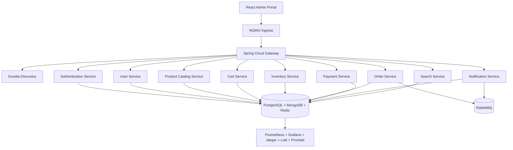

# AGENT.md

## CommerceMesh

### Enterprise Distributed E-Commerce Platform

#### Spring Boot • Spring Cloud • Spring Security • PostgreSQL • MongoDB • Redis • React • Kubernetes • Observability

---

## Objective

Build a **production-grade distributed E-Commerce platform** that demonstrates the complete Spring ecosystem and cloud-native development.

The repository should be designed as an **enterprise learning project**, where each microservice teaches different areas of Spring Boot, Spring Cloud, distributed systems, security, persistence, messaging, observability and frontend development.

Every project should be independently deployable and production-ready.

The AI Agent should generate code that follows:

- Spring Boot Best Practices
- Clean Architecture
- SOLID Principles
- Twelve-Factor App methodology
- Cloud Native principles
- Kubernetes Best Practices
- Secure Coding Standards
- Enterprise-grade project organisation

The goal is to understand how large organisations build scalable Spring applications.

---

## Technology Baseline

- **Java 25 (LTS)** for every backend service. Use modern language features (virtual threads, records, sealed interfaces, pattern matching for switch, structured concurrency) wherever they simplify the code.
- **Spring Boot 4.1** (latest GA) as the baseline for every backend service, paired with matching current-generation Spring Cloud, Spring Security, Spring Data (JPA/MongoDB/Redis), Spring AMQP, springdoc-openapi, MapStruct, Resilience4j and Micrometer/OpenTelemetry versions compatible with it.
- **Virtual Threads** must be enabled on every service (`spring.threads.virtual.enabled=true`) and Tomcat/WebFlux, JDBC, Feign and RabbitMQ listener containers should run on virtual threads instead of platform thread pools. Avoid `synchronized` blocks and thread-pool tuning that defeats virtual threads; prefer `ReentrantLock` where locking is required.
- **React 19.2** (latest GA) as the baseline for every frontend app, paired with the current stable TypeScript, Vite, TanStack Query, React Router, Material UI, React Hook Form and Zod versions compatible with it.
- Beyond these pinned baselines, always prefer the **latest stable release** of every other library in the stack at implementation time instead of pinning to older majors.
- Prefer modern patterns (React Compiler-friendly code, function components, hooks, no legacy class components).
- Dependency versions in `pom.xml`/`package.json` should be revisited whenever a service is generated or regenerated so the stack doesn't silently drift behind Spring Boot 4.1 / React 19.2 or their current-compatible library versions.

---

## No Shared Libraries / No Monorepo Tooling

This repository is a collection of **fully independent Spring Boot projects**, not a monorepo with shared code.

- There is **no parent POM** and **no shared/common library** (no `common-api-library`, `common-security-library`, `common-event-library`, `common-model-library`, `common-exception-library`, or any `libraries/` directory).
- Every service under `backend/` owns **its own** `pom.xml` (or Gradle build), its own DTOs, mappers, exception classes, security config and event/message contracts — duplication across services is expected and acceptable.
- Do not introduce cross-module Maven/Gradle dependencies between backend services. Services only communicate over the network (REST/Feign/RabbitMQ), never via shared JARs.
- Do not extract multi-module Maven reactor builds, BOMs, or Gradle composite builds to "deduplicate" services — each service must build and deploy on its own.
- Each React app under `ui/` similarly has its own `package.json`, its own components/hooks/API clients — no shared npm workspace or shared component library between `ui/admin-console` and `ui/customer-console`.

---

## Implementation Expectations

When asked to generate a service or feature, the AI Agent must produce **actual working implementation code**, not placeholders or scaffolding:

- Real controllers, services, repositories, entities/documents, DTOs, mappers, security config, and exception handlers with full method bodies — not `// TODO` stubs or empty classes.
- Real React components, hooks and API service files with working logic (state, effects, API calls, form validation) — not empty JSX shells or placeholder components.
- Configuration files (`application.yml`, `.env`, Dockerfiles, Helm values) should contain concrete, usable values consistent with the rest of the stack, not generic placeholders left for the user to fill in.

---

## Primary Learning Objectives

The repository should intentionally cover nearly every major Spring ecosystem project.

---

### Spring Boot

- Spring Boot Fundamentals
- Spring MVC
- Spring Validation
- Spring Scheduling
- Spring Cache
- Spring Async
- Spring Events
- Spring Profiles
- Spring Configuration
- Spring Mail
- Spring Retry
- OpenAPI / Swagger
- Actuator

---

### Spring Security

- Security Filter Chain
- JWT Authentication
- Refresh Tokens
- Role Based Access Control (RBAC)
- Permission Based Security
- Method Security
- BCrypt Password Encryption
- Authentication Manager
- UserDetailsService
- Custom Authentication Provider
- Session Management
- CSRF
- CORS
- Password Reset
- Email Verification
- Remember Me (optional)

---

### Spring Cloud

#### Spring Cloud Gateway

- API Gateway
- Single Digital Entry Point
- JWT Validation
- Route Predicates
- Filters
- Header Manipulation
- Path Rewriting
- Global Filters
- Rate Limiting

---

#### Eureka

- Service Discovery
- Service Registration
- Health Registration

---

#### Spring Cloud Config

- Centralised Configuration
- Environment Profiles
- Shared Configuration
- Config Refresh

---

#### OpenFeign

- Declarative REST Clients
- Request Interceptors
- Error Decoder
- Retry
- Timeouts

---

#### Spring Cloud LoadBalancer

- Client-side Load Balancing

---

#### Resilience4j

- Circuit Breaker
- Retry
- Bulkhead
- Rate Limiter
- Timeout
- Fallback

---

### Spring Data

#### PostgreSQL

Store relational data:

- Users
- Roles
- Permissions
- Orders
- Payments
- Addresses
- Shipping
- Audit

---

#### MongoDB

Store document-oriented data:

- Products
- Categories
- Brands
- Reviews
- Shopping Cart
- Wishlist
- Product Images
- Product Metadata

---

#### Redis

Store high-speed transient data:

- Sessions
- Product Cache
- Shopping Cart Cache
- OTP
- JWT Blacklist
- Trending Products
- Dashboard Cache
- Rate Limiting
- User Cache

---

### Messaging

Include

- RabbitMQ

Demonstrate

- Publisher
- Consumer
- Dead Letter Queue
- Retry Queue
- Event Driven Architecture

---

### Observability

The project **must** include a complete observability stack.

---

#### Spring Actuator

Demonstrate

- Health
- Info
- Metrics
- Environment
- Thread Dump
- Beans
- Loggers

---

#### Micrometer

- JVM Metrics
- Custom Metrics
- Business Metrics

---

#### Prometheus

Collect metrics from all services.

---

#### Grafana

Dashboards should include

- JVM Metrics
- HTTP Requests
- Response Time
- Error Rate
- Cache Metrics
- Database Metrics
- Redis Metrics
- RabbitMQ Metrics
- Kubernetes Metrics

---

#### OpenTelemetry

Instrument

- REST APIs
- Feign Clients
- Database Calls
- RabbitMQ
- Redis

---

#### Jaeger

Trace

- User Login
- Product Search
- Checkout
- Order Placement

---

#### Loki

Centralised Logging

---

#### Promtail

Log Collection

---

### Frontend

React

- React 19.2
- TypeScript
- Vite
- Material UI
- React Router
- TanStack Query
- Axios
- React Hook Form
- Zod
- Recharts

---

### Infrastructure

- Docker
- Docker Compose
- Helm
- Kubernetes
- NGINX Ingress

---

## Repository Structure

```
commerce-mesh/
├── charts/
├── docker-compose.yaml
├── docs/
├── scripts/
├── ui/
│   ├── admin-console/
│   └── customer-console/
├── backend/
│   ├── discovery-server/
│   ├── config-server/
│   ├── api-gateway/
│   ├── authentication-service/
│   ├── user-service/
│   ├── product-catalog-service/
│   ├── cart-service/
│   ├── inventory-service/
│   ├── order-service/
│   ├── payment-service/
│   ├── notification-service/
│   └── search-service/
├── monitoring/
├── README.md
└── AGENT.md
```

Each directory under `backend/` and `ui/` is a standalone, independently buildable project (its own build file, no shared parent, no shared library module).

### ui/customer-console

Customer-facing e-commerce storefront for browsing and purchasing products.

**Pages**
- Home — featured products, category grid, hero banner
- Product Listing — grid view with category/sort/filter sidebar
- Product Detail — images, description, reviews, add to cart
- Cart — item management, quantity adjustment, checkout link
- Checkout — multi-step (shipping → payment → review → place order)
- Order History — list of past orders with status badges
- Profile — user info, address management
- Wishlist — saved products with quick add-to-cart

**Components**
- Navbar — logo, search bar, cart badge, user menu, category links
- ProductCard — image, name, price, rating, add-to-cart button
- CartSummary — cart icon with item count badge
- Footer — copyright and links
- SearchBar — inline search with auto-suggest
- ProtectedRoute — redirect to login if not authenticated

**Hooks**
- `useAuth()` — login, register, logout, user state
- `useCart()` — add/remove/update items, totals
- `useProducts()` — product listing with filters
- `useOrders()` — order history

**API Services**
- `apiClient.ts` — shared Axios instance with JWT interceptor

---

## High-Level Architecture



---

## Root Structure

```
charts/
docker-compose.yaml
docs/
scripts/
monitoring/
ui/
├── admin-console/
└── customer-console/
backend/
├── discovery-server/
├── config-server/
├── api-gateway/
├── authentication-service/
├── user-service/
├── product-catalog-service/
├── cart-service/
├── inventory-service/
├── payment-service/
├── order-service/
├── notification-service/
└── search-service/
```

No `libraries/` directory and no parent/aggregator POM — every entry above is a fully independent, self-contained project.

---

## Backend Services

### 1. Discovery Server

**Topics**

- Eureka Server

---

### 2. Config Server

**Topics**

- Centralised Configuration

---

### 3. API Gateway

**Topics**

- Gateway
- JWT Validation
- Routing
- Filters
- Rate Limiting

---

### 4. Authentication Service

**Responsibilities**

- Registration
- Login
- Logout
- Refresh Token
- Password Reset
- Email Verification

**Database: PostgreSQL**

**Spring Topics**

- Spring Security
- JWT
- BCrypt

---

### 5. User Service

**Responsibilities**

- Profile
- Address
- Roles
- Preferences

**Database: PostgreSQL**

**Topics**

- Spring Data JPA
- Pageable
- Specifications

---

### 6. Product Catalog Service

**Responsibilities**

- Products
- Categories
- Brands
- Reviews
- Search

**Database: MongoDB**

**Topics**

- Spring Data MongoDB
- Aggregation
- Pagination
- Indexing

---

### 7. Cart Service

**Responsibilities**

- Shopping Cart
- Wishlist
- Coupons

**Database: MongoDB**

**Cache: Redis**

**Topics**

- Spring Cache
- RedisTemplate
- TTL
- Cache Eviction

---

### 8. Inventory Service

**Responsibilities**

- Warehouse
- Inventory
- Stock Reservation

**Database: PostgreSQL**

---

### 9. Order Service

**Responsibilities**

- Checkout
- Orders
- History

**Database: PostgreSQL**

**Topics**

- Transactions
- RabbitMQ

---

### 10. Payment Service

**Responsibilities**

- Payments
- Refunds
- Invoices

**Topics**

- Retry
- Circuit Breaker

---

### 11. Notification Service

**Responsibilities**

- Email
- SMS
- Push Notifications

**Topics**

- Async
- RabbitMQ Consumers

---

### 12. Search Service

**Responsibilities**

- Product Search
- Auto Complete
- Search Suggestions

**Database: MongoDB**

---

## React UI

Repository: `ui/admin-console`

---

### Pages

- Login
- Dashboard
- Products
- Categories
- Inventory
- Orders
- Cart
- Payments
- Customers
- Users
- Roles
- Permissions
- Reports
- Monitoring
- Settings

---

### Components

- Navbar
- Sidebar
- Header
- Footer
- ProductTable
- OrderTable
- UserTable
- DashboardCards
- Charts
- Dialogs
- Forms
- Pagination
- Filters
- Snackbar
- Loading
- ProtectedRoute

---

### Hooks

- `useAuth()`
- `useProducts()`
- `useOrders()`
- `useInventory()`
- `usePayments()`
- `useUsers()`
- `useCart()`

---

### API Services

- `authApi.ts`
- `userApi.ts`
- `productApi.ts`
- `cartApi.ts`
- `orderApi.ts`
- `paymentApi.ts`
- `inventoryApi.ts`

---

## Authentication

Implement

- JWT
- Refresh Tokens
- BCrypt
- RBAC
- Method Security

**Roles**

- `SUPER_ADMIN`
- `ADMIN`
- `PRODUCT_MANAGER`
- `ORDER_MANAGER`
- `CUSTOMER_SUPPORT`
- `CUSTOMER`

**Default Administrator**

- **Username:** `admin`
- **Password:** `Admin@123`

---

## Admin Dashboard

Include widgets for:

- Active Users
- Orders Today
- Revenue
- Products
- Inventory Status
- Low Stock
- Shopping Carts
- Top Customers
- Top Products
- Failed Payments
- RabbitMQ Queue Status
- Cache Statistics
- JVM Statistics
- API Metrics
- Request Rate
- Error Rate

---

## Docker

Each backend should include

- Multi-stage Dockerfile
- Non-root User
- Healthcheck
- Small Runtime Image

---

## Docker Compose

The root compose should start:

**Infrastructure**

- PostgreSQL
- pgAdmin
- MongoDB
- Mongo Express
- Redis
- Redis Insight
- RabbitMQ
- RabbitMQ Management

**Spring Cloud**

- Config Server
- Eureka Server
- API Gateway

**Microservices**

- Authentication Service
- User Service
- Product Service
- Cart Service
- Inventory Service
- Order Service
- Payment Service
- Notification Service
- Search Service

**Frontend**

- React UI

**Observability**

- Prometheus
- Grafana
- Loki
- Promtail
- Jaeger

---

## Helm

Each project must contain

```
helm/
├── Chart.yaml
├── values.yaml
├── NOTES.txt
└── templates/
    ├── deployment.yaml
    ├── service.yaml
    ├── configmap.yaml
    ├── secret.yaml
    ├── ingress.yaml
    ├── serviceaccount.yaml
    ├── networkpolicy.yaml
    └── hpa.yaml
```

---

## Kubernetes Best Practices

Every service should include

- Resource Requests
- Resource Limits
- Liveness Probe
- Readiness Probe
- Startup Probe
- Rolling Updates
- ConfigMaps
- Secrets
- Anti Affinity
- Pod Disruption Budget
- HPA
- ServiceAccount
- SecurityContext
- Non-root Containers

---

## Ingress

Create one NGINX Ingress.

**Routes**

- `/`
- `api/auth`
- `api/users`
- `api/products`
- `api/cart`
- `api/orders`
- `api/payments`
- `api/inventory`
- `api/search`

---

## Testing

Every backend must include

### Unit Tests

- Controllers
- Services
- Repositories
- Security
- Validators
- Mappers
- Cache
- RabbitMQ Publishers
- RabbitMQ Consumers

Coverage: **90%+**

---

### Integration Tests

**Use**

- Spring Boot Test
- Testcontainers
- PostgreSQL
- MongoDB
- Redis
- RabbitMQ

**Test**

- Authentication
- Authorization
- Gateway
- Eureka Registration
- Feign Clients
- Circuit Breakers
- Cache
- Messaging
- Database
- REST APIs

---

## Frontend Tests

**Use**

- Vitest
- React Testing Library

**Test**

- Components
- Hooks
- API Clients
- Forms
- Dashboard
- Protected Routes

---

## Spring Boot & Spring Cloud Best Practices

The AI Agent **must** always follow:

### Architecture

- Package-by-feature organisation.
- Clean Architecture.
- SOLID principles.
- DRY and KISS.
- Constructor injection only.
- Thin controllers with business logic confined to services.
- DTOs for all API contracts.
- MapStruct for object mapping.

### Cloud

- Gateway as the sole public entry point.
- Eureka for service discovery.
- Spring Cloud Config for centralised configuration.
- OpenFeign for service-to-service communication.
- Resilience4j for fault tolerance.

### Security

- Explicit `SecurityFilterChain`.
- Stateless JWT authentication.
- BCrypt password hashing.
- Method-level security (`@PreAuthorize`).
- Fine-grained RBAC and permissions.
- Secure CORS and CSRF configuration.

### Persistence

- PostgreSQL for transactional data.
- MongoDB for catalogue and cart documents.
- Redis for caching, sessions and transient state.

### Messaging

- RabbitMQ for asynchronous communication.
- Idempotent consumers.
- Dead-letter queues and retry policies.

### Observability

- Spring Boot Actuator on all services.
- Micrometer metrics.
- Prometheus scraping.
- Grafana dashboards.
- OpenTelemetry instrumentation.
- Jaeger distributed tracing.
- Loki centralised logging.

### API Design

- Versioned REST APIs.
- Consistent response models.
- Standard HTTP status codes.
- OpenAPI documentation.

### Testing

- Unit tests for all business logic.
- Integration tests for persistence, messaging and cloud components.
- Maintain at least **90%** code coverage.

---

## Development Workflow

For every feature, the AI Agent should:

1. Design the domain model.
2. Create database schemas and MongoDB collections.
3. Configure Redis caching.
4. Implement repositories.
5. Build business services.
6. Secure APIs with Spring Security.
7. Register services with Eureka.
8. Configure Gateway routes.
9. Add Feign clients.
10. Configure Resilience4j.
11. Publish or consume RabbitMQ events where appropriate.
12. Instrument with Actuator, Micrometer and OpenTelemetry.
13. Build or update the React UI.
14. Write unit tests.
15. Write integration tests.
16. Build Docker images.
17. Update Docker Compose.
18. Create or update Helm charts.
19. Configure Kubernetes Ingress.
20. Update project documentation.

---

## Expected Deliverable

The completed repository should resemble a real-world enterprise e-commerce platform and demonstrate:

- Java 25 with virtual threads enabled across all services
- Spring Boot 4.1 backend services and a React 19.2 frontend, with all other libraries kept at their latest compatible stable releases
- Independent, non-monorepo services with no shared libraries or parent POM
- Spring Cloud Gateway
- Eureka Service Discovery
- Spring Cloud Config
- OpenFeign
- Resilience4j
- Spring Security with JWT
- PostgreSQL, MongoDB and Redis integration
- RabbitMQ event-driven communication
- Complete observability with Actuator, Micrometer, Prometheus, Grafana, OpenTelemetry, Jaeger, Loki and Promtail
- React administration portal
- Docker-based local development
- Kubernetes deployment with Helm and NGINX Ingress
- Production-quality architecture, testing and documentation

The repository should serve as a comprehensive reference implementation for building cloud-native, enterprise-scale Spring Boot microservices.