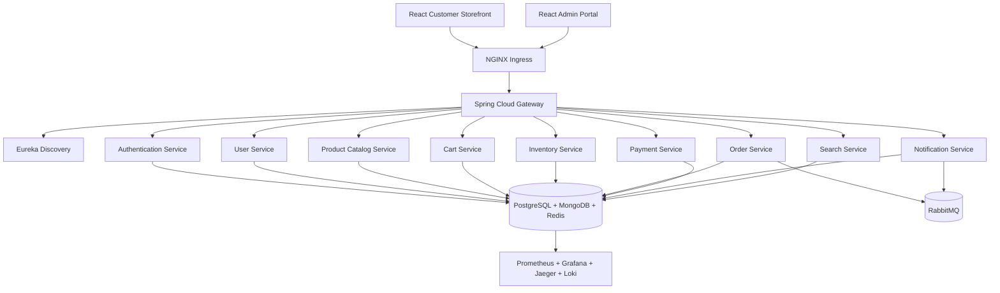

# CommerceMesh

## Enterprise Distributed E-Commerce Platform

Spring Boot 4.1 • Spring Cloud 2025.1 • Java 25 • PostgreSQL • MongoDB • Redis • RabbitMQ • React 19 • Kubernetes

A production-grade, cloud-native e-commerce platform demonstrating the complete Spring ecosystem. Built as a comprehensive reference implementation for enterprise-scale microservices.

Includes **two frontend applications** — a customer-facing store for browsing and shopping, and an admin portal for platform management.

## Architecture



## Services

| Service | Database | Description |
|---------|----------|-------------|
| **discovery-server** | — | Eureka Service Discovery |
| **config-server** | — | Centralized Configuration |
| **api-gateway** | — | API Gateway, Routing, JWT Validation |
| **authentication-service** | PostgreSQL | Registration, Login, JWT, RBAC |
| **user-service** | PostgreSQL | Profiles, Addresses, Roles |
| **product-catalog-service** | MongoDB | Products, Categories, Reviews |
| **cart-service** | MongoDB + Redis | Shopping Cart, Wishlist |
| **inventory-service** | PostgreSQL | Warehouses, Stock Management |
| **order-service** | PostgreSQL + RabbitMQ | Orders, Checkout |
| **payment-service** | PostgreSQL | Payments, Refunds |
| **notification-service** | PostgreSQL + RabbitMQ | Email, SMS, Push |
| **search-service** | MongoDB | Product Search, Auto-complete |

## Frontend Applications

| App | URL | Port | Purpose |
|-----|-----|------|---------|
| **ui-customer-console** | http://localhost:3002 | 3002 | Customer storefront — browse products, cart, checkout, order history |
| **ui-admin-console** | http://localhost:3000 | 3000 | Admin dashboard — manage products, orders, users, inventory, payments |

## Quick Start

```bash
# Start all infrastructure and services
docker compose up -d

# Start individual service for development
cd backend/<service-name>
./mvnw spring-boot:run
```

### Access Points

| Service | URL | Credentials |
|---------|-----|-------------|
| Customer Store | http://localhost:3002 | Register / Login |
| Admin Portal | http://localhost:3000 | admin / Admin@123 |
| Eureka Dashboard | http://localhost:8761 | — |
| API Gateway | http://localhost:8080 | — |
| pgAdmin | http://localhost:5050 | admin@admin.com / admin |
| Mongo Express | http://localhost:8081 | — |
| Redis Insight | http://localhost:8001 | — |
| RabbitMQ Management | http://localhost:15672 | admin / admin123 |
| Prometheus | http://localhost:9090 | — |
| Grafana | http://localhost:3001 | admin / admin |

## Tech Stack

- **Backend:** Spring Boot 4.1, Spring Cloud Gateway, Eureka, OpenFeign, Resilience4j, Java 25
- **Security:** Spring Security, JWT, BCrypt, RBAC
- **Databases:** PostgreSQL 17, MongoDB 8, Redis 7
- **Messaging:** RabbitMQ 4
- **Frontend:** React 19, TypeScript, Vite 8, Material UI 9, TanStack Query
- **Observability:** Micrometer, Prometheus, Grafana, OpenTelemetry, Jaeger, Loki, Promtail
- **Infrastructure:** Docker, Docker Compose, Kubernetes, Helm, NGINX Ingress

## Documentation

- [Architecture](docs/architecture.md)
- [Code Architecture & Exploration Guide](docs/code-architecture.md)
- [API Guidelines](docs/api-guidelines.md)
- [Database Schema](docs/database-schema.md)
- [Security](docs/security.md)
- [Messaging & Events](docs/messaging.md)
- [Development Guide](docs/development.md)
- [Deployment Guide](docs/deployment.md)
- [Observability](docs/observability.md)
