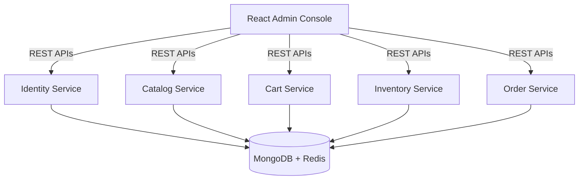

# AGENT.md

## Project: CommerceSphere

### E-Commerce Product Catalog with Hybrid Storage (Spring Boot + MongoDB + Redis + React)

> **Objective**
>
> Build a production-grade e-commerce platform that demonstrates how to use **Spring Boot** with **MongoDB** and **Redis** in a real-world hybrid storage architecture.
>
> The platform should teach core Spring Boot concepts through multiple independent microservices while following enterprise software architecture and modern Spring Boot best practices.
>
> The AI Agent should generate production-ready, modular, testable code with a clean architecture. Every service must include a React-based UI, comprehensive testing, Docker support, Helm charts, Kubernetes manifests and NGINX Ingress configuration.
>
> **Do not implement observability (Prometheus, Grafana, OpenTelemetry, Jaeger, ELK, etc.).**

---

## Objectives

The repository should help developers understand:

- Spring Boot Fundamentals
- Spring MVC
- Spring Data MongoDB
- Spring Data Redis
- Spring Security
- JWT Authentication
- Role Based Access Control (RBAC)
- Bean Validation
- Global Exception Handling
- File Upload
- Spring Events
- Async Processing
- Scheduling
- Caching
- Pagination
- Search
- MongoDB Aggregation
- MongoDB Indexing
- Redis Caching
- Redis Session Management
- Docker
- Docker Compose
- Kubernetes
- Helm
- NGINX Ingress
- Unit Testing
- Integration Testing
- React + TypeScript

---

## Technology Stack

### Backend

- Java 21
- Spring Boot 3.x
- Spring Security
- Spring MVC
- Spring Validation
- Spring Data MongoDB
- Spring Data Redis
- Spring Cache
- Spring Scheduling
- Spring Events
- Spring Mail
- MapStruct
- Lombok
- OpenAPI / Swagger

---

### Databases

#### MongoDB

Use MongoDB for

- Products
- Categories
- Brands
- Reviews
- Product Specifications
- Product Images

#### Redis

Use Redis for

- Shopping Cart
- User Session
- JWT Blacklist
- Frequently Accessed Products Cache
- Wishlist Cache
- OTP Storage
- Rate Limiting

---

### Frontend

- React
- TypeScript
- Vite
- React Router
- TanStack Query
- Axios
- Material UI
- React Hook Form
- Zod
- Recharts

---

### Infrastructure

- Docker
- Docker Compose
- Helm
- Kubernetes
- NGINX Ingress

---

## Repository Structure

```
commerce-sphere/
├── charts/
├── docker-compose.yaml
├── docs/
├── scripts/
├── ui-admin-console/
├── identity-service/
├── catalog-service/
├── cart-service/
├── order-service/
├── inventory-service/
├── common-api-library/
├── common-security-library/
├── common-model-library/
├── common-exception-library/
├── README.md
└── AGENT.md
```

---

## High-Level Architecture



---

## Root Components

- `charts/`
- `docker-compose.yaml`
- `docs/`
- `scripts/`
- `ui-admin-console/`
- `identity-service/`
- `catalog-service/`
- `cart-service/`
- `inventory-service/`
- `order-service/`
- `common-api-library/`
- `common-security-library/`
- `common-model-library/`
- `common-exception-library/`

---

## Common Structure for Every Backend Service

```
service-name/
├── src/
│   ├── main/
│   │   ├── java/
│   │   │   ├── config/
│   │   │   ├── configuration/
│   │   │   ├── controller/
│   │   │   ├── dto/
│   │   │   ├── entity/
│   │   │   ├── repository/
│   │   │   ├── service/
│   │   │   ├── mapper/
│   │   │   ├── validation/
│   │   │   ├── exception/
│   │   │   ├── advice/
│   │   │   ├── security/
│   │   │   ├── cache/
│   │   │   ├── event/
│   │   │   ├── listener/
│   │   │   ├── scheduler/
│   │   │   ├── util/
│   │   │   └── constant/
│   │   └── resources/
│   └── test/
├── Dockerfile
├── README.md
└── helm/
```

---

## Project 1: Identity Service

Repository: `identity-service`

**Responsibilities**

- User Registration
- Login
- JWT Authentication
- Refresh Token
- User Profile
- Password Change
- Role Management

**MongoDB Collections**

- `users`
- `roles`

**Redis**

- Sessions
- Refresh Tokens
- Login Attempts
- Blacklisted Tokens

**Spring Topics**

- Spring Security
- JWT
- Validation
- Filters
- Authentication
- RBAC

---

## Project 2: Catalog Service

Repository: `catalog-service`

**Responsibilities**

- Product Management
- Category Management
- Brand Management
- Product Search
- Product Filtering
- Product Reviews
- Product Images

**MongoDB Collections**

- `products`
- `categories`
- `brands`
- `reviews`

**Redis**

- Product Cache
- Category Cache
- Featured Products
- Trending Products

**Spring Topics**

- MongoRepository
- Aggregation Pipeline
- Text Search
- Pagination
- Sorting
- Indexing
- Caching

---

## Project 3: Cart Service

Repository: `cart-service`

**Responsibilities**

- Add Product
- Remove Product
- Update Quantity
- Save Cart
- Merge Guest Cart
- Wishlist

**Redis**

- `shopping-cart`
- `wishlist`
- `recently-viewed`
- `coupon-cache`

**MongoDB**

- Cart History

**Spring Topics**

- RedisTemplate
- Spring Cache
- Serialization
- Session Management
- TTL

---

## Project 4: Inventory Service

Repository: `inventory-service`

**Responsibilities**

- Stock Management
- Warehouse Management
- Product Availability
- Inventory Reservation

**MongoDB**

- `inventory`
- `warehouse`
- `stock-movement`

**Redis**

- `stock-cache`

**Spring Topics**

- Transactions
- Caching
- Scheduling

---

## Project 5: Order Service

Repository: `order-service`

**Responsibilities**

- Checkout
- Place Order
- Order History
- Cancel Order
- Track Order

**MongoDB**

- `orders`

**Redis**

- `checkout-cache`
- `payment-session`
- `recent-orders`

**Spring Topics**

- Validation
- Events
- Scheduling
- Async

---

## React Project

Repository: `ui-admin-console`

### Pages

- Login
- Dashboard
- Products
- Categories
- Brands
- Inventory
- Orders
- Customers
- Shopping Cart
- Wishlist
- Analytics
- Settings
- Users

---

### Components

- Navbar
- Sidebar
- Header
- Footer
- Cards
- ProductTable
- CategoryTable
- InventoryTable
- OrderTable
- UserTable
- CartTable
- Charts
- Dialogs
- Forms
- Pagination
- SearchBar
- Filters
- Loading
- Snackbar
- ProtectedRoute

---

### Hooks

- `useAuth`
- `useProducts`
- `useCategories`
- `useBrands`
- `useInventory`
- `useOrders`
- `useCart`
- `useWishlist`
- `useUsers`

---

### Services

- `authApi.ts`
- `productApi.ts`
- `categoryApi.ts`
- `brandApi.ts`
- `cartApi.ts`
- `inventoryApi.ts`
- `orderApi.ts`
- `userApi.ts`

---

## Admin Dashboard

Every project must expose an administration dashboard.

**Default Administrator**

- **Username:** `admin`
- **Password:** `Admin@123`

**Dashboard Widgets**

- Total Products
- Total Categories
- Total Orders
- Active Users
- Current Carts
- Inventory Levels
- Top Selling Products
- Recently Added Products
- Low Stock Products
- Monthly Orders

---

## Docker

Every backend service must include

- Multi-stage Dockerfile
- Non-root User
- Small Runtime Image
- Environment Variables
- Health Check
- Build Cache Optimisation

---

## Docker Compose

The root compose file should start

- MongoDB
- Mongo Express
- Redis
- Redis Insight
- Identity Service
- Catalog Service
- Cart Service
- Inventory Service
- Order Service
- React UI

---

## Helm

Each service should include

```
helm/
├── Chart.yaml
├── values.yaml
└── templates/
    ├── deployment.yaml
    ├── service.yaml
    ├── configmap.yaml
    ├── secret.yaml
    ├── ingress.yaml
    ├── serviceaccount.yaml
    └── _helpers.tpl
```

---

## Kubernetes Best Practices

Every deployment should include

- Resource Requests
- Resource Limits
- ConfigMaps
- Secrets
- Readiness Probe
- Liveness Probe
- Rolling Update Strategy
- Environment Variables
- Labels
- Selectors
- Graceful Shutdown

---

## Ingress

Create a single NGINX Ingress.

**Routes**

- `/`
- `api/auth`
- `api/catalog`
- `api/cart`
- `api/orders`
- `api/inventory`

The React application should be available at `/`.

---

## Unit Tests

Every backend service must include unit tests for

- Controllers
- Services
- Repositories
- Security
- Validators
- Mappers
- Cache Components
- Utility Classes

Coverage Target: **90%+**

---

## Integration Tests

Use

- Spring Boot Test
- Testcontainers
- MongoDB Container
- Redis Container

Test

- CRUD APIs
- MongoDB Repositories
- Redis Operations
- Cache Behaviour
- Security
- Authentication
- Pagination
- Search
- Shopping Cart

---

## Frontend Testing

Use

- Vitest
- React Testing Library

Test

- Components
- Hooks
- Forms
- API Clients
- Protected Routes
- Dashboard Widgets

---

## Spring Boot Best Practices

The AI Agent must always follow these principles:

### Architecture

- Use a layered architecture with clear separation of concerns.
- Prefer package-by-feature for better modularity.
- Keep controllers thin; delegate business logic to services.
- Encapsulate persistence logic within repositories.
- Separate domain models from API DTOs.

### Dependency Injection

- Use constructor injection only.
- Avoid field injection.

### API Design

- Build RESTful APIs with consistent versioning.
- Standardise request and response models.
- Use appropriate HTTP status codes.
- Generate OpenAPI documentation for all endpoints.

### Validation & Error Handling

- Validate all incoming requests with Jakarta Bean Validation.
- Implement global exception handling using `@ControllerAdvice`.
- Return consistent error responses.

### MongoDB

- Design documents for query efficiency.
- Create indexes for frequently queried fields.
- Use aggregation pipelines for analytics and reporting.
- Avoid unnecessary document nesting.
- Model relationships appropriately using embedding or references.

### Redis

- Use Redis only for transient and high-speed data.
- Configure TTL values for temporary data.
- Cache frequently accessed catalog data.
- Store shopping carts and user sessions in Redis.
- Implement cache eviction where appropriate.

### Security

- Use Spring Security with JWT.
- Implement RBAC.
- Encrypt passwords with BCrypt.
- Configure CORS appropriately.
- Protect sensitive endpoints with method-level security.

### Code Quality

- Follow SOLID, DRY and KISS principles.
- Write clean, readable and maintainable code.
- Use immutable DTOs (`record`) where appropriate.
- Keep methods small and focused.
- Document public APIs and complex business logic.

### Testing

- Write unit tests for all business logic.
- Add integration tests for MongoDB and Redis interactions.
- Ensure each service achieves at least 90% test coverage.

---

## Development Workflow

For every feature, the AI Agent should:

1. Design the domain model.
2. Create MongoDB document models.
3. Design Redis key structures.
4. Implement repositories.
5. Develop business services.
6. Expose REST APIs.
7. Secure endpoints with Spring Security.
8. Build or update the React UI.
9. Write unit tests.
10. Write integration tests.
11. Build Docker images.
12. Update Docker Compose.
13. Create or update Helm charts.
14. Configure NGINX Ingress.
15. Update project documentation.

---

## Deliverable

The final repository should represent a production-style e-commerce platform that demonstrates:

- Spring Boot microservices
- MongoDB document modelling
- Redis caching and session management
- Hybrid storage architecture
- Secure JWT authentication
- React-based administration portal
- Dockerised local development
- Kubernetes deployment using Helm
- NGINX Ingress routing
- Comprehensive unit and integration testing
- Modern Spring Boot development best practices

The codebase should be modular, maintainable, educational and extensible, making it suitable for learning enterprise Spring Boot development with MongoDB and Redis.