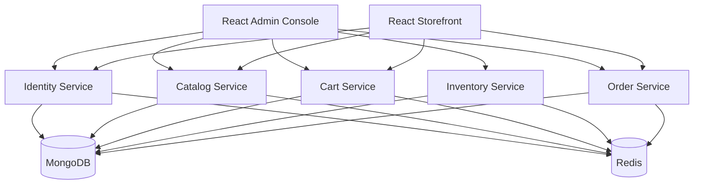

# CommerceSphere

## Enterprise E-Commerce Platform with Hybrid Storage

Spring Boot 3.3 • Java 21 • MongoDB • Redis • React 19 • Kubernetes

A production-grade e-commerce platform demonstrating Spring Boot with MongoDB and Redis in a hybrid storage architecture. Features five independent microservices and two React frontends.

---

## Architecture



## Services

| Service | Port | Database | Description |
|---------|------|----------|-------------|
| **identity-service** | 8081 | MongoDB + Redis | Registration, Login, JWT, RBAC |
| **catalog-service** | 8082 | MongoDB + Redis | Products, Categories, Brands, Reviews |
| **cart-service** | 8083 | Redis + MongoDB | Shopping Cart, Wishlist |
| **inventory-service** | 8084 | MongoDB + Redis | Stock Management, Reservations |
| **order-service** | 8085 | MongoDB + Redis | Checkout, Orders, Tracking |

## Frontend Applications

| App | URL | Purpose |
|-----|-----|---------|
| **Admin Console** | http://localhost:3000 | Platform administration |
| **Storefront** | http://localhost:3001 | Customer shopping experience |

---

## Quick Start

### Prerequisites

- Docker and Docker Compose
- Java 21 (for local development)
- Node.js 22+ (for frontend development)

### Start Everything

```bash
docker compose up -d --build
```

This starts MongoDB, Redis, all 5 services, and both frontend apps.

### Access Points

| Service | URL | Credentials |
|---------|-----|-------------|
| Admin Console | http://localhost:3000 | admin / Admin@123 |
| Storefront | http://localhost:3001 | Register or Login |
| Mongo Express | http://localhost:8081 | Auto-connected |
| Redis Insight | http://localhost:8001 | Connect to redis:6379 |
| Identity Swagger | http://localhost:8082/swagger-ui.html | — |
| Catalog Swagger | http://localhost:8083/swagger-ui.html | — |
| Cart Swagger | http://localhost:8084/swagger-ui.html | — |
| Inventory Swagger | http://localhost:8085/swagger-ui.html | — |
| Order Swagger | http://localhost:8086/swagger-ui.html | — |

### Local Development

```bash
# Start infrastructure only
docker compose up -d mongodb redis mongo-express redis-insight

# Run individual service
cd backend/identity-service
./mvnw spring-boot:run

# Run frontend
cd ui/admin-console
npm install && npm run dev
```

---

## Tech Stack

- **Backend:** Spring Boot 3.3, Spring Security, Spring Data MongoDB, Spring Data Redis, MapStruct, Lombok
- **Databases:** MongoDB 8, Redis 7
- **Security:** JWT, BCrypt, RBAC
- **Frontend:** React 19, TypeScript, Vite 6, Material UI 6, TanStack Query 5
- **Infrastructure:** Docker, Docker Compose, Kubernetes, Helm, NGINX Ingress

---

## Documentation

- [Architecture](docs/architecture.md)
- [Development Guide](docs/development.md)
- [Contributing Guide](docs/contributing.md)
- [Deployment Guide](docs/deployment.md)
- [API Documentation](docs/api/)
- [Frontend Guide](docs/frontend/)

---

## Contributing

See [CONTRIBUTING.md](docs/contributing.md) for detailed contribution guidelines.

## Project Structure

```
commerce-sphere/
├── AGENT.md
├── docker-compose.yaml
├── .env
├── backend/
│   ├── identity-service/
│   ├── catalog-service/
│   ├── cart-service/
│   ├── inventory-service/
│   └── order-service/
├── ui/
│   ├── admin-console/
│   └── storefront/
├── charts/
├── docs/
└── scripts/
```

Each backend service and frontend app is a completely independent, self-contained project with its own build system.
