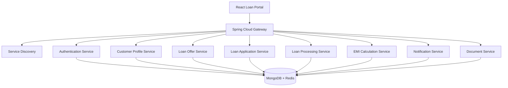

# AGENT.md

## LoanSphere

### Enterprise Digital Banking Loan Management Platform

#### Spring Boot + Spring Cloud + Spring Security + MongoDB + React + Docker + Kubernetes

---

## Objective

Build a **production-grade Enterprise Digital Banking Loan Platform** that demonstrates the complete Spring ecosystem, especially **Spring Cloud**, through a realistic banking application.

The goal of this repository is to teach developers intermediate to advanced Spring Boot concepts by building multiple microservices that communicate securely while following enterprise architecture patterns.

The AI Agent should always generate production-ready code, follow modern Spring Boot and Spring Cloud best practices, and produce modular, maintainable and highly testable services.

**Do NOT implement observability components**, including:

- Prometheus
- Grafana
- OpenTelemetry
- Jaeger
- Zipkin
- ELK
- Loki
- Distributed Tracing

---

## Technology Baseline

- **Java 25 (LTS)** for every backend service, with **Spring Boot 4.1** (latest GA) as the baseline, paired with matching current-generation Spring Cloud, Spring Security, Spring Data MongoDB/Redis, MapStruct, Resilience4j and springdoc-openapi versions compatible with it.
- **Virtual Threads** must be enabled on every service (`spring.threads.virtual.enabled=true`); Tomcat, MongoDB/Redis blocking calls, Feign clients and `@Async`/scheduled work should run on virtual threads instead of platform thread pools. Avoid `synchronized` blocks; prefer `ReentrantLock` where locking is required.
- **React 19.2** (latest GA) as the baseline for both frontend apps, paired with the current stable TypeScript, Vite, TanStack Query, React Router, Material UI, React Hook Form and Zod versions compatible with it.
- Beyond these pinned baselines, always prefer the **latest stable release** of every other library in the stack at implementation time instead of pinning to older majors.
- Prefer modern patterns (React Compiler-friendly code, function components, hooks, no legacy class components).

---

## No Shared Libraries / No Monorepo Tooling

This repository is a collection of **fully independent Spring Boot projects**, not a monorepo with shared code.

- There is **no parent POM** and **no shared/common library** (no `common-api-library`, `common-security-library`, `common-domain-library`, `common-exception-library`).
- Every service under `backend/` owns **its own** `pom.xml` (or Gradle build), its own DTOs, mappers, exception classes and security config — duplication across services is expected and acceptable.
- Do not introduce cross-module Maven/Gradle dependencies between backend services. Services only communicate over the network (REST/Feign), never via shared JARs.
- Do not extract multi-module Maven reactor builds, BOMs, or Gradle composite builds to "deduplicate" services — each service must build and deploy on its own.
- Each React app under `ui/` has its own `package.json`, its own components/hooks/API clients — no shared npm workspace or shared component library between `ui/loan-portal` and `ui/admin-console`.

---

## Implementation Expectations

When asked to generate a service or feature, the AI Agent must produce **actual working implementation code**, not placeholders or scaffolding:

- Real controllers, services, repositories, documents, DTOs, mappers, security config, and exception handlers with full method bodies — not `// TODO` stubs or empty classes.
- Real React components, hooks and API service files with working logic (state, effects, API calls, form validation) — not empty JSX shells or placeholder components.
- Configuration files (`application.yml`, `.env`, Dockerfiles, Helm values) should contain concrete, usable values consistent with the rest of the stack, not generic placeholders left for the user to fill in.

---

## Primary Learning Goals

This repository should comprehensively teach:

### Spring Boot

- Spring Boot Fundamentals
- Spring MVC
- Spring Validation
- Spring Security
- Spring Scheduling
- Spring Cache
- Async Processing
- Events
- Spring Profiles
- Spring Configuration
- Spring Mail
- OpenAPI

---

### Spring Cloud

The project should intentionally demonstrate every major Spring Cloud component where it makes architectural sense.

#### Spring Cloud Gateway

- Single Digital Entry Point
- JWT Authentication
- Route Predicates
- Filters
- Rate Limiting
- Request Header Manipulation
- Path Rewriting

---

#### Spring Cloud Config

- Central Configuration
- Environment Profiles
- Shared Configuration
- Secrets Placeholder

---

#### Eureka Discovery Server

- Service Registration
- Service Discovery

---

#### OpenFeign

- Declarative REST Clients
- Error Decoder
- Retry
- Request Interceptors

---

#### Load Balancer

- Client Side Load Balancing
- Multiple Service Instances

---

#### Circuit Breaker

**Use**

- Resilience4j

**Demonstrate**

- Retry
- Fallback
- Bulkhead
- Timeout
- Rate Limiter

---

#### Spring Cloud Bus (Optional)

Configuration Refresh

---

### Spring Security

The repository should demonstrate

- JWT Authentication
- Refresh Tokens
- Custom Authentication
- BCrypt
- RBAC
- Method Security
- Authentication Filters
- Security Filter Chain
- Custom UserDetailsService
- Session Management
- CORS
- Password Reset
- Email Verification

---

### MongoDB

Use MongoDB for

- Users
- Loan Applications
- Loan Offers
- Customer Documents
- KYC
- Loan Approval Workflow
- Notifications

---

### Redis

Use Redis for

- Sessions
- OTP
- Frequently Accessed Loans
- Loan Offer Cache
- User Cache
- Dashboard Cache
- JWT Blacklist

---

### Frontend

- React 19.2
- TypeScript
- Vite
- Material UI
- React Router
- Axios
- TanStack Query
- React Hook Form
- Zod
- Recharts

**UIs**:

- `ui/loan-portal/` — Customer-facing portal (port 5173)
- `ui/admin-console/` — Staff admin console (port 5174)

---

### Infrastructure

- Docker
- Docker Compose
- Helm
- Kubernetes
- NGINX Ingress

---

## Repository Structure

```
loan-sphere/
├── charts/
├── docker-compose.yaml
├── docs/
├── scripts/
├── ui/
│   ├── loan-portal/
│   └── admin-console/
├── backend/
│   ├── discovery-server/
│   ├── config-server/
│   ├── api-gateway/
│   ├── authentication-service/
│   ├── customer-profile-service/
│   ├── loan-offer-service/
│   ├── loan-application-service/
│   ├── emi-calculation-service/
│   ├── loan-processing-service/
│   ├── notification-service/
│   └── document-service/
├── README.md
└── AGENT.md
```

Each directory under `backend/` and `ui/` is a standalone, independently buildable project (its own build file, no shared parent, no shared library module).

---

## Architecture



---

## Root Components

- `charts/`
- `docker-compose.yaml`
- `docs/`
- `scripts/`
- `ui/loan-portal/`
- `ui/admin-console/`
- `backend/discovery-server/`
- `backend/config-server/`
- `backend/api-gateway/`
- `backend/authentication-service/`
- `backend/customer-profile-service/`
- `backend/loan-offer-service/`
- `backend/loan-application-service/`
- `backend/loan-processing-service/`
- `backend/emi-calculation-service/`
- `backend/notification-service/`
- `backend/document-service/`

No `common-*` library modules and no parent/aggregator POM — every entry above is a fully independent, self-contained project.

---

## Project 1: Discovery Server

Repository: `backend/discovery-server`

**Topics**

- Eureka
- Service Registration
- Service Discovery

---

## Project 2: Config Server

Repository: `backend/config-server`

**Topics**

- Central Configuration
- Profile Management
- Shared Properties

---

## Project 3: API Gateway

Repository: `backend/api-gateway`

**Responsibilities**

- Single Digital Entry Point
- Authentication
- Authorization
- Routing
- Rate Limiting
- Header Manipulation
- Request Logging
- API Versioning

**Spring Cloud Topics**

- Gateway
- Filters
- Route Predicates
- Load Balancer

---

## Project 4: Authentication Service

**Responsibilities**

- Registration
- Login
- Logout
- Refresh Token
- JWT
- Password Reset
- Email Verification

**Mongo Collections**

- `users`
- `roles`
- `permissions`

**Redis**

- `sessions`
- `jwt-blacklist`
- `otp`

---

## Project 5: Customer Profile Service

**Responsibilities**

- Complete Biodata
- Personal Details
- Employment
- Salary
- Assets
- Liabilities
- Address
- KYC
- Identity Documents

**Mongo Collections**

- `customer_profiles`
- `addresses`
- `employment`
- `kyc`

**Spring Topics**

- Validation
- File Upload
- Bean Mapping

---

## Project 6: Loan Offer Service

**Responsibilities**

- Loan Eligibility
- Offer Generation
- Interest Calculation
- Credit Rules
- Offer Expiration

**Uses**

- OpenFeign
- Redis Cache

**Mongo Collections**

- `loan_offers`

**Spring Topics**

- OpenFeign
- Cache
- Resilience4j

---

## Project 7: EMI Calculation Service

**Responsibilities**

- EMI Calculation
- Interest Breakdown
- Amortization Schedule
- Prepayment Calculation

**Spring Topics**

- REST
- Validation
- Utility Services

---

## Project 8: Loan Application Service

**Responsibilities**

- Submit Loan
- Validate Documents
- Upload Attachments
- Track Status
- Loan Timeline

**Mongo Collections**

- `loan_applications`

**Spring Topics**

- Validation
- Mongo Repository
- Events

---

## Project 9: Loan Processing Service

**Responsibilities**

- Review Applications
- Approve Loan
- Reject Loan
- Manual Verification
- Credit Assessment
- Risk Evaluation

**Uses**

- Feign Client
- Resilience4j

---

## Project 10: Notification Service

**Responsibilities**

- Email
- SMS
- Application Updates
- Approval Notifications
- Reminder Notifications

**Spring Topics**

- Mail
- Async
- Scheduling

---

## Project 11: Document Service

**Responsibilities**

- Upload Documents
- Store Metadata
- Download Documents
- Version Documents

**Spring Topics**

- Multipart Upload
- Validation

---

## Customer Portal (React)

Repository: `ui/loan-portal` (port 5173)

### Pages

- Login
- Dashboard
- Loan Offers
- Apply Loan
- Loan Status
- Customer Profile
- EMI Calculator
- Documents
- Notifications

---

### Customer Portal Components

- Navbar
- Sidebar
- Header
- Footer
- DashboardCards
- LoanOfferCard
- LoanTable
- CustomerTable
- ApprovalTable
- ProfileWizard
- Stepper
- FileUploader
- Charts
- Dialogs
- Snackbar
- Loading
- Pagination
- ProtectedRoute
- SearchBar
- Filters

---

### React Hooks

- `useAuth()`
- `useLoanOffers()`
- `useLoanApplication()`
- `useCustomer()`
- `useDocuments()`
- `useNotifications()`
- `useDashboard()`

---

### API Services

- `authApi.ts`
- `loanApi.ts`
- `customerApi.ts`
- `offerApi.ts`
- `emiApi.ts`
- `documentApi.ts`
- `notificationApi.ts`

---

## Admin Console (React)

Repository: `ui/admin-console` (port 5174)

The Admin Console is a role-restricted staff dashboard. Access requires `SUPER_ADMIN`, `BANK_ADMIN`, `LOAN_MANAGER`, or `UNDERWRITER` role.

### Pages

- Login
- Dashboard (stats: customers, applications, approvals, rejections)
- Users (user table, role management)
- Loan Offers (create, update, activate/deactivate)
- Applications (all customer applications)
- Approvals (review queue: approve, reject, request info)
- Settings (platform configuration, feature flags)

### React Components

- AdminLayout (dark sidebar, MUI)
- DashboardCards
- DataTables
- ApprovalActions (approve/reject/request-info buttons)
- OfferForm
- UserRoleChips
- FeatureFlagsToggles

### API Services

- `authApi.ts`
- `offerApi.ts`
- `customerApi.ts`
- `processingApi.ts`
- `dashboardApi.ts`

---

## Authentication

Implement

- JWT
- Refresh Token
- BCrypt
- RBAC
- Method Security

**Roles**

- `SUPER_ADMIN`
- `BANK_ADMIN`
- `LOAN_MANAGER`
- `UNDERWRITER`
- `CUSTOMER`
- `SUPPORT`

**Default Administrator**

- **Username:** `admin`
- **Password:** `Admin@123`

---

## Admin Dashboard

Dashboard should include

- Total Customers
- Pending Applications
- Approved Loans
- Rejected Loans
- Active Loan Offers
- Today's Applications
- Processing Queue
- Monthly Loan Amount
- Top Loan Products
- Customer Demographics

---

## Docker

Every backend service must include

- Multi-stage Dockerfile
- Non-root User
- Health Check
- Environment Variables
- Small Runtime Image

---

## Docker Compose

Should automatically start

- MongoDB
- Mongo Express
- Redis
- Redis Insight
- Config Server
- Discovery Server
- API Gateway
- Authentication Service
- Customer Profile Service
- Loan Offer Service
- Loan Application Service
- EMI Calculation Service
- Loan Processing Service
- Notification Service
- Document Service
- React Customer Portal (ui/loan-portal)
- React Admin Console (ui/admin-console)

---

## Helm Structure

Each project must include

```
helm/
├── Chart.yaml
├── values.yaml
├── NOTES.txt
└── templates/
    ├── deployment.yaml
    ├── service.yaml
    ├── configmap.yaml
    ├── secret.yaml
    ├── ingress.yaml
    └── serviceaccount.yaml
```

---

## Kubernetes Best Practices

Implement

- Rolling Updates
- Resource Requests
- Resource Limits
- Readiness Probe
- Liveness Probe
- Startup Probe
- ConfigMaps
- Secrets
- Environment Variables
- Graceful Shutdown
- Labels
- Selectors
- Optional HPA configuration (disabled by default)

---

## NGINX Ingress

**Routes**

- `/`
- `api/auth`
- `api/customers`
- `api/offers`
- `api/applications`
- `api/emi`
- `api/documents`
- `api/notifications`

---

## Unit Testing

Every service must include

- Controller Tests
- Service Tests
- Repository Tests
- Security Tests
- Validation Tests
- Mapper Tests
- Utility Tests

Coverage Target: **90%+**

---

## Integration Testing

**Use**

- Spring Boot Test
- Testcontainers
- MongoDB Container
- Redis Container

**Test**

- Authentication
- Authorization
- Gateway Routing
- Service Discovery
- OpenFeign Clients
- Circuit Breakers
- MongoDB Operations
- Redis Cache
- Loan Submission
- Loan Approval Workflow

---

## Frontend Testing

**Use**

- Vitest
- React Testing Library

**Test**

- Components
- Hooks
- Forms
- API Clients
- Protected Routes
- Dashboard Widgets
- Tables
- Search
- Pagination
- Multi-step Forms

---

## Spring Boot Best Practices

The AI Agent **must** always follow these engineering practices.

### Architecture

- Use package-by-feature for each microservice.
- Follow Clean Architecture principles.
- Follow SOLID, DRY and KISS.
- Prefer composition over inheritance.
- Keep controllers thin.
- Business logic belongs only in services.
- Never expose persistence entities directly.
- Use DTOs for every API.
- Use MapStruct for object mapping.

### Spring Cloud

- Use Spring Cloud Gateway as the only external entry point.
- All services register with Eureka.
- All inter-service communication uses OpenFeign.
- Use Spring Cloud Config for shared configuration.
- Apply Resilience4j for external service calls.
- Externalise configuration using profiles and environment variables.

### Spring Security

- Configure `SecurityFilterChain` explicitly.
- Use JWT with Refresh Tokens.
- Encrypt passwords using BCrypt.
- Apply method-level security (`@PreAuthorize`).
- Implement RBAC.
- Configure CORS correctly.
- Disable CSRF for stateless APIs where appropriate.

### MongoDB

- Design collections for efficient queries.
- Create indexes for frequently queried fields.
- Use aggregation pipelines where beneficial.
- Embed documents only when appropriate.
- Use references for large or frequently changing relationships.

### Redis

- Use Redis for transient and high-speed data.
- Apply sensible TTL values.
- Cache loan offers and customer lookups.
- Store OTPs, sessions and JWT blacklists.
- Evict caches after updates.

### API Design

- Build versioned REST APIs.
- Return consistent response models.
- Use appropriate HTTP status codes.
- Generate OpenAPI documentation for every endpoint.

### Error Handling

- Centralise exception handling using `@ControllerAdvice`.
- Return structured error responses.
- Never expose internal exception details.

### Code Quality

- Use constructor injection only.
- Avoid field injection.
- Use immutable DTOs (`record`) where appropriate.
- Write clear JavaDocs for public APIs.
- Keep methods small and cohesive.

### Testing

- Unit test all business logic.
- Integration test every microservice.
- Test Spring Cloud Gateway routes and filters.
- Test Feign clients and Resilience4j configurations.
- Maintain a minimum of **90% code coverage**.

---

## Development Workflow

For every feature, the AI Agent should:

1. Design the domain model.
2. Create MongoDB collections and indexes.
3. Configure Redis caching where appropriate.
4. Implement repositories.
5. Build business services.
6. Secure endpoints using Spring Security.
7. Register services with Eureka.
8. Configure routing in Spring Cloud Gateway.
9. Implement OpenFeign clients.
10. Add Resilience4j policies.
11. Build or update the React UI.
12. Write unit tests.
13. Write integration tests.
14. Build Docker images.
15. Update Docker Compose.
16. Create or update Helm charts.
17. Configure Kubernetes Ingress.
18. Update project documentation.

---

## Expected Deliverable

The completed repository should resemble a real-world digital banking platform and demonstrate:

- Java 25 with virtual threads enabled across all services
- Spring Boot 4.1 backend services and a React 19.2 frontend, with all other libraries kept at their latest compatible stable releases
- Independent, non-monorepo services with no shared libraries or parent POM
- Complete Spring Boot ecosystem
- Spring Cloud Gateway
- Eureka Service Discovery
- Spring Cloud Config
- OpenFeign
- Resilience4j
- Spring Security with JWT
- MongoDB best practices
- Redis caching strategies
- Multi-service enterprise architecture
- React administration portal
- Docker-based local development
- Kubernetes deployment using Helm and NGINX Ingress
- Comprehensive unit and integration testing
- Production-quality code organisation

The repository should act as a complete reference implementation for learning enterprise Spring Boot, Spring Cloud and microservices architecture through a realistic banking loan management system.