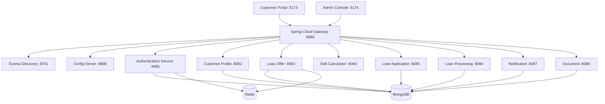

# LoanSphere — Enterprise Digital Banking Loan Platform

## Overview

LoanSphere is a production-grade enterprise digital banking loan management platform. It demonstrates the full Spring ecosystem — **Spring Boot**, **Spring Cloud**, **Spring Security** — through a realistic multi-service banking application built with Java 25 and virtual threads.

### Tech Stack

| Layer | Technology |
|---|---|
| Runtime | Java 25 + Virtual Threads |
| Framework | Spring Boot 4.0.7, Spring Framework 7 |
| Cloud | Spring Cloud 2025.1.2 (Oakwood) — Netflix Eureka, Gateway, Config, OpenFeign |
| Security | Spring Security, JWT (Nimbus), BCrypt, RBAC |
| Database | MongoDB 8 |
| Cache | Redis 7 |
| Build | Maven 3.9, Multi-Module |
| Container | Docker, Docker Compose |
| Orchestration | Kubernetes, Helm, NGINX Ingress |
| Frontend | React 19, TypeScript, Vite 6, MUI 6 |
| Admin Console | React 19, TypeScript, Vite 6, MUI 6, Recharts |
| Mail (Dev) | Mailpit |

---

## Quick Start

### Prerequisites

- Java 25
- Maven 3.9+
- Docker & Docker Compose
- Node.js 22+

### Start Infrastructure

```bash
# Start MongoDB, Redis, Mailpit, and infrastructure services
docker compose up -d mongodb redis mailpit mongo-express redis-insight
```

### Build All Services

```bash
export JAVA_HOME=$(/usr/libexec/java_home -v 25)
mvn clean compile
```

### Start All Services

```bash
docker compose up -d
```

All services register with Eureka at [http://localhost:8761](http://localhost:8761).

### Access the System

| Service | URL |
|---|---|---|
| Customer Portal (React) | [http://localhost:5173](http://localhost:5173) |
| Admin Console (React) | [http://localhost:5174](http://localhost:5174) |
| API Gateway | [http://localhost:8080](http://localhost:8080) |
| Eureka Dashboard | [http://localhost:8761](http://localhost:8761) |
| Mongo Express | [http://localhost:8089](http://localhost:8089) |
| Redis Insight | [http://localhost:5540](http://localhost:5540) |
| Mailpit | [http://localhost:8025](http://localhost:8025) |
| Swagger (per service) | `http://localhost:<port>/swagger-ui/index.html` |

### Default Administrator

- **Username:** `admin`
- **Password:** `Admin@123`
- **Role:** `SUPER_ADMIN`

### Start Frontends

```bash
# Customer Portal (port 5173)
cd ui-loan-portal
npm install --include=dev
npm run dev

# Admin Console (port 5174)
cd ui-admin-console
npm install --include=dev
npm run dev
```

- **Customer Portal** at [http://localhost:5173](http://localhost:5173) — Loan applications, offers, EMI calculator, document upload.
- **Admin Console** at [http://localhost:5174](http://localhost:5174) — Dashboard, user management, approvals, offer CRUD, settings.

Both proxy API calls to the gateway.

---

## Project Structure

```
loan-sphere/
├── pom.xml                          # Root multi-module Maven POM
├── docker-compose.yaml              # All services + infrastructure
├── .env                             # Environment defaults
├── charts/                          # Helm umbrell chart
│
├── common-api-library/              # Shared DTOs, enums, API constants
├── common-domain-library/           # Base entities, MongoDB base document
├── common-exception-library/        # Global exception handler, error models
├── common-security-library/         # JWT filter, token provider, @CurrentUser
│
├── config-server/                   # Spring Cloud Config (port 8888)
├── discovery-server/                # Eureka Service Registry (port 8761)
├── api-gateway/                     # Spring Cloud Gateway (port 8080)
│
├── authentication-service/          # Auth, JWT, RBAC (port 8081)
├── customer-profile-service/        # Customer biodata, KYC (port 8082)
├── loan-offer-service/              # Offers, eligibility, Redis cache (port 8083)
├── emi-calculation-service/         # EMI/Amortization/Prepayment (port 8084)
├── loan-application-service/        # Loan submission, tracking (port 8085)
├── loan-processing-service/         # Review, approve, reject (port 8086)
├── notification-service/            # Email/SMS, async (port 8087)
├── document-service/                # File upload, GridFS (port 8088)
│
├── docs/                            # Documentation
├── scripts/                         # Utility scripts
├── ui-loan-portal/                  # Customer React portal (port 5173)
└── ui-admin-console/                # Admin React console (port 5174)
```

---

## Architecture



All external requests flow through the API Gateway. Services communicate internally via OpenFeign with service discovery. Each service owns its MongoDB database. Redis is used for caching, sessions, JWT blacklisting, and OTPs.

---

## Key Design Decisions

1. **Multi-module Maven** — Root POM aggregates 15 modules. `mvn clean install` at root builds everything.
2. **Package-by-feature** — Each service uses domain-driven package structure.
3. **No shared database** — Each service owns its MongoDB collections exclusively.
4. **JWT propagation** — Tokens validated at gateway and re-validated by services. Propagated via Feign `RequestInterceptor`.
5. **Virtual threads everywhere** — `spring.threads.virtual.enabled=true` on every service.
6. **Constructor injection only** — All dependencies injected via constructors.
7. **Record DTOs** — Immutable data transfer objects using Java records.
8. **Global exception handling** — Centralized via `@ControllerAdvice` in `common-exception-library`.

---

## Services Summary

| Service | Port | MongoDB DB | Key Dependencies |
|---|---|---|---|
| Config Server | 8888 | — | Spring Cloud Config |
| Discovery Server | 8761 | — | Netflix Eureka |
| API Gateway | 8080 | — | Spring Cloud Gateway, Redis |
| Authentication | 8081 | `auth_db` | Security, Redis, Mail, Nimbus |
| Customer Profile | 8082 | `customer_db` | MapStruct, Feign |
| Loan Offer | 8083 | `offer_db` | Redis Cache, Resilience4j, Feign |
| EMI Calculation | 8084 | — | Stateless computation |
| Loan Application | 8085 | `application_db` | Spring Events, Feign |
| Loan Processing | 8086 | `processing_db` | Resilience4j, Feign |
| Notification | 8087 | `notification_db` | Mail, @Async, @Scheduled |
| Document | 8088 | `document_db` | GridFS, Multipart |

---

## Roles & Permissions

| Role | Description |
|---|---|
| `SUPER_ADMIN` | Full system access, user management |
| `BANK_ADMIN` | Bank-level administration, offer management |
| `LOAN_MANAGER` | Loan offer creation, application review |
| `UNDERWRITER` | Risk assessment, application approval |
| `CUSTOMER` | Self-service: profile, applications, documents |
| `SUPPORT` | Read-only access to applications and profiles |

---

## Testing

### Backend

```bash
# Unit tests
mvn test

# Specific service
mvn test -pl authentication-service
```

Testing uses JUnit 5, Mockito, and Testcontainers for MongoDB/Redis integration tests. Target coverage: 90%+.

### Frontend

```bash
cd ui-loan-portal
npm run dev      # Development server
npm run build    # Production build
```

---

## Deployment

### Docker Compose (Local)

```bash
docker compose up -d
```

### Kubernetes (Helm)

```bash
helm install loansphere ./charts
```

### Environment Variables

| Variable | Default | Description |
|---|---|---|
| `MONGODB_HOST` | `localhost` | MongoDB hostname |
| `MONGODB_PORT` | `27017` | MongoDB port |
| `MONGODB_USERNAME` | `root` | MongoDB username |
| `MONGODB_PASSWORD` | `rootroot` | MongoDB password |
| `REDIS_HOST` | `localhost` | Redis hostname |
| `REDIS_PASSWORD` | `rootroot` | Redis password |
| `JWT_SECRET` | `loansphere-...` | JWT signing secret (≥256 bits) |
| `JWT_EXPIRATION_MS` | `3600000` | Access token expiry |
| `EUREKA_SERVER_URL` | `http://localhost:8761/eureka/` | Eureka server URL |
| `MAIL_HOST` | `localhost` | SMTP host |
| `MAIL_PORT` | `1025` | SMTP port |

---

## Documentation Index

- **[Architecture Overview](docs/architecture/overview.md)** — System design and component interactions
- **[Service Catalog](docs/architecture/service-catalog.md)** — Detailed per-service specifications
- **[Code Exploration Guide](docs/architecture/code-exploration.md)** — Guided walkthrough of the codebase
- **[API Reference](docs/api/)** — Complete REST API documentation
- **[Development Guide](docs/guides/development.md)** — Local setup and workflow
- **[Deployment Guide](docs/guides/deployment.md)** — Docker, Kubernetes, and Helm
- **[Security Guide](docs/guides/security.md)** — Authentication, authorization, JWT
- **[Database Guide](docs/guides/database.md)** — MongoDB collections and indexes
- **[Configuration Guide](docs/guides/configuration.md)** — All configuration properties

## UIs

### Customer Portal (ui-loan-portal) — port 5173

The customer-facing web application where users can:
- Register and login
- View and manage their profile
- Browse available loan offers
- Calculate EMI and view amortization schedules
- Submit loan applications and track status
- Upload supporting documents
- View notifications

### Admin Console (ui-admin-console) — port 5174

The staff-facing administration panel featuring:
- **Dashboard** — Total customers, pending applications, approved/rejected loans, today's activity
- **Users** — View and manage all registered users with role assignment
- **Loan Offers** — Create, update, activate/deactivate loan products
- **Applications** — View all loan applications across all customers
- **Approvals** — Review queue with approve/reject/request-info actions
- **Settings** — Platform configuration, feature flags

Admin access is restricted to users with `SUPER_ADMIN`, `BANK_ADMIN`, `LOAN_MANAGER`, or `UNDERWRITER` roles.

---

## License

This project is for educational and demonstration purposes.
