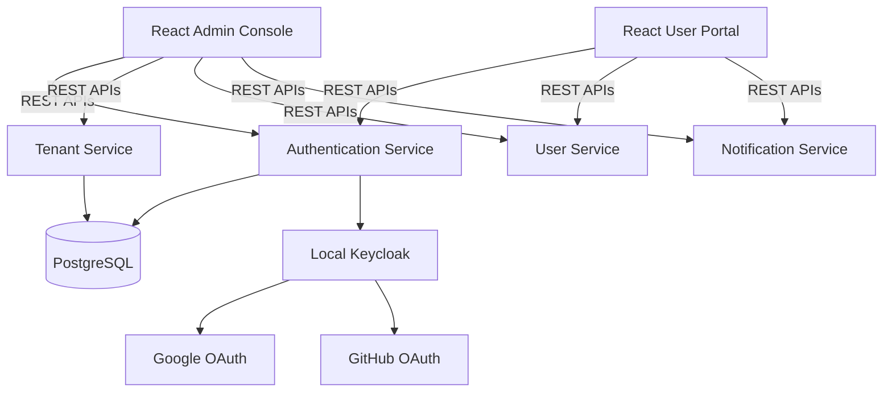

# AGENT.md

## Enterprise Single Sign-On (SSO) & Multi-Tenant User Management Platform

> **Goal**
>
> Build a production-grade Enterprise Identity and Access Management (IAM) platform using **Spring Boot 4.1**, **Spring Security 6**, **React 19.2**, **Keycloak**, **Google OAuth2**, **GitHub OAuth2**, **JWT**, and **Multi-Tenant Architecture**.
>
> This repository is intended as a learning project that covers most areas of Spring Boot while following modern enterprise architecture and best practices.
>
> The AI Agent should always favour **clean architecture**, **SOLID principles**, **production-ready implementations**, and **modern Spring Boot recommendations**.

---

## Project Goals

The repository should teach the following Spring Boot concepts:

- Spring Boot Fundamentals
- Spring MVC
- Spring Security
- OAuth2 Login
- OpenID Connect
- JWT Authentication
- Role Based Access Control (RBAC)
- Multi-Tenant Architecture
- Spring Data JPA
- Hibernate
- PostgreSQL
- Flyway
- Spring Validation
- Spring Events
- Spring Cache
- Async Processing
- Scheduling
- Email
- File Upload
- API Documentation
- Docker
- Docker Compose
- Helm
- Kubernetes
- Ingress
- Testing

**Do NOT include**

- Prometheus
- Grafana
- Jaeger
- Zipkin
- OpenTelemetry
- ELK
- Loki
- Monitoring Stack
- Service Mesh

---

## Technology Baseline

- **Java 25 (LTS)** for every backend service, with **Spring Boot 4.1** (latest GA) as the baseline, paired with matching current-generation Spring Security, Spring Data JPA, Hibernate, MapStruct and springdoc-openapi versions compatible with it.
- **Virtual Threads** must be enabled on every service (`spring.threads.virtual.enabled=true`); Tomcat, JDBC/Hibernate calls, OAuth2 token exchanges and `@Async`/scheduled work should run on virtual threads instead of platform thread pools. Avoid `synchronized` blocks; prefer `ReentrantLock` where locking is required.
- **React 19.2** (latest GA) as the baseline for both frontend apps, paired with the current stable TypeScript, Vite, TanStack Query, React Router, Material UI, React Hook Form and Zod versions compatible with it.
- Beyond these pinned baselines, always prefer the **latest stable release** of every other library in the stack at implementation time instead of pinning to older majors.
- Prefer modern patterns (React Compiler-friendly code, function components, hooks, no legacy class components).

---

## No Shared Libraries / No Monorepo Tooling

This repository is a collection of **fully independent Spring Boot projects**, not a monorepo with shared code.

- There is **no parent POM** and **no shared/common library** (no `common-security-library`, `common-auth-library`, `common-api-library`, `common-exception-library`).
- Every service under `backend/` owns **its own** `pom.xml` (or Gradle build), its own DTOs, mappers, exception classes and security config — duplication across services is expected and acceptable.
- Do not introduce cross-module Maven/Gradle dependencies between backend services. Services only communicate over the network (REST), never via shared JARs.
- Do not extract multi-module Maven reactor builds, BOMs, or Gradle composite builds to "deduplicate" services — each service must build and deploy on its own.
- Each React app under `ui/` has its own `package.json`, its own components/hooks/API clients — no shared npm workspace or shared component library between `ui/admin-console` and `ui/user-portal`.

---

## Implementation Expectations

When asked to generate a service or feature, the AI Agent must produce **actual working implementation code**, not placeholders or scaffolding:

- Real controllers, services, repositories, entities, DTOs, mappers, security config, and exception handlers with full method bodies — not `// TODO` stubs or empty classes.
- Real React components, hooks and API service files with working logic (state, effects, API calls, form validation) — not empty JSX shells or placeholder components.
- Configuration files (`application.yml`, `.env`, Dockerfiles, Helm values) should contain concrete, usable values consistent with the rest of the stack, not generic placeholders left for the user to fill in.

---

## Technology Stack

### Backend

- Java 25 (virtual threads enabled)
- Spring Boot 4.1
- Spring Security
- Spring Authorization Server (where appropriate)
- Spring OAuth2 Client
- Spring OAuth2 Resource Server
- Spring Data JPA
- Hibernate
- PostgreSQL
- Flyway
- MapStruct
- Lombok
- Spring Validation
- Spring Cache
- Spring Scheduling
- Spring Events
- Spring Mail
- Spring Actuator (health only)
- OpenAPI / Swagger

---

### Authentication

The application must support

- Local Login
- Google Login
- GitHub Login
- Local Keycloak Login
- JWT Authentication
- Refresh Tokens
- Logout
- Password Reset
- Forgot Password
- Email Verification

---

### Frontend

- React 19.2
- Vite
- TypeScript
- React Router
- Material UI
- TanStack Query
- React Hook Form
- Axios
- Zod

---

### Infrastructure

- Docker
- Docker Compose
- Helm
- Kubernetes
- NGINX Ingress

---

## Repository Structure

```
enterprise-sso-platform/
├── charts/
├── docker-compose.yaml
├── docs/
├── scripts/
├── ui/
│   ├── admin-console/
│   └── user-portal/
├── backend/
│   ├── authentication-service/
│   ├── tenant-management-service/
│   ├── user-management-service/
│   ├── notification-service/
│   └── file-storage-service/
├── README.md
└── AGENT.md
```

Each directory under `backend/` and `ui/` is a standalone, independently buildable project (its own build file, no shared parent, no shared library module).

---

## Overall Architecture



---

## Root Components

- `charts/`
- `docker-compose.yaml`
- `docs/`
- `scripts/`
- `ui/admin-console/`
- `ui/user-portal/`
- `backend/authentication-service/`
- `backend/tenant-management-service/`
- `backend/user-management-service/`
- `backend/notification-service/`
- `backend/file-storage-service/`

No `common-*` library modules and no parent/aggregator POM — every entry above is a fully independent, self-contained project.

---

## Common Service Structure

Every Spring Boot service should follow

```
backend/service-name/
src/
├── main/
│   ├── java/
│   │   ├── config/
│   │   ├── configuration/
│   │   ├── controller/
│   │   ├── dto/
│   │   ├── entity/
│   │   ├── repository/
│   │   ├── service/
│   │   ├── mapper/
│   │   ├── security/
│   │   ├── tenant/
│   │   ├── validation/
│   │   ├── advice/
│   │   ├── exception/
│   │   ├── util/
│   │   ├── constant/
│   │   ├── event/
│   │   ├── listener/
│   │   ├── scheduler/
│   │   └── filter/
│   │
│   └── resources/
│
└── test/

Dockerfile
README.md
helm/
```

---

## Project 1: Authentication Service

Repository: `backend/authentication-service`

**Responsibilities**

- Username Password Login
- Google OAuth Login
- GitHub OAuth Login
- Local Keycloak Login
- JWT Token Generation
- Refresh Token
- Logout
- Session Management
- Email Verification
- Password Reset
- Forgot Password

**Spring Topics**

- Spring Security
- OAuth2 Client
- OpenID Connect
- JWT
- Cookie Security
- Authentication Providers
- Filters
- Security Configuration

---

## Project 2: Tenant Management Service

Repository: `backend/tenant-management-service`

**Responsibilities**

- Tenant Registration
- Tenant Provisioning
- Tenant Activation
- Tenant Suspension
- Tenant Configuration
- Tenant Branding
- Tenant Domain Mapping

**Spring Topics**

- Multi-Tenant Architecture
- Hibernate Multi-Tenant
- Filters
- Interceptors
- Request Context
- Database Routing
- Tenant Resolver

---

## Project 3: User Management Service

Repository: `backend/user-management-service`

**Responsibilities**

- User CRUD
- Invite User
- Disable User
- Assign Roles
- Assign Permissions
- User Profile
- User Preferences

**Spring Topics**

- JPA
- Validation
- Transactions
- Pagination
- Specifications
- Entity Graphs

---

## Project 4: Notification Service

**Responsibilities**

- Welcome Email
- Password Reset Email
- Verification Email
- Invitation Email

**Spring Topics**

- Spring Mail
- Async
- Scheduling

---

## Project 5: File Storage Service

**Responsibilities**

- User Avatar Upload
- Tenant Logo Upload
- Document Upload

**Spring Topics**

- Multipart Upload
- Validation
- File Storage
- Static Resource Serving

---

## Multi-Tenant Design

The platform must support

- Multiple Organisations
- Tenant Isolation
- Tenant Admin
- Tenant Users
- Tenant Configuration
- Tenant Branding

Tenant information should be resolved using a header (`X-Tenant-ID`) or a subdomain (`tenant.example.com`).

The implementation should be modular enough to allow

- Database per Tenant
- Schema per Tenant

without changing business logic.

---

## Roles

- `SUPER_ADMIN`
- `TENANT_ADMIN`
- `MANAGER`
- `USER`
- `VIEWER`

Permissions should be database driven.

---

## Default Admin User

Automatically seed:

- **Username:** `admin`
- **Password:** `Admin@123`

Default tenant: `master`

---

## React Project: Admin Console

Repository: `ui/admin-console`

**Pages**

- Login
- Dashboard
- Tenants
- Users
- Roles
- Permissions
- Profile
- Settings
- Audit
- File Upload
- Administration

---

## React Components (Admin Console)

- Navbar
- Sidebar
- Header
- Footer
- ProtectedRoute
- UserTable
- TenantTable
- RoleTable
- PermissionTable
- LoginForm
- RegistrationForm
- ForgotPassword
- ResetPassword
- AvatarUpload
- Dialogs
- Cards
- Charts
- Loading
- Snackbar

---

## React Hooks (Admin Console)

- `useAuth`
- `useUser`
- `useTenant`
- `useRole`
- `usePermission`
- `useProfile`
- `useFileUpload`

---

## React Services (Admin Console)

- `authApi.ts`
- `tenantApi.ts`
- `userApi.ts`
- `roleApi.ts`
- `permissionApi.ts`
- `profileApi.ts`
- `uploadApi.ts`

---

## React Project: User Portal

Repository: `ui/user-portal`

A self-service portal for normal (non-admin) end users to manage their own account across tenants, distinct from the tenant/system administration console.

**Pages**

- Login
- Register
- Forgot Password
- Reset Password
- Email Verification
- Home / My Dashboard
- My Profile
- Security (Change Password, Sessions, Connected Accounts)
- Notifications
- My Files
- Organisation Invitations
- Account Deactivation

---

## React Components (User Portal)

- Navbar
- Footer
- ProtectedRoute
- LoginForm
- RegistrationForm
- ForgotPasswordForm
- ResetPasswordForm
- OAuthLoginButtons
- ProfileForm
- SecurityPanel
- SessionList
- AvatarUpload
- NotificationList
- InvitationCard
- Loading
- Snackbar

---

## React Hooks (User Portal)

- `useAuth`
- `useProfile`
- `useSecurity`
- `useSessions`
- `useNotifications`
- `useFileUpload`
- `useInvitations`

---

## React Services (User Portal)

- `authApi.ts`
- `profileApi.ts`
- `securityApi.ts`
- `notificationApi.ts`
- `uploadApi.ts`
- `invitationApi.ts`

---

### Access

- Uses the same Authentication Service (local login, Google OAuth, GitHub OAuth, Keycloak) as the Admin Console.
- Restricted to the authenticated user's own tenant-scoped data; no tenant, role or permission management screens.
- Users with elevated roles (`TENANT_ADMIN`, `SUPER_ADMIN`) may still use the User Portal for personal account management, and separately access the Admin Console for administration.

---

## Admin Dashboard

The dashboard should display

- Total Tenants
- Total Users
- Active Users
- Inactive Users
- OAuth Login Statistics
- Local Login Statistics
- Tenant Overview
- User Activity
- Recent Registrations
- Role Distribution

---

## Security Best Practices

Always implement

- Stateless Authentication
- JWT
- Refresh Tokens
- Password Hashing (BCrypt)
- CSRF Protection where applicable
- CORS Configuration
- Role Based Access Control
- Method Level Security
- Secure Cookies
- OAuth2 Best Practices
- OpenID Connect Best Practices
- Password Policy
- Account Locking
- Brute Force Protection
- Session Revocation

---

## Docker

Each service should contain

- Multi-stage Dockerfile
- Non-root User
- Small Runtime Image
- Health Check
- Environment Variables
- Build Cache Optimisation

---

## Docker Compose

The root compose file should start

- PostgreSQL
- Keycloak
- Authentication Service
- Tenant Service
- User Service
- Notification Service
- File Storage Service
- React Admin Console
- React User Portal

---

## Helm Structure

Each service must contain

```
helm/
├── Chart.yaml
├── values.yaml
└── templates/
    ├── deployment.yaml
    ├── service.yaml
    ├── configmap.yaml
    ├── secret.yaml
    ├── ingress.yaml
    ├── serviceaccount.yaml
    └── _helpers.tpl
```

---

## Kubernetes Best Practices

Every deployment must include

- Resource Requests
- Resource Limits
- Liveness Probe
- Readiness Probe
- Rolling Updates
- ConfigMaps
- Secrets
- Labels
- Selectors
- Environment Variables
- Graceful Shutdown

---

## Ingress

Create one NGINX Ingress.

**Routes**

- `/`
- `/admin`
- `api/auth`
- `api/users`
- `api/tenants`
- `api/files`
- `api/notifications`

The React User Portal should be available at `/`, and the React Admin Console should be available at `/admin`.

TLS-ready configuration should be supported.

---

## Testing

Every backend service must include

### Unit Tests

- Controller Tests
- Service Tests
- Repository Tests
- Security Tests
- Validation Tests
- Mapper Tests
- Utility Tests

Target: **90%+ coverage**

---

### Integration Tests

Use

- Spring Boot Test
- Testcontainers
- PostgreSQL
- Mock OAuth Providers where appropriate

Test

- Login
- Registration
- OAuth
- JWT
- Tenant Resolution
- CRUD APIs
- Security Rules
- Database Access

---

## Frontend Tests

Use

- Vitest
- React Testing Library

Test

- Components
- Hooks
- API Clients
- Authentication Flow
- Protected Routes
- Forms

---

## Spring Boot Best Practices

The agent must always follow modern enterprise Spring Boot practices:

- Use constructor injection exclusively.
- Follow package-by-feature where practical.
- Keep controllers thin and delegate business logic to services.
- Never expose JPA entities directly; use DTOs.
- Use MapStruct for mapping.
- Apply Bean Validation to all incoming requests.
- Centralise exception handling with `@ControllerAdvice`.
- Externalise configuration using profiles and environment variables.
- Use immutable DTOs (`record`) where appropriate.
- Design reusable security components.
- Keep authentication and authorisation separate.
- Make all APIs versionable.
- Use Flyway for all schema changes.
- Document APIs with OpenAPI.
- Prefer composition over inheritance.
- Follow SOLID, DRY and KISS principles.
- Write meaningful unit and integration tests for every feature.
- Ensure code is modular, readable and maintainable.

---

## Development Workflow

For every feature, the AI Agent should:

1. Design the domain model.
2. Create or update Flyway migrations.
3. Implement entities and repositories.
4. Develop business services.
5. Expose REST APIs.
6. Secure endpoints with Spring Security.
7. Update the React Admin Console and React User Portal.
8. Add unit tests.
9. Add integration tests.
10. Build Docker images.
11. Update Docker Compose.
12. Create or update Helm charts.
13. Configure Kubernetes Ingress.
14. Update documentation.

---

## Deliverable

The final repository should resemble a real-world enterprise Identity & Access Management platform that demonstrates:

- Java 25 with virtual threads enabled across all services
- Spring Boot 4.1 backend services and a React 19.2 frontend, with all other libraries kept at their latest compatible stable releases
- Independent, non-monorepo services with no shared libraries or parent POM
- Enterprise authentication and authorisation
- Google OAuth2 integration
- GitHub OAuth2 integration
- Local Keycloak integration
- Multi-tenant architecture
- React administration portal
- Dockerised development
- Kubernetes deployment with Helm
- Clean, production-ready Spring Boot architecture
- Comprehensive testing
- Secure coding practices

The implementation should be educational, modular and extensible, enabling additional identity providers (such as Microsoft Entra ID, Okta or Auth0) to be integrated with minimal changes in the future.