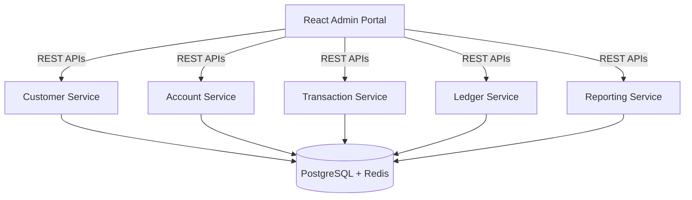

# AGENT.md

## LedgerX

### Banking Ledger & High-Concurrency Transaction Engine

> **Objective**
>
> Build a production-grade **Banking Ledger & High-Concurrency Transaction Engine** using **Spring Boot 3**, **Spring Data JPA**, **PostgreSQL**, **Redis**, and **React**.
>
> This repository is intended to teach advanced Spring Boot concepts through realistic banking microservices while following modern enterprise architecture and production-ready engineering practices.
>
> The AI Agent should always generate clean, modular, testable, secure and maintainable code following current Spring Boot best practices.
>
> **Observability (Prometheus, Grafana, OpenTelemetry, Jaeger, ELK, etc.) must NOT be included.**

---

## Learning Objectives

The repository should demonstrate:

### Spring Boot

- Spring Boot Fundamentals
- Spring MVC
- Spring Security
- Spring Validation
- Spring Scheduling
- Spring Events
- Spring Cache
- Async Processing
- Spring Profiles
- Configuration Properties
- Global Exception Handling
- Spring Retry
- OpenAPI / Swagger

---

### Spring Data JPA

- Entity Relationships
- OneToOne
- OneToMany
- ManyToOne
- ManyToMany
- Composite Keys
- Embedded Objects
- Optimistic Locking
- Pessimistic Locking
- Versioning (`@Version`)
- Transactions
- Transaction Propagation
- Isolation Levels
- Native Queries
- JPQL
- Criteria API
- Specifications
- Pageable
- Sorting
- Entity Graph
- Fetch Join
- Batch Fetching
- Lazy vs Eager Loading
- Cascade Types
- Auditing
- Soft Delete
- Custom Repository
- Projection Interfaces
- DTO Projection
- Stored Procedures (optional)
- Flyway Database Migration

---

### PostgreSQL

Use PostgreSQL for

- Accounts
- Customers
- Transactions
- Ledger Entries
- Audit Records
- Branches
- Users
- Roles

---

### Redis

Use Redis for

- Frequently Accessed Accounts
- Customer Cache
- Session Cache
- Authentication Cache
- Dashboard Cache
- OTP Storage
- Transaction Idempotency Keys
- Rate Limiting
- Distributed Locking
- Short-lived Business Cache

---

### Frontend

- React
- TypeScript
- Vite
- Material UI
- React Router
- Axios
- TanStack Query
- React Hook Form
- Zod
- Recharts

---

### Infrastructure

- Docker
- Docker Compose
- Helm
- Kubernetes
- NGINX Ingress

---

## Repository Structure

```
ledgerx-platform/
├── charts/
├── docker-compose.yaml
├── docs/
├── scripts/
├── ui-admin-portal/
├── customer-service/
├── account-service/
├── ledger-service/
├── transaction-service/
├── reporting-service/
├── common-api-library/
├── common-security-library/
├── common-domain-library/
├── common-exception-library/
├── README.md
└── AGENT.md
```

---

## High-Level Architecture



---

## Root Components

- `charts/`
- `docker-compose.yaml`
- `docs/`
- `scripts/`
- `ui-admin-portal/`
- `customer-service/`
- `account-service/`
- `transaction-service/`
- `ledger-service/`
- `reporting-service/`
- `common-api-library/`
- `common-security-library/`
- `common-domain-library/`
- `common-exception-library/`

---

## Standard Structure for Every Backend

```
service-name/
├── src/
│   ├── main/
│   │   ├── java/
│   │   │   ├── config/
│   │   │   ├── configuration/
│   │   │   ├── controller/
│   │   │   ├── dto/
│   │   │   ├── entity/
│   │   │   ├── repository/
│   │   │   ├── specification/
│   │   │   ├── projection/
│   │   │   ├── service/
│   │   │   ├── mapper/
│   │   │   ├── validation/
│   │   │   ├── advice/
│   │   │   ├── exception/
│   │   │   ├── cache/
│   │   │   ├── security/
│   │   │   ├── event/
│   │   │   ├── scheduler/
│   │   │   ├── util/
│   │   │   └── constant/
│   │   └── resources/
│   └── test/
├── Dockerfile
├── README.md
└── helm/
```

---

## Project 1: Customer Service

Repository: `customer-service`

**Responsibilities**

- Customer Registration
- Customer Search
- Customer Update
- Customer Address
- Customer Documents
- KYC Status

**Database**

- `customers`
- `addresses`
- `customer_documents`

**Spring Topics**

- Validation
- Pageable
- Specifications
- DTO Mapping
- Auditing
- Entity Graph

**Redis**

- Customer Cache

---

## Project 2: Account Service

Repository: `account-service`

**Responsibilities**

- Create Account
- Close Account
- Freeze Account
- Unfreeze Account
- Account Summary
- Balance Enquiry

**Database**

- `accounts`
- `account_types`
- `branches`

**Advanced JPA Topics**

- Optimistic Locking
- Pessimistic Locking
- Composite Keys
- Fetch Join
- Projections
- JPQL
- Criteria API

**Redis**

- Account Cache

---

## Project 3: Transaction Service

Repository: `transaction-service`

**Responsibilities**

- Deposit
- Withdraw
- Transfer
- Reverse Transaction
- Scheduled Transfer
- Transaction Validation

**Database**

- `transactions`

**Advanced Spring Topics**

- Transaction Management
- Isolation Levels
- Propagation
- Retry
- Async Processing

**Advanced JPA**

- `@Version`
- Pessimistic Write Lock
- Batch Updates

**Redis**

- Idempotency Keys
- Transaction Cache
- Distributed Lock

---

## Project 4: Ledger Service

Repository: `ledger-service`

**Responsibilities**

- Double Entry Accounting
- Ledger Posting
- Journal Entries
- Balance Verification
- End of Day Closing

**Database**

- `ledger_entries`
- `journals`

**Spring Topics**

- Events
- Scheduling
- Batch Processing

**JPA Topics**

- Batch Inserts
- Cascade
- Entity Relationships

**Redis**

- Ledger Cache

---

## Project 5: Reporting Service

Repository: `reporting-service`

**Responsibilities**

- Customer Reports
- Transaction Reports
- Ledger Reports
- Daily Summary
- Branch Summary

**Advanced JPA**

- Pageable
- Sorting
- Specifications
- Native Queries
- DTO Projection
- Aggregation Queries

**Redis**

- Dashboard Cache

---

## React Application

Repository: `ui-admin-portal`

### Pages

- Login
- Dashboard
- Customers
- Accounts
- Transactions
- Ledger
- Reports
- Branches
- Users
- Settings

---

### Components

- Navbar
- Sidebar
- Header
- Footer
- DashboardCards
- CustomerTable
- AccountTable
- TransactionTable
- LedgerTable
- ReportsTable
- Charts
- Dialogs
- Pagination
- SearchBar
- Filters
- Forms
- Snackbar
- Loading
- ProtectedRoute

---

### Hooks

- `useAuth()`
- `useCustomers()`
- `useAccounts()`
- `useTransactions()`
- `useLedger()`
- `useReports()`
- `useBranches()`

---

### API Clients

- `authApi.ts`
- `customerApi.ts`
- `accountApi.ts`
- `transactionApi.ts`
- `ledgerApi.ts`
- `reportApi.ts`

---

## Authentication

Spring Security with

- JWT
- Refresh Token
- BCrypt
- RBAC
- Method Security

---

## Roles

- `SUPER_ADMIN`
- `BANK_ADMIN`
- `BRANCH_MANAGER`
- `TELLER`
- `AUDITOR`
- `CUSTOMER_SUPPORT`
- `READ_ONLY`

---

## Default Administrator

Automatically seed:

- **Username:** `admin`
- **Password:** `Admin@123`

---

## Admin Dashboard

Display

- Total Customers
- Active Accounts
- Total Transactions
- Today's Transactions
- Pending Transfers
- Ledger Balance
- Branch Statistics
- Cached Objects
- Daily Deposits
- Daily Withdrawals

---

## Docker

Every backend service must include

- Multi-stage Dockerfile
- Eclipse Temurin JRE image
- Non-root user
- Healthcheck
- Environment variables
- Build cache optimisation

---

## Docker Compose

The root compose file should start

- PostgreSQL
- pgAdmin
- Redis
- Redis Insight
- Customer Service
- Account Service
- Transaction Service
- Ledger Service
- Reporting Service
- React UI

---

## Helm Structure

Every service should include

```
helm/
├── Chart.yaml
├── values.yaml
├── NOTES.txt
└── templates/
    ├── deployment.yaml
    ├── service.yaml
    ├── configmap.yaml
    ├── secret.yaml
    ├── ingress.yaml
    └── serviceaccount.yaml
```

---

## Kubernetes Best Practices

Every deployment should implement

- Rolling Updates
- Resource Requests
- Resource Limits
- ConfigMaps
- Secrets
- Readiness Probe
- Liveness Probe
- Startup Probe
- Graceful Shutdown
- Labels
- Selectors
- Anti-affinity (optional)
- Horizontal Pod Autoscaler template (disabled by default)

---

## NGINX Ingress

**Routes**

- `/`
- `api/customers`
- `api/accounts`
- `api/transactions`
- `api/ledger`
- `api/reports`

TLS-ready configuration should be included.

---

## Redis Best Practices

Demonstrate

- Spring Cache Abstraction
- `@Cacheable`
- `@CachePut`
- `@CacheEvict`
- Cache Manager
- RedisTemplate
- TTL
- Cache Namespaces
- Distributed Locks
- Idempotency Keys

---

## Advanced Spring Data JPA Topics to Demonstrate

The AI Agent must intentionally include practical examples of:

- `JpaRepository`
- `PagingAndSortingRepository`
- `JpaSpecificationExecutor`
- Custom Repository Implementations
- `@EntityGraph`
- `@NamedEntityGraph`
- `@Query`
- Native SQL Queries
- JPQL
- Criteria API
- Dynamic Specifications
- Interface Projections
- DTO Projections
- Batch Processing
- Fetch Joins
- Pagination
- Sorting
- Auditing (`@CreatedDate`, `@LastModifiedDate`)
- Optimistic Locking
- Pessimistic Locking
- Transaction Isolation Levels
- Lazy vs Eager Loading
- Soft Deletes
- Flyway Migrations

---

## Unit Testing

Every backend must include unit tests for

- Controllers
- Services
- Repositories
- Specifications
- Security
- Validators
- Mappers
- Cache Services
- Utility Classes

Minimum coverage target: **90%+**

---

## Integration Testing

Use

- Spring Boot Test
- Testcontainers
- PostgreSQL Container
- Redis Container

Test

- Repository Operations
- Pageable Queries
- Specifications
- Cache Behaviour
- Transactions
- Concurrency
- Locking
- Authentication
- REST APIs

---

## Frontend Testing

Use

- Vitest
- React Testing Library

Test

- Components
- Forms
- Hooks
- API Clients
- Protected Routes
- Dashboard Widgets
- Tables
- Pagination
- Filters

---

## Spring Boot Best Practices

The AI Agent must always follow these engineering practices:

### General

- Use Java 21 features where appropriate.
- Follow SOLID, DRY and KISS principles.
- Prefer composition over inheritance.
- Keep methods small and focused.
- Follow package-by-feature architecture.

### Dependency Injection

- Use constructor injection exclusively.
- Avoid field injection.

### REST APIs

- Build versioned REST APIs.
- Return consistent response models.
- Use proper HTTP status codes.
- Generate OpenAPI documentation for all endpoints.

### Persistence

- Never expose JPA entities directly.
- Use DTOs for API contracts.
- Use MapStruct for object mapping.
- Optimise queries to avoid the N+1 problem.
- Use projections when entities are unnecessary.
- Choose lazy loading by default and fetch eagerly only when required.
- Use pagination for list endpoints.
- Index frequently queried database columns.
- Keep transactions short and focused.

### Caching

- Cache only data that benefits from reuse.
- Define appropriate TTL values.
- Evict caches after updates.
- Prevent cache stampedes where appropriate.
- Use Redis for transient, high-throughput data rather than long-term persistence.

### Security

- Encrypt passwords using BCrypt.
- Apply role-based and method-level security.
- Configure CORS correctly.
- Validate all incoming requests.
- Protect sensitive endpoints.

### Error Handling

- Centralise exception handling with `@ControllerAdvice`.
- Return structured error responses.
- Avoid exposing internal implementation details.

### Testing

- Unit test all business logic.
- Integration test all persistence and cache interactions.
- Include concurrency tests for transaction and ledger operations.

---

## Development Workflow

For every feature, the AI Agent should:

1. Design the domain model.
2. Create or update Flyway migrations.
3. Implement entities and repositories.
4. Implement business services.
5. Apply JPA best practices.
6. Add Redis caching where appropriate.
7. Expose REST APIs.
8. Secure endpoints with Spring Security.
9. Update the React UI.
10. Write unit tests.
11. Write integration tests.
12. Build Docker images.
13. Update Docker Compose.
14. Create or update Helm charts.
15. Configure Kubernetes Ingress.
16. Update project documentation.

---

## Expected Outcome

The completed repository should resemble a production-quality banking platform demonstrating:

- Advanced Spring Boot 3 architecture
- Enterprise Spring Data JPA
- High-concurrency transaction processing
- Double-entry ledger implementation
- PostgreSQL best practices
- Redis caching strategies
- Advanced pagination and specifications
- Secure JWT authentication
- React administration portal
- Docker-based local development
- Kubernetes deployment with Helm
- Production-ready code organisation
- Comprehensive unit and integration testing

The repository should serve as a comprehensive learning reference for intermediate to advanced Spring Boot developers and showcase enterprise-grade coding standards throughout.