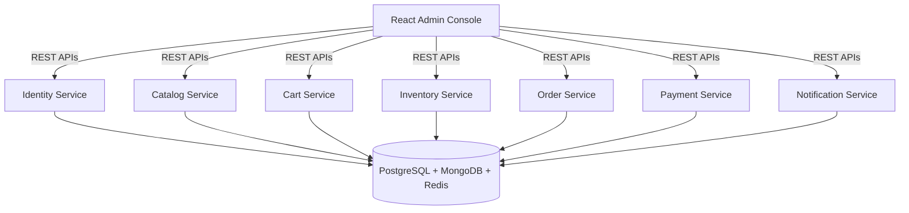

# AGENT.md

## NovaCommerce

### Enterprise E-Commerce Platform with Spring Security & Hybrid Storage

> **Objective**
>
> Build a production-ready enterprise e-commerce platform using **Spring Boot 3**, **Spring Security 6**, **React**, **PostgreSQL**, **MongoDB**, and **Redis**.
>
> This project is designed to teach nearly every important aspect of Spring Boot by building an enterprise-scale microservices application.
>
> The AI Agent should always follow modern Spring Boot, Spring Security and software engineering best practices while producing modular, testable, secure and maintainable code.
>
> **Do NOT include Observability** (Prometheus, Grafana, OpenTelemetry, Jaeger, Zipkin, ELK, Loki, etc.).

---

## Learning Objectives

This repository should teach:

### Spring Boot

- Spring Boot Fundamentals
- Spring MVC
- Spring Validation
- Spring Profiles
- Spring Events
- Spring Scheduling
- Spring Cache
- Async Processing
- Global Exception Handling
- OpenAPI (Swagger)
- Bean Validation
- File Upload
- Mail Support

---

### Spring Security

The project should comprehensively cover:

- Spring Security 6
- Security Filter Chain
- JWT Authentication
- Refresh Tokens
- Role Based Access Control (RBAC)
- Permission Based Authorization
- Method Level Security
- Custom Authentication Provider
- Password Encryption (BCrypt)
- Stateless Authentication
- Session Management
- CSRF
- CORS
- AuthenticationEntryPoint
- AccessDeniedHandler
- Custom UserDetailsService
- Login & Logout
- Remember Me (optional)
- Account Locking
- Password Reset
- Email Verification

---

### Spring Data

#### PostgreSQL

Use PostgreSQL for:

- Users
- Orders
- Payments
- Inventory
- Roles
- Permissions
- Addresses

#### MongoDB

Use MongoDB for:

- Products
- Categories
- Brands
- Product Specifications
- Reviews
- Product Images
- Search Metadata

#### Redis

Use Redis for:

- Shopping Cart
- Wishlist
- Sessions
- Product Cache
- OTP Storage
- Rate Limiting
- JWT Blacklist
- Frequently Viewed Products

---

### Frontend

- React
- TypeScript
- Vite
- React Router
- Axios
- TanStack Query
- Material UI
- React Hook Form
- Zod
- Recharts

---

### Infrastructure

- Docker
- Docker Compose
- Helm
- Kubernetes
- NGINX Ingress

---

## Repository Structure

```
nova-commerce/
├── charts/
├── docker-compose.yaml
├── docs/
├── scripts/
├── ui-admin-console/
├── identity-service/
├── catalog-service/
├── cart-service/
├── order-service/
├── inventory-service/
├── payment-service/
├── notification-service/
├── common-security-library/
├── common-api-library/
├── common-model-library/
├── common-exception-library/
├── README.md
└── AGENT.md
```

---

## High-Level Architecture



---

## Standard Structure for Every Service

```
service-name/
├── src/
│   ├── main/
│   │   ├── java/
│   │   │   ├── config/
│   │   │   ├── configuration/
│   │   │   ├── security/
│   │   │   ├── controller/
│   │   │   ├── dto/
│   │   │   ├── entity/
│   │   │   ├── repository/
│   │   │   ├── service/
│   │   │   ├── mapper/
│   │   │   ├── validator/
│   │   │   ├── advice/
│   │   │   ├── exception/
│   │   │   ├── cache/
│   │   │   ├── event/
│   │   │   ├── listener/
│   │   │   ├── scheduler/
│   │   │   ├── util/
│   │   │   └── constant/
│   │   └── resources/
│   └── test/
├── Dockerfile
├── README.md
└── helm/
```

---

## Project 1: Identity Service

Repository: `identity-service`

**Responsibilities**

- User Registration
- Login
- Logout
- JWT Authentication
- Refresh Token
- Password Reset
- Email Verification
- User Profile
- Role Management
- Permission Management

**Spring Topics**

- Spring Security
- JWT
- BCrypt
- Filters
- Authentication Manager
- Authorization
- RBAC
- Method Security

**Database: PostgreSQL**

Tables

- `users`
- `roles`
- `permissions`
- `refresh_tokens`

**Redis**

- Sessions
- Blacklisted Tokens
- OTP

---

## Project 2: Catalog Service

Repository: `catalog-service`

**Responsibilities**

- Product CRUD
- Categories
- Brands
- Product Search
- Product Reviews
- Product Images
- Product Specifications

**MongoDB Collections**

- `products`
- `categories`
- `brands`
- `reviews`

**Redis**

- Product Cache
- Trending Products
- Featured Products

**Spring Topics**

- Spring Data MongoDB
- Pagination
- Search
- Aggregation
- Spring Cache

---

## Project 3: Cart Service

Repository: `cart-service`

**Responsibilities**

- Shopping Cart
- Wishlist
- Coupon Application
- Recently Viewed Products

**Redis**

- Shopping Cart
- Wishlist
- Coupon Cache
- Recently Viewed

**MongoDB**

- Cart History

**Spring Topics**

- RedisTemplate
- Cache Manager
- `@Cacheable`
- `@CachePut`
- `@CacheEvict`

---

## Project 4: Inventory Service

Repository: `inventory-service`

**Responsibilities**

- Stock Management
- Warehouse Management
- Inventory Reservation
- Low Stock Alerts

**PostgreSQL**

Tables

- `inventory`
- `warehouses`

**Redis**

- Inventory Cache

**Spring Topics**

- Spring Data JPA
- Transactions
- Scheduling

---

## Project 5: Order Service

Repository: `order-service`

**Responsibilities**

- Checkout
- Order Placement
- Order Cancellation
- Order Tracking
- Order History

**PostgreSQL**

Tables

- `orders`
- `order_items`

**Spring Topics**

- Transactions
- Validation
- Events

**Redis**

- Checkout Cache

---

## Project 6: Payment Service

Repository: `payment-service`

**Responsibilities**

- Payment Processing
- Refund
- Invoice Generation
- Payment History

**PostgreSQL**

Tables

- `payments`

**Spring Topics**

- Transactions
- Async Processing
- Events

---

## Project 7: Notification Service

Repository: `notification-service`

**Responsibilities**

- Email Notifications
- Password Reset Emails
- Order Notifications
- Promotional Emails

**Spring Topics**

- Spring Mail
- Async
- Scheduling

---

## React Application

Repository: `ui-admin-console`

### Pages

- Login
- Dashboard
- Products
- Categories
- Brands
- Orders
- Inventory
- Payments
- Customers
- Shopping Cart
- Wishlist
- Users
- Roles
- Permissions
- Settings

---

### Components

- Navbar
- Sidebar
- Header
- Footer
- DashboardCards
- ProductTable
- CategoryTable
- InventoryTable
- OrderTable
- UserTable
- RoleTable
- PermissionTable
- ShoppingCart
- Wishlist
- Dialogs
- Pagination
- SearchBar
- Filters
- Charts
- Snackbar
- Loading
- ProtectedRoute

---

### React Hooks

- `useAuth()`
- `useProducts()`
- `useOrders()`
- `useInventory()`
- `useUsers()`
- `useRoles()`
- `usePermissions()`
- `useCart()`
- `useWishlist()`
- `usePayments()`

---

### API Clients

- `authApi.ts`
- `catalogApi.ts`
- `cartApi.ts`
- `orderApi.ts`
- `inventoryApi.ts`
- `paymentApi.ts`
- `userApi.ts`

---

## Authentication & Authorization

The application must support

- JWT Authentication
- Refresh Tokens
- BCrypt Password Hashing
- RBAC
- Permission-Based Authorization
- Stateless Authentication
- Secure Logout
- Account Locking
- Password Reset
- Email Verification

---

## Roles

- `SUPER_ADMIN`
- `ADMIN`
- `PRODUCT_MANAGER`
- `ORDER_MANAGER`
- `INVENTORY_MANAGER`
- `SUPPORT_AGENT`
- `CUSTOMER`

---

## Default Administrator

Automatically seed:

- **Username:** `admin`
- **Password:** `Admin@123`

---

## Admin Dashboard

The dashboard should include

- Total Products
- Active Users
- Pending Orders
- Completed Orders
- Revenue Summary
- Inventory Levels
- Low Stock Products
- Popular Categories
- Product Reviews
- Shopping Cart Statistics

---

## Docker

Every backend service must include

- Multi-stage Dockerfile
- Non-root User
- Small Runtime Image
- Health Check
- Environment Variables
- Build Cache Optimisation

---

## Docker Compose

The root compose file should start

- PostgreSQL
- pgAdmin
- MongoDB
- Mongo Express
- Redis
- Redis Insight
- Identity Service
- Catalog Service
- Cart Service
- Inventory Service
- Order Service
- Payment Service
- Notification Service
- React UI

---

## Helm

Every service must contain

```
helm/
├── Chart.yaml
├── values.yaml
├── NOTES.txt
└── templates/
    ├── deployment.yaml
    ├── service.yaml
    ├── configmap.yaml
    ├── secret.yaml
    ├── ingress.yaml
    └── serviceaccount.yaml
```

---

## Kubernetes Best Practices

Each deployment should implement

- Resource Requests
- Resource Limits
- Rolling Updates
- ConfigMaps
- Secrets
- Readiness Probe
- Liveness Probe
- Startup Probe
- Graceful Shutdown
- Labels
- Selectors
- Values-driven configuration

---

## Ingress

Create a single NGINX Ingress with routes:

- `/`
- `api/auth`
- `api/catalog`
- `api/cart`
- `api/orders`
- `api/inventory`
- `api/payments`
- `api/notifications`

The React application should be served from `/`.

---

## Unit Testing

Every service must include tests for

- Controllers
- Services
- Security
- Validators
- Mappers
- Cache Components
- Utility Classes

Minimum target: **90%+ coverage**

---

## Integration Testing

Use

- Spring Boot Test
- Testcontainers
- PostgreSQL
- MongoDB
- Redis

Test

- Authentication
- Authorization
- CRUD APIs
- Cache Behaviour
- Transactions
- Search
- Product Management
- Shopping Cart
- Orders
- Security Rules

---

## Frontend Testing

Use

- Vitest
- React Testing Library

Test

- Components
- Hooks
- Forms
- Protected Routes
- API Clients
- Dashboard Widgets
- Tables
- Search
- Pagination

---

## Spring Boot Best Practices

The AI Agent must always follow these practices:

### Architecture

- Use package-by-feature organisation where appropriate.
- Keep controllers thin and delegate business logic to services.
- Use constructor injection exclusively.
- Apply SOLID, DRY and KISS principles.
- Prefer composition over inheritance.

### API Design

- Build versioned REST APIs.
- Return consistent response models.
- Use meaningful HTTP status codes.
- Document APIs with OpenAPI.

### Security

- Configure `SecurityFilterChain` explicitly.
- Use JWT for stateless authentication.
- Encrypt passwords using BCrypt.
- Apply method-level security (`@PreAuthorize`).
- Implement RBAC and permission-based access.
- Configure CORS correctly.
- Disable CSRF for stateless APIs where appropriate.
- Validate and sanitise all input.

### Persistence

- Never expose persistence entities directly.
- Use DTOs for requests and responses.
- Use MapStruct for object mapping.
- Choose the appropriate datastore:
  - PostgreSQL for relational data.
  - MongoDB for flexible catalogue data.
  - Redis for caching and transient state.

### Caching

- Use `@Cacheable`, `@CachePut` and `@CacheEvict`.
- Define sensible TTL values.
- Evict caches after updates.
- Cache frequently accessed product data and user sessions.

### Error Handling

- Centralise exception handling with `@ControllerAdvice`.
- Return structured, consistent error responses.

### Testing

- Write unit tests for all business logic.
- Add integration tests for each persistence technology.
- Include security-focused tests for authentication and authorisation.

---

## Development Workflow

For every feature, the AI Agent should:

1. Design the domain model.
2. Create or update database schemas and collections.
3. Implement repositories.
4. Build business services.
5. Secure endpoints with Spring Security.
6. Expose REST APIs.
7. Implement caching where appropriate.
8. Update the React UI.
9. Write unit tests.
10. Write integration tests.
11. Build Docker images.
12. Update Docker Compose.
13. Create or update Helm charts.
14. Configure NGINX Ingress.
15. Update documentation.

---

## Expected Deliverable

The completed repository should resemble a production-quality enterprise e-commerce platform that demonstrates:

- Spring Boot 3 microservices
- Comprehensive Spring Security implementation
- JWT-based authentication and RBAC
- Hybrid persistence using PostgreSQL, MongoDB and Redis
- React administration portal
- Dockerised local development
- Kubernetes deployment with Helm and NGINX Ingress
- Clean architecture and modern Spring Boot best practices
- Comprehensive unit and integration testing
- Modular, maintainable and extensible code suitable for learning enterprise-grade Spring Boot development.