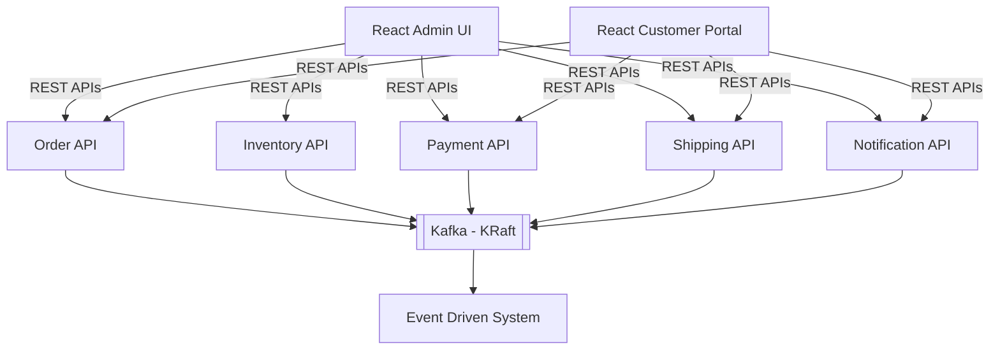

# AGENT.md

## Event-Driven Real-Time Order Processing System

*A Complete Spring Boot + React + Kafka (KRaft) Learning Repository*

---

## Objective

Build a production-grade, enterprise-style event-driven platform using modern Spring Boot practices.

This repository is designed to teach every major area of Spring Boot through realistic microservices while also covering frontend development with React, containerisation, Kubernetes deployment and modern software architecture.

The agent should build the project incrementally while following clean architecture and production-ready coding standards.

---

## Technology Baseline

- **Java 25 (LTS)** for every backend service, with **Spring Boot 4.1** (latest GA) as the baseline, paired with matching current-generation Spring Kafka, Spring Security, Spring Data JPA, MapStruct and springdoc-openapi versions compatible with it.
- **Virtual Threads** must be enabled on every service (`spring.threads.virtual.enabled=true`); Tomcat, JDBC calls, Kafka consumer/producer processing and `@Async`/scheduled work should run on virtual threads instead of platform thread pools. Avoid `synchronized` blocks; prefer `ReentrantLock` where locking is required.
- **React 19.2** (latest GA) as the baseline for both frontend apps, paired with the current stable TypeScript, Vite, TanStack Query, React Router, Material UI, React Hook Form and Zod versions compatible with it.
- Beyond these pinned baselines, always prefer the **latest stable release** of every other library in the stack at implementation time instead of pinning to older majors.
- Prefer modern patterns (React Compiler-friendly code, function components, hooks, no legacy class components).

---

## No Shared Libraries / No Monorepo Tooling

This repository is a collection of **fully independent Spring Boot projects**, not a monorepo with shared code.

- There is **no parent POM** and **no shared/common library** (no `common-event-library`, `common-security-library`, `common-api-library`, `common-exception-library`).
- Every service under `backend/` owns **its own** `pom.xml` (or Gradle build), and its own event classes, DTOs, mappers, security config and exception classes — duplication across services is expected and acceptable.
- Do not introduce cross-module Maven/Gradle dependencies between backend services. Services only communicate over the network (Kafka events / REST from the frontend), never via shared JARs.
- Do not extract multi-module Maven reactor builds, BOMs, or Gradle composite builds to "deduplicate" services — each service must build and deploy on its own.
- Each React app under `ui/` has its own `package.json`, its own components/hooks/API clients — no shared npm workspace or shared component library between `ui/admin-portal` and `ui/customer-portal`.

---

## Implementation Expectations

When asked to generate a service or feature, the AI Agent must produce **actual working implementation code**, not placeholders or scaffolding:

- Real controllers, services, repositories, entities, DTOs, mappers, Kafka producers/consumers, security config, and exception handlers with full method bodies — not `// TODO` stubs or empty classes.
- Real React components, hooks and API service files with working logic (state, effects, API calls, form validation) — not empty JSX shells or placeholder components.
- Configuration files (`application.yml`, `.env`, Dockerfiles, Helm values) should contain concrete, usable values consistent with the rest of the stack, not generic placeholders left for the user to fill in.

---

## High-Level Architecture



Every backend communicates through Kafka events.

REST should only be used by the frontend.

No backend service should directly call another backend unless absolutely necessary.

---

## Technology Stack

### Backend

- Java 25 (virtual threads enabled)
- Spring Boot 4.1
- Spring MVC
- Spring WebFlux (where appropriate)
- Spring Data JPA
- Spring Security
- Spring Validation
- Spring Cache
- Spring Scheduling
- Spring Events
- Spring Retry
- Spring Actuator
- Spring Kafka
- Spring Cloud Stream (optional advanced implementation)
- PostgreSQL
- Flyway
- MapStruct
- Lombok
- OpenAPI / Swagger
- Testcontainers
- JUnit 5
- Mockito
- Awaitility
- ArchUnit

---

### Messaging

- Apache Kafka
- Kafka KRaft Mode
- Dead Letter Topics
- Retry Topics
- Event Versioning
- Event Schema
- Idempotent Consumers

---

### UI

- React 19.2
- Vite
- React Router
- TypeScript
- TanStack Query
- Axios
- Material UI
- React Hook Form
- Zod
- Recharts

---

### Infrastructure

- Docker
- Docker Compose
- Helm
- Kubernetes
- Ingress
- NGINX Ingress Controller

---

## Repository Structure

```
event-driven-order-system/
├── charts/
├── docker-compose.yaml
├── docs/
├── scripts/
├── ui/
│   ├── admin-portal/
│   └── customer-portal/
├── backend/
│   ├── order-command-service/
│   ├── inventory-service/
│   ├── payment-service/
│   ├── shipping-service/
│   └── notification-service/
└── README.md
```

Each directory under `backend/` and `ui/` is a standalone, independently buildable project (its own build file, no shared parent, no shared library module).

---

## Common Structure for Every Spring Boot Service

```
backend/service-name/
├── src/
│   ├── main/
│   │   ├── java/
│   │   │   ├── config/
│   │   │   ├── controller/
│   │   │   ├── dto/
│   │   │   ├── entity/
│   │   │   ├── repository/
│   │   │   ├── service/
│   │   │   ├── mapper/
│   │   │   ├── event/
│   │   │   ├── consumer/
│   │   │   ├── producer/
│   │   │   ├── scheduler/
│   │   │   ├── validator/
│   │   │   ├── security/
│   │   │   ├── exception/
│   │   │   ├── util/
│   │   │   ├── constant/
│   │   │   ├── configuration/
│   │   │   ├── health/
│   │   │   ├── filter/
│   │   │   └── advice/
│   │   └── resources/
│   └── test/
├── Dockerfile
├── pom.xml
├── README.md
└── helm/
```

---

## Common Components Required in Every Service

Every backend must include:

- Spring Security
- JWT Authentication
- Role Based Access Control
- Global Exception Handler
- Validation
- DTO Layer
- Entity Layer
- Repository Layer
- Service Layer
- Controller Layer
- Mapper Layer
- Kafka Producer
- Kafka Consumer
- Unit Tests
- Integration Tests
- Dockerfile
- Helm Chart
- Kubernetes Deployment
- Kubernetes Service
- Ingress
- ConfigMap
- Secrets
- Health Checks
- Graceful Shutdown
- Swagger Documentation

---

## Authentication

Every project must include:

### Admin User

- **Username:** `admin`
- **Password:** `Admin@123`

Admin should be seeded automatically.

### Default Customer

- **Username:** `customer`
- **Password:** `Customer@123`

A sample customer should be seeded automatically for the Customer Portal.

---

## Roles

- ADMIN
- CUSTOMER

---

## Admin Dashboard

The React Admin Portal must include

- Dashboard
- Login
- User Management
- Orders
- Inventory
- Payments
- Shipping
- Notifications
- Kafka Event Monitor
- System Health
- Audit Logs

---

## Customer Portal

The React Customer Portal must include

- Login
- Register
- Home / My Dashboard
- Place Order
- My Orders
- Order Detail / Tracking
- Order Cancellation
- Notifications
- Profile

---

## Projects

### Project 1: Order Command Service

**Purpose**

Receives customer orders.

**Responsibilities**

- Create Order
- Cancel Order
- Update Order
- Publish OrderCreated Event
- Publish OrderCancelled Event

**Spring Topics**

- REST API
- Validation
- Spring Data JPA
- Transactions
- DTO Mapping
- OpenAPI

**Kafka Topics**

- `order-created`
- `order-cancelled`

---

### Project 2: Inventory Service

**Responsibilities**

- Reserve Inventory
- Release Inventory
- Stock Management

**Consumes**

- `order-created`

**Produces**

- `inventory-reserved`
- `inventory-failed`

**Spring Topics**

- Kafka Consumer
- Kafka Producer
- Retry
- Dead Letter Queue

---

### Project 3: Payment Service

**Responsibilities**

- Payment Processing
- Refund
- Payment Validation

**Consumes**

- `inventory-reserved`

**Produces**

- `payment-success`
- `payment-failed`

**Spring Topics**

- Spring Retry
- Transactions
- Idempotency

---

### Project 4: Shipping Service

**Responsibilities**

- Shipment Creation
- Shipment Tracking

**Consumes**

- `payment-success`

**Produces**

- `shipment-created`

**Spring Topics**

- Scheduling
- Async Processing

---

### Project 5: Notification Service

**Responsibilities**

- Email Notifications
- SMS Notifications
- Push Notifications

**Consumes**

All Events

**Produces**

None

**Spring Topics**

- Async
- Scheduling
- Event Listeners

---

## Shared Libraries

There are **no shared library modules** in this repository (see [No Shared Libraries / No Monorepo Tooling](#no-shared-libraries--no-monorepo-tooling) above). Each service defines and owns, locally within its own codebase:

- Its own Kafka event classes, event versions and event DTOs.
- Its own JWT/security filters, authentication and authorization configuration.
- Its own API response wrappers, pagination helpers and utilities.
- Its own exception classes and global error models.

Duplication of these concerns across `order-command-service`, `inventory-service`, `payment-service`, `shipping-service` and `notification-service` is expected and intentional.

---

## React Application: Admin Portal

Folder: `ui/admin-portal`

**Pages**

- Login
- Dashboard
- Orders
- Inventory
- Payments
- Shipping
- Notifications
- Users
- Settings

**Components**

- Navbar
- Sidebar
- Header
- Footer
- DataTable
- Charts
- Cards
- Dialogs
- Forms
- Loading
- Snackbar
- ProtectedRoute

**Hooks**

- `useOrders`
- `useInventory`
- `usePayments`
- `useShipping`
- `useNotifications`
- `useUsers`

**Services**

- `orderApi.ts`
- `inventoryApi.ts`
- `paymentApi.ts`
- `shippingApi.ts`
- `notificationApi.ts`
- `authApi.ts`

---

## React Application: Customer Portal

Folder: `ui/customer-portal`

A self-service portal for normal (`CUSTOMER` role) end users to place and track their own orders, distinct from the internal admin portal.

**Pages**

- Login
- Register
- Home / My Dashboard
- Place Order
- My Orders
- Order Detail / Tracking
- Order Cancellation
- Notifications
- Profile

**Components**

- Navbar
- Footer
- OrderForm
- OrderTable
- OrderTimeline
- OrderStatusBadge
- NotificationList
- ProfileForm
- Dialogs
- Loading
- Snackbar
- ProtectedRoute

**Hooks**

- `useAuth`
- `useMyOrders`
- `usePlaceOrder`
- `useOrderTracking`
- `useNotifications`
- `useProfile`

**Services**

- `authApi.ts`
- `orderApi.ts`
- `shippingApi.ts`
- `notificationApi.ts`
- `profileApi.ts`

**Access**

- Restricted to the `CUSTOMER` role, scoped to the authenticated customer's own orders only.
- No access to inventory, payments administration, Kafka event monitor or other customers' data.

---

## Docker

Every backend should include

- Multi-stage Dockerfile
- Non-root user
- Small image
- Health Check
- Environment Variables
- Build Cache Optimisation

The root `docker-compose.yaml` should start:

- PostgreSQL
- Kafka (KRaft)
- Kafka UI
- Order Service
- Inventory Service
- Payment Service
- Shipping Service
- Notification Service
- React Admin Portal
- React Customer Portal

---

## Helm

Each service should have

```
helm/
├── Chart.yaml
├── values.yaml
└── templates/
    ├── deployment.yaml
    ├── service.yaml
    ├── configmap.yaml
    ├── secret.yaml
    ├── ingress.yaml
    ├── hpa.yaml
    ├── serviceaccount.yaml
    └── _helpers.tpl
```

Best practices

- Resource limits and requests
- Readiness probes
- Liveness probes
- Rolling updates
- ConfigMaps
- Secrets
- Labels
- Selectors
- Values-driven configuration
- Separate values for local and production

---

## Ingress

Configure a single NGINX Ingress.

Example routes:

- `/api/orders`
- `/api/inventory`
- `/api/payment`
- `/api/shipping`
- `/api/notification`
- `/`
- `/admin`

The React Customer Portal should be served from `/`, and the React Admin Portal should be served from `/admin`.

---

## Testing Requirements

Every service must include:

### Unit Tests

- Service Layer
- Controller Layer
- Mapper Layer
- Validators
- Utility Classes

Target coverage: **> 90%**

---

### Integration Tests

- REST APIs
- Repository Layer
- Kafka Producers
- Kafka Consumers
- PostgreSQL
- Testcontainers

---

### Frontend Testing

Use

- Vitest
- React Testing Library

Include tests for

- Components
- Hooks
- Forms
- API Clients
- Protected Routes

---

## Spring Boot Best Practices

The agent must always follow modern Spring Boot best practices:

- Follow SOLID principles.
- Prefer constructor injection over field injection.
- Keep controllers thin and move business logic to services.
- Use DTOs for API contracts; never expose JPA entities directly.
- Use MapStruct for object mapping.
- Apply validation with Jakarta Bean Validation.
- Centralise exception handling with `@ControllerAdvice`.
- Keep configuration externalised using profiles and environment variables.
- Use immutable records for request/response DTOs where appropriate.
- Design idempotent Kafka consumers.
- Implement retries and Dead Letter Topics for failed event processing.
- Use transactional boundaries carefully to avoid partial updates.
- Follow package-by-feature where it improves cohesion.
- Maintain clear separation between domain, application and infrastructure concerns.
- Write meaningful logs without exposing sensitive information.
- Keep code readable, modular and testable.
- Use Flyway for database migrations.
- Generate OpenAPI documentation for every REST endpoint.
- Ensure all code passes static analysis and formatting checks.
- Document public APIs and complex business logic.

---

## Development Workflow

For every feature, the agent should:

1. Design the domain model.
2. Create database migrations.
3. Implement entities and repositories.
4. Build the service layer.
5. Expose REST APIs.
6. Add Kafka producers or consumers.
7. Implement React Admin Portal and Customer Portal UI changes.
8. Write unit tests.
9. Write integration tests.
10. Create Docker configuration.
11. Update Docker Compose.
12. Create or update Helm charts.
13. Verify deployment through Ingress.
14. Update project documentation.

---

## Explicit Exclusions

Do **not** include the following in this repository:

- Observability (Prometheus, Grafana, OpenTelemetry, Jaeger, Zipkin, etc.)
- Service Mesh
- API Gateway
- Distributed Tracing
- Monitoring or Logging stacks beyond basic application logging

The focus is on mastering Spring Boot, Kafka, React, containerisation, Kubernetes deployment and clean, production-ready application architecture.